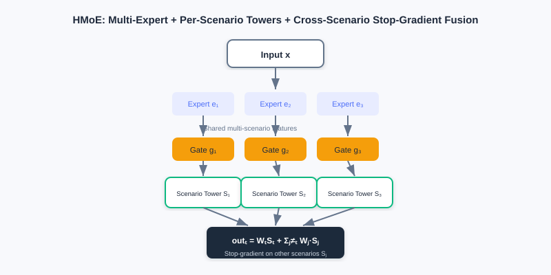
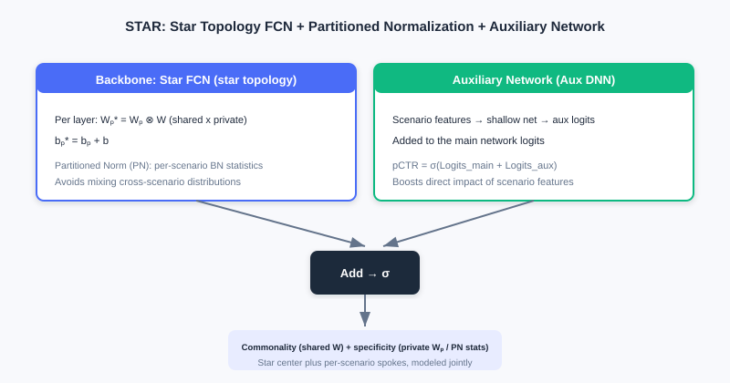
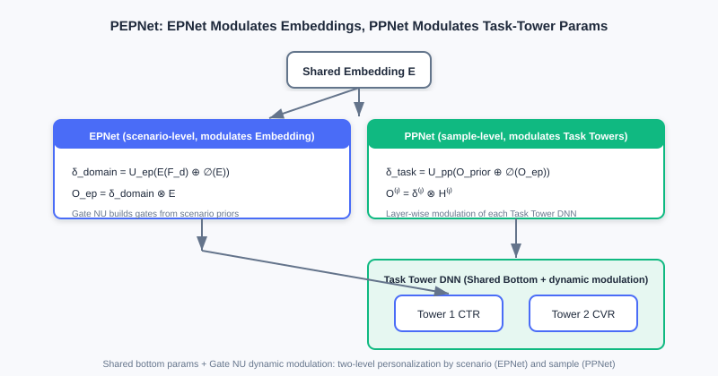

  📖
  ⏱️ ~50 min read
  🎯 Intermediate

# Multi-Scenario Modeling

> 📝 **Before You Continue:** Recommended: finish [3.4 Multi-Objective Optimization](./multi-objective.md) first. Multi-scenario and multi-task modeling look alike but differ at heart — multi-task handles multiple objectives in one scenario, while multi-scenario handles one objective across different scenarios; both rest on the design philosophy of "sharing + differentiation."

[3.4](./multi-objective.md) solved the multi-task problem of "predicting multiple objectives for the same sample." But industrial recommendation often faces **multiple scenarios**: one app may have home-feed recommendations, search result pages, and "guess you like" below the shopping cart — these scenarios have different data distributions yet must predict **the same objective** (e.g., CTR). This is **multi-scenario modeling**.

Training an independent model per scenario ignores cross-scenario commonality, leaves small scenarios data-starved and poorly performing, and multiplies resource costs; mixing all samples into one model ignores scenario differences and hurts accuracy. In this chapter we go from "multi-tower structures" (HMoE, STAR) to "dynamic-weight modeling" (PEPNet, APG, M2M), and see how to balance **scenario commonality** against **scenario specificity**.

After reading this chapter, you will be able to:

- **Distinguish** the essential difference between multi-task (multiple objectives in one scenario) and multi-scenario (one objective across different scenarios)
- Explain how **HMoE** uses multi-experts + multi-scenario towers + cross-scenario fusion (with stop-gradient) to model commonality
- Explain how **STAR** uses "star-topology FCN + partitioned normalization + an auxiliary network" to model shared and private parameters together
- Describe how **PEPNet**'s EPNet/PPNet use dynamic gating (Gate NU) to modulate shared parameters
- Work through 4 leveled practice problems comparing the two routes of multi-scenario structures: "physical isolation" vs "dynamic modulation"

---

## 3.5.0 Motivation: Multi-Task ≠ Multi-Scenario

First, clear up a common confusion:

- **Multi-task learning**: same sample, same scenario, predicting **multiple different objectives** (e.g., one sample gets both CTR and CVR).
- **Multi-scenario modeling**: different scenarios, different distributions, predicting **the same objective** (e.g., each scenario predicts its own CTR).

The former is "multiple objectives for one sample"; the latter is "the same objective for different samples." With independent per-scenario models, commonality is ignored (small scenarios suffer, resources explode); with one model trained on mixed samples, differences are ignored (accuracy drops).

> 💡 **Key Insight:** The core tension of multi-scenario modeling is — **how to share bottom-layer parameters (capturing commonality) while letting the model perceive scenario differences (capturing specificity)**. This chapter has two routes: ① **multi-tower structures** (physically isolating some parameters); ② **dynamic weights** (shared parameters + scenario/sample modulation).

### 🧠 Mental Model: Chain Stores vs Central Kitchen

> Think of multiple scenarios as a company's **multiple stores**. ① The multi-tower structure is like "each store has its own kitchen (scenario tower) but shares semi-finished products from a central kitchen (shared experts)." ② Dynamic weights are like "all stores use the same central kitchen, but each has a 'flavor adjuster' (Gate NU) that fine-tunes the same dishes to local tastes." The former separates kitchens; the latter adjusts flavors.

---

## 3.5.1 Multi-Tower Structures: HMoE and STAR

**HMoE (Hierarchical Mixture-of-Experts)** borrows from MMoE: the bottom has multiple experts extracting features shared across scenarios, and the top consists of **multiple scenario towers** (rather than task towers). For scenario $t$, the bottom fuses experts through a gate to get $M_t(x)=\sum_i G_i^t(x)E_i(x)$, and the final score fuses the outputs of multiple scenarios:

$$out_t(x) = W_t(x)S_t(x) + \sum_{j\neq t} W_j(x)\underbrace{S_j(x)}_{\text{stop gradient}}$$

The key: when fusing other scenarios' scores, **stop-gradient** blocks their gradient backpropagation — preventing scenario $a$'s samples from directly modifying scenario $b$'s parameters and preserving scenario awareness. Scenario $t$ thus uses its own tower while borrowing other scenarios' scores as reference, without mutual pollution.

HMoE's bottom experts extract cross-scenario shared features, and each scenario has a dedicated tower on top; when fusing other scenarios' scores, stop-gradient blocks gradients — borrowing commonality without mutual pollution.

**STAR (Star Topology Adaptive Recommender)** uses a star topology to model shared and private parameters together. Its **STAR FCN** fuses each scenario's layer parameters as an element-wise product of "shared + private":

$$W_p^\star = W_p \otimes W,\quad b_p^\star = b_p + b$$

where $W_p,W$ are the scenario-private and globally shared parameters. STAR has two more innovations: **Partitioned Normalization (PN)** — computing Batch Norm statistics (mean/variance) per scenario (avoiding cross-scenario statistical confusion); and an **auxiliary network** — feeding scenario features through a shallow network to get auxiliary logits added to the main trunk: $pCTR=\sigma(\text{Logits}_{main}+\text{Logits}_{aux})$.

STAR's star FCN fuses "shared center × scenario-private" as an element-wise product, plus partitioned normalization (per-scenario statistics) and an auxiliary network — distinguishing scenarios at both the parameter and normalization levels.

Left: multi-task — same sample, multiple objective towers. Right: multi-scenario — samples from different scenarios, same objective tower; the challenge is sharing commonality while preserving differences.

> **Analysis:** Multi-tower structures (HMoE/STAR) preserve scenario specificity with "physically isolated partial parameters" — intuitive and interpretable. HMoE's stop-gradient prevents scenario pollution; STAR's star FCN + PN separate scenarios at both the parameter and normalization levels. The cost: parameters grow with the number of scenarios (one tower / private parameters per scenario).

---

## 3.5.2 Dynamic-Weight Modeling: PEPNet

Multi-tower keeps specificity by "separating kitchens," but shares parameters poorly. PEPNet (Parameter and Embedding Personalized Network) flips the approach: the core network parameters are **shared across scenarios**, but their behavior is "modulated" through dynamically generated weights that are highly scenario/sample-specific — equivalent to injecting context into the shared network.

The core of PEPNet is the lightweight gating unit **Gate NU** (inspired by LHUC from speech recognition), which generates dynamic scaling weights with a two-layer network:

$$\boldsymbol{x}'=\text{ReLU}(\boldsymbol{x}W_1+b_1),\quad \delta=\gamma\cdot\text{Sigmoid}(\boldsymbol{x}'W_2+b_2)\in[0,\gamma]$$

The output $\delta$ is dimension-aligned with the target parameters and modulates them via element-wise multiplication $\otimes$. PEPNet uses two modules for layered personalization:

- **EPNet (scenario-aware Embedding personalization)**: feeds scenario priors through Gate NU to generate the gate $\delta_{domain}=U_{ep}(E(\mathcal{F}_d)\oplus \oslash(E))$, then multiplies element-wise with the shared embedding to get scenario-personalized embeddings $O_{ep}=\delta_{domain}\otimes E$. Note the stop-gradient applied to the shared embedding, leaving bottom-level learning undisturbed.
- **PPNet (user-aware parameter personalization)**: takes user/content/author ID priors + EPNet's scenario embedding as input, generates per-layer, per-task-tower gates $\delta_{task}$, and modulates every layer's output of the task-tower DNN: $O_{pp}^{(l)}=\delta_{task}^{(l)}\otimes H^{(l)}$. This is sample-level (not task-level) personalization, easing the multi-task seesaw.

Gate NU generates dynamic scaling weights from scenario/user priors; EPNet modulates the shared embedding (scenario personalization), PPNet modulates each task tower's DNN (sample personalization), while the bottom stays shared.

---

## 3.5.3 Dynamic Parameter Generation: APG and M2M

**APG (Adaptive Parameter Generation)** goes further: it **directly generates** the parameters for a given sample from that sample. The sample-aware input $z_i$ is reshaped by an MLP into a parameter matrix $W_i=\text{reshape}(\text{MLP}(z_i))$, and the prediction is $y_i=\sigma(W_i x_i)$. To control cost, APG uses **low-rank factorization**: $W_i=U_i S_i V_i$, where the private factor $S_i$ is generated from the sample and the shared factors $U,V$ are fixed; the forward pass uses the factored computation $y_i=\sigma(U_i(S_i(V_i x_i)))$ to reduce complexity. The shared $U/V$ capture commonality, the private $S_i$ captures specificity — balancing capacity and efficiency.

**M2M (meta-learning for multi-scenario multi-task)** uses a meta-learner (an MLP) to **dynamically generate** the task model's parameters $(W,b)$ from scenario/input features. The backbone contains expert representations $E_i$, task representations $T_t$, and a scenario representation $\tilde{S}$; the meta-learner unit turns the scenario representation $\tilde{S}$ into per-layer dynamic parameters applied to features (like an MLP injected with scenario information). It also applies meta-learner units in expert fusion (an Attention meta-network that introduces the scenario during fusion) and in the multi-task towers (Tower meta-networks in a residual style), achieving fine-grained scenario adaptation.

> 💡 **Key Insight:** The two routes of multi-scenario modeling converge — **multi-tower structures** preserve specificity with a "physically isolated parameter space" (divide and conquer); **dynamic weights / parameter generation** preserve specificity with "shared backbone + dynamic modulation" (injecting context). The latter is more parameter-efficient and flexible, but demands more from the design of the modulation / generation mechanism.

---

## ⚠️ Common Mistakes in 3.5

| # | Mistake | Example | Why It's Wrong | Fix |
|---|---------|---------|---------------|-----|
| 1 | Treating multi-scenario as multi-task | "Multi-scenario is just multi-task with a new name" | Multi-scenario = different distributions, same objective; multi-task = same distribution, multiple objectives | First ask "do the sample distributions differ?" |
| 2 | Fusing HMoE without stop-gradient | "Just add cross-scenario scores directly, gradients flow too" | Scenario a's samples would modify scenario b's parameters, polluting awareness | Add stop-gradient to other scenarios' scores |
| 3 | Missing PN's motivation in STAR | "Global BN statistics are fine" | Mixed multi-scenario samples are not i.i.d. | Use partitioned normalization with per-scenario statistics |
| 4 | Confusing EPNet with PPNet | "Both modulate the task towers" | EPNet modulates embeddings (scenario-level); PPNet modulates towers (sample-level) | EPNet = scenario-level, PPNet = sample-level |

---

## Chapter Summary

### 📌 Key Takeaways

| Concept | Key Points | Why It Matters |
|---------|-----------|----------------|
| Multi-scenario vs multi-task | Different distributions, same objective vs same distribution, multiple objectives | Identify the problem type before modeling |
| HMoE multi-tower | Multi-experts + scenario towers + cross-scenario stop-gradient fusion | Shares commonality, preserves scenario awareness |
| STAR star topology | Shared ⊗ private parameters + partitioned normalization + auxiliary network | Separates scenarios at both parameter and normalization levels |
| PEPNet | Gate NU dynamic modulation: EPNet (Embeddings) + PPNet (towers) | Shared backbone + dynamic personalization |
| APG / M2M | Sample/scenario dynamic parameter generation (meta-learning) | Most flexible, parameter-efficient |

### ❓ FAQ

**Q1: When to use multi-tower, and when dynamic weights?**
> A: Few scenarios with big differences and a need for strong interpretability → multi-tower (HMoE/STAR); many scenarios, parameter-efficiency sensitivity, and fine-grained sample personalization → dynamic weights (PEPNet/APG/M2M). The two can also be combined.

**Q2: Why does STAR's star FCN use an element-wise product?**
> A: $W_p^\star=W_p\otimes W$ makes each scenario's final parameters "shared center × scenario increment" — inheriting commonality while carrying specificity; multiplication (rather than mere addition) lets the private parameters "amplify/suppress" the shared ones as modulation.

**Q3: Why does PEPNet's EPNet apply stop-gradient to the shared embedding?**
> A: To prevent the scenario-personalization gate branch's backpropagated gradients from corrupting the bottom-level shared embedding's general learning — decoupling "commonality" from "scenario differences."

### 🔗 Connections to Later Chapters

- In **3.4 (Multi-Objective)**, the MMoE/PLE idea evolves in multi-scenario settings into HMoE's multi-experts + multi-towers; PEPNet's PPNet simultaneously eases the multi-task seesaw.
- **Part 4 re-ranking** optimizes list-level experience on top of ranking (multi-scenario, multi-objective scoring).
- The end-to-end architectures of **generative recommendation (in the next volume)** can be seen as a further unification of "multi-scenario / multi-task towers."

---

## Practice Problems

Work through all problems in order — they get progressively harder. Each has a complete solution you can reveal after trying it yourself.

---

**Problem 3.5.1 — Multi-Task or Multi-Scenario?** 🟢 Easy

Decide whether each case is "multi-task" or "multi-scenario," and explain why:

- (a) The same home-feed recommendation stream predicts both click-through rate and conversion rate for one sample.
- (b) Two differently distributed traffic sources of the same app — "home feed" and "search results page" — each predicting click-through rate.

💡 Solution (click to reveal)

**Approach:** Ask "are the sample distributions the same, and are the objectives the same?"

- (a) **Multi-task**: same scenario (home feed), same distribution, predicting **multiple different objectives** (CTR, CVR).
- (b) **Multi-scenario**: different distributions (home vs search), different samples, predicting **the same objective** (CTR).

**Key points:**
- Multi-task = same distribution, multiple objectives; multi-scenario = different distributions, same objective.
- Both rely on "sharing + differentiation," but the differentiation targets "objectives" vs "distributions."

---

**Problem 3.5.2 — HMoE's stop-gradient** 🟢 Easy

HMoE applies stop-gradient when fusing other scenarios' scores. Briefly state: what goes wrong **without** stop-gradient?

💡 Solution (click to reveal)

**Approach:** Think from the angle of "scenario parameter pollution."

In HMoE's fusion formula, the other scenarios' $S_j(x)$ carry stop-gradient to block gradient backpropagation. Without it: scenario $a$'s samples participate in scenario $b$'s score fusion during the forward pass, so during backprop gradients flow along the fusion path and modify scenario $b$'s tower parameters — scenario $b$'s representation gets disturbed by scenario $a$'s samples, the model's scenario awareness degrades, and multi-scenario performance drops.

**Key points:**
- stop-gradient isolates cross-scenario gradients, preserving "each scenario affects only its own parameters."
- This is the key to HMoE borrowing other scenarios' information without mutual pollution.

---

**Problem 3.5.3 — STAR's Innovations** 🟡 Medium

Compared with "independently training one model per scenario," what sharing designs does STAR make to balance commonality and specificity? List at least two and explain their roles.

💡 Solution (click to reveal)

**Approach:** Recall STAR's three innovations.

1. **Star FCN**: $W_p^\star=W_p\otimes W$ — each scenario's parameters = shared center × scenario-private, inheriting commonality while carrying specificity, avoiding fully independent models.
2. **Partitioned Normalization (PN)**: computes BN's mean/variance per scenario, avoiding the statistical confusion caused by non-i.i.d. mixed multi-scenario samples.
3. **Auxiliary network**: scenario features pass through a shallow network to produce auxiliary logits added to the main trunk, strengthening the direct influence of scenario features on the output.

**Key points:**
- Commonality comes from shared $W$ / PN's shared parameters; specificity from $W_p$ / PN's per-scenario statistics.
- Saves parameters versus independent models, and small scenarios can borrow commonality.

---

**Problem 3.5.4 — Small Scenarios and Star Sharing** 🔴 Hard

STAR uses $W_p^\star = W_p \otimes W$: each scenario's private parameters $W_p$ fused by element-wise product with the globally shared $W$. If a scenario has very little data, its private parameters $W_p$ easily overfit. Using the star structure, explain why the shared center $W$ alleviates this problem, and describe PN's (partitioned normalization) additional role in this setting.

💡 Solution (click to reveal)

**Approach:** Look from two angles: "small private parameter count, constrained by sharing" and "normalization stability."

1. The final parameters are $W_p\otimes W$: although the private $W_p$ overfits easily on few samples, it only performs "amplify/suppress" modulation of the shared center $W$, and the main capability still comes from the data-rich shared $W$. The private parameters are relatively small in dimension and multiplicatively constrained by the shared ones, so their overfitting influence is diluted — sharing acts as regularization.
2. PN computes BN's mean/variance per scenario. If a small scenario were mixed into globally pooled batches, its statistics would be dominated by large scenarios and normalization would be unstable; PN lets the small scenario use **its own** statistics, training more stably and further easing representation shift under few samples.

**Key points:**
- Star topology = shared fallback + private fine-tuning, naturally resistant to small-scenario overfitting.
- PN adds distribution-level scenario isolation.

---

**🏆 Challenge: Pick a Route and Defend It**

A platform has 6 different scenarios (home feed / search / shopping cart / channel pages / push notifications / feed stream), all predicting CTR, with 3 scenarios having very little data. The team has limited resources and wants parameter efficiency without small scenarios collapsing. Choose the "multi-tower" or "dynamic weights" route and justify it (within 150 words), and name a concrete model you could build on if you choose dynamic weights.

💡 Hint

6 scenarios, parameter-sensitive, weak small scenarios → choose the **dynamic weights** route: shared backbone + dynamic modulation, parameter-efficient, with small scenarios borrowing shared commonality instead of collapsing. You could build on **PEPNet** (Gate NU modulating embeddings and towers) or **APG** (sample-wise dynamic parameter generation); multi-tower grows parameters linearly with scenario count at 6 scenarios, and small scenarios' independent towers easily underfit.

