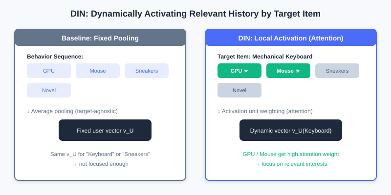
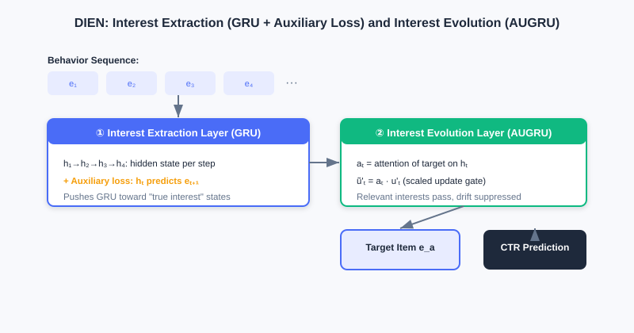
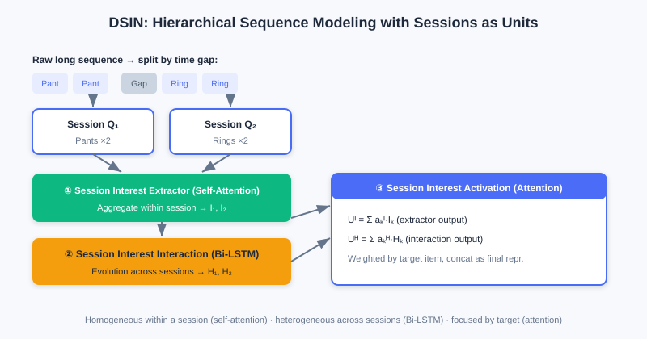

  📖
  ⏱️ ~45 min read
  🎯 Advanced

# Sequence Modeling

> 📝 **Before You Continue:** Recommended: finish [3.2 Feature Crossing](./feature-crossing.md) first. Feature crossing treats user history as a "static feature bag"; this chapter introduces the **time dimension** — understanding this shift of perspective is the key to reading this chapter.

The various crossing models of [3.2](./feature-crossing.md) all aim to mine value from a **static feature set**. But they share a limitation: user history is treated as an unordered "bag of items." Yet user interests are not static — they have clear **temporal structure** and **dynamic evolution**.

Consider this difference: a user who browses "mouse" then "monitor" has a completely different purchase intent from one who browses "novel" then "monitor" — the former may be a digital enthusiast assembling a PC, the latter maybe just browsing casually. Traditional crossing models cannot capture intent encoded in order. In this chapter we upgrade user history from a "static bag" to a "dynamic sequence," and see how three representative industrial models — **DIN / DIEN / DSIN** — tame time.

After reading this chapter, you will be able to:

- Explain how **DIN's local activation** breaks through the "fixed-length user vector" bottleneck, and why its attention weights are **not** Softmax-normalized
- Explain how **DIEN** uses an auxiliary loss + AUGRU to explicitly model the temporal evolution of interests
- Describe how **DSIN** uses the "session" as its basic unit for hierarchical modeling (intra-session self-attention, inter-session Bi-LSTM)
- Use the interactive demo to observe how DIN dynamically activates different historical behaviors depending on the candidate ad
- Work through 4 leveled practice problems to consolidate the three pillars of sequence modeling: "dynamic / sequential / focused"

---

## 3.3.0 Motivation: From Static Feature Bag to Dynamic Sequence

On large e-commerce platforms, user interests are **diverse**: the same user may follow digital gadgets, watch sports content, and buy daily necessities. The traditional Embedding & MLP paradigm pools all of a user's historical behavior embeddings into **one fixed-length vector** to represent the user — and there's the problem: whether you recommend "running shoes" or "phones," the same vector represents them. Trying to cram all interests in "equally" is both difficult and insufficiently focused for the specific task.

> 💡 **Key Insight:** A user's concrete click is usually activated by only **a fraction** of their historical interests. When recommending a "mechanical keyboard" to a digital enthusiast, what really matters is their recent "gaming mouse" and "graphics card" behavior — not the running shoes they bought last month. Interest representations should **change dynamically with the candidate**.

### 🧠 Mental Model: Not a Resume, but a Spotlight

> Think of the traditional "fixed user vector" as a **static resume** — all experience squeezed onto one page, identical for every reader. Think of DIN's "local activation" as **a spotlight**: when a candidate ad arrives, the light falls only on the few relevant segments of history while the rest dims. The candidate hasn't changed, but "how they appear under the light" changes with the interviewer (the candidate).

---

## 3.3.1 DIN: Attention via Local Activation

The core of the Deep Interest Network (DIN) is **local activation**: the user interest representation should not be fixed but should change dynamically with the candidate ad $A$. To this end DIN introduces a **local activation unit** (attention) that computes a "weighted sum" over the embeddings of user $U$'s historical behaviors:

$$\boldsymbol{v}_U(A) = \sum_{j=1}^{H} a(\boldsymbol{e}_j, \boldsymbol{v}_A)\boldsymbol{e}_j = \sum_{j=1}^{H} w_j \boldsymbol{e}_j$$

where $\boldsymbol{e}_j$ is the historical behavior embedding, $\boldsymbol{v}_A$ is the candidate ad embedding, and the activation unit $a(\cdot)$ is typically a small feedforward network that takes $(\boldsymbol{e}_j, \boldsymbol{v}_A)$ and outputs weight $w_j$. The more relevant a behavior is to the ad, the larger its weight, and the more it dominates the final interest vector.

A key detail: **DIN's attention weights $w_j$ are not Softmax-normalized**, i.e., $\sum w_j$ is not necessarily 1. This preserves the **absolute strength** of interest — if most of the user's history is highly relevant to an ad, the weighted-sum vector has a large norm; otherwise, a small one. The model thus senses both the "direction" and the "strength" of interest.

Left: the baseline model pools all history into a fixed vector (candidate-independent). Right: DIN uses an activation unit to compute attention per candidate; relevant history (graphics card, mouse) is highlighted and up-weighted while irrelevant history (running shoes) is down-weighted, yielding an interest vector that varies with the candidate.

> **Analysis:** DIN breaks the fixed-vector bottleneck with lightweight attention, significantly improving expressiveness under diverse interests at small computational cost (just one added activation unit). Limitation: it still treats history as an **unordered set**, ignoring **temporal dependencies** between behaviors — interests evolve rather than stand still. Complexity mainly lies in the attention-scoring feedforward network, growing linearly with sequence length.

---

## 3.3.2 DIEN: Modeling Interest Evolution

DIN captures "diversity + local activation" but treats history as an unordered set, ignoring **temporal dependencies**. The Deep Interest Evolution Network (DIEN) asks: knowing what a user liked in the past is not enough — you must understand **how interests change** to predict the next step better. DIEN realizes this with a two-stage structure.

**Stage one: the Interest Extractor Layer.** A GRU processes the behavior embedding sequence $\boldsymbol{e}_1,\ldots,\boldsymbol{e}_T$ over time. But can the GRU hidden state really represent "interest"? DIEN adds an **auxiliary loss**: the hidden state $\boldsymbol{h}_t$ at time $t$ must predict the true next behavior $\boldsymbol{e}_{t+1}$ (positive sample) against negatively sampled behaviors (negative samples):

$$L_{aux} = -\frac{1}{N}\sum_{i=1}^N\sum_{t=1}^T\left[\log\sigma(\boldsymbol{h}_t^i,\boldsymbol{e}_{b[t+1]}^i) + \log(1-\sigma(\boldsymbol{h}_t^i,\hat{\boldsymbol{e}}_{b[t+1]}^i))\right]$$

It is added to the final CTR loss: $L = L_{target} + \alpha L_{aux}$. This extra supervision forces the GRU to learn more meaningful interest representations.

**Stage two: the Interest Evolving Layer.** With the interest state sequence in hand, a GRU with attention-based update gates (**AUGRU**) models the evolution. The attention score $a_t$ is determined by the interest state $\boldsymbol{h}_t$ at time $t$ and the candidate ad $\boldsymbol{e}_a$: $a_t = \frac{\exp(\boldsymbol{h}_t W \boldsymbol{e}_a)}{\sum_j \exp(\boldsymbol{h}_j W \boldsymbol{e}_a)}$, which then scales the GRU update gate $\tilde{u}'_t = a_t \cdot u'_t$. Interest relevant to the candidate passes through smoothly, while irrelevant "interest drift" is suppressed.

The interest extractor layer uses a GRU with the "predict the next behavior" auxiliary loss to learn true interest states; the interest evolving layer uses AUGRU (attention-scaled update gates) to let interest paths relevant to the candidate pass through while suppressing interest drift.

> **Analysis:** DIEN explicitly models the temporal evolution of interests, matching the fact that "interests change" better than DIN, and performs better in scenarios with long sequences and obvious interest drift. The cost is a more complex structure — GRU + auxiliary loss + AUGRU bring higher training and inference costs — and the GRU's sequential computation is hard to parallelize.

---

## 3.3.3 DSIN: From Behavior Sequence to Session Sequence

From DIN to DIEN, interest understanding moved from "static relevance" to "dynamic evolution," but both treat behaviors as one continuous sequence. In reality user behavior is often **interrupted**: intent is concentrated within a **session**, while interests may shift dramatically between sessions. DSIN (Deep Session Interest Network) takes the "session" as its basic unit and models hierarchically.

DSIN has four layers:

1. **Session Division Layer**: splits the long sequence into multiple short session sequences $Q_1,\ldots,Q_K$ by time gaps (e.g., >30 minutes).
2. **Session Interest Extracting Layer**: applies **self-attention** (Transformer-style) within each session to capture intra-session relations and aggregates into a session interest vector $I_k$.
3. **Session Interest Interacting Layer**: applies **Bi-LSTM** to the session sequence $[I_1,\ldots,I_K]$ to capture evolution across sessions.
4. **Session Interest Activating Layer**: weighted-sums session interests with attention based on the candidate ad (in the same lineage as DIN):

$$\boldsymbol{U}^I = \sum_{k=1}^K a_k^I \boldsymbol{I}_k,\quad \boldsymbol{U}^H = \sum_{k=1}^K a_k^H \boldsymbol{H}_k$$

DSIN splits the long sequence into sessions: self-attention aggregates within each session (homogeneous), Bi-LSTM transfers across sessions (heterogeneous), and finally attention activates relevant sessions per candidate — a fine-grained depiction of "intra-session aggregation + inter-session transfer."

> 💡 **Key Insight:** The three sequence models embody three progressive ideas — **dynamism** (DIN: interest shifts with the task), **sequentiality** (DIEN: exploits temporal order and evolution), and **focus** (DSIN: hierarchical by session, activated by candidate). Together they upgrade the "static bag of items" into a "dynamic sequence that tasks can focus on."

---

## 3.3.4 Interactive Demo: DIN Attention Activation

The interactive demo below lets you feel DIN's core: given the same user (fixed historical behaviors), switching to a different candidate ad makes the highlighted, activated history **completely different**. Click "Next" to switch candidates and watch the spotlight move across different histories.

<iframe src="../viz/part3-din-attention.html?embed&vizId=part3-din-attention" style="width:100%; height:520px; border:none; display:block;" loading="lazy"></iframe>

In the demo, the user's history includes "graphics card, mouse, running shoes, novel," and more. When the candidate is "mechanical keyboard," graphics card / mouse are activated; switch the candidate to "running socks" and the spotlight turns to running shoes — an intuitive display of "local activation."

---

## ⚠️ Common Mistakes in 3.3

| # | Mistake | Example | Why It's Wrong | Fix |
|---|---------|---------|---------------|-----|
| 1 | Thinking DIN uses a fixed user vector | "DIN pools history into one vector" | DIN uses attention to **dynamically** generate a vector that changes with the candidate | Distinguish baseline pooling (fixed) vs local activation (dynamic) |
| 2 | Adding Softmax to DIN's attention | "Weights must sum to 1 to be proper" | DIN deliberately does **not** normalize to preserve interest strength | Understand: preserving the norm = preserving strength information |
| 3 | Assuming DIEN is just a GRU | "DIEN = two stacked GRU layers" | The crucial **auxiliary loss** and **AUGRU** are also there | Both stages are indispensable: extraction + evolution |
| 4 | Treating DSIN as a long-sequence RNN | "DSIN just runs one RNN over the whole sequence" | DSIN first splits by session, then models hierarchically (self-attention + Bi-LSTM) | The session is the basic unit; model hierarchically |

---

## Chapter Summary

### 📌 Key Takeaways

| Concept | Key Points | Why It Matters |
|---------|-----------|----------------|
| DIN local activation | $v_U(A)=\sum w_j e_j$, weights not Softmax-normalized | Interest varies with the candidate, breaking the fixed-vector bottleneck |
| DIEN evolution | GRU + auxiliary loss extracts interest; AUGRU evolves it | Explicitly models temporal interest change, resists drift |
| DSIN sessions | Session division → self-attention → Bi-LSTM → activation | Hierarchical depiction: homogeneous within sessions, heterogeneous across |
| Three pillars | Dynamism / sequentiality / focus | The core progressive ideas of sequence modeling |

### ❓ FAQ

**Q1: Without Softmax normalization, doesn't the model become "unstable"?**
> A: Quite the opposite. Softmax squeezes weights into a probability distribution (summing to 1), losing the information of "how relevant this user is overall." DIN preserves the norm, so the vector represents both direction and strength — closer to business intuition.

**Q2: What does DIEN's auxiliary loss do?**
> A: It adds "predict the next behavior" supervision to every GRU hidden state, forcing the states to genuinely encode "interest" rather than noise — otherwise the GRU hidden state doesn't necessarily represent a meaningful interest state.

**Q3: When should I use DSIN instead of DIN/DIEN?**
> A: When user behavior is clearly "session-like" (concentrated browsing in short bursts with long gaps) and interests differ greatly across sessions, DSIN's hierarchical modeling fits the actual behavior pattern better.

### 🔗 Connections to Later Chapters

- In **3.4 (Multi-Objective)**, models like ESMM often use sequence models (e.g., DIN) as the underlying backbone.
- **Part 4 re-ranking** optimizes list-level experience on top of ranking outputs; the understanding of "user intent" from sequence modeling matters for re-ranking diversity too.
- The sequence generation idea of **generative recommendation (in the next volume)** shares its roots with this chapter's "treat history as a sequence," only moving toward autoregressive decoding.

---

## Practice Problems

Work through all problems in order — they get progressively harder. Each has a complete solution you can reveal after trying it yourself.

---

**Problem 3.3.1 — Distinguish the Model Ideas** 🟢 Easy

Match each description to DIN / DIEN / DSIN:

- (a) Aggregates within each session with self-attention, transfers across sessions with Bi-LSTM, and finally activates by candidate.
- (b) Computes attention weights over historical behaviors to get a candidate-varying interest vector, with un-normalized weights.
- (c) Extracts interest with a GRU plus auxiliary loss, then models evolution with attention-based update gates (AUGRU).

💡 Solution (click to reveal)

**Approach:** Grasp each model's most signature structure.

- (a) **DSIN** (session division + self-attention + Bi-LSTM + activation)
- (b) **DIN** (local-activation attention, weights not Softmax-normalized)
- (c) **DIEN** (interest extractor layer + interest evolving layer AUGRU)

**Key points:**
- DIN = dynamic activation; DIEN = temporal evolution; DSIN = session hierarchy.

---

**Problem 3.3.2 — Why DIN Skips Softmax** 🟢 Easy

DIN's attention weights $w_j$ are not Softmax-normalized. Briefly state what useful information this design preserves, with an example.

💡 Solution (click to reveal)

**Approach:** Think in terms of "strength" rather than "distribution."

Without Softmax, $\sum w_j$ is not necessarily 1, and the **norm** of the weighted-sum vector preserves the **absolute relevance strength** between the user's interests and the candidate. For example: if 80% of a user's history relates to "mechanical keyboards," the vector norm is large, indicating "strong interest"; if only 10% relates, the norm is small. Softmax would compress both into "summing to 1," losing this strength difference.

**Key points:**
- Preserving the norm = preserving interest strength information.
- The model senses both "direction" and "strength."

---

**Problem 3.3.3 — Motivation Follow-up** 🟡 Medium

Why does DIEN introduce an "auxiliary loss" beyond the GRU? What goes wrong if the GRU is trained with only the final CTR loss?

💡 Solution (click to reveal)

**Approach:** Start from "whether the GRU hidden state truly represents interest."

The GRU hidden state $h_t$ should in theory contain all information up to time $t$, but with only the final CTR loss, the model may let the hidden state encode noise or shortcut features unrelated to "interest." The auxiliary loss forces $h_t$ to predict the true behavior at $t+1$ (positive) rather than negatives — adding "interest prediction" supervision to every step, making the states express latent interest more precisely and making the downstream AUGRU evolution more reliable.

**Key points:**
- The auxiliary loss = per-step interest supervision, preventing hidden states from drifting off course.
- It is the key to DIEN's effective "interest extraction."

---

**Problem 3.3.4 — Auxiliary Loss and Negative Sampling** 🔴 Hard

DIEN's auxiliary loss $L_{aux}$ uses both positive samples (the true next behavior $e_{t+1}$) and negatively sampled ones $\hat{e}_{t+1}$. If we drop negative sampling and only let $h_t$ predict $e_{t+1}$ with positives, what goes wrong? Analyze from the perspective of GRU hidden-state representation.

💡 Solution (click to reveal)

**Approach:** Ask whether the supervision signal is discriminative enough for interest.

With positives only, $h_t$ just needs a large inner product with $e_{t+1}$, with no constraint on "what it should NOT resemble" — the model can learn a degenerate solution (e.g., pushing all $h_t$ toward a fixed direction, or collapsing embeddings) that still scores positives highly while losing discriminativeness. Negative sampling provides the "contrastive" signal: forcing $h_t$ to be close to the true next behavior and far from random ones, so the hidden state genuinely encodes "interest" rather than a trivial solution.

**Key points:**
- Negatives = contrastive supervision, preventing representation collapse.
- Without negative sampling the auxiliary loss is too weak; interest representation quality drops, and downstream AUGRU suffers.

---

**🏆 Challenge: Pick and Defend a Model**

A short-video app's users: (1) highly diverse interests (gaming / food / knowledge); (2) dense behavior but frequent sudden topic switches driven by trending events (strong interest drift); (3) multiple short browsing bursts on different content within a day. Based on this, pick one of DIN / DIEN / DSIN and justify it (within 150 words), and state the main reason for rejecting the other two.

💡 Hint

"(3) multiple short bursts on different content" strongly suggests session structure → prefer **DSIN**: self-attention aggregates within sessions, Bi-LSTM handles topic switches (drift) across sessions. DIN ignores temporal order and drift; DIEN treats the whole sequence as continuous and models "fault-line" switches less naturally than hierarchical sessions.

