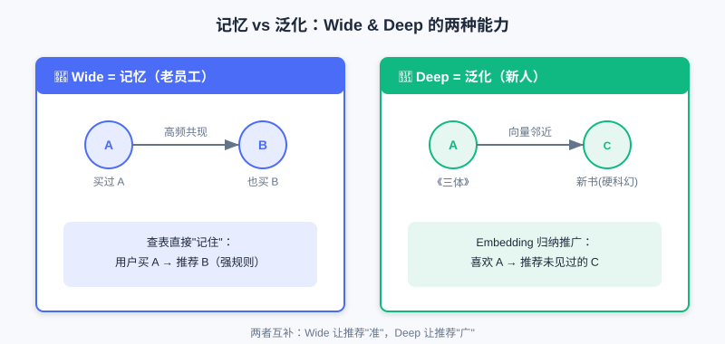
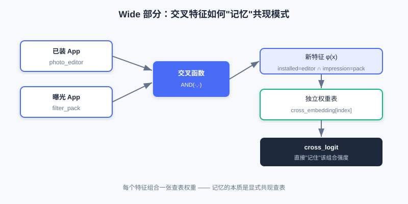
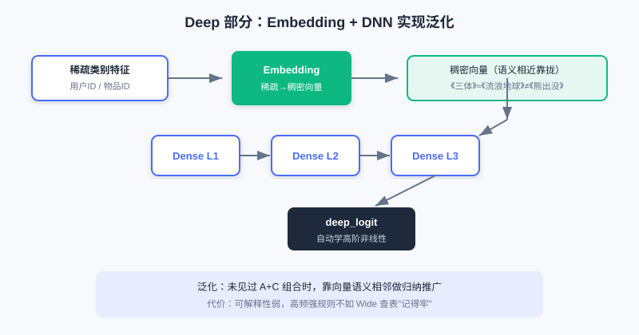
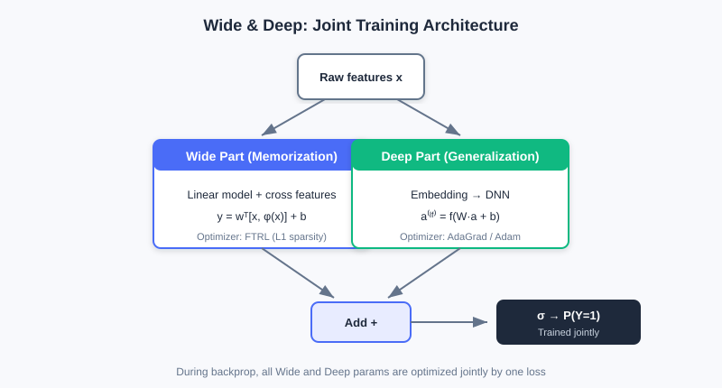

<div class="badge-row">
  <span style="background: #f0f4ff; color: #4A6CF7; padding: 4px 12px; border-radius: 20px; font-size: 0.85em; font-weight: 600; border: 1px solid rgba(74,108,247,0.2);">📖</span>
  <span style="background: #f0fdf4; color: #16a34a; padding: 4px 12px; border-radius: 20px; font-size: 0.85em; border: 1px solid rgba(22,163,74,0.2);">⏱️ ~30 min read</span>
  <span style="background: #fef9ec; color: #d97706; padding: 4px 12px; border-radius: 20px; font-size: 0.85em; border: 1px solid rgba(100,100,100,0.15);">🎯 Intermediate</span>
</div>

# Wide & Deep

> 📝 **Before You Continue:** Please read [1.3 Feature and Embedding Basics](../part1-introduction/feature-embedding-basics.md) first and understand sparse / dense features and lookup vectors; also recommended: finish the retrieval chapters of **Part 2** so you know the engineering position of "candidates ready, ranking must score precisely."

When you search for a product in an app and the system recommends it, a ranking model computed scores for hundreds or thousands of candidates in milliseconds behind the scenes. But before 2016, industrial ranking models faced an awkward trade-off: **either memorize historical patterns or learn to generalize — having both was hard**.

The Wide & Deep model (Google, 2016) offered a plain yet far-reaching answer: since both capabilities are needed, design two components and let them train **jointly**, each doing its own job. It remains the baseline model for countless recommendation businesses and the starting point of all subsequent deep ranking models. After reading this chapter, you will not only be able to explain its structure, but also understand "why the split was designed this way."

After reading this chapter, you will be able to:

- Distinguish **memorization** from **generalization** in **one sentence** each, with a recommendation scenario example for both
- Write out the linear formula of the **Wide part** and explain how **cross-product features** embody memorization
- Explain how the **Deep part** achieves generalization via Embedding + DNN, and how it fundamentally differs from Wide
- Recite the prediction formula of **jointly trained Wide & Deep**, and explain why Wide / Deep often use different optimizers
- Work through 4 leveled practice problems to consolidate the "memorization + generalization" design idea

---

## 3.1.0 A Seemingly Contradictory Pair of Goals: Memorization and Generalization

When building recommendation models, we often pursue two goals at once: **memorization** and **generalization**.

- **Memorization** means the model learns and remembers feature combinations that frequently co-occur in historical data, e.g., "users who bought A usually also buy B." It precisely captures explicit, high-frequency associations and gives users highly relevant recommendations — but is powerless when facing combinations it has never seen.
- **Generalization** means the model learns deep relationships between features and can handle combinations rarely seen in training, e.g., "item A and item C belong to the same category; users who like A may also like C." Even if the user has never interacted with C, the model can still make a reasonable recommendation.

> 💡 **Key Insight:** Memorization makes recommendations "precise"; generalization makes them "broad." Memorization alone traps users in a filter bubble and cannot handle new items; generalization alone loses those high-value historical strong rules. The essence of Wide & Deep is to give **one model both capabilities**.



The memorization path on the left captures high-frequency strong rules like "people who buy A also buy B"; the generalization path on the right maps items into a vector space so the model can recommend similar items it has never seen (e.g., new books near *The Three-Body Problem*).

### 🧠 Mental Model: Veteran Employee vs Newcomer

> Think of the **Wide (memorization)** part as an employee who has been at the company for twenty years: he remembers every historical "rule" (cross-product feature) — who always shows up with whom, he knows it cold. Think of the **Deep (generalization)** part as a systematically trained newcomer: he hasn't memorized all the rules, but knows how to reason by analogy and can handle combinations he has never seen. A good team needs both.

---

## 3.1.1 The Shortcut of Memorization: The Wide Part

The Wide part is essentially a **generalized linear model** (such as logistic regression). It is structurally simple, highly interpretable, and good at "memorizing" obvious association rules. Its mathematical form:

$$y = \boldsymbol{w}^T \boldsymbol{x} + b$$

where $y$ is the prediction, $\boldsymbol{w}$ the weights, $\boldsymbol{x}$ the feature vector, and $b$ the bias.

The key of the Wide part is that the input $\boldsymbol{x}$ contains not only raw features but also a large number of **manually designed cross-product features**. A cross-product feature combines multiple independent features into a new one to capture specific co-occurrence patterns. For example, in app store recommendation we can construct:

```
AND(installed_app=photo_editor, impression_app=filter_pack)
```

This stands for "the user has installed a photo editor AND is currently shown a filter pack recommendation." Through such cross features, the Wide part can directly and quickly learn strong associations like "photo editor users have a higher willingness to install filter packs" — a direct embodiment of memorization.



Raw features on the left (installed apps, impression apps) are combined by a cross function into a new feature, which then looks up an independent weight table, directly "remembering" the co-occurrence strength of that pair.

| Component | Role | Analogy |
|------|------|------|
| Raw features $\boldsymbol{x}$ | Basic user/item attributes | Employee files |
| Cross features $\phi(\boldsymbol{x})$ | Manually combined co-occurrence patterns | The "rules" in a veteran's head |
| Weights $\boldsymbol{w}_{wide}$ | Strong/weak memory for each combination | How much a rule is trusted |

> 💡 **Key Insight:** The essence of the Wide part's "memorization" is **assigning an independent weight to every feature combination and directly remembering historical co-occurrences via lookup**. The cost: these features must be hand-designed by experts, and they cannot generalize to unseen combinations.

---

## 3.1.2 Learning Complex Relations: The Deep Part

The Deep part is a **standard feedforward neural network (DNN)** responsible for the model's "generalization." Unlike Wide, which depends on manual feature engineering, the Deep part can learn high-order, nonlinear relationships between features **automatically**.

Its workflow has two steps. First, high-dimensional sparse categorical features (user ID, item ID) are mapped by an **embedding layer** to low-dimensional dense vectors — these vectors capture latent semantics. For example, the IDs of *The Wandering Earth* and *The Three-Body Problem* end up closer in the embedding space than *The Wandering Earth* and *Boonie Bears*. Then the embedding vectors are concatenated with other numerical features and fed forward through multiple layers:

$$a^{(l+1)} = f(W^{(l)}a^{(l)} + b^{(l)})$$

where $a^{(l)}$ is the activation of layer $l$, $W^{(l)}$, $b^{(l)}$ are weights and biases, and $f$ is an activation function (such as ReLU). Layer-by-layer abstraction lets the DNN discover hidden complex patterns and make reasonable predictions for unseen feature combinations.



Sparse categorical features are first embedded into dense vectors (similar items get close in the vector space), then concatenated with numerical features and fed into a multi-layer DNN, automatically learning high-order nonlinear relationships.

> **Analysis:** The Deep part excels at generalization and automatically learning feature interactions, but its **interpretability is weak** — the high-order combinations it learns are hard to read directly; and for very high-frequency strong rules it may not "stick" as firmly as Wide's explicit crossings. Complexity mainly comes from the deep MLP, with parameter count growing with layer width and depth; embedding lookup is cheap.

---

## 3.1.3 Combining the Two: Joint Training

Wide & Deep **jointly trains** both parts and combines their outputs for the final prediction:

$$P(Y=1|\boldsymbol{x}) = \sigma(\boldsymbol{w}_{wide}^T[\boldsymbol{x},\phi(\boldsymbol{x})] + \boldsymbol{w}_{deep}^T a^{(lf)} + b)$$

Here $\sigma$ is the Sigmoid function, $[\boldsymbol{x}, \phi(\boldsymbol{x})]$ is Wide's input (raw + cross features), and $a^{(lf)}$ is the output vector of Deep's final layer. During backpropagation, gradients update **all parameters of both Wide and Deep at once** — this is "joint training," distinct from training separately and then ensembling.

An engineering detail worth noting: because the two parts handle parameters of different natures, they usually use **different optimizers**.

- The **Wide part** has sparse inputs, so the **FTRL** optimizer with L1 regularization is common. L1 produces sparse weights, effectively automatic feature selection, "remembering" only important rules.
- The **Deep part** has dense parameters, better suited to optimizers like **AdaGrad / Adam**.



Wide (linear + cross features) and Deep (Embedding + DNN) share the input, each produces a logit, and the sum passes through Sigmoid to output the final click probability. The two parts are jointly optimized during training.

> 💡 **Key Insight:** The significance of Wide & Deep goes beyond a new architecture: it established a **paradigm** — how to combine "memorization" and "generalization" into one end-to-end model. It became the baseline of many ranking models and foreshadows later chapters (replacing manual crossings with FM, replacing fixed user vectors with attention).

---

## ⚠️ Common Mistakes in 3.1

| # | Mistake | Example | Why It's Wrong | Fix |
|---|---------|---------|---------------|-----|
| 1 | Treating Wide as "another small DNN" | "Wide and Deep are both neural networks, just different depths" | Wide is **linear + cross features**, memorizing via lookup, not a nonlinear network | Remember: Wide = memorization (explicit rules), Deep = generalization (implicit learning) |
| 2 | Assuming cross features are discovered automatically | "Just throw raw features in" | Cross features require **expert manual design**; Wide will not combine them on its own | Understand Wide's limitation — exactly what FM/DeepFM later solve |
| 3 | Confusing joint training with ensembling | "Train Wide first, then Deep, then average" | Joint training is **one loss, simultaneous updates** of all parameters | Distinguish Joint Training (end-to-end) from Ensemble (separately trained) |
| 4 | Ignoring optimizer differences | "Just use the same Adam for both parts" | Sparse Wide suits FTRL (L1 sparsification); dense Deep suits AdaGrad | Pick optimizers by parameter nature: sparse → FTRL, dense → AdaGrad/Adam |

---

## Chapter Summary

### 📌 Key Takeaways

| Concept | Key Points | Why It Matters |
|---------|-----------|----------------|
| Memorization vs generalization | Wide memorizes high-frequency rules; Deep learns inductive generalization | Ranking models need both capabilities |
| Wide part | $y=\boldsymbol{w}^T\boldsymbol{x}+b$, memorizes via cross-feature lookup | Interpretable and precise on strong associations, but needs manual design and doesn't generalize |
| Deep part | Embedding + DNN automatically learns high-order nonlinearity | Strong generalization, no manual work, but weak interpretability |
| Joint training | $P=\sigma(w_{wide}^T[\boldsymbol{x},\phi]+w_{deep}^T a^{(lf)}+b)$ | End-to-end optimization of both parts; sets the ranking paradigm |
| Optimizer split | Wide → FTRL (L1), Deep → AdaGrad/Adam | Matches sparse/dense parameter natures |

### ❓ FAQ

**Q1: Since Deep is so strong, can we drop Wide and keep only Deep?**
> A: Pure Deep often "fails to stick" on high-frequency strong rules — it implicitly encodes rules into weights, unlike Wide's direct lookup. For high-frequency historical co-occurrences, explicit memorization is more stable and interpretable. Keeping Wide still has value.

**Q2: Do cross features always have to be manually designed?**
> A: Wide's cross features are manual — that is exactly its shortcoming. FM / DeepFM in Section 3.2 were proposed precisely to learn feature crossings **automatically** and escape manual feature engineering.

**Q3: Why is joint training better than "train Wide first, then Deep"?**
> A: Joint training uses **one loss** to update both parts simultaneously, so Wide and Deep calibrate each other during training; training separately and ensembling yields two independent models that cannot optimize end-to-end together.

### 🔗 Connections to Later Chapters

- **3.2 (Feature Crossing)** replaces Wide's manual cross features with automatic FM, evolving into DeepFM with shared embeddings.
- **3.3 (Sequence Modeling)** further breaks through the "fixed user vector," introducing attention to dynamically activate history.
- **3.4 (Multi-Objective)** extends Wide & Deep's "two-tower / shared-bottom" idea into multi-task shared structures.
- The two-tower use of FM in **Part 2 retrieval** and FM for crossings in this chapter are two threads of the same technique.

---

## Practice Problems

Work through all problems in order — they get progressively harder. Each has a complete solution you can reveal after trying it yourself.

---

**Problem 3.1.1 — Distinguish Memorization from Generalization** 🟢 Easy

For each recommendation behavior below, decide whether it mainly relies on "memorization" or "generalization," and explain why:

- (a) The system recommends the same brand of infant formula again to a user who "just bought infant formula yesterday" — because historically "people who bought formula re-purchase the same kind within 7 days" at a very high rate.
- (b) The system recommends to a fan of *The Three-Body Problem* a new book the user has never seen, tagged "hard sci-fi" like *The Three-Body Problem*.

<details>
<summary>💡 Solution (click to reveal)</summary>

**Approach:** Check whether the behavior is "remembering a high-frequency historical co-occurrence" (memorization) or "generalizing to an unseen combination" (generalization).

- **(a) Memorization:** it relies on the high-frequency historical rule "formula purchase → short-term re-purchase of the same kind," a direct application of explicit co-occurrence — exactly what the Wide part does.
- **(b) Generalization:** the user has never seen the new book; the model generalizes via "hard sci-fi" semantic similarity (proximity in embedding space), which is the Deep part's capability.

**Key points:**
- Memorization = direct reuse of high-frequency co-occurrence; generalization = inductive reasoning over unseen combinations.
- The two are complementary, and Wide & Deep has both.

</details>

---

**Problem 3.1.2 — Complete a Cross Feature** 🟢 Easy

A food delivery app wants its Wide part to memorize a strong rule: "users who browsed fast food on weekdays at lunch (12:00–14:00) are more likely to click afternoon-tea coupons." Write the corresponding cross feature in `AND(...)` form.

<details>
<summary>💡 Solution (click to reveal)</summary>

**Approach:** A cross feature combines multiple independent features into one new boolean feature capturing co-occurrence.

```
AND(time_slot=weekday_lunch, browse_cate=fast_food, impression=afternoon_tea_coupon)
```

**Key points:**
- Cross features are **manually designed**; experts must define which combinations are meaningful.
- This is exactly the Wide part's shortcoming, and the target FM later automates.

</details>

---

**Problem 3.1.3 — The Joint Training Formula** 🟡 Medium

The final prediction of Wide & Deep is $P(Y=1|\boldsymbol{x}) = \sigma(\boldsymbol{w}_{wide}^T[\boldsymbol{x},\phi(\boldsymbol{x})] + \boldsymbol{w}_{deep}^T a^{(lf)} + b)$. Answer:

1. In the formula, where do $[\boldsymbol{x},\phi(\boldsymbol{x})]$ and $a^{(lf)}$ each come from?
2. Why do Wide and Deep usually use different optimizers? Give one example of each.

<details>
<summary>💡 Solution (click to reveal)</summary>

**Approach:** Check against the joint training formula and optimizer split in 3.1.3.

1. $[\boldsymbol{x},\phi(\boldsymbol{x})]$ is the **Wide part**'s input (raw features + cross features); $a^{(lf)}$ is the output vector of the **Deep part**'s last hidden layer.
2. The two parts' parameters differ in nature: Wide's inputs are **sparse** (many 0/1 cross features), so **FTRL** fits better (L1 regularization yields sparse weights, automatic feature selection); Deep's parameters are **dense**, and **AdaGrad / Adam** converges more stably.

**Key points:**
- Joint training = one loss, simultaneous updates of both parts' parameters.
- The optimizer split by "sparse vs dense" is engineering experience, not a theoretical mandate.

</details>

---

**Problem 3.1.4 — Memorization Failure on New Combinations** 🔴 Hard

Wide & Deep outputs $P=\sigma(w_{wide}^T[x,\phi]+w_{deep}^T a^{(lf)}+b)$. Suppose a **brand-new feature combination** $(a,b)$ (a cross of two high-cardinality IDs) appears online that never occurred in the training set. Analyze: (1) what does the Wide part contribute for this combination; (2) can the Deep part give non-zero generalization; (3) to improve prediction quality on this combination, is it more worthwhile to modify Wide or Deep?

<details>
<summary>💡 Solution (click to reveal)</summary>

**Approach:** Examine each part's behavior on an "unseen combination."

1. The Wide cross feature $(a,b)$ has no co-occurrence in training; its lookup weight $w_{ab}\approx 0$ (or randomly initialized and never updated), so Wide contributes **almost no memorized signal** for this combination — only first-order linear terms remain.
2. In the Deep part, the embeddings of $a$ and $b$ are each well learned through co-occurrence with other features, so the DNN can give a **non-zero generalized** prediction via semantic proximity.
3. The combination is "unseen," so **Deep (generalization)** should be the fallback; if it becomes frequent and important enough to deserve explicit memorization, add a Wide cross feature then. Modifying Wide does nothing for a new combination (no weight to look up), so Deep is the better deal.

**Key points:**
- Memorization failure = the lookup weight was never learned; generalization fallback = embedding semantics.
- This confirms "memorization + generalization are complementary" and exposes the cold-start weakness of Wide's manual crossings.

</details>

---

**🏆 Challenge: Argue a Design Trade-off**

Suppose you own ranking for an e-commerce app with tens of millions of daily active users. The business requires "capturing historical high-frequency hit combinations while giving newly listed long-tail items a chance." In at most 150 words, argue whether Wide & Deep fits, and state what would be lost if only half of it were kept.

<details>
<summary>💡 Hint</summary>

Wide captures high-frequency hits (memorization); Deep gives long-tail new items a chance via generalization. Keep only Wide and you're stuck in a filter bubble with poor cold start; keep only Deep and strong rules "won't stick" and interpretability weakens. Frame the argument around "neither capability can be missing."

</details>
