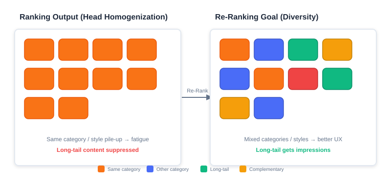
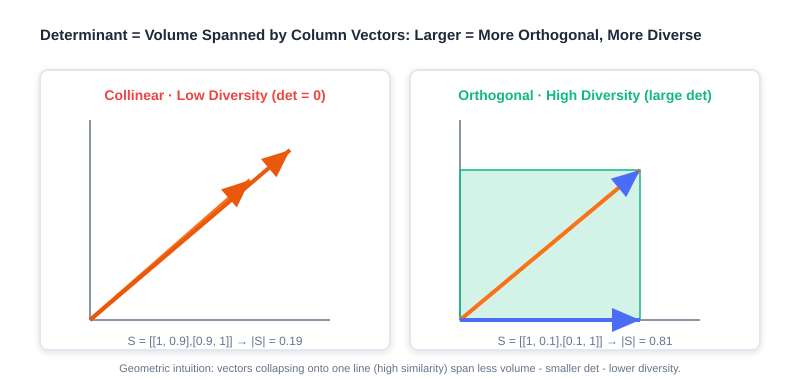
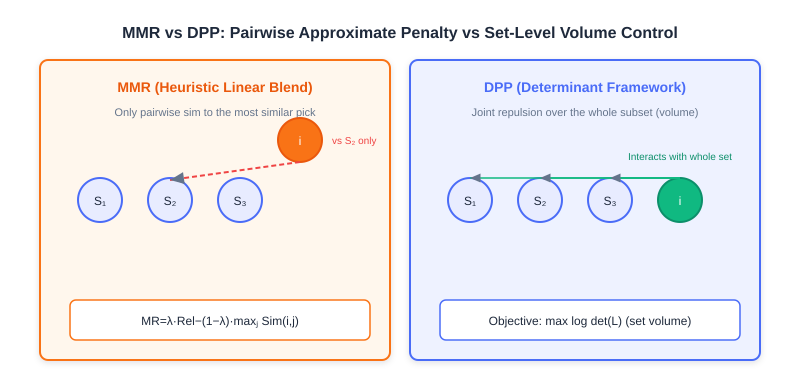

<div class="badge-row">
  <span style="background: #f0f4ff; color: #4A6CF7; padding: 4px 12px; border-radius: 20px; font-size: 0.85em; font-weight: 600; border: 1px solid rgba(74,108,247,0.2);">📖</span>
  <span style="background: #f0fdf4; color: #16a34a; padding: 4px 12px; border-radius: 20px; font-size: 0.85em; border: 1px solid rgba(22,163,74,0.2);">⏱️ ~32 min read</span>
  <span style="background: #fef9ec; color: #d97706; padding: 4px 12px; border-radius: 20px; font-size: 0.85em; border: 1px solid rgba(100,100,100,0.15);">🎯 Intermediate</span>
</div>

# Greedy-Based Re-ranking

> 📝 **Before You Continue:** Please finish the scoring function $f$ in [Part 3 Ranking](../part3-ranking/README.md) first, and understand how the ranking stage outputs a relevance score (e.g., a predicted CTR) for every candidate. This chapter stands right after that stage, optimizing the "score-sorted" list on its last mile.

Picture this: the ranking model confidently hands over a list whose top ten entries are ten nearly identical "sci-fi action movies." Judged position by position, every score is high and every item is relevant; but stitched into a single list, users immediately feel aesthetic fatigue. This is the real pain point re-ranking addresses — **homogenized ranking output**.

Re-ranking sits at the very end of the "retrieval → ranking → re-ranking" funnel. Its job is not to recompute accuracy one more time, but to answer a trickier question: **holding relevance steady, how do we make the whole list deliver the best experience?** Greedy algorithms — with their intuitive ideas, efficient computation, and easy implementation — have become a first-choice strategy for diversity, novelty, and similar problems at the re-ranking stage. They usually **do not depend on complex model training**; instead, working from predefined rules or objective functions, they build the final list by repeatedly taking the current best option (greedy selection).

This chapter takes a deep dive into two classic greedy re-ranking algorithms: **Maximal Marginal Relevance (MMR)** and the **Determinantal Point Process (DPP)**.

After reading this chapter, you will be able to:

- **Explain** the "homogenization" phenomenon in ranking output, and the two kinds of cost it inflicts on user experience and ecosystem efficiency
- **Write out** MMR's marginal gain formula, and hand-compute a top-k list on a given similarity matrix with the greedy procedure
- **Describe** how DPP measures set-level diversity with the geometric intuition that "determinant = volume"
- **Derive** the DPP kernel matrix $L = \text{Diag}(r)\cdot S \cdot \text{Diag}(r)$, and articulate how the relevance term and the diversity term are fused
- **Distinguish** the essential difference and applicable scenarios of MMR (heuristic linear combination) versus DPP (precise control in a determinant framework)
- Complete 4 leveled practice problems to consolidate hand-computation and code implementation of the two algorithms

---

## 4.1.0 Motivation for Re-ranking: Homogenized Ranking Output

The goal of a ranking model is usually to maximize point-wise accuracy (e.g., predicted CTR). When its output is sorted by descending score, the head items tend to be highly similar — back-to-back products from the same category, videos in the same style, content from the same author. This **homogenization** is no accident; it is the inevitable by-product of point-wise optimization. It directly causes two major problems:

1. **Degraded user experience**: users develop aesthetic fatigue while browsing, their interest decays faster, and content they might otherwise click gets skipped because they have "seen too much of the same kind."
2. **Lost system efficiency**: high-quality long-tail content is under-exposed, platform ecosystem diversity declines, creator motivation suffers, and the supply side is damaged in the long run.



The left side of the figure above is the list the ranking stage spits out directly — ten slots of highly similar content (same-colored blocks clumped together). The right side is the list re-ranking aims to deliver — keeping high relevance while making category, style, and author more varied. The core mission of re-ranking is to break this deadlock of "relevant but repetitive."

> 💡 **Key Insight:** What re-ranking pursues is not "Pareto optimality of relevance" but **"Pareto optimality of relevance and diversity"** — trading a tolerable loss in accuracy for a leap in the experience of the whole list.

### 🧠 Mental Model: The Buffet Layout

> Think of the recommendation list as a buffet spread. The ranking stage is a chef who "picks the most crowd-pleasing dish every time": the result is all braised pork — every plate is popular, but nobody can eat ten plates of meat. Re-ranking is a chef who knows how to compose a menu: while keeping a few signature dishes (high relevance), they interleave cold dishes, soups, and desserts (diversity), so the whole table is tasty without being cloying.

---

## 4.1.1 Maximal Marginal Relevance Re-ranking (MMR)

The core goal of **MMR (Maximal Marginal Relevance)** is to break homogenization by actively introducing diversity while retaining highly relevant items. Its idea is straightforward: each time an item is selected, consider not only **how relevant it is on its own**, but also penalize **how similar it is to the already-selected items**.

### The Marginal Gain Formula

MMR quantifies the incremental value of item $i$ to the current list $S$ by defining a **marginal gain function**:

$$MR(i) = \lambda \cdot \underbrace{\text{Rel}(i)}_{\text{relevance}} - (1-\lambda) \cdot \underbrace{\max_{j \in S} \text{Sim}(i,j)}_{\text{diversity penalty}}$$

The symbols mean:

- $S$: the set of already-selected items
- $\text{Rel}(i)$: the relevance score of item $i$, inherited directly from the ranking model's output (e.g., a predicted CTR)
- $\text{Sim}(i,j)$: the similarity between items $i$ and $j$ (0~1)
- $\lambda$: the trade-off parameter ($0 \leq \lambda \leq 1$)

$\lambda$ is MMR's "soul knob":

- $\lambda \to 1$: degenerates into pure ranking order (relevance only, no diversity)
- $\lambda \to 0$: forces diversity first (possibly at the cost of relevance)


> 💡 **Key Insight:** MMR's clever move is defining "diversity" as **a similarity penalty against things already selected**. The more an item resembles the selected ones, the lower its marginal gain. The greedy process therefore naturally steers away from content that "collides" with what it has already picked.

### Sliding-Window Optimization

When the ranking stage produces a large candidate set, computing similarity against **all** selected items gets expensive. A **sliding window** offers a targeted optimization: the similarity penalty no longer iterates over the whole $S$, but only over the last $w$ selected items (the window $W$).

$$MR_{\text{win}}(i) = \lambda \cdot \text{Rel}(i) - (1-\lambda) \cdot \underbrace{\max_{j \in W} \text{Sim}(i,j)}_{\text{windowed diversity penalty}}$$

where $W \subseteq S$ is the last $w$ selected items ($w = |W| \ll |S|$). The window method sharply cuts computation for long lists and is a common trick in industrial deployments.

### Worked Example: Picking top-3 from 5 Items

Suppose the candidate set contains 5 products with their ranking scores (Rel) and the following similarity matrix (the diagonal is 1, meaning full self-similarity):

| Item | Rel  | A   | B   | C   | D   | E   |
|------|------|-----|-----|-----|-----|-----|
| A    | 0.95 | 1.0 | 0.2 | 0.8 | 0.1 | 0.3 |
| B    | 0.90 | 0.2 | 1.0 | 0.1 | 0.7 | 0.4 |
| C    | 0.85 | 0.8 | 0.1 | 1.0 | 0.3 | 0.6 |
| D    | 0.80 | 0.1 | 0.7 | 0.3 | 1.0 | 0.5 |
| E    | 0.75 | 0.3 | 0.4 | 0.6 | 0.5 | 1.0 |

Take $\lambda=0.7$ and walk through the greedy process:

1. **Initial selection**: the highest ranking score A (Rel=0.95); set $S=\{A\}$.
2. **Round 2** ($S=\{A\}$):
   - B: $0.7\times 0.90 - 0.3\times\max(\text{Sim}(A,B)=0.2) = 0.63 - 0.06 = 0.57$
   - C: $0.7\times 0.85 - 0.3\times 0.8 = 0.595 - 0.24 = 0.355$
   - D: $0.7\times 0.80 - 0.3\times 0.1 = 0.56 - 0.03 = 0.53$
   - E: $0.7\times 0.75 - 0.3\times 0.3 = 0.525 - 0.09 = 0.435$
   - Pick **B** (score=0.57); set $S=\{A,B\}$.
3. **Round 3** ($S=\{A,B\}$):
   - C: $0.7\times 0.85 - 0.3\times\max(\text{Sim}(A,C)=0.8,\ \text{Sim}(B,C)=0.1) = 0.595 - 0.24 = 0.355$
   - D: $0.7\times 0.80 - 0.3\times\max(0.1,\ 0.7) = 0.56 - 0.21 = 0.35$
   - E: $0.7\times 0.75 - 0.3\times\max(0.3,\ 0.4) = 0.525 - 0.12 = 0.405$
   - Pick **E** (score=0.405); set $S=\{A,B,E\}$.

The final sequence is **[A, B, E]**. Compared with the pure ranking order [A, B, C], the three items sit in a more varied web of similarity relations, and diversity improves markedly (the source reports a gain of about 37%).

> **Analysis:** MMR's strengths are that it is **intuitive, interpretable, and free of training cost**, and the knob $\lambda$ lets business owners directly tune the relevance-versus-diversity balance. But the costs are clear too: (1) it is a **greedy local optimum** with no global guarantee; (2) the diversity penalty uses only "the similarity to the single most similar selected item" ($\,$max$)$, a **pairwise approximation** that cannot capture the redundancy when three similar items pile up — exactly the fundamental limitation DPP addresses in the next section.

### Code Implementation

```python
def MMR_Reranking(
    item_pool, k, lambda_param, sim_func, window_size=None
):
    """Greedy MMR-based re-ranking, with sliding-window optimization."""
    candidates = list(item_pool)
    S = []
    if not candidates:
        return S
    # Step 1: pick the item with the highest ranking score
    first = max(candidates, key=lambda x: x.rel)   # ← KEY LINE: the first item must be the most relevant
    S.append(first)
    candidates.remove(first)
    # Step 2: greedy iterative selection
    while len(S) < k and candidates:
        best_score, best_item = -float("inf"), None
        window = S[-window_size:] if window_size and len(S) > window_size else S
        for item in candidates:
            max_sim = max((sim_func(item, s) for s in window), default=0)
            # MMR formula: lambda*Rel - (1-lambda)*max_sim
            score = lambda_param * item.rel - (1 - lambda_param) * max_sim  # ← KEY LINE
            if score > best_score:
                best_score, best_item = score, item
        if best_item:
            S.append(best_item)
            candidates.remove(best_item)
        else:
            break
    return S
```

---

## 4.1.2 Determinantal Point Process Re-ranking (DPP)

In the previous section we saw that MMR only computes the **pairwise** similarity between a candidate and the selected items, greedily steering away from whatever is most similar to them. This approach **cannot capture complex repulsion relationships among multiple items** (for example, the redundancy of three similar items stacking up), and the **determinant** captures exactly that, elegantly.

### How the Determinant Measures Diversity

Suppose we compute pairwise item similarity via cosine similarity, with each item having a vector representation $x_i$. For all items to be ranked, $X$, the pairwise similarity matrix $S = X^T X$ follows readily.

Geometrically, a matrix determinant is the "signed volume" of the hyper-parallelepiped spanned by the matrix's column vectors. In the matrix $S$, if the column vectors are **linearly dependent** (two vectors collinear in 2D, three vectors coplanar in 3D), the vectors "collapse" into a lower-dimensional space and $\det(S)=0$. Conversely, if they are linearly **independent**, the space they span has no redundancy.

> 💡 **Key Insight:** **A larger determinant ↔ more "orthogonal" columns ↔ less similar items ↔ higher diversity**; a smaller determinant ↔ more collinear vectors ↔ lower diversity. This is the geometric intuition behind measuring diversity with a determinant.



Consider a concrete example. Suppose there are 4 items: $a=$ a sci-fi action movie, $b=$ a sci-fi comedy, $c=$ a costume romance, $d=$ a costume mystery, with the similarity matrix:

$$S = \begin{pmatrix} 1 & 0.9 & 0.1 & 0.2 \\ 0.9 & 1 & 0.1 & 0.1 \\ 0.1 & 0.1 & 1 & 0.8 \\ 0.2 & 0.1 & 0.8 & 1 \end{pmatrix}$$

Compare the subsets $\{a,b\}$ (both sci-fi) and $\{b,d\}$ (sci-fi vs. costume mystery):

$$S_{a,b} = \begin{pmatrix} 1 & 0.9 \\ 0.9 & 1 \end{pmatrix}, \quad S_{b,d} = \begin{pmatrix} 1 & 0.1 \\ 0.1 & 1 \end{pmatrix}$$

Their determinants are:

- $|S_{a,b}| = 1\times1 - 0.9\times0.9 = 0.19$
- $|S_{b,d}| = 1\times1 - 0.1\times0.1 = 0.81$

The results confirm the intuition: $\{b,d\}$ crosses genres and is nearly orthogonal — a large determinant (0.81) and high diversity; $\{a,b\}$ is same-genre and highly collinear — a small determinant (0.19) and low diversity.

### Fusing Relevance and Diversity: The Kernel Matrix

In recommendation, relevance and diversity are both metrics we want. DPP introduces a **positive semi-definite kernel matrix** $L$ to optimize the two together. This matrix decomposes as $L = B^T B$, where each column of $B$ is a candidate item's representation vector. Concretely, each column of $B$ is the product of the relevance score $r_i$ (from the ranking stage) and the normalized item vector, so the kernel matrix elements are:

$$\boldsymbol{L}_{ij} = \langle \boldsymbol{B}_i, \boldsymbol{B}_j \rangle = \langle r_i \boldsymbol{f}_i, r_j \boldsymbol{f}_j \rangle = r_i r_j \langle \boldsymbol{f}_i, \boldsymbol{f}_j \rangle$$

where $\langle \boldsymbol{f}_i, \boldsymbol{f}_j \rangle$ is exactly the similarity score $S_{ij}$. The kernel matrix can therefore be written as:

$$\boldsymbol{L} = \text{Diag}(\boldsymbol{r}) \cdot \boldsymbol{S} \cdot \text{Diag}(\boldsymbol{r})$$

That is, each row and each column of the similarity matrix is multiplied by the corresponding relevance $r_i$.

> 🧠 **Mental Model: the kernel matrix is a "double-guarantee" score sheet**
> The plain similarity matrix $S$ only asks "do they look alike"; the kernel matrix $L$ additionally multiplies each item by its own relevance $r_i$. So an item that is both **dissimilar (from what is already selected)** and **highly relevant (a high score on its own)** has the largest "influence" in $L$. Relevance is the admission ticket; diversity is the seating layout — together they determine set quality.

### A Kernel Matrix Construction Example

Suppose there are 3 items, with the similarity matrix $S$ and the relevance vector $r$:

$$S = \begin{bmatrix} 1 & 0.8 & 0.2 \\ 0.8 & 1 & 0.6 \\ 0.2 & 0.6 & 1 \end{bmatrix}, \quad r = \begin{bmatrix} 0.9 \\ 0.7 \\ 0.5 \end{bmatrix}, \quad \text{Diag}(r) = \begin{bmatrix} 0.9 & 0 & 0 \\ 0 & 0.7 & 0 \\ 0 & 0 & 0.5 \end{bmatrix}$$

Computing $L = \text{Diag}(r)\cdot S \cdot \text{Diag}(r)$:

$$L = \begin{bmatrix} 0.81 & 0.504 & 0.09 \\ 0.504 & 0.49 & 0.21 \\ 0.09 & 0.21 & 0.25 \end{bmatrix}$$

### From the Determinant to a "Relevance + Diversity" Objective

For user $u$, with the selected candidate set $R_u$, the kernel matrix determinant represents set quality:

$$|L_{R_u}| = \prod_{i \in R_u} r_{u,i}^2 \cdot |S|$$

Taking logarithms on both sides gives:

$$\log |L_{R_u}| = \sum_{i \in R_u} \log r_{u,i}^2 + \log |S|$$

- The first term concerns only **relevance**: the larger $r_{u,i}^2$, the more relevant;
- The second term $\log|S|$ concerns only **diversity**: the closer $S$ is to orthogonal (cosines near 0), the larger the determinant.

So the objective DPP ultimately optimizes also reduces to the form of a **relevance term + diversity term**, balanced by the hyperparameter $\theta$:

$$\log |L_{R_u}| = \theta \sum_{i \in R_u} \log r_{u,i}^2 + (1-\theta) \log |S|$$

> **Analysis:** On the surface, DPP's optimization objective is the same "linear combination of relevance + diversity" as MMR's. But the **key difference** is this: MMR's diversity penalty looks only at "the pairwise similarity to the most similar selected item" (the max term), a **pairwise approximation**; while DPP's $\det(L)$, through the volume semantics of the determinant, characterizes the mutual repulsion among all items in the subset **at once, jointly**, and can precisely express the stacked redundancy of three or more similar items.

### Greedy Solving: Cholesky Acceleration

DPP is inherently a probabilistic model that converts complex probability computations into simple determinant computations. Inferring the subset that "maximizes $\log|L_{R_u}|$" is **maximum a posteriori (MAP) inference**. The Hulu paper proposed an improved **greedy algorithm** to solve it quickly: each round, greedily add to the result set $Y_g$ the item with the largest **marginal gain**, until a stopping condition is met:

$$j = \arg\max_{i \in Z \setminus Y_g} \log\det(\boldsymbol{L}_{Y_g \cup \{i\}}) - \log\det(\boldsymbol{L}_{Y_g})$$

Since $L$ is positive semi-definite, its selected part admits a Cholesky decomposition $L_{Y_g} = V V^\top$. After a new item $i$ joins, the kernel matrix blocks into:

$$\boldsymbol{L}_{Y_g \cup \{i\}} = \begin{bmatrix} \boldsymbol{L}_{Y_g} & \boldsymbol{L}_{Y_g,i} \\ \boldsymbol{L}_{i,Y_g} & \boldsymbol{L}_{ii} \end{bmatrix} = \begin{bmatrix} \boldsymbol{V} & \boldsymbol{0} \\ \boldsymbol{c}_i & d_i \end{bmatrix} \begin{bmatrix} \boldsymbol{V} & \boldsymbol{0} \\ \boldsymbol{c}_i & d_i \end{bmatrix}^\top$$

where $\boldsymbol{c}_i^\top = V^\top \boldsymbol{L}_{Y_g,i}$ and $d_i = \sqrt{\boldsymbol{L}_{ii} - \|\boldsymbol{c}_i\|_2^2}$. Using the determinant property of block lower-triangular matrices, we can derive:

$$\det(\boldsymbol{L}_{Y_g \cup \{i\}}) = \det(\boldsymbol{L}_{Y_g}) \cdot d_i^2$$

So each selection reduces to:

$$j = \arg\max_{i \in Z \setminus Y_g} \log(d_i^2)$$

This means each round only needs to maintain and update each candidate's $c_i$ and $d_i^2$ to pick the best in $O(1)$, avoiding recomputing the whole block determinant — the key to DPP running in real time on industrial-scale candidate sets.

**Algorithm flow:**
1. **Initialize**: $c_i = []$, $d_i^2 = L_{ii}$, $j = \arg\max_{i\in Z}\log(d_i^2)$, $Y_g = \{j\}$.
2. **Iterate**: while the stopping condition is not met, for each $i \in Z \setminus Y_g$:
   - $e_i = (L_{ji} - \langle c_j, c_i \rangle) / d_j$
   - $c_i = [c_i\ \ e_i]$, $d_i^2 = d_i^2 - e_i^2$
   - $j = \arg\max_{i\in Z\setminus Y_g}\log(d_i^2)$, update $Y_g = Y_g \cup \{j\}$
3. **Return** $Y_g$.

**Code implementation:**

```python
def DPP_Reranking(item_pool, k, kernel_matrix, epsilon=1e-10):
    """Greedy DPP-based re-ranking (Cholesky-accelerated)."""
    n = len(item_pool)
    if n == 0 or k <= 0:
        return []
    cis = np.zeros((k, n))          # stores the c_i vectors
    di2s = np.copy(np.diag(kernel_matrix))  # stores d_i^2
    selected = []
    # Step 1: pick the item with the largest d_i^2 (highest relevance first)
    j = int(np.argmax(di2s))        # ← KEY LINE: start from the largest kernel diagonal
    selected.append(j)
    while len(selected) < k and len(selected) < n:
        k_cur = len(selected) - 1
        ci_opt = cis[:k_cur, j]
        di_opt = math.sqrt(di2s[j])
        elements = kernel_matrix[j, :]
        # e_i = (L_{ji} - <c_j, c_i>) / d_j
        eis = (elements - np.dot(ci_opt, cis[:k_cur, :])) / di_opt  # ← KEY LINE
        cis[k_cur, :] = eis
        di2s -= np.square(eis)      # update d_i^2 = d_i^2 - e_i^2
        j = int(np.argmax(di2s))    # next, pick the largest log(d_i^2)
        if di2s[j] < epsilon:
            break
        selected.append(j)
    return [item_pool[idx] for idx in selected]

def create_kernel_matrix(item_pool, sim_func):
    """Build the DPP kernel matrix L = diag(r) * S * diag(r)."""
    n = len(item_pool)
    r = np.array([it.rel for it in item_pool])
    S = np.eye(n)
    for i in range(n):
        for j in range(n):
            if i != j:
                S[i, j] = sim_func(item_pool[i], item_pool[j])
    return r.reshape((n, 1)) * S * r.reshape((1, n))  # ← KEY LINE: fuse relevance and diversity
```

> **Analysis:** DPP's complexity beats "brute-force subset enumeration"; Cholesky acceleration brings each selection down to roughly an $O(n)$ update. It **controls set-level diversity precisely**, and suits scenarios with high diversity-quality requirements and medium candidate sizes (e.g., a final re-ranking over the top 50~200 ranking candidates). The costs: building and maintaining the kernel matrix, sensitivity to similarity quality; and it is still a **greedy local optimum** with no guarantee of a globally maximal determinant.

The interactive demo below lets you see for yourself: given candidates and similarities, how MMR and DPP pick a list step by step, and how $\lambda / \theta$ shape the result.

<iframe src="../viz/part4-dpp.html?embed&vizId=part4-dpp" style="width:100%; height:520px; border:none; display:block;" loading="lazy"></iframe>

Drag the "trade-off parameter" slider and click "Next" to watch the greedy selection unfold step by step, and compare how MMR's linear penalty and DPP's determinant-volume view lead to different final lists.

---

## 4.1.3 MMR vs. DPP: Heuristic Linear Combination vs. Determinant Framework

Having learned both methods, let's nail down their essential differences in one table, to avoid "knowing the formulas but not the distinction."



| Dimension | MMR (Maximal Marginal Relevance) | DPP (Determinantal Point Process) |
|------|--------------------|--------------------|
| Diversity modeling | Pairwise similarity to the **most similar selected item** (the `max` penalty) | The **volume semantics** of the whole subset's determinant (joint repulsion) |
| Mathematical essence | Heuristic **linear combination**: $\lambda\cdot\text{Rel} - (1-\lambda)\cdot\max\text{Sim}$ | Determinant framework: $\det(L)$ measures set quality |
| High-order redundancy | **Cannot** capture the stacked redundancy of "three collinear items" | **Can** precisely characterize mutual repulsion among many items |
| Tunability | A single knob $\lambda$, intuitive and easy to grasp | Flexible kernel matrix $L$ construction, plus hyperparameter $\theta$ |
| Computational cost | Very low (pairwise similarities) | Medium (kernel matrix + Cholesky acceleration) |
| Best-fit scenarios | Large candidate sets, lightweight and interpretable requirements, fast launches | Medium candidate sets, high diversity-quality requirements |

> 💡 **Key Insight:** The two share the **same objective shape** (a relevance + diversity trade-off) but differ in **implementation philosophy**: MMR is a **heuristic** where "humans write the rules and greed executes them"; DPP is a **probabilistic framework** that "strictly defines diversity through determinant geometry." When your diversity need is only "don't be too repetitive," MMR suffices; when you need **precise control of set-level diversity** (e.g., exhibition curation, feed deduplication), DPP is the more reliable choice.

### 🧠 Mental Model: Jigsaw vs. Box-Packing

> MMR is like "each time picking the puzzle piece **most different from what's already assembled**" — it only looks at how the new piece fits the current boundary, a local heuristic. DPP is like "measuring the **total volume** the whole box of pieces could span before deciding which ones to keep" — it weighs the mutual overlap among all pieces at once, a global measure taken from the set as a whole.

---

## ⚠️ Common Mistakes in 4.1

| # | Mistake | Example | Why It's Wrong | Fix |
|---|---------|---------|---------------|-----|
| 1 | Treating re-ranking as a rerun of ranking | "Can't re-ranking just recompute CTR?" | Ranking seeks point-wise accuracy; re-ranking seeks list-level experience — different objectives | The re-ranking goal is Pareto optimality of relevance × diversity |
| 2 | Setting $\lambda$ in the wrong direction | Wanting diversity but setting $\lambda=0.95$ | $\lambda\to1$ degenerates to pure relevance, no diversity | For diversity, lower $\lambda$ (e.g., 0.3~0.7) |
| 3 | Believing MMR captures high-order redundancy | Assuming MMR already handles "three similar items" | MMR only uses $\max\text{Sim}$ — it looks at just the single most similar item | Leave high-order redundancy to DPP's determinant |
| 4 | Ignoring similarity quality | Computing Sim on unnormalized features | Similarities outside [0,1] break DPP's positive semi-definiteness and MMR's penalty scale | Normalize first / use cosine similarity |
| 5 | Forgetting to multiply relevance into the DPP kernel | Using only the similarity matrix $S$ as $L$ | The relevance term is lost; you select "very different but irrelevant" junk | You must use $L=\text{Diag}(r)S\text{Diag}(r)$ |

---

## Chapter Summary

### 📌 Key Takeaways

| Concept | Key Points | Why It Matters |
|---------|-----------|----------------|
| List homogenization | Point-wise optimal ranking → a repetitive head, harming experience and ecosystem | The fundamental motivation for re-ranking |
| MMR | $MR=\lambda\text{Rel}-(1-\lambda)\max\text{Sim}$, greedy selection | The lightest, most interpretable diversity re-ranking |
| Sliding window | Penalize only the last $w$ selected items | Cuts cost on long lists; common in industry |
| DPP determinant | $\det=$ volume; larger means more orthogonal, more diverse | Rigorously measures set diversity with geometry |
| Kernel matrix | $L=\text{Diag}(r)S\text{Diag}(r)$ fuses relevance + diversity | Unifies both objectives in one matrix |
| Cholesky acceleration | Pick $j=\arg\max\log(d_i^2)$ | Makes DPP feasible in real time |
| MMR vs. DPP | Pairwise approximation vs. set-level precision | Determines method selection |

### ❓ FAQ

**Q1: Must re-ranking come after ranking? Can we do re-ranking alone?**
> A: Re-ranking's input is "a candidate list that already carries relevance scores," so it inherently depends on ranking (or retrieval) producing candidates first. Doing only re-ranking while skipping ranking amounts to hard-picking from a pool with no quality ordering — the payoff is limited.

**Q2: Is $\lambda=0.5$ the optimal "half relevance, half diversity" setting?**
> A: Not necessarily. The optimal $\lambda$ depends on the business: content communities may lean toward diversity (lower $\lambda$), while e-commerce search and recommendation may lean toward relevance (higher $\lambda$). Tune it against online metrics (diversity metrics + retention/duration).

**Q3: Is DPP's determinant always better than MMR's result?**
> A: When you need precise set-level diversity, DPP wins; but MMR is lighter, more interpretable, and easier to tune. For small candidate sets and fast launches, MMR often delivers better cost-effectiveness. There is no absolute winner — it depends on the constraints.

### 🔗 Connections to Later Chapters

- **4.2** (personalized re-ranking) steps beyond "hand-crafted objective functions," letting PRM/PRS learn list optimality end-to-end from data.
- **3.x** (ranking) supplies the relevance scores $r_i$ and the candidates that MMR/DPP need.
- **Part 5 trends** (debiasing/cold-start): diversity re-ranking is a direct lever against "head concentration and a sunken long tail."
- **Generative recommendation (next volume)** folds re-ranking into end-to-end sequence generation, replacing MMR/DPP's heuristic objectives with learnable ones.

---

## Practice Problems

Work through all problems in order — they get progressively harder. Each has a complete solution you can reveal after trying it yourself.

---

**Problem 4.1.1 — Spotting the Re-ranking Motivation** 🟢 Easy

A short-video app's ranking output has its top 5 entries all being "same-genre skits from the same comedy creator," and users swipe away after watching 2. Identify which problem at the re-ranking stage this reflects, and give one corresponding cost of each kind.

<details>
<summary>💡 Solution (click to reveal)</summary>

**Approach:** Attribute it with the "homogenization" framework from 4.1.0.

- The problem reflected: **homogenized ranking output** — point-wise optimization in ranking makes head content highly similar.
- The two costs:
  1. **Degraded user experience**: aesthetic fatigue and fast interest decay; users swipe away early (matching the prompt's "swipes away after 2").
  2. **Lost system efficiency**: the long tail and other creators' content is under-exposed; ecosystem diversity declines.

**Key points:**
- The fundamental motivation for re-ranking is to break exactly this "relevant but repetitive" pattern.
- When diagnosing, first separate "insufficient accuracy" from "monotonous experience" — only the latter belongs to re-ranking.

</details>

---

**Problem 4.1.2 — Hand-Computing MMR** 🟡 Medium

Given 4 candidate items with their Rel scores and similarity matrix (only the upper triangle matters; it is symmetric):

| Item | Rel | A | B | C | D |
|------|-----|---|---|---|---|
| A | 0.9 | 1.0 | 0.1 | 0.8 | 0.2 |
| B | 0.8 | 0.1 | 1.0 | 0.3 | 0.6 |
| C | 0.7 | 0.8 | 0.3 | 1.0 | 0.4 |
| D | 0.6 | 0.2 | 0.6 | 0.4 | 1.0 |

Take $\lambda=0.6$ and use greedy MMR to select the top-3 list (list each candidate's $MR$ value in every round and the item chosen).

<details>
<summary>💡 Solution (click to reveal)</summary>

**Approach:** Apply the formula $MR(i)=\lambda\text{Rel}(i)-(1-\lambda)\max_{j\in S}\text{Sim}(i,j)$, with $1-\lambda=0.4$.

- **Round 1 (S=∅, penalty=0):** A: $0.6\times0.9=0.54$; B: $0.48$; C: $0.42$; D: $0.36$. Pick **A** (0.54), S={A}.
- **Round 2 (S={A}):** B: $0.48-0.4\times0.1=0.44$; C: $0.42-0.4\times0.8=0.42-0.32=0.10$; D: $0.36-0.4\times0.2=0.28$. Pick **B** (0.44), S={A,B}.
- **Round 3 (S={A,B}):** C: $0.42-0.4\times\max(0.8,0.3)=0.42-0.32=0.10$; D: $0.36-0.4\times\max(0.2,0.6)=0.36-0.24=0.12$. Pick **D** (0.12).

Final top-3: **[A, B, D]**. Note how C is heavily penalized for being highly similar to A (0.8) — MMR's diversity-driven collision avoidance at work.

**Key points:**
- Each round only needs the max similarity against the selected set.
- Highly relevant but colliding items (C) get pushed down — exactly the sign that diversity is working.

</details>

---

**Problem 4.1.3 — Building the Kernel Matrix** 🟡 Medium

Three items have relevance $r=[0.9, 0.7, 0.5]^T$ and similarity matrix $S=\begin{bmatrix}1&0.8&0.2\\0.8&1&0.6\\0.2&0.6&1\end{bmatrix}$. Write out the DPP kernel matrix $L=\text{Diag}(r)S\text{Diag}(r)$, and state the value and meaning of $L_{2,3}$.

<details>
<summary>💡 Solution (click to reveal)</summary>

**Approach:** Element-wise, $L_{ij}=r_i r_j S_{ij}$.

$$
L = \begin{bmatrix}
0.9\\&0.7\\&&0.5
\end{bmatrix}
\begin{bmatrix}1&0.8&0.2\\0.8&1&0.6\\0.2&0.6&1\end{bmatrix}
\begin{bmatrix}0.9\\&0.7\\&&0.5\end{bmatrix}
= \begin{bmatrix}
0.81 & 0.504 & 0.09\\
0.504 & 0.49 & 0.21\\
0.09 & 0.21 & 0.25
\end{bmatrix}
$$

- $L_{2,3}=r_2 r_3 S_{23}=0.7\times0.5\times0.6=0.21$.
- Meaning: the "joint influence" between items 2 and 3 = the product of their relevances × their similarity, fusing relevance and diversity information.

**Key points:**
- The diagonal $L_{ii}=r_i^2$ is decided purely by relevance (the basis for the initial pick).
- The off-diagonal encodes both "how alike" and "how relevant each is."

</details>

---

**🏆 Challenge: Making a Method Selection Argument** 🔴 Hard

A feed product has 200 ranking candidates, requires re-ranking latency < 20ms, and the business insists "there must never be 3 consecutive items from the same author." Write an argument for whether MMR (with an added "same-author penalty" rule) or DPP should be preferred. State your trade-offs and the necessary engineering adaptations.

<details>
<summary>💡 Hint</summary>

Weigh latency, controllability, and diversity semantics: with 200 candidates and <20ms, DPP's kernel matrix and Cholesky remain feasible but lean heavy; "no 3 consecutive items from the same author" is a **hard business constraint** — MMR accommodates rules easily (inject a strong author-dimension penalty into the similarity or penalty term), while encoding the constraint into DPP's kernel matrix is cumbersome. The conclusion usually leans toward MMR + business rules, or DPP with post-hoc constraint enforcement. Argument pivots: interpretability, latency, expressibility of constraints.

</details>
