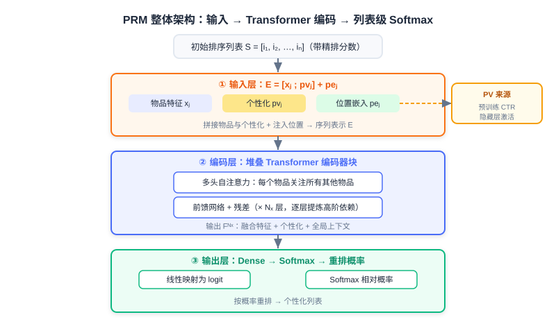
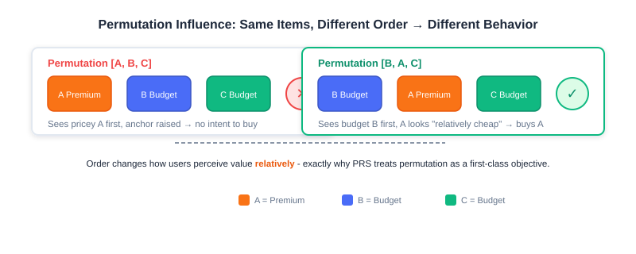

<div class="badge-row">
  <span style="background: #f0f4ff; color: #4A6CF7; padding: 4px 12px; border-radius: 20px; font-size: 0.85em; font-weight: 600; border: 1px solid rgba(74,108,247,0.2);">📖</span>
  <span style="background: #f0fdf4; color: #16a34a; padding: 4px 12px; border-radius: 20px; font-size: 0.85em; border: 1px solid rgba(22,163,74,0.2);">⏱️ ~36 min read</span>
  <span style="background: #fef2f2; color: #dc2626; padding: 4px 12px; border-radius: 20px; font-size: 0.85em; border: 1px solid rgba(100,100,100,0.15);">🎯 Advanced</span>
</div>

# Personalized Re-ranking

> 📝 **Before You Continue:** Please finish the greedy re-ranking in [4.1](./greedy-rerank.md) first. This chapter builds on the shared premise that "re-ranking must balance relevance and diversity," but upgrades the means from "hand-crafted objective functions" to "models learning end-to-end from data."

In the previous section we explored greedy re-ranking methods. They make local adjustments to the initial ranked list by explicitly defining optimization objectives for diversity, relevance, or coverage — computationally efficient and highly interpretable. But they fall short when handling **complex item-to-item mutual influence** and **deep personalization**:

- The objective functions usually need to be **hand-designed**, making it hard to capture high-order, non-linear interaction patterns;
- **Deeply integrating user personalization information** into list-level optimization is also challenging.

This chapter introduces two classic personalized re-ranking models: **PRM (Personalized Re-Ranking Model)** and **PRS (Permutation Retrieve System)**, to see how models "learn" the optimal list on our behalf.

After reading this chapter, you will be able to:

- **Explain** why PRM marks the shift of re-ranking from rules/heuristics toward data-driven, end-to-end learning
- **Describe** PRM's input layer, encoding layer (Transformer), output layer, and how the **personalized vector PV** is generated
- **Write out** the self-attention formula, and explain how Softmax implicitly models relative relationships among items in PRM's output layer
- **Understand** permutation-variant influence, and why PRS optimizes the permutation directly
- **Describe** PRS's two-stage solution: PMatch (FPSA candidate generation) and PRank (DPWN permutation evaluation)
- Complete 4 leveled practice problems to consolidate the core mechanisms of PRM/PRS

---

## 4.2.0 From Rules to Learning: Why Personalized Re-ranking

The diversity objective of greedy re-ranking (MMR/DPP) is "universal" — it applies the same similarity matrix and the same weights to every user. But in real recommendation, **the optimal ordering of the same list differs across users**: some prefer long-form deep reads first, others prefer short videos; some are price-sensitive, others are not.

This is the founding rationale of "personalized re-ranking": **deeply integrating each user's unique preference signals into the optimization of the whole list**. It no longer leans on a preset diversity formula; instead, the model learns directly from massive behavioral data "which combination of items, in which order, works best for this user."



> 💡 **Key Insight:** The rule-based approach asks "which list is better **on average**"; personalized re-ranking asks "which list is better **for this user**." The former is a population average; the latter gives every individual a list of their own.

### 🧠 Mental Model: Playlist DJ

> Think of greedy re-ranking as a "generic playlist generator" — it only guarantees no repeated genres. Think of PRM as a "DJ who knows you" — he knows that tonight you want slow songs first, then bangers, so he gets the order right too. What the model learns is not "what a playlist should look like," but "what **your** playlist should look like."

---

## 4.2.1 Transformer Personalized Re-ranking Model (PRM)

The introduction of **PRM (Personalized Re-Ranking Model)** marks an important shift of re-ranking technology from rules/heuristics toward data-driven, end-to-end learning. Its core idea: **use the Transformer's powerful sequence modeling to automatically learn the complex mutual influence among items in a list, and deeply integrate fine-grained user personalization into the whole re-ranking process**, optimizing globally by maximizing a list-level utility objective (such as click-through rate).

PRM's overall architecture has three layers: the input layer, the encoding layer, and the output layer.

### Input Layer: Fusing Personalization and Position

The input layer's core task is to prepare a rich initial representation for each item $i_j$ in the initial list $S = [i_1, i_2, ..., i_n]$, covering two key aspects:

1. **The item's own features ($X$)**: basic information such as item ID embedding, category, tags, and statistical features.
2. **The user's personalized preference for the item ($PV$)**: encodes the interaction relationship and preference intensity between user $u$ and item $i_j$ — the key to PRM's personalization, detailed later.

PRM **concatenates** the item's raw feature vector $x_j$ with the personalized vector $pv_j$ to form a more comprehensive base representation $[x_j; pv_j]$. In addition, the initial list itself carries latent sequential information (higher-ranked items may be more relevant), so a learnable **position embedding (PE)** is introduced, assigning a vector to each position. The final input representation is:

$$E = [\text{item features}(x_j) ; \text{personalized vector}(pv_j)] + \text{position embedding}(pe_j)$$

This combination is usually passed through a simple feed-forward network for dimension adjustment, to fit the Transformer encoder's input.

### Encoding Layer: The Transformer Models Item Mutual Influence

The input layer supplies an item sequence carrying personalization and position information. The encoding layer's core goal is to use the **Transformer's sequence modeling power** to relate all items in the list to one another, capturing their complex, high-order mutual influence. This matters enormously for re-ranking because:

- Whether the user clicks the $j$-th item may be significantly influenced by the $k$-th (or even more distant) item — a substitute, a complement, or a source of variety;
- Such influence is often **long-range**, unconstrained by items' initial physical positions.

The Transformer's core mechanism is **self-attention**: every item in the sequence can attend to every other item (including itself), computing the similarity between its query vector $Q$ and other items' key vectors $K$ to obtain attention weights, which decide how much $V$ information to aggregate from other items:

$$Attention(Q, K, V) = \text{softmax}\left(\frac{QK^T}{\sqrt{d}}\right) V$$

PRM adopts **multi-head attention**, organized in standard Transformer encoder blocks (multi-head self-attention + feed-forward network), stacked in multiple layers that progressively distill higher-order inter-item dependencies. The final output is each item's high-level representation $F^{N_x}$, which fuses item features, personalized user preference, and contextual interaction information across the whole list.

> **Analysis:** Compared with MMR/DPP's "pairwise similarities," PRM's self-attention can model **arbitrary high-order, non-linear inter-item dependencies** and naturally absorbs user signals. The costs: it needs training data, its inference cost exceeds rule-based methods, and the attention weights are less intuitive than MMR's formula — interpretability drops. It fits core scenarios with abundant data and sensitivity to personalization gains.

### Output Layer: Softmax List-Level Scoring

PRM applies a linear transform ($W^f \cdot F^{N_x} + b^f$) to each item's high-level representation $F^{N_x}$, mapping it to a scalar score (logit), then feeds it into **Softmax**:

$$P(y_i | X, PV; \hat{\theta})$$

Softmax plays two key roles here:

1. **Normalization**: it converts all scores into a probability distribution, with item probabilities summing to 1;
2. **Implicit relative-relationship modeling**: each item's final probability depends not only on its own score but also on its relative comparison against all other items' scores in the list — a natural fit for re-ranking's need to assess items' relative importance.

### Generating the Personalized Vector (PV)

Looking back at the whole pipeline, **PV is what distinguishes PRM from ordinary re-ranking and makes it truly "personalized."** Where does PV come from? PRM adopts a clever and practical strategy: **use a pre-trained click-through-rate prediction model to generate PV**.

1. **The pre-trained model's role**: trained on massive user behavior history, it learns to predict the probability $P(y_i | H_u, u; \theta')$ that user $u$ with behavior history $H_u$ clicks candidate item $i$.
2. **Extracting the personalized vector**: PRM does **not** use the predicted click probability itself, but extracts the **hidden-layer activation just before the model outputs the final click probability** (usually via Sigmoid). This vector carries rich abstract information about "how much user $u$ prefers item $i$," and serves as item $i$'s personalized vector $pv_i$ with respect to user $u$.
3. **Feeding PRM**: for every item $i_j$ in the initial list, $pv_j$ is computed through the pre-trained model above and passed as a key input into PRM's input layer.

**Core code (excerpt):**

```python
# User-side embedding -> [B, max_len, D], so every position carries the same user context
user_part_embedding = tf.tile(tf.expand_dims(user_part_embedding, axis=1),
                              [1, max_seq_len, 1])
# Page-level sequence representation: concatenate user + item features + PV + item embedding
page_embedding = concat_func(
    [user_part_embedding, item_part_embedding, pv_embeddings, item_embeddings],
    axis=-1)                                                # ← KEY LINE: fuse four kinds of signals
# Add position encoding to form the Transformer's final input
enc_inputs = add_func([page_embedding, position_embedding])  # ← KEY LINE: inject position information
# Stack Transformer encoder layers
for _ in range(transformer_blocks):
    enc_inputs = TransformerEncoder(
        intermediate_dim, nums_head, dropout_rate,
        activation="relu", normalize_first=True, is_residual=True)(enc_inputs)
# Scoring head: map each position to one probability
enc_output = tf.keras.layers.Dense(intermediate_dim, activation='tanh')(enc_inputs)
enc_output = tf.keras.layers.Dense(1)(enc_output)
score_output = tf.keras.layers.Activation(activation='softmax')(
    tf.keras.layers.Flatten()(enc_output))                  # ← KEY LINE: list-level relative scoring
```

The paper's experiments show that PRM delivers consistent gains over baselines on metrics like map@5, validating the effectiveness of end-to-end personalized re-ranking.

The interactive demo below gives you a direct feel for how PRM "reads" through the whole list with a Transformer step by step, then outputs a re-ranked relative probability for each position:

<iframe src="../viz/part4-prm.html?embed&vizId=part4-prm" style="width:100%; height:520px; border:none; display:block;" loading="lazy"></iframe>

Click "Next" to watch: how the initial list enters the encoder carrying PV and position embeddings, how self-attention progressively aggregates cross-item information layer by layer, and how Softmax finally turns scores into re-ranked relative probabilities.

---

## 4.2.2 Permutation-Based Re-ranking Model (PRS)

Although PRM achieves end-to-end personalized re-ranking with a Transformer, it still has one fundamental limitation: **a lack of deep understanding of the impact of permutations**.

Picture a scene: a user feels no urge to buy when facing the list [A, B, C], yet buys A upon seeing the permutation [B, A, C]. This phenomenon is called **permutation-variant influence** — one plausible explanation: placing the pricier B up front makes A feel relatively cheap, which triggers the purchase.



Traditional re-ranking (including PRM) focuses mainly on **optimizing individual item scores**, while ignoring the influence of **the item ordering itself** on user behavior. PRS's design idea: evaluate all possible item permutations and pick the one with the best user experience. But $n$ items have $n!$ permutations — computationally infeasible — so PRS proposes a **two-stage** solution:

1. **PMatch stage**: a search algorithm quickly screens down to a small number of candidate permutations;
2. **PRank stage**: a neural network evaluates these candidates' quality and picks the winner.

### The PRS Overall Framework


### The PMatch Stage: Candidate Permutation Generation (FPSA)

PMatch (Permutation-Matching) aims to efficiently identify candidate permutations from the exponential permutation space. It employs **FPSA (Fast Permutation Searching Algorithm)**, combining **beam search** with two user-behavior prediction models.

**Offline training: a dual-model prediction system**

1. **CTR model**: predicts the probability that the user clicks an item, $P_{CTR}(i|u)$
2. **Next model**: predicts the probability that the user keeps browsing to the next item after finishing the current one, $P_{Next}(i|u)$

Both are modeled in the standard point-wise fashion (Sigmoid activation + cross-entropy loss):

$$f_{CTR}(x_u, x_i) = \sigma(W_{CTR} \cdot [x_u; x_i] + b_{CTR})$$
$$f_{Next}(x_u, x_i) = \sigma(W_{Next} \cdot [x_u; x_i] + b_{Next})$$

The Next model reflects the **continuity** of user browsing: an item must not only attract clicks but also lead the user on to subsequent content.

**Online serving: the FPSA algorithm**

FPSA models user browsing as a **sequential decision process** — an item's value in a sequence depends not only on its own features but also on its role along the whole browsing path. At its core, a beam search builds candidate permutations step by step, pruning by a reward function at each step. The reward fuses two metrics:

- **rPV (Page View Reward)**: measures the total browsing depth a permutation can bring, encouraging combinations that guide users deeper;
- **rIPV (Item Page View Reward)**: measures the total probability of items in the permutation being clicked, securing commercial value.

**FPSA core code (excerpt):**

```python
def fpsa_algorithm(items, ctr_scores, next_scores, beam_size=5, max_length=10,
                   alpha=0.5, beta=0.5):
    """Fast Permutation Searching Algorithm (beam search generates candidate permutations)."""
    S = [()]                       # candidate permutation set, initially the "empty sequence"
    for i in range(1, max_length + 1):
        St = S.copy()
        S, R = [], {}
        for O in St:
            for ci in items:
                if ci not in O:
                    Ot = O + (ci,)   # append the unseen item ci to the tail
                    r = calculate_estimated_reward(Ot, ctr_scores, next_scores, alpha, beta)
                    R[Ot], S.append(Ot) = r, Ot
        # Beam search truncation: keep the top beam_size by reward
        S = sorted(S, key=lambda x: R[x], reverse=True)[:beam_size]  # ← KEY LINE
    return S

def calculate_estimated_reward(O, ctr_scores, next_scores, alpha, beta):
    r_pv, r_ipv, p_expose = 1.0, 0.0, 1.0
    for ci in O:
        p_ctr, p_next = ctr_scores[ci], next_scores[ci]
        r_ipv += p_expose * p_ctr                 # accumulate expected clicks
        p_expose *= p_next                        # exposure-chain probability decays with position
    r_pv = p_expose                              # probability of browsing to the end
    return alpha * r_pv + beta * r_ipv           # linearly fuse PV and IPV
```

> **Analysis:** FPSA's beam search cuts $n!$ down to a manageable candidate set — a pragmatic engineering answer to combinatorial explosion. But it depends on the accuracy of the two point-wise CTR/Next models, and its reward is a linear fusion that may miss non-linear permutation gains.

### The PRank Stage: Permutation Evaluation (DPWN)

PRank (Permutation-Ranking) takes the candidate permutations PMatch generates and evaluates each permutation's quality with the neural network **DPWN (Deep Permutation-Wise Network)**.

DPWN's design philosophy: an item's value in a permutation depends not only on its own features but also on its **position and role in the context of the whole sequence**. To this end it adopts a **Bi-LSTM** architecture:

1. **Sequence encoding layer**: a bidirectional LSTM computes the contextual representation of the $t$-th item:
   $$\overrightarrow{h_t} = LSTM_{forward}(x_{v_t}, \overrightarrow{h_{t-1}}), \quad \overleftarrow{h_t} = LSTM_{backward}(x_{v_t}, \overleftarrow{h_{t+1}}), \quad h_t = [\overrightarrow{h_t}; \overleftarrow{h_t}]$$
2. **Feature fusion layer**: $z_t = [h_t; x_u; x_{v_t}]$, fusing sequence representations with user/item features.
3. **Prediction layer**: an MLP predicts the click probability of each position, $p_t = \sigma(MLP(z_t))$.

**List Reward (LR)** is PRank's core evaluation metric, defined as the sum of predicted click probabilities over all items in the permutation:

$$LR(O) = \sum_{t=1}^{|O|} p_t$$

During online serving, PRank computes the LR of every candidate permutation and outputs the permutation with the highest LR.

> 💡 **Key Insight:** The fundamental divide between PRS and PRM is this — PRM optimizes "**each item's relative score**," with positions implied by scores; PRS directly optimizes the experiential gain **brought by the ordering itself** (LR), treating order as a first-class citizen. The former cares about "which items to pick"; the latter cares about "how to arrange them."

### 🧠 Mental Model: Shelf Display vs. Item Pricing

> PRM is like a manager who prices each product — he gets every tag as accurate as possible, but the shelf order is just sorted by price. PRS is like a store manager who obsesses over display — he knows that "putting the expensive end-of-season piece up front makes the mid-shelf bargain look like a deal," so he optimizes the **placement order** of the whole product group separately.

---

## ⚠️ Common Mistakes in 4.2

| # | Mistake | Example | Why It's Wrong | Fix |
|---|---------|---------|---------------|-----|
| 1 | Assuming PRM is personalized by default | "PRM can personalize with only item features as input" | Personalization comes from PV; without PV it degenerates into ordinary re-ranking | You must feed in the pre-trained CTR model's hidden layer as PV |
| 2 | Confusing PRM with a ranking model | "PRM is just CTR prediction" | PRM optimizes list-level relative relationships; ranking is point-wise | Remember PRM's output is Softmax relative probabilities |
| 3 | Ignoring permutation-variant influence | "[A,B,C] and [B,A,C] work the same" | Order changes users' relative price/preference perception | Only PRS-style methods treat order as an optimization target |
| 4 | Underestimating the $n!$ explosion | "Just enumerate all permutations and pick the best" | 10! ≈ 3.6 million; 20! is beyond computation | Use PMatch's beam search to cut candidates |
| 5 | Treating PRS as single-stage | "PRank searches permutations directly" | Without PMatch's candidate generation, PRank has nothing to evaluate | Both stages are indispensable |

---

## Chapter Summary

### 📌 Key Takeaways

| Concept | Key Points | Why It Matters |
|---------|-----------|----------------|
| Motivation for personalized re-ranking | Rule methods apply one objective to everyone; no per-user adaptation | Deeply integrates user preference into list optimization |
| PRM input layer | $[x_j;pv_j]+pe_j$, fusing four kinds of signals | PV is the core of personalization |
| PRM encoding layer | Transformer multi-head self-attention models high-order mutual influence | Captures cross-item, long-range dependencies |
| PRM output layer | Softmax → list-level relative probabilities | Implicitly models relative importance among items |
| PV generation | Take the pre-trained CTR model's hidden-layer activation | Reuses existing ranking knowledge for personalization |
| Permutation-variant influence | Same items, different order → different behavior | The motivation for PRS's existence |
| PRS two stages | PMatch(FPSA+beam)→PRank(DPWN+LR) | Dissolves the $n!$ combinatorial explosion |

### ❓ FAQ

**Q1: Can PRM be combined with DPP from 4.1?**
> A: Yes, and it's common. DPP/MMR often serves as a **baseline or post-processing** for PRM: first let PRM learn list-level preference, then apply DPP as a diversity-constraint safety net. The two are complementary — one handles personalization, the other set diversity.

**Q2: Why take the hidden layer for PV instead of the final click probability?**
> A: The final click probability is a scalar squashed by Sigmoid — heavily compressed information; the hidden-layer activation is a **high-dimensional abstract vector** that preserves rich semantics about "why the user prefers this item," making it a better personalized input for PRM.

**Q3: Can PRS's beam search miss the truly optimal permutation?**
> A: Yes. The beam keeps only the top-$k$ local candidates by reward — it's an approximation. But versus full $n!$ enumeration, this is a necessary engineering trade-off; in practice, with a good reward function, the top candidates are already high quality.

### 🔗 Connections to Later Chapters

- **4.1** (greedy re-ranking) is the contrasting baseline for PRM/PRS — rule methods are lightweight; personalized methods are expressive.
- **Part 3 ranking** supplies the pre-trained CTR model and ranking scores PRM needs — the source of PV.
- **Part 5 trends** (the generative paradigm) pushes "list generation" further toward end-to-end; PRS's permutation-optimization idea re-emerges naturally as autoregression in generative architectures.
- **The next volume on generative recommendation** replaces the "retrieval → ranking → re-ranking" cascade with a single sequence model, folding re-ranking's objective directly into the generation objective.

---

## Practice Problems

Work through all problems in order — they get progressively harder. Each has a complete solution you can reveal after trying it yourself.

---

**Problem 4.2.1 — Telling the Two Kinds of Re-ranking Apart** 🟢 Easy

Decide whether each description below is closer to **(a) greedy re-ranking (MMR/DPP)** or **(b) personalized re-ranking (PRM/PRS)**, and explain why:

- (i) The system re-ranks every user with the same similarity matrix and a fixed $\lambda$.
- (ii) The system extracts the pre-trained CTR model's hidden-layer vector for each user as re-ranking input.

<details>
<summary>💡 Solution (click to reveal)</summary>

**Approach:** Grasp "whether user personalization is incorporated, and whether it is data-driven."

- (i) **Greedy re-ranking**: fixed similarity and $\lambda$, identical for all users, no personalization — a rule/heuristic approach.
- (ii) **Personalized re-ranking (PRM)**: taking the pre-trained CTR model's hidden layer as PV is PRM's signature move, deeply incorporating user preference.

**Key points:**
- Whether "per-user personalized signals" exist is the essential dividing line between the two families.
- Presence of PV ≈ PRM; a fixed objective function ≈ a greedy method.

</details>

---

**Problem 4.2.2 — PRM's Input Representation** 🟢 Easy

In PRM, from which parts is an item $i_j$'s final input representation $E$ assembled by concatenation/addition? Write the formula and explain what problem each part solves.

<details>
<summary>💡 Solution (click to reveal)</summary>

**Approach:** Recall the input layer of 4.2.1.

Formula:
$$E = [\text{item features}(x_j) ; \text{personalized vector}(pv_j)] + \text{position embedding}(pe_j)$$

- $[x_j; pv_j]$ **concatenation**: fuses "what the item is" with "how much the user prefers it" (personalization), solving the per-user-adaptation problem;
- $+ pe_j$ **position embedding**: injects position information within the list, solving the problem that "the Transformer itself carries no order."

**Key points:**
- Concatenation merges features from different sources; addition injects position.
- All three parts are indispensable: no PV means no personalization; no PE means no sense of order.

</details>

---

**Problem 4.2.3 — Analyzing Permutation-Variant Influence** 🟡 Medium

An e-commerce list has items [A (expensive), B (budget), C (budget)]. The product manager finds that changing [A, B, C] to [B, A, C] noticeably lifts A's click-through rate. Explain this phenomenon with "permutation-variant influence," and state what it implies for re-ranking method selection.

<details>
<summary>💡 Solution (click to reveal)</summary>

**Approach:** Use the permutation-variant influence framework from 4.2.2.

- **Explanation**: A is the expensive item. When A comes first ([A,B,C]), the user sees the high price first and their threshold rises; after switching to [B,A,C], the user sees the budget B first, and A then feels "relatively cheap," triggering the purchase urge — that is, **order changes the user's relative perception of value**, which is permutation-variant influence.
- **Implication**: Traditional point-wise scoring (including PRM's score optimization) assumes "order doesn't affect an item's value" and misses this gain. You need a method like **PRS** that treats "the ordering itself" as the optimization target (evaluating whole-list gains with LR) to capture the experiential lift brought by order.

**Key points:**
- Permutation-variant influence = same items, different order → different behavior.
- It points toward methods where "order is a first-class optimization target" (PRS), not methods that only optimize individual item scores.

</details>

---

**🏆 Challenge: Designing a Hybrid Re-ranking Scheme** 🔴 Hard

A feed product wants both "personalization" (PRM's strength) and "strong set diversity" (DPP's strength), while controlling inference latency. Write a short design argument (within 150 words): how to combine PRM and DPP (in sequence / in parallel / in cascade), and give one risk of each sub-option and a mitigation.

<details>
<summary>💡 Hint</summary>

Three common combinations: (1) **Cascade** — PRM scores, then DPP does diversity post-processing; the risk is DPP may break the personalized order PRM learned; mitigate with a soft constraint. (2) **Parallel** — score both ways and fuse with weights; the risk is the weights are hard to tune; mitigate with offline grid search. (3) **Inject PV into the DPP kernel** — encode PRM's PV into $L$; the risk is the kernel must be recomputed; mitigate with incremental updates. Focusing your argument on one option is enough.

</details>
