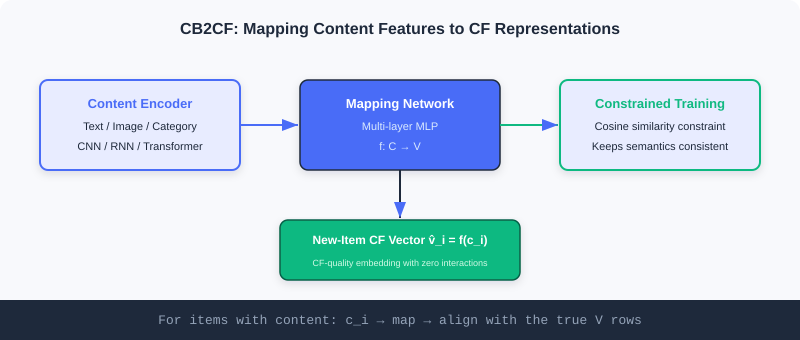
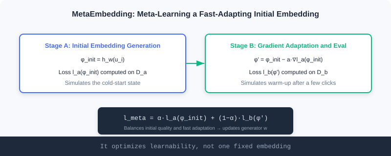
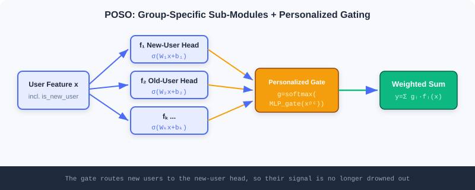

  📖
  ⏱️ ~30 min read
  🎯 Intermediate

# Cold Start

> 📝 **Before You Continue:** Make sure you have read collaborative filtering and the two-tower model in [Part 2 Retrieval](./../part2-retrieval/), and the bias perspective in [5.1](./debiasing.md). Cold start is, at its core, a bias predicament: being asked to be accurate with no history.

A recommender system's most awkward moment is when a new item goes on shelf, or a new user signs up. Collaborative filtering learns preferences from user–item interactions, but at that moment the interactions are **zero**; content-based methods can handle new items, but often capture only surface similarity.

This is the **cold-start problem** — the system's core engine (behavioral data) has not fired up yet, but it must immediately output trustworthy recommendations. This chapter splits cold start into two faces: **content cold start** (new items lack interactions) and **user cold start** (new users lack history), with two representative solutions for each. Their shared wisdom is **borrowing strength**: a new item borrows from content, a new user borrows from meta-knowledge or population structure.

After reading this chapter, you will be able to:

- **Distinguish** the fundamental difference between content cold start and user cold start
- **Explain** how CB2CF maps content features to collaborative-filtering representations so new items get CF quality directly
- **Write down** MetaEmbedding's two-stage meta-loss and understand that it optimizes "learnability" rather than a fixed vector
- **Explain** MeLU's parameter separation and POSO's "personalization submergence" insight, and compare the two
- Work through 4 tiered practice problems to consolidate the engineering and math intuition for cold start

---

## 5.2.0 The Two Faces of Cold Start

Cold start is not one problem but two objects each "lacking history":

| Type | What's Missing | Typical Failure | Solution Intuition |
|------|---------|----------|-----------|
| 🎬 Content cold start | New items lack user interactions | Collaborative filtering cannot compute similarity for them | **Borrow content**: map attributes onto existing representations |
| 👤 User cold start | New users lack behavior history | Can only recommend popular items, no personalization | **Borrow meta-knowledge/populations**: fast adaptation or segmentation |

We take each in turn.

---

## 5.2.1 Content Cold Start: Letting New Items "Borrow" Collaborative Quality

Collaborative filtering uncovers complex implicit associations but is helpless with new items; content-based methods handle new items but often capture only surface similarity. The ideal is: **new items also get collaborative-filtering-grade representations** — exactly the goal of CB2CF and MetaEmbedding.

### CB2CF: From Content Features to Collaborative Representations

The core idea of **CB2CF (Content-Based to Collaborative Filtering)** is to learn a **mapping function** $f: \mathcal{C} \rightarrow \mathcal{V}$ that maps an item's content features $c_i$ directly into the collaborative-filtering embedding space, yielding $\hat{v}_i = f(c_i)$.

For items that have both a content description and rich interactions, we hold both their content vector and their CF embedding. CB2CF uses a deep network to learn the nonlinear mapping between the two representations, so a new item obtains a semantically consistent CF representation **from content alone**. Its multi-view architecture has three modules:

- **Content Encoder**: encodes multimodal content (text, images, categories) into a unified content vector. CNNs for images, RNN/Transformer for text.
- **Mapping Network**: the core — stacked fully-connected layers that learn the nonlinear map from content space to CF embedding space, capturing complex content–preference associations.
- **Constraint Optimization module**: uses a **cosine-similarity constraint** to keep the mapped representation semantically consistent with the true CF embedding, guaranteeing the mapping is valid.

**Where do collaborative vectors come from?** For items with interactions, CF vectors can be produced in several ways: matrix factorization $R \approx UV^T$, where item $i$'s vector is row $i$ of $V$, $v_i$; the item-tower output of a two-tower retrieval model; or deep methods like NCF and autoencoders. Once CB2CF has learned $f$, a new item's content $c_i$ passes through $f$ to yield $\hat{v}_i$.

### 🧠 Mental Model: The Translator

> Think of CB2CF as a **translator**. CF embeddings are the system's internal lingua franca; established items all speak it. A new item only speaks "content-ese" (text/images). The translator $f$ has learned to render content-ese into CF-ese, so even though the new item has never made friends (no interactions), the system understands it the moment it speaks and folds it into the collaborative network.

> **Analysis:** CB2CF's strength is **directness** — one mapping and a new item instantly holds a CF-grade representation that plugs into existing retrieval/ranking. Its limits: the mapping's quality ceiling is bounded by how transferable "content → CF" is; if content correlates weakly with collaborative signal, the translation distorts. It also assumes existing items' CF vectors are trustworthy (you need a good CF model first).

### MetaEmbedding: Meta-Learning "Smart" Initial Embeddings

CB2CF solves "new items can't get a CF representation", but another difficulty remains: even with an initial vector, traditional **random initialization** makes new items perform poorly early on and need lots of interactions to converge.

**MetaEmbedding** applies **meta-learning** to generate embeddings for new items that are both initially high-quality and quick to adapt. It optimizes the generator by simulating each item's full journey "from cold start to warmed up".

Algorithm inputs: a pretrained base model $f_\theta$, an item set $\mathcal{I}$, meta-loss weight $\alpha$, and step sizes $a, b$. For each sampled item $i$:

**Initial embedding generation stage**: the generator produces the initial vector

$$\phi_{[i]}^{\text{init}} = h_w(\boldsymbol{u}_{[i]})$$

where $\boldsymbol{u}_{[i]}$ is item $i$'s features and $h_w$ is the generator with parameters $w$. Then sample two batches of $K$ samples each: $\mathcal{D}_{[i]}^a$ and $\mathcal{D}_{[i]}^b$.

**Gradient adaptation and evaluation stage**: compute the loss on the first batch and take one gradient-adaptation step, simulating "after a few interactions":

$$\phi_{[i]}' = \phi_{[i]}^{\text{init}} - a \cdot \frac{\partial l_a(\phi_{[i]}^{\text{init}})}{\partial \phi_{[i]}^{\text{init}}}$$

Then evaluate the adapted loss $l_b(\phi_{[i]}')$ on the second batch.

The key is the **meta-loss** balancing two objectives:

$$l_{\text{meta},i} = \alpha l_a(\phi_{[i]}^{\text{init}}) + (1-\alpha) l_b(\phi_{[i]}')$$

Finally, update the generator with the meta-losses of all sampled items:

$$w \leftarrow w - b \sum_{i} \frac{\partial l_{\text{meta},i}}{\partial w}$$

> 💡 **Key Insight:** MetaEmbedding optimizes an embedding's **"learnability", not the embedding itself**. By repeatedly rehearsing "initialize → adapt → evaluate" on established items, it learns to give new items a "smart starting point" — one that converges to a high-quality representation after only a few real interactions.

### 🧠 Mental Model: Teaching "How to Learn" Instead of "Memorizing Answers"

> MetaEmbedding is like a coach who doesn't hand a rookie the match answers, but trains him in **"how to warm up before going on court and how to adjust through the first few plays"**. When the real match comes, he hits his stride after just a few real exchanges. $\alpha$ weighs "is the opening stance good" against "how strong is he after fine-tuning".

---

## 5.2.2 User Cold Start: Fast Personalization for New Users

A newly registered user has no interaction history, so collaborative filtering can only serve generic popularity-based recommendations. User cold start focuses on: how to capture personalized preferences quickly from **a few** behaviors. MeLU and POSO offer two approaches — **meta-learning** and **segmentation architecture**.

### MeLU: Learning Each User as a Separate Task

**MeLU (Meta-Learned User preference estimator)** treats each user's preference learning as an independent task, and uses **MAML (Model-Agnostic Meta-Learning)** to train a model that adapts quickly to new users. MAML's essence is "learning how to learn" — rather than being optimal on one task, it learns a **good initialization** such that a few samples suffice to adapt to a new task.

MeLU uses two tiers of parameters:

- $\theta_1$ governs the **embedding parameters** for users and items (shared by all users)
- $\theta_2$ holds the parameters of the model's core **decision network** (adapts quickly to each individual)

Training strictly follows MAML's two loops:

1. **Inner-loop adaptation**: for each user $i$, compute gradients from their interaction history and update locally: $\theta_2^i \leftarrow \theta_2^i - \alpha \nabla_{\theta_2^i} \mathcal{L}_i'(f_{\theta_1,\theta_2^i})$.
2. **Outer-loop meta-update**: using all users' adapted parameters, update both sets of global parameters simultaneously:

$$\theta_1 \leftarrow \theta_1 - \beta \sum_{i \in B} \nabla_{\theta_1} \mathcal{L}_i'(f_{\theta_1,\theta_2^i}), \quad \theta_2 \leftarrow \theta_2 - \beta \sum_{i \in B} \nabla_{\theta_2} \mathcal{L}_i'(f_{\theta_1,\theta_2^i})$$

MeLU's innovation is **parameter separation**: $\theta_1$ learns shared general representations while $\theta_2$ specializes in fast per-user adaptation. This retains representation capacity while personalizing quickly for new users. MeLU also proposes an **evidence candidate selection** strategy that picks the set of items most discriminative of user preferences for cold-start evaluation.

> **Analysis:** MeLU's advantage is theoretical elegance — a new user gets personalized after a few gradient steps, no retraining from scratch. The costs: MAML's **second-order gradients** are computationally heavy, and it relies on the assumption that users' tasks are identically distributed; when new and old users' behavior distributions differ hugely, fast adaptation alone may not suffice.

### POSO: Fighting "Personalization Submergence" with Segmented Submodules

**POSO (Personalized cOld Start Modules)** attacks from the architecture angle with a sharper insight: the root cause of user cold start is **not just data scarcity**, but the **huge distributional gap** between new and old users' behavior, plus the model's **"submergence"** when facing imbalanced distributions — when new users are far outnumbered by old ones, even with an "is new user" feature, training is dominated by the old-user majority. The model learns to **ignore** this heavily imbalanced feature, and the new users' personalization signal drowns.

POSO embeds into many module types; take the MLP as an example. The original MLP shares weights across all users, $y=\sigma(Wx+b)$; POSO introduces $K$ parallel submodules $f_i(x)=\sigma(W_i x+b_i)$, plus a **personalized gating** network (taking $x^{pc}$ such as `is_new_user` and activity level) that outputs weights $g_i=\text{softmax}(\text{MLP}_{gate}(x^{pc}))_i$. The final output is the weighted combination:

$$\hat{y} = \sum_{i=1}^K g_i(x^{pc}) \cdot f_i(x)$$

New users then rely mainly on "the submodule optimized for them" while old users use another set, effectively avoiding feature submergence. The idea extends to:

- **POSO-MHA**: extends to $K$ groups of attention heads, each with dedicated $Q/K/V$ transforms, concatenated and aggregated within each group; gating selects group weights by user features.
- **POSO-MMoE**: $E$ shared experts at the bottom + $K$ expert groups at the top ($M$ experts per group), stacking **task gating** and **personalized gating** for dual personalization at both the task level and the user-segment level.

### 🧠 Mental Model: Multiple Service Desks vs a Single Clerk

> An ordinary model is like **a single clerk** serving all customers at once: biased toward the regulars' (old users') habitual requests, with newcomers' (new users') special needs drowned out. POSO is like opening $K$ **dedicated desks**: newcomers go to the "newcomer desk", regulars to the "regulars desk", and a greeter at the door (the gate) routes customers by type — newcomers' needs can never be shouted down by the regulars' volume.

> **Analysis:** POSO and MeLU are complementary. MeLU assumes "all users are identically distributed; rely on fast adaptation" and suits scenarios with similar behavior patterns; POSO directly targets "imbalanced distributions causing feature submergence" and forces the split structurally — easier to integrate into off-the-shelf deep modules (MLP/MHA/MMoE) and free of meta-learning's heavy gradients. In practice they combine: use POSO's structure to keep cold start from being submerged, and meta-learning to further accelerate convergence.

---

## ⚠️ Common Mistakes in 5.2

| # | Mistake | Example | Why It's Wrong | Fix |
|---|---------|---------|---------------|-----|
| 1 | Randomly initializing new-item embeddings | A new item enters the model with a random vector | Poor early performance; needs many interactions to converge | Use MetaEmbedding to generate a smart starting point |
| 2 | Mistaking content similarity for collaborative similarity | CB2CF relies only on text similarity | Surface similarity ≠ behavioral collaboration; the mapping distorts | Use constraint optimization to keep semantics consistent |
| 3 | Assuming MAML always beats structural design | Reaching for MeLU reflexively for user cold start | Insufficient adaptation when behavior distributions differ, plus heavy second-order gradients | Prefer POSO's structural split under imbalance |
| 4 | Assuming one new-user feature is enough | Adding only an `is_new_user` flag | Old users dominate training and the feature gets submerged | Use POSO submodules + gating to force the split |

---

## Chapter Summary

### 📌 Key Takeaways

| Concept | Key Points | Why It Matters |
|---------|-----------|----------------|
| Content cold start | New items lack interactions; CF fails | Borrow content mappings to obtain CF representations |
| CB2CF | $f: \mathcal{C}\rightarrow\mathcal{V}$, content→CF | New items gain collaborative quality instantly |
| MetaEmbedding | Two-stage meta-loss optimizing "learnability" | Generates initial vectors that adapt quickly |
| User cold start | New users lack history; only popular items can be recommended | Borrow meta-knowledge/population structure for fast personalization |
| MeLU / POSO | Meta-learned adaptation / segmented submodules against submergence | Two complementary user cold-start approaches |

### ❓ FAQ

**Q1: Do CB2CF and MetaEmbedding solve the same problem?**
> A: Not quite. CB2CF solves "new items cannot obtain a CF representation"; MetaEmbedding solves "even with an initial vector, random initialization converges slowly". They can chain: MetaEmbedding generates a good starting point, then a CB2CF-style mapping supplies CF quality.

**Q2: Why is POSO more effective than just adding an `is_new_user` feature?**
> A: Because training is dominated by old users, a lone feature gets "submerged" — the model learns to ignore it. POSO uses $K$ dedicated submodules plus gating to structurally force new users through their own pathway, which cannot be ignored.

**Q3: How to choose between MeLU and POSO?**
> A: If user behavior patterns are similar and few samples suffice to adapt → MeLU; if new/old user distributions differ greatly and features are easily submerged → POSO. They can also be combined.

### Connections to Later Chapters

- **5.1** (debiasing): long-tail new items get little exposure and are easily drowned by popularity bias; cold start and debiasing must work in concert.
- **5.3** (generative): semantic IDs let new items be recommended without any behavior, easing content cold start at the representation level.
- **Part 2 Retrieval** (Ch2.x): the CF representations produced by CB2CF plug directly into two-tower/vector retrieval.

---

## Practice Problems

Work through all problems in order — they get progressively harder. Each has a complete solution you can reveal after trying it yourself.

---

**Problem 5.2.1 — Distinguishing Cold-Start Types** 🟢 Easy

Is each scenario below content cold start or user cold start?
- (a) A newly launched documentary with no play records needs to be retrieved.
- (b) A freshly registered user has tapped only 3 videos, yet the system keeps recommending popular content.
- (c) A newly released song should go straight into personalized playlists, not just the "New Releases" list.

💡 Solution (click to reveal)

**Approach:** Ask whether what's missing is item history or user history.

- (a) **Content cold start**: the item has no interactions; collaborative filtering fails.
- (b) **User cold start**: the user lacks history; only popular items can be recommended.
- (c) **Content cold start**: the new song (item) lacks behavior and wants to enter personalization by borrowing content.

**Key points:**
- The "subject" of content cold start is a new item; of user cold start, a new user.
- Their solutions differ: items borrow content mappings; users borrow meta-learning/segmentation.

---

**Problem 5.2.2 — Filling In the CB2CF Mapping** 🟢 Easy

CB2CF learns a mapping function $f$ that maps a new item's content features $c_i$ into the collaborative-filtering space. Complete the output expression and explain the role of the constraint optimization module.

💡 Solution (click to reveal)

**Approach:** Recall CB2CF's three modules and the mapping definition.

The mapping output is:

$$\hat{v}_i = f(c_i)$$

where $f: \mathcal{C} \rightarrow \mathcal{V}$ is realized by the mapping network (stacked fully-connected layers). The **constraint optimization module** applies a cosine-similarity constraint to keep $\hat{v}_i$ semantically consistent with the true CF embedding $v_i$ — otherwise the mapping might "appear to converge" while drifting away from the collaborative space, causing new items to be wrongly recommended.

**Key points:**
- A new item has no interactions, yet its content $c_i$ through $f$ yields a CF representation.
- Constraint optimization is what guarantees the mapping works; do not skip it.

---

**Problem 5.2.3 — Interpreting the MetaEmbedding Meta-Loss** 🟡 Medium

MetaEmbedding's meta-loss is $l_{\text{meta},i} = \alpha l_a(\phi_{[i]}^{\text{init}}) + (1-\alpha) l_b(\phi_{[i]}')$. Explain: (1) what do the two terms each measure? (2) What happens if $\alpha=1$? (3) Why is it said to optimize "learnability" rather than the embedding itself?

💡 Solution (click to reveal)

**Approach:** Decompose the meta-loss against the two-stage process.

(1) **$l_a(\phi_{[i]}^{\text{init}})$** measures the initial embedding's direct quality on the first batch (cold-start opening performance); **$l_b(\phi_{[i]}')$** measures quality after one gradient-adaptation step (adaptation performance after a few interactions).

(2) If $\alpha=1$, only $l_a$ remains; the generator **optimizes initial quality only** and no longer cares about "can it adapt quickly" — new items get a good starting point but are hard to fine-tune, defeating the purpose of fast cold-start convergence.

(3) It does not fix a dead vector for a specific item; instead it repeatedly rehearses "initialize → adapt → evaluate" on many established items, learning to **generate starting points with good initial performance and strong adaptation potential**. Faced with a real new item, that starting point converges quickly with a little real data — what's optimized is "how learnable it is".

**Key points:**
- $\alpha$ balances "opening" against "adaptation".
- Meta-learning = learning how to learn, not learning a fixed answer.

---

**Problem 5.2.4 — Designing a POSO Retrofit** 🔴 Hard

You have a weight-shared MLP ranking model. Online, recommendations for new users perform far worse than for old users, even though an `is_new_user` feature has been added. Propose a retrofit following the POSO-MLP approach: write out the mathematical form of the submodules and the gate, and explain why this solves "feature submergence".

💡 Solution (click to reveal)

**Approach:** Follow POSO-MLP's three-part retrofit.

**Submodules:** introduce $K$ parallel MLP submodules, each with independent weights:

$$f_i(x) = \sigma(W_i x + b_i), \quad i=1,\ldots,K$$

**Gate:** the personalized gate takes $x^{pc}$ (including `is_new_user`, activity level, etc.) and outputs per-submodule weights:

$$g_i(x^{pc}) = \text{softmax}(\text{MLP}_{gate}(x^{pc}))_i$$

**Final output:** the weighted combination of all submodules:

$$\hat{y} = \sum_{i=1}^K g_i(x^{pc}) \cdot f_i(x)$$

**Why it solves submergence:** in the original model all users share $W,b$, training is dominated by old users, and the lone `is_new_user` feature is easily learned to be "ignored". POSO routes new users mainly through "new-user-dedicated submodules" and old users through another set, **structurally** guaranteeing new users' personalization signal a dedicated pathway that the old users' volume cannot drown.

**Key points:**
- The key is "structural routing", not "adding features".
- The gate dynamically allocates submodule weights by user features, smoothly transitioning between new and old users.

---

**🏆 Challenge: A Cold-Start Combo**

A short-video app faces both at once: new creators' content (content cold start) and newly registered users (user cold start). Write a plan of at most 200 words explaining how you would **combine** CB2CF / MetaEmbedding / POSO to address each, and identify which step depends most on "the quality of existing items' CF vectors".

💡 Hint

- New creators' content: use MetaEmbedding to generate a smart initial embedding, then borrow a CB2CF-style content→CF mapping to obtain a collaborative representation and plug into retrieval.
- Newly registered users: use POSO submodules + gating for structural routing so `is_new_user` isn't submerged; with a few behaviors available, stack MeLU-style fast adaptation on top.
- The step most dependent on "existing items' CF vector quality" is **CB2CF** — its constraint optimization needs trustworthy true CF embeddings as alignment targets; if the underlying CF model is poor, the mapping distorts too.

