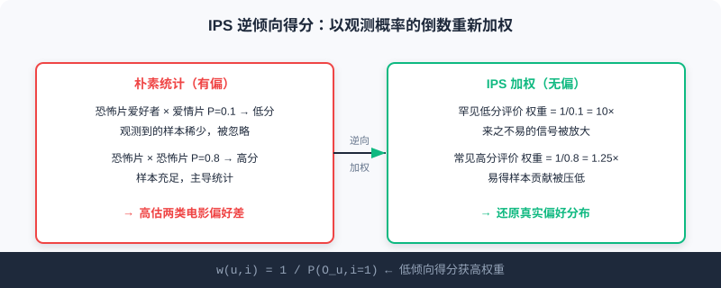
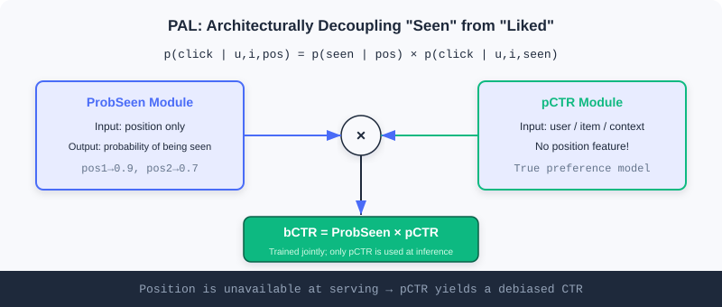

  📖
  ⏱️ ~28 min read
  🎯 Intermediate

# Model Debiasing

> 📝 **Before You Continue:** Make sure you have read the two paradigms and the three-stage funnel in [1.1](./../part1-introduction/recommender-system-basics.md), and the scoring function $f$ in [Part 3 Ranking](./../part3-ranking/). This chapter adds a layer of realism on top of those "ideal assumptions": the data you train your model on is not clean.

When you prepare to train a recommendation model on massive interaction data, there is a gentle but fatal illusion: **"more data, more accurate models"**. In a real recommender system, data comes from users' free behavior inside a product, not from controlled lab experiments. Every click, rating, and dwell is shaped by countless factors: how the system itself presents items, the user's own habits, and how popular an item already is.

More subtly, recommender systems have a **feedback loop**: today's recommendations determine what users see tomorrow, and tomorrow's clicks become the samples used to retrain the model the day after. Once this loop starts spinning, a tiny initial bias snowballs. This chapter walks you through these biases and introduces two debiasing toolkits that hold up under causal-inference scrutiny — **IPS** and **PAL**.

After reading this chapter, you will be able to:

- **Distinguish** the two families of bias sources: data bias (selection/exposure/conformity/position) and result bias (popularity/unfairness)
- **Explain** how the feedback loop amplifies small biases into a Matthew effect of homogeneous recommendations
- **Write down** the IPS estimator, justify why it is an unbiased estimate of the true risk, and know how to clip weights when they explode
- **Use** PAL's two-module architecture to structurally decouple "seeing" from "liking"
- Work through 4 tiered practice problems to consolidate the math and engineering intuition of debiasing

---

## 5.1.0 Data Is Born Biased: The Feedback-Loop Trap

To understand bias, first accept one fact: **the interactions we observe are not the user's true preferences**. In a lab you could show users random items and record their reactions, but in a production system users only see the content the system "chose" to show them.

Biases in recommender systems fall into two families depending on when they arise:

- **Data bias** arises at the **data-collection stage** and is the root of everything that follows. The model sees a world already filtered by the system.
- **Result bias** shows up in the **recommendations themselves** — data bias processed and amplified through model training.

The two are not isolated; they feed each other through the feedback loop. Popular items get recommended more → receive more interactions → take a larger share of the next round of training data → the model favors them even more. This is the rich-get-richer Matthew effect.

The figure chains "data bias → result bias → feedback loop" together: a biased model is both a product of bias and a factory of even more biased data.

> 💡 **Key Insight:** What gets seen is not what is preferred. Debiasing is not about "feeding more data" — it is about **re-understanding the mechanism that generated the data**. That is the shared starting point of IPS and PAL.

---

## 5.1.1 Data Bias: Seeds Sown at Collection Time

Data bias has four typical faces, stemming respectively from user habits, system exposure policy, and social psychology.

**Selection bias** appears in explicit-feedback (rating) settings. Users tend to rate only content they **care about**, so the ratings we observe do not represent their true attitude toward all items. Many neutral or negative potential ratings are never recorded — research calls this **Missing Not At Random (MNAR)**. It leads the model to **overestimate overall user satisfaction**.

**Exposure bias** is the core challenge of implicit feedback (clicks/watches). Users can only see items the system recommends to them; a non-interacted item can mean one of two things: genuinely not interested (true negative), or **never seen at all** (potential positive). If you naively treat every "no interaction" as a negative, the model learns distorted preferences — long-tail items suffer most, because they never had much exposure to begin with.

**Conformity bias** comes from group effects in social psychology. Seeing thousands of positive reviews, users often echo them with positive ratings to seek group approval — and vice versa. The collected feedback is thus not an independent, authentic preference, but an expression contaminated by public opinion.

**Position bias** is especially visible in list-wise recommendation. Users naturally attend more to items at the **top**, regardless of relevance. Data shows CTR decays sharply with position — a "click" reflects preference, but is also heavily manipulated by position.

### 🧠 Mental Model: A Telescope With Filters

> Think of training data as a **telescope with built-in filters**. You observe the universe (true user preferences) through it, but the filters only let through the light of "what the system displayed, what the user happened to click, what sat near the top, what everyone praised". A denser star chart does not mean that region actually has more stars — it may just be filter bias. Debiasing means **calibrating the filters**.

> **Analysis:** These four biases do not all call for the same treatment. Selection/exposure bias is essentially "unequal observation probability" and suits **IPS weighting** to compensate at the loss level; position bias has a clear structure — it only affects "whether the item was seen" — so **PAL**, which decouples it at the architecture level, is the cleaner fix. Diagnose the bias type first, then pick the tool.

---

## 5.1.2 Result Bias: The Model Learns the Bias In

When biased data flows through a model, the bias does not vanish; it is often reinforced and shows up in the results.

**Popularity bias** is the most common result bias. Popular items contribute the vast majority of interactions in training data, the model acquires the habit of "recommend popular, harvest clicks", and ends up recommending them even **more frequently than their underlying popularity**. This dilutes personalization and robs long-tail items of any chance to be discovered.

**Unfairness** means the system exhibits **systematic discrimination** against certain user groups or item categories. If a group kept receiving poor recommendations in historical data, the model learns and perpetuates that prejudice, staying unfair in future recommendations.

> ⚠️ **Warning:** Popularity bias and the feedback loop are **symbiotic**. Popular items get more exposure, hence more interactions, hence a bigger share of the next round of data, which further inflates popularity bias — unless you actively cut this chain in the model or the training loop, it keeps worsening until recommendations become extremely homogeneous.

---

## 5.1.3 Correcting Selection Bias with Inverse Propensity Scores (IPS)

**Inverse Propensity Score (IPS)** originates from causal inference. It treats "showing an item" in a recommender system as an **intervention**, and removes selection bias through reweighting.

The core idea is intuitive: if a sample is **easy to observe in the first place** (a hot product, an item in slot 1), its contribution during training should be discounted; conversely, if a sample is **hard to observe** yet the user found it and interacted with it (a long-tail item, a low-position item), it likely carries a stronger true-preference signal and deserves a higher weight.

The **propensity score** is the key concept, defined as the probability that the interaction between user $u$ and item $i$ is observed, $P(O_{u,i}=1)$. IPS's core operation is to weight by its **reciprocal** — inverse weighting: high propensity → low weight, low propensity → high weight.

### A Concrete Example

Consider a movie recommender with two user groups: horror fans and romance fans. Horror fans **rarely** rate romance movies on their own (observation probability $P=0.1$), but when they occasionally do, they give genuinely low scores (1–2); they **frequently** rate horror movies ($P=0.8$) and give high scores (4–5).

Naively averaging the observed data would show horror movies rated far above romance movies, misleading the model into overestimating the preference gap. With IPS weighting, the rare "horror fan rates romance low" sample gets a $1/0.1=10$× weight while the common "horror fan rates horror high" sample gets only $1/0.8=1.25$× — the model can now recover the true preference distribution more accurately.

On the right, IPS weighting amplifies the few hard-won low-score samples and discounts the cheap high-score samples, converging toward the true gap.

### 🧠 Mental Model: Weight Vouchers for Rare Samples

> Imagine running a survey where only talkative people agree to be interviewed and the silent rarely speak up. Tallying raw interview counts would drown out the silent group's opinions. IPS is like issuing **every silent respondent's statement** a 10×-weight voucher — so their voices are heard in proportion to the true population.

### The Math Behind IPS

The traditional evaluation approach computes the average loss directly on observed data:

$$\hat{R}_{naive}(\hat{Y}) = \frac{1}{|D_O|} \sum_{(u,i) \in D_O} \delta_{u,i}(Y, \hat{Y})$$

where $D_O=\{(u,i):O_{ui}=1\}$ is the observed dataset, $Y$ is the true rating, $\hat{Y}$ is the predicted rating, and $\delta_{u,i}$ is the loss or evaluation metric. When selection bias exists, $\mathbb{E}_{O}[\hat{R}_{naive}(\hat{Y})] \neq R(\hat{Y})$ — the naive estimator is **biased**.

The IPS estimator introduces propensity-score weighting:

$$\hat{R}_{IPS}(\hat{Y}) = \frac{1}{|U||I|} \sum_{(u,i) \in D_O} \frac{1}{P(O_{ui}=1)} \delta_{u,i}(Y, \hat{Y})$$

It can be shown to be an unbiased estimator of the true risk: $\mathbb{E}_{O}[\hat{R}_{IPS}(\hat{Y}|P)] = R(\hat{Y})$.

IPS applies not only to evaluation but also to training directly. The traditional matrix factorization objective:

$$\arg\min_{U,V} \sum_{(u,i) \in D_O} \big(Y_{u,i} - (u_u^T v_i + a_u + b_i + c)\big)^2 + \lambda(\|U\|^2 + \|V\|^2)$$

Adding IPS weights just multiplies each sample's loss by $1/P(O_{ui}=1)$:

$$\arg\min_{U,V} \sum_{(u,i) \in D_O} \frac{1}{P(O_{ui}=1)} \big(Y_{u,i} - (u_u^T v_i + a_u + b_i + c)\big)^2 + \lambda(\|U\|^2 + \|V\|^2)$$

A tiny change that integrates seamlessly into existing optimizers.

> ⚠️ **Warning:** When some samples have extremely small propensity scores (e.g. $P=0.01$), the reciprocal reaches 100×, exploding the estimator's variance and destabilizing training. In practice weights are usually **clipped or normalized** — trading a bit of "unbiasedness" for lower variance.

### Where Propensity Scores Come From: Estimated, Not Given

The key practical challenge for IPS is that propensity scores are usually unknown and must be estimated by an auxiliary model. A **Naive Bayes approach** assumes the observation probability depends only on the rating value (a 5 is far more likely to be observed than a 1); a **logistic regression approach** builds a "was it observed" classifier from user/item features, capturing more complex observation patterns and estimating more accurately.

### Verifying That Debiasing Works: Semi-Synthetic Experiments

A classic approach is the **semi-synthetic experiment**, which keeps the complexity of real data while letting us control how severe the bias is:

1. **Build a true rating matrix**: take MovieLens 100K (944,000 ratings, but only 6% of the matrix is filled), and complete it with matrix factorization into a full $R_{true}$ that serves as ground truth.
2. **Design a bias model**: for a user–item pair with rating $r$, if $r \ge 4$ the observation probability is $k$ (a base probability); if $r<4$ it is $k \times \alpha^{4-r}$ (decaying). $\alpha=1$ means no bias; the smaller $\alpha$, the heavier the bias; $k$ is tuned so the overall observation rate is about 5% to mimic sparsity.
3. **Generate biased observed data**: randomly decide observation according to those probabilities, yielding a biased training set.
4. **Compare estimators**: the true MAE is computed on $R_{true}$; the naive estimator computes average error directly on observed data; IPS computes a weighted average error with weights $1/P(\text{observed})$.

Experiments show that at $\alpha=0.25$, the IPS estimator's error is **2–3 orders of magnitude smaller** than the naive estimator's. This kind of "known-answer" testbed makes the effect of different debiasing methods precisely measurable, and has become the standard way to validate them.

The interactive demo below gives a hands-on feel for how "naive → IPS" recovers the gap:

<iframe src="../viz/part5-ips.html?embed&vizId=part5-ips" style="width:100%; height:520px; border:none; display:block;" loading="lazy"></iframe>

Click "Next" or "Autoplay" and watch how the observed average scores of horror and romance movies go from "naive covers up the gap" to "IPS restores the true gap".

> **Analysis:** IPS's strengths are **simplicity and generality** — a one-line weight change embeds it in any recommender model, with a theoretical unbiasedness guarantee. The price is **variance**: the more extreme the weights, the shakier the training, so production almost always pairs it with clipping. Moreover, IPS only compensates "unequal observation probability" biases (selection/exposure); for structured problems like position bias it is not the best fit — that is what PAL is for.

---

## 5.1.4 Decoupling Position Bias from User Preference with PAL

When users scroll on their phones, are they more likely to tap content near the top? Yes. Position bias looks innocuous but poses a design puzzle: position is **known at training time but unknown at inference time** — online, you cannot know in advance which slot a new candidate will land in.

The elegance of **Position-bias Aware Learning (PAL)** is that, instead of reweighting data like IPS, it **redesigns the model architecture** to forcibly separate positional influence from true preference at the structural level.

PAL's key insight: a click on an item actually involves two **sequential events** — the user must first "see" it, and then "decide whether to click". Position mainly affects the probability of "seeing", not the degree of "liking". The click probability therefore factorizes:

$$p(click|user, item, position) = p(seen|position) \times p(click|user, item, seen)$$

This factorization rests on two reasonable assumptions: (1) the probability that a user sees an item is driven mainly by position and hardly by content; (2) whether they click after seeing it is driven mainly by preference and hardly by position.

### The Two-Module Architecture

Building on this factorization, PAL designs two modules that enforce the separation architecturally:

- **ProbSeen module**: takes only the **position** as input and outputs the probability that the position is seen by the user (e.g. visibility 0.9 at position 1, 0.7 at position 2, 0.5 at position 3). A simple lookup table or a shallow network both work.
- **pCTR module**: takes user features, item features, and context, but **contains no position information at all**; it learns true preference with a deep model such as DeepFM.

During offline training, the two module outputs multiply into the final CTR prediction:

$$bCTR = ProbSeen(position) \times pCTR(user, item, context)$$

The prediction is compared against the true label to compute the loss, and **backpropagation optimizes both modules jointly**.

### The Train/Inference Separation Mechanism

PAL's core trick is to **use different module combinations for training and inference**:

- **Training**: the two modules are optimized jointly. The model automatically learns to assign credit — when a top item is clicked, part of the credit goes to the position effect (ProbSeen) and part to content quality (pCTR). This spares us from having to know each sample's "seen probability" in advance.
- **Inference**: only the **pCTR module** is used. Since it was designed during training to be position-free, it directly yields CTR predictions **with position bias removed**. You never need to assume a value for the position feature at inference.

> 💡 **Key Insight:** PAL is fundamentally **information separation** — position-related information is handled by ProbSeen, content-related information is preserved by pCTR; taking only the latter at inference naturally yields debiased preference. It neatly sidesteps the fundamental contradiction that "position is unavailable at inference time".

### 🧠 Mental Model: Separating "Bright Lights" From "Good Food"

> Imagine a restaurant placing its signature dish under the brightest lamp (great position). You order it — maybe the dish is genuinely delicious, or maybe you just spotted it because the light was so bright. PAL's approach: one specialist records "the probability each lamp position gets noticed" (ProbSeen), while another purely judges "how good the dish itself is" (pCTR). The final score multiplies the two; but when you ask "is this dish actually good", you only ask the latter — the lamp's position no longer interferes.

> **Analysis:** IPS and PAL represent two debiasing routes: **generic data weighting** (IPS, changes the loss) vs **dedicated structural design** (PAL, changes the architecture). IPS is flexible but plagued by variance and indirect for position bias; PAL handles position precisely with an elegant train/inference separation, but decouples only a single bias source. In practice they stack — first IPS compensates observation bias, then PAL handles position. Either way, the prerequisite is to **understand how the bias arises** rather than blindly fitting.

---

## ⚠️ Common Mistakes in 5.1

| # | Mistake | Example | Why It's Wrong | Fix |
|---|---------|---------|---------------|-----|
| 1 | Treating "no interaction" as "negative" | A long-tail item with no clicks is labeled 0 and trained on directly | No interaction may mean no exposure (a potential positive); naive negative labeling injects exposure bias | Correct observation probabilities with IPS/an exposure model |
| 2 | Believing more extreme IPS is better | Not clipping weights; samples with tiny propensities get thousand-fold weights | Variance explodes and training diverges | Clip/normalize weights; balance unbiasedness against low variance |
| 3 | Treating PAL's pCTR as an ordinary CTR model | Feeding the position feature into pCTR at inference | pCTR is designed to be position-free; adding position reintroduces position bias | Use only pCTR at inference; leave position to ProbSeen |
| 4 | Ignoring the feedback loop | Debiasing once and calling it done | The loop keeps amplifying residual bias; a one-shot fix is not enough | Debias continuously across stages (data + model); monitor the Matthew effect |
| 5 | Mixing up the two bias fixes | Using IPS to handle position bias | IPS compensates unequal observation and doesn't fit structured position bias | Prefer PAL to decouple position bias |

---

## Chapter Summary

### 📌 Key Takeaways

| Concept | Key Points | Why It Matters |
|---------|-----------|----------------|
| Data bias | Selection/exposure/conformity/position, arising at collection | The root of all result bias; use the right tool |
| Result bias | Popularity/unfairness, amplified by the model | Directly harms personalization and fairness |
| Feedback loop | Recommend → interact → retrain, feeding each other | Left uncut, bias snowballs |
| IPS | $w=1/P(\text{observed})$, unbiased but high-variance | Generic debiasing; needs clipping for stability |
| PAL | Factorizes $p(click)=p(seen)\times p(click\|seen)$ | Structurally decouples position from preference; inference uses pCTR only |

### ❓ FAQ

**Q1: Since the data is biased, why not just collect unbiased data?**
> A: Production systems cannot randomize exposure the way lab experiments do (it would badly hurt user experience and metrics). You must debias on the biased observed data you have — IPS/PAL are designed exactly for this constrained setting.

**Q2: IPS or PAL — which one?**
> A: If the bias comes from unequal observation probability (selection/exposure), prefer IPS; if it is a structured position effect, prefer PAL. They also stack, each targeting a different bias source.

**Q3: Why does PAL jointly optimize both modules during training?**
> A: Nobody knows each sample's true "seen probability" and "post-seen click probability" in advance. Joint training lets the model learn to divide responsibility between the two itself, without manually labeled position tags.

### Connections to Later Chapters

- **5.2** (cold start): bias and cold start often compound — new items get little exposure and are easily drowned by popularity bias; debiasing and cold start must work in concert.
- **5.3** (the generative paradigm): end-to-end generation optimizes a single model jointly, naturally weakening the inconsistent-objective bias introduced by cascaded architectures.
- **Part 3 Ranking** (Ch3.x): the scoring function $f$ is where IPS/PAL act most directly — debiasing usually lands in the loss or the CTR module.

---

## Practice Problems

Work through all problems in order — they get progressively harder. Each has a complete solution you can reveal after trying it yourself.

---

**Problem 5.1.1 — Bias Classification** 🟢 Easy

Which of the four data biases (selection/exposure/conformity/position) does each scenario below belong to?

- (a) Users star-rate only videos they like and never flag the bad ones.
- (b) A newly launched niche documentary is almost never recommended and naturally gets few plays.
- (c) A product has tens of thousands of positive reviews, and a user follows the crowd with 5 stars.
- (d) Mediocre content in slot 1 gets 3× the CTR of quality content in slot 8.

💡 Solution (click to reveal)

**Approach:** Match each scenario against the four data-bias definitions: does the bias come from user habits, system exposure, group psychology, or list position?

- (a) **Selection bias** (MNAR): users rate only what interests them; neutral/negative ratings go unrecorded.
- (b) **Exposure bias**: the lack of plays may come from never being shown (a potential positive), not genuine disinterest.
- (c) **Conformity bias**: the rating is influenced by crowd opinion, not an independent true preference.
- (d) **Position bias**: clicks are strongly driven by rank position, independent of content relevance.

**Key points:**
- First ask which stage the bias arises in, then classify.
- (b) differs from popularity bias: popularity is the **result**; exposure is a cause at the **data-collection** stage.

---

**Problem 5.1.2 — Computing IPS Weights** 🟢 Easy

A user–item pair has observation probability $P(O=1)=0.2$. Write its IPS weight $w$, and explain what happens if the naive method treats it as an ordinary sample (weight 1).

💡 Solution (click to reveal)

**Approach:** Apply the IPS weight formula $w = 1/P(O=1)$ directly.

$$w = \frac{1}{0.2} = 5$$

This sample gets a **5× weight**. Under the naive method with weight 1, this "rarely observed interaction" contributes only a single share, underweighting the strong preference signal it carries — especially when most samples have $P$ close to 1, the true information in this rare sample is almost drowned out.

**Key points:**
- Low propensity → high weight (inverse weighting).
- IPS's goal is not "treating every sample equally" but "recovering the true distribution according to how hard each sample was to observe".

---

**Problem 5.1.3 — Explaining Why Unbiasedness Holds** 🟡 Medium

What is the core idea behind proving $\mathbb{E}_{O}[\hat{R}_{IPS}(\hat{Y}|P)] = R(\hat{Y})$? Why does the naive estimator $\hat{R}_{naive}$ fail to achieve it? And why do production environments usually still clip IPS weights?

💡 Solution (click to reveal)

**Approach:** Understand it from the angle of "expectations correcting the observation distribution".

**Why unbiasedness holds:** the distribution of observed data $D_O$ is distorted by observation probabilities $P(O=1)$. IPS's $1/P$ weights discount over-sampled samples and boost under-sampled ones, **realigning the weighted empirical distribution with the true distribution**. In expectation, $\hat{R}_{IPS}$ then equals the true risk $R$ over all $(u,i)$ pairs.

**Why the naive estimator fails:** $\hat{R}_{naive}$ averages directly over the distorted observation distribution, implicitly weighting by $P(O=1)$ itself, so its expectation inherently deviates from $R(\hat{Y})$.

**Why clip:** when some $P(O=1)$ is tiny (e.g. 0.01), the reciprocal reaches 100 and a single sample can violently skew the gradient — the estimate's **variance explodes** and training destabilizes. Clipping (e.g. $w\leftarrow\min(w, c)$) or normalization trades between "unbiased" and "low-variance"; it is an engineering necessity of the bias-variance tradeoff.

**Key points:**
- IPS uses reciprocal weights to "un-distort" the observation distribution → expectation aligns with the true distribution.
- Theoretically unbiased ≠ stable in practice; clip to control variance.

---

**Problem 5.1.4 — Designing a PAL Retrofit** 🔴 Hard

The ranking model you own uses a DeepFM to predict CTR, with "display position" as one of its training features. After launch you find that low-quality content near the top has overestimated CTR. Explain how to retrofit it with the PAL approach, specifying which modules **training and inference** each use and where the position feature goes.

💡 Solution (click to reveal)

**Approach:** Follow PAL's three steps: factorize + two modules + train/inference separation.

1. **Factorize**: decompose the existing CTR into $p(click)=p(seen|pos)\times p(click|u,i,seen)$.
2. **Two modules**: add a lightweight **ProbSeen** module that takes only position and outputs the "seen probability"; convert the original DeepFM into the **pCTR** module, **removing its position features** and keeping only user/item/context. During training the two outputs multiply into $bCTR$ before the loss.
3. **Separate**:
   - **Training**: jointly optimize ProbSeen and pCTR, letting the model learn the responsibility split itself.
   - **Inference**: **use pCTR only** (position-free). Position features never enter pCTR, and no position value needs to be assumed — pCTR directly outputs debiased CTR. Position information is used only by ProbSeen during training.

Now low-quality content near the top is no longer overestimated just because "the lamp is bright" — its pCTR reflects only the content's true appeal.

**Key points:**
- **Strip** the position feature out of pCTR and hand it to ProbSeen.
- Using pCTR alone at inference is how PAL solves "position being unavailable at inference time".

---

**🏆 Challenge: Attack and Defense Under Compounding Biases**

Suppose a short-video app where new creators' content (long-tail) gets minimal exposure, and the system ranks high-heat content first by default. Write an analysis of at most 200 words explaining how the **feedback loop** simultaneously amplifies popularity bias and position bias here, and give at least two stackable debiasing measures and which bias each targets.

💡 Hint

Loop logic: high-heat content ranks first → more clicks → more training samples → the model pushes high-heat content even more → long-tail gets even less exposure. Popularity bias is amplified by the skewed interaction distribution and can be compensated with **IPS** (weighting by exposure/observation probability); position bias is introduced by rank placement and can be handled with **PAL** decoupling the position effect from pCTR. Stacked, the two strike different bias sources; monitor the Matthew effect at the same time so a single measure is not cancelled out by the loop.

