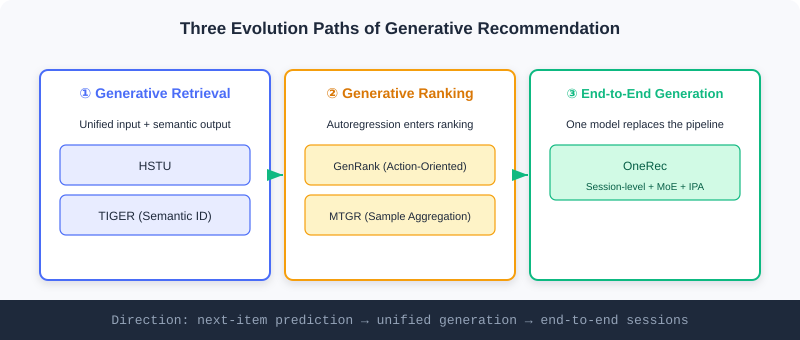

  📖
  ⏱️ ~32 min read
  🎯 Advanced

# Evolution of the Generative Paradigm

> 📝 **Before You Continue:** Make sure you have read the two paradigms and the four capability-evolution stages in [1.1](./../part1-introduction/recommender-system-basics.md), and the semantic/cold-start foundations in [5.2](./cold-start.md). This chapter is the "hands-on edition" of Part 1's two paradigms — turning abstract concepts into concrete models.

In [1.1](./../part1-introduction/recommender-system-basics.md) we planted a thread: recommendation can shift from "discriminative scoring" to "generative sequence generation", much like understanding and producing natural language as a special kind of "language". The earlier chapters of this part followed the discriminative three-stage pipeline through industrial practice; now it is time to return to that thread and see **how the generative paradigm concretely evolves**.

At its core is a redesign of three elements: **how the input is organized** (from item-ID sequences to heterogeneous event streams), **what the output generates** (from atomic IDs to semantic representations), and **how objectives and architecture trade off** (expressiveness vs computational efficiency). Along these three questions, generative recommendation has taken three clear paths — **generative retrieval, generative ranking, and end-to-end unified generation**.

After reading this chapter, you will be able to:

- **Connect** the capability leap of "memorization · generalization → understanding · reasoning" against Part 1's two paradigms
- **Explain** how HSTU unifies heterogeneous information into event streams and how TIGER reshapes the output with semantic IDs
- **Distinguish** generative ranking (GenRank / MTGR) from discriminative ranking in essence
- **Describe** OneRec's four key innovations in end-to-end generation, especially iterative preference alignment (IPA)
- Work through 4 tiered practice problems to consolidate the mapping from paradigm to model

---

## 5.3.0 From "Selecting the Best" to "Creating": A Paradigm Shift

Looking back at Part 1's two storylines: the discriminative approach asks "will the user like this candidate?" — **selection**; the generative approach asks "what does the user want to see next?" — **creation**. Generative retrieval (e.g. SASRec) has already validated that treating the user's behavior sequence as "language" and autoregressively predicting the next item is feasible.

But the real change goes beyond "swapping in a generative objective" — it systematically reshapes the input, the output, and the architecture. The table below contrasts each path's focus:

| Path | Element Reshaped | Representative Models |
|------|------------|----------|
| Generative retrieval | Unified input + semantic output | HSTU, TIGER |
| Generative ranking | Autoregression brought into the ranking stage | GenRank, MTGR |
| End-to-end unified generation | A single model replaces the full pipeline from retrieval to ranking | OneRec |

> 💡 **Key Insight:** These three paths do not replace one another; they are **progressively cumulative** — first prove generation works for retrieval, then push generative thinking into ranking, and finally let one model swallow the entire pipeline. Each step answers one of the questions "input / output / architecture".

---

## 5.3.1 Deepening Generative Retrieval: Redoing the Input and the Output

Generative retrieval deepens beyond SASRec in two directions: **HSTU** deepens the understanding of the "input", while **TIGER** fundamentally reshapes the definition of the "output".

### HSTU: Unifying Everything into Event Streams

**HSTU** is no longer content with plain item-ID sequences; it **uniformly encodes all of a user's heterogeneous information — attributes, behavior types, timestamps — into one rich "event stream"**. It learns the conditional distribution $p(\Phi_{i+1}|u_i)$, where $u_i$ is the user's comprehensive representation at the current moment and $\Phi_{i+1}$ is the next candidate item.

Two technical innovations are especially key:

1. **Unified feature handling**: categorical features are flattened by timestamp into a unified sequence, e.g. `[(feature:age,value:30), (action:login), (action:view,item:A)]`; numerical features are modeled implicitly so the model infers them itself.
2. **Point-wise aggregation**: it abandons the traditional Transformer's softmax normalization in favor of point-wise aggregation $A(X)V(X) = \phi_2(Q(X)K(X)^T + \text{rab}^{p,t})V(X)$. The motivation: in recommendation, the **"intensity" of user interest is a key signal**, but softmax forcibly normalizes all historical attention weights, distorting true preference intensity.

By switching the prediction target and training head, HSTU can also operate as a ranking rather than retrieval task — a testament to the flexibility of generative architectures.

### 🧠 Mental Model: From a "Ledger of Records" to an "Event Stream"

> The discriminative approach treats user history as a "list of candidate items" to score one by one; HSTU treats it as a **timestamped, action-typed, context-rich "diary of life"**. Instead of splitting "viewed A", "logged in", and "age 30" apart, it strings them into a chain of events over time, so the model reads the full information of both "intensity" and "order" — like reading a friend's diary rather than only their receipts, you know them far better.

### TIGER: Reshaping the Output with "Semantic IDs"

**TIGER** argues that predicting semantics-free **atomic IDs** is inefficient and hurts generalization, and instead generates structured **"semantic IDs"** to represent items. The pipeline has two stages:

**Stage 1 — generating semantic IDs**: use a Residual-Quantized Variational AutoEncoder (RQ-VAE). For an item's content feature vector $\boldsymbol{x}$, the encoder maps it to a latent representation $\boldsymbol{z} := \mathcal{E}(\boldsymbol{x})$; then $m$ quantization layers each find, at layer $d$, the codeword in the codebook closest to the current residual $\boldsymbol{r}_d$:

$$c_d = \arg\min_{k} \|\boldsymbol{r}_d - \boldsymbol{e}_k\|^2, \quad \boldsymbol{r}_{d+1} := \boldsymbol{r}_d - \boldsymbol{e}_{c_d}$$

The result is a semantic-ID tuple $(c_0, c_1, \ldots, c_{m-1})$.

**Stage 2 — sequence-to-sequence generation**: the user's historical interactions are converted into the corresponding semantic-ID sequence, and an Encoder-Decoder Transformer is trained to **autoregressively generate** the next item's semantic ID. The advantages:

- **Semantic sharing**: items with similar content have similar semantic IDs, enabling knowledge sharing;
- **Cold-start advantage**: semantic IDs can be generated for brand-new items and recommended directly (echoing content cold start in [5.2](./cold-start.md));
- **Structured representation**: multi-layer codewords represent large item corpora efficiently.

The costs: it may generate **invalid IDs**, and inference is expensive — a trade-off between expressiveness and computational efficiency.

> **Analysis:** HSTU and TIGER tackle the "input" and the "output" respectively, matching Part 1's capability evolution from **"generalization" (deeply understanding heterogeneous signals) to "understanding" (items encoded as semantics-carrying tokens)**. TIGER's semantic IDs are a natural antidote to cold start — new items are understood without any accumulated behavior. Yet both remain "retrieval-layer" generation and have not yet shaken ranking and re-ranking.

---

## 5.3.2 Generative Ranking: Pushing Autoregression into the Ranking Stage

Generative ranking brings autoregressive thinking into the traditional ranking stage, along two main technical routes.

### GenRank: Action-Oriented Sequence Organization

**GenRank** adopts an "action-oriented" design, redefining ranking as predicting the user's **action probability** for a given candidate, $p(a_{i+1} | \text{history}, \Phi_{i+1})$. The core insight: predicting **behavioral actions** (click, like) is computationally cheaper than predicting the next item ID — the action space is far smaller than the item space.

Architecturally, GenRank treats items as known positional context and focuses on predicting the action at each position; the input is the sum of five embeddings (item, action — candidates use a special `[MASK]` embedding, position, request index, time). It replaces learnable relative attention bias with **ALiBi (attention with linear biases)** — a parameter-free static penalty that cuts attention computation cost by roughly **75%** and speeds up training by **94.8%**.

### MTGR: Per-User Sample Aggregation

**MTGR** tries to retain a traditional DLRM's rich features while gaining the scalability of a generative architecture. Its core innovation is **per-user sample aggregation**: all $K$ candidates of a user are aggregated into a single sample `[user_features, [candidate_1_features, ..., candidate_K_features]]`, so user-related features are computed once and shared across all candidates.

To process such heterogeneous sequences, MTGR introduces **Group Layer Normalization (GLN)** — normalizing tokens from different semantic spaces (user profile, item features) separately — and a **dynamic masking strategy** — static user features are visible to all tokens, dynamic user features follow causality, and candidate tokens cannot see each other to prevent information leakage.

> ⚠️ **Warning:** Despite the "generative" label, MTGR is essentially a **ranking model** — its "generative" aspect is mainly architectural style (processing token sequences with a Transformer); the final goal remains discriminative scoring and ranking. Don't be misled by the name: it is discriminative dressed in generative clothing.

### 🧠 Mental Model: The Judge Reads the Entries Differently

> In discriminative ranking, the "judge" flips through each contestant's resume and scores it. GenRank/MTGR change the judge's **way of reading** — spreading all candidates side by side and scanning them at once with attention (the compute advantage of generative architectures). But the judge **still ends up scoring and selecting**, and has not become the friend who "writes out the list directly". That is the fundamental divide between generative ranking and end-to-end generation.

---

## 5.3.3 End-to-End Unified Generation: OneRec's Highest Form

**OneRec** represents the highest form of generative recommendation — **end-to-end unified generation**, where a single model runs the entire pipeline from retrieval to ranking. Its core innovation is **session-level generation**: instead of predicting a single next item, it directly generates an ordered recommendation list (typically 5–10 items), defined as a "session".

OneRec uses a standard Encoder-Decoder with three important extensions:

1. **Semantic item representation**: multi-level vector quantization turns each item into a sequence of semantic tokens, so the model understands content meaning rather than bare IDs.
2. **Sparse Mixture-of-Experts (MoE)**: MoE layers in the decoder's feed-forward networks activate a few expert subnetworks, significantly increasing capacity without a proportional increase in compute.
3. **Iterative Preference Alignment (IPA)**: the most innovative component, addressing the difficulty of obtaining explicit preference-comparison data in recommendation.

The IPA mechanism: first train a reward model to predict session quality (watch time, likes, etc.); use the current OneRec to generate multiple candidate sessions for a sample (usually 128); score them with the reward model, taking the highest-scoring as the "chosen" response $S_w$ and the lowest-scoring as the "rejected" response $S_l$; finally update the model with a **DPO (Direct Preference Optimization)** loss.

Deployed online, OneRec delivered a **1.68% increase in total user watch time**, proving the practical value of end-to-end unified generation. The cost is training complexity: the quantization model, the base generative model, and the reward model must be trained in sequence, followed by an iterative IPA-DPO loop — demanding on engineering.

### 🧠 Mental Model: From "Screening Resumes in Rounds" to "Writing the List in One Go"

> The discriminative cascade is like hiring via HR: a massive open call first (retrieval), then ranked interviews (ranking), then final headcount decisions (re-ranking) — three teams each owning one stage, with information lost in handoffs and objectives pulling apart. OneRec is like a **manager who knows the business and holds the authority**, writing out the complete hire list in one go (session-level generation) — done in a single stroke, with one unified objective. This is what Part 1 calls "end-to-end dissolving the three pains of the cascade".

> **Analysis:** End-to-end generation gains **unified optimization, no cascade information loss, and concentrated compute**; its costs are steeply higher **training complexity and inference overhead**, plus the supporting cast of DPO/reward models. It is no free lunch — complexity moves from "multi-stage coordination" to "single-model training engineering". Echoing Part 1: the generative approach replaces the discriminative "selection" with "creation", pushing memorization · generalization all the way to **understanding · reasoning**.

The interactive demo below visually contrasts the "discriminative cascade" with "generative end-to-end":

<iframe src="../viz/part5-generative.html?embed&vizId=part5-generative" style="width:100%; height:520px; border:none; display:block;" loading="lazy"></iframe>

Click "Next" or "Autoplay" to watch the three-stage cascade being replaced by a single generative model, and see how the paradigm shift maps to the "understanding · reasoning" stage of capability evolution.

---

## ⚠️ Common Mistakes in 5.3

| # | Mistake | Example | Why It's Wrong | Fix |
|---|---------|---------|---------------|-----|
| 1 | Taking MTGR as truly generative | "MTGR generates recommendations end to end" | It still ends in discriminative scoring; only the architectural style is generative | Recognize the real objective: generative ranking ≠ end-to-end generation |
| 2 | Assuming semantic IDs always beat atomic IDs | Replacing all retrieval with TIGER reflexively | Semantic IDs can generate invalid tokens and are pricier at inference | Weigh expressiveness vs efficiency; hybridize when needed |
| 3 | Confusing HSTU's input and output innovations | "HSTU uses semantic IDs for its output" | HSTU works on input unification; semantic IDs belong to TIGER | Keep them straight: HSTU = input, TIGER = output |
| 4 | Ignoring OneRec's engineering cost | Copying end-to-end without the DPO stack | Without a reward model/IPA, training cannot align preferences | End-to-end needs the full chain: quantization + generation + reward + DPO |

---

## Chapter Summary

### 📌 Key Takeaways

| Concept | Key Points | Why It Matters |
|---------|-----------|----------------|
| HSTU | Heterogeneous information unified into event streams + point-wise aggregation preserving intensity | Generative retrieval's deepening of the "input" |
| TIGER | RQ-VAE generates semantic IDs; autoregressive generation | A fundamental reshaping of the "output"; a natural cold-start fix |
| GenRank / MTGR | Action-oriented / sample aggregation | Generative thinking enters ranking; MTGR stays discriminative |
| OneRec | Session-level + MoE + IPA (DPO) | End-to-end unified generation swallowing the whole pipeline |
| Paradigm shift | Discriminative selection → generative creation | Maps to capability evolution: understanding · reasoning |

### ❓ FAQ

**Q1: What separates generative retrieval (HSTU/TIGER) from end-to-end generation (OneRec)?**
> A: The former only replaces per-candidate scoring with candidate generation at the "retrieval" layer; the latter uses one model to directly generate the entire session list, swallowing the full pipeline from retrieval to ranking. The span goes from "point prediction" to "unified generation".

**Q2: Why does TIGER ease cold start?**
> A: Semantic IDs are generated from content features (RQ-VAE), so new items obtain structured tokens without any accumulated behavior and can be generated into recommendations — exactly the "borrowing content" that content cold start in [5.2](./cold-start.md) calls for.

**Q3: Why does OneRec's IPA use DPO instead of direct supervision?**
> A: Recommendation rarely has "explicit preference-comparison data". IPA uses the reward model to pick the highest/lowest scorers among 128 candidates as "chosen/rejected" pairs, then aligns with DPO — bypassing the lack of annotations.

### Connections to Later Chapters

- **1.1 / 1.2** (paradigms and the map): this chapter grounds those two threads at the model level: discriminative → generative, and memorization · generalization → understanding · reasoning.
- **5.2** (cold start): TIGER's semantic IDs and CB2CF reach the same destination by different routes — both let new items be understood by borrowing content.
- **The follow-up volume (Ch6–Ch10)** builds on this chapter's OneRec to cover Scaling Laws (HSTU architecture), reasoning recommenders (OneRec-Think), diffusion models, and more.

---

## Practice Problems

Work through all problems in order — they get progressively harder. Each has a complete solution you can reveal after trying it yourself.

---

**Problem 5.3.1 — Classifying Generative Models** 🟢 Easy

Assign each model below to one of the three evolutionary paths (generative retrieval / generative ranking / end-to-end generation):
- (a) HSTU  (b) OneRec  (c) GenRank  (d) TIGER  (e) MTGR

💡 Solution (click to reveal)

**Approach:** Match each path's focus element and representative models.

- (a) HSTU → **generative retrieval** (reshapes the input: event streams)
- (d) TIGER → **generative retrieval** (reshapes the output: semantic IDs)
- (c) GenRank → **generative ranking** (action-oriented)
- (e) MTGR → **generative ranking** (per-user sample aggregation, but discriminative at heart)
- (b) OneRec → **end-to-end generation** (a single model swallows the full pipeline)

**Key points:**
- HSTU/TIGER sit at the retrieval layer; GenRank/MTGR at the ranking layer; OneRec spans the full pipeline.
- Though called generative, MTGR's objective remains discriminative scoring.

---

**Problem 5.3.2 — Computing TIGER Semantic IDs** 🟢 Easy

Given an item content feature $\boldsymbol{x}$, the RQ-VAE encodes it to $\boldsymbol{z}$, with the first-layer residual $\boldsymbol{r}_0=\boldsymbol{z}$. In the codebook $\{\boldsymbol{e}_k\}$, the codeword closest to $\boldsymbol{r}_0$ has index $c_0=3$, corresponding to $\boldsymbol{e}_3$. Write the selection formula for $c_0$ and the expression updating the residual $\boldsymbol{r}_1$.

💡 Solution (click to reveal)

**Approach:** Apply TIGER's quantization formulas directly.

Codeword selection:

$$c_d = \arg\min_{k} \|\boldsymbol{r}_d - \boldsymbol{e}_k\|^2$$

So $c_0 = \arg\min_k \|\boldsymbol{r}_0 - \boldsymbol{e}_k\|^2 = 3$.

Residual update:

$$\boldsymbol{r}_{d+1} := \boldsymbol{r}_d - \boldsymbol{e}_{c_d} \;\Rightarrow\; \boldsymbol{r}_1 = \boldsymbol{r}_0 - \boldsymbol{e}_3$$

**Key points:**
- Each layer finds the nearest codeword in the codebook, then subtracts it from the residual.
- Iterating over layers yields the semantic-ID tuple $(c_0,c_1,\ldots)$.

---

**Problem 5.3.3 — Telling "True" From "Fake" Generative** 🟡 Medium

Someone claims: "MTGR processes token sequences with a Transformer, so it is end-to-end generative recommendation." Point out what is wrong, and explain the key difference between GenRank and OneRec regarding "truly generative or not".

💡 Solution (click to reveal)

**Approach:** Judge generativeness by the "final objective", not the "architectural style".

**The error:** although MTGR uses Transformer/attention (generative architectural style), its **final objective is still discriminative scoring for ranking** — the candidates are known and scored one by one. It is merely "discriminative in generative clothing", not end-to-end generation.

**GenRank vs OneRec:** GenRank is still generative **ranking** — it autoregressively models action probabilities, but the candidate set is known, the outputs are actions/scores, and retrieval and re-ranking remain untouched. OneRec is the real **end-to-end generation** — a single model directly generates an ordered session list (5–10 items), replacing the entire pipeline from retrieval to ranking, with the objective shifting from "scoring" to "creating sequences".

**Key points:**
- The criterion is "the objective: score-and-select or create sequences", not "whether a Transformer is used".
- Generative ranking ≠ end-to-end generation; the gap is an order of magnitude.

---

**Problem 5.3.4 — Designing OneRec's Alignment Pipeline** 🔴 Hard

You are to run preference alignment on OneRec. Write out the complete IPA steps (including the number of candidates and the definitions of chosen/rejected responses), explain why DPO rather than direct supervision, and identify the three prerequisite models the pipeline depends on.

💡 Solution (click to reveal)

**Approach:** Unfold the IPA mechanism step by step.

**Steps:**
1. Train a **reward model** to predict session quality (watch time, likes, etc.).
2. Use the current OneRec to generate **128** candidate sessions for a training sample.
3. The reward model scores all candidates; the **highest score** becomes the "chosen" response $S_w$, the **lowest** the "rejected" response $S_l$.
4. Update OneRec's parameters with the **DPO loss**.

**Why DPO rather than direct supervision:** recommendation rarely has "explicit preference-comparison data" (users won't label "which of these two lists is better"). IPA uses the reward model to **construct** "chosen/rejected" pairs from the model's own generated candidates, bypassing the annotation shortage; DPO needs no separate critic and optimizes the policy directly on such comparison pairs — stable and efficient.

**Three prerequisite models:** (1) the **semantic representation model** with multi-level vector quantization (item → tokens); (2) OneRec's **base generative model**; (3) the **reward model**. All three must be in place before the IPA-DPO loop can run.

**Key points:**
- IPA = self-generated candidates → reward scoring → chosen/rejected pairs → DPO.
- DPO removes the core obstacle of "no explicit preference annotations".
- End-to-end engineering is costly: the full chain of quantization + generation + reward + DPO.

---

**🏆 Challenge: Arguing a Paradigm Migration**

Suppose your company runs a discriminative three-stage system (retrieval + ranking + re-ranking) whose metrics have hit a plateau. Write an argument of at most 200 words: which **signals** should prompt you to try "generative ranking (e.g. GenRank)" first rather than jumping straight to "end-to-end generation (OneRec)"? Also state the risks and benefits of this incremental path.

💡 Hint

Signals favoring generative ranking first: the ranking stage suffers severe compute fragmentation and high attention cost (GenRank's ALiBi cuts compute by 75%), while mature retrieval/re-ranking stages are best left untouched. The **benefits** of the incremental path: controlled risk, quick local wins, no wholesale rewrite; the **risks**: still constrained by cascade information loss and misaligned objectives — the root cause remains. Once ranking validates the generative value and engineering is ready with quantization + reward + DPO, move up to OneRec for end-to-end. This echoes Part 1's "three pains of the cascade" and the progressive logic of this chapter's three paths.

