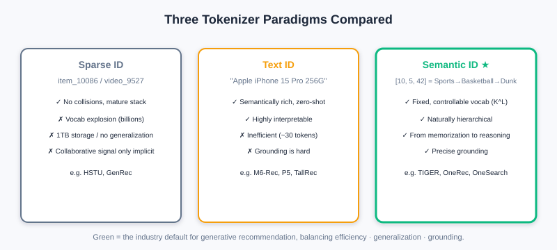
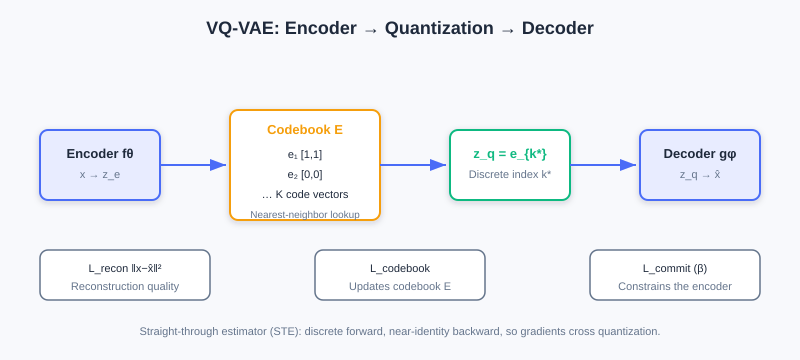
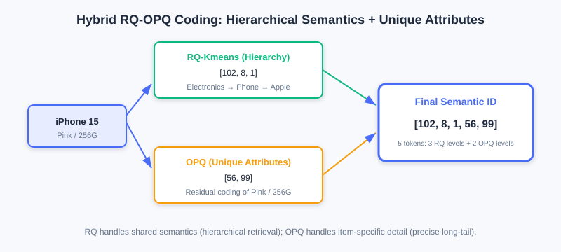

<div class="badge-row">
  <span style="background: #f0f4ff; color: #4A6CF7; padding: 4px 12px; border-radius: 20px; font-size: 0.85em; font-weight: 600; border: 1px solid rgba(74,108,247,0.2);">📖</span>
  <span style="background: #fef2f2; color: #dc2626; padding: 4px 12px; border-radius: 20px; font-size: 0.85em; border: 1px solid rgba(100,100,100,0.15);">⏱️ ~50 min read</span>
  <span style="background: #fef2f2; color: #dc2626; padding: 4px 12px; border-radius: 20px; font-size: 0.85em; border: 1px solid rgba(100,100,100,0.15);">🎯 Advanced</span>
</div>

# Tokenizer Technology in Recommendation: Codebook Quantization and Semantic IDs

> 📝 **Before You Continue:** Please first read the "item tokenization" problem raised repeatedly in [6.3](./llm-foundation.md), and the Decoder-Only autoregressive generation in [6.2](./gr-architecture.md) — semantic IDs are exactly the "vocabulary" fed to it.

In [6.3] we pointed out that **Item Tokenization** is the key bridge connecting traditional recommendation data and generative models. This chapter faces this core problem head-on: **how do we transform items in a recommender system into token sequences that generative models can understand and generate?**

After reading this chapter, you will be able to:

- Compare the strengths and weaknesses of the three paradigms: **sparse ID / text ID / semantic ID**
- Explain the three values of semantic IDs: "controlled vocabulary, hierarchical structure, from memorization to reasoning"
- Derive **VQ-VAE**'s quantization and three losses, and understand the **Straight-Through Estimator (STE)**
- Explain how **RQ-VAE**'s residual quantization produces hierarchical semantic IDs
- Know industrial-grade decoupled and hybrid schemes such as **RQ-Kmeans / RQ-OPQ**
- Complete 5 tiered practice problems and experience quantization hands-on with the interactive demo

---

## 6.4.0 The Evolution of Three Tokenizer Paradigms

Understanding the three mainstream item representation paradigms is both a technology choice and a shift in modeling philosophy.

### The Sparse ID Paradigm (Sparse ID-Based)

The traditional approach: assign each item a unique atomic ID (e.g., `item_10086`). In discriminative models, the ID is mapped to a continuous vector through an embedding layer, and a deep network then learns interactions. Representatives: HSTU (organizing behavior into structured sequences like `[item, action, timestamp, ...]`), GenRec (using sparse IDs directly in a generative architecture).

**Advantages**: collision-free guarantee, freedom in feature interaction, mature engineering.

But migrating this to generative models faces **three fundamental dilemmas**:

1. **Vocabulary explosion**: generative models do next-token prediction over a vocabulary, with Softmax complexity $O(V\cdot d)$. GPT-3's vocabulary of about 50K and LLaMA's 32K are tolerable; but with billions of videos on short-video platforms and hundreds of millions of products on e-commerce sites, vocabularies reach the billion scale — far beyond what Softmax can bear.
2. **The dual dilemma of storage and generalization**: maintaining 256-dim embeddings for a billion IDs takes roughly 1TB of parameters; more fatally, **atomic IDs are orthogonal** — a new item is an alien symbol to the model and must accumulate data from zero before it is "recognized."
3. **Implicit dependence on collaborative signals**: ID similarity can only be learned from massive behavioral statistics like "watched A, also watched B"; with sparse data it degrades sharply.

### The Text ID Paradigm (Text-Based)

Since LLMs excel at natural language, why not represent items as text? Serialize attributes/descriptions into natural language and encode/generate with the LLM's pretrained vocabulary (30–50K). Representatives: M6-Rec (filling attributes into templates as text), LLMTreeRec (tree-structured hierarchical text), TallRec/P5 (key-value pairs reusing T5).

**Advantages**: rich semantics, zero-shot generalization, strong interpretability.

**Two fatal flaws**:

1. **Low representation efficiency**: one product takes tens to hundreds of tokens (an iPhone example runs about 30 tokens); self-attention's $O(n^2)$ cost grows quadratically with length, and information density is sparse.
2. **Grounding difficulty**: how does generated text map precisely back to the candidate set? There are ambiguities ("Apple phone" matches hundreds of models), incompleteness, and out-of-candidate-set issues. BIGRec patches this with two stages + L2 re-ranking, but that betrays the original end-to-end intent.

### The Semantic ID Paradigm (Semantic ID-Based)

The **Semantic ID (SID)** is a revolutionary leap beyond the previous two: items are represented as **fixed-length discrete token sequences**, where each token comes from a controllably sized semantic codebook (thousands to tens of thousands). Taking TIGER as an example, a video of "NBA superstar dunk highlights" is encoded as:

```
SID = [10, 5, 42]   # sports → basketball → dunk highlights
```



**Three core advantages**:

1. **Controlled fixed vocabulary**: no matter how large the item catalog, the base semantic units are limited. With vocabulary $K=8000$ and sequence length $L=4$, the theoretical capacity is $K^L=8000^4\approx4\times10^{15}$ items — far beyond any real catalog. OneRec uses a vocabulary of about 8000 and OneSearch 4000–6000, keeping end-to-end autoregressive training costs manageable.
2. **Naturally hierarchical structure**: an SID is a hierarchical sequence — prefixes are coarse-grained ("sports"), suffixes fine-grained ("basketball dunks"). It naturally supports **prefix matching** — first settle the category, then refine, consistent with human cognition; similar items share prefixes, providing a structured inductive bias.
3. **The leap from memorization to reasoning**: atomic IDs can only "memorize" associations; semantic IDs **encode similarity relationships in the token structure** — all basketball videos share the `[10,5,...]` prefix. Once the model learns that a user likes "basketball" as a semantic, it generalizes to all new items containing that token, even if they never appeared in training data.

> 💡 **Key Insight:** Semantic IDs elegantly balance the conflicting demands of **representation capacity, computational efficiency, and precise grounding** — the mainstream choice for current industrial generative recommendation — processable efficiently by LLMs while retaining the collaborative information recommendation depends on.

---

## 6.4.1 The Design Philosophy from Atomic IDs to Semantic IDs

Traditional atomic IDs (`ID:10086`) work well in discriminative architectures — the embedding layer maps the ID to a continuous vector, and massive behavior draws the vectors of two Jackie Chan action films close together. But once reframed as a generative problem, it is **fundamentally incompatible** with generative architectures: generative models require probabilistic modeling over a discrete token space, and an atomic ID's ultra-large vocabulary makes this infeasible both mathematically and engineering-wise.

The core idea of semantic IDs is to shift items from "identity markers" to "semantic descriptions" — instead of random numeric labels, a sequence of meaning-bearing tokens represents content attributes. Analogy: you wouldn't say "recommend ID:89757"; you'd say "recommend a sci-fi thriller about AI awakening with stunning visuals" — this description uniquely identifies the film through **hierarchical concept composition** (sci-fi → thriller → AI → visuals) and naturally encodes similarity (all sci-fi films share the "sci-fi" prefix).

In engineering practice, semantic IDs integrate two families of signals:

- **Content signals**: multimodal features (visuals/title/images) are turned into semantic vectors by pretrained encoders (CLIP, BERT).
- **Collaborative signals**: the crowd behavior patterns contained in the user-item interaction matrix.

The two are jointly encoded into a continuous semantic vector, then converted into a token sequence via **discretization encoding** (vector quantization), e.g., "NBA dunk highlights" → `[sports, basketball, dunk, highlights]` → numbers `[10, 5, 42, 89]`.

### Fundamental Improvements on Three Levels

- **Controlled fixed vocabulary**: from the combinatorial nature of sequences — a limited set of base units composes to represent massive item catalogs.
- **Hierarchical structure**: vertical (coarse → fine progression) + horizontal (similar items at the same level cluster together). Once the model learns a user likes token 5 (basketball), it naturally transfers to all `[10,5,...]` items — **prefix-based generalization**.
- **From memorization to reasoning**: first-order reasoning (item B with the same prefix resembles A), second-order reasoning (cross-category transfer "basketball → soccer"), compositional reasoning ("tutorial + basketball" → basketball tutorial videos). It stays strong under cold start/long tail — the fundamental reason semantic IDs became mainstream.

---

## 6.4.2 VQ-VAE: The Foundation of Discretization

**VQ-VAE (Vector Quantised-VAE)** is the foundational technique for semantic ID discretization, solving the key problem of "converting continuous high-dimensional semantics into discrete symbol sequences while preserving representational power." It introduces a **learnable Codebook**, establishing an effective mapping from continuous semantic space to discrete symbol space — dramatically reducing dimensionality (billions of atomic IDs → a codebook of tens of thousands) while giving IDs semantic relationships.

### Three-Stage Architecture



**① Encoder mapping**: the encoder $f_\theta$ maps input $x\in\mathbb{R}^D$ to a continuous latent vector $z_e=f_\theta(x)\in\mathbb{R}^d$ ($d\ll D$ achieves dimensionality reduction).

**② Vector quantization**: maintain a learnable codebook $E=[e_1,\dots,e_K]\in\mathbb{R}^{d\times K}$ ($K$ from thousands to tens of thousands); quantization is nearest-neighbor search:

$$k^*=\arg\min_{j\in\{1,\dots,K\}}\|z_e-e_j\|_2,\qquad z_q=e_{k^*}$$

This discretizes the continuous $z_e$ into codebook index $k^*$. **Numerical walkthrough**: if $z_e=[0.6,0.8]$, codebook $e_1=[1,1]$ and $e_2=[0,0]$, then the distance to $e_1$ is $\sqrt{0.16+0.04}\approx0.45$ and to $e_2$ is $1.0$ — choose $e_1$, i.e., $z_q=[1,1]$: the continuous space "collapses" onto the nearest discrete point.

**③ Decoder reconstruction**: $\hat{x}=g_\phi(z_q)\in\mathbb{R}^D$. Overall: $x\xrightarrow{f_\theta}z_e\xrightarrow{\text{quantize}}z_q\xrightarrow{g_\phi}\hat{x}$.

### Loss Function (Three Cooperative Parts)

$$\mathcal{L}_{\text{VQ}}=\underbrace{\|x-\hat{x}\|_2^2}_{\mathcal{L}_{\text{recon}}}+\underbrace{\|\text{sg}[z_e]-z_q\|_2^2}_{\mathcal{L}_{\text{codebook}}}+\underbrace{\beta\|z_e-\text{sg}[z_q]\|_2^2}_{\mathcal{L}_{\text{commit}}}$$

- **Reconstruction loss** $\mathcal{L}_{\text{recon}}$: measures reconstruction quality ($L_2$ for images, cosine for text).
- **Codebook loss** $\mathcal{L}_{\text{codebook}}$: uses $\text{sg}[z_e]$ (stop-gradient) to pull codebook vectors $e_k$ toward encoder outputs; gradients update only the codebook $E$, not the encoder.
- **Commitment loss** $\mathcal{L}_{\text{commit}}$ ($\beta$ recommended 0.25): constrains encoder outputs from straying far from the quantized codeword, preventing training instability.

### Gradient Propagation: the Straight-Through Estimator (STE)

The quantization $\arg\min$ is non-differentiable almost everywhere, so standard backpropagation fails. VQ-VAE uses the **STE**: the forward pass strictly performs discretization; the backward pass treats quantization as an identity mapping, $\frac{\partial\mathcal{L}}{\partial z_e}\approx\frac{\partial\mathcal{L}}{\partial z_q}$, passing decoder gradients straight back to the encoder. Gradient flow: the encoder receives reconstruction (via STE) + commitment gradients; the decoder receives only reconstruction gradients; the codebook receives only codebook-loss gradients.

> **Analysis:** Note that although VQ-VAE has "VAE" in its name, it is essentially different from a variational autoencoder — it directly optimizes reconstruction loss and uses a discrete codebook for representation learning, closer to an ordinary autoencoder, and introduces no KL-constrained ELBO.

---

## 6.4.3 RQ-VAE: Hierarchical Residual Quantization

VQ-VAE maps each item to a **single** discrete token, facing a "representation precision vs. codebook size" trade-off: increasing $K$ improves precision but destabilizes training; decreasing $K$ leaves a single token unable to capture complex multi-dimensional semantics.

**RQ-VAE (Residual Quantised-VAE)** fundamentally breaks this limit with **residual quantization**: it expands single quantization into an $L$-layer cascade, each layer capturing what the previous layer missed, producing a token sequence of length $L$. Codebook size stays controlled at $K$, while theoretical representation capacity rises to $K^L$.


### The Residual Quantization Iteration Mechanism

Given the encoder output $z_e\in\mathbb{R}^d$, at layer $\ell$ ($\ell=1,\dots,L$):

$$r_\ell=r_{\ell-1}-e^{(\ell)}_{k_\ell},\qquad k_\ell=\arg\min_{j}\|r_{\ell-1}-e^{(\ell)}_j\|_2$$

where $r_0=z_e$; the final quantized representation is $z_q=\sum_{\ell=1}^{L}e^{(\ell)}_{k_\ell}$, and the semantic ID is the token sequence $\text{ID}=[k_1,k_2,\dots,k_L]$.

**Numerical walkthrough (residual approximation)**: target $z=[5.5]$ (1-dimensional), two codebook layers. Layer-1 codebook $\{0,5,10\}$: nearest is $[5]$, residual $r_1=0.5$; Layer-2 codebook $\{0.0,0.4,0.8\}$: nearest is $[0.4]$, residual $r_2=0.1$. Reconstruction $\hat{z}=5+0.4=5.4$; the error drops from 0.5 to 0.1.

**Hierarchical semantics emerge**: layer-by-layer approximation naturally forms a hierarchy — early layers capture coarse granularity ("sports"), later layers fine granularity ("basketball tutorials"). Take "NBA superstar dunk highlights" as an example:

1. **Layer 1 (coarse)**: closest to $z$ is "sports" $e_{10}$, ID=`[10]`; the residual still contains "which sport?"
2. **Layer 2 (medium)**: closest in the residual is "basketball" $e_5$, ID=`[10,5]`; the residual focuses on "game or tutorial? dunk or jump shot?"
3. **Layer 3 (fine)**: "dunk action" $e_{42}$ captures the detail; the final `SID=[10,5,42]`.

This "continuous focusing" mechanism means that seeing only the prefix `[10,5]` already tells the model it is a basketball video, achieving effective fuzzy matching.

### Loss and Gradients

The RQ-VAE loss extends VQ-VAE's to a multi-layer accumulation:

$$\mathcal{L}_{\text{RQ}}=\|x-\hat{x}\|_2^2+\sum_{\ell=1}^{L}\left[\|\text{sg}[r_{\ell-1}]-e^{(\ell)}_{k_\ell}\|_2^2+\beta\|r_{\ell-1}-\text{sg}[e^{(\ell)}_{k_\ell}]\|_2^2\right]$$

Each layer independently optimizes its own codebook $E^{(\ell)}$, with the commitment loss cascading to prevent residual drift. Gradients still rely on the STE, applied independently at each layer's quantization point.

The interactive demo below lets you intuitively experience how RQ-VAE quantizes an item vector layer by layer and produces a hierarchical semantic ID:

<iframe src="../viz/part6-rqvae.html?embed&vizId=part6-rqvae" style="width:100%; height:520px; border:none; display:block;" loading="lazy"></iframe>

Click "Next step" to observe: the encoder output → Layer-1 quantization capturing coarse semantics → the residual passed to the next layer → progressive refinement until the complete SID sequence is produced. Notice how each layer's residual gets smaller and smaller.

---

## 6.4.4 Industrial-Grade Solutions: Decoupling and Hybrid

End-to-end RQ-VAE training has maintenance difficulties in large-scale industrial deployment: every model update requires recomputing SIDs for all items. Hence two-stage solutions based on **decoupling** emerged.

### RQ-Kmeans: Decoupled Clustering

**RQ-Kmeans** proposes: a codebook is essentially a clustering partition of representation space — why not build it directly with K-means? It decouples discretization into two steps: ① any representation model (BERT/CLIP) produces continuous item vectors; ② K-means clustering directly on those vectors builds the codebook. The representation model and the codebook can iterate independently; quantizing a new item needs only vector search, no retraining.

The residual quantization framework is retained, but gradient learning is replaced by K-means: at layer $\ell$, cluster the residual set $\mathcal{R}^{(\ell)}$ to get codebook $\mathcal{C}^{(\ell)}=\text{K-means}(\mathcal{R}^{(\ell)},K)$; assign each item its nearest centroid index $s^{(\ell)}_i$, and pass the residual $\mathcal{R}^{(\ell+1)}_i=\mathcal{R}^{(\ell)}_i-\boldsymbol{c}^{(\ell)}_{s^{(\ell)}_i}$ to the next layer. Finally $\text{ID}_i=[s^{(1)}_i,\dots,s^{(L)}_i]$, with quantized representation $\sum_\ell\boldsymbol{c}^{(\ell)}_{s^{(\ell)}_i}$.

The core difference from RQ-VAE is that **representation learning is decoupled from codebook construction** — new items can be quickly assigned SIDs via Faiss vector search, and K-means' uniform clustering also naturally mitigates "codebook collapse."

### RQ-OPQ: Hybrid Encoding

RQ-VAE/RQ-Kmeans share a key problem: **the last layer's residual is discarded outright**, yet it contains unique attributes (specific brand and model, price range) — precisely what distinguishes similar items in e-commerce search.

**RQ-OPQ** proposes a hybrid scheme: **RQ handles hierarchical semantics, while OPQ (Optimized Product Quantization) handles horizontal unique attributes**. OPQ first learns a rotation matrix $R$ that projects the residual into a subspace that is easier to quantize, then splits it into $M$ sub-vectors for independent scalar quantization; the subspace indices are concatenated into the OPQ tokens (an implicit codebook of $K_{\text{sub}}^M$). With OneSearch's configuration $M=2,K_{\text{sub}}=256$, this yields a representation space of $256^2=65536$.

**Complete encoding**: RQ-Kmeans gives hierarchical tokens $[s^{(1)},\dots,s^{(L)}]$ and the final residual $r_L$; OPQ encodes $r_L$ into supplementary tokens $[q_1,\dots,q_M]$. Finally

$$\text{ID}_i=[\underbrace{s^{(1)}_i,\dots,s^{(L)}_i}_{\text{hierarchical semantics}},\underbrace{q_1,\dots,q_M}_{\text{unique attributes}}]$$

OneSearch actually uses `(4096,1024,512 | 256,256)`: 3 layers of RQ-Kmeans + 2 layers of OPQ, 5 tokens per item. Take the **iPhone 15 (pink, 256GB)**: the RQ part `[102,8,1]` (electronics → mobile phones → Apple) establishes the hierarchical identity; OPQ encodes "pink" and "256GB" from the residual as `[56,99]`. The final `[102,8,1,56,99]` contains both the phone's hierarchical facts and the specific SKU's unique attributes — perfectly resolving long-tail product distinction and retrieval.



### Core Challenges and Responses

| Challenge | Root Cause | Response Strategy |
|------|------|----------|
| **SID collisions** | Quantization clustering's "uneven codebook utilization" maps multiple items to the same SID | Optimize at training time (uniform allocation, capacity limits) + remedy at inference (hybrid encoding disambiguation) |
| **Objective misalignment** | Representation extraction / SID quantization / generation training are optimized independently in three stages, lacking end-to-end alignment | Joint optimization (end-to-end gradients) + self-supervised alignment (cycle consistency, iterative adaptation) |
| **Multimodal fusion** | Content/collaborative/context modalities have inconsistent distributions; naive concatenation fails | Fusion at the representation layer (gating/contrastive learning) + fusion at the quantization layer (modality-specific codebooks, MoE) |

---

## ⚠️ Common Mistakes in 6.4

| # | Mistake | Example | Why It's Wrong | Fix |
|---|---------|---------|---------------|-----|
| 1 | Using item IDs directly as the generative vocabulary | "Softmax over a billion products directly" | Vocabulary explosion; Softmax is unaffordable | Use semantic IDs to compress into a $K^L$ controlled vocabulary |
| 2 | Believing text IDs are a panacea | "Just describe items in natural language" | Low representation efficiency + grounding difficulty | Semantic IDs balance efficiency and precise mapping |
| 3 | Confusing VQ-VAE with VAE | "VQ-VAE uses a KL-constrained ELBO" | VQ-VAE has no variational inference; it is direct reconstruction | Remember it is an autoencoder with a codebook |
| 4 | Ignoring the straight-through estimator | "Quantization can be backpropagated directly" | $\arg\min$ is non-differentiable almost everywhere | Use the STE to pass gradients as if identity |
| 5 | Discarding the RQ's last-layer residual | "The residual is useless, drop it" | The residual holds unique attributes, key to long-tail distinction | RQ-OPQ encodes the residual with OPQ |

---

## Chapter Summary

### 📌 Key Takeaways

| Concept | Key Points | Why It Matters |
|---------|-----------|----------------|
| Three paradigms | Sparse ID / text ID / semantic ID | Semantic IDs balance efficiency · generalization · grounding |
| Semantic ID value | Controlled vocabulary / hierarchy / from memorization to reasoning | The mainstream industrial choice |
| VQ-VAE | Encoder-quantizer-decoder + three losses + STE | The foundation of discretization |
| RQ-VAE | Residual quantization → hierarchical SIDs; capacity $K^L$ | Breaks the single-token representation bottleneck |
| RQ-Kmeans | K-means replaces gradient-learned codebooks; decoupled | New items need no retraining |
| RQ-OPQ | RQ hierarchy + OPQ unique attributes hybrid | Precise distinction of long-tail products |

### ❓ FAQ

**Q1: Why do semantic IDs ease cold start?**
> A: Similar items share semantic prefixes (like `[10,5,...]`); once the model learns the "basketball" preference, it generalizes to all new items containing that token — no need to memorize from behavioral data.

**Q2: What does RQ-VAE add over VQ-VAE?**
> A: Residual quantization upgrades a single token to an $L$-layer token sequence; codebook size is unchanged but capacity rises to $K^L$, and hierarchical semantics emerge naturally.

**Q3: Why does industry prefer RQ-Kmeans over end-to-end RQ-VAE?**
> A: End-to-end requires recomputing the whole catalog's SIDs on every update; RQ-Kmeans decouples representation from the codebook — new items get SIDs via vector search, and K-means' uniform clustering mitigates codebook collapse.

### 🔗 Connections to Later Chapters

- The Decoder-Only autoregression of **6.2** (architectural foundations) is exactly the "generator" that consumes semantic ID sequences.
- **6.3** (LLM Foundations) listed "item tokenization" as the core migration challenge; this chapter delivers the solution.
- **8.x** (End-to-end Generation) uses SIDs as the input/output interface of models like TIGER/OneRec.
- The latent-space diffusion of **10.x** (Diffusion Recommendation) shares the space-compression idea with this section's codebook quantization.

---

## Practice Problems

Work through all problems in order — they get progressively harder. Each has a complete solution you can reveal after trying it yourself.

---

**Problem 6.4.1 — Vocabulary Capacity Computation** 🟢 Easy

Let the semantic ID codebook size be $K=8000$ and the sequence length $L=4$. How many distinct items can be represented in theory? Contrast this with the embedding scale the sparse ID paradigm would need to maintain for the same number of items (256 dims per item, float32).

<details>
<summary>💡 Solution (click to reveal)</summary>

**Approach:** Combinatorial property.

$K^L=8000^4=4.096\times10^{15}$ items.

Sparse IDs would need $4.096\times10^{15}\times256\times4$ bytes $\approx 4.2\times10^{18}$ bytes $\approx 4.2$ exabytes (EB) — utterly infeasible; semantic IDs need only $K\times L=8000\times4=32000$ codebook vectors (each 256-dim float32 codeword is about 1KB, so all 32000 codewords total roughly 32MB).

**Key points:**
- Semantic IDs express massive catalogs with "combinations of short sequences" under a controlled vocabulary.
- This is exactly the key to solving vocabulary explosion.

</details>

---

**Problem 6.4.2 — VQ-VAE Quantization** 🟢 Easy

The encoder output is $z_e=[0.6,0.8]$, codebook $e_1=[1,1],e_2=[0,0]$. Find the quantization index and $z_q$, and explain how the STE approximates in the backward pass.

<details>
<summary>💡 Solution (click to reveal)</summary>

**Approach:** Nearest neighbor.

Distance to $e_1$: $\sqrt{(0.6-1)^2+(0.8-1)^2}=\sqrt{0.16+0.04}=\sqrt{0.2}\approx0.447$; distance to $e_2$: $\sqrt{0.36+0.64}=1.0$. Choose $e_1$, so $k^*=1$, $z_q=[1,1]$.

In the backward pass, the STE treats quantization as identity: $\frac{\partial\mathcal{L}}{\partial z_e}\approx\frac{\partial\mathcal{L}}{\partial z_q}$ — gradients pass straight through the discrete jump back to the encoder.

**Key points:**
- Forward strictly discrete, backward approximated as identity.
- The STE is standard equipment for training VQ-family models.

</details>

---

**Problem 6.4.3 — RQ-VAE Residuals** 🟡 Medium

Target $z=[5.5]$; Layer-1 codebook $\{0,5,10\}$ selects $[5]$; Layer-2 codebook $\{0.0,0.4,0.8\}$ selects $[0.4]$. Write out each layer's residual $r_1,r_2$ and the final reconstruction $\hat{z}$, and explain how hierarchical semantics emerge.

<details>
<summary>💡 Solution (click to reveal)</summary>

**Answer:**
- Layer 1: $k_1=5$ (representing the "integer scale"), $r_1=5.5-5=0.5$.
- Layer 2: $k_2=0.4$ (representing the "fractional part"), $r_2=0.5-0.4=0.1$.
- Reconstruction $\hat{z}=5+0.4=5.4$, error $0.1$ (down from $0.5$).

Hierarchical semantics: layer 1 captures the coarse granularity (overall scale/major category), layer 2 captures fine granularity (residual details); layer-by-layer refinement is "continuous focusing," and the sequence `[5, 0.4]` itself carries a coarse-to-fine structure.

**Key points:**
- The residual = information the previous layer failed to capture, passed to the next layer.
- Stacking layers multiplies capacity to $K^L$, with natural hierarchy.

</details>

---

**Problem 6.4.4 — Why RQ-OPQ Is Necessary** 🔴 Hard

Explain why the RQ's last-layer residual should not be discarded, and write out the structure of the final RQ-OPQ ID. Use the iPhone 15 (pink, 256GB) to explain the division of labor between RQ and OPQ.

<details>
<summary>💡 Solution (click to reveal)</summary>

**Answer:** The RQ residual contains an item's unique attributes (brand/model, price, color) — precisely what distinguishes similar items in e-commerce search; discarding it makes precise distinction of long-tail products impossible.

Final RQ-OPQ ID:
$$\text{ID}=[\underbrace{s^{(1)},\dots,s^{(L)}}_{\text{hierarchical semantics}},\underbrace{q_1,\dots,q_M}_{\text{unique attributes}}]$$

iPhone 15 (pink, 256GB): the RQ part `[102,8,1]` = electronics → mobile phones → Apple, establishing the hierarchical identity (grouped with Huawei/Xiaomi under "phones"); OPQ encodes "pink" and "256GB" from the residual as `[56,99]`, dedicated to precisely matching the user's specific attribute constraints. The final `[102,8,1,56,99]` holds both hierarchical facts and SKU uniqueness.

**Key points:**
- RQ handles shared semantics; OPQ handles individual characteristics.
- Hybrid encoding balances retrieval (hierarchy) and precision (uniqueness).

</details>

---

**🏆 Challenge: Designing an SID Scheme**

An e-commerce platform has 500M products with 500K new additions per day. In about 150 words, explain: should you choose end-to-end RQ-VAE or decoupled RQ-Kmeans? Give a vocabulary and layer-count configuration approach, and point out how to handle "SID collisions" and "new items going live without retraining the whole catalog."

<details>
<summary>💡 Hint</summary>

Choose **decoupled RQ-Kmeans**: with 500K daily additions, end-to-end RQ-VAE would require recomputing all 500M SIDs — cost explodes; after decoupling, new items get SIDs via vector search (Faiss) with no retraining. Configure e.g. 3 RQ layers + 2 OPQ layers (referencing OneSearch), codebooks around 4096–8000. Mitigate SID collisions with uniform allocation/capacity-limiting algorithms; disambiguate the long tail via OPQ unique attributes; new items only need vector search, no entry into training.

</details>
