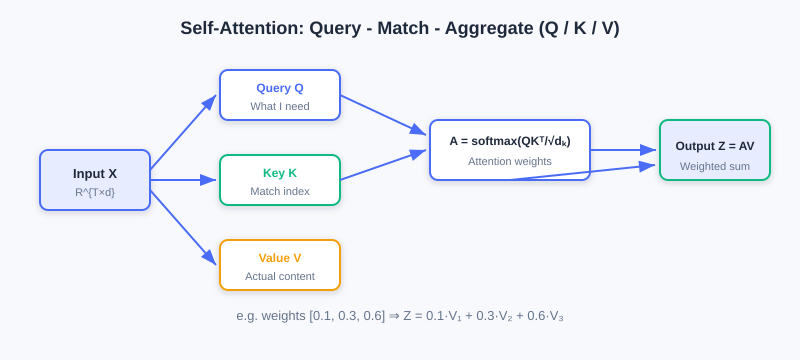
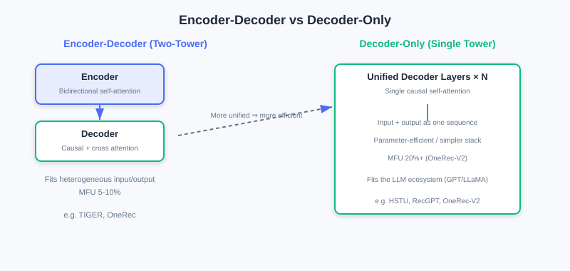
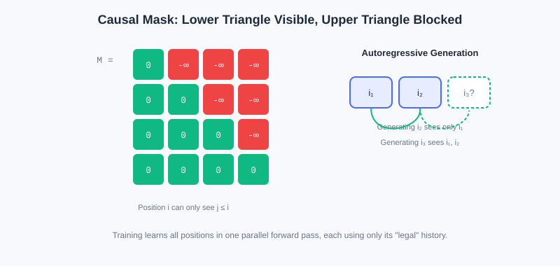
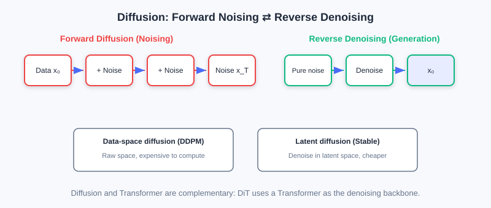

<div class="badge-row">
  <span style="background: #f0f4ff; color: #4A6CF7; padding: 4px 12px; border-radius: 20px; font-size: 0.85em; font-weight: 600; border: 1px solid rgba(74,108,247,0.2);">📖</span>
  <span style="background: #fef2f2; color: #dc2626; padding: 4px 12px; border-radius: 20px; font-size: 0.85em; border: 1px solid rgba(100,100,100,0.15);">⏱️ ~45 min read</span>
  <span style="background: #fef2f2; color: #dc2626; padding: 4px 12px; border-radius: 20px; font-size: 0.85em; border: 1px solid rgba(100,100,100,0.15);">🎯 Advanced</span>
</div>

# Foundations of Generative Architectures

> 📝 **Before You Continue:** You should first read the "unified Transformer" claim in [6.1](./gr-paradigm.md), plus the intuition about inner products and vector spaces in [2.3](./../part2-retrieval/two-tower.md). This chapter does not dig into mathematical derivations; it emphasizes **intuitive understanding** of architectures and **adaptation to recommendation scenarios**.

With the core ideas of generative recommendation in place, we now build the technical foundation that supports it — the **Generative Architecture**. Generative recommendation models recommendation as a sequence generation task, and producing high-quality sequences requires a strong model architecture behind it.

Current generative recommendation mainly relies on two families of architectural paradigms: **Transformer** and **Diffusion models**. Their generation mechanisms are fundamentally different, yet both provide solid support for generative recommendation — Transformer generates token by token autoregressively and excels at capturing causal dependencies; Diffusion recovers data from noise through iterative denoising and offers a fresh generative perspective. More importantly, they are **not mutually exclusive** — they are complementary and synergistic.

After reading this chapter, you will be able to:

- Explain the Q/K/V computation and multi-head mechanism of **self-attention** as "query—match—aggregate"
- Explain why **positional encoding** (absolute/relative, time-aware) is indispensable for recommendation sequences
- Compare the strengths, weaknesses, and applicable scenarios of **Encoder-Decoder** vs. **Decoder-Only** architectures
- Explain how the **causal mask** enables autoregressive generation while keeping training parallel
- Outline **Diffusion**'s forward diffusion / reverse denoising and its applications in recommendation
- Complete 5 tiered practice problems to consolidate the key mechanisms of generative architectures

---

## 6.2.0 Why Transformer and Diffusion

Since "Attention is All You Need" appeared in 2017, Transformer has become the mainstream in NLP and has expanded into vision, speech, and beyond. Its success owes not just to expressive power, but to its **highly regular computation pattern** — massive matrix multiplications fully exploit GPU parallelism, so training/inference efficiency far exceeds RNNs and LSTMs.

For generative recommendation, Transformer's advantages are especially pronounced:

1. **Long-range dependencies**: self-attention naturally captures dependencies between any positions in a user behavior sequence — no matter how long the history, it can flexibly attend to signals at any moment.
2. **Parallel efficiency**: it handles long sequences efficiently, which is crucial for modeling a user's complete behavioral history.
3. **Scalability**: stacking more layers or widening hidden dimensions increases capacity, providing a solid basis for **Scaling** recommendation models.

Diffusion offers another angle: instead of building from the sequence start token by token, it starts from **pure noise** and gradually recovers the target through **iterative denoising** — like "carving a clear figure out of blurry stone." This globally parallel denoising can, in some scenarios, break through the speed bottleneck of autoregression.

---

## 6.2.1 Self-Attention: Query—Match—Aggregate

The core innovation of self-attention is letting the model focus **dynamically and selectively** on any position in the sequence. Its essence in one sentence: **given the current Query, which parts of the sequence (Keys) are most relevant, and with what weights are their contents (Values) aggregated?**

### The Three-Step QKV Computation

Given an input sequence representation matrix $\boldsymbol{X}\in\mathbb{R}^{T\times d}$ ($T$ sequence length, $d$ feature dimension), first apply three linear transformations to obtain Query, Key, Value:

$$\boldsymbol{Q}=\boldsymbol{X}\boldsymbol{W}^Q,\quad \boldsymbol{K}=\boldsymbol{X}\boldsymbol{W}^K,\quad \boldsymbol{V}=\boldsymbol{X}\boldsymbol{W}^V$$

- **Query** $\boldsymbol{Q}$: what information the current position "wants to look up" — think of it as "the prediction need at the current moment."
- **Key** $\boldsymbol{K}$: what information each position of the sequence "offers" — the index used for matching against the Query.
- **Value** $\boldsymbol{V}$: what content each position of the sequence "actually contains" — once importance is determined, this is what gets aggregated.



**Step two** computes attention weights — the inner product (similarity) of the Query with each Key, scaled and softmaxed:

$$\boldsymbol{A}=\text{softmax}\left(\frac{\boldsymbol{Q}\boldsymbol{K}^\top}{\sqrt{d_k}}\right)$$

The scaling factor $\sqrt{d_k}$ prevents the inner products from having excessive variance when the dimension is large, which would make the softmax overly sharp (near one-hot) and drive gradients toward zero. Row $i$ of the attention matrix is "how much attention each historical position should receive when predicting the $i$-th item."

**Step three** aggregates the Values by these weights:

$$\boldsymbol{Z}=\boldsymbol{A}\boldsymbol{V}$$

A concrete example: with user history `[item1, item2, item3]`, when predicting `item4`, the Query matches the Keys of the three items; if the attention weights are `[0.1, 0.3, 0.6]`, the output is `0.1·V1 + 0.3·V2 + 0.6·V3` — the model extracts information from history adaptively rather than treating all history equally.

### 🧠 Mental Model: Multi-Head Attention as a "Panel of Experts"

> A single attention head can learn only one "attention pattern." But user behavior is driven by multiple factors — sometimes price, sometimes brand, sometimes function. **Multi-Head Attention** computes $h$ independent Q/K/V groups in parallel; each head acts like an "expert": the 1st head might focus on "same brand" (bought an iPhone, recommend AirPods), the 2nd on "same category" (bought a phone case, recommend a screen protector), the 3rd on "recent behavior." Parallel experts let the model understand the sequence from multiple angles.

> **Analysis:** Why not use one big single head? With $h=8$ heads of dimension 64, the total parameter count equals a single head of dimension 512, but multi-head lets each head learn an independent subspace and avoids mixing information — more expressive. The cost is that compute grows linearly with $h$.

---

## 6.2.2 Positional Encoding and Time Awareness

Self-attention has a natural flaw: **it is insensitive to sequence order**. `[item1,item2,item3]` and `[item3,item1,item2]` produce identical outputs as long as the contents are the same. But order carries crucial temporal information in recommendation — "buy a phone first, then a case" differs in meaning from "buy a case first, then a phone." **Positional Encoding** exists to inject position information into every position of the sequence.

**Absolute positional encoding** assigns each position $t$ a fixed encoding $\boldsymbol{p}_t$ added to the input: $\boldsymbol{X}'_t=\boldsymbol{X}_t+\boldsymbol{p}_t$. The classic sinusoidal encoding

$$PE_{(t,2i)}=\sin\left(\frac{t}{10000^{2i/d}}\right),\quad PE_{(t,2i+1)}=\cos\left(\frac{t}{10000^{2i/d}}\right)$$

is deterministic and extrapolates; it can also be replaced by **learnable positional encoding** (more flexible but cannot extrapolate).

**Relative positional encoding** does not add encodings at absolute positions; instead, it introduces a relative position bias $b_{i-j}$ into the attention computation:

$$A_{ij}=\frac{\boldsymbol{q}_i^\top\boldsymbol{k}_j}{\sqrt{d_k}}+b_{i-j}$$

This generalizes better and handles variable-length sequences more naturally (BERT/GPT use absolute; T5/DeBERTa use relative).

### Time Encoding Peculiar to Recommendation

User behavior sequences have not just order but also **real time intervals**. For example:

```
User A: [item1(1/1)] → [item2(1/2)] → [item3(1/3)]   # dense short-term interest
User B: [item1(1/1)] → [item2(3/1)] → [item3(6/1)]   # cross-month long-term interest
```

The orders are the same, yet the time scales differ drastically. A common approach discretizes timestamps into hour/day/week multi-granularity embeddings and sums them; more recent work like **HSTU** uses **relative time positional encoding**:

$$\text{rab}_{p,t}=\boldsymbol{W}_{\text{rel}}\cdot\log(\Delta t_{p,t}+1)$$

The logarithmic transform compresses the time scale so the model handles both long-term and short-term behavior well. In short-video scenarios intervals are only seconds; in e-commerce they can span weeks — choosing the right time granularity is critical for performance.

---

## 6.2.3 Two Architectural Paradigms: Encoder-Decoder vs. Decoder-Only

With self-attention and positional encoding in hand, we move to Transformer's overall architecture design. Generative recommendation mainly adopts two paradigms.

### Structural Differences

**Encoder-Decoder** uses two towers: the Encoder processes the input (e.g., user history $i_{1:T}$) with **bidirectional self-attention** (each position can see all positions before and after it) to gain a global understanding; the Decoder uses two kinds of attention simultaneously — **causal self-attention** (predicting the $t$-th token may depend only on the previous $t-1$, ensuring autoregression) and **cross-attention** (Decoder hidden states as Query, Encoder outputs as Key/Value, dynamically querying input information). Representatives: the original Transformer, T5, BART; in recommendation, **TIGER** first introduced the T5 architecture.

**Decoder-Only** uses a unified single tower: input and output are treated as one continuous sequence, unified causal self-attention generates autoregressively from left to right, and generation positions can attend to all input positions and all generated positions. Representatives: the GPT series; in recommendation, **HSTU, RecGPT, OneRec-V2** adopt it.



| Dimension | Encoder-Decoder | Decoder-Only |
|------|-----------------|--------------|
| Attention type | Encoder bidirectional + Decoder causal + cross-attention | Unified causal self-attention |
| Parameter allocation | Spread across Encoder/Decoder/cross-attention | Concentrated in Decoder layers |
| Computation pattern | Encoder parallel encoding + Decoder autoregressive decoding | Fully autoregressive processing |
| Sequence organization | Input and output separated | Input and output concatenated |

### Trade-offs

The **strength of Encoder-Decoder** lies in **structured information processing**: it decouples "understanding the user" from "generating recommendations"; the Encoder models the complete behavior sequence bidirectionally, and cross-attention provides an explicit "query—retrieve" pattern. It is especially suitable for **heterogeneous input/output** scenarios — e.g., multimodal inputs (behavior sequence + profile + context) and item Semantic ID sequence outputs. OneRec further splits the Encoder into short-term/long-term/positive-feedback pathways to handle different behavioral signals.

Its **weaknesses** are **efficiency and scalability**: three attention mechanisms mean more parameters and computation; cross-attention cost grows linearly with input length; scattered parameters reduce per-module capacity and limit Scaling potential.

The **strength of Decoder-Only** lies in **simplicity and uniformity**: ① **high parameter efficiency** — all parameters concentrate in the Decoder, so new parameters added during scaling directly strengthen core modeling; ② **engineering simplicity** — with only one attention type, operator fusion and memory optimization are easier, and industrial deployments reach higher MFU (OneRec-V2 achieves 20%+, versus only 5–10% for Encoder-Decoder); ③ **LLM ecosystem compatibility** — mainstream LLMs (GPT/LLaMA/Qwen) are all Decoder-Only, so architecture configs and training frameworks (e.g., HuggingFace Transformers) can be reused, with only the item-vocabulary Embedding reinitialized.

Its **weaknesses** are the **unidirectional constraint** (causal attention cannot see the future, sacrificing some modeling power in offline training loss) and **context length pressure** (no independent Encoder to compress; long behavior sequences enter whole as context). Recent work explores **hybrid architectures** (e.g., OneRec's Lazy Decoder sharing Encoder KV, or Decoder-Only plus bidirectional pretraining objectives) to get the best of both.

> **Analysis:** No architecture is absolutely better. Task dimension: explicit separation of "understanding/generation" or heterogeneous modalities → Encoder-Decoder; tasks expressible as "sequence continuation" → Decoder-Only. Scale dimension: enough data to support large-scale pretraining → Decoder-Only scales better; small data and small models (<1B) → Encoder-Decoder trains more stably. Deployment dimension: under extreme latency, Decoder-Only may actually be more efficient thanks to end-to-end optimizations like KV Cache and speculative decoding.

---

## 6.2.4 Causal Masking and Diffusion Models

### Causal Mask: the Key to Autoregression

Whichever architecture you choose, the **causal attention mask** is the key to autoregression. It applies $-\infty$ to future positions before the softmax:

$$\text{Attention}(Q,K,V)=\text{softmax}\left(\frac{QK^\top}{\sqrt{d_k}}+M\right)V,\quad M_{ij}=\begin{cases}0 & j\le i\\ -\infty & j>i\end{cases}$$

This guarantees that predicting the $i$-th token depends only on the previous $i-1$ tokens, with no information leakage.



The causal mask also brings a **training efficiency gain**: although generation is autoregressive, training can compute the losses at all positions in parallel. Given a sequence $[i_1,\dots,i_T]$, the model can, in **one forward pass**, simultaneously learn "predict $i_2$ from $[i_1]$," "predict $i_3$ from $[i_1,i_2]$," and so on — each prediction uses only "legal" history. This is a major Transformer advantage over RNNs.

Recommendation scenarios have also developed **customized masks**: Session-level Masking (masking across session boundaries to model multi-scenario behavior), Task-specific Masking (CTR sees the full sequence, CVR sees only the clicked subsequence), and Bidirectional Prefix Masking (static features serve as a bidirectionally visible prefix while the behavior sequence stays causal — adopted by HSTU).

### Diffusion Models: A Generative View via Iterative Denoising

Unlike Transformer's token-by-token sequential generation, **Diffusion models** offer a new paradigm: starting from **pure noise**, they gradually recover the target data through **iterative denoising**. The core is a pair of inverse Markov processes:

- **Forward diffusion**: gradually add Gaussian noise to real data; after $T$ steps, obtain approximately pure noise.
- **Reverse denoising**: starting from random noise, a learned denoising network progressively denoises and recovers the real data.



By operating space, there are two families: **data-space diffusion** (DDPM, directly in the raw space, computationally heavy) and **latent-space diffusion** (Stable Diffusion, which first compresses into a low-dimensional latent space and then diffuses — more efficient, and more commonly used in recommendation because it cuts cost while providing compact semantic representations). **Conditional diffusion** can further be developed, injecting conditions such as user history through concatenation/cross-attention/classifier guidance.

Diffusion applications in recommendation include: **feature augmentation and representation learning** (denoising in latent space to generate robust embeddings and mitigate sparsity), **sequence generation** (denoising an entire sequence in parallel, unconstrained by strict order), **multimodal fusion**, and **collaborative filtering and graph-structure modeling** (diffusing over latent representations of the interaction graph). The challenge is that **multi-step iterative sampling brings inference latency**; industrial deployment needs sampling acceleration and model distillation to balance quality and real-time performance.

> 💡 **Key Insight:** Diffusion and Transformer are **complements, not rivals** — many advanced Diffusion models (e.g., DiT) use Transformer directly as the denoising backbone. Generative recommendation can flexibly combine the two mechanisms per scenario: Transformer for causal dependencies and parallel Scaling, Diffusion for inherent diversity support and globally parallel generation.

---

## ⚠️ Common Mistakes in 6.2

| # | Mistake | Example | Why It's Wrong | Fix |
|---|---------|---------|---------------|-----|
| 1 | Assuming self-attention perceives order natively | "Attention already contains position information" | Self-attention is order-agnostic; explicit positional encoding is required | Always add positional/time encoding |
| 2 | Ignoring the scaling factor $\sqrt{d_k}$ | Softmax(QKᵀ) directly | With large $d_k$, inner products have high variance; softmax gets too sharp and gradients vanish | Always divide by $\sqrt{d_k}$ |
| 3 | Believing Encoder-Decoder always beats Decoder-Only | "Two towers have more complete information" | Scattered parameters limit Scaling; MFU is low | Weigh by task/scale/deployment |
| 4 | Causality leakage | No causal mask during training | Future information leaks; offline metrics are inflated | Add a lower-triangular causal mask |
| 5 | Treating Diffusion as a Transformer replacement | "Pick either one" | The two are complementary and can combine (e.g., DiT) | Combine both mechanisms per scenario |

---

## Chapter Summary

### 📌 Key Takeaways

| Concept | Key Points | Why It Matters |
|---------|-----------|----------------|
| Self-attention | Q/K/V query-match-aggregate, multi-head in parallel | Captures long-range dependencies, focuses adaptively |
| Positional encoding | Absolute/relative + time-aware (HSTU) | Brings order/time intervals into modeling |
| Encoder-Decoder | Bidirectional encoding + causal decoding + cross-attention | Fits heterogeneous input/output and structured modeling |
| Decoder-Only | Unified causal self-attention | Parameter-efficient, high MFU, LLM-ecosystem compatible |
| Causal mask | Lower-triangular $-\infty$; training stays parallel | Guarantees both autoregressive consistency and efficiency |
| Diffusion | Forward noising / reverse denoising; latent space mainstream | Parallel generation, diversity, complementary to Transformer |

### ❓ FAQ

**Q1: Why is time encoding more important in recommendation than in NLP?**
> A: "Position" in NLP is mostly syntactic order; recommendation behavior also carries real time intervals (from seconds to months), and the same order may reflect dense or long-term interest — timestamps/intervals must be explicitly encoded.

**Q2: Why does Decoder-Only achieve higher MFU?**
> A: With only one attention mechanism, the computation pattern is highly uniform, making operator fusion and memory optimization easier — hardware utilization is significantly higher than Encoder-Decoder, where three attention mechanisms coexist.

**Q3: How does the causal mask achieve "parallel training, serial generation"?**
> A: During training, one forward pass computes losses at all positions, but the mask lets each position see only legal history; during generation, decoding strictly proceeds step by step at $t=1,2,\dots$.

### 🔗 Connections to Later Chapters

- **6.1** (paradigm foundations) proposed the "unified Transformer" claim; this chapter supplies its mechanistic details.
- **6.3** (LLM Foundations) goes deeper into Decoder-Only pretraining/fine-tuning/alignment, echoing this section's architecture choice.
- The semantic IDs of **6.4** (Codebook Quantization) are the "vocabulary" that Decoder-Only autoregressively generates.
- **7.x** (Scaling) picks up this section's "stacking is scaling" and expands parameter scaling of generative models.

---

## Practice Problems

Work through all problems in order — they get progressively harder. Each has a complete solution you can reveal after trying it yourself.

---

**Problem 6.2.1 — Computing Attention Weights** 🟢 Easy

User history `[item1, item2, item3]`. When predicting `item4`, the scaled softmax of the Query–Key inner products gives weights `[0.2, 0.3, 0.5]`, with Values `V1=[1,0]`, `V2=[0,1]`, `V3=[1,1]`. Compute the aggregated output $\boldsymbol{Z}$.

<details>
<summary>💡 Solution (click to reveal)</summary>

**Approach:** Weighted sum of the Values.

$$\boldsymbol{Z}=0.2[1,0]+0.3[0,1]+0.5[1,1]=[0.2,0]+[0,0.3]+[0.5,0.5]=[0.7,0.8]$$

**Key points:**
- The weights sum to 1 (guaranteed by softmax).
- item3 has the largest weight, so the output is closest to V3.

</details>

---

**Problem 6.2.2 — Role of the Scaling Factor** 🟢 Easy

Let $d_k=64$; a Query–Key inner product is 16. Which softmax is "sharper" — without scaling, or after dividing by $\sqrt{64}=8$? Explain the consequence.

<details>
<summary>💡 Solution (click to reveal)</summary>

**Answer:** Without scaling the input is 16; after scaling it is $16/8=2$. The larger the softmax input, the sharper the distribution (approaching one-hot). Without scaling, attention would lock onto almost a single position, gradients vanish, and training struggles. After scaling, the distribution is smoother and learning is easier.

**Key points:**
- $\sqrt{d_k}$ controls inner-product variance and prevents numerical blow-up at large dimensions.
- This is a small trick critical to stable Transformer training.

</details>

---

**Problem 6.2.3 — Architecture Selection** 🟡 Medium

A team is building a retrieval-style generative recommender with "input = user multimodal features (behavior sequence + profile + context), output = item Semantic ID sequence." Explain whether Encoder-Decoder or Decoder-Only is the better fit and why, and state one precondition under which switching to Decoder-Only would make sense.

<details>
<summary>💡 Solution (click to reveal)</summary>

**Answer:** Lean toward **Encoder-Decoder**: the input (multimodal) and output (ID sequence) are **modality-heterogeneous**; two towers naturally decouple "understanding the user" from "generating recommendations," and cross-attention lets the Decoder dynamically query user history. A precondition for switching to Decoder-Only: if the task can be restated as "sequence continuation" (concatenating multimodal features and history into one unified sequence and predicting subsequent items), and you pursue higher MFU, LLM-ecosystem reuse, and have enough data to support large-scale pretraining, then Decoder-Only becomes preferable.

**Key points:**
- Heterogeneous input/output → Encoder-Decoder wins.
- Sequence continuation + big data → Decoder-Only wins.

</details>

---

**Problem 6.2.4 — The Causal Mask Matrix** 🔴 Hard

For a sequence of length 4, write out the causal mask matrix $M$ (lower triangle 0, upper triangle $-\infty$). Also explain how the model learns to predict $i_2,i_3,i_4$ simultaneously in "one forward pass" during training.

<details>
<summary>💡 Solution (click to reveal)</summary>

**Answer:**

$$
M=\begin{bmatrix}
0 & -\infty & -\infty & -\infty\\
0 & 0 & -\infty & -\infty\\
0 & 0 & 0 & -\infty\\
0 & 0 & 0 & 0
\end{bmatrix}
$$

During training, feed the full sequence $[i_1,i_2,i_3,i_4]$; the causal mask makes position 1 see only $i_1$ (learning to predict $i_2$), position 2 see $i_1,i_2$ (learning to predict $i_3$), position 3 see the first three (learning to predict $i_4$), and position 4 see everything but predict nothing. All position losses are computed in parallel in **one forward pass**, yet each uses only legal history — guaranteeing autoregressive consistency while gaining parallel efficiency.

**Key points:**
- Mask shape = lower triangular.
- Parallel training is the core efficiency advantage of autoregressive models over RNNs.

</details>

---

**🏆 Challenge: Designing a Hybrid Inference Pipeline**

A short-video app must generate 10 recommendations within "milliseconds" while balancing quality and diversity. In about 150 words, explain: should you adopt pure Diffusion or pure Transformer? Can they be combined? Also give two engineering techniques for compressing Diffusion inference latency.

<details>
<summary>💡 Hint</summary>

Pure Diffusion is unsuitable (multi-step iterative sampling has high latency), and neither is pure Transformer if strong diversity is required. They can be combined: use a Decoder-Only Transformer as the main generator with Diffusion for candidate augmentation/diversity completion; or DiT-style, with Transformer as the denoising backbone. Latency-compression techniques: sampling acceleration (few-step sampling/distillation), model distillation collapsing multi-step denoising into one step, plus KV Cache and speculative decoding to accelerate autoregression.

</details>
