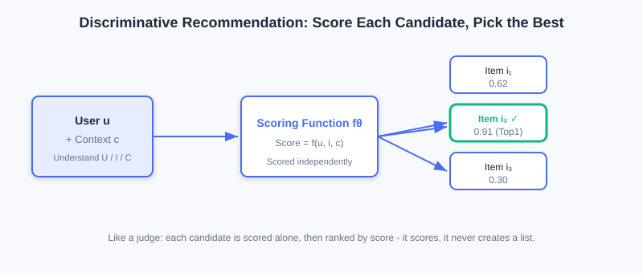
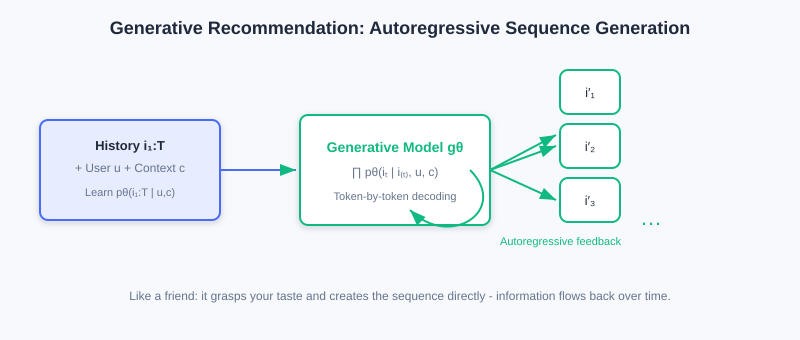
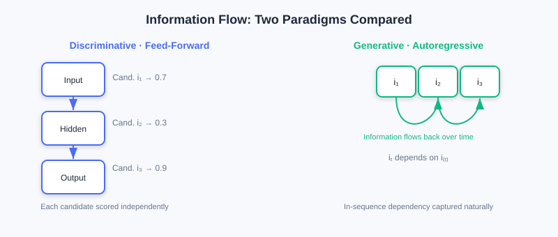

  📖
  ⏱️ ~30 min read
  🎯 Intermediate

# Foundations of the Generative Recommendation Paradigm

> 📝 **Before You Continue:** Please read the "two fundamental paradigms" section of [1.1](./../part1-introduction/recommender-system-basics.md) and the discriminative retrieval/ranking in [2.x](./../part2-retrieval/) first. This chapter pushes the discriminative-vs-generative contrast from intuition into modeling philosophy and architecture, and it is the theoretical starting point for all later generative chapters.

Over the past decade, recommender systems have evolved from traditional machine learning to deep learning, with ever-stronger models and ever-better business metrics. Yet one fact is easy to overlook: **no matter how the models changed, the underlying modeling paradigm never did — we have been doing "discrimination" all along.**

Given a set of candidate items, a discriminative model judges whether the user will like each one — at its core, a classification or ranking problem. This framework is extremely mature in industry, but it has gradually exposed deep limitations: misaligned objectives from multi-stage cascades, the difficulty of capturing sequential dependencies when scoring each item independently, and embedding parameters too sparse to feed modern hardware.

It is against this backdrop that **Generative Recommendation** has emerged as a brand-new paradigm. It no longer treats recommendation as "scoring a candidate set," but redefines it as a **sequence generation task** — the model directly learns "which items the user will interact with next." This seemingly subtle shift brings fundamental changes: from local scoring decisions to global probability modeling, from multi-stage cascades to end-to-end optimization, from a fixed candidate set to an open generation space.

After reading this chapter, you will be able to:

- Write down the core conditional probability formulas of **discriminative** and **generative** models, and explain how the "questions they ask" differ
- List the inherent limitations of the discriminative paradigm in **parameter efficiency, semantic modeling, and multi-stage cascades**
- Explain how generative **autoregressive modeling** naturally captures sequential dependencies and opens the door to end-to-end optimization
- Compare the essential differences between the two paradigms along three dimensions: **objective function, information flow, and model architecture**
- Complete 4 tiered practice problems to consolidate the "discriminative vs. generative" modeling philosophy

---

## 6.1.0 Discriminative Recommendation: How We Have Always Done It

The core of discriminative recommendation is learning a **conditional probability distribution** $p(y=1\mid u, i, c)$ that predicts the probability of a positive interaction (click, purchase, etc.) between user $u$ and item $i$ under context $c$. This modeling approach is intuitive and efficient, and it is by far the dominant approach in industry.

Modern deep learning recommendation models almost all follow the "**Embedding & MLP**" paradigm: user IDs, item IDs, and various features are first mapped to dense vectors through embedding layers, then processed by MLPs or more sophisticated feature interaction modules, and finally a scalar score is produced indicating the strength of the user's interest in the item. It is highly flexible — different feature interaction modules (FM, DeepFM, DCN, etc.) capture high-order feature crossing, while sequence modeling modules (DIN, SIM, etc.) characterize short-term and long-term preferences.

By integrating user features $U$, item features $I$, and context features $C$, discriminative recommendation scores every candidate item one by one, predicting the probability of "a positive interaction occurring."

> 💡 **Key Insight:** The inputs of a discriminative model are exactly the same as a generative one (both must understand the user, items, and context), but the **question it asks** is "should this item be recommended" — a local, per-candidate binary classification problem.

### Three Inherent Limitations of the Discriminative Paradigm

However, this "score each item independently" modeling approach also brings three problems that are hard to cure at the root.

**① Parameter inefficiency.** Embedding layers typically account for more than 90% of model parameters, yet these parameters are sparse and inefficient, hard to fully utilize on modern GPUs/TPUs. Huge numbers of parameters "sleep" in sparse ID lookup tables, and hardware utilization (MFU) stays persistently low.

**② Missing semantic modeling.** A discriminative model treats every item as an independent **atomic unit**. There is no semantic relationship between item IDs whatsoever. The IDs of two "sci-fi thrillers" have no prior connection in vector space; the model can only "memorize by brute force" their similarity from massive behavioral data, making the **cold-start** problem hard to solve.

**③ The multi-stage cascade dilemma.** To handle massive item catalogs and millisecond-level latency, industrial systems have to adopt a multi-stage cascade of "retrieval — coarse ranking — fine ranking — re-ranking." Each stage is handled by a different model with different optimization objectives (retrieval cares about relevance, ranking cares about CTR), so **global objectives are hard to align**; worse, every cascade stage loses information — high-quality items filtered out during retrieval by crude similarity computation **never even get seen** by later stages. This level-by-level filtering guarantees efficiency, but it traps the system in a "local optimum" and makes true end-to-end optimization impossible.

> ⚠️ **Warning:** These three limitations are not "engineering flaws" of discriminative models — they are intrinsic properties of the "per-candidate scoring" modeling paradigm. Curing them requires working on the paradigm itself, which is precisely the motivation for generative recommendation.

---

## 6.1.1 Generative Recommendation: Redefining the Task

Generative recommendation fundamentally redefines the recommendation task. Instead of treating recommendation as a discriminative problem of scoring a candidate set, it models recommendation as a **sequence generation process**. Given user $u$, context $c$, and the historical interaction sequence $i_{1:T}$, generative recommendation learns the generation probability of this sequence:

$$p_\theta(i_{1:T}\mid u, c) = \prod_{t=1}^{T} p_\theta(i_t \mid i_{<t}, u, c)$$

This formula looks plain, but it hides a profound modeling idea: it no longer views each item in isolation, but treats the user's interaction behavior as a **continuously evolving process**. What the model learns is not "should a certain item be recommended," but "given the known history of behavior, which item is the user most likely to interact with next."

Conditioned on the user's historical interaction sequence, generative recommendation directly generates the next item (or the next segment of items) through autoregressive decoding — no need to evaluate candidates one by one.

### 🧠 Mental Model: Judge Scoring vs. Friend Recommending

> Picture the two paradigms as two kinds of people. The **discriminative model** is like a talent-show judge: contestants (candidate items) fill the stage, the judge scores each one individually and hands out passes by score — it never "calls out the list directly," only scores. The **generative model** is like a friend who knows your taste well: without going through every option, they just say "you should watch these next," because they already understand the thread of your preferences. The former **selects the best**; the latter **creates**.

### Why Autoregressive Modeling Is the Watershed

The advantage of autoregressive modeling goes beyond capturing sequential dependencies — it opens the door to **end-to-end optimization**:

- **Eliminating error accumulation**: the model generates recommendation results in a single forward pass, without depending on a multi-stage cascade, thus eliminating cascade-induced error accumulation and objective misalignment.
- **Supporting global objectives**: a generative model can optimize global objectives (such as long-term user satisfaction, platform ecosystem balance) with end-to-end reinforcement learning — nearly impossible under a discriminative framework.
- **Sequential dependencies built in**: the prediction at the current moment depends on the outputs of all previous moments, naturally capturing long-range behavioral dependencies.

In addition, generative recommendation is more flexible in **item representation**: items can be represented by text descriptions or **Semantic IDs**, which carry semantic information by construction. New items can be recommended without accumulating behavioral data, greatly easing cold start.

> 🤔 **Why does this shift matter?** The discriminative approach assumes "the candidate set is already determined by retrieval," and the task is to rank within a bounded space; the generative approach **does not presuppose a candidate set** — the model generates directly from the full item space. The former is a "top-down" engineering mindset; the latter is closer to the nature of human decision-making — when we choose, we usually do not score options one by one, but **generate** a candidate plan from experience.

---

## 6.1.2 The Essential Differences Between the Two Paradigms

The differences between discriminative and generative models go beyond formulas — they show up more deeply along three dimensions: **objective function, information flow, and model architecture**.

### Objective Function: Local Decisions vs. Global Distributions

A discriminative model optimizes a **local decision boundary** — given a candidate set, it learns to separate positive from negative samples, driving positive scores up and negative scores down. This approach is direct, but it is confined to the candidate set and struggles to characterize the global item distribution.

A generative model optimizes a **complete probability distribution** $p_\theta(i\mid u, c)$. It cares not only about "which items should be recommended" but also about "how the whole interaction sequence is generated." This global modeling lets the model better capture preference evolution, and provides a more natural framework for multi-objective optimization.

### Information Flow: Feed-Forward Independence vs. Autoregressive Recurrence

Discriminative models typically use feed-forward networks: information flows from the input layer through stacked transformations to the output layer, and **each item's score is computed independently** — efficient, but it ignores dependencies among items in the recommendation list.

Generative models use an autoregressive structure: the current prediction depends on all previous outputs, and information **recirculates along the time dimension**. This captures long-range dependencies and lays the groundwork for advanced optimization techniques such as reinforcement learning.

Left: a discriminative feed-forward network scoring each candidate independently; right: generative autoregression, where information flows back along time and tokens are generated one by one.

### Model Architecture: Heterogeneous Specialization vs. Unified Transformer

To adapt to different stages, discriminative systems often need multiple specialized modules — two-tower or graph networks for retrieval, complex feature interaction networks for ranking, list-level constraints for re-ranking. These modules are heterogeneous and highly customized, making the system complex and costly to maintain.

Generative recommendation instead favors a **unified Transformer architecture**, handling all tasks through stacked self-attention and feed-forward networks. Its dense matrix computation fits GPUs/TPUs well, achieves hardware utilization (MFU) far beyond discriminative models, and enables parameter scaling (Scaling) by plain stacking.

### One Level Deeper: The Difference in Modeling Philosophy

Pulling the perspective up one more level, the fundamental difference between the two paradigms lies in **modeling philosophy**: discriminative models pursue "making the optimal choice given a candidate set," while generative models attempt to "learn the generation process of user behavior." The former suits well-defined optimization problems; the latter is closer to the nature of human decision-making, and opens new possibilities for deeply fusing recommender systems with language models and multimodal models.

> 📊 **Data Point:** To be objective: fully end-to-end generative recommendation **still faces challenges** in industry today (training cost, inference latency, system stability). Research therefore proceeds along three parallel paths — ① progressive (borrowing LLM-style Scaling capability on top of cascade architectures); ② knowledge-enhanced (injecting LLM world knowledge); ③ fully generative (unifying retrieval/ranking/re-ranking into one generative model). This chapter focuses on foundations; later chapters cover each path in turn.

The interactive demo below places the two paradigms side by side, so you can step through how the same recommendation request is processed along the "discriminative scoring" path versus the "generative sequence generation" path:

<iframe src="../viz/part6-paradigm.html?embed&vizId=part6-paradigm" style="width:100%; height:520px; border:none; display:block;" loading="lazy"></iframe>

---

## ⚠️ Common Mistakes in 6.1

| # | Mistake | Example | Why It's Wrong | Fix |
|---|---------|---------|---------------|-----|
| 1 | Reading generative models as "scoring each candidate" | "Generative is just another way to compute CTR" | Generative models directly produce sequences; there is no per-candidate evaluation | Remember: discriminative **selects**, generative **creates** |
| 2 | Treating discriminative problems as "just bad engineering" | "A bigger model will fix the cascade" | Error accumulation / missing semantics are intrinsic to the paradigm | Understand the limitations at the paradigm level, not by stacking parameters |
| 3 | Confusing the two directions of conditional probability | Writing $p(i\mid u,c)$ as $p(y=1\mid u,i,c)$ and calling it generative | The former is a sequence generation distribution; the latter is per-candidate discrimination | Look carefully at which side the "condition" is on |
| 4 | Assuming generative models have no notion of a candidate set | "Generative models have no candidate space at all" | Generative models internalize the candidate space as the generation distribution; it still exists | Understand "no presupposed candidates" ≠ "no item space" |

---

## Chapter Summary

### 📌 Key Takeaways

| Concept | Key Points | Why It Matters |
|---------|-----------|----------------|
| Discriminative recommendation | $p(y=1\mid u,i,c)$, per-candidate scoring | The industrial mainstream — mature and stable, but with three inherent limitations |
| Three limitations | Parameter inefficiency, missing semantics, cascade dilemma | The fundamental motivation driving the paradigm shift |
| Generative recommendation | $p_\theta(i_{1:T}\mid u,c)=\prod_t p_\theta(i_t\mid i_{<t},u,c)$ | Autoregressive, end-to-end, with semantic representation built in |
| Essential differences | Objective function / information flow / architecture | Determines whether global optimization and Scaling are possible |
| Three paths | Progressive / knowledge-enhanced / fully generative | The realistic landscape of current industrial adoption |

### ❓ FAQ

**Q1: Is generative always better than discriminative?**
> A: No. Discriminative models are stable and efficient in mature scenarios; generative models have greater potential for end-to-end optimization, cold start, and semantic understanding. Both coexist in industry today — choose according to your business stage.

**Q2: What exactly does autoregressive modeling solve?**
> A: It lets the model generate results in a single forward pass, eliminating the error accumulation and objective misalignment of multi-stage cascades; it naturally captures sequential dependencies and paves the way for end-to-end reinforcement learning.

**Q3: Why is missing semantics a "paradigm problem" rather than a "data problem"?**
> A: The discriminative approach treats items as atomic IDs with no prior relationships, so similarity can only be "memorized" from behavioral statistics; generative models use semantic IDs so that similarity relationships are **encoded in the representation structure itself**, easing cold start at the root.

### 🔗 Connections to Later Chapters

- **6.2** (Foundations of Generative Architectures) picks up this section's "unified Transformer" claim and expands on self-attention, positional encoding, and the two architectural paradigms.
- **6.3** (LLM Foundations) systematically explains the three-stage training methodology of generative models (pretraining / instruction tuning / preference alignment).
- **6.4** (Codebook Quantization) answers the key question planted here — how generative models represent items with semantic IDs.
- **1.1** (the two paradigms) contrasts them at the intuition level; this chapter deepens the contrast to the level of modeling philosophy and architecture.

---

## Practice Problems

Work through all problems in order — they get progressively harder. Each has a complete solution you can reveal after trying it yourself.

---

**Problem 6.1.1 — Distinguishing Paradigms** 🟢 Easy

Given the two system descriptions below, decide whether each is closer to **discriminative** or **generative**, and explain why.

- (a) The system computes a "user click probability" for every candidate ad, ranks by probability, and shows the top 5.
- (b) The system reads the user's last 20 plays and directly outputs "the 3 video IDs you might want to watch next."

💡 Solution (click to reveal)

**Approach:** Grasp the difference in the "questions asked" — per-candidate scoring, or directly producing a sequence.

- **(a) Discriminative**: it computes a click probability for each candidate separately and then ranks — exactly the "score one by one and pick the best" of $p(y=1\mid u,i,c)$.
- **(b) Generative**: it directly decodes a sequence of recommendation IDs from the history, without per-candidate evaluation — corresponding to $p_\theta(i_{1:T}\mid u,c)$.

**Key points:**
- Discriminative = candidates known, scored one by one; generative = directly "creates" a sequence.
- The key question: does the system enumerate and evaluate every single candidate?

---

**Problem 6.1.2 — Listing the Three Limitations** 🟢 Easy

Write down the three inherent limitations of the discriminative paradigm that are repeatedly criticized on the road toward generative models, with one sentence each on the consequence.

💡 Solution (click to reveal)

**Answer:**

1. **Parameter efficiency**: embedding layers hold 90%+ of parameters yet are sparse and inefficient, keeping hardware utilization (MFU) low.
2. **Missing semantic modeling**: items are atomic IDs with no semantic relationships, so cold start is hard to solve.
3. **Multi-stage cascade dilemma**: stage objectives are misaligned, and information is lost at every stage (quality items wrongly filtered at retrieval are never seen again).

**Key points:**
- All three stem from the "per-candidate scoring + cascade" paradigm itself; engineering alone cannot erase them.

---

**Problem 6.1.3 — Restating the Formula** 🟡 Medium

The discriminative per-candidate score can be written as $p(y=1\mid u,i,c)$. Restate the core generative formula $p_\theta(i_{1:T}\mid u,c)=\prod_{t=1}^{T} p_\theta(i_t\mid i_{<t},u,c)$ in natural language, and point out the essential difference from the discriminative case on the "conditioning" side.

💡 Solution (click to reveal)

**Approach:** Translate the formula piece by piece.

**Answer:** The formula reads: "the probability that user $u$ produces the entire interaction sequence $i_{1:T}$ in context $c$ equals the product over each time step $t$ of the probability of generating the $t$-th item, conditioned on all previous interactions $i_{<t}$, the user $u$, and the context $c$."

Essential difference: the discriminative "condition" is $(u,i,c)$ — item $i$ is given; the generative "condition" is $(i_{<t},u,c)$ — the item is **the variable to be generated**, and previous items in the sequence flow back in as conditions. The former scores candidates; the latter creates candidates from conditions.

**Key points:**
- The product structure = autoregression; every token depends on history.
- Whether item $i$ appears on the conditioning side is the watershed between discrimination and generation.

---

**🏆 Challenge: Arguing a Paradigm Choice**

A team must rebuild recommendations for an e-commerce scenario with "100K new items per day and a high long-tail share." In about 150 words, argue why the generative approach (semantic ID route) has more long-term value here than a purely discriminative one. Focus on "cold start, parameter efficiency, cascade information loss," and point out which discriminative components should still be kept in deployment.

💡 Hint

Long-tail / high-volume new items → atomic discriminative IDs struggle to accumulate behavior, so cold start is severe; semantic IDs let new items gain representations from content alone, and prefix generalization eases the long tail. On parameter efficiency, a unified Transformer scales more easily than heterogeneous multi-stage modules. Still, keep discriminative **retrieval/re-ranking** as a candidate constraint and experience safety net for the generative output, adopting a "progressive + knowledge-enhanced" hybrid path for a smooth transition.

