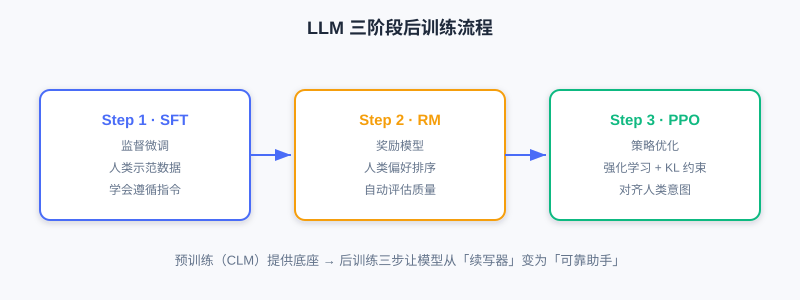
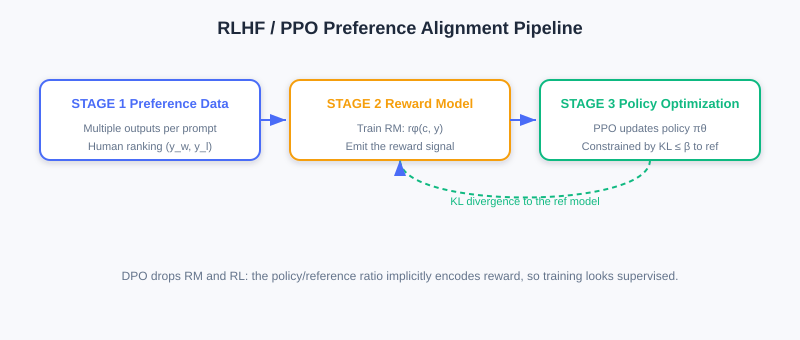

<div class="badge-row">
  <span style="background: #f0f4ff; color: #4A6CF7; padding: 4px 12px; border-radius: 20px; font-size: 0.85em; font-weight: 600; border: 1px solid rgba(74,108,247,0.2);">📖</span>
  <span style="background: #fef9ec; color: #d97706; padding: 4px 12px; border-radius: 20px; font-size: 0.85em; border: 1px solid rgba(100,100,100,0.15);">⏱️ ~40 min read</span>
  <span style="background: #fef9ec; color: #d97706; padding: 4px 12px; border-radius: 20px; font-size: 0.85em; border: 1px solid rgba(100,100,100,0.15);">🎯 Intermediate</span>
</div>

# Large Language Model (LLM) Foundations

> 📝 **Before You Continue:** You should first read the Decoder-Only architecture and self-attention in [6.2](./gr-architecture.md). This section focuses on "how LLMs are trained," laying the groundwork for later migrating this pipeline to recommendation.

The evolution from Transformer to LLM is not just growth in parameter scale — more importantly, it is the **systematization of the training paradigm**. Modern LLMs (GPT-3/4, LLaMA, etc.) developed a complete "**pretraining—instruction tuning—preference alignment**" three-stage training pipeline, so models can generate fluent text while also understanding instructions and following human intent.

But applying LLMs to recommendation is **not a matter of "plugging in" off-the-shelf language models** — you must understand the modeling principles and adapt/optimize for recommendation scenarios. This section systematically introduces the basic LLM modeling pipeline, focusing on the technical links most relevant to generative recommendation.

After reading this chapter, you will be able to:

- Explain the goals and losses of each LLM stage (pretraining / instruction tuning / preference alignment)
- Distinguish the pipeline differences between **RLHF** (with reward model and PPO) and **DPO**
- Explain what **Scaling Laws** and emergent abilities imply for generative recommendation
- **Map** the three-stage paradigm to recommendation scenarios and identify challenges specific to it, such as item tokenization
- Complete 4 tiered practice problems to consolidate the LLM→recommendation knowledge chain

---

## 6.3.0 Overview of the Three-Stage LLM Paradigm

Current mainstream LLMs follow the "pretraining—instruction tuning—preference alignment" three-stage paradigm, first systematized in InstructGPT and widely adopted by GPT-4, Claude, and LLaMA. The three stages have progressive goals and together form a complete capability-building system.



- **Step 1 (SFT)**: collect human demonstration data for supervised fine-tuning, so the model initially learns to follow instructions.
- **Step 2 (RM)**: collect comparison data to train a reward model that automatically evaluates output quality.
- **Step 3 (PPO)**: with the reward model as feedback, use reinforcement learning to continually optimize the generation policy, with a KL divergence constraint to prevent drifting too far from the reference model.

### 🧠 Mental Model: From "Autocomplete Writer" to "Assistant"

> A pretrained LLM is just a "text continuation engine" — give it an opening and it naturally keeps writing, without knowing "what you want it to do." Instruction tuning is like **onboarding training** (teaching it to understand task instructions); preference alignment is like **values calibration** (teaching it what a better answer is). Only after all three steps does it turn from a "completion tool" into a "reliable assistant."

---

## 6.3.1 Pretraining and Instruction Tuning

### Pretraining: the Foundation of Language Ability

**Pre-training** is the first stage and the most compute-intensive. The goal is to learn general language representation and generation ability on **large-scale unlabeled text**, relying entirely on **self-supervised learning** (the data itself provides the signal; no manual annotation needed).

**Training objective: causal language modeling (CLM)**, also known as **Next Token Prediction**:

$$\mathcal{L}_{\text{CLM}}=-\sum_{i=1}^{n}\log p_\theta(x_i\mid x_{<i})$$

where $x_{<i}=(x_1,\dots,x_{i-1})$. By maximizing this likelihood, the model masters the statistical regularities of language, grammar, semantics, and even commonsense reasoning.

When model scale and data scale reach a certain level, **Scaling Laws** emerge: performance keeps improving with parameter count, data volume, and compute, and **Emergent Abilities** such as zero-shot/few-shot learning may even appear.

> **Analysis:** Most modern LLMs use **Decoder-Only** architectures (GPT/LLaMA) — clean, efficient, and well-suited to large-scale training. Parameters range from billions to trillions (GPT-3 175B, PaLM 540B, LLaMA-2 7B–70B, GPT-4 estimated over 1T). Pretraining needs thousands to tens of thousands of GPUs/TPUs for weeks to months at extreme cost — so most teams fine-tune directly on open pretrained models (LLaMA, Mistral).

### Instruction Tuning: Following Instructions

A pretrained model only "completes text" — it does not "understand and execute instructions." **Instruction Tuning**, also called **Supervised Fine-Tuning (SFT)**, addresses "making the model understand task instructions and generate accordingly."

The core is constructing "instruction—input—output" triples, for example:

```
Instruction: Summarize the main content of the following passage.
Input: [a passage about the history of artificial intelligence]
Output: [Artificial intelligence started in the 1950s ... and has gone through several stages of development ...]
```

**Training objective: conditional language modeling loss**, computed only on the output portion:

$$\mathcal{L}_{\text{SFT}}=-\sum_{i=1}^{m}\log p_\theta(y_i\mid y_{<i},\boldsymbol{c})$$

where $\boldsymbol{c}$ is the conditioning information (instruction + input) and $y$ is the target output. **Key point: the loss is computed only on output tokens** — instruction and input do not participate in gradient updates. Either full fine-tuning or parameter-efficient methods (e.g., LoRA) can be used. SFT models significantly outperform pure pretrained models on zero-shot/few-shot tasks — they have learned the meta-ability of "understanding instructions."

---

## 6.3.2 Preference Alignment and From LLM to Recommendation

### Preference Alignment: RLHF and DPO

Even after instruction tuning, LLM outputs can still be insufficiently helpful, hallucinated, or unsafe. The root cause is that SFT only learns "how humans would answer," without optimizing "which answer is better." **Preference Alignment** makes outputs better match human values and preferences.

**RLHF (Reinforcement Learning from Human Feedback)** proceeds in three steps:

1. **Collect preference data**: for the same prompt, the model generates multiple outputs; human annotators rank them, yielding preference pairs $\mathcal{D}=\{(\boldsymbol{c},y_w,y_l)\}$ ($y_w$ chosen, $y_l$ rejected).
2. **Train the reward model (RM)**:

$$\mathcal{L}_{\text{RM}}=-\mathbb{E}_{(\boldsymbol{c},y_w,y_l)\sim\mathcal{D}}\left[\log\sigma\big(r_\phi(\boldsymbol{c},y_w)-r_\phi(\boldsymbol{c},y_l)\big)\right]$$

3. **Policy optimization (PPO)**: maximize the reward while constraining deviation from the reference model with KL divergence:

$$\mathcal{L}_{\text{RL}}=\mathbb{E}_{\boldsymbol{c},y\sim p_\theta}\big[r_\phi(\boldsymbol{c},y)\big]-\beta\,\mathbb{E}_{\boldsymbol{c}}\big[D_{\text{KL}}(p_\theta(\cdot\mid\boldsymbol{c})\|p_{\text{ref}}(\cdot\mid\boldsymbol{c}))\big]$$



**DPO (Direct Preference Optimization)** is more concise: its core idea is that "the reward model can be represented implicitly by the policy model itself" — no explicit RM training and no reinforcement learning:

$$\mathcal{L}_{\text{DPO}}=-\mathbb{E}_{(\boldsymbol{c},y_w,y_l)\sim\mathcal{D}}\left[\log\sigma\left(\beta\log\frac{p_\theta(y_w\mid\boldsymbol{c})}{p_{\text{ref}}(y_w\mid\boldsymbol{c})}-\beta\log\frac{p_\theta(y_l\mid\boldsymbol{c})}{p_{\text{ref}}(y_l\mid\boldsymbol{c})}\right)\right]$$

DPO training resembles supervised learning — simple and stable, often matching or exceeding RLHF, and widely adopted recently.

### Mapping the Three-Stage Paradigm to Recommendation

The LLM's three stages provide a complete capability framework for recommendation, but each stage needs repositioning:


| LLM Stage | Recommendation Adaptation Direction | Core Challenge |
|----------|--------------|----------|
| Pretraining | User behavior sequence pretraining, multimodal content pretraining | How to represent items? How to balance language ability and recommendation ability? |
| Instruction tuning | Instructionalizing recommendation tasks, multi-task joint training | How to design recommendation instructions? How to handle ID-based items? |
| Preference alignment | Implicit feedback alignment, business metric optimization | How to construct preference data? How to balance multiple objectives? |

- **Pretraining**: the core is "letting the model master both language understanding and recommendation modeling." Overemphasizing language neglects collaborative signals; over-focusing on behavior weakens semantics — a balance is needed: for content items (news/video), language ability matters more; for collaboration-rich domains (e-commerce/music), behavior modeling matters more.
- **Instruction tuning**: the difficulty is that **items exist as IDs**, which are completely alien symbols to a language model. These IDs must be "translated" into semantic representations the model understands — this is exactly the core of **item tokenization**, the key bridge connecting traditional recommendation data and generative models (see Section 6.4).
- **Preference alignment**: recommendation feedback is mostly **implicit** (clicks, watch time, skips), and objectives are often **multi-dimensional** (CTR, retention, ecosystem health). Constructing effective preference signals from implicit feedback and balancing multiple metrics is subtler than in LLMs.

### Challenges Specific to Recommendation Scenarios

Beyond adapting the three stages, generative recommendation must face four families of challenges rarely seen in the LLM domain:

1. **Item tokenization**: natural language tokens carry semantics by construction; recommendation item IDs are abstract numbers, meaningless to the model. How to inject semantics and characterize similarity between IDs? — the core topic of Section 6.4.
2. **Collaborative signal fusion**: "users who bought A also buy B" cannot be obtained from textual descriptions; careful design is needed to inject collaborative signals into generative architectures.
3. **Cold start**: new items/new users lack interactions; generative models can leverage LLM semantic understanding to build capability quickly from content features, but the model must be trained to adaptively switch — "collaboration when interactions exist, content when they don't."
4. **Real-time constraints**: online services often must respond within tens of milliseconds; autoregressive token-by-token generation can take hundreds of milliseconds. Inference optimizations (quantization, KV Cache, speculative decoding) and system-level innovations (hybrid architectures, offline-online combination, caching) are needed.

> 💡 **Key Insight:** Generative recommendation is not "wrapping a language model around recommendation" — it is **reconceptualizing recommendation as a sequence generation problem** and deeply adapting to recommendation's unique characteristics. It borrows the successful LLM paradigm while creatively solving recommendation-specific challenges — this chain of knowledge is the foundation for later chapters (Scaling architectures, end-to-end generation, thinking recommenders, diffusion models).

---

## ⚠️ Common Mistakes in 6.3

| # | Mistake | Example | Why It's Wrong | Fix |
|---|---------|---------|---------------|-----|
| 1 | Computing the SFT loss on all tokens | Instructions also get gradients | SFT computes the loss only on outputs; input/instruction are conditions | Loss applies only to $y$ |
| 2 | Assuming RLHF needs no reference model | Just maximize the reward directly | The model learns to "game" the reward model; quality degrades | Add a KL constraint toward $p_{\text{ref}}$ |
| 3 | Confusing RLHF and DPO complexity | "Both need a reward model" | DPO represents the reward implicitly; no explicit RM/RL needed | DPO training resembles supervised learning |
| 4 | Applying the LLM vocabulary to items directly | "Encode products with an off-the-shelf tokenizer" | Item IDs are alien symbols to an LLM | Item tokenization is required (see Section 6.4) |
| 5 | Ignoring multi-objective preference alignment in recommendation | "CTR as the reward is enough" | Implicit feedback + multiple objectives need careful construction | Handle multi-objectives and implicit signals explicitly |

---

## Chapter Summary

### 📌 Key Takeaways

| Concept | Key Points | Why It Matters |
|---------|-----------|----------------|
| Pretraining CLM | $\mathcal{L}_{\text{CLM}}=-\sum\log p(x_i\mid x_{<i})$ | The foundation of general generation ability; Scaling Law emergence |
| Instruction tuning SFT | Conditional language modeling; loss only on outputs | From "completion" to "following instructions" |
| RLHF | RM + PPO + KL constraint | Value alignment, but a complex pipeline |
| DPO | Implicit reward; resembles supervised training | Simple and stable; the recent mainstream |
| Recommendation mapping | Three stages → behavior pretraining / task instructionalization / implicit alignment | Each stage needs repositioning |
| Four challenges | Tokenization / collaboration / cold start / real-time | Determines whether research can reach production |

### ❓ FAQ

**Q1: Why is DPO simpler than RLHF yet often more effective?**
> A: DPO merges "training a reward model + reinforcement learning" into one step — the reward is represented implicitly by the ratio of policy to reference model, training looks like ordinary supervised learning, and it avoids RL's instability and the extra RM.

**Q2: Why is preference alignment harder in recommendation?**
> A: LLMs have explicit human preference rankings; recommendation feedback is mostly implicit behavior (clicks/skips), objectives are multi-dimensional and often conflict, so constructing the "what is better" signal is subtler.

**Q3: What do Scaling Laws mean for recommendation?**
> A: Like LLMs, generative recommendation models keep improving with parameters/data/compute — which supports the "stacking is scaling" claim of [6.2] and the later Scaling chapters.

### 🔗 Connections to Later Chapters

- The Decoder-Only architecture of **6.2** (architectural foundations) is exactly the main architecture for LLM pretraining.
- **6.4** (Codebook Quantization) solves the "item tokenization" bridge problem raised repeatedly in this section.
- **8.x** (End-to-end Generation) implements the three-stage paradigm in recommendation training pipelines.
- **9.x** (Thinking Recommenders) deepens the combination of preference alignment and reasoning-style generation.

---

## Practice Problems

Work through all problems in order — they get progressively harder. Each has a complete solution you can reveal after trying it yourself.

---

**Problem 6.3.1 — Scope of the SFT Loss** 🟢 Easy

An instruction tuning sample: instruction "Translate into English", input "Bonjour le monde", output "Hello world". If the output is tokenized into 2 tokens, which tokens should the training loss cover? Do the instruction and input tokens participate in gradient updates?

<details>
<summary>💡 Solution (click to reveal)</summary>

**Answer:** The loss covers only the output tokens `Hello` and `world` (2 tokens), computing $-\log p(y_i\mid y_{<i},\boldsymbol{c})$ at each position. The instruction "Translate into English" and the input "Bonjour le monde" serve as conditions $\boldsymbol{c}$ and **do not participate in gradient updates** — the model learns only "given instruction + input, how to generate the correct output."

**Key points:**
- Conditional language modeling: conditions are fixed; the loss applies only to outputs.
- This is the key difference between SFT and pretraining CLM.

</details>

---

**Problem 6.3.2 — Reward Model Loss** 🟢 Easy

For a preference pair $(\boldsymbol{c},y_w,y_l)$, the reward model gives $r(y_w)=2.0,\; r(y_l)=0.5$. Compute the RM loss term $\log\sigma(r(y_w)-r(y_l))$ and explain what it encourages.

<details>
<summary>💡 Solution (click to reveal)</summary>

**Approach:** Substitute values.

$r(y_w)-r(y_l)=2.0-0.5=1.5$; $\sigma(1.5)=1/(1+e^{-1.5})\approx 0.818$; loss term $-\log(0.818)\approx 0.20$.

**Answer:** This small loss (near 0) indicates the reward model already scores $y_w$ higher. The RM loss overall encourages "giving higher reward scores to better outputs," enabling the RM to automatically evaluate the quality of any output.

**Key points:**
- $\sigma$ compresses score differences into a probability.
- The RM learns "relative better/worse," not absolute scores.

</details>

---

**Problem 6.3.3 — RLHF vs. DPO** 🟡 Medium

Briefly describe the differences between RLHF and DPO on three aspects: "whether an explicit reward model is needed," "whether reinforcement learning is used," and "training stability."

<details>
<summary>💡 Solution (click to reveal)</summary>

**Answer:**

| Dimension | RLHF | DPO |
|------|------|-----|
| Explicit reward model | Needed (train an RM separately) | Not needed (reward represented implicitly by the policy/reference ratio) |
| RL used | Uses PPO reinforcement learning | No — training resembles supervised learning |
| Training stability | Lower (RL is unstable, easy to game the RM) | Higher (no RL, no separate RM) |

**Key points:**
- DPO replaces RM + RL with the reference model $p_{\text{ref}}$.
- DPO has recently been favored for being simple, stable, and comparably effective.

</details>

---

**🏆 Challenge: Designing Preference Alignment for Recommendation**

A music app wants to optimize recommendations with preference alignment but has only implicit signals (play completion rate, favorites, skips). In about 150 words, explain: how would you construct preference pairs $(y_w,y_l)$ from implicit behavior? Which business objectives must be balanced (list at least 2)? And state the essential difference from LLMs' explicit rankings.

<details>
<summary>💡 Hint</summary>

Construction: generate multiple candidate sequences for the same user and context, and define quality via implicit signals — e.g., $y_w$ with high completion rate and a favorite; $y_l$ with many skips / low completion. Objectives to balance: user retention, content ecosystem health (diversity/long tail). Essential difference: LLMs have explicit human rankings, while recommendation infers preferences from behavioral proxies — noisier, with often-conflicting multi-objectives requiring weighting, not a plain "good/bad binary classification."

</details>
