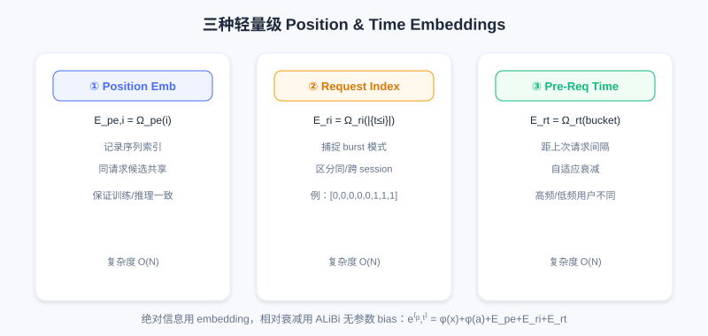
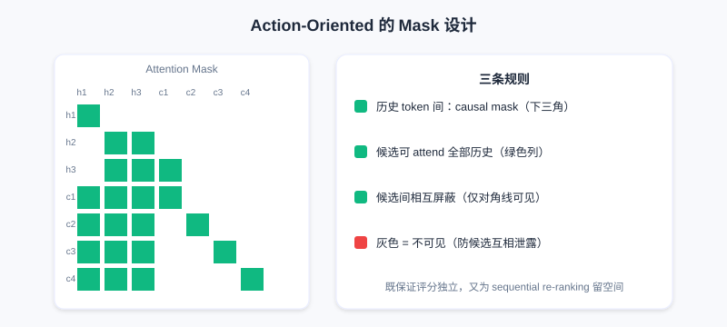

  📖
  ⏱️ ~50 min read
  🎯 Advanced

# The Overall Generative Ranking Paradigm

> 📝 **Before You Continue:** Make sure you have finished [7.1 HSTU](./hstu.md). This chapter traces HSTU back to its roots — it repeatedly returns to HSTU's design decisions and asks which are essential and which can be optimized. Understanding 7.1's architecture and engineering is what makes GenRank's trade-off logic click.

HSTU proved with a trillion-parameter model that recommendation can follow the Scaling Law — but on top of Meta's gigantic compute: a trillion parameters, thousands of GPUs, and billions of users' data every day. For the vast majority of companies, that bar is far too high.

This raises a key question: **in HSTU's design, which parts are essential, and which can be optimized?** The Xiaohongshu team faced this challenge in practice — they wanted to bring generative recommendation to a system serving hundreds of millions of users, and first had to answer: where exactly does the effectiveness of generative recommendation come from?

---

## 7.2.0 Tracing It Back: What Is the Essence?

To optimize HSTU, first understand where its effectiveness comes from. HSTU is a complex system: generative architecture, autoregressive training, sequential organization, and a unified feature space all act together. But engineering demands clarity on each factor's true contribution — if some design contributes only 0.1% performance while costing 10x overhead, it should be dropped when resources are constrained.

The Xiaohongshu team ran controlled experiments on hundreds of billions of real exposure logs, using HSTU as the baseline and changing one design decision at a time. The first thing to verify: **is the autoregressive mechanism necessary?**

Recall HSTU: it trains with a causal mask but computes loss only at candidate item positions — history positions contribute nothing, similar to LLM SFT (user history + candidate form the prompt, and the model predicts the behavioral feedback). In LLMs, SFT stays autoregressive to preserve pretrained capability; but recommendation usually has no pretraining stage — could autoregression be just an optional trick?

Two controlled experiments:

**First group**: also compute loss at history positions. If autoregression were just an optional trick, more supervision signals should improve performance — but AUC **drops significantly**. This can be explained by the "one-epoch problem": sparse features like user/item IDs account for the vast majority of parameters, and under long-tail distributions huge numbers of IDs appear only once or twice. Computing loss at history positions pushes the model to "memorize" every interaction detail while failing to generalize (e.g., the user's history says "watched tech A → liked"; at test time the user watches tech C, a combination the model has never seen). And recommendation usually trains for only one epoch, leaving no chance to correct this overfitting.

**Second group**: use a fully-visible mask at history positions (bidirectional attention). From a feature-interaction standpoint this should strengthen expressiveness, yet performance still drops — and the drop widens as the model grows. The fully-visible mask destroys a key inductive bias — **the causality of user interest evolution**. The causal mask forces learning of causal structure rather than arbitrary statistical correlation. For example, if bidirectional attention is allowed, when processing "watched tech A" the model can also see the later "liked" and "watched food B", and may learn a spurious association ("liked the tech video because food came after") — but in reality, behavior at time $t$ cannot be influenced by the future.

Both experiments point to the same conclusion: **the autoregressive mechanism is the essential characteristic of generative recommendation**. Through an architectural constraint it introduces a beneficial inductive bias, helping the model learn the causal structure of behavior while curbing overfitting to sparse features.

### 🧠 Mental Model: Autoregression as "Causal Glasses"

> Think of the causal mask as putting a pair of **causal glasses** on the model: it can only look forward, forcing it to learn "how the past led to the present". Take the glasses off (bidirectional attention) and the model peeks at answers and learns spurious associations. These glasses are not a performance burden but **regularization against cheating** — this is where autoregression's essential status comes from.

Sample organization, by contrast, matters much less. The traditional DLRM trains point-wise (one interaction per sample); HSTU organizes user-level into sequences. But experiments show: keeping the sequential organization while computing loss only at the last position (mimicking point-wise) barely hurts performance. This means **user-level organization mainly brings engineering convenience (high throughput, easy KV caching), not a fundamental source of performance**.

The team also tested compatibility with commonly used industrial modules: SIM, PPNet, and PLE remain effective under a generative architecture; most historical aggregate features lose most of their value (sequence modeling learns the statistical patterns automatically), but **real-time features remain important** (capturing new information outside the training window). Simplified feature engineering also freed system resources, making room for handling larger candidate sets.

---

## 7.2.1 Action-Oriented: Re-understanding the Task's Essence

HSTU's core is the **interleaving** formula: $[\Phi_0, a_0, \Phi_1, a_1, \ldots]$, modeled as a Markov chain. But analyzing the computational cost reveals a problem: with $n_c$ user interactions + $m$ candidates, the sequence is length $2n_c + m$ and attention complexity is $O(4n_c^2 d)$. When $n_c$ reaches thousands, $4n_c^2$ is a heavy burden.

The core question: **given the user's history and candidates, what do we actually need to predict?** The answer is what **behavioral feedback** $a$ the user will produce on an item (click rate, watch time, like probability). In ranking, the item is given context and the behavior is the prediction target — the item is more like context or a positional identifier.

Take Xiaohongshu ranking 100 candidates as an example: for each note, predict "will they click / how long will they watch / will they like". The note itself (title, images, author) is a known input; behavioral feedback is the output. Given that, is it necessary to treat "note" and "behavior" as equals (each occupying a token position)?

Based on this, GenRank evolves: **make behaviors the sequence's main body and items the attributes of behaviors**:

$$[a_0^{(x_0)}, a_1^{(x_1)}, \ldots]$$

where $a_i^{(x_i)}$ denotes "the behavior $a_i$ the user produced on item $x_i$" — this is **Action-Oriented Organization**.

Top: HSTU's interleaved sequence spends 2 tokens per interaction; bottom: GenRank fuses the item into the same token as an attribute of the behavior, cutting sequence length from $2n_c$ to $n_c$.

Technically, each token is represented as:

$$e_i = \varphi(x_i) + \phi(a_i)$$

Item embedding and behavior embedding fuse directly in the same space; candidate items use a special mask for the action embedding: $e_j = \varphi(x_j) + M$.

The immediate benefit: **sequence length halves** (from $2n_c$ to $n_c$), which cuts attention compute by 75%, linear projections by 50%, activation memory by about 50%, and the KV cache in half. Experiments show this change alone brings a **78.7% training speedup**.

Does this lose information? From an information-theoretic view, user behavior is strongly influenced by item content — the two have high mutual information. Addition lets the embeddings "align" in representation space: important dimensions reinforce their signals, unique dimensions preserve their information. For example, if some dimension encodes "entertainment value", a funny video's item embedding might be 0.8 and the "like" behavior embedding 0.6, summing to 1.4 with the signal amplified; a dimension encoding "video duration" relates only to the item, the behavior embedding is near 0, and the item information is preserved; "completion rate" relates only to the behavior, and the behavior information is preserved. Since item/action tokens interact most frequently within HSTU's attention anyway, fusing them at the token level actually lightens the attention layer's load.

Action-oriented also enables a more flexible mask: scoring a batch of candidates has two conflicting requirements — candidate scores must be independent (in real exposure, the user sees one item at a time), yet all candidates must see the full history. GenRank balances this with a specific mask: causal mask among history tokens; candidates can attend to all history but are masked from each other. This guarantees independence while leaving room for a future extension to sequential re-ranking.

---

## 7.2.2 Position and Time: What to Learn and What to Encode

Action-oriented solves sequence length, but another bottleneck remains: encoding position and time information.

HSTU uses a relative attention bias (RAB):

$$\text{score}_{i,j} = \frac{q_i \cdot k_j}{\sqrt{d}} + \text{rab}_{p,t}(i,j)$$

Considering position difference, time difference, and even token type lets the model learn patterns such as temporal decay. The problem is that **compute/memory overhead is $O(N^2)$**: for a sequence of length $N$, $\text{rab}_{p,t}$ is an $N\times N$ matrix that must be read in the forward pass and differentiated in the backward pass. When $N$ reaches thousands, $N^2$ runs to millions; in modern training, memory bandwidth is the bottleneck, and $O(N^2)$ memory access burns time on data movement, degrading GPU utilization.

GenRank's alternative: **encode absolute information with lightweight embeddings and relative information with parameter-free biases**.

The core idea: position/time decomposes into two parts — absolute information ("which interaction", "when it happened") uses $O(N)$ embeddings; relative information ("how far apart two interactions are") uses a simple parameter-free rule. GenRank uses three lightweight embeddings:

- **Position Embeddings**: $E_{pe,i} = \Omega_{pe}(i)$, recording the sequence index; candidates within a request share the position index, keeping training/inference consistent.
- **Request Index Embeddings**: $E_{ri,i} = \Omega_{ri}(|\{t_1,\ldots,t_i\}|)$, capturing behavioral burst patterns (users often open the app once, interact several times in a row, then leave; this helps the model distinguish within-session from cross-session interests).
- **Pre-Request Time Embeddings**: $E_{rt,i} = \Omega_{rt}(\text{bucket}(t_i - \max_{t_j<t_i} t_j))$, encoding the gap since the last request, achieving adaptive decay (for high-frequency users a short gap is meaningful; for low-frequency users a few hours is nothing).

The three embeddings are added to the token representation: $e_i^{(p,t)} = \varphi(x_i) + \phi(a_i) + E_{pe,i} + E_{ri,i} + E_{rt,i}$. Total parameters are only a few million, with $O(N)$ I/O complexity.

For relative information, GenRank borrows from **ALiBi (Attention with Linear Biases)**: apply a penalty proportional to distance to distant query-key pairs:

$$\text{score}_{i,j} = \frac{q_i \cdot k_j}{\sqrt{d}} - m \cdot (i - j)$$

ALiBi's three advantages: it matches intuition (farther means less influence), it has no parameters ($m$ is predefined), and it can be fused into the FlashAttention kernel. GenRank extends it to consider both position and time:

$$\text{bias}_{i,j} = -m_p \cdot (p_i - p_j) - m_t \cdot \text{bucket}(t_i - t_j)$$

### 🧠 Mental Model: Parameters vs Rules

> Think of the encoding strategy as a division of labor: **complex, non-linear patterns** (like "which interaction" or "which app open") go to learnable embeddings; **universal, approximately linear rules** (like "farther means less important") are written directly as rules. It is like a company — oddball cases go to specialists, standard workflows become SOPs that run automatically, and not everything needs a meeting.

History tokens use a causal mask (lower-left triangle visible); candidates can attend to all history; candidates are masked along the diagonal (mutually independent).

Experiments show: action-oriented alone gives a 78.7% speedup, and the new position & time biases add another 25.0% — **94.8% total speedup, with AUC slightly up**. A simpler design achieves better results, validating the principle: **good inductive biases matter more than raw parameter capacity**.

> 💡 **Key Insight:** Going from HSTU to GenRank marks recommendation's shift from "engineering-driven" to "principle-driven". The autoregressive mechanism is the core; training paradigm details can be optimized flexibly. But GenRank keeps the purity of the generative formulation — which means giving up the cross features of traditional DLRMs that need to observe historical statistics and candidate attributes simultaneously. This leads to 7.3's soul-searching question: must the efficiency advantage of user-granularity modeling be bound to the fully generative formulation?

---

## ⚠️ Common Mistakes in 7.2

| # | Mistake | Example | Why It's Wrong | Fix |
|---|---------|---------|---------------|-----|
| 1 | Treating autoregression as just a training trick | "Removing the causal mask and adding bidirectional attention should be stronger" | It destroys the causal inductive bias, learns spurious associations, and AUC drops | Remember autoregression is the essential feature of generative models |
| 2 | Treating user-level organization as the source of performance | "Aggregating sequences by user is what makes HSTU strong" | Experiments: loss only at the last position (mimicking point-wise) barely hurts performance | It mainly brings engineering convenience (throughput/KV cache) |
| 3 | Assuming Action-Oriented loses information | "Fusing item and behavior into one token must lose something" | Their mutual information is high; addition reinforces aligned dimensions and preserves unique ones | Understand that token-level fusion actually reduces load |
| 4 | Dismissing RAB's $O(N^2)$ | "Just learn the relative position bias directly" | At thousands of length, $N^2$ becomes a memory-bandwidth bottleneck and GPU utilization drops | Use lightweight embeddings + parameter-free ALiBi bias |
| 5 | Mixing absolute/relative encodings | "Encode all time information with learnable matrices" | Universal rules need not be learned; overparameterization invites overfitting | Complex patterns via embedding, linear rules via rules |

---

## Chapter Summary

### 📌 Key Takeaways

| Concept | Key Points | Why It Matters |
|---------|-----------|----------------|
| Autoregression is the essence | Two controlled experiments prove the causal inductive bias cannot be dropped | The dividing line between "means" and "ends" |
| User-level organization | Mainly engineering convenience, not a performance source | Can be adjusted flexibly without hurting the essence |
| Action-Oriented | Behaviors as main body, items as attributes; sequence halved | 78.7% training speedup with almost no performance loss |
| Lightweight position/time encoding | 3 embeddings + parameter-free ALiBi bias | Another 25% speedup, 94.8% total |
| Inductive bias > parameter capacity | A simpler design performs better | Guides optimization under constrained resources |

### ❓ FAQ

**Q1: Why can't autoregression be removed in favor of bidirectional attention?**
> A: Bidirectional attention lets the model peek at "future" behaviors, learns spurious statistical associations, and destroys the causal structure of user interest evolution; the performance drop widens as the model grows. The autoregressive causal mask is beneficial regularization against overfitting sparse features.

**Q2: With Action-Oriented fusing items into behavior tokens, can ranking still distinguish different candidates?**
> A: Yes. Each candidate has an independent token $e_j=\varphi(x_j)+M$, and item information distinguishes them via $\varphi(x_j)$; the between-candidate mask keeps them mutually blocked, guaranteeing independent scores. Halving the sequence only reduces positions; it does not conflate candidate identities.

**Q3: Why use ALiBi for relative-distance decay instead of learning it?**
> A: "Farther means less important" is a universal, approximately linear rule — encoding it directly is more efficient and stable, and it fuses into the FlashAttention kernel; overparameterizing it reduces training efficiency and adds overfitting risk. Complex non-linear patterns are what deserve learnable embeddings.

### 🔗 Connections to Later Chapters

- **7.1 (HSTU)** — all the "root tracing" in this chapter builds on its architecture/engineering, directly answering "which factors are essential".
- **7.3 (MTGR)** picks up the closing soul-searching question: is the efficiency advantage necessarily bound to the fully generative formulation? MTGR answers no with a hybrid paradigm.
- **3.4 (Multi-objective/MMoE)** — the text mentions PLE remains compatible under a generative architecture, a continuation of discriminative multi-objective modules.

---

## Practice Problems

Work through all problems in order — they get progressively harder. Each has a complete solution you can reveal after trying it yourself.

---

**Problem 7.2.1 — Judging the Necessity of Autoregression** 🟢 Easy

Which of the following two changes is expected to **improve** performance, and which to **hurt** it? Explain why.
- (a) Also computing loss at history positions (more supervision signals)
- (b) Keeping user-level sequences but computing loss only at the final candidate position

💡 Solution (click to reveal)

**Approach:** Map to the two experiments in the text.

- (a) **Hurts**: loss at history positions pushes the model to memorize details and hurts generalization (one-epoch overfitting); AUC drops significantly.
- (b) **Almost unchanged**: this is exactly what GenRank verified — user-level organization mainly brings engineering convenience, not performance.

**Key points:**
- Autoregression (causal) is the essence; adding bidirectional supervision actually hurts.
- Organization is flexible; the architectural constraint is the core.

---

**Problem 7.2.2 — Action-Oriented Sequence Length** 🟢 Easy

For HSTU's interleaved sequence with $n_c=800$ historical interactions, how many tokens is the sequence? Under GenRank's Action-Oriented, how many? By what factor does attention compute (proportional to length squared) drop?

💡 Solution (click to reveal)

**Approach:** Apply the formulas directly.

- HSTU: $2n_c = 1600$ tokens.
- GenRank: $n_c = 800$ tokens (behaviors as main body, items fused as attributes).
- Attention compute scales with length squared: $(800/1600)^2 = 1/4$, i.e., a **75% reduction**.

**Key points:**
- Halving the sequence → a quadratic drop in compute.
- This matches the text's "attention reduced by 75%".

---

**Problem 7.2.3 — Division of Labor in Encoding** 🟡 Medium

How does GenRank encode "which app open this is for the user (request index)" and "how far apart two interactions are (relative time)" respectively? Why this division of labor?

💡 Solution (click to reveal)

**Approach:** Distinguish absolute vs relative information.

- Request index (which open) = absolute, structured, different positions carry different semantics → use a **learnable Request Index Embedding** $E_{ri}$.
- Relative time decay (farther means less important) = a universal, approximately linear rule → use a **parameter-free ALiBi bias** $-m_t\cdot\text{bucket}(t_i-t_j)$.

**Key points:**
- Principle: parameters for complex non-linear patterns, rules for universal linear ones.
- Avoid the overfitting and $O(N^2)$ memory bottleneck of overparameterization.

---

**Problem 7.2.4 — Attributing the Speedup** 🔴 Hard

A team reproduces GenRank: Action-Oriented alone gives a 78.7% speedup, and adding the new position/time encoding gives a 94.8% total speedup. How much extra speedup does the new encoding contribute relative to the "already Action-Oriented baseline"? (Hint: a 78.7% speedup means time drops to 21.3%.)

💡 Solution (click to reveal)

**Approach:** Multiply the time ratios.

After Action-Oriented, time = $1 - 0.787 = 0.213$. After the total 94.8% speedup, time = $0.052$. The speedup ratio of the new encoding relative to the Action-Oriented baseline is $= 0.213 / 0.052 \approx 4.10$, i.e., roughly an extra **75.6% speedup** (equivalently, the new encoding cuts time further to $0.052/0.213 \approx 24.4\%$).

**Key points:**
- Speedups compose multiplicatively, not additively.
- This also confirms "lightweight encoding" saves another 25% of total time on top of Action-Oriented.

---

**🏆 Challenge: Arguing a Design Optimization**

You need to deploy generative ranking under limited compute. Within 150 words, argue: which two designs from HSTU/GenRank should you prioritize keeping, and which kind of feature engineering can you drop? Tie your argument to "autoregression is the essence" and "real-time features still matter".

💡 Hint

Must keep: (1) the autoregressive causal mask (the essence, providing the causal inductive bias); (2) user-level sequence organization + Action-Oriented (engineering dividend, nearly 80% training speedup). Droppable: most historical aggregate features (sequence modeling learns them automatically), but keep real-time features (new information outside the training window). This echoes 7.2's experimental conclusions.

