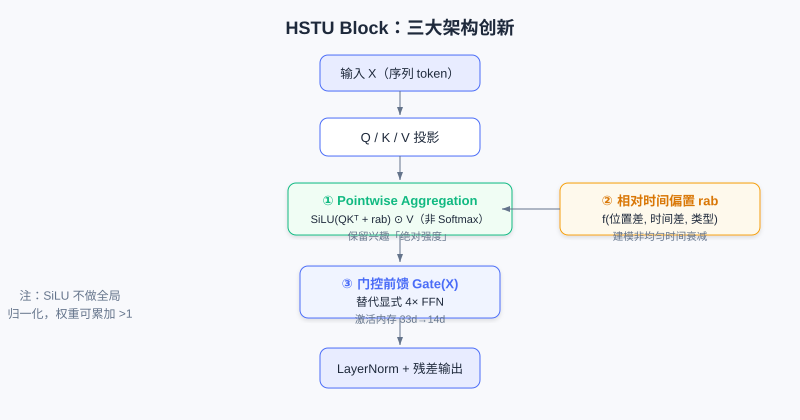
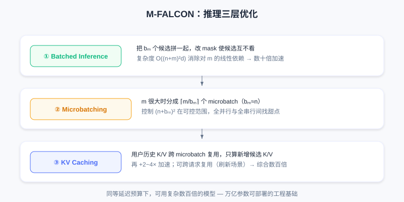

  📖
  ⏱️ ~55 min read
  🎯 Advanced

# HSTU: The First Exploration of the Scaling Law

> 📝 **Before You Continue:** Make sure you first have the discriminative ranking background from [3.1 Wide & Deep](./../part3-ranking/wide-and-deep.md). This chapter repeatedly contrasts "traditional DLRM scoring each candidate independently" with "generative sequence modeling" — understanding the bottlenecks of the former is what makes HSTU's motivation click. We also recommend reading [6.1 Generative Recommendation Paradigm](./../part6-gr-basic/) first for background on semantic IDs and generative retrieval.

Over the past decade, deep learning has scaled relentlessly in CV and NLP: ResNet pushed network depth beyond a thousand layers, Transformer parameter counts exceeded a trillion, and astonishing intelligent behavior emerged. Behind them all lies a common pattern — **as long as the architecture is right, model performance keeps improving as compute, data, and parameters grow, following a predictable power law**. This is the famous **Scaling Law**.

Recommendation systems, however, have long been the counterexample. Industry invested heavily in carefully designing thousands of features, building sophisticated DLRM architectures, and processing billions of users' data every day — yet performance hit a ceiling quickly. More parameters and bigger data often bought marginal or even zero gains. Where does the problem come from? This chapter walks you from the three bottlenecks of traditional DLRMs to the full story of Meta validating, with HSTU, that "recommendation can scale too".

After reading this chapter, you will be able to:

- Name the three fundamental limitations that keep traditional **DLRMs (Deep Learning Recommendation Models)** from scaling
- Explain how **Generative Recommenders (GR)** model behavior history as a "language" and achieve `user-level` sequence training
- Describe HSTU's three architectural innovations for recommendation (Pointwise Aggregation, relative time bias, gated feed-forward)
- Explain how **Stochastic Length** and **M-FALCON** solve the engineering challenges of ultra-long-sequence training and multi-candidate inference respectively
- Recount the experimental conclusion of the recommendation Scaling Law, $L = L_0 + \beta\ln C$, and understand its implications for recommendation foundation models
- Work through 4 tiered practice problems that consolidate the full chain from paradigm to engineering

---

## 7.1.0 Three Fundamental Limitations of Traditional DLRMs

To understand why HSTU is a breakthrough, you first need to see clearly what it broke through. Traditional DLRMs are extremely mature in recommendation performance, yet they carry three structural flaws that defeat scaling:

First, the **feature bottleneck**. DLRMs rely on hand-crafted numerical features (CTR, average watch time, and other statistical features) to compress historical information. As model capacity grows, these pre-aggregated features become an information bottleneck — model capability rises, but the richness of the input information does not.

Second, **architectural fragmentation**. A DLRM is assembled from heterogeneous modules such as FM, DCN, DIN, and MMoE, each optimized for a specific kind of interaction. Scaling up one module's capacity usually yields only local improvement, not systemic gains.

Finally, the **training paradigm limitation**. Traditional DLRMs use **item-level modeling**: they compute an independent score $\text{score}(u, i_j)$ for each candidate, and each training sample corresponds to a single $(user, item, action)$ triple. This means each training pass extracts only one supervision signal per interaction, compute cost grows **linearly** with the number of candidates, and the independent scoring mechanism cannot capture dependencies between candidates.

> 💡 **Key Insight:** These three limitations compound to flatten the traditional DLRM's "compute growth curve". Breaking through requires not engineering patches but a **paradigm shift**.

---

## 7.1.1 The Paradigm Shift: From Item Sequences to Behavior Sequences

The Meta team arrived at a key insight: **what happens if we treat a user's behavior history as a special kind of "language"?**

In NLP, the success of language models such as GPT rests on a clean and powerful paradigm: given the preceding tokens $[w_1, w_2, \ldots, w_t]$, autoregressively predict the next word $w_{t+1}$. The unified sequence representation encodes all information into a token sequence; autoregressive training yields multiple supervision signals per sample; and the Transformer provides strong sequence modeling capability and parameter efficiency.

But recommendation is not a copy-paste of language modeling. GRU4Rec and SASRec had long modeled user interaction history as sequences, yet they focused only on the **item** sequence $[\Phi_0, \Phi_1, \ldots, \Phi_{i-1}]$, predicting the next item $\Phi_i$, while ignoring the single most crucial piece of information in recommender systems — **the user's behavioral feedback**.

The **Generative Recommender (GR)** paradigm proposed by Meta treats recommendation as two intertwined stochastic processes: the system presents content $\Phi_i$, and the user produces a behavioral feedback $a_i$ (click, like, watch time, and so on). The full data flow is an alternating content–action sequence:

$$[\Phi_0, a_0, \Phi_1, a_1, \ldots, \Phi_{n_c-1}, a_{n_c-1}]$$

This deceptively small change has far-reaching effects. What gets modeled is no longer $p(\Phi_i | \Phi_0, \ldots, \Phi_{i-1})$ but the full joint distribution $p(\Phi_0, a_0, \Phi_1, a_1, \ldots, \Phi_{n_c-1}, a_{n_c-1})$. Applying the chain rule of probability immediately reveals two core tasks:

- **The ranking task** corresponds to $p(a_i | \Phi_0, a_0, \ldots, \Phi_i)$ — given the user's history and the current candidate $\Phi_i$, predict what behavior $a_i$ the user will produce. Note this is **target-aware**: the model sees the candidate first, then predicts the behavior.
- **The retrieval task** corresponds to $p(\Phi_i | \Phi_0, a_0, \ldots, a_{i-1})$ — given historical interactions, predict the next item to recommend, which is closer to traditional sequential recommendation.

### 🧠 Mental Model: Recommendation as a "Diary"

> A traditional DLRM scores each event independently: "Xiaoming rates video A 0.8, video B 0.6". GR instead writes recommendation as a **diary**: "watched tech blogger A (liked) → watched food blogger B (saved) → ...". By reading the whole diary, the model can predict "what you will do next, what you want to watch" — and every sentence it reads delivers another supervision signal.

---

## 7.1.2 Unifying the Heterogeneous Feature Space

Traditional DLRM features are highly heterogeneous and fragmented: categorical (sparse) features such as user ID, item ID, and creator ID can have cardinalities in the billions; numerical (dense) features such as CTR and average watch time are carefully engineered aggregate statistics. They pass through different modules — embedding lookups, feature crossing, MLPs — and are then concatenated.

GR needs clever design to unify these heterogeneous features into a sequence. For categorical features, the core idea is **timeline alignment with compressed merging**:

- Identify the "main timeline" that changes most frequently (usually the user's interaction history).
- For slowly changing features (following list, city, etc.), apply **segment compression**: keep only the first occurrence of each run of identical values. For example, compress `[Zhang,Zhang,Zhang,Li,Li,Wang,...]` to `[Zhang,Li,Wang]`.
- Merge the compressed sequences onto the main timeline by timestamp to obtain a unified categorical feature sequence.

For numerical features, the insight goes deeper: they are usually **aggregate statistics** over categorical features ("CTR on tech topics" is essentially a statistic over "click behaviors on tech items in the history"), and the underlying signals already live in the categorical sequence. This means **if the sequence model is strong enough and the sequence long enough, it can in principle learn these aggregated features from the raw sequence automatically** — trading model capacity for feature engineering.

Formally, the traditional DLRM feature space is $\mathcal{F}_{\text{DLRM}} = \{\text{sparse}\} \cup \{\text{dense}\}$, while GR unifies it as $\mathcal{F}_{\text{GR}} = \text{Seq}(\text{sparse})$. As sequence length $n \to \infty$: $\lim_{n \to \infty} \mathcal{F}_{\text{GR}} \approx \mathcal{F}_{\text{DLRM}}$.

Left: DLRM routes sparse/dense features into different modules, and information stays isolated before concatenation; right: GR encodes all information into a single unified sequence, learned end-to-end by one Transformer.

> ⚠️ **Warning:** Fully giving up numerical features is not free. The paper's ablation shows that when the DLRM baseline is also configured as "categorical-only", performance drops significantly. This means **in low-compute settings, carefully engineered numerical features still carry value**. GR's advantage is learning these signals automatically with larger capacity and longer sequences — a trade of compute for feature engineering.

---

## 7.1.3 The Leap in Training Efficiency

The unified sequence representation brings not only modeling advantages — it **fundamentally changes the computational complexity of training**.

Traditional DLRM: each sample corresponds to one interaction $(u,i,a)$ and requires one forward pass. With $M$ interactions, you need $M$ forward passes, for a total compute cost of $O(M \cdot C_{\text{forward}})$.

Under GR, a user sequence $[\Phi_0, a_0, \ldots, \Phi_{n_c-1}, a_{n_c-1}]$ has total length $n = 2n_c$. In autoregressive training it provides **$n_c$ supervision signals** (predict $a_0$ after position 0, predict $a_1$ after position 2, ...). The key point: **these $n_c$ predictions are completed in parallel within a single forward pass**.

The Transformer's causal mask (lower-triangular mask) ensures position $i$ can only see positions $0$ through $i-1$; one forward pass implicitly encodes all prefixes, and the position after each content token is used to predict the corresponding behavior, all sharing the intermediate results of that same forward pass.

Total compute drops from $O(M \cdot C_{\text{forward}})$ to $O((M/n_c) \cdot C_{\text{forward}})$ — a **training efficiency gain of roughly $n_c$ times**. With an average of 500 historical interactions per user, that is a 500x speedup. This means **with the same compute budget, you can train models one to two orders of magnitude more complex**.

> 💡 **Key Insight:** This is the first key factor behind GR breaking the scaling bottleneck — it provides enough computational headroom to try deeper networks and larger capacities. But it is not enough on its own; you also need an efficient architecture purpose-built for recommendation.

---

## 7.1.4 The HSTU Architecture: A Sequence Model Optimized for Recommendation

Can we just use a standard Transformer? It is proven in NLP, but recommendation has its own peculiarities. Meta's **HSTU (Hierarchical Sequential Transduction Unit)** introduces three key architectural innovations.

### Innovation 1: Pointwise Aggregation Replaces Softmax Attention

Standard Transformer: $\text{Attention}(Q,K,V) = \text{softmax}(QK^T/\sqrt{d_k})V$. Softmax normalization forces attention weights to sum to 1, so what is learned is the **relative importance** of historical tokens.

But in recommendation we need to know not only "which history matters" but also "**how much** it matters". For example: user A clicks 10 tech items and 1 entertainment item; user B clicks 100 tech items and 10 entertainment items. Under softmax, both distributions may come out 90%/10% — erasing the information that user B's **absolute intensity** of interest in tech is higher.

HSTU replaces softmax with pointwise aggregation:

$$A(X)V(X) = \varphi_2\left(Q(X)K(X)^T + \text{rab}_{p,t}\right) \odot V(X)$$

where $\varphi_2$ is the SiLU activation (Swish), $\text{rab}_{p,t}$ is a relative attention bias, and $\odot$ is element-wise multiplication. The full output: $\text{Output} = \text{LayerNorm}(A(X)V(X)) \odot U(X)$, where $U(X)$ is a gated projection. The key point is that SiLU maps similarity to a continuous value range but **performs no global normalization**: each position's weight is independent, and the summed weights can exceed 1 — so the model can learn the absolute intensity of "this user's interest in this type of content is very strong".

### Innovation 2: Redesigning Relative Position Encoding

The temporal characteristics of recommendation sequences differ fundamentally from language sequences: language positions are discrete and uniform (words 3 and 5 are always distance 2 apart); recommendation time is continuous and uneven (two interactions may be seconds or months apart).

HSTU introduces an enhanced relative position bias $\text{rab}_{p,t}$ that considers not only the position difference $p_i-p_j$ but also the actual time difference $t_i-t_j$, and distinguishes token types (content $\Phi$ / action $a$):

$$\text{bias}_{i,j} = f(p_i-p_j, t_i-t_j, \text{type}_i, \text{type}_j)$$

This lets the model learn: recent behaviors matter more, certain behaviors decay faster (browsing vs liking), and the relationship between content tokens and action tokens differs from that between content tokens.

### Innovation 3: Simplified Feed-Forward Network and Gating

The standard Transformer appends a two-layer FFN after attention (with the intermediate dimension 4x the hidden size), which consumes most of the parameters and compute. HSTU, inspired by GLU variants, replaces the explicit FFN with element-wise gating:

$$\text{HSTU-Block}(X) = \text{LayerNorm}(X + \text{Gate}(X) \odot \text{Attention}(X))$$

The gate function $\text{Gate}(X)$ is a lightweight transformation. The benefits: (1) it avoids the 4x-hidden FFN, reducing parameters and compute; (2) it cuts activation memory. The latter matters enormously in industry — with very large batch sizes (tens of thousands to hundreds of thousands), activation memory is often the bottleneck. HSTU reduces per-layer activation memory from 33x the hidden dimension in a standard Transformer to 14x, enabling deeper networks under the same memory budget.

> 📝 **Note:** The "Hierarchical" in HSTU's name refers to representing ultra-high-cardinality categorical features with hierarchical tokens (e.g., splitting an item ID into multiple sub-tokens). Follow-up research found that a flat representation suffices in most scenarios; **the real value lies in the three architectural innovations above**.

One HSTU Block: after Query/Key/Value projections, element-wise SiLU aggregation (not softmax normalization) with relative time bias is applied, and a gated projection performs the residual fusion.

> **Analysis:** All three HSTU innovations revolve around "the peculiarities of recommendation" — absolute interest intensity (pointwise), non-uniform time (rab), and large-batch memory (gated FFN). Compared with directly applying a standard Transformer, it improves both efficiency and effectiveness, and it is the engineering foundation that makes deploying trillion-parameter models possible.

The interactive demo below lets you see intuitively how HSTU transforms "behavior history" step by step into "behavior prediction": interleaved sequence organization → causal mask → pointwise aggregation → target-aware prediction at candidate positions → multiple supervision signals from one forward pass.

<iframe src="../viz/part7-hstu-sequence.html?embed&vizId=part7-hstu-sequence" style="width:100%; height:520px; border:none; display:block;" loading="lazy"></iframe>

Click "Next" or "Autoplay" and observe how the sequence changes at each step, and why this delivers the leap in training efficiency.

---

## 7.1.5 Engineering Optimizations for Training and Inference

With an efficient architecture in hand, ultra-long-sequence training and multi-candidate inference remain hard. HSTU cracks each with an engineering innovation.

### Stochastic Length: Exploiting Multi-Scale Redundancy in Behavior

Self-attention complexity is $O(n^2)$, which becomes unbearable when sequences run to thousands or tens of thousands. But user behavior has **repeating patterns at different time scales**: long-term stable preferences, mid-term interest evolution, and short-term contextual needs. Based on this observation, HSTU proposes **Stochastic Length**: for a sequence of length $n$, do not always use the full sequence; instead, with a certain probability randomly truncate to a shorter subsequence.

Concretely, if $n$ exceeds a threshold $N_{\alpha/2}$, sample a subsequence of length $N_{\alpha/2}$ with probability $p = 1 - N_\alpha/n^2$; otherwise use the full sequence. $\alpha$ controls truncation aggressiveness: smaller $\alpha$ (e.g., 1.6–1.7) truncates more aggressively and trains faster; $\alpha=2$ degenerates to no truncation. Subsequence sampling is feature-weighted to ensure coverage across time scales.

This brings a double benefit: (1) self-attention complexity drops from $O(n^2)$ to $O(N_\alpha)$, sequence sparsity can reach 80%+, and training speeds up several-fold; (2) the random subsequences act as regularization, similar to dropout, forcing the model to learn more robust representations — and generalization actually improves. Experiments show almost no negative impact on quality across a wide range of $\alpha$.

### M-FALCON: An Inference Algorithm with Global Cost Amortization

Inference latency is equally critical. Ranking must score hundreds or thousands of candidates one by one; the naive approach needs $m$ forward passes with total compute $O(mn^2d + mnd^2)$, and the accumulated latency is unacceptable. HSTU's **M-FALCON (Microbatched-Fast Attention Leveraging Cacheable OperatioNs)** solves it with three escalating optimizations:

**Layer 1: Batched Inference** — concatenate $b_m$ candidates together and modify the attention mask so candidates cannot see each other (candidate $i$ can only attend to the user's history). Now the scores for $b_m$ candidates are computed in parallel in a single forward pass. Setting $b_m = m$ (full batch), complexity drops to $O((n+m)^2d + (n+m)d^2)$, eliminating the linear dependence on $m$.

**Layer 2: Microbatching** — when $m$ is very large, $b_m=m$ makes $(n+m)^2$ too big. Split the $m$ candidates into $\lceil m/b_m\rceil$ microbatches (e.g., with $b_m$ on the same order as $n$) to find the sweet spot between "fully parallel" and "fully serial".

**Layer 3: KV Caching** — microbatching unlocks KV caching across microbatches: the user-history portion of $K,V$ is identical across all microbatches, so the first microbatch computes the full $K,V$ and subsequent ones only compute the $K,V$ of the new candidates. Later microbatches' complexity drops to $O(b_m d^2 + b_m nd)$, a $2\sim4$x speedup. The KV cache can also be reused across requests (the same user refreshing several times within a short window).

Combined: batched inference brings a tens-of-times speedup, microbatching + KV caching another $2\sim4$x — up to hundreds of times overall, letting you use models hundreds of times more complex under the same latency budget.

> **Analysis:** M-FALCON is the engineering cornerstone that lets HSTU deploy trillion-parameter models. It decouples "history representation computation" from the candidate count — the user side is computed only once per request — and this is precisely the origin of the Cross-Request KV Caching idea in OneTrans later in 7.5.

---

## 7.1.6 The Scaling Law for Recommender Systems

With all the technical building blocks in place, we return to the original question: **can recommendation models keep scaling like language models?**

Meta ran systematic scaling experiments: sequence length from 512 to 8192, hidden dimension from 256 to 1024, depth from a few layers to 24. Because recommendation trains in a streaming fashion, training compute was normalized to 365 days to allow fair comparison with GPT-3 and LLaMA-2. Metrics were Hit Rate@100/@500 for retrieval and Normalized Entropy for ranking (lower is better).

Plotted on log axes, **all metrics show a clean power-law relationship**:

$$L = L_0 + \beta \ln C$$

where $L$ is the performance metric, $C$ is total training compute (PetaFLOPs/day), and $L_0,\beta$ are fitted parameters. The fitted results:

- Retrieval: $\text{HR@100} = 0.15 + 0.0195 \ln C$
- Ranking: $\text{NE} = 0.549 - 0.0053 \ln C$

That is, **for every 10x increase in compute (one order of magnitude), HR@100 improves by about 4.5 percentage points and NE drops by about 1.2 percentage points**. More striking still, this relationship holds stably **across three orders of magnitude of compute**.

Left: the ranking NE metric keeps decreasing with compute; right: retrieval HR@100 keeps increasing with compute. Both curves are stable across three orders of magnitude, isomorphic to the LLM Scaling Law.

The implications run deep: (1) this is the **first proof** of a Scaling Law for recommendation models — recommendation is no longer deep learning's exception; (2) small-scale experiments can predict large-scale performance, **providing direction for R&D** while reducing blind effort and carbon emissions; (3) it opens the door to **recommendation Foundation Models** — pretrain a large model, then fine-tune across scenarios. The largest configuration (8192 sequence, 1024 dimensions, 24 layers) reached **1.5 trillion parameters** and was successfully deployed across multiple Meta surfaces serving billions of users, with online A/B ranking metric gains in the double-digit percentage range.

The interactive curves below let you verify the Scaling Law yourself: drag the slider to adjust training compute and watch Hit Rate@100 and Normalized Entropy move along the power-law curve; you can also click "Next" to walk through several key milestones from small scale to trillion-parameter deployment.

<iframe src="../viz/part7-scaling-law.html?embed&vizId=part7-scaling-law" style="width:100%; height:520px; border:none; display:block;" loading="lazy"></iframe>

Each 10x increase in compute moves HR@100 up about +4.5pp and NE down about −1.2pp — this predictability is the fundamental guarantee that recommendation models can scale like LLMs.

---

## 7.1.7 Why Could HSTU Break Through?

Looking back at the whole technical system, four levels of innovation support one another:

1. **The paradigm shift is the foundation** — moving from item-level to user-level, from independent scoring to sequence generation, unbinding compute cost from candidate count's linear coupling.
2. **Architectural innovation is the key** — attention, position encoding, and the feed-forward network were each purposefully designed, yielding significant gains over directly applying a standard Transformer.
3. **Engineering optimization is the guarantee** — Stochastic Length makes ultra-long-sequence training feasible, M-FALCON makes complex-model inference efficient, and activation memory optimization makes large batches a non-issue.
4. **The unified feature space is the base** — heterogeneous features enter a unified sequence, simplifying feature engineering and, more importantly, letting the model learn complex interactions end-to-end with higher parameter efficiency.

All four are indispensable. HSTU's success proved recommendation models can scale — and left new questions behind: which factors are truly essential? Is fully generative training necessary? How do we generalize to multi-task, multi-surface settings? Later research answers these — starting with GenRank in 7.2, which asks "is the autoregressive mechanism really the essence?"

---

## ⚠️ Common Mistakes in 7.1

| # | Mistake | Example | Why It's Wrong | Fix |
|---|---------|---------|---------------|-----|
| 1 | Assuming recommendation inherently cannot scale | "Adding parameters to a DLRM is useless; recommendation is just the exception" | It is not that recommendation cannot scale; the item-level paradigm + fragmented architecture tie its hands computationally | Understand how HSTU's user-level sequences unbind it |
| 2 | Treating GR as ordinary sequential recommendation | "GR is just SASRec with longer sequences" | GR models content–action **interleaved** sequences and predicts behaviors $a_i$ in a target-aware way | Distinguish item sequences from behavior sequences |
| 3 | Assuming softmax attention is good enough | "Just use a standard Transformer as HSTU" | Softmax normalization erases the **absolute intensity** of interest | Remember the key difference of pointwise aggregation |
| 4 | Overlooking where the training efficiency comes from | "Sequence modeling just performs better" | One forward pass yields $n_c$ supervision signals, speeding training up $n_c$ times | Understand the compute dividend of user-level aggregation |
| 5 | Assuming the Scaling Law only holds for huge models | "Scaling only matters at a trillion parameters" | The power law holds across three orders of magnitude; small-scale experiments extrapolate | Use small experiments to predict large-scale performance |

---

## Chapter Summary

### 📌 Key Takeaways

| Concept | Key Points | Why It Matters |
|---------|-----------|----------------|
| Three DLRM limitations | Feature bottleneck / architectural fragmentation / item-level training | Explains why recommendation long failed to scale |
| GR paradigm | $[\Phi_0,a_0,\ldots]$ interleaved sequence, user-level autoregression | Unified sequence + multiple supervision signals, $n_c$x training speedup |
| Three HSTU innovations | Pointwise Agg / relative time bias / gated FFN | A sequence architecture tailored to recommendation |
| Stochastic Length | Random truncation of ultra-long sequences | Several-fold training speedup + regularization |
| M-FALCON | Batched→Microbatch→KV Cache | Hundreds-of-times inference speedup, trillion parameters deployable |
| Scaling Law | $L=L_0+\beta\ln C$, stable across three orders of magnitude | First proof recommendation can scale; opens the door to foundation models |

### ❓ FAQ

**Q1: Why is Pointwise Aggregation better suited to recommendation than Softmax?**
> A: Softmax forces weights to sum to 1 and learns only "relative importance"; recommendation also needs "absolute intensity" (user B likes tech more than user A does). SiLU element-wise aggregation does no global normalization, weights can accumulate beyond 1, and absolute interest intensity is preserved — which is crucial for predicting post-click deep behaviors.

**Q2: Why is GR training so much faster than DLRM?**
> A: A DLRM does one forward pass per interaction — $M$ samples means $M$ forward passes. GR predicts $n_c$ behaviors for a user sequence in one forward pass (sharing computation under the causal mask), so total forward passes drop to $M/n_c$, roughly an $n_c$x speedup.

**Q3: Why are recommendation foundation models now plausible?**
> A: The Scaling Law proves performance improves predictably with compute, which means you can pretrain a large general recommendation model and fine-tune it across scenarios — the most exciting direction after HSTU's 1.5-trillion-parameter deployment.

### 🔗 Connections to Later Chapters

- **7.2 (Generative Ranking / GenRank)** asks whether autoregression is the essence and speeds things up further with Action-Oriented design — directly continuing this chapter's question of "which factors are essential".
- **7.3 (MTGR)** retains cross features under a hybrid paradigm, answering "is fully generative training necessary?"
- **6.1–6.4 (generative fundamentals)** provide the prerequisites of semantic IDs and RQ-VAE for understanding how items become tokens.
- **3.1–3.5 (discriminative ranking)** are the "old paradigm" this chapter keeps contrasting against — see the bottlenecks clearly, and the breakthrough lands.

---

## Practice Problems

Work through all problems in order — they get progressively harder. Each has a complete solution you can reveal after trying it yourself.

---

**Problem 7.1.1 — Identifying the DLRM Bottleneck** 🟢 Easy

A team doubles the DLRM's embedding dimension and deepens the MLP, yet online CTR-prediction AUC barely moves. Based on the three limitations in 7.1.0, identify the most likely cause (pick one and justify it).

💡 Solution (click to reveal)

**Approach:** Judge from the angle of "more capacity ≠ more information".

The most likely culprit is the **feature bottleneck**: the DLRM compresses history into pre-aggregated numerical features (CTR, average watch time), so model capacity grew but the richness of input information did not. Second is item-level training — each sample carries only one supervision signal, so added capacity does not increase the per-sample information. Architectural fragmentation is also possible (scaling one module only improves things locally).

**Key points:**
- A stalled compute growth curve usually means information or the paradigm is constrained, not that parameters are insufficient.
- This is precisely what leads to HSTU's user-level sequence solution.

---

**Problem 7.1.2 — GR Sequence Organization** 🟢 Easy

Traditional sequential recommendation models the item sequence $[\Phi_0, \Phi_1, \ldots]$, while HSTU's GR models $[\Phi_0, a_0, \Phi_1, a_1, \ldots]$. Answer:

1. How many times the number of interactions $n_c$ is the GR sequence length (in tokens)?
2. Is the ranking task $p(a_i | \ldots, \Phi_i)$ target-aware or target-agnostic?

💡 Solution (click to reveal)

**Approach:** Map directly to the definitions in the text.

1. The GR sequence has total length $n = 2n_c$ (content and action alternating), which is **2 times** $n_c$.
2. In $p(a_i | \Phi_0, a_0, \ldots, \Phi_i)$ the model sees candidate $\Phi_i$ before predicting behavior $a_i$, so it is **target-aware**.

**Key points:**
- The interleaved sequence trades length for behavioral feedback signals.
- Target-awareness is the foundation for later generative ranking to predict deep behaviors.

---

**Problem 7.1.3 — Training Efficiency Multiple** 🟡 Medium

Suppose users average $n_c = 500$ historical interactions and the training set has $M = 10^8$ interaction records. Compare the order of magnitude of "forward passes" required by the DLRM (one per record) versus GR (organized into user sequences of length $2n_c$). About how many times faster is GR?

💡 Solution (click to reveal)

**Approach:** DLRM forward passes = $M = 10^8$. GR organizes the $M$ interactions into $M/n_c$ sequences, one forward pass each.

$M/n_c = 10^8 / 500 = 2 \times 10^5$ forward passes. The speedup is $= 10^8 / (2\times10^5) = 500$x.

**Key points:**
- The speedup ratio ≈ average sequence length $n_c$, because one forward pass yields $n_c$ supervision signals.
- This explains "with the same compute you can train models hundreds of times more complex".

---

**Problem 7.1.4 — Extrapolating the Scaling Law** 🔴 Hard

Given retrieval HR@100 $= 0.15 + 0.0195 \ln C$ ($C$ in PetaFLOPs/day). If compute grows from $C_1=10^3$ to $C_2=10^4$ (one order of magnitude), by how many percentage points does HR@100 improve? And why is this more controllable than "blindly stacking parameters"?

💡 Solution (click to reveal)

**Approach:** Use the difference of logarithms.

$\Delta = 0.0195 (\ln 10^4 - \ln 10^3) = 0.0195 \ln 10 \approx 0.0195 \times 2.303 \approx 0.0449$. That is about **4.5 percentage points**, consistent with the main text.

**Key points:**
- The Scaling Law gives a predictable power law, so small experiments can extrapolate to large-model performance.
- Compared with blindly stacking parameters (which may plateau), it turns R&D into a controlled engineering exercise of "planning performance against the compute budget".

---

**🏆 Challenge: Arguing a Design Trade-off**

Suppose you lead a mid-sized company's recommendation team with only 1% of Meta's compute. Write an argument within 150 words: should you copy HSTU's trillion-parameter setup directly, or first do a lightweight landing based on its "paradigm shift + engineering optimization" ideas? Identify the two HSTU techniques most useful to you.

💡 Hint

With limited compute, a trillion parameters is infeasible; but "user-level sequence training's $n_c$x speedup" and "M-FALCON's KV caching/batching" are architecture dividends independent of compute scale, and the most worth borrowing. Stochastic Length's truncation also directly cuts training cost. The point is to carry over the paradigm dividend, not the parameter scale.

