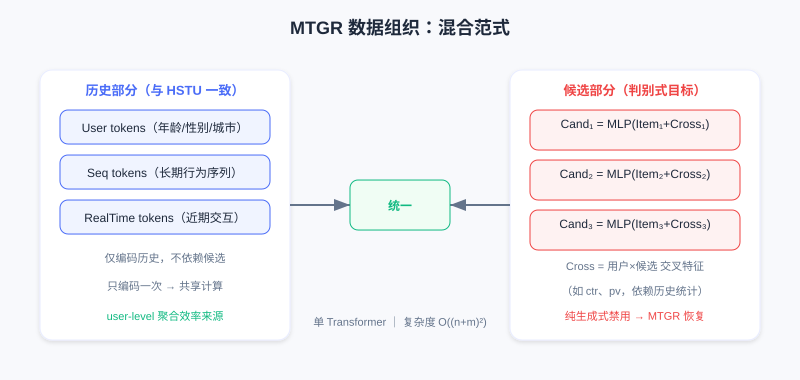

  📖
  ⏱️ ~50 min read
  🎯 Advanced

# MTGR: Hybrid Paradigm Modeling

> 📝 **Before You Continue:** You have read [7.2 Generative Ranking](./generative-ranking.md). This chapter picks up its closing soul-searching question — is the efficiency advantage of user-granularity modeling necessarily bound to the fully generative formulation? MTGR answers no with a "hybrid paradigm".

HSTU proved recommendation can follow the Scaling Law, and GenRank revealed that the essence of generative modeling is autoregression rather than the training paradigm. Both evolved toward "purity": unified sequence modeling replaces fragmented feature engineering, and an end-to-end Transformer replaces heterogeneous modules.

But this purity has a price.

In HSTU/GenRank, to achieve full behavior-sequence modeling, predicting user behavior on a candidate **cannot use any candidate-dependent cross features**. These are hard-won lessons from years of industry iteration — "the user's historical CTR on this category", "the user's preference for this kind of content at this hour", "how well the item matches the user's profile" — precisely capturing fine-grained user-candidate interactions.

The Meituan team discovered a stark fact: **removing cross features causes a significant performance drop, and even substantially increasing model scale cannot make up for it**. This raises the fundamental question: can the user-granularity modeling paradigm of generative recommendation be combined with the feature engineering experience of traditional DLRMs?

**MTGR (Meituan Generative Recommendation)** answers yes. Its core contribution is not faster training or lower latency, but a **hybrid paradigm**: retaining the efficiency of user-granularity aggregation while supporting target-aware discriminative modeling.

---

## 7.3.0 Rethinking the Paradigm: Generative vs Discriminative

### The Fundamental Assumption of HSTU/GenRank

Both adopt interleaved modeling $[\Phi_0, a_0, \Phi_1, a_1, \ldots]$, with the joint distribution decomposed as $p(\Phi_0)\cdot p(a_0|\Phi_0)\cdot p(\Phi_1|\Phi_0,a_0)\cdots$. The ranking task corresponds to $p(a_i | \Phi_0, a_0, \ldots, \Phi_i)$ — which looks target-aware, because the model sees the candidate $\Phi_i$.

The problem is: **the candidate $\Phi_i$ is part of the sequence, on equal footing with the historical behavior $a_{i-1}$**. Under autoregressive training, the prediction at position $i$ can only depend on positions $0$ through $i-1$. But cross features often need to "cross over" this ordering — they require simultaneously looking at some historical statistic of the user (e.g., "average dwell time on tech content") and the current candidate's attributes ("this is a tech video") before computing the interaction. Under a purely generative scheme this crossing is forbidden: if $\Phi_i$'s representation were allowed to depend on "the user's historical preference for this candidate's category", causality would break — because that feature has effectively "seen the future" (it was computed against the current candidate $\Phi_i$).

GenRank's action-oriented compresses sequence length but does not change this fundamental restriction; strict temporal ordering is still preserved.

Meituan's ablation gives a clear answer: **after removing cross features, even the largest-scale generative model degrades to worse than a mid-scale traditional DLRM**. This is a gap scaling cannot fill — it is missing information, not missing capacity.

### The Essence of Discriminative Ranking

Why are cross features so critical? Look at the nature of the ranking task: the input is the user's history plus a set of candidates, and the task is to predict a behavioral propensity (click, dwell, conversion) for each candidate. This is a classic **discriminative task**: given input $x$ (history + candidate), predict label $y$ (behavior).

The traditional DLRM formulates it as $p(a | u, i)$, where $u$ is the user representation and $i$ is the item representation. The key point: **the user representation $u$ may depend on the candidate item $i$**. For example, "the user's average CTR on tech content" is only meaningful when the candidate is a tech item — this is a $u\times i$ interaction, second-order or even higher. Many important signals come from "conditional statistics" (the user's historical behavior on this kind of content at this hour, this creator's content's appeal to this kind of user), which require simultaneously observing a subset of user history and candidate attributes before computing the statistic — hard to express naturally in a generative fashion.

Probabilistically, the discriminative approach cares about the conditional distribution $p(a | \text{history}, \text{candidate})$ and need not model the full joint $p(\text{history}, \text{candidate}, a)$. The generative approach derives the conditional from a factorized joint, at extra cost: it must model $p(\text{candidate} | \text{history})$ — even when that is not what we actually care about.

### MTGR's Core Insight

**The efficiency gain of user-granularity modeling comes essentially from sample aggregation and computation reuse — it does not require full generative modeling.**

---

## 7.3.1 MTGR's Hybrid Paradigm

MTGR proposes a scheme that sounds contradictory but is in fact clever: **use the architecture of a generative model (Transformer + user-granularity aggregation) while keeping a discriminative modeling objective**.

Concretely, the data organization aggregates multiple candidates of the same user into one sample:

$$[\text{User}, \text{Seq}, \text{RealTime}, [\text{Cross}_1, \text{Item}_1], [\text{Cross}_2, \text{Item}_2], \ldots]$$

The key differences:

- The **history part** (User, Seq, RealTime) matches HSTU/GenRank — the user's full behavior sequence
- The **candidate part** (Cross, Item) is no longer a continuation of history but the prediction target; each candidate's representation directly contains cross features

This breaks the strict "content–action alternating" temporal structure, admitting: at the ranking stage, candidates are given inputs, not intermediate states to be generated. Therefore targeted features can be constructed for each candidate (including cross features that depend on historical statistics and candidate attributes).

User/sequence/real-time tokens encode the history; multiple candidate tokens each fuse item features and cross features (such as ctr, pv) and are processed in parallel. Including cross features in the candidate part is MTGR's key advantage over pure generative approaches.

Meaning of each token: User tokens (static attributes like age, gender, city); Sequence tokens (long-term behavior sequence); RealTime tokens (recent interactions); Candidate tokens (one per candidate, fusing item + cross features).

This organization retains the user-granularity aggregation advantage: for $m$ candidates, the history part (User+Seq+RealTime) is encoded only once, with the $m$ candidate tokens in parallel. Complexity is $O((n+m)^2)$ rather than $O(m\cdot n^2)$ — a significant speedup when $m\ll n$. But MTGR no longer models the full behavior sequence; it computes loss and predicts behavior only at candidate positions — the discriminative objective allows candidate representations to contain arbitrary user-item cross information.

> 💡 **Key Insight:** MTGR's philosophy is **separating means from ends**. The generative architecture (Transformer + sequence modeling) is a powerful representational means, but it need not serve a generative objective; user-granularity aggregation is an efficient computational organization, but it need not require a fully causal sequence. The hybrid paradigm retains efficiency while restoring the flexibility of discriminative modeling.

---

## 7.3.2 Architectural Innovation 1: Mapping Features to Tokens

Problems appear when introducing cross features into a unified framework. Consider 3 candidates:

- Candidate 1: tech video; the user's historical CTR on tech is 0.8
- Candidate 2: food video; the user's historical CTR on food is 0.3
- Candidate 3: tech video; the user's historical CTR on tech is 0.8

Candidates 1 and 3 share identical cross features but are distinct candidates that should be scored independently. MTGR constructs an independent token for each candidate, fusing:

1. The item's intrinsic features (ID, category, tags, duration)
2. Cross features (the user's historical CTR on this category, preference at this hour)
3. Position and temporal information (list position, exposure time)

Formally, for candidate $i$:

$$\text{CandidateToken}_i = \text{MLP}(\text{Concat}(\text{Emb}(\text{Item}_i), \text{Emb}(\text{Cross}_i)))$$

The key decision: **cross features are treated as part of the candidate representation, not as part of the history sequence**. Even though candidates 1 and 3 share the same cross features, two independent tokens are still generated (because other dimensions like item ID and title differ).

Token generation for the user-history part is straightforward: User tokens (one per attribute), Sequence tokens (one per historical item), RealTime tokens (one per recent interaction) — all "pure", depending on no candidate, encoding only history.

This asymmetric token organization creates a problem: **different token types live in different semantic spaces**. User tokens encode demographics, Sequence tokens encode behavior patterns, Candidate tokens encode item + cross features. Processing them directly with a unified Transformer makes tokens from different semantic spaces interfere with one another.

---

## 7.3.3 Architectural Innovation 2: Group Layer Normalization

Standard LayerNorm normalizes along the token's feature dimension: $\text{LayerNorm}(x) = (x-\mu)/\sigma \cdot \gamma + \beta$, assuming all tokens share the same feature distribution with global parameters $\gamma,\beta$.

Under MTGR this assumption breaks. Consider a batch's token sequence:

$$[\text{Age}, \text{Gender}, \text{City}, \text{Seq}_1, \ldots, \text{Seq}_{100}, \text{RT}_1, \ldots, \text{RT}_{10}, \text{Cand}_1, \text{Cand}_2, \text{Cand}_3]$$

An Age token's activations may lie in $[-1,1]$ (discrete demographics), while Sequence tokens may span $[-5,5]$ (accumulated over more layers). Global LayerNorm computes mean and variance across all tokens, leaving Age "over-amplified" and Sequence "over-compressed". Worse is **semantic confusion**: dimension 100 may encode "user activity level" in a User token but "candidate popularity" in a Candidate token; global normalization mixes them together and weakens representation.

MTGR proposes **Group Layer Normalization (GLN)**: normalize in groups by token type.

- Group 1: User tokens
- Group 2: Sequence tokens
- Group 3: RealTime tokens
- Group 4: Candidate tokens

Within each group, mean, variance, and normalization parameters are computed independently:

$$\text{GLN}(x_i) = \frac{x_i - \mu_{g(i)}}{\sigma_{g(i)}} \cdot \gamma_{g(i)} + \beta_{g(i)}$$

where $g(i)$ is the group of token $i$.

Left: standard global LayerNorm mixes all tokens together, with distributions and semantics interfering; right: GLN normalizes the User/Seq/RT/Cand groups independently, aligning distributions and keeping semantics separate.

The benefits: (1) **distribution alignment** — tokens within a group are semantically close with similar distributions, so independent normalization stabilizes training; (2) **semantic independence** — the same dimension can encode different information in different groups, and parameter independence guarantees semantic independence. GLN merely adds group information to LayerNorm, with negligible computational overhead — yet it acknowledges an important fact: **in a hybrid paradigm, different types of information should stay relatively independent in representation space rather than being forcibly unified**. This principle appears elsewhere in MTGR too (different groups can use embeddings of different dimensions, different layers for processing) — it is the balance point between unified architecture and feature flexibility.

---

## 7.3.4 Architectural Innovation 3: Dynamic Masking

Transformer self-attention allows arbitrary token interaction, but sequence modeling usually requires restrictions for causality. HSTU/GenRank use a causal mask (lower triangle). But under MTGR's hybrid paradigm the causal mask no longer applies — the token sequence is not organized strictly by time.

Recall MTGR's organization: $[\text{User}, \text{Seq}, \text{RealTime}, \text{Cand}_1, \ldots, \text{Cand}_m]$. User is static, Seq is already time-ordered, RealTime is recent (and may overlap the candidates' exposure times), Candidates are parallel (and should not see each other, since in real exposure the user views one item at a time). A naive causal mask runs into problems: Cand$_2$ would see Cand$_1$, but in training the candidates were exposed at different times and at inference they must be scored simultaneously — visibility between candidates makes no sense.

The thornier issue is handling RealTime. RealTime records interactions in a recent window (say, the last hour). If multiple exposures across a day are aggregated, RealTime may contain interactions that happened after some candidate's exposure — causing **information leakage**. For example: 12:00 sees candidate A (clicked), 12:30 sees candidate B (not clicked), 13:00 sees candidate C (clicked). In aggregated training, RealTime contains the 13:00 click, but when predicting candidate B at 12:30 the model should not see it.

MTGR's **Dynamic Masking** solves this with fine-grained visibility control, defined by three rules:

**Rule 1: Static sequences are visible to all tokens** — User and Seq come from history before the aggregation window, and any candidate may attend to them (long-term history is meaningful for all candidates). In the mask matrix, the User/Seq columns are all 1s.

**Rule 2: Dynamic sequences follow causality** — RealTime tokens' timestamps may fall inside the aggregation window, ordered relative to candidate exposures. RT$_i$'s visibility to RT$_j$ depends on timestamps ($t_i<t_j$ means visible); RT$_i$'s visibility to Cand$_k$ also follows timestamps (visible if $t_i <$ Cand$_k$'s exposure time). In the mask, RealTime is causal among itself (lower triangle), and toward Candidates it is decided dynamically by actual timestamps.

**Rule 3: Candidates are mutually independent** — Cand$_i$ is invisible to Cand$_j$ ($j\neq i$), guaranteeing independent scores. In the mask, the Candidate blocks form a diagonal mask (only the diagonal is 1).

White means visible, gray invisible: the user-feature and history-sequence columns are fully white (globally visible); the real-time sequence is partially triangular by timestamp (causal); candidates are visible only on the diagonal (independent).

This mask is not fixed in advance but **generated dynamically** from the actual timestamps of each sample's tokens — hence the name "Dynamic Masking". It prevents information leakage: in training it stops the model from learning spurious causality; at inference it lets all candidates of a request be processed in parallel (RealTime contains only pre-request interactions, and candidates are mutually independent), preserving computational efficiency. Dynamic Masking is the final piece of the hybrid paradigm, letting one Transformer handle both causal sequences (history) and non-causal targets (candidate scoring), striking the balance between flexibility and correctness.

> **Analysis:** MTGR does not chase the fastest training but **compatibility** — using the generative architecture's computation reuse (user-level aggregation, $O((n+m)^2)$) to buy back the discriminative flexibility of cross features. GLN and Dynamic Masking are the two key techniques that let heterogeneous tokens coexist in one Transformer: the former resolves semantic-space conflicts, the latter temporal/independence conflicts.

---

## ⚠️ Common Mistakes in 7.3

| # | Mistake | Example | Why It's Wrong | Fix |
|---|---------|---------|---------------|-----|
| 1 | Assuming scale can compensate for cross features | "Remove cross features and scale up the model to make it up" | Meituan's experiments: the largest generative model still loses to a mid-size DLRM | Cross features are missing information, not missing capacity |
| 2 | Treating MTGR as purely generative | "MTGR is just HSTU plus features" | MTGR computes loss only at candidate positions — a discriminative objective | It is a hybrid paradigm: generative architecture + discriminative objective |
| 3 | Stuffing cross features into the history sequence | "Use ctr as a sequence token" | It breaks causality (the feature has "seen the future") | Cross features belong to candidate tokens, not history |
| 4 | Using global LayerNorm on mixed tokens | "A unified Transformer just uses standard LN" | Different groups' distributions/semantics conflict and interfere | Use Group LayerNorm for per-group normalization |
| 5 | Keeping the causal mask in a hybrid paradigm | "Order the candidates and causal just works" | Leakage between candidates, and RealTime leaks across exposures | Use Dynamic Masking generated dynamically by timestamp |

---

## Chapter Summary

### 📌 Key Takeaways

| Concept | Key Points | Why It Matters |
|---------|-----------|----------------|
| The cost of the generative approach | Pure generative forbids candidate cross features; the performance gap cannot be closed | Motivates the hybrid paradigm |
| Essence of the discriminative approach | $p(a\|u,i)$, where $u$ may depend on $i$ | Cross features are conditional statistics, hard to express generatively |
| Hybrid paradigm | Generative architecture + discriminative objective; candidates carry cross features | Efficiency and flexibility at once |
| Group LayerNorm | Per-group normalization for User/Seq/RT/Cand | Resolves semantic conflicts among heterogeneous tokens |
| Dynamic Masking | Static fully visible / dynamic causal by timestamp / candidates diagonal | Resolves leakage and independence |

### ❓ FAQ

**Q1: What is the single most essential difference between MTGR and HSTU?**
> A: HSTU is purely generative (modeling the full joint distribution of the behavior sequence, autoregressive); MTGR is a hybrid paradigm — a generative architecture doing discriminative ranking, computing loss only at candidate positions, with candidate tokens allowed to carry cross features. In one sentence: HSTU generates behavior sequences; MTGR discriminates candidate behaviors.

**Q2: Why can't cross features go into the history sequence?**
> A: Cross features (like "the user's historical preference for this candidate's category") are computed against the current candidate; putting them in the sequence lets history "see the future" candidate and breaks causality. MTGR makes them part of the candidate token, decoupled from history.

**Q3: How much extra compute does GLN cost over standard LayerNorm?**
> A: Negligible — it only adds a group index to LayerNorm and computes per-group means and variances. The cost is tiny, yet it avoids distribution/semantic interference among heterogeneous tokens and significantly improves training stability.

### 🔗 Connections to Later Chapters

- **7.2 (Generative Ranking)** — this chapter directly answers its closing question: the efficiency advantage need not be bound to the fully generative formulation.
- **7.4 (RankMixer)** — also handles heterogeneous features, but takes the hardware-aware route (Token Mixing + Per-Token FFN); compare it with GLN's approach.
- **3.2 (Feature Crossing)** — the cross features of FM/DCN are exactly the "discriminative experience" MTGR wants to keep; this chapter is its return in the generative era.

---

## Practice Problems

Work through all problems in order — they get progressively harder. Each has a complete solution you can reveal after trying it yourself.

---

**Problem 7.3.1 — Paradigm Identification** 🟢 Easy

Determine whether each statement is closer to HSTU/GenRank (purely generative) or MTGR (hybrid paradigm):
- (a) Loss is computed at candidate positions, and candidate tokens contain "the user's historical CTR on this category"
- (b) The joint distribution of the full behavior sequence $[\Phi_0,a_0,\ldots]$ is modeled with autoregressive prediction

💡 Solution (click to reveal)

**Approach:** Grasp "is the objective discriminative at candidate positions + are cross features present".

- (a) **MTGR**: candidates carry cross features and loss is computed only at candidates — a discriminative objective.
- (b) **HSTU/GenRank**: purely generative joint-distribution modeling + autoregression.

**Key points:**
- Hybrid paradigm = generative architecture + discriminative objective.
- The presence of cross features is MTGR's signature.

---

**Problem 7.3.2 — Complexity Comparison** 🟢 Easy

For $n=1000$ history tokens and $m=200$ candidates, HSTU-style per-candidate independent scoring is roughly $O(m\cdot n^2)$, while MTGR after aggregation is roughly $O((n+m)^2)$. By about how many times do the orders of magnitude differ?

💡 Solution (click to reveal)

**Approach:** Substitute and estimate.

- HSTU-style: $m\cdot n^2 = 200 \times 10^6 = 2\times10^8$.
- MTGR: $(n+m)^2 = 1200^2 = 1.44\times10^6$.
- The ratio is $\approx 2\times10^8 / 1.44\times10^6 \approx 139$x.

**Key points:**
- User-granularity aggregation encodes history once, with candidates in parallel.
- This is the source of MTGR's retained efficiency.

---

**Problem 7.3.3 — GLN Motivation** 🟡 Medium

Why is standard global LayerNorm problematic for MTGR's token sequence? Give a concrete example of "semantic confusion".

💡 Solution (click to reveal)

**Approach:** Argue from both distribution mismatch and same-dimension-different-semantics.

Global LayerNorm computes mean/variance across all tokens. User tokens (e.g., Age) have a small activation range (e.g., $[-1,1]$), while Sequence tokens accumulated over many layers span a wide range (e.g., $[-5,5]$); the global variance gets pulled up by Sequence → Age is over-amplified and Sequence over-compressed. Worse is semantic confusion: dimension 100 may encode "user activity level" in a User token but "candidate popularity" in a Candidate token; global normalization mixes the two semantics together.

**Key points:**
- Heterogeneous tokens need per-group normalization (GLN).
- GLN aligns each group's distribution and keeps semantics independent.

---

**Problem 7.3.4 — Dynamic Masking Rules** 🔴 Hard

Design a Dynamic Masking rule for the following scenario: the user clicks candidate A at 12:00 (clicked), sees candidate B at 12:30 (not clicked), and clicks candidate C at 13:00 (clicked); all three are aggregated into one training sample, and RealTime contains the 13:00 click. When predicting candidate B (exposed at 12:30), should RT (13:00) be visible? Why?

💡 Solution (click to reveal)

**Approach:** Apply Rule 2 (dynamic sequences are causal by timestamp).

It should not be visible. RT's (13:00) timestamp is later than candidate B's exposure time (12:30). Under Rule 2, "RT$_i$ is visible to Cand$_k$ if and only if $t_i <$ Cand$_k$'s exposure time"; since 13:00 > 12:30, it is masked. Otherwise the model peeks at behaviors after B, causing **information leakage** and learning spurious causality.

**Key points:**
- Dynamic Masking is generated dynamically from actual timestamps to prevent leakage.
- Candidates (A/B/C) are mutually independent (Rule 3), mutually invisible.

---

**🏆 Challenge: Hybrid Paradigm Design**

A business has strong cross features (e.g., three-way "user × hour × category" statistics) but wants to borrow the user-level aggregation speedup of the generative architecture. Within 150 words, describe how you would design the token organization and mask following MTGR's approach, and name the two architectural innovations you must keep.

💡 Hint

Token organization: history (User/Seq/RT) + multiple candidates (each fusing the three-way cross features) aggregated together. Mask: static sequence fully visible; RealTime causal by timestamp; candidates diagonally masked (Dynamic Masking). Must keep: Group LayerNorm (no conflicts among heterogeneous tokens) + Dynamic Masking (prevents leakage / preserves independence). These correspond exactly to MTGR's two core architectural innovations.

