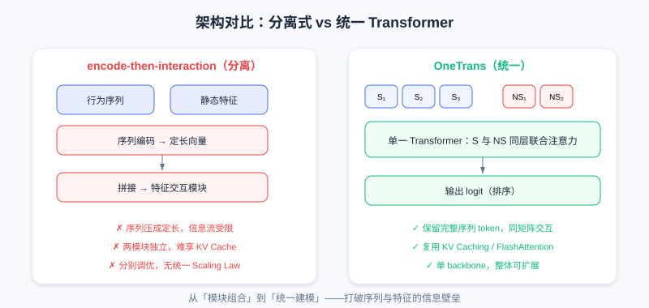
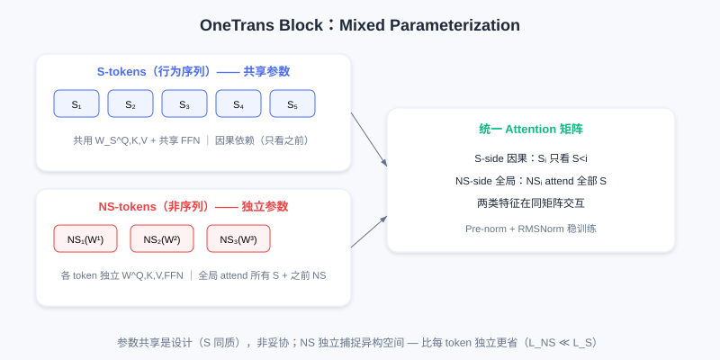
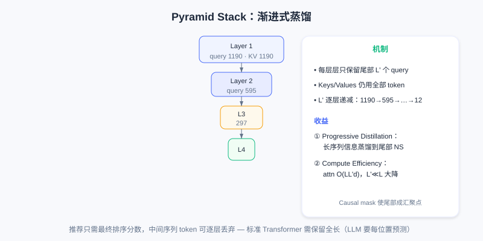
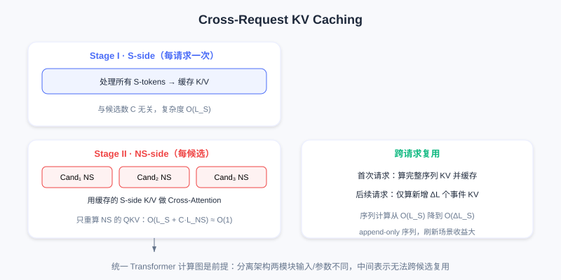

  📖
  ⏱️ ~50 min read
  🎯 Advanced

# OneTrans: Unifying Sequence Modeling and Feature Interaction

> 📝 **Before You Continue:** You have read [7.4 RankMixer](./rankmixer.md) (compute efficiency within the model). This chapter goes further — tearing down the architectural wall between the "sequence modeling module" and the "feature interaction module", doing end-to-end joint optimization with a single Transformer backbone and reusing LLM system optimizations.

RankMixer solved the GPU utilization problem through hardware-aware design, but the overall recommendation system architecture remains fragmented. Mainstream industrial recommenders widely adopt the **encode-then-interaction** paradigm: a sequence modeling module (DIN, LONGER) encodes the behavior sequence into a fixed-length vector, which is then concatenated with non-sequential features and fed into a feature interaction module (such as RankMixer) to learn high-order crossings.

This separated design has two fundamental problems: (1) **restricted information flow** — the sequence must be compressed into a fixed-dimension vector, static features cannot play a role during sequence encoding, and can only be fused in later as a "remedy"; (2) **fragmented execution** — the two modules execute independently and cannot benefit from LLM system optimizations (KV Caching, FlashAttention), and each requires separate tuning, making a unified Scaling Law hard to form.

**OneTrans** proposes a fundamental architectural renovation: **accomplish both sequence modeling and feature interaction with a single Transformer backbone**. A unified tokenizer converts sequential features (S-tokens) and non-sequential features (NS-tokens) into a unified token sequence, jointly modeled in stacked Transformer layers — breaking the information wall between sequences and features, and laying the foundation for applying LLM system optimizations.

---

## 7.5.0 Unified Tokenization

Recommendation inputs contain two very different kinds of features: **sequential features** $\mathcal{S}$ (the user's multiple behavior sequences, such as clicks, add-to-cart, and orders) and **non-sequential features** $\mathcal{NS}$ (static attributes and context, such as age, category, query terms, hour). Traditional methods compress $\mathcal{S}$ into a fixed vector and concatenate it with $\mathcal{NS}$; OneTrans's core innovation is **converting both kinds of features into a unified token sequence, processed in the same Transformer**.

For sequential features $\mathcal{S} = \{\boldsymbol{S}_1, \ldots, \boldsymbol{S}_n\}$ ($n$ behavior types), each sequence $\boldsymbol{S}_i = [\boldsymbol{e}_{i1}, \ldots, \boldsymbol{e}_{iL_i}]$ contains $L_i$ event embeddings (event = item ID + item-side information). Since the raw dimensions of different behavior sequences may differ, a behavior-specific MLP first aligns them to a unified dimension $d$:

$$\tilde{\boldsymbol{S}}_i = [\text{MLP}_i(\boldsymbol{e}_{i1}), \ldots, \text{MLP}_i(\boldsymbol{e}_{iL_i})] \in \mathbb{R}^{L_i \times d}$$

After alignment, the multiple sequences must be merged into a single token sequence. OneTrans supports two fusion strategies: (1) **Timestamp-aware** — if behaviors carry timestamps, interleave all behaviors by time and add behavior-type identifiers; (2) **Timestamp-agnostic** — if there are no timestamps, sort by behavioral intent strength (order > add-to-cart > click), inserting learnable `[SEP]` tokens between different sequences. Experiments show timestamp-aware works better when timestamps exist (temporal ordering encodes interest evolution). Finally:

$$\text{S-tokens} = \text{Merge}(\tilde{\boldsymbol{S}}_1, \ldots, \tilde{\boldsymbol{S}}_n) \in \mathbb{R}^{L_S \times d},\quad L_S = \sum_i L_i + L_{\text{SEP}}$$

For non-sequential features $\mathcal{NS}$ (numerical and categorical features, embedded after bucketization or one-hot), OneTrans concatenates all features, projects them through a single MLP, and then splits into $L_{NS}$ tokens (called the **Auto-Split Tokenizer**):

$$\text{NS-tokens} = \text{Split}(\text{MLP}(\text{Concat}(\mathcal{NS})), L_{NS}) \in \mathbb{R}^{L_{NS} \times d}$$

This avoids the subjectivity of manual feature grouping, letting the model learn how to organize non-sequential features on its own. The final initial input is the concatenation of S-tokens and NS-tokens:

$$\boldsymbol{X}^{(0)} = [\text{S-tokens}; \text{NS-tokens}] \in \mathbb{R}^{(L_S + L_{NS}) \times d}$$

Left: the traditional separated approach (the sequence is encoded into a fixed-length vector then concatenated with static features, restricting information flow); right: OneTrans's unified token sequence, with S-tokens and NS-tokens jointly modeled in the same Transformer.

This differs essentially from traditional methods: **they compress the sequence into a single vector, while OneTrans keeps the full sequence tokens**. In subsequent Transformer layers, each behavior event participates in attention as an independent token, non-sequential features also exist in token form, and the two kinds of features can interact within the same attention matrix.

---

## 7.5.1 The Core Mechanism of Mixed Parameterization

Directly processing the unified token sequence with a standard Transformer runs into a recommendation-specific difficulty: **token heterogeneity**. In an LLM, all tokens are words/sub-words in one semantic space, so sharing Q/K/V and the FFN is reasonable. But in OneTrans, S-tokens come from behavior sequences (strongly homogeneous — all user-item interaction events), while NS-tokens come from entirely different spaces (age is demographic, price is numerical, query is text). Forcing all tokens to share parameters creates conflicts — for example, parameters that capture "similarity of adjacent items in the sequence" may be completely unsuited to the "user age → item category" interaction.

OneTrans's core innovation is **Mixed Parameterization**: **S-tokens share one set of parameters, while each NS-token gets its own token-specific parameters**. This rests on two observations: (1) all events in the behavior sequence live in one semantic space (the item space), so sharing parameters to learn sequential patterns is efficient; (2) non-sequential features come from heterogeneous spaces and need independent parameters to capture their individual characteristics.

### Mixed Causal Attention

The Q/K/V of Multi-Head Attention in an OneTrans Block use mixed parameterization. The query/key/value of the $i$-th token $\boldsymbol{x}_i$:

$$(\boldsymbol{q}_i, \boldsymbol{k}_i, \boldsymbol{v}_i) = (\boldsymbol{W}^Q_i \boldsymbol{x}_i, \boldsymbol{W}^K_i \boldsymbol{x}_i, \boldsymbol{W}^V_i \boldsymbol{x}_i)$$

The weight matrices $\boldsymbol{W}^{\Psi}_i$ follow conditional parameterization:

$$\boldsymbol{W}^{\Psi}_i = \begin{cases}
\boldsymbol{W}^{\Psi}_{\text{S}}, & i \le L_S \quad \text{(S-tokens shared)} \\
\boldsymbol{W}^{\Psi}_{\text{NS}, i}, & i > L_S \quad \text{(NS-tokens independent)}
\end{cases}$$

All S-tokens use the same $\boldsymbol{W}^Q_{\text{S}}, \boldsymbol{W}^K_{\text{S}}, \boldsymbol{W}^V_{\text{S}}$; the $j$-th NS-token has its own $\boldsymbol{W}^Q_{\text{NS},j}$ and so on.

OneTrans adopts a **Causal Attention Mask**, with NS-tokens placed after S-tokens, producing three key information-flow patterns:

1. **S-side causal dependency** — each S-token can only attend to preceding S-tokens. Timestamp-aware naturally models temporal causality; under timestamp-agnostic (sorted by intent), the causal mask lets high-intent behaviors (orders) pass information to low-intent ones (clicks), achieving "strong signals filtering weak signals".
2. **NS-side global attention** — each NS-token can attend to **all** S-tokens (the full behavior history) plus preceding NS-tokens. This lets non-sequential features fully exploit sequential evidence — e.g., the "item category" token can attend to all historical click categories and automatically learn "the user's historical preference for this category".
3. **Support for the Pyramid** — the causal mask's directionality makes information naturally converge toward the tail of the sequence, providing the theoretical basis for the Pyramid Stack.

### Mixed FFN

The FFN likewise uses mixed parameterization:

$$\text{MixedFFN}(\boldsymbol{x}_i) = \boldsymbol{W}^{2}_i \cdot \phi(\boldsymbol{W}^{1}_i \boldsymbol{x}_i + \boldsymbol{b}^1_i) + \boldsymbol{b}^2_i$$

$\boldsymbol{W}^{1}_i, \boldsymbol{W}^{2}_i$ follow the same conditional parameterization as attention: S-tokens share $\boldsymbol{W}^{1}_{\text{S}}, \boldsymbol{W}^{2}_{\text{S}}$, while each NS-token is independent.

A comparison with RankMixer's Per-Token FFN is needed: RankMixer gives **every** token its own FFN (including sequence tokens), with parameters $O(T\cdot d^2)$; OneTrans's Mixed FFN assigns independent parameters only to the $L_{NS}$ NS-tokens while S-tokens share, with parameters $O(L_{NS}\cdot d^2 + d^2)$. In recommendation $L_{NS} \ll L_S$, so OneTrans significantly cuts parameter overhead while preserving expressiveness. **Parameter sharing is not a compromise — it is the design** — the homogeneity of behavior sequences makes shared parameters more efficient at learning sequential patterns and avoids redundancy.

OneTrans uses **Pre-norm + RMSNorm**. S-tokens and NS-tokens differ significantly in numerical range/statistics; Post-norm easily causes attention score scale imbalance and unstable training; Pre-norm normalizes before each sublayer, ensuring token representations entering attention/FFN have similar scales, and RMSNorm further provides more stable gradient propagation through root-mean-square normalization.

S-tokens share Q/K/V/FFN parameters with causal dependency; NS-tokens have independent parameters and can globally attend to all S-tokens. The two feature types interact in the same attention matrix.

---

## 7.5.2 Pyramid Stack: Progressive Distillation

OneTrans's Causal Attention has an important property: **information naturally converges toward the back of the sequence**. Position $i$ at layer $n$ fuses information from $1..i$; position $i+1$ at layer $n+1$ then fuses the updated $1..i+1$. As depth increases, **later tokens gradually become "convergence points" holding all preceding tokens' information**. In particular, NS-tokens sit at the sequence's end, so deep layers accumulate the whole sequence plus preceding NS-tokens' information.

The Pyramid Stack exploits this: **layer by layer, reduce the number of query tokens participating in attention, keeping only the tail of the sequence**. Suppose layer $n$'s input has length $L$; define the tail index set $\mathcal{Q} = \{L-L'+1, \ldots, L\}$ ($L'<L$). The attention computation:

- **Keys and Values**: still computed from all $L$ tokens, preserving full context
- **Queries**: computed only from the $L'$ tokens in $\mathcal{Q}$

The attention output keeps only the positions corresponding to $\mathcal{Q}$, shrinking sequence length from $L$ to $L'$. Across layers, use decreasing $L'$ (e.g., 1190 → 595 → 297 → … → 12), forming a pyramid-style hierarchy.

Each layer's queries take only the tail $L'$ tokens (including NS-tokens); Keys/Values use all tokens; sequence length halves layer by layer, progressively distilling information toward the tail.

Two core benefits:

1. **Progressive Distillation** — long behavior sequences (hundreds or thousands of events) shrink layer by layer, with information gradually "distilled" into a small number of tail tokens. Shallow layers learn local patterns (adjacent item similarity); deep layers learn global patterns on the compressed tokens (long-term interest drift). Finally all sequence information converges into the NS-tokens, providing a compact yet information-rich representation for downstream use.
2. **Compute Efficiency** — standard Transformer attention complexity is $O(L^2 d)$ and FFN $O(Ld^2)$. The Pyramid drops these to $O(LL'd)$ (attention) and $O(L'd^2)$ (FFN). When $L' \ll L$ (e.g., 1190 shrinking to 12 layer by layer), compute and activation memory fall significantly.

The key difference from a standard Transformer: the standard one must maintain the full sequence length at every layer (LLMs need per-position predictions); recommendation only needs the final ranking score, so intermediate sequence tokens can be discarded layer by layer, as long as the tail tokens have fully fused the history. The causal attention's directionality guarantees this.

---

## 7.5.3 Cross-Request KV Caching

A key advantage of the unified architecture is that LLM system optimizations apply seamlessly — most importantly **KV Caching**. A single request usually returns hundreds of candidates, each corresponding to one sample; these samples share **identical user-side features** (same user, same behavior sequence), differing only on the item side. Under traditional encode-then-interaction, the sequence encoding module can be reused, but the feature interaction module must be recomputed for every candidate — the shared structure goes underused.

OneTrans's unified Transformer naturally supports two-stage computation:

**Stage I (S-side, once per request)** — process all S-tokens, computing each layer's K/V and attention output and caching them. This stage **executes once per request**, independent of candidate count.

**Stage II (NS-side, per candidate)** — for each candidate, compute its NS-tokens; at each layer: use the cached S-side K/V, compute the NS-tokens' queries, run Cross-Attention (NS attends to the cached S-side K), run Self-Attention among NS-tokens, and process the NS-tokens through token-specific FFNs.

The key: the S-tokens' KV is shared across all candidates; only the NS-tokens' QKV needs recomputing per candidate. With $C$ candidates per request, the traditional approach needs $O(C\cdot L_S)$ sequence computation; KV Caching drops it to $O(L_S + C\cdot L_{NS})$. Since $L_{NS} \ll L_S$, complexity is approximately $O(1)$ with respect to candidate count $C$.

Going further, OneTrans implements **Cross-Request KV Caching**. User behavior sequences are append-only; each new request appends only a few events at the end compared to the last. The KV cache can be reused across requests:

- **First request** — compute and cache the full sequence's KV
- **Subsequent requests** — compute only the KV of the newly added $\Delta L$ events and concatenate with the old cache

Per-request sequence computation drops from $O(L_S)$ to $O(\Delta L_S)$ ($\Delta L_S$ is usually single-digit). In high-frequency scenarios (feed refreshes) where the user sequence changes little in a short window, Cross-Request KV Caching pays off especially well.

Stage I computes and caches the S-side KV once per request; Stage II computes only the NS-side per candidate; across requests, only the KV of the newly appended $\Delta L$ events is computed, reusing the old cache.

Note that KV Caching's effectiveness depends on the **unified Transformer computation graph**. If sequence modeling and feature interaction are two separate modules, their intermediate representations cannot be reused across candidates (inputs/parameters differ completely). OneTrans, through unified tokenization and Mixed Parameterization, places both feature types in the same attention matrix so the S-tokens' KV can be shared by all candidates' NS-tokens — something encode-then-interaction cannot achieve.

Beyond KV Caching, OneTrans inherits other LLM optimizations: **FlashAttention-2** (kernel fusion + memory tiling to cut attention I/O and activation memory), **Mixed-Precision Training** (BF16/FP16) combined with **Activation Recomputation** (preserving numerical stability while compressing memory). These matter greatly for training and deploying OneTrans with hundreds of millions of parameters.

---

## 7.5.4 The Essence of Unified Modeling

OneTrans's core contribution is a fundamental shift in recommendation architecture: **from composing modules to unified modeling**. Traditional encode-then-interaction splits sequence encoding and feature interaction into separate modules, artificially severing different interaction types (within-sequence, cross-sequence, multi-source features, sequence-feature). OneTrans's unified Transformer lets these interactions happen simultaneously at every layer, with multi-layer stacking forming complex combinatorial patterns.

Another key advantage of the unified architecture is **overall scalability**. A separated architecture requires separately tuning the sequence and interaction modules, making a unified Scaling Law hard to form. OneTrans unifies the whole model into a single Transformer backbone with a simple, clear scaling strategy: add layers (depth), add hidden dimensions (width), add sequence length — recommendation models can gain predictable performance improvements just like LLMs.

From RankMixer to OneTrans, recommendation architecture evolution shows two clear directions: hardware-aware computation design solves GPU utilization, and a unified modeling framework breaks the walls of module fragmentation. Together they lay the foundation for recommendation systems to move toward large-scale, scalable intelligence.

> 💡 **Key Insight:** This chapter closes Part 7 — from HSTU validating the Scaling Law, to GenRank probing the essence, MTGR reconciling features, RankMixer optimizing hardware, and OneTrans unifying the architecture. From the five angles of architecture, training, features, hardware, and unification, the five works jointly prove: recommendation systems are no longer the "exception" to deep learning scaling.

---

## ⚠️ Common Mistakes in 7.5

| # | Mistake | Example | Why It's Wrong | Fix |
|---|---------|---------|---------------|-----|
| 1 | Assuming OneTrans is just RankMixer reskinned | "They're all Transformers, no difference" | OneTrans tears down the sequence/feature module wall and unifies tokens | Distinguish "efficiency within the model" vs "architectural unification" |
| 2 | Letting all tokens share parameters | "A unified sequence just uses a standard Transformer" | S/NS tokens are heterogeneous; shared parameters conflict | Use Mixed Parameterization (S shared / NS independent) |
| 3 | Compressing the sequence into a fixed-length vector | "Pool S-tokens first, then append NS" | Loses per-event interaction, back to encode-then-interaction | Keep the full sequence tokens, interacting in the same attention |
| 4 | Ignoring the Pyramid's causal precondition | "Just truncate queries arbitrarily" | The causal mask is needed to guarantee tail convergence of history | Keep only the tail $L'$ queries, KV uses all |
| 5 | Assuming KV Cache works in a separated architecture too | "DIN+RankMixer can also reuse across candidates" | The two modules' inputs/parameters differ; intermediate representations can't be reused across candidates | A unified computation graph is the prerequisite for Cross-Request KV Cache |

---

## Chapter Summary

### 📌 Key Takeaways

| Concept | Key Points | Why It Matters |
|---------|-----------|----------------|
| Unified Tokenization | S-tokens (sequential) + NS-tokens (non-sequential) in one sequence | Breaks the sequence/feature information wall |
| Mixed Parameterization | S shared parameters / NS independent parameters | Resolves token heterogeneity conflicts |
| Pyramid Stack | Queries shrink to the tail layer by layer, KV uses all | Progressive distillation + compute efficiency |
| Cross-Request KV Cache | S-side KV reused across candidates/requests | Complexity near $O(1)$ (relative to candidates) |
| Essence of unified modeling | Single Transformer backbone, jointly optimized | Overall scalability, forming a unified Scaling Law |

### ❓ FAQ

**Q1: What is the biggest difference between OneTrans and RankMixer?**
> A: RankMixer focuses on compute efficiency within the model (Token Mixing replacing attention, 45% MFU) but still treats sequence and features as separable inputs; OneTrans goes further, unifying sequence events and non-sequential features into a token sequence, jointly modeled inside one Transformer, and reuses LLM system optimizations such as KV Caching.

**Q2: Why do S-tokens share parameters while NS-tokens are independent?**
> A: All events in the behavior sequence live in one "item space" with high homogeneity — shared parameters learn sequential patterns more efficiently and avoid redundancy; non-sequential features come from heterogeneous spaces (demographics/numerical/text) and need independent parameters to capture their characteristics. This is "parameter sharing as design, not compromise".

**Q3: Why can the Pyramid Stack discard intermediate tokens?**
> A: Recommendation only needs the final ranking score — unlike LLMs, it does not need per-position predictions. Causal attention makes information converge toward the tail; keeping the tail $L'$ queries (including NS-tokens) with KV using all tokens cuts compute dramatically without losing historical information.

### 🔗 Connections to Later Chapters

- **7.1 (HSTU)** — M-FALCON first proposed using KV caching to decouple history from candidates; OneTrans's Cross-Request KV Caching extends that idea on a unified architecture.
- **7.4 (RankMixer)** — its hardware efficiency is the base that makes OneTrans's unified architecture scalable; together they point toward "recommendation models as first-class GPU citizens".
- **Part 6 Generative Fundamentals** and **Part 8 End-to-End Generation** push the unified modeling idea across the full "retrieval–ranking–re-ranking" pipeline — continue reading along that line.

---

## Practice Problems

Work through all problems in order — they get progressively harder. Each has a complete solution you can reveal after trying it yourself.

---

**Problem 7.5.1 — Paradigm Identification** 🟢 Easy

Determine whether each description belongs to "encode-then-interaction (separated)" or "OneTrans (unified)":
- (a) DIN encodes the behavior sequence into a fixed-length vector, then concatenates it with static features into the crossing module
- (b) Behavior events and non-sequential features are all tokens, jointly attending at every layer of the same Transformer

💡 Solution (click to reveal)

**Approach:** Grasp "does it keep full sequence tokens, and do both types interact within the same layer".

- (a) **Separated** (encode-then-interaction): the sequence is compressed into a fixed-length vector and concatenated later.
- (b) **OneTrans unified**: both feature types are tokens interacting in the same attention matrix.

**Key points:**
- The core of unified modeling is "no sequence compression, same-layer interaction".
- The restricted information flow of the separated approach is exactly the pain point OneTrans solves.

---

**Problem 7.5.2 — Mixed Parameterization** 🟢 Easy

How does parameter organization differ between S-tokens and NS-tokens in OneTrans? Why this design instead of sharing everything?

💡 Solution (click to reveal)

**Approach:** Map directly to Mixed Parameterization.

- S-tokens (behavior sequence) **share** one set of Q/K/V/FFN parameters (same item space, homogeneous).
- NS-tokens (non-sequential features) each have **independent** parameters (heterogeneous spaces).
- Sharing everything would make heterogeneous tokens' parameters conflict (e.g., "adjacent item similarity" parameters don't fit "age → category").

**Key points:**
- Parameter sharing is design (sequence homogeneity), not compromise.
- Compared with RankMixer's per-token independent FFNs, OneTrans saves parameters because $L_{NS}\ll L_S$.

---

**Problem 7.5.3 — Pyramid Complexity** 🟡 Medium

For a sequence of length $L$, a standard Transformer's attention complexity is $O(L^2 d)$. The Pyramid Stack takes the tail $L'$ as queries per layer (let $L'=L/2$), with KV using all $L$. With 4 stacked layers ($L$ halving from 1190 down to about 12), what fraction of the standard Transformer's total attention compute (same 4 layers, full length throughout) does the Pyramid roughly cost?

💡 Solution (click to reveal)

**Approach:** Each Pyramid layer's attention is $O(LL'd)$; each standard layer is $O(L^2 d)$.

**Estimate (KV fixed at full length $L$):** the Pyramid layers' query lengths are about $L/2, L/4, L/8, L/16$, so the 4-layer total is $\propto L\cdot(L/2+L/4+L/8+L/16) = \frac{15}{16}L^2 \approx 0.94L^2$. Compared with the standard 4 layers' $4L^2$, this is roughly **1/4**.

**In practice even lower:** each layer's KV sequence $L$ also shrinks with depth, so each layer costs $\propto L_{\text{cur}}\cdot L'_{\text{cur}}$, which is smaller than the formula above; the true ratio is slightly below $0.94/4 \approx 0.23$.

**Key points:**
- The point is not the exact multiple but the square-to-linear order drop from "shrinking queries layer by layer".
- At inference you can give the order-of-magnitude conclusion: significantly below the standard Transformer.

---

**Problem 7.5.4 — KV Cache Payoff** 🔴 Hard

A request has $C=500$ candidates, $L_S=1000$ sequence tokens, $L_{NS}=50$. The traditional per-candidate sequence computation is about $O(C\cdot L_S)$; OneTrans with Cross-Candidate KV Caching is about $O(L_S + C\cdot L_{NS})$. By about how many times do the orders of magnitude differ?

💡 Solution (click to reveal)

**Approach:** Substitute and estimate (ignoring the constant $d$).

- Traditional: $C\cdot L_S = 500 \times 1000 = 5\times10^5$.
- OneTrans: $L_S + C\cdot L_{NS} = 1000 + 500\times50 = 1000 + 25000 = 26000$.
- The ratio is $\approx 5\times10^5 / 2.6\times10^4 \approx 19$x.

**Key points:**
- S-side KV is computed once across candidates; complexity is near $O(1)$ relative to $C$.
- Because $L_{NS}\ll L_S$, the payoff grows as candidate count $C$ grows.

---

**🏆 Challenge: A Unified Architecture Blueprint**

Within 150 words, drawing on the five works in Part 7, describe the four characteristics your ideal "scalable recommendation ranking engine" should have (one each from paradigm, features, hardware, and architectural unification).

💡 Hint

The four characteristics: (1) paradigm — user-level autoregressive sequence modeling (the essence of HSTU/GenRank); (2) features — retain cross-feature compatibility (MTGR's hybrid paradigm); (3) hardware — unify into matrix multiplications, 45% MFU (RankMixer hardware-aware); (4) architectural unification — a single Transformer backbone jointly modeling sequence and feature interaction + KV Caching (OneTrans). These correspond exactly to the combined direction of Part 7's five works.

