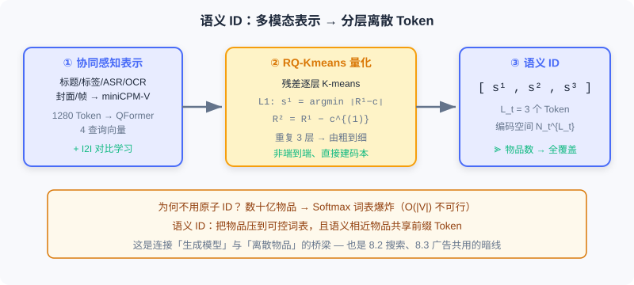
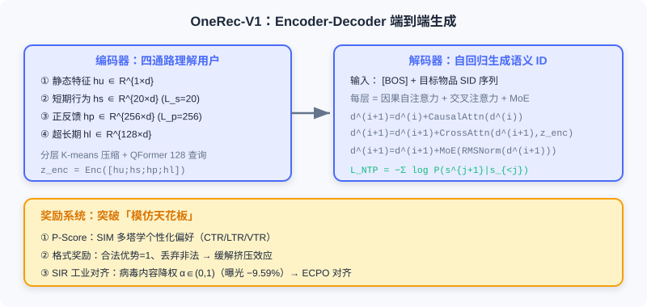

  📖
  ⏱️ ~40 min read
  🎯 Advanced

# End-to-End Generative Recommendation

> 📝 **Before You Continue:** This chapter assumes you understand the two paradigms and the motivation for end-to-end generation from [1.1](./../part1-introduction/recommender-system-basics.md), and are familiar with the introductory concept of **semantic IDs** from [2.3](./../part2-retrieval/two-tower.md). This chapter pushes them to industrial-scale deployment.

The traditional multi-stage cascading architecture (MCA) exposes its sharpest contradictions in recommendation: massive compute is consumed by **communication and storage** rather than model computation, leaving GPU utilization far below that of large language models; each stage has scattered objectives, and divergent model structures cause inconsistent modeling; the cascade further blocks the application of advanced techniques such as **Scaling Laws** and RL alignment.

Kuaishou's **OneRec** framework redefines recommendation as an **end-to-end generative task**: the model directly "generates" a recommendation sequence from user context instead of "selecting" from a candidate pool. This section first examines the deep bottlenecks of the cascading architecture, then walks through the OneRec-V1 system and how V2 breaks through those bottlenecks.

After reading this chapter, you will be able to:

- Explain how **semantic IDs** solve the "Softmax explosion from directly generating atomic IDs" problem
- Describe **OneRec-V1**'s four-pathway encoder and reward system design, along with the two bottlenecks it faces
- Explain why the **Lazy Decoder-Only** cuts decoding computation by 94%
- Recount the validation of **Scaling Laws** on OneRec-V2 and **GBPO**'s improvements over ECPO
- Complete 5 tiered practice problems consolidating semantic IDs, architecture, and alignment algorithms

---

## 8.1.0 Why End-to-End Generative Recommendation

Recommender systems have long run on the "retrieval — pre-ranking — ranking — re-ranking" funnel. But as described in [1.1](./../part1-introduction/recommender-system-basics.md), the cascading architecture has three persistent pain points, especially acute in recommendation:

- **Computation fragmentation** — each stage is deployed and communicates independently, so massive resources go to data transfer rather than useful computation; GPU utilization is far below LLM training.
- **Conflicting optimization objectives** — retrieval optimizes relevance, ranking optimizes CTR, re-ranking optimizes diversity; each fights its own battle, yielding global sub-optimality with errors accumulating layer by layer.
- **Disconnect from the AI frontier** — stage fragmentation makes it hard to directly import techniques validated at scale in the LLM world, such as Scaling Laws and RLHF.

> 💡 **Key Insight:** The essence of the end-to-end generative architecture is not "swap in a bigger model," but **re-converging scattered sub-objectives into one unified sequence-generation loss**, thereby making global optimality possible.

### 🧠 Mental Model: From "Talent-Show Judge" to "Personal Tailor"

> Think of cascaded recommendation as a talent show: thousands of contestants pass a first screen (retrieval), then judges score them one by one (ranking), and finally the director arranges the running order (re-ranking). Every step "shrinks the candidate pool." End-to-end generation is like a tailor who knows your taste — instead of listening to you list candidates, he directly **cuts a garment** (generates a sequence) from your measurements (context). Fewer intermediate steps, less distortion.

---

## 8.1.1 Semantic IDs: Letting the Model "Speak" an Item

The first hard nut generative recommendation must crack is: **how does a model "speak" an item?** Traditional systems identify items with atomic IDs (e.g., video ID ``vid_12345678``), but Kuaishou has billions of items, and directly generating atomic IDs would blow up the Softmax layer's computation.

**OneRec-V1** adopts **semantic IDs**: mapping items into a finite, controllable vocabulary space. Each video is encoded as $L_t=3$ semantic tokens with vocabulary size $N_t$. The total encoding space is $N_t^{L_t}$ — far larger than the actual item count, which both guarantees coverage and uses the larger vocabulary to introduce more parameters for better performance.

Generating semantic IDs happens in two stages:

**Stage one: collaboration-aware multimodal representation learning.** A video's title, tags, ASR, OCR, cover, and sampled frames are compressed by a vision-language model (e.g., miniCPM-V-8B) into 1280 tokens, then compressed by a **QFormer** into 4 learnable query vectors. But relying on content features alone cannot capture collaborative signals, so **item-pair contrastive learning** is introduced to pull together item pairs with high collaborative similarity:

$$\mathcal{L}_{I2I} = -\frac{1}{|\mathcal{B}|} \sum_{(i,j) \in \mathcal{B}} \log \frac{\exp(\text{sim}(\tilde{\boldsymbol{M}}_i, \tilde{\boldsymbol{M}}_j) / \tau)}{\sum_{(i',j') \in \mathcal{B}} \exp(\text{sim}(\tilde{\boldsymbol{M}}_i, \tilde{\boldsymbol{M}}_{j'}) / \tau)}$$

A title-generation auxiliary task is used concurrently to prevent representation collapse and preserve content understanding.

**Stage two: RQ-Kmeans hierarchical quantization.** After obtaining collaboration-aware representations, **residual-quantized K-means (RQ-Kmeans)** discretizes the continuous representations into semantic IDs. Unlike end-to-end-trained RQ-VAE, RQ-Kmeans directly runs K-means on residuals to build codebooks:

$$\mathcal{R}^{(1)} = \{\tilde{\boldsymbol{M}}_i\}, \quad \mathcal{C}^{(l)} = \text{K-means}(\mathcal{R}^{(l)}, N_t)$$

$$s_i^l = \arg\min_k \|\mathcal{R}_i^{(l)} - \boldsymbol{c}_k^{(l)}\|, \quad \mathcal{R}_i^{(l+1)} = \mathcal{R}_i^{(l)} - \boldsymbol{c}_{s_i^l}^{(l)}$$

After 3 quantization layers, each video $m$ gets a coarse-to-fine semantic identifier sequence $\{s_m^1, s_m^2, s_m^3\}$, which becomes the generative model's output target.

> **Analysis:** Semantic IDs are the bridge between the "generative model" and "discrete items." They compress a $O(|\mathcal{V}|)$ mega-vocabulary down to a controllable size, while letting semantically similar items share prefix tokens — which benefits both generation and the subsequent coarse-to-fine hierarchical decoding. The cost is that quantization is lossy, so codebooks need careful design.

---

## 8.1.2 OneRec-V1: Encoder-Decoder and Preference Alignment

With semantic IDs in hand, OneRec-V1 uses the classic **Encoder-Decoder architecture** for end-to-end generation: the encoder processes the user's multi-scale features, and the decoder generates the target item's semantic ID sequence autoregressively given the context.

### Encoder: Four Pathways for Understanding the User

The encoder embodies a deep understanding of user interests at **multiple time scales**, with four pathways:

1. **User static-feature pathway** — basic profile such as ID, age, gender, passed through two dense layers to get $\boldsymbol{h}_u \in \mathbb{R}^{1 \times d_{model}}$.
2. **Short-term behavior pathway** — the most recent $L_s=20$ interactions, including item/author IDs, tags, timestamps, watch duration, and interaction labels, yielding $\boldsymbol{h}_s \in \mathbb{R}^{L_s \times d_{model}}$.
3. **Positive-feedback behavior pathway** — the most recent $L_p=256$ high-engagement interactions, yielding $\boldsymbol{h}_p \in \mathbb{R}^{L_p \times d_{model}}$.
4. **Ultra-long-term history pathway** — a major OneRec-V1 innovation. A user can have up to 100,000 history records; processing them directly would explode compute. First, hierarchical K-means compresses them (with $\lfloor\sqrt[3]{|D|}\rfloor$ clusters selecting representative items), then a QFormer applies cross-attention over the compressed sequence of length 2000 with 128 learnable queries, yielding $\boldsymbol{h}_l \in \mathbb{R}^{128 \times d_{model}}$.

The four pathways' outputs are concatenated and passed through $L_{enc}$ Transformer encoder layers:

$$\boldsymbol{z}^{(i+1)} = \boldsymbol{z}^{(i)} + \text{SelfAttn}(\text{RMSNorm}(\boldsymbol{z}^{(i)})), \quad \boldsymbol{z}^{(i+1)} = \boldsymbol{z}^{(i+1)} + \text{FFN}(\text{RMSNorm}(\boldsymbol{z}^{(i+1)}))$$

The final output $\boldsymbol{z}_{enc} \in \mathbb{R}^{(1+L_s+L_p+128) \times d_{model}}$ provides comprehensive context.

### Decoder: Autoregressive Semantic ID Generation

The decoder's input is ``[BOS]`` plus the target item's semantic ID sequence; each layer contains causal self-attention (capturing dependencies among generated tokens), cross-attention (attending to the encoder's context), and MoE feed-forward (top-k routing to add capacity while keeping efficiency). Training uses the cross-entropy of next-token prediction:

$$\mathcal{L}_{NTP} = -\sum_{j=0}^{L_t-1} \log P(s_m^{j+1} | [s_{[BOS]}, s_m^1, \ldots, s_m^j])$$

### Reward System: Breaking the "Imitation Ceiling"

Pre-training only fits the historical exposure distribution, and exposure data comes from the traditional system — the model is essentially "imitating" the past, with its performance ceiling shackled by the old system. OneRec-V1 introduces reward-system-based RL post-training with three reward components:

**① User preference alignment (P-Score).** A neural network learns personalized preference scores. Built on the SIM architecture, it erects an independent tower for each objective (CTR, LTR, VTR, etc.); each tower trains with binary cross-entropy on its corresponding label as an auxiliary task, then feeds a final MLP that outputs the P-Score:

$$\mathcal{L}_{\text{P-Score}} = \sum_{xtr \in S_o} w^{xtr} \mathcal{L}_{\text{P-Score}}^{xtr}, \quad S_o = \{\text{ctr, lvtr, ltr, vtr}, \ldots\}$$

**② Generation format regularization (format reward).** The semantic ID encoding space is far larger than the item count, so inference may generate **illegal sequences** that map to no real item. Introducing RL sharply worsens this — due to the **Squeezing Effect**: the model squeezes probability mass onto the current best output, pressing some legal tokens' probabilities down to levels close to illegal tokens'. OneRec-V1 sets the advantage to 1 for legal samples and directly discards illegal samples to avoid squeezing.

**③ Industrial-scenario alignment (SIR).** The end-to-end property means you "just need to fold optimization objectives into the reward system." For example, when viral content exceeds a fraction threshold $f$, down-weight the P-Score:

$$r_i' = \begin{cases} r_i & \text{if } o_i \notin I_{\text{viral}} \\ \alpha r_i & \text{if } o_i \in I_{\text{viral}} \end{cases}, \quad \alpha \in (0, 1)$$

Experiments show SIR reduced viral-content exposure by 9.59% with core metrics stable.

### ECPO: The Preference Alignment Algorithm

OneRec-V1 aligns preferences with **ECPO (Early Clipped GRPO)**. For user $u$, the old policy generates $G$ items, each scored by P-Score to get reward $r_i$:

$$\mathcal{J}_{ECPO}(\theta) = \mathbb{E}\left[\frac{1}{G}\sum_{i=1}^G \min\left(\frac{\pi_{\theta}(o_i|u)}{\pi_{\theta_{old}}'(o_i|u)}A_i, \text{clip}\left(\frac{\pi_{\theta}(o_i|u)}{\pi_{\theta_{old}}'(o_i|u)}, 1-\epsilon, 1+\epsilon\right)A_i\right)\right]$$

The advantage is $A_i = (r_i - \text{mean}) / \text{std}$, and the old policy is early-clipped:

$$\pi_{\theta_{old}}'(o_i|u) = \max\left(\frac{\text{sg}(\pi_\theta(o_i|u))}{1+\epsilon+\delta}, \pi_{\theta_{old}}(o_i|u)\right), \quad \delta > 0$$

ECPO's key improvement is **pre-clipping the policy ratio for negative-advantage samples**, avoiding the exploding gradients that arise in GRPO when the ratio for negative advantages grows arbitrarily large.

> **Analysis:** V1 validated the feasibility of end-to-end generative recommendation on Kuaishou's production system. But scaling up the model exposed two bottlenecks: first, the Encoder-Decoder's **imbalanced compute allocation** — the overwhelming majority of compute goes to context encoding, while decoding the target tokens, which actually produce gradients, accounts for a tiny fraction; second, reward-model-based RL suffers from low sampling efficiency and reward-hacking risk. These gave birth to V2.

---

## 8.1.3 OneRec-V2: Lazy Decoder-Only and Scaling Laws

OneRec-V2 breaks through along two dimensions: architecturally, it proposes the **Lazy Decoder-Only** to solve compute efficiency; algorithmically, it introduces RL based on real user feedback to break the reward-model limitation.

### Lazy Decoder-Only Architecture

The design philosophy: **concentrate compute on the target-item tokens that actually contribute gradients to the loss**. It has two core components:

**Context Processor.** All user features are concatenated into a unified context sequence, with each token mapped to dimension:

$$d_{context} = S_{kv} \cdot L_{kv} \cdot G_{kv} \cdot d_{head}$$

where $S_{kv}$ is the key-value separation coefficient ($S_{kv}=1$ shared, $S_{kv}=2$ separated) and $L_{kv}$ is the number of key-value layers. The Context Processor slices along the feature dimension into $L_{kv}$ groups, each generating key-value pairs via RMSNorm. The clever part: **these key-value pairs are invariant for the same context throughout, so they can be shared across decoder layers** — no recomputation per layer. Even with extreme sharing ($L_{kv}=1, S_{kv}=1$), performance doesn't visibly degrade.

**Lazy Decoder Block.** Unlike a traditional Decoder-Only that concatenates all inputs into one long sequence for self-attention, it **does not treat the context as part of the sequence**, but rather as **static conditional information** accessed only via cross-attention. "Lazy" means: the loss is computed only at target-token positions, not as an NTP loss at every position of the whole sequence.

During training, the target item's first two semantic IDs plus ``[BOS]`` form an input sequence of just 3 tokens:

$$\boldsymbol{h}^{(0)} = \text{Embed}([\text{BOS}, s^1, s^2]) \in \mathbb{R}^{3 \times d_{model}}$$

Each layer has three steps: Lazy Cross-Attention (no key-value projection; uses GQA grouped queries to reduce memory), Causal Self-Attention (autoregression among semantic IDs), and FFN (deep layers may swap in MoE).

### Quantifying the Efficiency Gain

Through this design, the Lazy Decoder-Only achieves **nearly 100% of computation concentrated on target tokens**:

| Architecture | Parameters | Computation (GFLOPs) | Converged Loss |
|-------|--------|------------------|----------|
| Encoder-Decoder (1:1) | 1B | 296.36 | 3.28 |
| Lazy Decoder-Only | 1B | 18.89 | 3.27 |

In other words, at comparable performance, computation drops by **94%** and training resources are saved by **90%**.

### Validating the Scaling Law

The Lazy Decoder-Only exhibits excellent scalability. OneRec-V2 scaled from 0.1B to 8B, with the loss $L$ decaying as a power law in parameter count $N$:

$$\hat{L}(N) = E + \frac{A}{N^\alpha}, \quad E=3.13,\; A=3660,\; \alpha=0.489$$

| Model Scale | Parameters | Converged Loss |
|----------|--------|----------|
| Dense | 0.1B | 3.57 |
| Dense | 0.5B | 3.33 |
| Dense | 1B | 3.27 |
| Dense | 2B | 3.23 |
| Dense | 4B | 3.20 |
| Dense | 8B | 3.19 |
| MoE | 4B (0.5B activated) | 3.22 |

With MoE, a sparse model with 4B total parameters but only 0.5B activated per forward pass reaches a converged loss of 3.22, better than the 2B dense model (3.23), at a computational cost comparable to 0.5B dense.

### RL from User Feedback: GBPO

OneRec-V2 uses real feedback collected after large-scale deployment (watch duration being the densest) for RL. Raw duration is biased: long videos naturally accumulate longer watch times. So it proposes **Duration-Aware Reward Shaping**: bucket by logarithm, $\mathcal{F}(d) = \lfloor \log_{\beta}(d+\epsilon) \rfloor$; compute the target video's percentile $q_i$ within its duration bucket; take the top 25% as positive ($A_i=+1$), explicit negative feedback as negative ($A_i=-1$), and filter out the rest ($A_i=0$).

To address the problem that traditional clipping (PPO/GRPO/ECPO) can still produce exploding gradients for samples whose policy ratio equals 1, OneRec-V2 proposes **GBPO (Gradient-Bounded Policy Optimization)**, which bounds the RL gradient using the stable gradient of a BCE loss:

$$\mathcal{J}_{GBPO}(\theta) = -\mathbb{E}\left[\frac{1}{G}\sum_{i=1}^G \frac{\pi_\theta(o_i|u)}{\pi_{\theta_{old}}'(o_i|u)} \cdot A_i\right]$$

$$\pi_{\theta_{old}}'(o_i|u) = \begin{cases} \max(\pi_{\theta_{old}}, \text{sg}(\pi_\theta)), & A_i \ge 0 \\ \max(\pi_{\theta_{old}}, 1 - \text{sg}(\pi_\theta)), & A_i < 0 \end{cases}$$

GBPO has two advantages over traditional clipping: (1) **full sample utilization** — gradients are retained for all samples, encouraging more diverse exploration; (2) **bounded-gradient stabilization** — the RL gradient is bounded by the BCE gradient, improving stability.

The interactive demo below gives you an intuitive feel for OneRec's end-to-end generative pipeline: from user-context encoding, to autoregressive semantic ID generation, to preference alignment and final list output. Click "Next" to observe each step.

<iframe src="../viz/part8-pipeline.html?embed&vizId=part8-pipeline" style="width:100%; height:520px; border:none; display:block;" loading="lazy"></iframe>

Note the "Lazy decoding" step: the input has only 3 tokens (``[BOS]`` + the first two semantic IDs), and the context is accessed as static conditioning through cross-attention — this is exactly how V2 concentrates compute on target tokens and cuts cost by 94%.

---

## ⚠️ Common Mistakes in 8.1

| # | Mistake | Example | Why It's Wrong | Fix |
|---|---------|---------|---------------|-----|
| 1 | Assuming atomic IDs can be generated directly | "Let the model output the video vid directly" | A vocabulary of billions makes Softmax computation explode | Use semantic IDs to compress into a controllable vocabulary |
| 2 | Confusing RQ-Kmeans with RQ-VAE | "They're the same, both end-to-end quantization" | RQ-Kmeans builds codebooks by running K-means directly on residuals, not end-to-end training | Remember V1 uses RQ-Kmeans, EGA uses RQ-VAE |
| 3 | Ignoring the squeezing effect | Illegal sequences increase after RL | Probability mass gets squeezed onto the best output; legal/illegal become indistinguishable | Use the format reward to discard illegal samples |
| 4 | Assuming the V1 architecture is already efficient | "Just scale up the Encoder-Decoder" | Encoding takes the vast majority of compute; target-token decoding is a tiny fraction | V2 switches to Lazy Decoder-Only to concentrate compute |
| 5 | Treating GBPO as ordinary clipping | "ECPO is enough" | Negative samples with policy ratio = 1 can still produce exploding gradients | GBPO bounds the RL gradient with the BCE gradient |

---

## Chapter Summary

### 📌 Key Takeaways

| Concept | Key Points | Why It Matters |
|---------|-----------|----------------|
| Semantic ID | $L_t=3$ tokens, $N_t^{L_t}$ encoding space, RQ-Kmeans quantization | Makes generative recommendation mathematically feasible; semantically similar items share prefixes |
| OneRec-V1 | Four-pathway encoding + Enc-Dec + P-Score/ECPO/SIR | First industrial-scale validation of end-to-end generative recommendation |
| Lazy Decoder-Only | Context as static conditioning + loss only on target tokens | Computation down 94%, unleashing Scaling Law potential |
| Scaling Law | $\hat L(N)=E+A/N^\alpha$ | Recommender models show predictable scaling gains for the first time |
| GBPO | BCE gradient bounds the RL gradient | Breaks the reward-model ceiling, stably exploiting real feedback |

### ❓ FAQ

**Q1: How do the semantic IDs here differ from those in [2.3](./../part2-retrieval/two-tower.md)?**
> A: The idea is the same (discretizing items into hierarchical tokens), but this chapter uses **RQ-Kmeans** to build codebooks by clustering directly on residuals, rather than an end-to-end-trained RQ-VAE; moreover, it explicitly incorporates collaborative contrastive learning, so the semantic IDs encode both content semantics and behavior patterns.

**Q2: Why doesn't V2 just remove the encoder?**
> A: It's not removed — the encoding result is pre-processed into "static key-value pairs" (the Context Processor) shared across decoder layers. This avoids V1's waste of re-encoding the same context in every layer, while retaining the context's full information.

**Q3: What makes real user feedback better than a reward model?**
> A: The reward model is trained on old MCA data, so its performance ceiling is shackled by the old system; real exposure/duration/negative feedback is "ground truth," which GBPO leverages to break through the ceiling — with no separate reward model to maintain.

### 🔗 Connections to Later Chapters

- **8.2** (end-to-end generative search) transfers the same semantic ID + Enc-Dec approach to the cross-modal matching of "text query → products."
- **8.3** (end-to-end generative advertising) additionally embeds auction mechanisms and economic constraints into generation.
- **6.1–6.4** (foundations of the generative recommendation paradigm) revisit the lower-level principles of semantic IDs and RQ-VAE; this section is their industrial realization.
- **9.1–9.3** (generative thinking/reasoning) further discuss how models explicitly reason about user intent, complementing OneRec's preference-alignment techniques.

---

## Practice Problems

Work through all problems in order — they get progressively harder. Each has a complete solution you can reveal after trying it yourself.

---

**Problem 8.1.1 — Semantic ID Encoding Space** 🟢 Easy

A system has vocabulary size $N_t=4096$, and each item is encoded as $L_t=3$ semantic tokens. Questions: (a) How large is the total encoding space? (b) If the actual item count is 100 million, how many times larger is the encoding space than the item count? (c) Why is "encoding space far larger than item count" a good thing?

💡 Solution (click to reveal)

**Approach:** The encoding space is the per-layer vocabulary size raised to the $L_t$-th power.

- (a) $N_t^{L_t} = 4096^3 = (2^{12})^3 = 2^{36} \approx 6.87 \times 10^{10}$ (about 68.7 billion).
- (b) $6.87\times 10^{10} / 10^8 \approx 687$ times.
- (c) Being far larger than the item count guarantees every item can be uniquely covered (no collisions from an insufficient codebook), while the larger vocabulary introduces more learnable parameters and boosts model capacity.

**Key points:**
- Semantic IDs trade "small vocabulary + multiple layers" for "large coverage, controllable computation."
- Encoding space > item count is deliberate design, not waste.

---

**Problem 8.1.2 — RQ-Kmeans Residual Quantization** 🟢 Easy

A one-dimensional representation $\tilde{M}=7.0$, layer-1 codebook centers $\{0, 4, 8\}$, layer-2 codebook centers $\{-2, 0, 2\}$ (on the residual). Find the two-layer semantic ID $(s^1, s^2)$ and the final reconstruction value.

💡 Solution (click to reveal)

**Approach:** At each layer pick the nearest center; the residual passes to the next layer.

- Layer 1: $|7-0|=7,\;|7-4|=3,\;|7-8|=1$ → nearest is 8, so $s^1=8$ and residual $\mathcal{R}^{(2)}=7-8=-1$.
- Layer 2 (on residual $-1$): $|-1-(-2)|=1,\;|-1-0|=1,\;|-1-2|=3$ → nearest is $-2$ or $0$ (a tie). Take $s^2=-2$.
- Reconstruction value $= 8 + (-2) = 6$ (a quantization error of 1 versus the original 7).

**Key points:**
- Each layer quantizes "the residual the previous layer failed to express," refining step by step.
- More layers and larger codebooks mean more precise reconstruction.

---

**Problem 8.1.3 — The Compute Accounting of the Lazy Architecture** 🟡 Medium

Encoder-Decoder (1:1) costs 296.36 GFLOPs with converged loss 3.28; Lazy Decoder-Only costs 18.89 GFLOPs with loss 3.27. If the training budget is fixed at $B$ GFLOPs, and the "effective gradient" per unit of compute is proportional to the target-token fraction, estimate how many times more samples the Lazy architecture can train under the same budget compared to the old architecture.

💡 Solution (click to reveal)

**Approach:** Assume the two produce similar effective gradients per unit of computation (the losses are nearly identical, indicating comparable learning efficiency per FLOP); then the number of samples processable under a fixed budget is inversely proportional to per-sample computation.

$$\frac{\text{samples}_{\text{Lazy}}}{\text{samples}_{\text{Enc-Dec}}} = \frac{296.36}{18.89} \approx 15.7$$

That is, under the same compute budget, the Lazy architecture can train roughly **15.7×** more samples (consistent with the text's "training resources saved 90%": $1 - 18.89/296.36 \approx 93.6\%$).

**Key points:**
- Key insight: the old architecture spends massive compute "encoding context" rather than "decoding targets," and that compute produces no gradients for the recommendation objective.
- Lazy moves compute to where it matters, improving budget utilization nearly linearly.

---

**Problem 8.1.4 — Squeezing Effect and the Format Reward** 🔴 Hard

Suppose an item's semantic ID has legal tokens $\{A, B\}$ at layer 3 (mapping to real items) and an illegal token $\{X\}$ (mapping to no item). After pre-training, $P(A)=0.45, P(B)=0.45, P(X)=0.10$. After applying RL on a negative-advantage item, the model squeezes probability mass onto the current best output $o^*=A$, making $P(A)=0.80, P(B)=0.15, P(X)=0.05$. What happens if no format reward is used? How does the format reward (legal advantage = 1, illegal discarded) mitigate this?

💡 Solution (click to reveal)

**Approach:** Analyze how the relative relationship between legal and illegal probabilities shifts.

- Without the format reward: $P(B)$ drops from 0.45 to 0.15, already approaching the magnitude of the illegal $P(X)=0.05$. The model finds it increasingly hard to distinguish "legal but currently suboptimal B" from "illegal X" — this is exactly the squeezing effect: legal tokens' probabilities get pressed down near illegal ones, and decoding may output illegal sequences.
- The format reward's approach: set advantage 1 for legal samples and directly discard illegal samples (they never enter the gradient). This effectively imposes a strong prior on the model — "optimize only among legal tokens" — leaving the choice between $A$ and $B$ to preference alignment while excluding illegal options like $X$ from the optimization path entirely, preventing their probabilities from being "squeezed" to a level indistinguishable from legal ones.

**Key points:**
- The danger of the squeezing effect is that "the legal space gets compressed until it's indistinguishable from the illegal," not mere sub-optimality.
- Format reward = a hard legality constraint + delegating ranking within the legal set to the preference reward.

---

**🏆 Challenge: Arguing the Case for End-to-End Generative Recommendation**

A short-video platform has 100 million daily active users and a typical "retrieval → ranking → re-ranking" cascade. Write roughly 180 words arguing: when introducing a OneRec-style end-to-end generative architecture, which stage should be piloted first? Which engineering problems must be solved first (refer to V1's two bottlenecks and V2's solutions)?

💡 Hint

Pilot generation first in "candidate generation/retrieval" or "re-ranking diversity," where risk is controllable. Engineering-wise, you must first solve: (1) building and maintaining semantic IDs (periodically re-running RQ-Kmeans); (2) compute allocation — going straight to Enc-Dec causes imbalance, so borrow V2's Lazy Decoder-Only to concentrate computation on target tokens; (3) aligning with online multi-objectives requires preference rewards (P-Score/SIR) plus a format reward against illegal sequences; (4) use real user feedback (GBPO) to break the reward-model ceiling.

