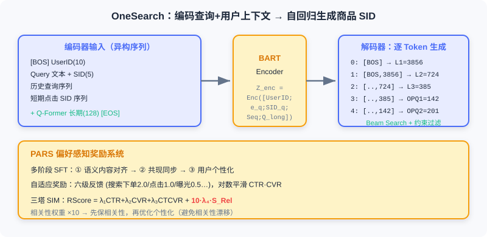

<div class="badge-row">
  <span style="background: #f0f4ff; color: #4A6CF7; padding: 4px 12px; border-radius: 20px; font-size: 0.85em; font-weight: 600; border: 1px solid rgba(74,108,247,0.2);">📖</span>
  <span style="background: #fef9ec; color: #d97706; padding: 4px 12px; border-radius: 20px; font-size: 0.85em; border: 1px solid rgba(100,100,100,0.15);">⏱️ ~45 min read</span>
  <span style="background: #fef9ec; color: #d97706; padding: 4px 12px; border-radius: 20px; font-size: 0.85em; border: 1px solid rgba(100,100,100,0.15);">🎯 Intermediate-Advanced</span>
</div>

# End-to-End Generative Search

> 📝 **Before You Continue:** Read [8.1](./e2e-recommendation.md) first for semantic IDs and the Encoder-Decoder approach — this section transfers the same generative philosophy to the cross-modal matching of "text query → product results," but under sharper business constraints.

OneRec in [8.1](./e2e-recommendation.md) takes item IDs from a **closed vocabulary** as both input and output. E-commerce search is fundamentally different: users express intent with **explicit text queries**, and the system must return precise matches from a massive product catalog under hard relevance constraints. This "text query → product results" setting mixes an **open vocabulary** (arbitrary queries) with a **closed vocabulary** (a finite product catalog), plus multi-level tasks spanning query understanding, semantic matching, and personalized ranking.

Traditional e-commerce search is likewise an MCA: query understanding (correction/rewriting/intent) → retrieval (inverted index + vectors) → pre-ranking → fine-ranking. It suffers from three problems: query and product retrieval are decoupled, cold-start long-tail products, and keyword-stuffed title noise. **OneSug** and **OneSearch** propose end-to-end generative solutions for the front half (query completion) and back half (product retrieval) of the search pipeline respectively. They share a unified architectural philosophy but make different trade-offs in input/output spaces and ID design.

After reading this chapter, you will be able to:

- Explain how **OneSug** reformulates query completion as conditional text generation and uses the PRE module to augment short prefixes
- Describe how the **RWR strategy** injects business value into ranking via six-level interaction feedback
- Explain how **OneSearch**'s KHQE balances semantic hierarchy against product uniqueness with "3 RQ layers + 2 OPQ layers"
- Recount **Mu-Seq**'s three-perspective user modeling and **PARS**'s preference-aware rewards
- Complete 5 tiered practice problems consolidating prefix augmentation, semantic ID encoding, and constrained decoding

---

## 8.2.0 Three Unique Challenges of E-commerce Search

Compared with video recommendation, e-commerce product retrieval faces more complex constraints:

1. **Strong relevance is the first priority.** Recommendation can suggest items in a different category that match your style history; search cannot compromise — if a user searches "red dress," returning a "blue dress" is a severe relevance violation even if she often buys blue. The system must **satisfy relevance first, then optimize personalization**.
2. **Product information is full of noise and redundancy.** Merchants stuff titles with keywords ("2024 New Korean-Style Slimming Long-Sleeve Dress Women Students Petite Sweet Temperament Skirt Versatile"), and traditional text encoders get drowned in the redundancy, unable to identify core attributes.
3. **Balancing semantic hierarchy and product uniqueness.** The system must understand the category hierarchy (Clothing → Women's → Dresses → Korean-style dresses) for coarse-grained matching while preserving each product's distinctive attributes (style/brand/price) — otherwise all "Korean-style dresses" get mapped to the same representation.

> 💡 **Key Insight:** The end-to-end difficulty of search is essentially a tightrope walk between "generation" and "hard constraints" — generation offers high freedom, but relevance is a bottom line that cannot be crossed. This is exactly why OneSearch amplifies the relevance weight 10× in its reward system.

---

## 8.2.1 OneSug: Generative Query Completion

Query completion is the first gate of search: a user types the prefix "red dr", and the system must generate complete query candidates in real time ("red dress", "red hoodie"). The traditional MCA uses a prefix tree (Trie) to coarsely retrieve from $10^8$ candidates down to $10^4$, then pre-ranks to $10^2$ and fine-ranks 16 for display. It suffers from two problems: upstream performance bottlenecks cap downstream ceilings, and stage objectives conflict with each other.

OneSug reformulates query completion as an **end-to-end conditional text generation task**:

$$P(\text{Query} | \text{Prefix}, \text{UserContext})$$

bypassing the traditional multi-stage pipeline. Its core challenges: semantic ambiguity of short prefixes ("appl" may mean fruit or phone), balancing personalization against popularity, fine-grained modeling of multi-level feedback, and a 100ms real-time constraint.

### Encoder: Prefix Augmentation and Multi-Source Features

**Prefix-query semantic alignment.** For the raw text prefix $p$, a pre-trained Text Encoder (BGE) extracts $\boldsymbol{e}_p \in \mathbb{R}^{768}$. But generic NLP models are biased in the e-commerce semantic space, so OneSug domain-aligns BGE with fine-tuning: mine high-quality prefix-query and query-query co-occurrence pairs from logs, and use contrastive learning to pull collaboratively related queries together:

$$\mathcal{L}_{\text{align}} = -\log \frac{\exp(\text{sim}(\boldsymbol{e}_{q_i}, \boldsymbol{e}_{q_j}) / \tau)}{\sum_{q_k \in \mathcal{B}} \exp(\text{sim}(\boldsymbol{e}_{q_i}, \boldsymbol{e}_{q_k}) / \tau)}$$

After alignment, BGE's semantic relevance on the query retrieval task rose from 0.67 to 0.81.

**Prefix representation enhancement (the PRE module).** A short prefix yields an insufficient representation, so PRE retrieves from historical logs a set of high-quality queries $\{\bar{q}_1^c, \ldots, q_k^c\}$ co-occurring with it, and fuses the mean embedding with a weighted blend:

$$\bar{\boldsymbol{e}_q^c} = \frac{1}{k} \sum_{i=1}^{k} \boldsymbol{e}_{q_i}^c, \quad \boldsymbol{e}_p^* = (1 - w) \cdot \boldsymbol{e}_p + w \cdot \bar{\boldsymbol{e}_q^c}, \quad w = 0.5$$

Ablation shows that at $w=0.5$, MRR improves 2.3% over no augmentation, but $w>0.7$ introduces noise and degrades performance. For efficient retrieval, OneSug uses **RQ-VAE** to encode queries as hierarchical discrete codes (4 layers, codebook size 512 each); at inference it matches hierarchically from coarse to fine, reducing complexity from vector retrieval's $O(N\cdot d)$ ($N$ being the full candidate count) to per-layer codebook lookup's $O(C\cdot W)$ — independent of the candidate scale $N$, growing only linearly with the number of layers $C$ and the codebook size $W$.

**User features.** OneSug integrates short-term historical queries $\mathcal{H}_u$ (the most recent $n=10$; more introduces noise and drops MRR by 1.2%) and static profile $\mathcal{U}$. Note that OneSug **does not include product interaction features** — query completion happens at the input stage, before any product exposure. The encoder input is constructed as:

$$x_u = \{t_{\text{[CLS]}}, \boldsymbol{e}_p^*, t_{\text{[SEP]}}, \mathcal{H}_p, t_{\text{[SEP]}}, \mathcal{H}_u, t_{\text{[SEP]}}, \mathcal{U}\}$$


### Decoder and the RWR Ranking Strategy

The decoder is a standard Causal Transformer that autoregressively generates subwords, trained by minimizing the NTP loss. Inference uses **Beam Search** (beam width $K=32$) with length normalization to avoid favoring short queries:

$$\text{Score}(q) = \frac{1}{|q|^\alpha} \sum_{t=1}^{|q|} \log P(q_t | q_{<t}, \boldsymbol{Z}_{enc}), \quad \alpha \in [0.6, 0.8]$$

A generation model trained with NTP alone cannot distinguish candidates' business value. **RWR (Reward-Weighted Ranking)** converts six-level interaction feedback into fine-grained preference signals:

| Level | Feedback Type | Business Meaning | Base Weight $\lambda$ |
|------|----------|----------|------------------|
| Level 1 | Order | Purchase completed through this query | 2.0 |
| Level 2 | Item Click | Clicked a product returned by this query | 1.5 |
| Level 3 | Click | Clicked this query | 1.0 |
| Level 4 | Show | Displayed but not clicked | 0.5 |
| Level 5 | Not Show | In the retrieval pool but not displayed | 0.2 |
| Level 6 | Rand | Random negative sample | 0.0 |

For each <prefix, query> pair, the reward is $r(x_u, q) = \lambda \cdot e^{pi}$ (where $pi$ is the query's normalized frequency at the corresponding level), so high-frequency interaction queries receive higher rewards. From the 6 levels, 9 preference-pair types are constructed, with preference gap $rw_{\Delta} = 1.0 / (r(x_u, q_w) - r(x_u, q_l))$. Finally, reward weighting and a margin $\delta$ are introduced into the DPO loss:

$$\mathcal{L}_{\text{pair-wise}} = -\mathbb{E} \left[ \log \sigma \left( rw_{\Delta} \cdot \max(0, \hat{r}_\theta(x_u, q_w) - \hat{r}_\theta(x_u, q_l) - \delta) \right) + \alpha \log \pi_\theta(q_w | x_u) \right]$$

> **Analysis:** OneSug turns query completion from an MCA into end-to-end generation. PRE resolves short-prefix ambiguity, and the reward system built from six feedback levels precisely models preference gaps. The unified framework not only simplifies the architecture but also enables global optimization and avoids upstream bottlenecks. The cost is the extra inference overhead of Beam Search and RWR alignment, which must stay within 100ms.

---

## 8.2.2 OneSearch: Generative Product Retrieval

After a user hits enter on "red dress," the system must find the most relevant results among hundreds of millions of products within a second. OneSearch unifies "query → retrieval → pre-ranking → fine-ranking" into end-to-end sequence generation:

$$P(\text{product sequence} | \text{query}, \text{user context})$$

That is, it directly takes the query text and user behavior features as input and outputs an ordered product list. It designs four core modules: **KHQE** (Keyword-augmented Hierarchical Quantized Encoding), **Mu-Seq** (multi-perspective behavior sequence injection), a **unified Encoder-Decoder generative architecture**, and **PARS** (preference-aware reward system).

### KHQE: Keyword-Augmented Hierarchical Quantized Encoding

**The core question: how do you represent hundreds of millions of products in a generative framework?** Atomic IDs have two fatal flaws: a vocabulary of $O(|\mathcal{V}|)$ makes Softmax infeasible; and atomic IDs are random numbers carrying no semantics.

OneSearch uses **hierarchical semantic IDs**: each product maps to a multi-layer discrete code sequence $[L1, L2, L3, OPQ1, OPQ2]$. For example, a Korean-style dress might encode as $[3856, 724, 385, 142, 201]$, with a vocabulary of about 6000 unique tokens — far smaller than hundreds of millions. The first 3 layers preserve semantic hierarchy; the last 2 preserve product uniqueness.

**Product representation learning.** Text, structured attributes, and statistical features pass through a distilled BGE to get initial embeddings $\boldsymbol{e}_i$, then multiple alignment tasks jointly capture semantics and collaboration: query-query / item-item contrastive, query-item contrastive, hierarchical feedback alignment (different margins assigned to exposure/click/order), and hard-sample relevance correction (an LLM scores boundary samples).

**Core keyword augmentation.** Marketing words in titles ("hot seller", "free shipping") dilute core attributes. OneSearch uses NER to build an 18-class attribute vocabulary and matches core words in titles quickly with an **Aho-Corasick automaton** ($O(n)$ multi-pattern matching), enhancing with 50%-50% weighting:

$$\boldsymbol{e}^o_i = \frac{1}{2} \left( \boldsymbol{e}_i + \frac{1}{n} \sum_{j=1}^{n} \boldsymbol{e}_{k_j} \right)$$


**RQ-Kmeans semantic hierarchy encoding.** Each layer extracts semantics and passes the residual to the next: L1 (codebook 4096) captures the coarsest categories (clothing/electronics/food), L2 (1024) captures subcategories (women's/men's), L3 (512) captures fine granularity (dresses/T-shirts). A key optimization: **balanced K-means is applied only at L3** — forcing balance at earlier layers collapses the hierarchy and destroys semantic discrimination.

**OPQ product-uniqueness encoding.** After 3 RQ layers, the residual still holds unique attributes (style/brand/price). With only the first 3 layers, two "Korean-style dresses" (one Zara at 299 yuan, one unbranded at 99 yuan) would be treated as identical. So **OPQ (Optimized Product Quantization)** is introduced, splitting the residual into $M=2$ sub-vectors each quantized by K-means (codebook 256):

$$\text{SID}_i = [\text{L1}, \text{L2}, \text{L3}, \text{OPQ1}, \text{OPQ2}]$$

> Why not use OPQ for all layers? Experiments showed it destroys hierarchical semantics and sharply degrades performance — losing the "coarse-to-fine" progressive generation pattern.

### Mu-Seq: Multi-Perspective Behavior Sequence Injection

**Behavior-sequence-driven user ID.** Instead of a random hash ID, the User ID is constructed from behavior sequences: short-term clicks $\{s_1,\ldots,s_m\}$ and long-term clicks $\{l_1,\ldots,l_n\}$ are each weighted-summed (weights $\lambda_i \propto \exp(\sqrt{i})$ — more recent clicks weigh more, but not aggressively), rounded up, and concatenated (total length 10). Benefits: users with similar interests get similar IDs; cold-start users can use the platform's "query → top clicks" as a default sequence.

**Explicit short-term sequence injection.** Recent historical queries and clicked products are placed explicitly in the input: queries as raw text (short, tokenized directly), products as semantic IDs (titles are long; semantic IDs are more compact); with length limits (queries $n\le 10$, clicks $m\le 20$).

**Sliding-window data augmentation.** A full sequence $[i1..i5]$ traditionally yields 1 sample; OneSearch uses a maximum window $m=5$ to generate several, letting the model learn interest evolution and naturally handle cold start.

**Q-Former long-term sequence compression.** Active users may have thousands to tens of thousands of long-term behaviors. These are aggregated by behavior type (click/order/RSU) into $3\times 3=9$ vectors, then $N_q=128$ learnable query vectors extract a fixed-length representation $\boldsymbol{Q}_{\text{long}} \in \mathbb{R}^{128\times 768}$ via cross-attention — no significant compute increase no matter how long the history.

### Unified Encoder-Decoder Generative Architecture

OneSearch chooses **BART** (Encoder-Decoder, with a bidirectional encoder and autoregressive decoder, plus good pre-trained weights and industrial acceleration optimizations). The encoder takes a heterogeneous sequence (discrete tokens + continuous vectors) and outputs $\boldsymbol{Z}_{enc} \in \mathbb{R}^{L\times d}$.

The decoder generates the target product's 5-layer semantic ID token by token, taking $[3856,724,385,142,201]$ as an example:

```
Step 0: input [BOS]           → predict L1 = 3856
Step 1: input [BOS, 3856]    → predict L2 = 724
Step 2: input [BOS, 3856, 724] → predict L3 = 385
Step 3: input [BOS, ..., 385] → predict OPQ1 = 142
Step 4: input [BOS, ..., 142] → predict OPQ2 = 201
```

Each step passes through Causal Self-Attention and Cross-Attention, with a Softmax predicting the next token:

$$P(\text{Token}_t | \text{Token}_{<t}, \boldsymbol{Z}_{enc}) = \text{Softmax}(\boldsymbol{W}_{\text{vocab}} \boldsymbol{h}_t^{\text{dec}})$$

The training objective maximizes the log-likelihood of the ground-truth SID, $\mathcal{L}_{\text{NTP}} = -\sum_{t=1}^5 \log P(\text{Token}_t^{\text{true}} | \cdot)$. Inference uses **Beam Search**, either constrained (forcing each layer's token to come from the valid SID pool, guaranteeing a real product) or unconstrained.



### PARS: Preference-Aware Reward System

A model trained with NTP alone only learns "which products co-occur with which queries," not "which ones users prefer." PARS comprises **multi-stage supervised fine-tuning** and an **adaptive reward system**.

**Multi-stage SFT.** Stage one: semantic content alignment (text↔SID, text→category). Stage two: co-occurrence synchronization (query↔item collaboration at both text and SID levels). Stage three: user personalization modeling (introducing the full user context).

**Adaptive reward signals.** User interactions fall into 6 levels (search order 2.0 / same-category recommendation order 1.5 / click 1.0 / exposure without click 0.5 / same-category not shown 0.2 / random 0.0). To avoid bias from low exposure of new products, CTR and CVR are computed with logarithmic smoothing, and the reward is the harmonic mean:

$$r(q, i) = 2\lambda \cdot \frac{Ctr \cdot Cvr}{Ctr + Cvr}, \quad rw_\Delta = \frac{1.0}{r(q, i_{\text{pos}}) - r(q, i_{\text{neg}})}$$

**Reward model (three-tower SIM).** The CTR tower / CVR tower / CTCVR tower predict separately, and the composite score is $RScore = \lambda_1\cdot CTR + \lambda_2\cdot CVR + \lambda_3\cdot CTCVR + 10\cdot\lambda_4\cdot S_{Rel}$ — **the offline relevance score $S_{Rel}$ has its weight amplified 10×**, ensuring relevance is satisfied before personalization is optimized.

**Hybrid ranking framework.** Built on the reward model, it performs **List-wise DPO**: sample 512 candidates, train on samples whose ranking changes, and combine DPO with the SFT objective so the model learns preference ordering while preserving generation ability. After launch, real interactions (Levels 1–3 positive, Levels 4–6 negative) feed near-real-time online learning.

> **Analysis:** OneSearch elegantly balances semantic hierarchy and product uniqueness with KHQE's "3+2" semantic IDs; Mu-Seq's three-perspective modeling addresses both relevance and personalization; PARS embeds relevance as a hard constraint (×10) into the reward. The whole pipeline collapses from an MCA's many stages into a single generative model — at the cost of training-data engineering (alignment, sliding windows, multi-stage SFT) and latency control for Beam Search at inference.

---

## ⚠️ Common Mistakes in 8.2

| # | Mistake | Example | Why It's Wrong | Fix |
|---|---------|---------|---------------|-----|
| 1 | Optimizing search like recommendation | "Suggest blue dresses for a red-dress query too" | Search's strong relevance is non-negotiable | Satisfy relevance first, then personalize (reward ×10) |
| 2 | Ignoring prefix semantic ambiguity | OneSug directly encodes a 1-character prefix | Short prefixes carry no clear intent signal | Use the PRE module to retrieve co-occurring queries for augmentation |
| 3 | Using OPQ for all KHQE layers | "OPQ for all 5 layers is finer" | Destroys the coarse→fine semantic hierarchy | First 3 RQ layers keep hierarchy; last 2 OPQ layers keep uniqueness |
| 4 | Forcing balanced K-means at L1/L2 | "Balanced at every layer is more even" | Balance at early layers collapses hierarchical clustering | Apply the balance constraint only at L3 |
| 5 | Confusing SIDs with atomic IDs | "Just use item_123 as the vocabulary" | A vocabulary of hundreds of millions makes Softmax explode | Hierarchical semantic IDs compress to about 6000 tokens |

---

## Chapter Summary

### 📌 Key Takeaways

| Concept | Key Points | Why It Matters |
|---------|-----------|----------------|
| OneSug | Conditional text generation + PRE prefix augmentation + RWR six-level feedback | Query completion goes from MCA to end-to-end generation |
| KHQE | 3 RQ-Kmeans layers (semantics) + 2 OPQ layers (uniqueness) | Compresses hundreds of millions of products into controllable semantic IDs |
| Mu-Seq | Behavior-sequence UserID + explicit short-term + Q-Former long-term compression | Personalization under relevance-first constraints |
| PARS | Multi-stage SFT + adaptive rewards + relevance ×10 | Protect relevance first, then optimize preferences |
| Beam Search | Constrained vs. unconstrained; SID pool filters illegal outputs | Generates real products and controls latency |

### ❓ FAQ

**Q1: Why doesn't OneSug include product interaction features?**
> A: Query completion happens at the input stage, when there is no product exposure behavior yet. Product features would have no data support and would pollute the prefix representation with irrelevant signals. It uses only the prefix, historical queries, and static profile.

**Q2: Why do KHQE's first 3 layers use RQ-Kmeans and the last 2 use OPQ, rather than all RQ?**
> A: The first 3 layers express the progressive category hierarchy "clothing → women's → dresses," a natural fit for RQ's residual passing; the last 2 layers encode unique attributes in the residual, better served by OPQ's independent sub-vector quantization. All OPQ would lose hierarchical semantics.

**Q3: Does PARS's 10× relevance weight hurt personalization?**
> A: It actually protects personalization — it first guarantees "no irrelevant products returned," then optimizes personalization with CTR/CVR within the relevant set. This avoids the "relevance drift" common in recommender systems.

### 🔗 Connections to Later Chapters

- **8.1** (end-to-end generative recommendation) provides the semantic ID and Enc-Dec foundations for this section; OneSug/OneSearch extend them cross-modally.
- **8.3** (end-to-end generative advertising) further stacks auction mechanisms and economic constraints onto generation.
- **2.3** (two-tower) covers vector retrieval, which OneSearch replaces with the "generative retrieval" of semantic IDs + Beam Search.
- **6.x** (generative foundations) covers RQ-VAE quantization, which appears here in two forms: RQ-Kmeans (OneSearch) / RQ-VAE (OneSug).

---

## Practice Problems

Work through all problems in order — they get progressively harder. Each has a complete solution you can reveal after trying it yourself.

---

**Problem 8.2.1 — PRE Augmentation Computation** 🟢 Easy

A prefix embedding is $\boldsymbol{e}_p=(0.2, 0.6)$, and the mean embedding of related queries is $\bar{\boldsymbol{e}}_q^c=(0.4, 0.2)$. With PRE weight $w=0.5$, compute the augmented $\boldsymbol{e}_p^*$. What trend appears if $w=0.9$?

<details>
<summary>💡 Solution (click to reveal)</summary>

**Approach:** Weighted average.

$$\boldsymbol{e}_p^* = (1-0.5)\cdot(0.2,0.6) + 0.5\cdot(0.4,0.2) = 0.5\cdot(0.2,0.6)+0.5\cdot(0.4,0.2)$$
$$= (0.1, 0.3) + (0.2, 0.1) = (0.3, 0.4)$$

If $w=0.9$: $\boldsymbol{e}_p^* = 0.1\cdot(0.2,0.6)+0.9\cdot(0.4,0.2)=(0.02,0.06)+(0.36,0.18)=(0.38,0.24)$ — the prefix's own signal is heavily diluted, over-relying on co-occurring queries. This is exactly why $w>0.7$ introduces noise and degrades performance.

**Key points:**
- $w=0.5$ is the empirically optimal balance point.
- Too large a $w$ makes the prefix "become someone else," losing the user's actual input signal.

</details>

---

**Problem 8.2.2 — KHQE Encoding Space** 🟢 Easy

A product's KHQE SID is $[L1=2341, L2=567, L3=89, OPQ1=142, OPQ2=201]$, with codebook sizes 4096 / 1024 / 512 / 256 / 256 per layer. Questions: (a) About how many unique vocabulary tokens are there in total? (b) How does this encoding embody both "semantic hierarchy" and "product uniqueness"?

<details>
<summary>💡 Solution (click to reveal)</summary>

**Approach:** The number of unique vocabulary tokens is the sum of the per-layer codebook sizes (codes in different layers are numbered independently).

- (a) $4096+1024+512+256+256 = 6144 \approx 6000$ unique tokens.
- (b) The first 3 RQ-Kmeans layers: L1=2341 (clothing), L2=567 (women's - dresses), L3=89 (dress - Korean style) embody the coarse-to-fine category hierarchy; the last 2 OPQ layers encode unique attributes in the residual (style/brand/price), so two identical "Korean-style dresses" can still be distinguished.

**Key points:**
- The total vocabulary is far smaller than hundreds of millions of atomic IDs, making Softmax feasible.
- "Hierarchy + uniqueness" is the core tension that KHQE's design balances.

</details>

---

**Problem 8.2.3 — Constructing a Behavior-Sequence User ID** 🟡 Medium

A user's short-term clicked products have semantic IDs $sid_1=100, sid_2=200, sid_3=300$ (earliest to latest), with weights $\lambda_i \propto \exp(\sqrt{i})$. Compute the normalized weights $\lambda_1,\lambda_2,\lambda_3$ (to 3 decimal places), and explain why $\sqrt{i}$ rather than linear $i$ is used.

<details>
<summary>💡 Solution (click to reveal)</summary>

**Approach:** Compute $\exp(\sqrt{i})$ then normalize.

$\sqrt{1}=1,\; \sqrt{2}\approx1.414,\; \sqrt{3}\approx1.732$
$e^1=2.718,\; e^{1.414}\approx4.113,\; e^{1.732}\approx5.652$
Sum $= 2.718+4.113+5.652 = 12.483$
$\lambda_1=2.718/12.483\approx0.218,\; \lambda_2=4.113/12.483\approx0.329,\; \lambda_3=5.652/12.483\approx0.453$

More recent behaviors get higher weights (0.218 < 0.329 < 0.453). Why $\sqrt{i}$ instead of linear $i$: linear decay (e.g., $\propto i$) would let the most recent behavior dominate explosively and drive early behaviors to nearly zero; $\sqrt{i}$ is "gentle growth" — reflecting recency while retaining earlier behaviors' contribution, avoiding overly aggressive forgetting of long-term interests.

**Key points:**
- Weights reflect recency without being aggressive.
- This is "soft decay" balancing short-term intent against long-term preference.

</details>

---

**Problem 8.2.4 — Illegal-Output Filtering in Constrained Beam Search** 🔴 Hard

OneSearch decodes a 5-layer SID, and constrained search requires each layer's token to come from the valid SID pool (the set of real products). Suppose layer 1 has 4096 candidate tokens in total, of which the valid SID pool covers only 2000; the beam width is $K=32$. Compare "constrained search" versus "unconstrained search" on (a) output legality and (b) per-step candidate count, and explain why constrained search reduces latency.

<details>
<summary>💡 Solution (click to reveal)</summary>

**Approach:** Analyze the search space and post-processing.

- (a) Constrained search: each layer decodes only within the valid pool (2000 at layer 1, narrowing layer by layer), so generated sequences necessarily map to real products — no "hallucinated SIDs." Unconstrained search: allows arbitrary token combinations, may generate illegal SIDs mapping to no real product, and requires post-filtering.
- (b) Per-step candidates: constrained search has at most 2000 candidates at step 1 (smaller in later layers as the tree narrows); unconstrained search has a fixed 4096 per step. The constrained search space is $\le |\mathcal{X}_{\text{valid}}|$, far smaller than $W^5$.
- Latency: constrained search prunes illegal branches early in decoding, instead of generating large numbers of invalid candidates and filtering afterward; combined with a Trie prefix tree (see GPR in 8.3), the search space shrinks from $W^C$ to the number of valid products, significantly cutting per-step computation.

**Key points:**
- Constrained search = turning "legality" into a hard mask at decoding time.
- This is the key engineering trick for deploying generative retrieval.

</details>

---

**🏆 Challenge: Arguing the Case for End-to-End Search**

An e-commerce search MCA often returns blue dresses for the query "red dress" (relevance drift). Write roughly 160 words explaining, when introducing a OneSearch-style end-to-end generative architecture: (1) which stage should be replaced first; (2) which two designs in KHQE and PARS directly mitigate this problem; (3) what new risks to watch for?

<details>
<summary>💡 Hint</summary>

(1) Prioritize replacing "query understanding + retrieval + fine-ranking" with unified Enc-Dec generation, eliminating intent loss between stages. (2) KHQE's hierarchical semantic IDs distinguish "red dress" from "blue dress" as early as L3; PARS amplifies the offline relevance score $S_{Rel}$ weight 10×, forcing relevance to be satisfied first. (3) New risks: Beam Search latency, complex training-data engineering (multi-stage SFT, sliding windows), and difficulty localizing bad cases due to the opacity of generative retrieval.

</details>
