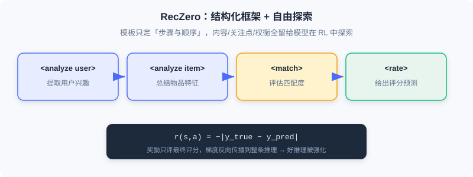
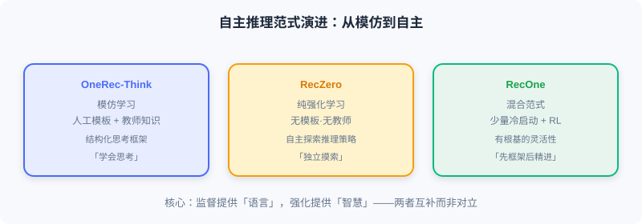

<div class="badge-row">
  <span style="background: #f0f4ff; color: #4A6CF7; padding: 4px 12px; border-radius: 20px; font-size: 0.85em; font-weight: 600; border: 1px solid rgba(74,108,247,0.2);">📖</span>
  <span style="background: #fef9ec; color: #d97706; padding: 4px 12px; border-radius: 20px; font-size: 0.85em; border: 1px solid rgba(100,100,100,0.15);">⏱️ ~38 min read</span>
  <span style="background: #fef2f2; color: #dc2626; padding: 4px 12px; border-radius: 20px; font-size: 0.85em; border: 1px solid rgba(100,100,100,0.15);">🎯 Advanced</span>
</div>

# Exploring Autonomous Reasoning

> 📝 **Before You Continue:** Finish [9.2](./reasoning-framework.md) on OneRec-Think first — its reasoning capability depends heavily on hand-designed scaffolding and templates. The question this chapter asks is: can we **do away with these human designs** and let the model learn to think on its own?

OneRec-Think uses a three-stage framework to make the model "think before recommending," but careful readers will notice: its reasoning capability largely **depends on human design**. Whether it's the predefined prompt templates of the reasoning scaffolding ("analyze user → evaluate candidates → generate recommendation") or the multi-task objectives of item alignment, all were carefully constructed by researchers based on their understanding of the recommendation scenario. It's like handing a student a detailed step-by-step solution template — the student can follow it, but can hardly be said to truly "understand," let alone explore autonomously on entirely new problems.

This dependence creates three deep problems: **limited reasoning paths** (templates constrain the thinking space), **knowledge bottlenecks of the teacher model** (human understanding may be biased or incomplete), and **scalability challenges** (designing a template set per scenario is costly). The root cause is that OneRec-Think is essentially **Imitation Learning** — learning from human-designed reasoning examples. Genuine intelligence should have the capacity for **Exploratory Learning**: autonomously discovering strategies through trial and error guided by a goal and feedback. That is the philosophy of **Reinforcement Learning (RL)**.

After reading this chapter, you will be able to:

- **Explain** why OneRec-Think counts as imitation learning, and the three major limitations of relying on hand-crafted templates
- **Describe** RecZero's pure reinforcement learning scheme: Think-before-Recommendation template + rule-based reward + GRPO
- **Recount** RecZero's emergent capabilities: hierarchical reasoning, negative-signal utilization, cross-domain transfer, and more
- **Compare** the RecOne hybrid paradigm: cold-start SFT (including aligned/misaligned samples) + RL, and how it balances efficiency with performance ceilings
- Work through 4 tiered practice problems and try the "reasoning capability evolution" interactive demo at the end of the chapter

---

## 9.3.0 From Imitation to Autonomy: A Paradigm Shift

**RecZero** marks a significant shift in the reasoning paradigm: **from supervised reasoning dependent on human knowledge, toward autonomous reasoning driven by task objectives**. It poses a bold question: can a model, **without any teacher guidance or reasoning templates**, learn how to think purely by interacting with the recommendation environment?

Imagine dropping an LLM that has never seen a recommendation task into a live environment: the system shows the user's history and item metadata, and the model outputs recommendations; after each recommendation it receives a reward signal (e.g., the gap between the recommendation and the true rating). The reward is the model's only learning signal — it doesn't know what "good reasoning" looks like, nor does any example tell it to analyze the user before evaluating items; it must discover on its own which ways of thinking yield higher rewards.

### 🧠 Mental Model: The Climber and the Safety Framework

> The Think-before-Recommendation template is like a generic framework given to a mountaineer: "first observe the terrain, then choose a route, then assess risks, finally act" — it prescribes the steps and their order, but **how to observe and which route to choose are entirely up to the climber**. RecZero provides enough structure to guide the direction of exploration while leaving enough freedom for the model to discover scenario-specific optimal strategies.

---

## 9.3.1 RecZero: Autonomous Reasoning via Pure Reinforcement Learning

### Think-before-Recommendation Prompt Construction

Although purely RL-driven, RecZero still gives the model a structured thinking space. The prompt consists of four parts:

$$\text{Prompt} = [\text{Instruction}, \mathcal{H}_u, M_i, \text{ReasoningTemplate}]$$

The most crucial is $\text{ReasoningTemplate}$, which defines four structured steps:

$$\langle\text{analyze user}\rangle \ldots \langle/\text{analyze user}\rangle$$
$$\langle\text{analyze item}\rangle \ldots \langle/\text{analyze item}\rangle$$
$$\langle\text{match}\rangle \ldots \langle/\text{match}\rangle$$
$$\langle\text{rate}\rangle \ldots \langle/\text{rate}\rangle$$

These correspond to: extracting user interests from history, summarizing the target item's features, assessing user-item matching, and producing a rating prediction. Note — the template defines only the **existence and order** of the steps; it does not prescribe what to write in each step, which features to attend to, or how to weigh them. All of that is left for the model to explore during RL.

For example, in a book scenario, the model may autonomously discover the "multi-dimensionality of user interests":

```
<analyze user> The user's history includes biographies of Lincoln and Franklin, a preference for political figures' life stories;
               but also Sapiens, a preference for in-depth historical analysis </analyze user>
<analyze item> The Glory and the Dream: a period history of America, balancing portrayals of politicians with narrative of the era </analyze item>
<match> Satisfies both the political-figure and macro-history interests; the depth of writing fits </match>
<rate> 4.5 </rate>
```

This "consider multiple interest dimensions simultaneously" strategy was not human-designed — it gradually solidified after the model found that "multi-dimensional matching yields higher rewards."

### Rule-Based Reward Modeling

RecZero adopts a minimal yet effective reward:

$$r(s, a) = -|y_{\text{true}} - y_{\text{pred}}|$$

where $y_{\text{true}}$ is the true rating and $y_{\text{pred}}$ is the model's prediction in the $\langle\text{rate}\rangle$ step. It looks crude, but the key mechanism is: the reward only evaluates the final rating, while the reasoning path $s$ and the prediction $a$ are **jointly generated**, so gradients backpropagate through the entire reasoning process. If some way of reasoning systematically leads to more accurate predictions, the model reinforces it.

For example, early in exploration, version A reasons "user likes sci-fi → this book is sci-fi → match → 4 points" (true rating 2, reward -2); later, version B carefully analyzes "user prefers hard sci-fi; this book is sci-fi romance at its core, doesn't fit → 2 points" (reward 0). After repeated comparisons, the model learns that "matching coarse labels alone isn't enough; one must analyze fine-grained preferences in depth" — this metacognition emerged entirely from trial and error, with no one telling it.



RecZero implements RL with **GRPO**: for the same sample, sample $K$ rollouts $\{(s_k,a_k)\}$, compute relative advantages $\hat{A}_k = r(s_k,a_k) - \frac{1}{K}\sum_j r(s_j,a_j)$, reinforcing positive advantages and suppressing negative ones. The model need not know the absolutely correct answer; it only needs to recognize which reasonings are relatively better.

### Emergent Capabilities of Pure Reinforcement Learning

After extensive interaction, RecZero exhibits a range of capabilities (not acquired through supervision/imitation, driven purely by reward):

- **Hierarchical reasoning forms automatically**: from the early minimal "user likes history → match → 4 points," training evolves multi-dimensional profiles and multi-factor trade-offs — the coarse-to-fine evolution is driven entirely by reward signals.
- **Utilization of negative signals**: the model learns to explicitly note "the user rated horror titles very low; avoid them" — arising from discovering that ignoring explicit dislikes severely lowers the reward.
- **Context-sensitive reasoning adjustment**: with sparse history (cold start), it falls back to popularity-based conservative predictions; with rich history, it performs deep personalized analysis.
- **Cross-domain transfer of reasoning patterns**: "distinguishing theme from style" learned in books transfers to "distinguishing story theme from cinematographic style" in movies — evidence that it has learned a **general reasoning meta-strategy**.

> **Analysis:** The advantage of pure RL is complete autonomy with no teacher bottleneck; the cost is **inefficient exploration early in training** — discovering effective reasoning patterns from a random state by trial and error is expensive in compute and data. This motivates RecOne's hybrid paradigm.

---

## 9.3.2 RecOne: A Cold-Start-Enhanced Hybrid Paradigm

RecZero proved that pure RL lets a model learn to reason autonomously, but exploring "from scratch" is a long and inefficient slog. RecOne's pragmatic compromise: **use a small number of high-quality reasoning examples to "cold-start" the model, then let RL refine it autonomously** — like "first teaching the basic moves, then letting the student practice and elevate on their own."

### Careful Construction of Cold-Start Samples

RecOne's first stage is **cold-start supervised fine-tuning (Cold-start SFT)**, but it differs fundamentally from traditional distillation: only a few high-quality examples are constructed to initialize the reasoning capability. Two strategies:

- **Aligned samples**: use a pre-trained teacher model to rate user-item pairs; if the prediction happens to match the ground truth, keep the full reasoning path: $\mathcal{D}_{\text{align}} = \{(x, \hat{r} \oplus y) \mid \hat{y} = y\}$.
- **Misaligned samples**: keep samples where the teacher predicted incorrectly, but replace the final $\langle\text{rate}\rangle$ step with the correct rating: $\mathcal{D}_{\text{misalign}} = \{(x, \hat{r}_{\text{rat}} \oplus y) \mid \hat{y} \neq y \land \hat{y}_{\text{rat}} = y\}$. This teaches the model "when the line of thought is right but the last step is wrong, distill the useful information and correct it."

The final cold-start set $\mathcal{D}_{\text{trace}} = \mathcal{D}_{\text{align}} \cup \mathcal{D}_{\text{misalign}}$ is far smaller than traditional distillation (thousands to tens of thousands vs hundreds of thousands), avoiding overfitting the teacher's surface patterns and leaving ample room for RL optimization. The training objective is standard conditional language modeling $\mathcal{L}_{\text{cold-start}}$.

### The Capability Leap from Reinforcement Learning

The second stage is identical to RecZero (GRPO + rating-error reward), but with the cold start in place, the dynamics differ markedly:

- **Exploration efficiency leaps**: starting from a "can reason" state, exploration focuses on refining and optimizing. Training steps needed to reach the same performance drop by roughly **60%**.
- **Performance ceiling broken**: RecOne ultimately surpasses RecZero by a wide margin — on Amazon-book, RMSE drops 6.7% and MAE 16.8%; on Amazon-music, RMSE drops 12.2% and MAE 29.9%. The reason: RL exploration suffers from **local-optimum traps** — starting from a random state, it easily converges early to a "decent" simple matching; the cold start provides a starting point closer to the global optimum.
- **Diversified reasoning patterns**: flexible switching by scenario — fine-grained multi-factor analysis when information is abundant, conservative group-statistics-based reasoning at cold start, exclusion-based reasoning when negative signals are present.

### The Essence of the Hybrid Paradigm

RecOne reveals a deep insight: **supervised learning and reinforcement learning are not opposites but complements**. Supervision provides the "language" (the basic grammatical structure of reasoning); reinforcement provides the "wisdom" (strategy and trade-offs). The human analogy: at school you learn solution steps (supervision); real capability comes from extensive practice and trial and error (reinforcement). The most efficient path is **master the basic framework first, then refine through practice**. In engineering terms, RecOne's total compute is only 40–50% of RecZero's (small cold-start data, fast RL convergence, avoiding wasteful sampling), making it the better industrial choice.



> 💡 **Key Insight:** True intelligence is not memorization but reasoning; not imitation but understanding; not following rules but creating strategies. When recommendation acquires autonomous reasoning, it is no longer a passive filter but an active intelligent assistant — understanding deep needs, weighing multi-dimensional objectives, explaining decisions, and continuously learning from feedback.

The interactive demo below recaps the full evolution from "implicit prediction" to "explicit autonomous reasoning":

<iframe src="../viz/part9-think.html?embed&vizId=part9-think" style="width:100%; height:520px; border:none; display:block;" loading="lazy"></iframe>

Click "Next Step" or "Autoplay" and watch how the recommender model departs from the semantic gap, passes through "knowing the items" (LC-Rec/PLUM), "learning to think" (OneRec-Think), and "exploring on its own" (RecZero), and arrives at "hybrid refinement" (RecOne).

---

## ⚠️ Common Mistakes in 9.3

| # | Mistake | Example | Why It's Wrong | Fix |
|---|---------|---------|---------------|-----|
| 1 | Assuming OneRec-Think is already autonomous reasoning | "OneRec-Think explores reasoning autonomously" | It relies on hand-crafted templates/teacher knowledge — essentially imitation learning | Distinguish: imitation (9.2) vs autonomy (RecZero) |
| 2 | Treating the RecZero template as supervision | "The template prescribes what to write at each step" | The template only fixes step order; content is entirely explored by the model | Template = structural guidance, not content supervision |
| 3 | Ignoring the exploration inefficiency of pure RL | Training a large model from scratch with RecZero directly | Massive wasted exploration early on; high cost | Use RecOne cold start + RL for efficiency |
| 4 | Equating cold start with traditional distillation | "RecOne uses millions of teacher samples" | Only thousands to tens of thousands of high-quality (including misaligned) samples | Small but high-quality, leaving room for RL optimization |

---

## Chapter Summary

### 📌 Key Takeaways

| Concept | Key Points | Why It Matters |
|---------|-----------|----------------|
| Limits of imitation learning | Template constraints / teacher bottleneck / hard to scale | Motivates autonomous reasoning |
| RecZero pure RL | Framework + free exploration, reward r=−\|y−ŷ\|, GRPO | Reasoning evolves autonomously without any human knowledge |
| Emergent capabilities | Hierarchical / negative signals / context sensitivity / cross-domain transfer | Proves RL can learn general reasoning meta-strategies |
| RecOne hybrid | Cold-start SFT (aligned + misaligned) + RL | 60% efficiency gain, outperforms RecZero, 40–50% cost |
| Complementary essence | Supervision gives the "language," reinforcement gives the "wisdom" | Framework first, refinement after — the optimal path |

### ❓ FAQ

**Q1: RecZero has no teacher — how does it know whether reasoning is good?**
> A: It uses only task feedback $r = -|y_{\text{true}} - y_{\text{pred}}|$. The reward evaluates only the final rating, but gradients backpropagate through the whole reasoning — reasoning that is systematically more accurate gets reinforced. No "good reasoning" examples are needed.

**Q2: Why does RecOne (with supervised initialization) actually beat pure-RL RecZero?**
> A: RL exploration has local-optimum traps — from a random state, it easily converges early to simple matching. RecOne's cold start provides a starting point closer to the global optimum, making subsequent exploration more effective, ultimately breaking the performance ceiling with 60% fewer training steps.

**Q3: Why are misaligned samples useful?**
> A: They preserve teacher reasoning that was "right in approach but wrong in the last step," replacing the final rating with the correct value. They teach the model to distill useful information and correct it rather than rejecting the whole line of thought — like a teacher grading homework: "the approach is right, the last step slipped."

### 🔗 Connections to Later Chapters

- **9.1** (semantic alignment) — all these methods are built on the semantic index representation; autonomous reasoning doesn't change the representation, it changes "how the representation is used to make decisions."
- **9.2** (OneRec-Think) — this chapter is its evolution toward "removing hand-crafted templates": imitation → pure autonomy → hybrid.
- **10.x** (diffusion models) — the next chapter switches to a different technical thread — using diffusion's generation/denoising capability for data augmentation and diversity, complementary to the reasoning paradigm.

---

## Practice Problems

Work through all problems in order — they get progressively harder. Each has a complete solution you can reveal after trying it yourself.

---

**Problem 9.3.1 — Paradigm Classification** 🟢 Easy

Determine which paradigm each statement describes (imitation learning / pure reinforcement learning / hybrid paradigm):
- (a) Using predefined prompt templates to guide the model through "user profile → candidate evaluation → recommendation"
- (b) No teacher at all; the model explores reasoning autonomously guided only by rating-error rewards
- (c) First SFT on a few high-quality (including misaligned) samples, then autonomous refinement with GRPO

<details>
<summary>💡 Solution (click to reveal)</summary>

**Approach:** Match against the definitions of the three paradigms.

- (a) Imitation learning (OneRec-Think, hand-crafted templates)
- (b) Pure reinforcement learning (RecZero)
- (c) Hybrid paradigm (RecOne)

**Key points:**
- Imitation = human knowledge; pure RL = autonomous without knowledge; hybrid = framework first, refinement after.

</details>

---

**Problem 9.3.2 — RecZero Reward Computation** 🟢 Easy

A rollout predicts rating $y_{\text{pred}}=4$ while the true rating is $y_{\text{true}}=2$. Compute RecZero's reward $r$, and explain how the gradient affects the reasoning.

<details>
<summary>💡 Solution (click to reveal)</summary>

**Approach:** Apply the rule-based reward formula.

$$r = -|y_{\text{true}} - y_{\text{pred}}| = -|2 - 4| = -2$$

**Gradient effect:** The reward evaluates only the final rating, but the reasoning path and prediction are jointly generated; the negative reward's gradient backpropagates through the whole reasoning, suppressing ways of thinking "that led to overestimation." If another rollout predicts more accurately (higher reward), its reasoning gets reinforced.

**Key points:**
- The closer the reward to 0 (the more accurate the prediction), the better.
- Good/bad reasoning is reinforced/suppressed respectively via relative advantages.

</details>

---

**Problem 9.3.3 — Cold-Start Sample Construction** 🟡 Medium

A teacher model predicts rating 4 for a user-item pair whose true rating is also 4 (aligned sample); for another pair it predicts 5 while the true rating is 3 (misprediction). Write out the form each of these two samples takes in RecOne's cold-start set (using the $\mathcal{D}_{\text{align}}$ / $\mathcal{D}_{\text{misalign}}$ notation, with explanation).

<details>
<summary>💡 Solution (click to reveal)</summary>

**Approach:** Classify by the aligned/misaligned definitions.

- Teacher predicts 4 = true 4 → **aligned sample**: $\mathcal{D}_{\text{align}} = \{(x, \hat{r} \oplus y) \mid \hat{y}=y\}$, keep the full reasoning path (because it led to the correct prediction).
- Teacher predicts 5 ≠ true 3 → **misaligned sample**: $\mathcal{D}_{\text{misalign}} = \{(x, \hat{r}_{\text{rat}} \oplus y) \mid \hat{y}\neq y \land \hat{y}_{\text{rat}}=y\}$, keep the earlier reasoning steps, replacing only $\langle\text{rate}\rangle$ with the correct rating 3.

**Key points:**
- Aligned samples: reasoning → correct answer, kept whole.
- Misaligned samples: wrong answer with a sound approach; fix the last step, teaching the model to distill useful information.

</details>

---

**Problem 9.3.4 — Designing Autonomous Reasoning Training** 🔴 Hard

You are designing RecOne-style training for music recommendation. Write out: ① which two types of samples the cold-start stage uses and their approximate scale; ② which algorithm and reward the RL stage uses; ③ what gains you expect over using RecZero directly, in terms of "training cost" and "final performance." Cite concrete numbers.

<details>
<summary>💡 Solution (click to reveal)</summary>

**Approach:** Apply the RecOne hybrid paradigm.

1. **Cold start**: aligned samples (teacher prediction = truth, keep the full reasoning) + misaligned samples (teacher wrong but the final rating step fixed); scale in the thousands to tens of thousands of high-quality samples (far below the millions of traditional distillation).
2. **RL stage**: GRPO, reward $r = -|y_{\text{true}} - y_{\text{pred}}|$, sampling K rollouts per user and comparing relative advantages.
3. **Gains**: training steps down roughly **60%** (exploration efficiency); final performance surpasses pure RL — see Amazon-music with RMSE down 12.2% and MAE down 29.9%; total compute at only **40–50%** of RecZero's.

**Key points:**
- Cold start provides the "language"; RL provides the "wisdom."
- The hybrid paradigm both avoids pure RL's inefficiency and breaks through its performance ceiling.

</details>

---

**🏆 Challenge: Open-Problem Argument**

This chapter notes that autonomous reasoning is still confined to "single-step decisions" (predicting a rating given history and a target item), while real recommendation is "sequential decision-making" (each recommendation affects subsequent behavior and long-term value must be considered). In no more than 200 words, argue: if RecZero were extended to sequential decision-making, how would its reward function $r=-|y_{\text{true}}-y_{\text{pred}}|$ need to change? Also identify one "reasoning faithfulness" risk.

<details>
<summary>💡 Hint</summary>

Modification: the single-step immediate-error reward must be replaced by a **sequence-level cumulative reward** (e.g., long-term interaction value or total session duration over multiple steps), with a discount factor to balance immediate vs long-term value. Risk: reasoning autonomously formed by RL is the product of black-box optimization and may be "post-hoc rationalization" rather than a true reflection of the decision basis, making faithfulness hard to verify — requiring constraints from evidence such as beam-search consistency or interleaved reasoning. This echoes the faithfulness discussion in 9.2 and the open problem at the end of this chapter.
</details>
