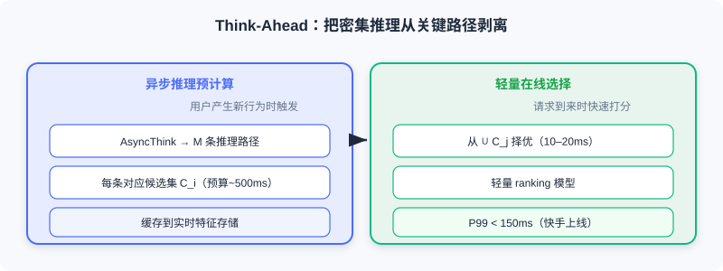

<div class="badge-row">
  <span style="background: #f0f4ff; color: #4A6CF7; padding: 4px 12px; border-radius: 20px; font-size: 0.85em; font-weight: 600; border: 1px solid rgba(74,108,247,0.2);">📖</span>
  <span style="background: #fef9ec; color: #d97706; padding: 4px 12px; border-radius: 20px; font-size: 0.85em; border: 1px solid rgba(100,100,100,0.15);">⏱️ ~36 min read</span>
  <span style="background: #fef2f2; color: #dc2626; padding: 4px 12px; border-radius: 20px; font-size: 0.85em; border: 1px solid rgba(100,100,100,0.15);">🎯 Advanced</span>
</div>

# The Reasoning Framework of OneRec-Think

> 📝 **Before You Continue:** Finish [9.1](./semantic-alignment.md) on semantic alignment first — OneRec-Think's entire reasoning apparatus is built on the premise that "the model already knows the items." It's also worth reviewing [5.3](./../part5-trends/generative-trend.md) on OneRec's end-to-end generation; this chapter is its upgrade from "can generate" to "can think."

When PLUM validated on YouTube that collaborative semantics and language semantics can be unified at industrial scale, the fusion of recommendation with LLMs seemed like a natural next step. But a critical question emerged: although these models generate recommendations efficiently, their reasoning remains an **implicit black box** — when the model recommends a video, we cannot know which historical behaviors it relied on, nor how it weighed content similarity against collaborative signals. More importantly, they cannot perform explicit reasoning through **Chain-of-Thought** the way ChatGPT does — yet that is precisely the core capability behind LLM breakthroughs on complex tasks.

**OneRec-Think** was born to fill this gap. It is not content with the LLM merely "recognizing" items; it wants the LLM to **think before recommending**. In this chapter we dissect how it turns the model from an "implicit predictor" into an "explicit reasoner."

After reading this chapter, you will be able to:

- **Describe** OneRec-Think's three-stage training framework (item alignment → reasoning activation → reasoning enhancement)
- **Explain** how reasoning scaffolding uses progressive tasks to "activate" the model's inductive, deductive, and counterfactual reasoning
- **Recount** how recommendation-specific rewards address the "multi-validity" challenge, and the relative-advantage mechanism of GRPO
- **Explain** how the Think-Ahead architecture strips dense reasoning off the online critical path to meet real-time latency requirements
- Work through 4 tiered practice problems consolidating the reasoning paradigm from alignment to enhancement

---

## 9.2.0 From "Knowing Items" to "Learning to Think"

A traditional model directly outputs item IDs, whereas OneRec-Think first generates a piece of reasoning:

```
The user's watch history centers on international relations and military affairs,
showing a strong interest in military equipment and technological advances...
Therefore, recommend videos focused on China's military technology progress,
especially the debut of the new J-35 fighter jet...
```

Such explicit reasoning improves explainability, but more importantly, **the reasoning process itself provides a structured thinking path for the decision**, letting the model capture multiple layers of user intent more accurately. OneRec-Think unifies **natural language interaction, explicit reasoning generation, and end-to-end recommendation** in a single framework — the user can express needs conversationally, the model generates reasoning grounded in history and context, and finally produces item semantic IDs directly, with no predefined candidate set.

### 🧠 Mental Model: From "Intuitive Judge" to "Annotating Mentor"

> A discriminative model is like a judge scoring by gut feeling — one number and done. OneRec-Think is like a mentor who fills the margins of the exam with annotations — first analyzing the student's (user's) characteristics, then assessing how well each answer (candidate) fits, and finally giving a recommendation with reasons. The annotations (reasoning) are part of the decision itself, not decoration added after the fact.

---

## 9.2.1 The Three-Stage Training Framework

At the core of OneRec-Think is a carefully designed **three-stage training framework**: Itemic Alignment, Reasoning Activation, and Reasoning Enhancement.


### Itemic Alignment: Teaching the Model to "Know" Items

OneRec-Think inherits the semantic ID approach of LC-Rec/OneRec, with optimizations for short video (fragmented content, extremely fast behavior). It adopts **hierarchical representation fusion**: a text tower, visual tower, audio tower, and collaborative tower extract features respectively, then fuse them dynamically via **attention weighting** (the importance of each modality varies greatly across videos — food content leans on visuals, stand-up comedy on audio):

$$\boldsymbol{e}_{\text{content}} = \sum_{m \in \{\text{text, visual, audio, cf}\}} \alpha_m \cdot \boldsymbol{e}_m$$

The key innovation is **Item-Textual Alignment**: given ID prefixes of different lengths, generate descriptions at the corresponding granularity:

```
Input: <item_a_8121>                     → Output: This is a street-food video
Input: <item_a_8121><item_b_3259>        → Output: A food video in a bustling street market, featuring various snack stalls
Input: <item_a_8121><item_b_3259><item_c_6391> → Output: Street market, vendors hawking grilled skewers, fried rice...
```

This level-by-level refinement training **"anchors" the semantic IDs into the LLM's existing language-semantic network** — the neuron activation pattern upon seeing `<item_a_8121>` closely resembles that of seeing "street food," laying the neural foundation for reasoning activation. The alignment objective combines bidirectional tasks:

$$\mathcal{L}_{\text{align}} = \mathcal{L}_{\text{ID2Text}} + \mathcal{L}_{\text{Text2ID}} = -\mathbb{E}_{(i,t)}\left[\log P(t|i;\theta) + \log P(i|t;\theta)\right]$$

### Reasoning Activation: Using Scaffolding to "Activate" Thinking

After alignment, the model "knows" the items but does not yet "think." The human analogy: a student who knows every formula still cannot solve complex problems — that requires learning to decompose the problem, choose formulas, and derive step by step. **Reasoning Scaffolding** plays the role of "mental training," activating progressively across three levels:

**User profile reasoning (induction)** — given a historical interaction sequence, generate a structured interest summary:

```
Primary interests: comedy shorts, film commentary (>60%), and light entertainment; secondary interests: pets, traditional culture, local cuisine
```

The model must identify content themes from discrete IDs, compute proportions, and organize them into a coherent profile — training **inductive reasoning**.

**Candidate evaluation reasoning (deduction)** — given a user profile and a candidate item, generate matching reasoning:

```
The candidate focuses on China's military technology progress (J-35 debut), highly relevant to the user's strong interest in military equipment → highly relevant
```

This trains **deductive reasoning**: building the syllogistic chain of "user interest → item content → matching judgment."

**End-to-end reasoning-based recommendation** — without a candidate set, directly generate recommendation IDs and full reasoning from history. This additionally introduces **counterfactual reasoning** (how to adjust when user needs conflict with history) and **multi-objective trade-offs** (relevance vs emotional needs).


The training objective is a weighted three-level loss $\mathcal{L}_{\text{scaffold}} = \lambda_1 \mathcal{L}_{\text{profile}} + \lambda_2 \mathcal{L}_{\text{eval}} + \lambda_3 \mathcal{L}_{\text{e2e}}$. Its essence is **progressiveness** — like the scaffolding pedagogy in education: provide clear structural support first, then gradually remove it as the model masters each skill, letting it perform independently.

### Reasoning Enhancement: Refining Paths with Reinforcement Learning

Once the model can generate reasoning, a new challenge arises: **how do we judge the quality of reasoning?** A math answer is either right or wrong; but in recommendation, the same user may have dozens of "correct" choices (sci-fi, documentaries, comedy are all valid). This **multi-validity** is the fundamental property that distinguishes recommendation from traditional NLP — naively applying supervised or reinforcement learning would punish the model for recommending items "not in the labels but that the user would love," making it overly conservative.

OneRec-Think uses a **recommendation-specific reward function** that combines four signal dimensions:

$$r(s, a) = \lambda_1 \cdot r_{\text{cf}}(a, \mathcal{H}_u) + \lambda_2 \cdot r_{\text{sem}}(a, p_u) + \lambda_3 \cdot r_{\text{coh}}(s, a) + \lambda_4 \cdot r_{\text{feedback}}(a)$$

- $r_{\text{cf}}$: collaborative similarity between the recommendation and history (positive reward as long as it's near in the collaborative space, even if absent from the labels)
- $r_{\text{sem}}$: semantic match between the recommended content and the user profile
- $r_{\text{coh}}$: coherence between the reasoning text and the final item (judged by an NLI model; disconnection is penalized)
- $r_{\text{feedback}}$: real user feedback (complete watch + like = 1.0, quick swipe-away = -0.5)

Typical weights are $\lambda_1{=}0.3, \lambda_2{=}0.2, \lambda_3{=}0.2, \lambda_4{=}0.3$. Based on this reward, OneRec-Think optimizes with **GRPO**: sample $K$ rollouts $\{(s_k, a_k)\}$ for the same user and compute relative advantages:

$$\hat{A}_k = r(s_k, a_k) - \frac{1}{K}\sum_{j=1}^{K}r(s_j, a_j)$$

$$\mathcal{L}_{\text{GRPO}} = -\frac{1}{K}\sum_{k=1}^{K} \hat{A}_k \cdot \log \pi_\theta(s_k, a_k | \mathcal{H}_u)$$


> 💡 **Key Insight:** The elegance of GRPO is that the model **doesn't need to know what the "absolutely correct" recommendation is — it only needs to learn which reasonings are relatively better**. This suits multi-validity settings particularly well: the model can simultaneously learn multiple effective reasoning patterns instead of converging to a single "standard answer."

Three behaviors emerge after training: **adaptive reasoning depth** (concise in simple scenarios, detailed in complex ones), **emergence of counterfactual reasoning** (recognizing conflicts between needs and history), and **preserved reasoning diversity** (different samples take different angles, yet all lead to sound recommendations).

> **Analysis:** The cost of reasoning enhancement is introducing reward models and the GRPO loop — more engineering complexity; the payoff is reasoning that is more accurate, more diverse, and explainable. It turns "multi-validity" from an obstacle into an advantage — as long as it's relatively better, it gets reinforced.

---

## 9.2.2 Think-Ahead: Moving Reasoning Off the Critical Path

OneRec-Think shows impressive capability, but the deployment challenge is stark: short video demands responses within 100ms, while generating a full reasoning chain (tens to a hundred-plus tokens) followed by ID generation takes hundreds of milliseconds even on high-end GPUs.

The core idea of the **Think-Ahead architecture**: **reasoning can be computed asynchronously when user behavior updates — no need to wait for the request to arrive before thinking.** The flow:

1. **Asynchronous reasoning pre-computation**: when the user generates a new action, a background reasoning engine is triggered to generate $M$ reasoning paths (each corresponding to a candidate set $\mathcal{C}_i$), cached in the real-time feature store. The budget can be relaxed to ~500ms.
2. **Lightweight online selection**: when a request arrives, quickly score and select from the pre-computed candidate sets, done in 10–20ms by a lightweight ranking model (based on real-time context).
3. **Incremental reasoning updates**: when new behavior is consistent with existing paths, only append a brief update; recompute fully only when the profile changes significantly.



> 🧠 Mental Model: Everyday Decision-Making Analogy
> You don't think from scratch every time you make a decision; you accumulate conclusions like "what kinds of movies I like" over time and quickly apply them when deciding. Think-Ahead separates "thinking ahead" from "choosing on the spot," preserving depth of thought while meeting latency.

Think-Ahead has been fully deployed at Kuaishou, with P99 latency around 153ms and app dwell time improved by **0.159%**. Compared with the synchronous scheme: **P50 latency down 73%** (320→86ms), **P99 down 68%** (480→153ms), reasoning quality retention 98.5%, cache hit rate 92.3%.

> 💡 **Key Insight:** In conversational scenarios, OneRec-Think is also context-aware — when the user expresses negative emotion, the model detects the affective signal and shifts recommendations from general interests toward relaxing, positive content. This marks recommendation evolving from "passive response" to "active understanding."

The success of OneRec-Think is a paradigm leap: from "implicit predictor" to "explicit reasoner." But it still depends on **hand-designed reasoning templates and tasks** — which leads to the autonomous reasoning paradigm of 9.3.

---

## ⚠️ Common Mistakes in 9.2

| # | Mistake | Example | Why It's Wrong | Fix |
|---|---------|---------|---------------|-----|
| 1 | Treating OneRec-Think as a pure generative model | "It's just like OneRec, generating IDs" | It first generates an explicit reasoning chain, then outputs IDs — it's explainable | Remember: reasoning is part of the decision, not decoration |
| 2 | Ignoring "multi-validity" and applying supervised learning directly | Punishing good recommendations absent from labels with 0-1 labels | Recommendation has no single correct answer; this forces the model into conservatism | Use recommendation-specific rewards + GRPO relative advantages |
| 3 | Assuming GRPO needs an absolutely correct answer | "GRPO requires labeling the standard reasoning" | GRPO only compares relative quality within a group; no absolute standard needed | Sample K rollouts per user and compare relative advantages |
| 4 | Forgetting the latency cost of reasoning | Generating the full reasoning chain synchronously online | Hundreds of ms far exceeds the 100ms real-time requirement | Use Think-Ahead asynchronous pre-computation + lightweight selection |

---

## Chapter Summary

### 📌 Key Takeaways

| Concept | Key Points | Why It Matters |
|---------|-----------|----------------|
| Three-stage framework | Alignment → activation → enhancement | From "knowing items" to "learning to think" to "refining reasoning" |
| Reasoning scaffolding | Profile (induction) / evaluation (deduction) / end-to-end | Progressively activates explicit reasoning — auditable and explainable |
| Multi-validity + rewards | Four dimensions: cf/sem/coh/feedback | Fits recommendation, which has no single correct answer |
| GRPO | Relative advantages, no absolute standard needed | Allows multiple effective reasoning patterns to coexist |
| Think-Ahead | Asynchronous pre-computation + lightweight online selection | Preserves deep reasoning under real-time latency |

### ❓ FAQ

**Q1: How does OneRec-Think differ from OneRec in [5.3](./../part5-trends/generative-trend.md)?**
> A: OneRec directly generates session lists (it generates but doesn't explain); OneRec-Think first generates a structured reasoning chain, then outputs IDs — turning "thinking" into part of the decision, explainable and auditable.

**Q2: Why is GRPO better suited to recommendation than "labeling standard answers"?**
> A: Recommendation is multi-valid — multiple recommendations for the same user can all be reasonable; there is no single standard answer. GRPO samples multiple rollouts per user and compares only relative quality within the group, avoiding mispunishing "good recommendations absent from the labels" as bad.

**Q3: Does Think-Ahead sacrifice reasoning quality?**
> A: Barely — asynchronous pre-computation can use a larger budget (~500ms) to generate deeper reasoning, while online only lightweight selection happens. Measured reasoning quality retention is 98.5%, and P99 stays < 150ms.

### 🔗 Connections to Later Chapters

- **9.1** (semantic alignment) — the item alignment stage builds directly on 9.1's semantic indices; the model must first "know" before it can "think."
- **9.3** (autonomous reasoning) — OneRec-Think depends on hand-crafted templates; RecZero/RecOne liberate it into autonomous exploration.
- **5.3** (OneRec) — this chapter is the "thinking" upgrade of OneRec's end-to-end generation.

---

## Practice Problems

Work through all problems in order — they get progressively harder. Each has a complete solution you can reveal after trying it yourself.

---

**Problem 9.2.1 — Classifying the Three Stages** 🟢 Easy

Assign each training activity below to one of OneRec-Think's three stages (item alignment / reasoning activation / reasoning enhancement):
- (a) Given an ID prefix, generate a description at the corresponding granularity
- (b) Update reasoning paths with GRPO according to relative rewards
- (c) Generate a structured interest summary from user history
- (d) Fuse multimodal embeddings with attention weighting to obtain semantic IDs

<details>
<summary>💡 Solution (click to reveal)</summary>

**Approach:** Match against the responsibilities of the three stages.

- (a) Item alignment (Item-Textual Alignment)
- (d) Item alignment (hierarchical representation fusion)
- (c) Reasoning activation (user profile reasoning, induction)
- (b) Reasoning enhancement (GRPO reinforcement learning)

**Key points:**
- Alignment = knowing items; activation = learning to think; enhancement = refining reasoning.
- The order of the three cannot be reversed.

</details>

---

**Problem 9.2.2 — Multi-Validity Judgment** 🟢 Easy

A user's history shows a love of sci-fi movies. The model recommends a documentary (which the user also likes), but the documentary is not in the training labels (the labels only record the comedy the user actually clicked). What happens under standard 0-1 supervision? Why doesn't it happen with GRPO?

<details>
<summary>💡 Solution (click to reveal)</summary>

**Approach:** Analyze with the "multi-validity" framework.

**Standard supervision:** The documentary is not in the labels → punished as an "error" → the model turns conservative, afraid to recommend reasonable content outside the training set.

**GRPO:** Multiple rollouts are sampled for the same user, comparing rewards **relative to the group**. If the documentary rollout's reward (combining cf/sem/feedback) exceeds the group average, its relative advantage is positive and it gets **reinforced** — it doesn't care about being "in the labels," only about being relatively better.

**Key points:**
- Multi-validity = multiple reasonable recommendations coexist.
- GRPO uses relative advantages to sidestep the "no absolute standard" dilemma.

</details>

---

**Problem 9.2.3 — GRPO Relative Advantage Computation** 🟡 Medium

For a given user, 4 reasoning rollouts are sampled with rewards $r = [0.8, 0.3, 0.7, 0.2]$. Compute the group average and each rollout's relative advantage $\hat{A}_k$, and identify which should be reinforced or suppressed.

<details>
<summary>💡 Solution (click to reveal)</summary>

**Approach:** Compute the mean first, then subtract term by term.

Group average: $\bar{r} = (0.8+0.3+0.7+0.2)/4 = 0.5$

$$\hat{A}_1 = 0.8-0.5 = +0.3 \quad \hat{A}_2 = 0.3-0.5 = -0.2$$
$$\hat{A}_3 = 0.7-0.5 = +0.2 \quad \hat{A}_4 = 0.2-0.5 = -0.3$$

**Reinforce**: rollouts 1 and 3 (positive relative advantage); **suppress**: rollouts 2 and 4 (negative).

**Key points:**
- Absolute magnitude doesn't matter; only the comparison to the group average does.
- GRPO preserves multiple valid reasonings simultaneously (1 and 3 may take different angles).

</details>

---

**Problem 9.2.4 — Designing a Think-Ahead Deployment** 🔴 Hard

You are designing the Think-Ahead architecture for short-video recommendation. Write out the "input / output / latency budget" for each of the three components — asynchronous pre-computation, online selection, and incremental update — and explain what engineering benefit a 92.3% cache hit rate delivers.

<details>
<summary>💡 Solution (click to reveal)</summary>

**Approach:** Break it down by the three components.

- **Asynchronous pre-computation**: input = the user's history $\mathcal{H}_u$ after a new action; output = $M$ reasoning paths + corresponding candidate sets $\mathcal{C}_i$; budget ~500ms (background, doesn't block requests).
- **Online selection**: input = the union of pre-computed candidates + real-time context; output = final recommendation IDs; budget 10–20ms (lightweight ranking).
- **Incremental update**: input = new behavior; output = appended update or full recomputation; full recomputation only when the profile changes significantly.

**Benefit of the 92.3% hit rate:** The vast majority of requests use cached reasoning candidates directly, with no need to trigger full recomputation — saving compute while keeping P99 < 150ms — amortizing the cost of "deep thinking" into idle asynchronous periods.

**Key points:**
- The key idea: move dense reasoning off the critical path.
- High hit rate = online does almost nothing but lightweight selection.

</details>

---

**🏆 Challenge: Reasoning Faithfulness Argument**

OneRec-Think's reasoning is "generated first" and then recommended, so there is a risk that the reasoning is mere "post-hoc rationalization." Write no more than 200 words explaining which two types of evidence (drawing on the beam-search consistency / interleaved reasoning mentioned in this chapter) you would use to verify that the reasoning **genuinely guides** the recommendation rather than decorating it.

<details>
<summary>💡 Hint</summary>

Evidence 1: **Beam search consistency** — apply beam search to intermediate reasoning steps; if the reasoning text stays strongly aligned with the final item (rather than diverging), the reasoning is truly guiding generation. Evidence 2: **ID-text interleaved reasoning** — if content anchoring of item tokens stably constrains the direction of the textual causal exposition, and swapping the anchor changes the recommendation, then the reasoning chain and generation are coupled rather than independently produced after the fact. This echoes the original claim that "the reasoning process genuinely guides recommendation generation rather than rationalizing after the fact."
</details>
