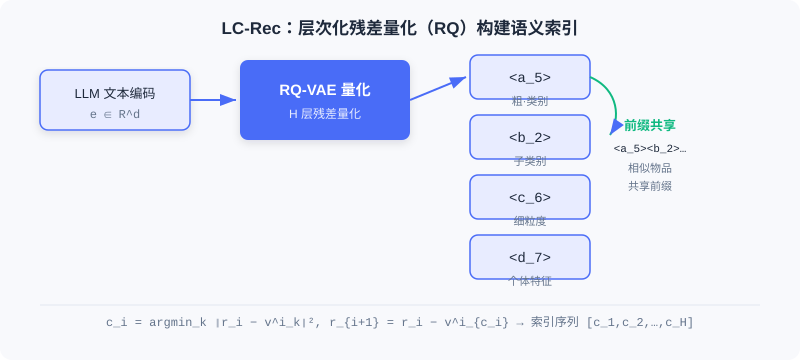
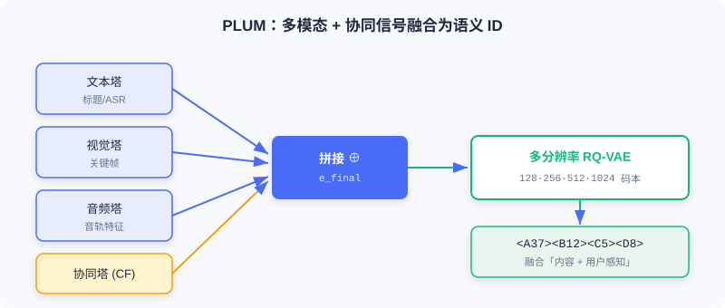

<div class="badge-row">
  <span style="background: #f0f4ff; color: #4A6CF7; padding: 4px 12px; border-radius: 20px; font-size: 0.85em; font-weight: 600; border: 1px solid rgba(74,108,247,0.2);">📖</span>
  <span style="background: #fef9ec; color: #d97706; padding: 4px 12px; border-radius: 20px; font-size: 0.85em; border: 1px solid rgba(100,100,100,0.15);">⏱️ ~34 min read</span>
  <span style="background: #fef2f2; color: #dc2626; padding: 4px 12px; border-radius: 20px; font-size: 0.85em; border: 1px solid rgba(100,100,100,0.15);">🎯 Advanced</span>
</div>

# Unifying Collaborative and Language Semantics

> 📝 **Before You Continue:** Make sure you have finished [1.1](./../part1-introduction/recommender-system-basics.md) on the two paradigms and capability evolution, and [5.3](./../part5-trends/generative-trend.md) on TIGER semantic IDs and OneRec end-to-end generation. This chapter deepens that "semantic ID" thread — going beyond "generation" to making the LLM truly **understand** these IDs.

When recommender systems meet large language models (LLMs), the pairing looks like a match made in heaven: the LLM's powerful language understanding and generation capabilities seem naturally suited to recommendation. But reality pours cold water on the idea — the two speak **two completely different "languages."** Recommender systems build **collaborative semantics** from user behavior data, while LLMs understand **language semantics** embedded in text. Until this gap is crossed, even the strongest LLM remains an "outsider" who cannot read the world of recommendation.

The core question this chapter addresses is: **how do we build an item representation that is both understandable by an LLM and capable of carrying collaborative semantics?** The answer is not "just feed the title to the LLM," but a systematic scheme of semantic indexing plus semantic alignment.

After reading this chapter, you will be able to:

- State the gap between collaborative semantics and language semantics **in one sentence**, and identify the two fundamental flaws of "replacing IDs with titles"
- **Describe** how LC-Rec builds a semantic index with hierarchical RQ-VAE, and explain how "uniform semantic mapping" resolves index collisions
- **Recount** how LC-Rec's three-level alignment training (sequential prediction / index-language alignment / recommendation-oriented) injects collaborative semantics into the LLM
- **Explain** how PLUM pushes this approach to industrial scale (multimodal fusion + continued pre-training + task fine-tuning)
- Work through 4 tiered practice problems that consolidate the semantic-alignment thread from academic prototype to industrial deployment

---

## 9.1.0 The Divide Between Two "Languages"

A recommender system represents each item as a discrete **ID** (e.g., `item_12345`). This ID carries no semantic information of its own — its meaning comes entirely from **collaborative patterns** learned from user behavior data. By analyzing the user–item interaction matrix, the model captures implicit similarities and associations between items. Representations learned through behavior in this way constitute **collaborative semantics**.

An LLM, by contrast, understands **language semantics**: from its pre-training corpus it has learned semantic associations among words, phrases, and sentences. When we feed item IDs directly to an LLM, these discrete identifiers are **Out-of-Vocabulary (OOV)** symbols to it, with no connection to any pre-trained knowledge.


> 💡 **Key Insight:** One intuitive fix is to **replace IDs with item titles** (letting the LLM read titles). But this has two fundamental problems. First, the LLM may understand the literal meaning of a title, yet it **cannot perceive the item's collaborative characteristics in the recommender system** (the collective behavior patterns of its user base). Second, candidate-set-based text generation **cannot scale to whole-corpus retrieval**, limiting the model's applicability.

### 🧠 Mental Model: Two People Speaking Different Languages

> Picture the recommender system as a veteran shopkeeper who only looks at "membership numbers" — with his eyes closed he knows that customers 12345 and 67890 always shop together (collaborative semantics), yet he cannot describe what those numbers look like. The LLM is a bookish librarian who can happily discuss the plot of "The Legend of Zelda" (language semantics) but is utterly baffled by the shopkeeper's membership numbers. For the two to cooperate, you first need a "number ↔ content" dictionary — and that is exactly what a semantic index provides.

---

## 9.1.1 LC-Rec: Hierarchical Semantic Indexing and Alignment

**LC-Rec** (Language-Collaborative Recommendation) proposes a systematic scheme: learn a discrete **semantic index** for every item, so that it is simultaneously language-understandable and collaboratively expressive. It comprises two key technical modules: **item index learning** and **semantic alignment training**.

### Item Index Learning: Hierarchical Residual Quantization

LC-Rec follows the semantic ID approach introduced in [5.3](./../part5-trends/generative-trend.md), building item indices with **hierarchical residual vector quantization (RQ)**. Concretely:

1. First, an LLM encodes the item title and description to obtain an initial text embedding $\boldsymbol{e} \in \mathbb{R}^d$ — ensuring the index construction starts from language semantics.
2. Train an RQ-VAE to map the continuous embedding to a discrete index sequence. The encoder maps $\boldsymbol{e}$ to a latent representation $\boldsymbol{z}$, which then undergoes $H$ levels of residual quantization. At level $i$, the codebook $C^i = \{\boldsymbol{v}^i_k\}_{k=1}^K$ contains $K$ learnable cluster centers:

$$c_i = \arg\min_k \|\boldsymbol{r}_i - \boldsymbol{v}^i_k\|^2, \quad \boldsymbol{r}_{i+1} = \boldsymbol{r}_i - \boldsymbol{v}^i_{c_i}$$

The final item is represented as an index sequence $[c_1, c_2, \ldots, c_H]$, e.g., `<a_5><b_2><c_6><d_7>`.



This hierarchical design yields two important properties: **level-by-level semantic refinement** (from coarse-grained categories down to fine-grained individual features) and **prefix sharing among similar items** (content-similar items tend to share more prefixes). This provides a structured prior for subsequent autoregressive generation.

### Uniform Semantic Mapping: Resolving Index Collisions with Optimal Transport

LC-Rec's key innovation is **uniform semantic mapping**. Standard vector quantization suffers from **index collisions**: multiple distinct items may be mapped to the same index sequence — unacceptable in recommendation, where every item must have a unique identifier. Existing methods (e.g., TIGER) typically resolve collisions by adding index levels, but this introduces semantically irrelevant noise.

LC-Rec mitigates the problem at its root: at the last quantization level it imposes a **uniform distribution constraint**, ensuring that item assignments across codebook vectors are as balanced as possible. This is formalized as an **Optimal Transport** problem:

$$\min \sum_{\boldsymbol{r}_H \in \mathcal{B}} \sum_{k=1}^K q(c_H=k|\boldsymbol{r}_H) \|\boldsymbol{r}_H - \boldsymbol{v}^H_k\|^2$$

$$\text{s.t.} \quad \sum_{k=1}^K q(c_H=k|\boldsymbol{r}_H) = 1, \quad \sum_{\boldsymbol{r}_H \in \mathcal{B}} q(c_H=k|\boldsymbol{r}_H) = \frac{|\mathcal{B}|}{K}$$

Here $\mathcal{B}$ is a batch of residual vectors, and $q(c_H=k|\boldsymbol{r}_H)$ is the probability of assigning residual $\boldsymbol{r}_H$ to the $k$-th codebook vector. The optimization is solved by the **Sinkhorn-Knopp algorithm**, significantly reducing the collision rate while preserving semantic continuity.


> **Analysis:** The cost of uniform semantic mapping is an extra optimal-transport solving step (Sinkhorn iterations), but the payoff is "assigning unique semantic IDs to the vast majority of items without adding extra index levels" — avoiding the semantic noise that TIGER-style level stacking introduces. It is an elegant trade-off between expressiveness and uniqueness.

### Semantic Alignment Training: Three Progressive Levels of Injecting Collaborative Semantics

After obtaining item indices, **instruction tuning** is needed for the LLM to understand them. LC-Rec designs three levels of alignment tasks:

**Level 1 · Sequential item prediction** — given an index sequence of the user's historical interactions, predict the next item's index. Because the indices are hierarchical, the LLM can refine level by level during autoregressive generation (coarse category first, then fine-grained individual), which fits naturally with text generation mechanics.

**Level 2 · Explicit index-language alignment** — establish bidirectional correspondence between indices and items:
- *Index to text*: given an index, generate the corresponding title and description (e.g., seeing `<a_66><b_197><c_236><d_223>` produce "Pokémon Moon - Nintendo 3DS").
- *Text to index*: given a title and description, generate the corresponding index sequence.

This bidirectional alignment resembles cross-modal reconstruction in multimodal learning, building a tight semantic bridge between the two representations.

**Level 3 · Recommendation-oriented implicit alignment** — further strengthen the fusion of collaborative semantics, with three task types:
- *Asymmetric prediction*: break the symmetry of "indices in, indices out," e.g., indices as input and titles as output, forcing the model to build deep associations between collaborative patterns and text semantics.
- *Intent-based item prediction*: extract intent from user reviews (e.g., "looking for an open-world multiplayer adventure game") and predict the recommendation index — teaching the model to combine natural language needs with collaborative filtering patterns.
- *Personalized preference reasoning*: given an interaction index sequence, generate a natural language summary of the user's preferences, laying groundwork for explainable recommendation.

> 💡 **Key Insight:** After three levels of alignment, collaborative semantics and language semantics form a unified representation space inside the LLM, with three defining properties: **hierarchical semantic organization** (longer indices describe more precisely), **collaborative-language fusion** (better suited to recommendation than pure text retrieval), and **generative whole-corpus retrieval capability** (indices are in the vocabulary, so autoregressive retrieval works without a candidate set).

---

## 9.1.2 Industrial-Grade Alignment: The PLUM Framework

LC-Rec validated feasibility on academic datasets, but a huge gap remains between academia and industry. YouTube generates millions of new videos and billions of interactions daily, facing challenges such as multimodal content fusion, real-time incremental updates, and billion-scale retrieval. **PLUM** (Pre-trained Language Models for Recommendations) was born to meet these challenges, achieving industrial-grade semantic alignment through three stages (enhanced semantic ID construction → domain continued pre-training → generative retrieval fine-tuning).

### Fusing Multimodal and Collaborative Signals

LC-Rec uses only text embeddings, but the richness of video content far exceeds plain text (the appeal of a gaming livestream may come more from the streamer's voice and visual smoothness). PLUM adopts **multimodal embedding concatenation** to fuse heterogeneous information: a text encoder, a visual encoder, and an audio encoder extract $\boldsymbol{e}_{\text{text}}$, $\boldsymbol{e}_{\text{visual}}$, and $\boldsymbol{e}_{\text{audio}}$ respectively, which are concatenated:

$$\boldsymbol{e}_{\text{content}} = [\boldsymbol{e}_{\text{text}} \oplus \boldsymbol{e}_{\text{visual}} \oplus \boldsymbol{e}_{\text{audio}}]$$

More crucially, PLUM explicitly introduces a **collaborative filtering embedding** $\boldsymbol{e}_{\text{cf}}$ to compensate for what content semantics lack — encoding the collaborative pattern of "which users tend to watch together" — and concatenates it with the content embeddings:

$$\boldsymbol{e}_{\text{final}} = [\boldsymbol{e}_{\text{text}} \oplus \boldsymbol{e}_{\text{visual}} \oplus \boldsymbol{e}_{\text{audio}} \oplus \boldsymbol{e}_{\text{cf}}]$$



This makes the semantic ID no longer merely a content identifier, but a dual semantics fusing "what the content is" with "how users perceive it." PLUM also uses **multi-resolution codebooks** (128/256/512/1024) and **progressive masking training** to ensure the hierarchy is correctly organized.

### Continued Pre-training: Building Bidirectional Collaborative-Language Mappings

PLUM adds all semantic ID tokens to the LLM vocabulary (4-level RQ-VAE × 256 = 1024 new tokens) and uses **semantically guided initialization** to give them a meaningful starting point (the mean of LLM embeddings of the nearest video titles). It then trains on three types of data:

- **Pure semantic ID sequences** (50%): sampled from behavior sequences, predicting the next ID, learning purely collaborative patterns.
- **Pure domain text data**: video titles/descriptions/comments/subtitles, preventing language capability degradation while learning domain expression.
- **ID-text interleaved sequences** (60–70% of the metadata corpus): e.g., "the video `<A37><B12><C5><D8>` has the title: Minecraft building tutorial," building the bidirectional bridge.

One notable finding is that the model exhibits **zero-shot cross-modal understanding**:

```
<A37> → "Nintendo-related content"
<A37><B12> → "Nintendo Switch games"
<A37><B12><C5> → "The Legend of Zelda series"
<A37><B12><C5><D8> → "Weapon collection guide for The Legend of Zelda: Breath of the Wild"
```

This capability emerged entirely through implicit learning over massive interleaved sequences, demonstrating that semantic alignment has been internalized into the model's representational structure.

### Task Fine-tuning and Production Validation

Task fine-tuning reformulates recommendation as **conditional generation**: given the user's multimodal context (historical semantic ID sequence, text, discretized numeric values such as "completion rate: high"), autoregressively generate the semantic ID of the recommended video. PLUM introduces **reward-weighted alignment**:

$$\mathcal{L}_{\text{SFT}} = -\sum_{(u,v) \in \mathcal{D}} r(u,v) \cdot \sum_{t=1}^{4} \log P(\text{sid}_t | \text{Context}_u, \text{sid}_{<t})$$

That is, high-reward interactions (long watch time, likes) represent "strong semantic association" worth deep encoding; low-reward ones (misclicks, quick exits) may be noise and should not be overfit.

PLUM has been fully deployed across YouTube's long-form and short-form video, with key gains: semantic ID **uniqueness of 96.7%** (higher than LC-Rec's 94.0%); the number of videos needed to cover 95% of impressions under effective vocabulary size improved 2.6× for long-form and 13.2× for short-form video; remarkably high sample efficiency — a 900M MoE model needed only 250M samples, with total training cost (FLOPs) at just **0.55×** that of traditional large-embedding-table models (LEM).

> 📊 **Data Point:** PLUM proves that even under the harsh constraints of billion-scale, multimodality, and real-time inference, unifying collaborative semantics with language semantics is entirely feasible. Yet it remains an end-to-end generative model — it can generate recommendations efficiently, but it **cannot explain why**. That is exactly the problem Section 9.2 tackles.

---

## ⚠️ Common Mistakes in 9.1

| # | Mistake | Example | Why It's Wrong | Fix |
|---|---------|---------|---------------|-----|
| 1 | Assuming "replacing IDs with titles" solves semantic alignment | Feeding item titles directly as tokens to an LLM for recommendation | Titles carry no collaborative semantics, and whole-corpus retrieval is impossible | Use a semantic index (RQ-VAE) that carries both collaborative and language semantics |
| 2 | Confusing collaborative semantics with language semantics | Believing that an LLM reading a title equals understanding recommendation | Titles contain no user-population behavior patterns (collaborative signals) | Distinguish the two semantics and fuse them through alignment training |
| 3 | Assuming adding levels always resolves index collisions | TIGER-style unlimited stacking of RQ levels | Extra levels introduce semantically irrelevant noise that pollutes index meaning | Use uniform semantic mapping (optimal transport) for balanced assignment |
| 4 | Mistaking PLUM's concatenation for attention-based fusion | "PLUM fuses via cross-modal attention" | PLUM uses simple concatenation, letting the codebook naturally discover important modalities | Concatenation gives every modality an equal chance and is more interpretable |

---

## Chapter Summary

### 📌 Key Takeaways

| Concept | Key Points | Why It Matters |
|---------|-----------|----------------|
| Semantic gap | Collaborative semantics (IDs) vs language semantics (text); IDs are OOV to LLMs | Without crossing the gap, the LLM cannot read the world of recommendation |
| LC-Rec semantic index | Hierarchical RQ-VAE + uniform semantic mapping (optimal transport) | Items are simultaneously LLM-understandable and collaboratively expressive |
| Three-level alignment | Sequential prediction / index-language / recommendation-oriented | Progressively injects collaborative semantics into the LLM representation space |
| PLUM | Multimodal + CF fusion, CPT, reward-weighted fine-tuning | Industrial validation: 96.7% uniqueness, 0.55× cost |
| Unified representation space | Hierarchical organization / collaborative-language fusion / whole-corpus retrieval | Lays the foundation of understanding for the "thinking" in 9.2 |

### ❓ FAQ

**Q1: Why not just use item titles — why bother with semantic indices?**
> A: Titles carry only language semantics with no collaborative signals (collective behavior of the user population); and candidate-set-based text generation cannot scale to whole-corpus retrieval. A semantic index unifies both semantics into a token sequence that the LLM can generate and retrieve over.

**Q2: What's the difference between uniform semantic mapping and TIGER's extra levels?**
> A: TIGER avoids collisions by adding RQ levels, but the new levels bring semantically irrelevant noise; LC-Rec's uniform semantic mapping adds a uniform distribution constraint at the last level (Sinkhorn optimal transport), giving the vast majority of items unique IDs without extra levels — cleaner.

**Q3: Why does PLUM use "concatenation" instead of attention fusion for multimodality?**
> A: Concatenation gives text/visual/audio/collaborative modalities an equal chance at expression, letting the RQ-VAE codebook naturally discover which modality matters most for distinguishing video categories (e.g., audio for music videos, text for tutorials); it is also more interpretable and cheaper computationally.

### 🔗 Connections to Later Chapters

- **1.1 / 5.3** (paradigms and generative evolution) — semantic indexing deepens the TIGER idea; this chapter solves "how the LLM *understands* the indices."
- **9.2** (OneRec-Think) — building on the "knowing the items" semantic alignment, it further teaches the model "to think."
- **9.3** (autonomous reasoning) — RecZero/RecOne carry on the semantic index representation, liberating reasoning from hand-crafted templates into autonomous exploration.

---

## Practice Problems

Work through all problems in order — they get progressively harder. Each has a complete solution you can reveal after trying it yourself.

---

**Problem 9.1.1 — Distinguishing the Two Semantics** 🟢 Easy

Classify each description below as **collaborative semantics** or **language semantics**:
- (a) Items `item_8842` and `item_1190` are frequently purchased by the same group of users.
- (b) The video title "The Legend of Zelda: Breath of the Wild" describes an open-world adventure game.
- (c) After watching A, users watch B 80% of the time (behavioral co-occurrence).
- (d) High-frequency words in the comments are "healing" and "art style."

<details>
<summary>💡 Solution (click to reveal)</summary>

**Approach:** Check whether the information comes from "user behavior" or "text content."

- (a) Collaborative semantics (co-occurrence behavior)
- (b) Language semantics (meaning of the title text)
- (c) Collaborative semantics (behavioral transition probability)
- (d) Language semantics (comment text semantics)

**Key points:**
- Collaborative semantics originate from the interaction matrix; language semantics originate from text/pre-training corpora.
- The goal of a semantic index is to unify both into one representation.

</details>

---

**Problem 9.1.2 — RQ-VAE Quantization Computation** 🟢 Easy

Given an item text embedding $\boldsymbol{e}$, the RQ-VAE encoder yields $\boldsymbol{z}$ with initial residual $\boldsymbol{r}_1 = \boldsymbol{z}$. In the first-level codebook $\{\boldsymbol{v}^1_k\}$, the codeword nearest to $\boldsymbol{r}_1$ has index $c_1=2$. Write out the selection formula for $c_1$ and the residual update rule.

<details>
<summary>💡 Solution (click to reveal)</summary>

**Approach:** Apply the hierarchical quantization formulas directly.

$$c_i = \arg\min_k \|\boldsymbol{r}_i - \boldsymbol{v}^i_k\|^2 \;\Rightarrow\; c_1 = \arg\min_k \|\boldsymbol{r}_1 - \boldsymbol{v}^1_k\|^2 = 2$$

$$\boldsymbol{r}_{i+1} = \boldsymbol{r}_i - \boldsymbol{v}^i_{c_i} \;\Rightarrow\; \boldsymbol{r}_2 = \boldsymbol{r}_1 - \boldsymbol{v}^1_2$$

**Key points:**
- At each level, find the nearest codeword in the codebook, then subtract it from the residual.
- Iterating over levels yields the index sequence $(c_1, c_2, \ldots, c_H)$.

</details>

---

**Problem 9.1.3 — Index Collision Analysis** 🟡 Medium

A recommender system builds semantic IDs with a TIGER-style 3-level RQ-VAE but discovers two different gaming videos mapped to the exact same `<a_3><b_1><c_7>`. An engineer decides to expand to 5 levels to fix it. Point out the hidden risks of this approach, and explain why LC-Rec's uniform semantic mapping is the better solution.

<details>
<summary>💡 Solution (click to reveal)</summary>

**Approach:** Compare the two collision-elimination strategies: "adding levels" vs "uniform mapping."

**Risks of adding levels:** More RQ levels introduce more codeword dimensions; some levels learn only "differentiation for differentiation's sake" — semantically irrelevant noise that pollutes the hierarchical semantics of the index, while also increasing generation length and inference cost.

**Why uniform semantic mapping is better:** It introduces a uniform distribution constraint at the last level (optimal transport), using Sinkhorn-Knopp to balance item assignment across codebook vectors, reducing the collision rate at the root **without adding extra index levels** — preserving the semantic purity and generation efficiency of the index.

**Key points:**
- The essence of collisions is unbalanced codebook assignment, not insufficient levels.
- Balanced assignment is cleaner and more efficient than stacking levels.

</details>

---

**Problem 9.1.4 — Designing an Alignment Training Mix** 🔴 Hard

You are designing semantic alignment training for a book e-commerce LLM recommender. List the **three classes of alignment tasks** you would adopt (corresponding to LC-Rec's three levels), write one sample for each (input → output), and state which kind of semantics each injects.

<details>
<summary>💡 Solution (click to reveal)</summary>

**Approach:** Apply LC-Rec's three-level alignment to the book domain.

1. **Sequential item prediction (collaborative):** input the user's historical index sequence `<a_2><b_5><c_1> ... <a_2><b_5><c_9>`, output the next index `<a_2><b_6><c_3>` — learning collaborative co-occurrence patterns.
2. **Explicit index-language alignment (bidirectional):**
   - Index→text: input `<a_2><b_5><c_3>`, output "Sapiens: A Brief History of Humankind — big-picture popular history."
   - Text→index: input "Sapiens: A Brief History of Humankind," output `<a_2><b_5><c_3>`.
3. **Recommendation-oriented implicit alignment (intent + preference):** input the intent "looking for a light history read" + historical indices, output a recommendation index; or input historical indices, output a preference summary such as "prefers big-picture history, lightly academic."

**Key points:**
- The three levels progress from shallow to deep: co-occurrence → bidirectional semantic bridge → intent/preference reasoning.
- Each level injects collaborative semantics more deeply into the LLM's representation space.

</details>

---

**🏆 Challenge: Making the Industrial Case**

Suppose you are introducing PLUM-style semantic alignment to a short-video platform with tens of millions of daily active users. Write an argument of no more than 200 words: compared with traditional large-embedding-table models (LEM), why is the semantic-alignment approach superior on the three dimensions of **sample efficiency, long-tail coverage, and explainability**? Also identify one infrastructure problem that must be solved up front.

<details>
<summary>💡 Hint</summary>

Arguments: ① The representation space of semantic alignment generalizes better, requiring far less training data than LEM (PLUM: only 250M samples vs LEM's billions per day), with FLOPs at just 0.55×; ② Semantic IDs have higher discriminative power, markedly improving long-tail coverage (13.2× for short video); ③ Index-text alignment makes recommendations explainable. Prerequisite: the "item → semantic ID" quantization/alignment infrastructure must be built first (like the semantic ID pipeline in 5.3), otherwise the LLM has no tokens to use.
</details>
