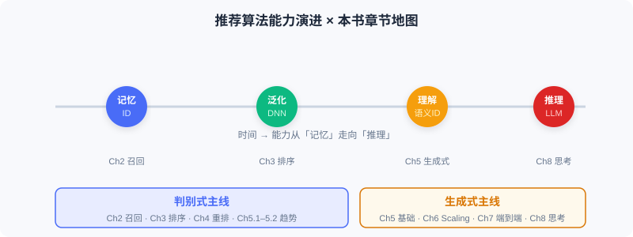

  📖
  ⏱️ ~20 min read
  🎯 Intermediate

# 本书概览与技术地图

> 📝 **Before You Continue:** 请先读完 [1.1](./recommender-system-basics.md) 的三种视角。本章把那张「立体认知」展开成一张可导航的**技术地图**，帮你定位后续每一章。

理解了推荐系统的核心逻辑后，真正的挑战是把认知变成可操作的技术方案。研究者与工程师提出过数百种算法，初学者常陷入迷茫：这些模型有什么关系？什么场景选哪种？如何拼出完整系统？

本章给你一张地图。本书沿 **判别式** 与 **生成式** 两条主线组织，同时串起从「记忆·泛化」到「理解·推理」的能力演进。

读完本章，你将能够：

- 说出本书 **上下两篇** 的划分逻辑与各自的落脚点
- 把 **基础篇（Part 1–5）** 每一章对应到三阶段流水线或前沿趋势
- 解释为何「召回→排序→重排」是判别式的组织线索
- 预判 **生成式主线** 在后续版本（Part 6–11）将如何展开
- 完成 4 道分层练习题，检验对技术地图的掌握

---

## 1.2.0 一张地图，两条主线

本书的编排可用一张图概括：横轴是 **时间/能力演进** （从纯 ID 记忆到 LLM 推理），纵轴是 **两条范式主线** （判别式 vs 生成式）。

- **上篇：判别式推荐的工业实践**——沿「召回 → 排序 → 重排」流水线逐步深入，是记忆与泛化能力的主战场。
- **下篇：生成式推荐的技术图景**——从基础范式出发，经 Scaling Law、端到端建模、推理能力到扩散模型，是理解与推理能力的探索场。

> 💡 **Key Insight:** 两条主线**不是割裂的**。生成式架构往往在判别式成熟模块的基础上「端到端化」；而判别式的语义 ID、特征交叉等技术，又为生成式提供了表示基石。

---

## 1.2.1 上篇：判别式推荐的工业实践（本版覆盖）

本版（基础篇）完整收录上篇及承上启下的趋势章，共 5 个 Part：

| Part | 主题 | 在流水线中的位置 | 核心内容 |
|------|------|----------------|----------|
| **Part 1** | 引言与概览 | — | 两种范式、三阶段漏斗、生态三角、特征与 Embedding 基础 |
| **Part 2** | 快速候选召回 | ① 召回 | 协同过滤 / 向量召回 / 双塔 / 序列召回 / 流式索引 |
| **Part 3** | 精准偏好预测 | ② 排序 | Wide&Deep / 特征交叉 / 序列建模 / 多目标 / 多场景 |
| **Part 4** | 重排多样性建模 | ③ 重排 | 贪心重排（MMR/DPP）/ 个性化重排（PRM） |
| **Part 5** | 前沿趋势 | 跨阶段 | 模型去偏 / 冷启动 / 生成式范式演进 |

### 召回：从亿到千（Part 2）

召回是流水线起点，要在毫秒级从亿级物品筛出千级候选。其技术演进沿五节展开：

- **协同过滤**——经典起点：从 ItemCF 的物品相似度，经 Swing 工业优化、UserCF 用户视角，到矩阵分解把用户/物品映射为隐向量，开启向量化先河。
- **I2I 向量召回**——把 Word2Vec 序列建模思想迁移到推荐：从 Item2Vec 直接迁移，到 EGES 融合属性，再到 Airbnb 把业务目标融入序列构建。
- **双塔模型（U2I）**——用户与物品分别编码为向量，以 FM、DSSM、YoutubeDNN 为代表，实现高效向量检索。
- **序列召回**——关注被前面方法忽略的时序信息：MIND 用多向量表示多元兴趣，SDM 分离长短期偏好并以门控动态融合。
- **流式索引召回**——跳出模型内部压缩：Trinity 用聚类统计保留全量历史兴趣，Streaming VQ 让索引结构实时适应数据分布。

### 排序：从千到百（Part 3）

排序对千级候选精准打分，是深度泛化的主战场：

- **Wide & Deep**——联合训练线性模型与深度网络，确立「记忆 + 泛化」基础框架。
- **特征交叉**——从 FM 二阶交叉，经 DeepFM、xDeepFM，走向自动高阶交叉。
- **序列建模**——DIN 用注意力按候选动态激活历史；DIEN 显式建模兴趣时序演化。
- **多目标 / 多场景**——MMoE、ESMM 平衡多目标；多塔与动态权重适配多场景差异。

### 重排：从百到一屏（Part 4）

排序输出常高度同质化，重排在保相关性的前提下优化整张列表体验：

- **贪心重排**——MMR 线性组合相关性与多样性；DPP 用行列式框架更精确控制多样性。
- **个性化重排**——PRM 用 Transformer 建模物品间相互影响，实现端到端个性化列表生成。

---

## 1.2.2 下篇预览：生成式推荐（后续版本覆盖 Part 6–11）

为帮你建立完整认知，这里简要预告下篇，让你知道本版之后的路通向何方：

| Part | 主题 | 一句话 |
|----|------|--------|
| **Part 6** | 生成式基础 | Transformer / 扩散模型 / LLM 流程 / 物品 Token 化（语义 ID） |
| **Part 7** | Scaling Law 架构 | HSTU 把逐候选打分转为用户级序列建模；RankMixer 做硬件感知统一架构 |
| **Part 8** | 端到端生成 | OneRec（推荐）/ OneSug·OneSearch（搜索）/ EGA（广告）用一个模型替代流水线 |
| **Part 9** | 会思考的推荐 | 语义对齐（LC-Rec）→ 推理激活（OneRec-Think）→ 自主推理（RecZero） |
| **Part 10** | 扩散模型推荐 | DiffuASR 数据增强 / AsymDiffRec·DMSG 特征与多样性优化 |
| **Part 11** | 生产级项目 | 电影推荐全链路：离线训练 + 在线服务 + 前端 + Docker 部署 |

> 📝 **Note:** 本版聚焦基础篇（Part 1–5）。下篇内容将在后续版本以相同 book-writer 规范续写。

---

## ⚠️ Common Mistakes in 1.2

| # | Mistake | Example | Why It's Wrong | Fix |
|---|---------|---------|---------------|-----|
| 1 | 把章节当孤立算法 | 「这一章讲 DIN，下一章讲 DIEN，没关系」 | 章节是流水线上的连续环节，前一章是后一章的输入 | 始终用「流水线位置」理解每章 |
| 2 | 只记模型名不记动机 | 背下 FM/DeepFM 却说不清为何要高阶交叉 | 模型是为解决具体局限而生，脱离动机学不牢 | 每学一模型，先问「它解决了前一方法的什么不足」 |
| 3 | 误以为生成式取代判别式 | 「学了生成式就不用看上篇了」 | 二者并行发展，生成式常建立在判别式表示之上 | 把两条主线当作互补而非替代 |

---

## 本章小结

### 📌 Key Takeaways

| Concept | Key Points | Why It Matters |
|---------|-----------|----------------|
| 两条主线 | 判别式（上篇）/ 生成式（下篇） | 全书组织骨架，决定你如何归类每个模型 |
| 三阶段线索 | 召回→排序→重排 贯穿上篇 | 理解每章在流水线上的位置 |
| 能力演进 | 记忆→泛化→理解→推理 | 解释为何技术不断迭代而非简单替代 |
| 本版边界 | 覆盖 Part 1–5（基础篇） | 明确本版范围，避免期待错位 |

### ❓ FAQ

**Q1: 基础篇为什么停在 Part 5，不连同生成式主线一起？**
> A: 生成式主线的基石（Part 6），概念密度陡增（语义 ID、Transformer、扩散模型）。先夯实判别式工业实践，再进生成式，认知更稳。

**Q2: 召回、排序、重排必须都用深度学习吗？**
> A: 不一定。召回常用轻量方法（协同过滤、双塔）；排序才动用最复杂深度模型；重排可用规则或轻量模型。复杂度随候选收缩而递增。

**Q3: 我该按什么顺序读？**
> A: 严格按 Part 1→5 顺序。后一章常以前一章为前置（如序列建模建立在特征交叉之后）。

### 前后关联

- **Part 2 召回（2.1–2.5）** 把本章「召回：从亿到千」展开为五个算法家族。
- **Part 3 排序（3.1–3.5）** 深入判别式打分函数 $f$ 的工业实现。
- **Part 4 重排（4.1–4.2）** 收尾三阶段流水线，并衔接趋势章。
- **Part 5 趋势（5.1–5.3）** 用「去偏 / 冷启动 / 生成式」承上启下，指向后续版本的下篇。

---

## Practice Problems

---

**Problem 1.2.1 — 定位章节** 🟢 Easy

把下列算法拖入（写出对应 Part/章节）它在流水线中的正确位置：
(a) DPP 重排　(b) YoutubeDNN 双塔　(c) DeepFM 特征交叉　(d) Swing 协同过滤

💡 Solution (click to reveal)

**Approach:** 回忆三阶段与各环节代表模型。

| 算法 | 位置 |
|------|------|
| (a) DPP 重排 | Part 4 重排（4.1 贪心重排） |
| (b) YoutubeDNN 双塔 | Part 2 召回（2.3 双塔 U2I） |
| (c) DeepFM 特征交叉 | Part 3 排序（3.2 特征交叉） |
| (d) Swing 协同过滤 | Part 2 召回（2.1 协同过滤） |

**Key points:**
- 召回侧方法偏轻量、覆盖导向；排序侧动用复杂深度模型。
- 重排发生在排序之后，优化列表级体验。

---

**Problem 1.2.2 — 能力阶段归类** 🟢 Easy

将下列技术归入「记忆 / 泛化 / 理解 / 推理」四个能力阶段之一：
(a) 协同过滤共现　(b) 深度特征交叉　(c) 语义 ID（RQ-VAE）　(d) OneRec-Think 显式推理

💡 Solution (click to reveal)

**Approach:** 对照能力演进曲线。

- (a) 记忆（纯 ID 共现）
- (b) 泛化（深度网络推广到未见组合）
- (c) 理解（物品编码为携带语义的 Token）
- (d) 推理（模型显式分析意图、给出理由）

**Key points:**
- 四阶段层层叠加而非替代；同一条演进曲线串起全书。

---

**Problem 1.2.3 — 动机追问** 🟡 Medium

为什么「特征交叉」要从 FM 的二阶，演进到 xDeepFM 的自动高阶？请用一个具体例子说明：仅用二阶交叉会遗漏什么类型的模式。

💡 Solution (click to reveal)

**Approach:** 从「模型要解决什么局限」切入。FM 的二阶交叉只建模 **两两特征** 的组合（如 性别×品类）。但真实业务中，价值常来自 **更高阶的交互**——例如「一线城市 × 年轻女性 × 美妆品类」的三阶组合才触发强兴趣。

若只有二阶交叉，模型无法显式捕捉这种三阶（及以上）协同信号，只能靠隐式近似，表达力受限。xDeepFM 等用向量/神经网络 **自动** 学习任意阶交叉，摆脱人工特征工程，覆盖高阶模式。

**Key points:**
- 二阶交叉 = 两两组合；高阶交叉 = 多特征联合。
- 演进动机：表达力不足 → 自动化高阶交互。

---

**🏆 Challenge: 设计你的阅读路线**

假设一位同事「只会写 SQL 和简单 LR，没碰过深度学习」，但又急需两周内上手贵司的推荐排序模块。请基于本章技术地图，为他设计一份 **两周学习路线** （列出每日/每阶段该读哪几章、跳过哪些、为什么），并说明理由（150 字内）。

💡 Hint

优先保「流水线主线」：Part1→Part2 召回→Part3 排序（Wide&Deep、特征交叉、序列建模），重排与趋势可后置；生成式主线（Part 6+）暂跳过。理由是排序模块最依赖 Part3，且深度基础可从 Wide&Deep 平滑切入。

