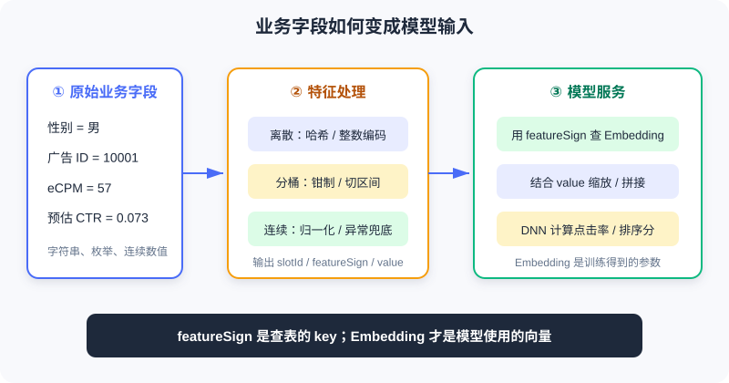
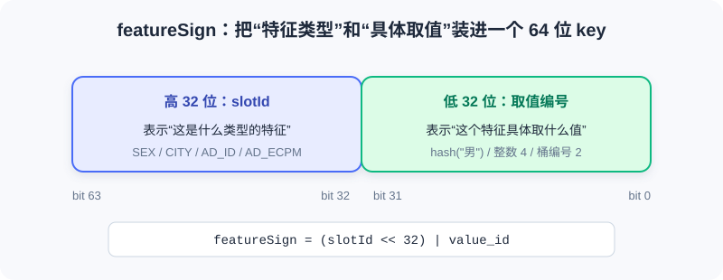
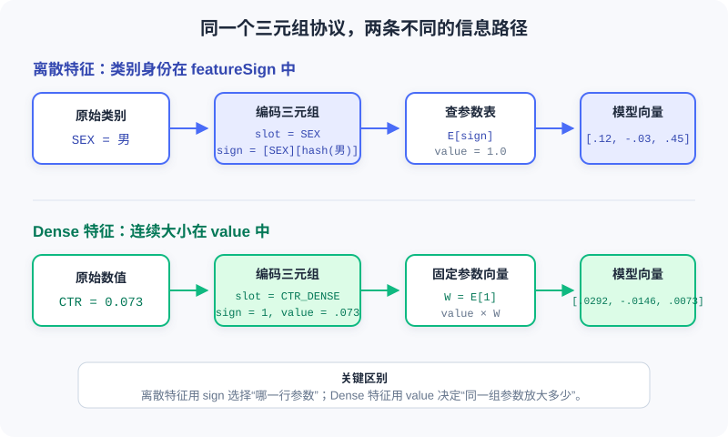

<div class="badge-row">
  <span style="background: #f0f4ff; color: #4A6CF7; padding: 4px 12px; border-radius: 20px; font-size: 0.85em; font-weight: 600; border: 1px solid rgba(74,108,247,0.2);">📖</span>
  <span style="background: #f0fdf4; color: #16a34a; padding: 4px 12px; border-radius: 20px; font-size: 0.85em; border: 1px solid rgba(22,163,74,0.2);">⏱️ ~65 min read</span>
  <span style="background: #fef9ec; color: #d97706; padding: 4px 12px; border-radius: 20px; font-size: 0.85em; border: 1px solid rgba(100,100,100,0.15);">🎯 Intermediate</span>
</div>

# 特征与 Embedding 入门

> 📝 **Before You Continue:** 请先读完 [1.1](./recommender-system-basics.md) 的用户—物品—场景三元组与 [1.2](./book-overview.md) 的技术地图。你需要会读基础 C++，并知道哈希函数能把字符串稳定映射为整数；不要求机器学习背景。

推荐系统最终处理的不是抽象的“用户兴趣”，而是一组具体字段：`性别=男`、`城市=北京`、`广告ID=10001`、`预估点击率=0.073`。业务代码认识这些字段，但神经网络只接受数字张量。两者之间缺少一座桥。

这座桥就是 **特征处理**。它把原始业务字段变成 `slotId + featureSign + value`，再由模型服务把无语义的编号查成可学习的 **Embedding 向量**。这条链路看似只是数据格式转换，却决定了模型能看见什么、怎样泛化，以及训练与线上是否一致。

---

## 1.3.0 从业务字段到模型输入

一个排序请求通常同时包含四类信息：

| 类别 | 典型字段 | 回答的问题 |
|------|----------|------------|
| **用户信息** | 用户 ID、性别、年龄、城市 | 这个人是谁？长期偏好是什么？ |
| **物品信息** | 广告 ID、视频 ID、类目、作者 | 当前候选是什么？ |
| **上下文信息** | 时间、网络、设备、候选位置 | 这次请求发生在什么场景？ |
| **连续数值** | 预估 CTR、eCPM、质量分、时长 | 某个信号具体有多强？ |

这些可被模型利用的信息统称为 **特征（Feature）**。但原始值不能原样送进模型：字符串无法参加矩阵乘法；业务 ID 的数字大小没有语义；不同连续值的量纲又可能相差数十亿倍。



上图给出了完整职责边界：业务服务负责特征生成，模型服务负责查 Embedding、组合特征并完成网络计算。二者通过稳定的特征协议连接。

> 💡 **Key Insight:** 特征处理不是“把东西变成数字”这么简单。它要同时保留**类别身份、数值大小和工程稳定性**，并确保离线训练与在线预测看到的是同一种表达。

---

## 1.3.1 三元组：`slotId / featureSign / value`

工业系统常把一条特征整理为如下记录：

```cpp
struct FeatureInfo {
  int slotId;              // 特征属于哪个字段或特征组
  int64_t featureSign;     // 具体取值的查表 key
  float value;             // 数值或权重
};
```

三个字段各管一件事：

| 字段 | 含义 | 图书馆类比 |
|------|------|------------|
| `slotId` | 这是什么类型的特征 | 哪个书架 |
| `featureSign` | 这个具体取值的编号 | 书架上哪本书的索引号 |
| `value` | 这次使用它的数值或权重 | 这本书本次被使用的强度 |

例如，用户性别为“男”时，可以表达为：

```cpp
FeatureInfo sex_feature{
  .slotId = SEX,
  .featureSign = gen_feasign_string(SEX, "男"),
  .value = 1.0F
};
```

它可以读成：“去 `SEX` 书架，找到‘男’这个取值对应的条目，本次权重为 `1.0`。”

连续特征的分工不同。若预估点击率为 `0.073`：

```cpp
FeatureInfo ctr_feature{
  .slotId = AD_ETR_DENSE,
  .featureSign = 1,
  .value = 0.073F
};
```

这里 `featureSign=1` 只是固定占位，真实信息放在 `value` 中。先记住这个对照：

| 特征表达 | `featureSign` 放什么 | `value` 放什么 | 信息主要在哪里 |
|----------|----------------------|----------------|------------------|
| 离散 / 分桶 | 类别或桶的编号 | 通常为 `1.0` | `featureSign` |
| Dense 连续 | 固定 key，常用 `1` | 归一化后的真实数值 | `value` |

> ⚠️ **Warning:** `featureSign` 应被视为不透明的 64 位 key。若用 `uint64_t` 生成、再存入 `int64_t`，最高位为 1 时在常见二进制补码实现中会显示为负数。只要下游按相同位模式查表通常没有问题，但不要对它做大小比较、`abs()` 或带符号取模。

---

## 1.3.2 `featureSign` 如何生成

一种常见设计，是把 `slotId` 放进高 32 位，把具体取值的编号放进低 32 位：



这样，即使两个字段的低位编号碰巧相同，只要 `slotId` 不同，最终 key 仍然不同。

### 字符串取值：先哈希，再拼接

```cpp
static uint64_t gen_feasign_string(
    uint64_t slot_id,
    const std::string& value) {
  const uint32_t value_hash = gen_hash_new(value.data(), value.size());
  const uint64_t slot_bits = (slot_id << 32) & 0xffffffff00000000ULL;
  return slot_bits | value_hash;
}
```

这段代码分三步：

1. `gen_hash_new` 把字符串稳定映射为 32 位整数。
2. `slot_id << 32` 把特征类型移到高 32 位。
3. 按位或 `|` 把高位类型与低位取值合成一个 key。

例如 `SEX=男` 与 `AGE_BUCKET=20` 的低位哈希即使都等于 `111`，最终 key 仍分别是 `[SEX][111]` 与 `[AGE_BUCKET][111]`。**Slot 分段把不同字段隔离开了。**

> 💡 **Key Insight:** `featureSign` 像“班级号 + 学号”。学号只在班级内部区分学生；高位的班级号让不同班级的相同学号不冲突。

### 整数取值：能直接编码就不要哈希

如果取值本来就是小整数，例如网络类型 `4`、星期 `2` 或桶编号 `7`，可以直接放进低 32 位：

```cpp
static uint64_t gen_feasign_int32(
    uint64_t slot_id,
    uint32_t value) {
  const uint64_t slot_bits = (slot_id << 32) & 0xffffffff00000000ULL;
  return slot_bits | value;
}
```

只要取值能被 32 位无符号整数完整表示，这种编码没有额外的哈希冲突。因此，小枚举和桶编号应优先使用整数版本。

### 哈希冲突是取舍，不是异常

字符串被压进 32 位空间后，冲突无法避免。低 32 位只有 $2^{32}$ 个位置；根据生日悖论，一个 slot 内约有 **7.7 万个不同取值** 时，出现至少一次冲突的概率就超过 50%。

| Slot 示例 | 基数数量级 | 冲突影响 |
|-----------|------------|----------|
| `SEX` | $10^0$ | 几乎可忽略 |
| `CITY` | $10^3$ | 通常可忽略 |
| `AD_ID` | $10^5 \sim 10^6$ | 会出现少量冲突 |
| `GUID` | $10^8 \sim 10^9$ | 大量冲突不可避免 |

两个不同取值发生冲突后，会共享同一条 Embedding，模型无法再区分它们。为什么工业系统仍常用这种 **Feature Hashing** ？因为它换来了无状态、可扩展的特征生成：不需要维护巨大的字符串词表，新取值也能立即得到 key。

> **Analysis:**
> - **收益：** 无需中心词表，新增取值天然可处理，线上服务可水平扩展。
> - **代价：** 少量语义混淆，无法从 key 反查原值，高基数特征更难调试。
> - **缓解：** 增大哈希空间、使用双哈希、过滤低频值，或为关键高基数 slot 维护独立词表。

---

## 1.3.3 为什么需要 Embedding

这是本章最容易混淆、也最关键的一点：

> 💡 **Key Insight:** **`featureSign` 是查 Embedding 的 key，不是 Embedding 本身。** 它负责稳定地指出“是哪一个类别”，但不负责表达这个类别与其他类别的关系。

二者的区别如下：

| 对象 | 示例 | 是否训练 | 本质 |
|------|------|----------|------|
| `featureSign` | `500111` | 否 | 稳定、离散的索引 key |
| Embedding | `[0.12, -0.03, 0.88, 0.21]` | 是 | 模型从数据中学习的向量参数 |
| Embedding Table | `key → vector` | 是 | 按 key 保存和更新向量的参数表 |

### 从 One-Hot 到 Embedding

假设 `CITY` 只有“北京、上海、深圳”三个取值。最直接的编码是 One-Hot：

```text
北京 -> [1, 0, 0]
上海 -> [0, 1, 0]
深圳 -> [0, 0, 1]
```

One-Hot 有两个性质：第一，它不会错误地制造大小关系；第二，不同类别彼此等距。但当广告 ID 有 1000 万种取值时，一个样本需要逻辑上占据 1000 万维空间，而且向量中只有一个位置为 1。直接把这种超高维稀疏向量送进网络，参数量和计算量都难以接受。

Embedding 层可以看成一个大矩阵 $E \in \mathbb{R}^{N \times d}$。One-Hot 向量乘以矩阵，本质上就是从 $E$ 中选择一行：

$$\underbrace{[0,\ldots,1,\ldots,0]}_{N\text{ 维 One-Hot}} E = E_i \in \mathbb{R}^{d}$$

因此工程上不必真的构造 One-Hot。只需传入类别对应的 `featureSign`，直接查出 $E_i$。这既节省计算，又让模型能通过训练把行为相似的类别拉到相近的向量区域。

### 为什么不能直接把 `featureSign` 当 Embedding

假设有三个广告：

```text
运动鞋广告 -> featureSign = 105
篮球广告   -> featureSign = 980001
婴儿奶粉   -> featureSign = 106
```

若直接把 sign 当成一个标量输入，模型会得到荒谬的几何关系：运动鞋 `105` 与奶粉 `106` 的距离只有 1，而与语义更接近的篮球 `980001` 相距近百万。这个距离完全由编号或哈希偶然决定，不代表用户行为相似度。

直接使用 sign 还有四个问题：

1. **虚假的顺序关系。** `500222 > 500111` 不代表某个类别“更大”或“更好”。
2. **虚假的距离关系。** 两个哈希值接近，不代表两个类别相似；相差很远也不代表不相似。
3. **无法学习类别语义。** sign 是固定整数，不会在反向传播中朝“更像篮球”或“更像运动鞋”的方向移动。
4. **数值精度风险。** 64 位 sign 若转成 `float32`，超过 $2^{24}$ 后很多相邻整数无法被精确区分，不同 key 可能被舍入成同一个浮点数。

Embedding 则为每个 key 提供一组 **可训练参数**。若观看篮球内容的用户经常点击运动鞋广告，训练会让这两个类别的向量逐渐靠近；奶粉广告的向量则可能位于另一片区域。类别之间的距离由数据学习，而不是由哈希值决定。

> ⚠️ **Warning:** “把 sign 转成 8 维二进制、十进制拆位或做归一化”仍然不是 Embedding。这些操作只是以另一种方式暴露任意编号，不能产生可学习的类别语义。正确做法是把 sign 当索引，查询独立的可训练向量。

### 一次完整的查表过程

假设 `SEX=男` 生成 `featureSign=500111`，Embedding 表当前保存：

```text
E[500111] = [ 0.12, -0.03, 0.45]
E[500222] = [-0.21,  0.34, 0.08]
```

前向传播时，模型用 `500111` 查出第一行 `[0.12, -0.03, 0.45]`。若本次预测误差反向传播到这个特征，只更新 `E[500111]` 及相关网络参数，而不会把整数 `500111` 改掉。

这说明两者职责严格分离：

```text
featureSign：稳定定位参数，训练前后保持不变
Embedding：承载可学习语义，会随训练持续更新
```

### 同一取值为什么共用一条 Embedding

两个用户都具有 `SEX=男`，就会生成相同的 `featureSign`，进而查询同一条 Embedding。这不会让两个用户变得无法区分，因为模型看到的是多个 slot 的组合：

| 用户 | 性别 | 年龄桶 | 城市 | GUID |
|------|------|--------|------|------|
| A | 男 | 20–24 | 北京 | `abc` |
| B | 男 | 35–39 | 深圳 | `xyz` |

共享反而带来泛化能力：所有男性用户的样本共同更新“男性”这条参数，而年龄、城市、身份等其他特征继续保留个体差异。

### Embedding 维度由谁决定

维度不由 C++ 特征生成代码决定，而由模型配置决定，通常按 slot 或特征组设置：

| Slot | 可能的基数 | 常见维度思路 |
|------|------------|--------------|
| `SEX` | 3 | 2–4 维通常足够 |
| `CITY` | $10^3$ | 可从 8 维起试 |
| `AD_ID` | $10^6$ | 常在 8–32 维间权衡 |
| `GUID` | $10^9$ | 维度乘基数会形成内存黑洞，需谨慎 |

维度越大，表示能力越强，但内存、通信和计算成本也越高；数据不足时还更容易过拟合。它是模型容量与系统成本之间的超参数，而不是“基数越大就无限加维度”。

---

## 1.3.4 离散特征与 Dense 特征如何编码

离散与 Dense 都可以装进 `slotId + featureSign + value`，但两条路径中“真正承载信息的字段”完全不同：



离散特征用 `featureSign` 选择“哪一行参数”；Dense 特征通常固定 sign，用 `value` 决定“同一组参数放大多少”。

| 对比项 | 离散特征（Sparse / Categorical） | Dense 特征（Continuous / Numerical） |
|--------|---------------------------------|--------------------------------------|
| 回答的问题 | 是哪一类？ | 具体是多少？ |
| 典型值 | 北京、男、广告 10001、网络类型 4 | CTR 0.073、时长 3600 秒、金额 57 元 |
| 算术关系 | 通常没有大小和距离意义 | 加减、大小和差值通常有意义 |
| 信息位置 | `featureSign` | `value` |
| 常见模型处理 | 按 sign 查 Embedding | 直接输入或投影为向量 |

### 离散特征：编码“是哪一个类别”

**离散特征** 的取值来自有限或可枚举集合。它们的数字形式只是身份，不应被解释为连续大小。例如网络类型 `4` 并不意味着它是网络类型 `2` 的两倍；广告 ID `10002` 也不比 `10001` 更优。

一条离散特征通常经过五步：

1. **规范化原始值。** 统一编码、大小写、空格和缺失值，例如把空城市映射为 `__UNKNOWN__`。
2. **选择 slot。** `CITY`、`SEX`、`AD_ID` 各有独立的 `slotId`。
3. **生成 sign。** 字符串先哈希，小整数可直接编码到低 32 位。
4. **设置权重。** 单值类别通常令 `value=1.0`。
5. **查 Embedding。** 模型用 sign 选择参数表中的一行。

#### 例 1：字符串类别 `SEX=男`

假设 `SEX` 的 `slotId=12`，并假设 `hash("男")=0x3A91F20B`，那么：

```text
高 32 位：slotId = 12       -> 0x0000000C00000000
低 32 位：hash("男")        -> 0x000000003A91F20B
最终 sign                    -> 0x0000000C3A91F20B
```

业务服务生成：

```cpp
const std::string normalized_sex = user.sex.empty()
    ? "__UNKNOWN__"
    : user.sex;

features.emplace_back(
    SEX,
    gen_feasign_string(SEX, normalized_sex),
    1.0F);
```

模型侧的处理可写成：

```text
embedding = E_SEX[0x0000000C3A91F20B]
          = [0.12, -0.03, 0.45]
output    = 1.0 × embedding
          = [0.12, -0.03, 0.45]
```

这里 `value=1.0` 只表示“该类别本次出现”。真正区分男、女、未知的是不同的 sign，以及它们各自对应的 Embedding。

#### 例 2：整数枚举 `APN_TYPE=4`

网络类型本来就是小整数，无需先转字符串再哈希：

```cpp
features.emplace_back(
    APN_TYPE,
    gen_feasign_int32(APN_TYPE, 4),
    1.0F);
```

它会生成 `[APN_TYPE][4]`。与字符串版本相比，这种方式更直观，也不会引入额外的 32 位哈希冲突。

#### 多值离散特征如何处理

“用户兴趣标签”可能同时包含 `篮球、跑步、摄影`。这时一个 slot 会产生多条 sign：

```text
[INTEREST][hash(篮球)]  value=1.0
[INTEREST][hash(跑步)]  value=1.0
[INTEREST][hash(摄影)]  value=1.0
```

模型查出三条 Embedding 后，通常做 `sum`、`mean`、加权池化或注意力聚合。若标签数量变化很大，`mean` 可以避免“标签越多，向量范数越大”的偏差；若不同标签重要性不同，可以把业务权重放进 `value`。

> **Analysis:**
> - **优点：** 不制造虚假顺序，参数可按类别独立学习，也能通过向量空间共享行为模式。
> - **成本：** 高基数 slot 会产生大表；低频类别的向量训练不足。
> - **关键检查：** 同一业务值在离线与在线必须得到完全相同的 sign。

### Dense 特征：编码“具体数值是多少”

**Dense 特征** 是有连续大小意义的数值。`CTR=0.08` 确实比 `CTR=0.02` 大，播放 100 秒也通常比播放 10 秒更长。编码时应保留这种数值关系，而不是为每个小数创建一条独立 Embedding。

Dense 特征在不同框架里有两种常见实现：

1. **直接标量输入。** 把归一化后的 $x$ 与其他向量拼接，再送入 MLP。
2. **统一 slot 协议。** 使用固定 `featureSign=1` 查一条参数向量 $W$，输出 $xW$。

本章工程采用第二种。它在数学上等价于把一维标量通过无偏置线性层投影到 $d$ 维：

$$\text{dense\_vector} = x \times W, \quad W = E_{slot}[1]$$

一条 Dense 特征通常经过四步：

1. **校验与兜底。** 处理缺失、`NaN`、`inf` 和非法负值。
2. **变换与归一化。** 根据分布选择直接使用、`log1p`、Min-Max、Z-Score 或分位变换。
3. **固定 sign。** 该 slot 统一使用 `featureSign=1`，表示只需一组投影参数。
4. **把数值放入 value。** `value=x`，模型计算 `x × E[1]`。

#### 例 1：已经归一化的 `CTR=0.073`

CTR 本身位于 $[0,1]$，可以先直接使用：

```cpp
double ctr = ad.estimated_ctr;
if (!std::isfinite(ctr)) ctr = 0.0;
ctr = std::clamp(ctr, 0.0, 1.0);

features.emplace_back(
    AD_ETR_DENSE,
    1,
    static_cast<float>(ctr));
```

假设这个 slot 的固定参数向量为：

```text
W = E_AD_ETR_DENSE[1] = [0.40, -0.20, 0.10]
```

那么该样本送给上层网络的向量为：

```text
0.073 × W = [0.0292, -0.0146, 0.0073]
```

另一个样本若 `CTR=0.20`，仍查同一条 $W$，但输出变为 `[0.08, -0.04, 0.02]`。因此 Dense 路径保留了“0.20 比 0.073 大”的连续关系。

#### 例 2：长尾播放时长 `watch_seconds=3600`

时长常呈长尾分布。直接把 `3600` 放进 `value` 会让它的量级远大于 CTR 等特征。可以先做 `log1p`：

```cpp
double seconds = watch_seconds;
if (!std::isfinite(seconds) || seconds < 0.0) seconds = 0.0;
seconds = std::min(seconds, 86400.0);  // 顶部截断为 24 小时

const float encoded = static_cast<float>(std::log1p(seconds));
features.emplace_back(WATCH_TIME_DENSE, 1, encoded);
```

`3600` 秒被压缩为约 `8.19`，既保留“更长”的单调关系，也降低极端值对梯度和其他特征的支配。

> 📝 **Note:** Dense slot 中的 `E[1]` 有时也被口头称为“Embedding”，但它与离散类别 Embedding 的角色不同。离散 Embedding 是“每个类别一行”；Dense slot 只有固定的一行，本质上是一组可学习的投影权重。

> ⚠️ **Warning:** Dense 特征不能不加检查地塞进 `value`。时间戳、金额、次数等大量级值会淹没其他特征并放大梯度。必须先做量纲压缩与异常值处理。

常见处理方式：

| 方法 | 形式 | 适用场景 |
|------|------|----------|
| `log1p` | $\log(1+x)$ | 长尾正值：次数、时长、金额、eCPM |
| Min-Max | $(x-min)/(max-min)$ | 取值范围稳定且已知 |
| Z-Score | $(x-\mu)/\sigma$ | 近似正态分布 |
| 分位归一化 | 映射到经验 CDF | 分布不规则、离群值多 |
| 直接使用 | 不变 | 本身已在 $[0,1]$，如概率值 |

无论采用哪种方式，都要明确 `NaN`、`inf`、缺失值和异常负值的兜底规则。`min/max/\mu/\sigma`、分位点和截断阈值也必须在离线训练与在线服务之间共享。

### Bucket：落在哪个区间

**分桶特征** 先把连续值切成区间，再把桶编号当类别：

```cpp
static uint32_t cut_bucket(double value, uint32_t width) {
  return static_cast<uint32_t>(value / width);
}
```

若 `eCPM=57`、桶宽为 `20`，则桶编号为 `2`。最终表达为 `[AD_ECPM][2]`，`value=1.0`。

这不是 dense 特征。它表达的是“落在哪个区间”，每个桶都有独立 Embedding，因此可以学习非单调的区间效应。

原始 `cut_bucket` 仍有三个工程陷阱：

1. **负值：** $(-width,0)$ 内的值截断后可能悄悄落到 0 桶；更小的负值转无符号整数时可能超出可表示范围，不能依赖其结果。
2. **`NaN` / `inf`：** 转整数没有可用语义，可能触发未定义行为。
3. **桶宽为 0：** 除零后结果无效。

更安全的实现应先校验参数、钳制异常值，并设置顶桶：

```cpp
#include <algorithm>
#include <cmath>
#include <cstdint>
#include <stdexcept>

uint32_t safe_cut_bucket(
    double value,
    double width,
    uint32_t max_bucket) {
  if (!std::isfinite(width) || width <= 0.0) {
    throw std::invalid_argument("bucket width must be positive");
  }
  if (!std::isfinite(value) || value < 0.0) {
    value = 0.0;  // ← KEY LINE: 异常输入统一兜底
  }

  const double raw_bucket = std::floor(value / width);
  const double capped = std::min(raw_bucket,
                                 static_cast<double>(max_bucket));
  return static_cast<uint32_t>(capped);
}
```

> **Analysis:**
> - **等宽分桶：** 实现简单，但长尾分布常让大多数样本挤在前几个桶。
> - **等频分桶：** 每桶样本更均衡，但依赖稳定的分位点统计。
> - **对数分桶：** 适合跨多个数量级的正值，能兼顾头部与长尾。
> - **顶桶截断：** 防止极端值制造大量只出现一两次的稀疏桶。

### 分桶与 Dense 为什么常同时使用

| 维度 | 分桶离散 | Dense 连续 |
|------|----------|------------|
| `featureSign` | 桶编号 | 固定 key |
| `value` | `1.0` | 真实归一化值 |
| 参数条数 | 每桶一条 | 整个 slot 一条 |
| 擅长 | 非线性、区间效应 | 精确大小、连续变化 |
| 局限 | 桶内无分辨力，边界不连续 | 单个线性缩放难表示复杂非单调关系 |

两者并用不是无意义重复。分桶告诉模型“处在哪个区间”，dense 告诉模型“准确是多少”。它们从不同角度表达同一个业务量。

---

## 1.3.5 Embedding 表与工程边界

### 表大小由唯一取值数决定

Embedding 表的主体内存可以粗略估算为：

$$\text{Memory} \approx \sum_{slot} \left(|V_{slot}| \times d_{slot} \times 4\text{ bytes}\right)$$

其中 $|V_{slot}|$ 是该 slot 的唯一 `featureSign` 数，$d_{slot}$ 是 Embedding 维度。实际系统还要计算哈希表元数据、key、指针和优化器状态；Adam 等优化器还可能额外保存一到两组同尺寸状态。

表大小不直接取决于请求量。十亿用户都只有三种性别时，`SEX` slot 仍只需要少量条目；但 `GUID` 本身接近“一用户一取值”，它的规模就会随用户增长。

### 准入、淘汰与 OOV

高基数 slot 会持续产生新 key，生产系统必须限制表增长：

| 机制 | 典型策略 | 解决的问题 |
|------|----------|------------|
| **准入** | 出现次数达到阈值后才建表项 | 过滤一次性噪声与超长尾取值 |
| **淘汰** | 连续若干天未出现则删除 | 清理失活用户、下线广告 |
| **OOV** | 零向量、默认桶或延迟建表 | 处理表中尚不存在的新 key |

“查询不到 key 时会发生什么”必须在加新特征前确认。若下游默认“随机初始化并立即写入”，一个高基数特征可能在短时间内撑大参数表；若返回零向量，则冷启动阶段该特征没有贡献，需要依赖其他可泛化特征。

### Embedding 如何训练

Embedding 是推荐模型的一部分，与上层网络联合训练：

1. 前向传播根据 `featureSign` 查询向量。
2. 多个向量与 dense 特征拼接或池化。
3. DNN 输出点击率、转化率或排序分。
4. 预测误差反向传播，同时更新 Embedding 与网络参数。

只有被训练样本覆盖到的 key 才能得到有效更新。只出现一两次的长尾特征，其向量接近随机初始值，既占内存又可能引入噪声——这正是频次准入存在的原因。

### 离线与在线一致性

这是特征工程中最隐蔽、也最常见的事故来源。训练样本与线上请求必须严格对齐：

- 哈希算法、种子和字符串编码；
- `slotId` 枚举值及候选位置偏移；
- 分桶边界、桶宽与顶桶；
- 归一化统计量；
- 缺失值、异常值和大小写规则；
- 字符串 `trim`、拼接顺序和分隔符。

这类错误往往不会崩溃。服务仍能返回分数，监控也可能全绿，只是模型查到了“错误但合法”的参数，导致线上效果悄悄下降。

> ⚡ **Pro Tip:** 把改哈希、改 slot、改桶边界视为“换模型”，而不是普通代码热更新。优先让离线与在线共用同一份特征库；上线前抽取真实请求，逐字段对比两侧生成的三元组。

---

## 1.3.6 完整案例：给广告增加一个 eCPM 特征

假设业务已有 `ad.ecpm`，我们希望同时保留它的精确大小与非线性区间效应。合理做法是创建两个不同的 slot：

```cpp
#include <algorithm>
#include <cmath>
#include <cstdint>
#include <vector>

struct FeatureInfo {
  uint32_t slot_id;
  uint64_t feature_sign;
  float value;
};

enum Slot : uint32_t {
  AD_ECPM_BUCKET = 101,
  AD_ECPM_DENSE = 102
};

uint64_t make_int_sign(uint32_t slot_id, uint32_t value_id) {
  return (static_cast<uint64_t>(slot_id) << 32) | value_id;
}

uint32_t safe_bucket(double value,
                     double width,
                     uint32_t max_bucket) {
  if (!std::isfinite(value) || value < 0.0) value = 0.0;
  if (!std::isfinite(width) || width <= 0.0) return 0;
  const double bucket = std::floor(value / width);
  return static_cast<uint32_t>(
      std::min(bucket, static_cast<double>(max_bucket)));
}

void append_ecpm_features(double raw_ecpm,
                          std::vector<FeatureInfo>& output) {
  const double clean_ecpm =
      (!std::isfinite(raw_ecpm) || raw_ecpm < 0.0) ? 0.0 : raw_ecpm;

  const uint32_t bucket = safe_bucket(clean_ecpm, 20.0, 100);
  output.push_back({
      AD_ECPM_BUCKET,
      make_int_sign(AD_ECPM_BUCKET, bucket),
      1.0F
  });

  const float dense_value =
      static_cast<float>(std::log1p(clean_ecpm));
  output.push_back({
      AD_ECPM_DENSE,
      1,
      dense_value
  });
}
```

输入 `raw_ecpm=57` 时，两条特征分别表达：

| Slot | `featureSign` | `value` | 模型获得的信息 |
|------|---------------|---------|------------------|
| `AD_ECPM_BUCKET` | `[slot][2]` | `1.0` | eCPM 落在第 2 桶 |
| `AD_ECPM_DENSE` | `1` | `log1p(57)` | 经压缩后的精确大小 |

> **Analysis:**
> - **表达力：** 分桶捕捉非线性，dense 保留连续变化，两者互补。
> - **参数成本：** 分桶 slot 最多 101 条参数；dense slot 只有一条向量。
> - **一致性要求：** 离线侧必须使用同样的桶宽、顶桶、`log1p` 与异常兜底。
> - **上线检查：** 对正常值、负值、`NaN`、极大值分别做三元组快照测试。

新增真实特征时，可以按下面清单逐项确认：

- [ ] 它是类别、连续值，还是需要“分桶 + dense”双表达？
- [ ] 字符串的编码、大小写、`trim` 与拼接规则是否固定？
- [ ] 小整数是否可以直接编码，避免不必要的哈希？
- [ ] Dense 值的量级、归一化和异常兜底是否明确？
- [ ] 分桶应使用等宽、等频还是对数边界？是否设置顶桶？
- [ ] 唯一取值规模与 Embedding 内存能否接受？
- [ ] 高基数 slot 是否受准入和淘汰规则约束？
- [ ] OOV 时模型服务返回什么？
- [ ] 离线训练与在线服务是否复用相同逻辑和配置？
- [ ] 上线前是否完成逐字段一致性对比？

---

## ⚠️ Common Mistakes in 1.3

| # | Mistake | Example | Why It's Wrong | Fix |
|---|---------|---------|----------------|-----|
| 1 | 把 `featureSign` 当 Embedding | “把哈希值转成浮点数直接喂给 DNN” | 编号制造虚假顺序与距离，64 位整数转 `float32` 还会丢失 key 精度 | 用 sign 查独立、可训练的向量 |
| 2 | 认为哈希不会冲突 | 高基数 GUID 使用 32 位哈希却不监控 | 不同取值会共享参数 | 估算基数与冲突，必要时扩位或过滤 |
| 3 | Dense 原值直接入模 | 时间戳写入 `value` | 量级过大，淹没其他特征并放大梯度 | 归一化、钳制并统一统计量 |
| 4 | 分桶前不校验 | 对负值、`NaN`、`inf` 直接转 `uint32_t` | 产生错误桶或不可依赖的行为 | 检查有限性、非负性与桶宽 |
| 5 | 不设置顶桶 | 极端值持续制造新桶 | 参数稀疏且表规模失控 | `min(bucket, MAX_BUCKET)` |
| 6 | 在线离线各写一套逻辑 | Python 与 C++ 桶边界不同 | 查到错误但合法的 Embedding，难以报警 | 共用库/配置并做特征 diff |
| 7 | 忽略 OOV 行为 | 新 key 自动写表却没有准入 | 高基数特征迅速撑大内存 | 上线前确认 OOV、准入与淘汰 |
| 8 | 对有符号 sign 做算术 | 对负数 `featureSign` 调 `abs()` 分片 | 改变位模式或触发边界问题 | 按无符号 key/字节串处理 |

---

## 本章小结

### 📌 Key Takeaways

| Concept | Key Points | Why It Matters |
|---------|------------|----------------|
| 特征三元组 | `slotId` 管类型，`featureSign` 管取值，`value` 管数值/权重 | 是业务服务与模型服务的协议 |
| Feature Hashing | 字符串稳定映射到有限 key 空间，冲突不可避免 | 换来无词表、可扩展的在线处理 |
| Embedding | sign 只负责索引；Embedding 是按监督信号训练的向量 | 让类别关系由数据学习，而不是由哈希编号决定 |
| Sparse | 规范化类别 → 生成 sign → `value=1.0` → 查独立向量 | 表达“是哪一类”，不制造虚假大小关系 |
| Dense | 校验/变换数值 → 固定 sign → 数值写入 `value` → 投影 | 保留“具体是多少”及连续变化 |
| 分桶 | 连续值先切区间，再作为类别查表 | 捕捉非线性区间效应 |
| 表规模 | 由唯一 key 数 × 维度决定 | 高基数特征必须考虑内存治理 |
| 工程一致性 | 哈希、slot、桶、归一化、缺失值规则必须对齐 | 防止“服务正常但效果下降”的静默事故 |

### ❓ FAQ

**Q1：为什么不能直接把 `featureSign` 当作 Embedding？**
> A：因为 sign 只是任意编号，数值大小和距离都没有业务语义，而且 64 位 sign 转成 `float32` 还可能丢失精度。Embedding 是按 sign 查询的一组独立可训练参数，类别之间的相似性由点击、转化等数据学习，而不是由哈希值决定。

**Q2：为什么 Dense 特征也需要一个 `featureSign`？**
> A：在统一的 slot 协议中，它仍需定位该 slot 的一组权重。固定 key 意味着所有样本共享这组参数，再由不同 `value` 缩放。

**Q3：一个连续值应该选分桶还是 Dense？**
> A：需要精确大小与连续变化时用 dense；关系明显非线性或需要区间效应时用分桶。重要特征常同时使用两种表达。

**Q4：Embedding 表为什么不会随请求量线性增长？**
> A：重复出现的相同 sign 会复用同一条参数。它随“唯一取值数”增长；只有 GUID、广告 ID 等高基数 slot 才可能接近用户或物品规模。

**Q5：改桶宽为什么通常需要重训模型？**
> A：桶宽改变后，同一个业务值会查到不同 key，对应的旧 Embedding 语义已经错位。规则变化必须与新模型一起发布。

### 🔗 Connections to Later Chapters

- **Chapter 2.3** （双塔模型）会把用户与物品的多组 Embedding 聚合成两侧向量，再用于大规模检索。
- **Chapter 3.1** （Wide & Deep）会把离散 Embedding 与连续特征送入 Deep 部分，建立排序模型的泛化能力。
- **Chapter 3.2** （特征交叉）会进一步研究不同特征 Embedding 之间如何发生二阶与高阶交互。
- **Chapter 6.4** （Codebook 量化与语义 ID）会展示另一种离散表示：让物品 ID 本身带上层次化语义。
- **Part 11** （生成式推荐系统实战）会把离线特征生成、在线特征服务与模型部署串成完整工程链路。

---

## Practice Problems

请按顺序完成。后面的题目会逐渐加入规模、异常值与一致性约束。

---

**Problem 1.3.1 — 三元组分工** 🟢 Easy

给定 `CITY=北京` 与 `estimated_ctr=0.08`，分别说明它们的关键信息应该放在 `featureSign` 还是 `value` 中。

<details>
<summary>💡 Suggested Answer (click to reveal)</summary>

**Reasoning:** 城市是类别，CTR 是连续数值，两者表达目标不同。

**Answer:** `CITY=北京` 的类别身份放在 `featureSign`，`value` 通常为 `1.0`；CTR 使用固定 sign，把 `0.08` 放在 `value`。

**Key points:**
- Sparse 回答“是哪一类”。
- Dense 回答“具体是多少”。
</details>

---

**Problem 1.3.2 — 判断 key 与向量** 🟢 Easy

假设 `hash("男") = hash("20") = 111`。`SEX=男` 与 `AGE_BUCKET=20` 是否会得到相同的 `featureSign`？又能否把最终 sign 直接当作模型向量？

<details>
<summary>💡 Suggested Answer (click to reveal)</summary>

**Reasoning:** 完整 key 由高 32 位 slot 与低 32 位取值编号共同构成；key 只负责定位参数，不表达类别语义。

**Answer:** 两个 sign 不相同，分别是 `[SEX][111]` 与 `[AGE_BUCKET][111]`，因为高位 slot 不同。二者都不能直接作为模型向量，必须在各自 slot 的参数表中查询可训练 Embedding。

**Key points:**
- Slot 隔离了不同字段。
- 哈希冲突只需在同一 slot 内讨论。
- sign 的数值距离没有业务意义，不能代替 Embedding。
</details>

---

**Problem 1.3.3 — 选择表达方式** 🟡 Medium

你要加入“近 30 天购买金额”，分布极度长尾，既希望保留金额大小，又怀疑不同消费区间存在非单调效应。请设计特征表达。

<details>
<summary>💡 Suggested Answer (click to reveal)</summary>

**Reasoning:** 单一表达无法同时兼顾连续精度与自由的区间效应。

**Answer:** 创建两个 slot：一个对金额做 `log1p` 后作为 dense；另一个使用对数分桶或离线等频边界作为 sparse 桶特征。两侧统一异常值、边界与顶桶配置。

**Key points:**
- Dense 保留连续大小。
- 分桶捕捉非线性。
- Check：离线和在线对同一金额应输出完全一致的三元组。
</details>

---

**Problem 1.3.4 — 定位静默故障** 🔴 Hard

新模型离线 AUC 正常，上线后服务无报错，但效果显著下降。排查发现离线 Python 使用 `value.strip().lower()` 后哈希，在线 C++ 直接对原字符串哈希。解释原因并设计修复与防复发方案。

<details>
<summary>💡 Suggested Answer (click to reveal)</summary>

**Reasoning:** 两侧对同一业务值生成了不同 key，因此线上查到的不是训练时更新过的参数。

**Answer:** 统一字符串规范化和哈希实现，重建训练样本并重训模型；上线前用同一批真实请求分别执行离线与在线特征逻辑，逐字段 diff `slotId/featureSign/value`。把规范化规则与哈希种子放在共享库或同一份版本化配置中。

**Key points:**
- 这是特征错位，不是模型结构问题。
- 旧模型不能直接适配新 key。
- Check：一致性测试应覆盖空格、大小写、空值和非 ASCII 字符。
</details>

---

**🏆 Challenge: 估算高基数特征的成本**

某 `AD_ID` slot 有 5000 万个活跃 key，Embedding 维度为 16，使用 FP32。只计算向量本体需要多少内存？若训练时还保存两份同尺寸优化器状态，总量至少是多少？再说明实际部署为什么还会更大。

<details>
<summary>💡 Hint</summary>

先计算 $50{,}000{,}000 \times 16 \times 4$ 字节，再乘以参数本体与优化器状态的份数。不要忘记哈希表 key、指针、对齐与装载因子。
</details>
