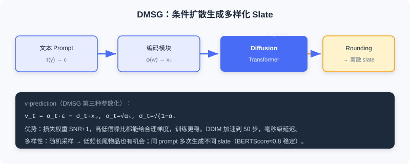

  📖
  ⏱️ ~34 min read
  🎯 Advanced

# 特征增强与多样性优化

> 📝 **Before You Continue:** 先读完 [10.1](./diffusion-basics.md) 与 [10.2](./diffusion-augmentation.md)——本节的 AsymDiffRec、DMSG 把去噪能力从「增强数据」进一步用到「增强特征」与「优化结果」。

[10.2](./diffusion-augmentation.md) 用扩散生成伪交互缓解数据稀疏与冷启动。本节从另两角度探讨扩散的实际价值： **特征增强** 与 **多样性优化**。

工业推荐中， **特征缺失** 普遍——用户画像不完整、物品属性缺失，直接拉低预测质量。另一方面，传统确定性推荐倾向推荐相似内容， **多样性不足** 损害体验。扩散模型为两者提供新思路：去噪天然适合处理不完整输入，随机采样机制为多样性提供内在支持。本节介绍两种已上线方法： **AsymDiffRec** 用不对称扩散做特征补全， **DMSG** 用条件扩散生成多样化推荐列表。

读完本节，你将能够：

- **描述**AsymDiffRec 的「离散前向 + 潜在反向」不对称设计及其两类损失
- **解释** 为何离散特征 dropout 比高斯噪声更贴合推荐的真实缺失
- **复述**DMSG 的 slate 生成流程与 v-prediction 参数化
- **评析** 扩散模型在推荐的适用边界（延迟、配套基础设施）
- 完成 4 道分层练习题

---

## 10.3.0 从「增强数据」到「增强特征与结果」

已有扩散推荐（如 DiffRec）沿用 CV 的标准做法：对称前向/反向都用高斯噪声。但推荐输入特征多为 **离散** 的（用户 ID、性别、物品类别），对离散特征潜在表示加连续高斯噪声，得到的加噪表示并不代表另一个真实样本——对高斯噪声鲁棒 ≠ 对推荐真实噪声鲁棒。且对称过程可能让模型过度关注噪声重建、忽略个性化信息。

> 💡 **Key Insight:** 把扩散「照搬」到推荐会水土不服。本节的两种方法都**针对推荐实际痛点改造扩散过程**——而非简单套用图像范式。这是扩散落地推荐的普遍智慧。

### 🧠 Mental Model: 拼图缺失 vs 模糊照片

> 标准扩散像给「清晰照片」加雾（高斯噪声），去雾即可。但推荐的特征缺失更像**拼图少了几块**——不是模糊，是结构性空缺。AsymDiffRec 的离散 dropout 正是模拟「少几块」，比加雾更贴近真实。

---

## 10.3.1 特征增强：AsymDiffRec

AsymDiffRec 针对两个痛点提出不对称扩散： **离散数据空间不匹配** （高斯噪声不代表真实样本）与 **个性化信息损失** （对称过程重噪声轻个性化）。其核心：前向用 **离散特征 dropout** 替代高斯噪声，反向从原始特征空间切到潜在表示空间，并用任务导向辅助损失保留个性化。

### 离散前向过程

给定 $N$ 个特征的样本 $\boldsymbol{x}_0 = \{x_1, \ldots, x_N\}$，前向执行 $T$ 步特征 dropout，每步随机丢一个特征，得加噪序列 $\{\boldsymbol{x}_1, \ldots, \boldsymbol{x}_T\}$。扩散步数 $T \sim \text{Uniform}(0, N)$。

关键：经 $T$ 步后 $\boldsymbol{x}_T$ 是缺失 $T$ 个特征的样本——与线上特征缺失高度一致（采集不全、隐私设置、服务故障）。故 dropout 作为「噪声」比高斯更贴合实际。

### 不对称反向过程

AsymDiffRec 的关键创新：反向与前向 **不在同一空间**。前向在原始特征空间（dropout），反向直接在 **潜在表示空间** 完成。设特征提取器 $h(\cdot)$，对加噪样本 $\boldsymbol{x}_T$ 先提取 $\boldsymbol{z}_T = h(\boldsymbol{x}_T)$，去噪函数 $g(\cdot)$ 以 $\boldsymbol{z}_T$ 与步长嵌入 $\boldsymbol{s}$ 为输入生成去噪表示：

$$\boldsymbol{z}_0' = g([\boldsymbol{s}, \boldsymbol{z}_T])$$

步长嵌入 $\boldsymbol{s} = [0,1,1,\ldots,0,1]$ 是二值向量，$1$ 表示对应特征缺失，为去噪提供缺失位置信息。训练用重建损失驱动：

$$\mathcal{L}_{\text{recon}} = \|\boldsymbol{z}_0' - \boldsymbol{z}_0\|^2, \quad \boldsymbol{z}_0 = h(\boldsymbol{x}_0)$$

不对称优势：若在原始空间反向（重建缺失特征再送提取器），会经历两次信息损失（反向重建 + 特征提取）；直接在潜在空间反向避免此问题——推荐最终用的正是潜在表示。

### 任务导向的辅助损失

仅重建损失不足以保证保留个性化。AsymDiffRec 引入辅助任务损失，直接基于去噪表示预测：

$$\mathcal{L}_{\text{aux}} = -y \log f(\boldsymbol{z}_0') - (1 - y) \log(1 - f(\boldsymbol{z}_0'))$$

$f(\cdot)$ 为预测头，$y$ 为真实标签。确保去噪表示不仅在 L2 接近完整表示，下游预测也保持良好。

**训练流程** ：① 采样 $T\sim\text{Uniform}(0,N)$；② 离散前向得 $\boldsymbol{x}_T$；③ 不对称反向得 $\boldsymbol{z}_0'$；④ 联合优化 $\mathcal{L} = \mathcal{L}_{\text{main}} + \mathcal{L}_{\text{recon}} + \mathcal{L}_{\text{aux}}$。

**推理流程** ：与多数扩散推荐不同，AsymDiffRec 推理也用扩散模块。线上输入 $\boldsymbol{x}_0$ 常缺失特征，直接当「加噪样本」，用步长嵌入 $\boldsymbol{s}$ 标缺失位置，去噪生成补全表示 $\boldsymbol{z}_0' = g([\boldsymbol{s}, h(\boldsymbol{x}_0)])$。因去噪函数是两层简单网络，对延迟影响极小。

> 📊 **Data Point:** AsymDiffRec 在工业离线实验中，AUC 相对提升 +0.1%、UAUC +1.68%，优于 CDAE、MultiVAE、自监督学习、DiffRec 等。消融显示重建损失与辅助任务损失**缺一不可**——去掉辅助损失后 AUC 甚至低于基线，说明保留个性化信息至关重要。

---

## 10.3.2 多样性优化：DMSG

音乐播放列表、电商套装等场景需生成一组物品（ **slate** ）供整体消费，要考虑物品间协调性与整体质量，是组合优化难题（候选组合数指数级）。传统方法假设用户只与 slate 中一个物品交互（简化为单物品推荐），且确定性检索对相同输入总返回相同结果，缺乏多样性。

**DMSG** （Diffusion Model for Slate Generation）把 slate 生成建模为条件生成问题，用扩散从文本 prompt 直接生成完整物品 slate。含三核心组件：

1. **编码模块**——把离散物品序列 $\boldsymbol{w}=[w_1,\ldots,w_n]$ 经嵌入函数 $\phi$ 转为连续表示 $\boldsymbol{x}_0 = [\phi(w_1), \ldots, \phi(w_n)] \in \mathbb{R}^{n \times d}$。采用预训练固定编码器，不与扩散联合训，提高稳定性、目录更新时只需更新编码器。
2. **条件模块**——用 Transformer 编码层把文本 prompt $y$ 映射为条件 $\boldsymbol{c} = \tau(y)$，经 cross-attention 注入扩散。
3. **扩散过程模块**——核心生成模块，前向对 slate 潜在表示加噪，反向在条件 $\boldsymbol{c}$ 引导下恢复；去噪网络为 Diffusion Transformer，用 cross-attention 融合条件。

### v-prediction 参数化

[10.1](./diffusion-basics.md) 介绍过 ε-prediction 与 x₀-prediction，DMSG 采用第三种： **v-prediction**——预测「速度」$\boldsymbol{v} = \alpha_t \boldsymbol{\epsilon} - \sigma_t \boldsymbol{x}_0$，其中 $\alpha_t=\sqrt{\bar{\alpha}_t}, \sigma_t=\sqrt{1-\bar{\alpha}_t}$。由 $\boldsymbol{v}$ 可反推 $\hat{\boldsymbol{x}}_0 = \alpha_t \boldsymbol{x}_t - \sigma_t \hat{\boldsymbol{v}}_\theta$ 与 $\hat{\boldsymbol{\epsilon}} = \sigma_t \boldsymbol{x}_t + \alpha_t \hat{\boldsymbol{v}}_\theta$。其优势：损失权重为「SNR+1」，高低信噪比区域都给合理梯度，训练更稳。损失：

$$\mathcal{L}_{\text{DMSG}} = \mathbb{E}_{t, \boldsymbol{x}_0, \boldsymbol{v}}\left[\|\boldsymbol{v} - \boldsymbol{v}_\theta(\sqrt{\bar{\alpha}_t}\boldsymbol{x}_0 + \sqrt{1-\bar{\alpha}_t}\boldsymbol{\epsilon}, t, \boldsymbol{c})\|^2\right]$$

### 生成与解码

推理时：① 编码 prompt $\boldsymbol{c}=\tau(y)$；② $\boldsymbol{x}_T\sim\mathcal{N}(0,I)$；③ 迭代条件去噪；④ 最终连续表示经 **Rounding** 转离散物品序列（每位置取最近物品）。为满足延迟，DMSG 用 **DDIM** 加速，把推理步从训练时上千减到 50，单次生成毫秒级。

### 多样性分析

DMSG 在多样性上具天然优势，源于随机采样机制：

- **物品流行度分布**——相比 BM25 等确定性检索偏向高频物品，扩散在连续潜在空间的随机采样让低流行度但语义相关的物品也有机会被选中。
- **生成结果新鲜度**——相同 prompt 每次生成不同 slate，但质量相近（BERTScore 约 0.8 稳定），且每次含大量新物品。用户反复请求同主题也获不同列表，助内容发现与留存。

> **Analysis:** AsymDiffRec 与 DMSG 共同点——针对推荐实际需求**改造扩散过程**而非套用图像范式。前者不对称设计解决特征缺失，后者用随机采样解决多样性。两者均已线上验证。但扩散模型距离直接替代判别式在线服务仍有距离：多步去噪的延迟、端到端生成式所需的语义 ID 等配套基础设施，仍是制约大规模落地的现实因素。扩散与 Transformer 的互补、与 RL/多模态的融合，仍是开放方向。

---

## ⚠️ Common Mistakes in 10.3

| # | Mistake | Example | Why It's Wrong | Fix |
|---|---------|---------|---------------|-----|
| 1 | 照搬对称高斯扩散到推荐 | 「和图像一样加高斯噪声去噪」 | 推荐特征是离散的，高斯不代表真实缺失 | 用 AsymDiffRec 的离散 dropout |
| 2 | 忽略个性化信息损失 | 只用重建损失训练扩散 | 模型重噪声轻个性化，AUC 反降 | 加任务导向辅助损失 L_aux |
| 3 | 以为 DMSG 只用 ε/x₀ 预测 | 「DMSG 套用 DDPM 的 ε-pred」 | DMSG 用 v-prediction 更稳 | 识别 v-pred（SNR+1 权重） |
| 4 | 高估扩散替代判别式 | 「用扩散全面替代排序」 | 多步去噪延迟高、需语义 ID 配套 | 视扩散为增强工具，非端到端替代 |

---

## 本章小结

### 📌 Key Takeaways

| Concept | Key Points | Why It Matters |
|---------|-----------|----------------|
| AsymDiffRec | 离散前向(dropout)+潜在反向+辅助损失 | 解决工业特征缺失，已上线 |
| 不对称设计 | 前向原始空间、反向潜在空间 | 避免两次信息损失 |
| DMSG | 条件扩散 + v-pred + DDIM | 生成多样化 slate，已上线 |
| 多样性来源 | 随机采样→长尾/新鲜度 | 突破确定性检索趋同 |
| 适用边界 | 延迟/配套基建制约大规模落地 | 扩散是工具，非端到端替代 |

### ❓ FAQ

**Q1: 为什么 AsymDiffRec 用离散 dropout 而非高斯噪声？**
> A: 推荐特征是离散的，高斯加噪得到的表示不代表另一个真实样本；而线上特征缺失是「结构性空缺」，dropout 模拟的正是这种真实缺失，去噪即补全。

**Q2: DMSG 的 v-prediction 好在哪？**
> A: v = αₜε − σₜx₀，其损失权重为 SNR+1，在高/低信噪比区域都给合理梯度，训练比 ε/x₀-pred 更稳。

**Q3: 扩散能直接替代判别式排序吗？**
> A: 目前难——多步迭代去噪带来延迟，且端到端生成式需语义 ID 等配套基建。本章方法是数据/特征/多样性的增强工具，与 Transformer 互补。

### 🔗 前后关联

- **10.1** （基础）AsymDiffRec 的不对称、DMSG 的 v-pred 与 DDIM 都建立在 10.1 机制上。
- **10.2** （数据增强）同属「扩散作为生成工具」主线，从数据→特征/结果。
- **5.3 / 9.x** （生成式主线）扩散是生成式家族连续空间分支，与自回归、显式推理互补共进。

---

## Practice Problems

Work through all problems in order — they get progressively harder. Each has a complete solution you can reveal after trying yourself.

---

**Problem 10.3.1 — 不对称设计判断** 🟢 Easy

判断下列描述属于 AsymDiffRec 的「前向」还是「反向」空间：
- (a) 在原始特征空间随机丢弃特征
- (b) 在潜在表示空间用 g([s, z_T]) 去噪
- (c) 步长嵌入 s 标记哪些特征缺失

💡 Solution (click to reveal)

**Approach:** 对照不对称设计。

- (a) 前向（原始特征空间，离散 dropout）
- (b) 反向（潜在表示空间）
- (c) 反向（步长嵌入用于潜在空间去噪）

**Key points:**
- 前向=原始空间 dropout；反向=潜在空间去噪。
- 不对称即「两阶段不同空间」。

---

**Problem 10.3.2 — 辅助损失作用** 🟢 Easy

AsymDiffRec 去掉 $\mathcal{L}_{\text{aux}}$ 后 AUC 甚至低于基线。请解释原因。

💡 Solution (click to reveal)

**Approach:** 从个性化信息角度分析。

仅用重建损失 $\mathcal{L}_{\text{recon}}$ 时，去噪表示只在 L2 距离上接近完整表示，但未必保留对下游预测有用的 **个性化信息**——模型可能重噪声重建、轻个性化。辅助损失 $\mathcal{L}_{\text{aux}}=-y\log f(\boldsymbol{z}_0')$ 强制去噪表示在预测任务上也好，故去掉后个性化信息流失，AUC 反降。

**Key points:**
- 重建 ≠ 任务性能好。
- 辅助损失保个性化，缺一不可。

---

**Problem 10.3.3 — v-prediction 推导** 🟡 Medium

已知 $\alpha_t=\sqrt{\bar{\alpha}_t}=0.8,\ \sigma_t=\sqrt{1-\bar{\alpha}_t}=0.6$，预测得 $\hat{\boldsymbol{v}}_\theta$。请写出由 $\hat{\boldsymbol{v}}_\theta$ 反推 $\hat{\boldsymbol{x}}_0$ 与 $\hat{\boldsymbol{\epsilon}}$ 的公式，并说明 v-pred 相比 ε-pred 的稳定性来源。

💡 Solution (click to reveal)

**Approach:** 套用 v-pred 反推式。

$$\hat{\boldsymbol{x}}_0 = \alpha_t \boldsymbol{x}_t - \sigma_t \hat{\boldsymbol{v}}_\theta = 0.8\,\boldsymbol{x}_t - 0.6\,\hat{\boldsymbol{v}}_\theta$$

$$\hat{\boldsymbol{\epsilon}} = \sigma_t \boldsymbol{x}_t + \alpha_t \hat{\boldsymbol{v}}_\theta = 0.6\,\boldsymbol{x}_t + 0.8\,\hat{\boldsymbol{v}}_\theta$$

**稳定性来源：** v-pred 的损失权重为「SNR+1」，在信噪比高（t 小）与低（t 大）区域都给合理梯度，不像 ε-pred 在高噪声区梯度不稳。

**Key points:**
- v 是 ε 与 x₀ 的线性组合，可双向反推。
- SNR+1 权重是其训练更稳的关键。

---

**Problem 10.3.4 — 设计多样性生成** 🔴 Hard

你要为音乐 App 设计 DMSG 式 slate 生成。请写出：① 三组件（编码/条件/扩散）各自的输入输出；② 为何用 v-prediction 与 DDIM；③ 如何验证「多样性」提升（两个指标）。

💡 Solution (click to reveal)

**Approach:** 套用 DMSG 设计。

1. **三组件** ：
   - 编码：物品序列 $\boldsymbol{w}$ → $\phi(\boldsymbol{w})=\boldsymbol{x}_0\in\mathbb{R}^{n\times d}$（固定预训练编码器）。
   - 条件：文本 prompt $y$ → $\boldsymbol{c}=\tau(y)$（Transformer 编码）。
   - 扩散：条件 $\boldsymbol{c}$ 引导，Diffusion Transformer 去噪生成 slate 潜在表示。
2. **为何 v-pred** ：损失权重 SNR+1，高低信噪比都稳； **为何 DDIM** ：把推理步从上千减到 50，毫秒级延迟满足在线。
3. **多样性验证** ：① 流行度分布——对比 BM25，看低频长尾物品占比是否上升；② 新鲜度——同 prompt 多次生成，看 slate 间差异（新物品比例）且质量（BERTScore≈0.8）稳定。

**Key points:**
- 随机采样是多样性内在来源。
- v-pred+DDIM 兼顾稳定与延迟。

---

**🏆 Challenge: 适用边界论证**

本章指出扩散模型「距离直接替代判别式在线服务仍有距离」。请写一段 200 字内，列举 **两个** 制约扩散大规模落地推荐的现实因素，并提出一个你认为最有潜力的融合方向（结合 5.3/9.x 的生成式主线）。

💡 Hint

制约因素：① 多步迭代去噪的延迟开销（即使 DDIM 仍高于单步判别式）；② 端到端生成式推荐所需的语义 ID / 量化等配套基建尚未普及。融合方向：扩散的去噪生成能力 + Transformer 的序列建模（如 DreamRec 条件扩散）+ 强化学习对齐（呼应 9.2 的 GRPO），形成「生成增强 + 可控对齐」的混合架构；或与 9.x 的语义索引结合，让扩散在语义 ID 空间去噪。

