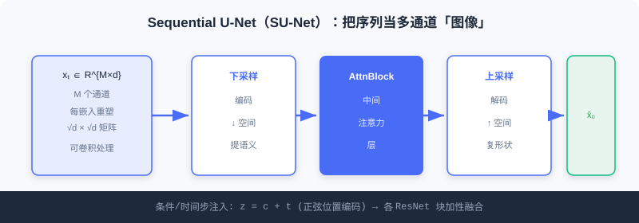
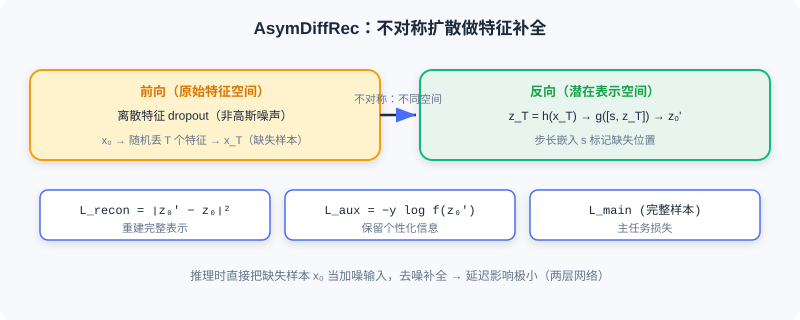

  📖
  ⏱️ ~32 min read
  🎯 Advanced

# 基于扩散的数据增强

> 📝 **Before You Continue:** 先读完 [10.1](./diffusion-basics.md) 的前向/反向过程、条件生成与引导——本节的 DiffuASR、Diff-MSR 都是把「去噪生成」当作增强工具。

推荐系统面临的核心挑战是 **数据稀疏性** ：交互数据天然长尾分布——少数热门物品积累大量交互，绝大多数物品记录极少。对新用户（冷启动）和低活跃用户，历史匮乏使偏好建模困难。传统增强（随机裁剪、重排）生成的样本质量有限，难捕捉潜在兴趣模式。

扩散模型的生成能力为此提供新思路：学习数据分布后，可生成高质量伪交互序列扩充训练数据。本节介绍两种代表： **DiffuASR** 生成用户历史的「前序」序列； **Diff-MSR** 利用跨场景知识迁移解决冷启动。

读完本节，你将能够：

- **描述**DiffuASR 的三组件框架（前向/反向/引导）与 SU-Net 的序列处理
- **解释** 舍入（Rounding）如何把连续嵌入映射回离散物品 ID
- **复述**Diff-MSR 的「狗像猫」跨场景迁移直觉与四阶段流程
- **对比** 两类引导（Classifier-Guided / Classifier-Free）在 DiffuASR 中的应用
- 完成 4 道分层练习题，巩固扩散做数据增强的主线

---

## 10.2.0 为什么用扩散做增强

序列推荐通过建模用户历史交互预测下一个物品，但面临 **数据稀疏性** （大量用户-物品仅极少交互）与 **长尾用户问题** （多数用户历史短于 10 条，效果显著下降）。传统增强难以生成「语义一致」的伪序列。

扩散模型的优势：它不是简单变换已有样本，而是 **学习分布后生成新样本**——生成的伪交互在语义上与真实历史一致，却补充了缺失的「前序」信息。

### 🧠 Mental Model: 补写回忆录

> 短序列用户像只记得最近几页的日记。DiffuASR 不是把现有页复印几份，而是读懂这几页的文风与主题，帮你**补写前面可能经历的几页**——补写内容与现有日记连贯，却让传记更完整。

---

## 10.2.1 序列增强：DiffuASR

DiffuASR 的核心思想：给定原始交互序列 $S_{\text{raw}}$，生成对应的「前序」序列 $S_{\text{aug}}$（用户在 $S_{\text{raw}}$ 之前可能产生过的交互）。拼接后得更长更完整的历史，用于训练下游序列推荐模型。

### 整体框架

DiffuASR 含三个关键组件：

1. **前向过程**——将目标增强序列的物品嵌入逐步加噪。数据是嵌入矩阵 $\boldsymbol{x}_0 = [\boldsymbol{e}_{-M}, \ldots, \boldsymbol{e}_{-1}] \in \mathbb{R}^{M \times d}$，$M$ 为增强长度，$d$ 为嵌入维度。
2. **反向过程**——从噪声恢复嵌入序列 $\hat{\boldsymbol{x}}_0$，并通过 **舍入（Rounding）** 映射回离散物品 ID：

$$v_j = \arg\max_{v_i \in \mathcal{V}} \text{sim}(\hat{\boldsymbol{e}}_j, \boldsymbol{e}_i)$$

（余弦相似度，最近物品即输出）。这一步把连续生成转为可解释的物品序列。
3. **引导过程**——确保生成序列与原始序列语义一致。引导信息来自原始序列的聚合表示 $\boldsymbol{c} = \text{Avg}(\boldsymbol{e}_1, \ldots, \boldsymbol{e}_{n_u})$。

### Sequential U-Net

标准 U-Net 为图像设计，直接用于序列嵌入会丢失序列维度信息。DiffuASR 提出 **SU-Net** ：

1. **序列维度当通道** ：把 $\boldsymbol{x}_t \in \mathbb{R}^{M \times d}$ 视为 $M$ 个通道的「图像」。
2. **重塑嵌入维度** ：每个 $d$ 维嵌入重塑为 $\sqrt{d} \times \sqrt{d}$ 矩阵。

于是输入变成 $M$ 通道、$\sqrt{d} \times \sqrt{d}$ 的张量，可自然卷积；各通道独立处理，保留序列位置信息。SU-Net 主体含下采样、中间注意力层、上采样；时间步 $t$ 与条件 $\boldsymbol{c}$ 通过加性融合注入各 ResNet 块：

$$\boldsymbol{z} = \boldsymbol{c} + \boldsymbol{t}$$

$\boldsymbol{t}$ 为 $t$ 的正弦位置编码，$\boldsymbol{z}$ 经线性变换后加到各层输入，控制去噪方向。

### 引导策略

DiffuASR 提供两种引导，对应 [10.1](./diffusion-basics.md) 的两种条件生成方法：

**1. Classifier-Guided**——用预训练序列推荐模型当「分类器」。因 $S_{\text{aug}}$ 是 $S_{\text{raw}}$ 前序，$S_{\text{raw}}$ 首物品 $v_1$ 可视为 $S_{\text{aug}}$ 的「下一个物品」，引导目标是让生成序列正确预测 $v_1$：

$$\hat{\boldsymbol{\epsilon}} = \boldsymbol{\epsilon}_\theta(\boldsymbol{x}_t, t, \boldsymbol{c}) - \gamma \cdot \sqrt{1-\bar{\alpha}_t} \nabla_{\boldsymbol{x}_t} \log p_\phi(v_1 | S_{\text{aug}})$$

**2. Classifier-Free**——训练时随机丢弃条件向量，推理时线性组合：

$$\hat{\boldsymbol{\epsilon}} = (1 + \gamma) \cdot \boldsymbol{\epsilon}_\theta(\boldsymbol{x}_t, t, \boldsymbol{c}) - \gamma \cdot \boldsymbol{\epsilon}_\theta(\boldsymbol{x}_t, t, \boldsymbol{e}_{\text{padding}})$$

更简洁高效，实际应用更常用。

### 训练与增强流程

**训练** ：从原数据集选长度 > $M$ 的序列，前 $M$ 个作增强目标，其余作 $S_{\text{raw}}$，用真实前序监督扩散学习。**增强** ：每用户序列执行引导反向去噪，生成前序 $\hat{S}_{\text{aug}}$，与原序列拼接形成增强训练数据 $\mathcal{D}_A$。DiffuASR 生成的序列可直接训练任何序列推荐模型，无需改架构，通用性强。

> **Analysis:** DiffuASR 的价值在于「高质量 + 通用」——生成的伪序列语义一致，且与下游模型解耦。代价是需训练扩散+舍入，且生成质量依赖条件引导的强度 γ。

---

## 10.2.2 跨场景增强：Diff-MSR

多场景推荐（MSR）中，不同场景数据量悬殊：热门场景海量交互，新兴/垂直（冷启动）场景数据稀疏。导致冷启动场景参数难充分学习，且联合训练时易受热门场景 **负迁移** 影响。

Diff-MSR 的洞察来自 CV： **一张模糊的狗图可能像猫**。在推荐嵌入空间，数据丰富场景的用户-物品嵌入适当加噪后，其「轮廓」可能与冷启动场景样本相似。借此从丰富场景「借」知识增强冷启动。

### 整体框架（四阶段）

1. **预训练**——用全场景数据训多场景骨干（如 MMoE），得共享嵌入层（跨场景通用表示）。
2. **扩散**——对每个冷启动场景训两个扩散模型（正样本/负样本），输入为用户特征与物品属性嵌入拼接 $\boldsymbol{e} = [\boldsymbol{e}_1 \| \cdots \| \boldsymbol{e}_M]$，学习该场景数据分布。
3. **分类**——训二分类器判断（加噪）嵌入来自冷启动还是丰富场景。对丰富场景样本不同程度加噪，若被误判为冷启动，说明其「轮廓」相似，可被利用。
4. **微调**——用三类数据微调冷启动模型：误分类丰富样本去噪得的伪样本、纯高斯生成的伪样本、冷启动真实数据。

分类阶段是关键：对丰富场景嵌入 $\boldsymbol{z}_0$ 不同程度加噪得 $\boldsymbol{z}_t$，若被误判为冷启动，说明这「模糊」样本在嵌入空间与冷启动相似——用冷启动扩散模型对 $\boldsymbol{z}_t$ 去噪，即得高质量冷启动样本。Diff-MSR 设计 **分段噪声策略** ：前几步保持 $\beta_t$ 较小以保留结构，之后线性增长——轻度加噪仍保留场景特征供判断，重度加噪确保收敛到高斯。

> 💡 **Key Insight:** 两类方法共同点——用扩散生成高质量伪交互数据，并用**条件控制**保证语义一致性。DiffuASR 借历史条件生成前序，Diff-MSR 借场景分布借力跨域。下一节看扩散在特征与多样性上的应用。

---

## ⚠️ Common Mistakes in 10.2

| # | Mistake | Example | Why It's Wrong | Fix |
|---|---------|---------|---------------|-----|
| 1 | 以为扩散增强=复制样本 | 「把短序列复制几份当增强」 | 复制不增信息，难补前序 | 用扩散生成语义一致的新前序 |
| 2 | 忽略舍入步骤 | 直接用连续嵌入当推荐 | 下游模型要离散物品 ID | 用 Rounding 映射最近物品 |
| 3 | 混淆两类引导 | 「DiffuASR 必须用分类器引导」 | Classifier-Free 更常用更简洁 | 两者皆可，常用 Free |
| 4 | 误用 Diff-MSR 跨域 | 「冷启动直接用丰富场景原始样本」 | 分布不同会负迁移 | 加噪→误判→去噪生成伪样本 |

---

## 本章小结

### 📌 Key Takeaways

| Concept | Key Points | Why It Matters |
|---------|-----------|----------------|
| DiffuASR | 前向/反向/引导三组件 + SU-Net + Rounding | 生成前序序列扩充短序列用户 |
| SU-Net | 序列当多通道图像 + 条件/时间步加性融合 | 保留序列维度信息 |
| 两类引导 | Classifier / Classifier-Free | 保证生成与原始语义一致 |
| Diff-MSR | 四阶段 + 分段噪声 + 「狗像猫」迁移 | 跨场景借力缓解冷启动 |
| 共同主线 | 生成伪交互 + 条件控语义 | 数据增强型扩散应用 |

### ❓ FAQ

**Q1: DiffuASR 生成的「前序」有什么用？**
> A: 短序列用户历史不足，预测下一物品难。生成语义一致的前序 $S_{\text{aug}}$ 与原序列拼接，得到更长历史，提升下游序列推荐效果，且不与下游模型耦合。

**Q2: 为什么舍入（Rounding）必要？**
> A: 扩散在连续嵌入空间去噪，但推荐要离散物品 ID 才能进下游模型。Rounding 取嵌入空间最近物品，把连续结果转回可解释 ID。

**Q3: Diff-MSR 为何用「误判」筛选？**
> A: 丰富场景样本加噪后若被分类器误判为冷启动，说明其轮廓与该场景相似——这样的样本去噪后才是高质量冷启动伪样本，避免直接跨域的负迁移。

### 🔗 前后关联

- **10.1** （基础）DiffuASR 的引导、SU-Net 的条件注入、Diff-MSR 的扩散均建立在 10.1 机制上。
- **10.3** （应用）从「增强数据」转向「增强特征与多样性」。
- **5.3 / 9.x** （生成式主线）扩散是生成式家族的连续空间分支，与自回归/推理互补。

---

## Practice Problems

Work through all problems in order — they get progressively harder. Each has a complete solution you can reveal after trying it yourself.

---

**Problem 10.2.1 — 框架归类** 🟢 Easy

把下列组件归入 DiffuASR 三组件（前向 / 反向 / 引导）之一：
- (a) 把物品嵌入矩阵逐步加噪
- (b) 用 Avg(原始序列嵌入) 作为条件 c
- (c) 舍入映射回离散物品 ID

💡 Solution (click to reveal)

**Approach:** 对照三组件职责。

- (a) 前向过程
- (b) 引导过程（条件来自原始序列聚合）
- (c) 反向过程（去噪后 Rounding）

**Key points:**
- 前向=加噪；反向=去噪+舍入；引导=控语义一致。

---

**Problem 10.2.2 — 舍入计算** 🟢 Easy

去噪得某位置连续嵌入 $\hat{\boldsymbol{e}}_j$，物品词表 $\mathcal{V}$ 中三个候选的余弦相似度为：$\text{sim}(\hat{\boldsymbol{e}}_j, \boldsymbol{e}_A)=0.91$、$\text{sim}(\hat{\boldsymbol{e}}_j, \boldsymbol{e}_B)=0.62$、$\text{sim}(\hat{\boldsymbol{e}}_j, \boldsymbol{e}_C)=0.78$。请写出 Rounding 选出的物品。

💡 Solution (click to reveal)

**Approach:** 取相似度最大的候选。

$$v_j = \arg\max_{v_i} \text{sim}(\hat{\boldsymbol{e}}_j, \boldsymbol{e}_i)$$

最大值 0.91 对应 $\boldsymbol{e}_A$ → 输出物品 A。

**Key points:**
- Rounding = 在词表中找最近邻。
- 把连续嵌入「解码」为离散 ID。

---

**Problem 10.2.3 — SU-Net 设计** 🟡 Medium

标准 U-Net 直接用于序列嵌入会丢什么？SU-Net 如何通过「序列当通道」与「嵌入重塑」解决？请说明条件与时间步如何注入。

💡 Solution (click to reveal)

**Approach:** 对照 SU-Net 设计。

**问题：** U-Net 为图像设计，直接吃序列嵌入 $\boldsymbol{x}_t\in\mathbb{R}^{M\times d}$ 会丢失序列（位置）维度信息。

**解决：**
1. 把 $M$ 个位置当作 $M$ 个 **通道** ，序列维度转为通道维；
2. 每个 $d$ 维嵌入重塑为 $\sqrt{d}\times\sqrt{d}$ 矩阵，形成 $M$ 通道 $\sqrt{d}\times\sqrt{d}$ 张量，可用卷积且各通道（位置）独立保留。

**注入：** 时间步 $t$ 的正弦位置编码 $\boldsymbol{t}$ 与条件 $\boldsymbol{c}$ 加性融合 $\boldsymbol{z}=\boldsymbol{c}+\boldsymbol{t}$，经线性变换加到各 ResNet 块输入，控制去噪方向。

**Key points:**
- 核心是「保序列维度」。
- 条件/时间步加性融合贯穿各层。

---

**Problem 10.2.4 — 设计跨场景增强** 🔴 Hard

某平台有「热门电商」与「新上线二手车」两场景，二手车数据极稀疏。请用 Diff-MSR 思路写四阶段流程，并说明「分段噪声策略」为何重要、以及用哪类伪样本微调冷启动模型。

💡 Solution (click to reveal)

**Approach:** 套用 Diff-MSR 四阶段。

1. **预训练** ：全场景训 MMoE 得共享嵌入层。
2. **扩散** ：为二手车场景训正/负样本两个扩散模型，输入为用户+物品属性拼接嵌入。
3. **分类** ：训二分类器判嵌入来自二手车还是电商；对电商样本不同程度加噪，被误判为二手车的即「轮廓相似」可利用。
4. **微调** ：用三类数据——误分类电商样本去噪得的伪样本、纯高斯生成的伪样本、二手车真实数据。

**分段噪声重要性：** 前期小 β 保留结构使分类器能判「轮廓」，后期线性增长确保最终收敛高斯——否则轻度加噪不足以产生可迁移样本、或重度加噪破坏结构。

**Key points:**
- 「狗像猫」：电商加噪误判为二手车即可借力。
- 伪样本 + 真实数据共同微调，防负迁移。

---

**🏆 Challenge: 增强质量评估**

DiffuASR 生成的伪序列若引导强度 γ 过大，可能过度贴合 $S_{\text{raw}}$ 而缺乏多样性；γ 过小则语义不一致。请写一段 200 字内，设计两个可计算的指标来评估增强数据质量（一个测语义一致性、一个测多样性），并说明如何据此调 γ。

💡 Hint

一致性：生成前序与 $S_{\text{raw}}$ 在嵌入空间的相似度（如平均余弦），或下游模型在「原+增强」上相对于「仅原」的精度提升。多样性：增强序列间的两两差异（如去重率、嵌入方差），或生成前序不同于训练集中已有前序的比例。γ 过大→一致性高但多样性低，γ 过小→反之；在两者 Pareto 前沿选平衡点的 γ。

