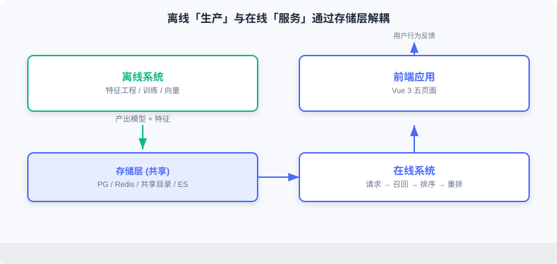
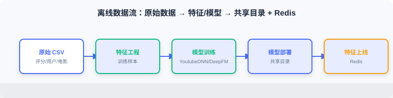
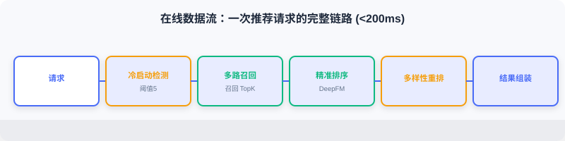

  📖
  ⏱️ ~22 min read
  🎯 Intermediate

# 系统架构设计

> 📝 **Before You Continue:** 请先读完 [11.1](./project-intro.md) 的技术选型与离/在线差异。本节把那些选型落到组件与数据流上，建立系统的宏观心智模型。

生产级推荐系统由多个子系统协同工作。本节介绍整体设计、核心组件，以及数据如何在组件之间流转。这是后面所有实现章节的「地图」。

读完本章，你将能够：

- 描述 **离线系统** （生产）与 **在线系统** （服务）的职责边界与解耦方式
- 指出版局架构图中数据存储层、离线流水线、在线流水线、前端四类组件
- 解释离线数据流（CSV → 特征/模型 → 共享目录 + Redis）与在线数据流（请求 → 召回 → 排序 → 重排 → 组装）
- 说清四个关键设计决策：漏斗架构、多路召回融合、冷启动处理、特征存储计算分离
- 完成 4 道分层练习题

---

## 11.2.0 离线与在线系统

工业级推荐架构可划分为两部分： **离线系统** 与 **在线系统**。

**离线系统** 负责「生产」：处理全量历史数据、训练模型、计算物品向量与相似度矩阵。计算时间充裕（小时级甚至天级），追求模型质量而非响应速度，产出模型文件、向量索引、特征字典等。

**在线系统** 负责「服务」：接收实时请求、调用模型、组装推荐结果并返回。响应时间有限（百毫秒级），需在质量与延迟间平衡，依赖离线产出的模型与特征。

离线系统定期运行（每天/每周），将产出写入共享存储；在线系统从共享存储加载。两者通过 **存储层解耦** ：离线可用更复杂算法、更大体量；在线专注低延迟服务。

下面用交互演示直观感受离线「生产」与在线「消费」之间的数据与模型流转：从原始评分数据出发，经特征工程、训练、向量预计算，落到存储层，再被在线服务加载并用于实时推理。点击「下一步」观察每一步的产出物如何交接。

<iframe src="../viz/part11-offline-online.html?embed&vizId=part11-offline-online" style="width:100%; height:520px; border:none; display:block;" loading="lazy"></iframe>

注意第五步「存储层交接」：离线写出的 `active.json` 版本指针与物品向量，正是在线加载阶段的输入——这层解耦让离线可从容重训、在线可毫秒级服务。

---

## 11.2.1 整体架构与核心组件

系统由四类核心组件构成，下面逐一展开。

### 数据存储层

- **PostgreSQL（业务数据库）** ：存用户表（性别/年龄/职业）、电影表（标题/类型/年份/海报）、评分表（评分+时间戳）。
- **Redis（特征缓存）** ：存在线推理所需实时特征——用户画像 `user:{id}:profile`、行为序列 `user:{id}:history`、物品向量索引。
- **共享文件目录** ：存模型文件（user_model、ranking_model）、物品向量矩阵（item_embeddings.npy）、特征编码字典（vocab_dict.pkl）。
- **Elasticsearch（搜索引擎）** ：对电影标题、类型、演员建倒排索引，支撑搜索。

### 离线流水线

按顺序执行：特征工程 → 召回模型训练（YoutubeDNN）→ 排序模型训练（DeepFM）→ 模型部署 → 特征上线。详见 [11.3](./offline-pipeline.md)。

### 在线流水线

每个请求依次经过：冷启动检测 → 多路召回 → 精准排序 → 多样性重排 → 结果组装。详见 [11.4](./online-pipeline.md)。

### 前端应用

基于 Vue 3，含首页、电影详情页、搜索页、个人中心四个核心页面（[11.5](./frontend.md)）。

---

## 11.2.2 离线数据流

离线流水线把原始评分数据转化为在线可用的模型与特征：

1. **特征工程** ：从原始评分提取训练特征（用户/物品/行为序列）。
2. **召回模型训练** ：训练 YoutubeDNN 双塔，学用户/物品向量映射。
3. **排序模型训练** ：训练 DeepFM，学用户-物品对点击概率。
4. **模型部署** ：将模型文件写入共享目录供在线加载。
5. **特征上线** ：将用户画像、行为序列、物品信息写入 Redis。

离线产出物与在线需求的对应关系，是理解整个系统的关键——离线「想清楚怎么算」，在线「快速取来用」。

---

## 11.2.3 在线数据流

在线流水线处理每个用户请求，以「打开首页」为例：

1. **冷启动检测** ：判断是否为新用户（历史行为少于阈值），新用户走冷启动，否则走正常流程。
2. **多路召回** ：并行执行 YoutubeDNN 向量召回、物品相似度召回、偏好类目召回。
3. **精准排序** ：用 DeepFM 对候选 CTR 预估、按分排序。
4. **多样性重排** ：打散策略，避免连续同类/同年电影。
5. **结果组装** ：查库补全标题、海报等，组装前端响应。

整个流程目标延迟控制在 **200 毫秒** 以内。

---

## 11.2.4 关键设计决策

### 召回与排序分离（漏斗架构）

理论上可训练一个模型对全库直接打分，但性能不可行：假设库有 10 万部电影，每次请求都排序模型推理，即使每次 1ms 也需 100 秒。

因此采用 **漏斗式架构** ：召回阶段用轻模型快速筛数百候选，排序阶段用复杂模型对这数百候选精确打分。

### 多路召回与融合（Snake Merge）

单一召回策略有局限：向量召回可能漏掉模型未捕捉的相关性；协同过滤对新/小众电影覆盖不足；热门推荐缺乏个性化。融合多种策略取长补短。本项目用 **Snake Merge（蛇形合并）** ：从各路轮流取候选，确保每路都有代表进入排序。

### 冷启动处理

新用户缺乏行为，协同过滤与向量召回失效。本项目设计独立冷启动流程：①交互次数阈值检测；②若设偏好类型，优先推这些类型的优质电影；③否则用热门或 UCB 探索；④随行为积累过渡到正常流程。

### 特征存储与计算分离

在线推理对延迟敏感。若每次请求都从 PostgreSQL 查历史行为，数据库成瓶颈。故将高频特征预计算写入 Redis：用户画像注册/更新时写，行为序列每次评分后更新，物品向量离线批量写。Redis 读延迟通常 <1ms，比数据库快 1–2 个数量级。

> **Analysis:** 四个决策共同指向一个原则——**把重活放离线、把快活放在线、把热点放内存**。漏斗解决算力、融合解决覆盖、冷启动解决零样本、存储分离解决延迟。

---

## ⚠️ Common Mistakes in 11.2

| # | Mistake | Example | Why It's Wrong | Fix |
|---|---------|---------|---------------|-----|
| 1 | 单模型全库打分 | 「直接用一个模型排全库」 | 10万候选 × 推理 = 百秒级，不可服务 | 漏斗：召回缩候选、排序精打分 |
| 2 | 离线在线特征不一致 | 离线用新编码器、在线用旧 | 训练-服务错位，效果骤降 | 共享同一 vocab_dict/编码器 |
| 3 | 每请求查数据库特征 | 实时查 PG 历史行为 | 数据库成延迟瓶颈 | 高频特征预写 Redis |
| 4 | 单路召回 | 只用向量召回 | 覆盖不足、小众/新片漏召 | 多路召回 + Snake Merge 融合 |
| 5 | 冷启动与正常流混一 | 无差异对待新用户 | 新用户体验差、推荐崩 | 独立冷启动检测与三级策略 |

---

## 本章小结

### 📌 Key Takeaways

| Concept | Key Points | Why It Matters |
|---------|-----------|----------------|
| 离线/在线解耦 | 离线生产、在线服务，存储层衔接 | 质量与延迟的工程平衡 |
| 四类组件 | PG/Redis/共享目录/ES + 离线/在线/前端 | 系统的物理拼图 |
| 离线数据流 | CSV→特征→训练→部署+上线 | 训练时关注点 |
| 在线数据流 | 请求→召回→排序→重排→组装 | 服务时关注点（<200ms） |
| 四个设计决策 | 漏斗/融合/冷启动/存储分离 | 工程可行性的根基 |

### ❓ FAQ

**Q1: 离线周期跑、在线实时用，会不会「模型过期」？**
> A: 会，这是工业常态。本项目靠版本指针（active.json）做无感知热更新（见 11.3），离线重训后切换指针即可，无需停服。

**Q2: 为什么物品向量离线算、用户向量在线算？**
> A: 物品库相对静态、数量大，离线一次性算好入库；用户每次请求才确定，必须在线现算。离线建库 + 在线查，正是双塔可规模化的关键（见 2.3）。

**Q3: Snake Merge 和简单按分合并有何不同？**
> A: 按分合并易让某路（如向量召回）霸榜；Snake Merge 轮流取，保证各路代表都进排序，提升多样性与覆盖。

### 🔗 前后关联

- **11.1** 的技术选型在此落成组件与数据流。
- **11.3** 深入离线流水线的每一步实现。
- **11.4** 深入在线流水线的每一步实现。
- **2.3（双塔）**、**3.x（DeepFM）** 是召回、排序模型的算法依据。
- **4.2（多样性重排）** 解释了重排阶段打散策略的理论动机。

---

## Practice Problems

Work through all problems in order — they get progressively harder. Each has a complete solution you can reveal after trying it yourself.

---

**Problem 11.2.1 — 画出数据流** 🟢 Easy

用一句话描述：离线训练好的 `item_embeddings.npy` 从哪个组件产生、被哪个组件消费、用在在线哪个阶段？

💡 Solution (click to reveal)

**答：** 由离线流水线「模型部署」写入共享目录；在线流水线的召回服务（`RecallResourceManager`）加载它；用于 YoutubeDNN / 物品相似度召回的向量检索阶段。

**Key points:**
- 离线产出、在线消费的经典例子。
- 体现「存储层解耦」。

---

**Problem 11.2.2 — 漏斗的算力账** 🟢 Easy

库有 5 万部电影，召回用轻模型（每候选 0.1ms）筛 200 候选，排序用重模型（每候选 1ms）对 200 候选打分。若直接全库排序需多久？漏斗方案需多久？

💡 Solution (click to reveal)

**答：** 直接全库排序 = 50000 × 1ms = 50 秒。漏斗 = 召回 50000×0.1ms = 5 秒 + 排序 200×1ms = 0.2 秒 ≈ 5.2 秒。若召回可在预建索引上更快（远小于 5 秒），漏斗优势更明显。

**Key points:**
- 漏斗把「全库重模型」降为「全库轻模型 + 子集重模型」。
- 实际召回走向量索引，几乎不遍历全库（见 2.3.4）。

---

**Problem 11.2.3 — 为何特征存 Redis** 🟡 Medium

产品经理主张「用户特征直接查 PostgreSQL 就行，省得维护 Redis」。请指出风险，并量化说明为何 Redis 更合适。

💡 Solution (click to reveal)

**答：** 每次推荐请求都要读用户画像+行为序列，若查 PG（典型几 ms~十几 ms），叠加召回/排序/重排后易超 200ms 预算；且 PG 并发高时成瓶颈。Redis 内存读 <1ms，比 PG 快 1–2 个数量级，且支持 List/Hash 自然表达历史序列与画像。代价是多维护一份缓存与一致性，但延迟收益远超成本。

**Key points:**
- 在线特征「高频、低延迟、结构简单」→ 内存库天然契合。
- PG 适合持久业务数据，不适合热路径特征读取。

---

**🏆 Challenge: 给架构提一个改进** 🔴 Hard

基于本架构，提出一个在生产环境中可显著提升推荐质量或稳定性的改进点（如特征实时更新、模型 A/B、在线学习），说明它解决什么问题、需要改动哪一层（150 字内）。

💡 Hint

可选：①实时特征管道——用户评分后近实时更新 Redis 行为序列（而非仅离线批量），提升新鲜度，改动离线「特征上线」+ 在线写回；②模型 A/B——`active.json` 扩展为多版本分流，改动在线资源加载；③向量检索升级 FAISS——库超百万时替换暴力内积，改动召回服务。任选其一论证即可。

