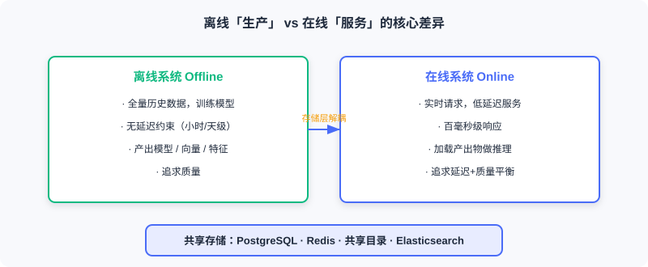
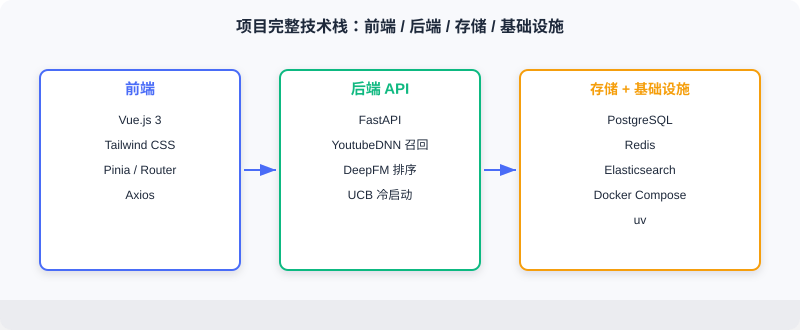

  📖
  ⏱️ ~18 min read
  🎯 Intermediate

# 项目引言与目标

> 📝 **Before You Continue:** 请先读完 [1.1](./project-intro.md) 的三阶段流水线认知。本章把前面分散的**召回、排序、重排**模块整合为一个可运行的系统，重点不在新算法，而在「如何让它们协同工作」。

很多学习者的困惑很真实：论文里的模型看得懂，代码也能跑通，但被问到「如何在真实场景部署一个推荐系统」时却无从下手。这个断层来自 **离线实验与在线服务之间的差距**——论文只回答「模型好不好」，不回答「系统怎么转」。

读完本章，你将能够：

- 描述离线评估与在线部署在六个维度上的本质差异
- 说明本项目的「功能完整 / 技术真实 / 算法落地 / 架构清晰」四大目标
- 列出后端与前端技术栈，并解释为何选 FastAPI + Vue + PostgreSQL + Redis + Elasticsearch
- 概述从系统架构到部署的五段式学习路径
- 完成 4 道分层练习题，巩固项目全貌认知

---

## 11.1.0 项目背景：从「模型好」到「系统转」

前面的章节介绍了推荐系统的各个核心模块——召回、排序、重排。它们构成了基本组件，但如何整合成一个完整系统，论文不教。你遇到的真实问题往往是：

- 当一个用户打开应用，系统如何在 **100 毫秒** 内返回推荐结果？
- 用户刚刚给一部电影打了分，这个行为 **如何立即影响** 下一次推荐？
- 模型如何部署？特征存在哪？召回和排序如何 **协同** 工作？
- 新用户第一次使用、没有任何历史，系统该 **推荐什么** ？

这些问题单从某篇论文找不到答案，必须从 **系统层面** 思考。本章就带你从零构建一个完整的电影推荐系统：用户在浏览器里浏览、搜索、评分，背后是一整套离线训练 + 在线推理 + 容器部署的工程链路。

> 💡 **Key Insight:** 工程实践的核心难点不在单个算法，而在把离散模块整合成**协同运转的系统**。论文给你零件，本章给你装配图。

### 🧠 Mental Model: 乐高 vs 成品

> 读各章算法像收集乐高零件——每块都很精巧。但用户要的不是零件，而是一艘能下水航行的船。本 Part 就是把零件拼成船、并让它真正浮起来的过程。

---

## 11.1.1 离线与在线的差异

许多读者通过竞赛或论文接触推荐系统，这类场景聚焦 **离线评估** ；而本章项目聚焦 **端到端部署**——让真实用户能用起来。二者区别显著：

| 维度 | 离线实验 | 在线系统 |
|------|----------|----------|
| 评估方式 | 离线指标（AUC、召回率） | 用户实际可交互 |
| 数据流 | 静态数据集 | 实时用户行为 |
| 延迟要求 | 无（批量处理） | 毫秒级响应 |
| 冷启动 | 通常忽略 | **必须处理** |
| 基础设施 | 本地 Python 脚本 | 数据库、缓存、搜索引擎、容器编排 |
| 最终产出 | 预测结果文件 | 可访问的 Web 应用 |

离线系统从容「生产」：处理全量历史数据、训练模型、计算向量，产出模型文件与向量索引。在线系统实时「服务」：接收请求、调模型、组装结果，在百毫秒级返回。两者通过 **存储层** （Redis、共享文件）解耦。

> **Analysis:** 这种解耦是工程上的关键权衡——离线可用更复杂的算法、更大的数据量追求质量；在线只需加载产出物、专注低延迟服务。理解这条边界，就理解了工业推荐系统的一半。

---

## 11.1.2 技术选型与数据集

**数据集** ：选 **MovieLens-1M**——推荐领域最经典的基准之一，约 100 万条评分、近 4000 部电影、6000 余名用户。规模适中：既能展示完整架构，又不会算力爆炸。还从 IMDB 补充海报、演员、导演等元数据，丰富展示。

**后端技术栈**

- **FastAPI** ：现代 Python Web 框架，原生异步、自动生成 API 文档
- **PostgreSQL** ：关系库，存用户、电影、评分等核心业务数据
- **Redis** ：内存库，缓存用户画像与实时行为序列
- **Elasticsearch** ：搜索引擎，支撑电影搜索
- **共享文件目录** ：存训练好的模型与物品向量

**前端技术栈**

- **Vue.js 3** ：渐进式 JS 框架，构建响应式界面
- **Tailwind CSS** ：CSS 框架，快速实现 UI

**模型与算法**

- **召回** ：YoutubeDNN 双塔、物品相似度召回、用户偏好类目召回
- **排序** ： **DeepFM** （融合 FM 二阶交叉 + DNN 高阶非线性）
- **重排** ：类目打散 + 年代打散的多样性策略
- **冷启动/探索** ：基于 **UCB（Upper Confidence Bound）** 平衡 exploration 与 exploitation

**基础设施**

- **Docker Compose** ：容器编排，一键启动所有服务
- **uv** ：Python 包管理器，快速装依赖

---

## 11.1.3 学习路径

本章按从宏观到微观、从离线到在线的顺序展开：

1. **系统架构设计** （[11.2](./project-architecture.md)）：宏观理解各组件、离线与在线的边界、数据如何流动。
2. **离线流水线** （[11.3](./offline-pipeline.md)）：从原始数据出发，完成特征工程、模型训练、评估、部署。
3. **在线流水线** （[11.4](./online-pipeline.md)）：构建实时推理服务，实现冷启动、多路召回、排序、重排完整链路。
4. **前端与交互** （[11.5](./frontend.md)）：设计界面，实现搜索、推荐、评分等核心功能。
5. **部署与运维** （[11.6](./deployment.md)）：用 Docker Compose 容器化部署，讨论监控、日志、性能优化。

每部分都配有完整代码。读者可边读边实践，也可先跑通项目再逐步理解。

> 📊 **Data Point:** 本项目全部可运行代码位于 `datawhalechina/fun-rec` 仓库的 `web_project/` 目录，数据集为预处理后的 `funrec-movielens-1m`。

---

## ⚠️ Common Mistakes in 11.1

| # | Mistake | Example | Why It's Wrong | Fix |
|---|---------|---------|---------------|-----|
| 1 | 把离线指标当作上线目标 | 「AUC 高就能直接服务」 | 离线无延迟约束，在线需百毫秒返回 | 区分离线评估与在线服务的六维差异 |
| 2 | 忽视冷启动 | 假设每个用户都有历史 | 新用户无行为，协同过滤/向量召回失效 | 设计独立冷启动流程（见 11.4） |
| 3 | 技术栈过度设计 | 小项目也上 K8s 集群 | 增加运维复杂度，拖慢交付 | 用 Docker Compose 单文件编排即可 |
| 4 | 跳过系统架构直接写代码 | 没画数据流就写服务 | 模块边界模糊，特征传递易乱 | 先读 11.2 建立架构心智模型 |

---

## 本章小结

### 📌 Key Takeaways

| Concept | Key Points | Why It Matters |
|---------|-----------|----------------|
| 离线与在线鸿沟 | 评估/数据/延迟/冷启动等六维差异 | 论文不教、但工程必答 |
| 系统目标 | 功能完整/技术真实/算法落地/架构清晰 | 衡量一个项目是否「像工业」 |
| 技术栈 | FastAPI+Vue+PG+Redis+ES+Compose | 贴近工业、可一键复现 |
| 学习路径 | 架构→离线→在线→前端→部署 | 从宏观到微观、从离线到在线 |

### ❓ FAQ

**Q1: 这个项目用生成式模型吗？还是传统判别式？**
> A: 本项目主线是「判别式三阶段漏斗」（YoutubeDNN 召回 + DeepFM 排序 + 多样性重排），属于经典工业架构。它是下篇生成式推荐概念的**工程落点对照**——理解它，才能体会 8–10 章生成式架构要替代什么。

**Q2: 为什么不直接用一个大模型端到端生成推荐？**
> A: 本项目的规模与延迟约束下，漏斗架构更高效、可控、可解释。生成式端到端架构（见 8.2）适合更大规模与更复杂需求，但工程复杂度陡增。二者是演进关系，不是取代关系。

**Q3: MovieLens-1M 规模够吗？**
> A: 对教学与架构演示足够。它能在单机跑通完整链路，又包含真实稀疏交互。生产会用更大库，但模块边界不变。

### 🔗 前后关联

- **1.1（三阶段流水线）** 是本项目架构的理论来源——漏斗结构直接落地于此。
- **2.3（双塔 / YoutubeDNN）** 与 **3.x（DeepFM 排序）** 提供本项目召回、排序模型的算法基础。
- **11.2** 紧接着展开系统架构，把本节的技术选型落到组件与数据流上。
- **8.2（端到端生成）** 展示了本项目架构的「生成式替代方案」，可作为进阶对照。

---

## Practice Problems

Work through all problems in order — they get progressively harder. Each has a complete solution you can reveal after trying it yourself.

---

**Problem 11.1.1 — 区分离线/在线** 🟢 Easy

判断下列描述属于 **离线系统** 还是 **在线系统** ，并说明理由：
- (i) 每天凌晨批量重算全量电影向量并写入共享目录。
- (ii) 用户打开首页，200ms 内返回个性化推荐列表。

💡 Solution (click to reveal)

**答：** (i) 离线系统——批量、无延迟约束、产出向量给在线用。(ii) 在线系统——实时请求、百毫秒级延迟、面向真实用户。

**Key points:**
- 离线重「质量」、在线重「延迟」；二者靠存储层解耦。
- 记忆六维差异表即可快速判断。

---

**Problem 11.1.2 — 技术栈匹配** 🟢 Easy

将下列需求匹配到本项目的技术组件：(a) 存用户评分记录；(b) 缓存用户实时行为序列；(c) 支持电影标题模糊搜索；(d) 一键启动五服务。

💡 Solution (click to reveal)

**答：** (a) PostgreSQL；(b) Redis；(c) Elasticsearch；(d) Docker Compose。

**Key points:**
- 关系数据用 PG，低延迟特征用 Redis，全文检索用 ES，编排用 Compose。
- 每个组件解决一类明确约束。

---

**Problem 11.1.3 — 冷启动为何单列** 🟡 Medium

某产品经理说：「我们的召回模型很准，冷启动不用单独处理，向量召回照样能推荐。」请指出这句话的问题，并说明本项目如何应对。

💡 Solution (click to reveal)

**答：** 向量召回依赖用户历史行为编码用户向量；新用户无历史，用户向量无法有效生成，召回退化甚至失效。本项目设立独立冷启动流程：用 UCB 探索 + 用户设置偏好类型 + 热门兜底三级策略，待积累行为后过渡到正常链路。

**Key points:**
- 冷启动是「无行为」导致的结构性失效，无法靠更好的召回模型根治。
- 离线评估通常忽略冷启动，但在线必须处理。

---

**🏆 Challenge: 设计最小可跑系统** 🔴 Hard

如果让你用最少组件实现一个「能推荐、能部署」的电影推荐系统，请列出你保留的核心组件（从 PG/Redis/ES/FastAPI/Vue/Compose 中精简），并说明理由（150 字内）。

💡 Hint

最小集：PostgreSQL（存数据与画像）、FastAPI（召回+排序服务）、Vue（展示）、Docker Compose（编排）。Redis 与 ES 在最小版可暂缓——特征可直接查 PG（牺牲延迟），搜索可由 PG 模糊查询替代（牺牲检索质量）。核心是要跑通「请求→召回→排序→返回」闭环。

