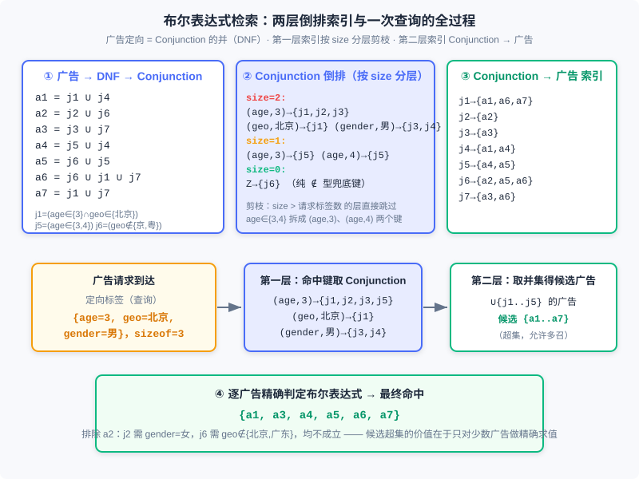
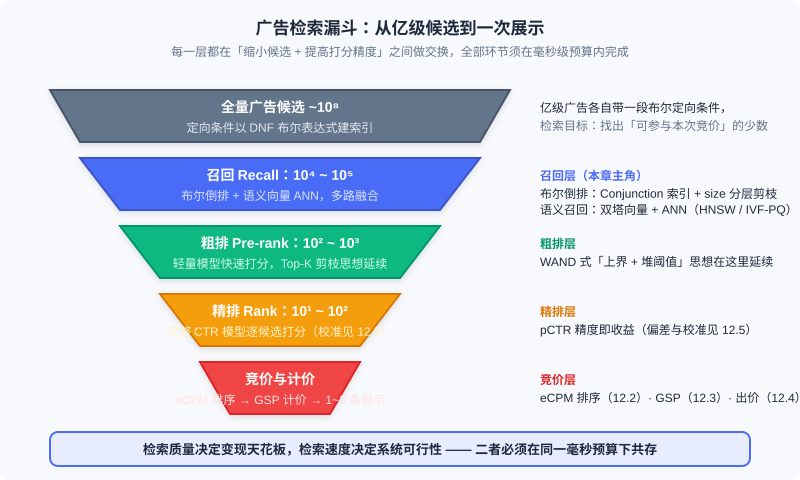

<div style="display: flex; gap: 12px; margin-bottom: 24px; flex-wrap: wrap; align-items: center;">
  <span style="background: #f0f4ff; color: #4A6CF7; padding: 4px 12px; border-radius: 20px; font-size: 0.85em; font-weight: 600; border: 1px solid rgba(74,108,247,0.2);">📖</span>
  <span style="background: #fdf2f8; color: #be185d; padding: 4px 12px; border-radius: 20px; font-size: 0.85em; border: 1px solid rgba(190,24,93,0.2);">⏱️ ~50 min read</span>
  <span style="background: #fef2f2; color: #dc2626; padding: 4px 12px; border-radius: 20px; font-size: 0.85em; font-weight: 600; border: 1px solid rgba(100,100,100,0.15);">🎯 Advanced</span>
</div>

# 广告检索与语义召回

> 📝 **Before You Continue:** 本章需先读 12.1（全景图）——竞价广告在生态中的位置，以及 12.2（计费模式与核心指标）——eCPM 的定义，因为本章讲的检索正是「eCPM 排序之前的那个环节」：没有候选，排序无从谈起。12.3（竞价机制）帮助你理解检索的下游终点；12.7.2 的流量预测用了「反向索引」，与本章的倒排索引互为对偶，读过后回头再看会更有味道。

12.2 与 12.3 把「候选广告摆上桌之后」的事讲透了：算 eCPM、排序、按 GSP 计价。但桌上的候选是哪来的？在大量中小广告主参与的市场里，每次广告请求背后站着的是**数以亿计**的广告候选——每个都带着自己的一组定向条件，而系统必须在几毫秒内决定「哪些广告有资格参加这一场竞价」。这就是**广告检索（ad retrieval）**要解决的问题：从全部广告中，找出可参与本次竞价的少数。它不追求把每个广告都看一眼——亿级候选逐个求值定向表达式，任何毫秒级预算都会瞬间爆掉——而是靠索引结构与剪枝思想，让绝大多数广告「根本不被看见」。

这一章还会走到检索技术的当代前沿：当定向从「标签的布尔组合」演进到「语义的向量表示」，检索问题就从「布尔表达式匹配」变成了「近似最近邻查找（ANN）」，工具箱也换成了向量索引。有趣的是，这两套技术今天在真实系统里是并存的——**多路召回**正是它们的合奏。

读完本章，你将能够：

- 解释广告检索与搜索引擎检索的两个本质差异：布尔表达式文档与超长查询
- 把广告定向条件分解为 DNF → Conjunction → Assignment 三层结构，并描述两层倒排索引与 size 分层剪枝的工作方式
- 描述 WAND 算法如何用「上界 + 堆阈值」在检索阶段完成 Top-K 剪枝
- 说明 DSSM/双塔模型如何把检索问题转化为向量空间中的最近邻查找，以及 LSH、向量量化、图索引三类 ANN 方案的直觉
- 看清检索漏斗全貌：召回 → 粗排 → 精排 → 竞价，完成 5 道分层练习题

---

## 12.9.0 检索为什么特殊

先看一个数字对比。搜索引擎面对的文档库是几十亿网页，查询是 1~4 个关键词；广告系统面对的广告库同样是亿级，但每次请求**留给检索的时间只有几毫秒**——因为同一毫秒预算里还要装下 CTR 预估、排序、计价、日志等一系列环节。更麻烦的是，广告检索面对的「文档」和「查询」都长得不像搜索引擎的那一套，书里指出了两个本质差异：

**差异一：广告文档不是词袋，是布尔表达式。** 在受众定向的售卖方式下，一条广告的定向条件形如「（年龄 ∈ {25–35} 且 地域 ∈ {北京}）或（地域 ∉ {北京，广东}）」——由「与」「或」「非」连接的**布尔表达式**，而不是一堆关键词的集合。搜索引擎的倒排索引回答「哪些文档包含这些词」，广告检索要回答「哪些广告的定向条件被这组标签满足」，后者的求值结构复杂得多，也留下了针对性的优化空间。

**差异二：查询可能非常长。** 搜索引擎的查询来自用户输入，天然简短；广告检索的查询却可能由上百个标签组成——上下文定向场景下，网页内容抽出的关键词就有十几个甚至几十个，再加上用户的兴趣标签。试想把 100 个关键词同时输入搜索框：按「与」组合，几乎不会有任何文档同时包含所有词；按「或」组合，又会返回海量相关性很差的候选。这两个极端都不可用，于是催生了 12.9.3 末尾的相关性检索技术。

### 🧠 Mental Model: 招聘筛简历

> 把广告检索想成一场大规模招聘。全量广告库是简历池：每份简历上都写着硬性要求——「必须会 Python 且 5 年经验，或者：博士学历且不在北京」——这是布尔表达式。求职者（广告请求）带着自己的标签到来。第一步筛简历绝不能逐份细读，而是用索引快速定位「条件可能被满足的少数简历」（布尔检索）；对于描述特别模糊的岗位（超长查询），则按「匹配程度」估个分，先淘汰明显没戏的（WAND 剪枝）；还有一种招聘方式压根不写硬性条件，而是把岗位描述和简历都变成向量，「感觉像」就推荐过来（语义召回）。三轮筛完，才进入真正的面试（eCPM 排序与竞价）。

这两个差异决定了广告检索不能照搬搜索引擎的方案，需要在倒排索引这个共同地基上发展出自己的技术体系。下面先花极小的篇幅回顾检索的下游——计价算法，明确「检索为谁服务」，再进入三项核心技术：查询扩展（搜索广告特有）、布尔表达式检索与语义召回（通用基础）。

---

## 12.9.1 计价算法回顾：检索为谁服务

竞价广告的完整决策链路是：**检索出候选 → 估算每个候选的 eCPM → 按 eCPM 排序 → 对胜出者计价**。后三步在 12.2（eCPM 的定义与分解）和 12.3（GSP 计价与市场保留价）已经讲透，这里只用一句话把它们钉在位置上：对 CPC 竞价，eCPM 按下式分解，排序按 eCPM 降序，计价按下一名的 eCPM 除以自己的点击率（GSP），并以市场保留价（MRP）托底：

$$r(a, u, c) = \mu(a, u, c) \cdot \nu(a, u)$$

其中点击率 $\mu$ 是广告、用户、上下文三方的函数，点击价值 $\nu$ 在 CPC 场景下就是广告主出价、无需估计（CPS 场景下还需预估点击价值，参见 12.2）。多种计费模式并存时，各算各的 eCPM 再统一排序：CPM 广告的 eCPM 就是出价本身，CPC 是预估点击率乘出价，CPS 是点击率乘点击价值预估。

对本章而言，这条公式链的意义在于划定边界：**计价是检索的下游**。检索决定了「哪些广告能站上赛场」，计价与排序决定了「谁赢」。赛场的入场券发得太少，再精巧的拍卖也无人竞标、变现受损；发得太多，排序环节的算力与相关性都会被拖垮。检索技术的全部目标，就是在几毫秒内发出「不多不少、恰有胜出潜力」的那一批入场券。

---

## 12.9.2 搜索广告：查询扩展与广告放置

搜索广告是竞价广告中最早也最重要的产品形态，它的检索有个特点：**上下文极强、用户信号受限**。用户输入的查询就是决策的全部上下文，而用户标签的作用受到很大限制——搜索广告的检索过程一般不考虑用户 $u$，离线受众定向也基本可以省略。但查询本身粒度极细，如何把一个简短的查询词扩展成一组可参与竞价的关键词，就成了搜索广告特有的核心技术。

**查询扩展（query expansion）** 对供需双方都有价值：需求方（广告主）靠它获得更多流量，供给方（平台）靠它变现更多流量、提高竞价激烈程度。它主要用于广泛匹配的情形，书里给出了三条主要思路：

1. **基于推荐的方法。** 把一个用户会话内的查询视为目的相同的一组活动，在「会话 × 查询」的交互强度矩阵上做协同过滤——某个用户搜过某词，矩阵对应元素就记上交互值。这个矩阵极其稀疏，推荐算法（从基于内存的非参数方法到矩阵降维的参数化方法）的任务就是用已知元素去预测性填充未知元素；平滑之后再比较两个关键词对应向量的相似度，就稳健得多了。一个值得体会的细节：**推荐问题里未观测的交互单元是「未知」，而文档主题模型里未在某文档出现的词是「零」**——两种看似相似的问题，对缺失值的语义假设完全不同。
2. **基于主题模型的方法。** 不用搜索日志，而用一般文档的主题模型：每个词对应一个主题向量，用主题向量的相似度做扩展。它捕捉的是**语义上**的相关，而非**用户意图上**的相关，效果会差一些，适合作为搜索行为数据不足时的补充。
3. **基于历史效果的方法。** 直接用广告的历史 eCPM 数据挖掘「哪些相关查询变现好」：若历史数据显示某些关键词对某些广告主 eCPM 较高，就把这些查询组记录下来，以后别的广告主也选了其中某个词时，自动扩展出效果好的查询。它与前两种方法的结果经常重合，但因为**直接用优化目标（eCPM）来指导扩展**，对营收的拉动往往最好，是极重要的补充手段。

查询扩展有明确的收益边界：搜索查询的**过分泛化会对相关性造成较大负面影响**——这正是搜索广告不在检索阶段引入短时用户标签的原因；短时信号更适合放在排序阶段，加权那些用户更倾向选择的结果。

**广告放置（ad placement）** 是搜索广告另一个有个性化空间的决策：确定一次搜索结果页上北区（主结果上方）和东区（右侧）各放几条广告。约束是系统在一段时间内**北区广告的平均条数上限** $C$（用户体验），优化目标是整体营收，形式化为：

$$\max \sum_i \big(r(N_1, u_i, c_i) + \cdots + r(N_{n_i}, u_i, c_i)\big) \quad \mathrm{s.t.} \quad \sum_i n_i \le C$$

其中 $n_i$ 是第 $i$ 次展示的北区条数，$N_s$、$E_s$ 分别表示北区、东区的第 $s$ 个位置——注意 $r$ 里多了位置参数，而排序阶段按 $N_1$（首位）处理即可。这个问题的巧妙之处在于个性化：不同用户对广告的容忍度差异很大（即使在用户受教育水平较高的北美市场，也至少有三四成用户不能完全分辨搜索结果与广告），于是可以用该用户对北区广告的历史平均点击率与全体用户的平均点击率之比 $\mu(u_i)/\mu$ 去调整收入项，在「平均条数相同」的约束下显著提升整体营收。调整北区准入的指标——MRP、相关性、质量度——都隐式地影响这个问题的解。目标函数形式上不可导、可调参数也不多，工程上用下降单纯型法这类直接搜索方法求解即可。

> **现代注解** 北区/东区是 PC 搜索时代的版式概念。移动搜索全面信息流化之后，「北区放几条」演化为「广告密度与原生样式如何混排」的决策——约束优化 + 个性化调整收入的框架没有变，变的是决策变量的形态。

---

## 12.9.3 布尔表达式检索：两层索引与 WAND 剪枝

现在进入本章核心。受众定向售卖方式下，一条广告文档是定向条件组成的**析取范式（Disjunctive Normal Form, DNF）**——若干个交集（conjunction）的并。理解算法只需三个概念，自顶向下：

| 概念 | 含义 | 例子 |
|------|------|------|
| **DNF** | 一条广告的完整定向条件：交集的并 | $a_1 = j_1 \cup j_4$ |
| **Conjunction（交集）** | 若干赋值集的交，命中它则该分支成立 | $j_1 = (\mathrm{age} \in \{3\} \cap \mathrm{geo} \in \{\text{北京}\})$ |
| **Assignment（赋值集）** | 对一个标签的最小约束：属于或不属于某取值 | $\mathrm{age} \in \{3\}$、$\mathrm{geo} \notin \{\text{广东}\}$ |

整个检索算法建立在**两个关键性质**上。其一：当某次请求的标签满足某个 Conjunction 时，一定满足所有包含该 Conjunction 的广告——所以只需对 Conjunction 建倒排索引，再套一层「Conjunction → 广告」的辅助索引，而不必对每条广告的完整 DNF 求值。其二：令 $\mathrm{sizeof}(query)$ 为请求携带的定向标签个数，$\mathrm{sizeof}(\mathrm{Conjunction})$ 为其中含「$\in$」的赋值集数目，当 $\mathrm{sizeof}(query) < \mathrm{sizeof}(\mathrm{Conjunction})$ 时该 Conjunction **必然不满足**——请求连它要求的标签数都凑不齐。这条性质把索引按 size 分层，查询时整层跳过，是最有力的剪枝。



图中把书里那组经典示例完整重建了一遍：7 条广告 $a_1$–$a_7$ 分解出 7 个 Conjunction（$j_1$–$j_7$），第一层索引把 $\mathrm{age} \in \{3,4\}$ 这类赋值集**拆成多个键**（$(\mathrm{age},3)$、$(\mathrm{age},4)$），$\notin$ 操作符不进键、只放在倒排链表的具体元素上；size=0 的纯 $\notin$ 型 Conjunction 挂在一个特殊键 $Z$ 上，保证每个赋值集都至少出现在一个倒排链里。一次请求到来时：按 size 分层逐层查键得到候选 Conjunction 集合，经第二层索引取并集得到**候选广告超集**，最后只对这个超集逐条做精确布尔判定。候选超集允许「多召」——把明显不满足的 $a_2$ 也召进来了——代价只是对少数广告做一次精确求值，换来的是检索阶段绝无遗漏。

> **Analysis:** 两层索引的复杂度账很清楚。设请求含 $k$ 个标签、命中键的平均倒排链长为 $L$，候选集规模约为 $O(kL)$，远小于广告总量 $|A|$；size 分层把「请求标签不足」的层整层剪掉，实际工程中通常能跳过大部分层。代价是索引体积：每个 Conjunction 按其赋值集拆键存储，空间换取的是查询时间的数量级下降——这是检索系统里最典型的时空交换。

### 相关性检索与 WAND

布尔索引解决了「定向条件匹配」，但开头说的第二个问题还在：上下文定向时，请求可能带几十上百个关键词。此时布尔逻辑两难——「与」匹配不到结果，「或」召回一堆垃圾。解决思路是换目标：检索阶段不问「词是否出现」，而问「查询与文档的**相似程度**够不够高」，这就是**相关性检索**。

做法是在检索阶段就引入一个评价函数，用它的结果决定返回哪些候选。函数设计有两个要求：**合理性**（与最终排序用的评价函数近似）和**高效性**（必须能在检索阶段快速算，否则与直接对每个候选精算没有区别）。研究表明：当评价函数是**线性的**（变量为各标签/关键词）且权重均为正时，可以构造出这样的快速算法。设线性评价函数为：

$$\mathrm{score}(a, c) = \sum_{t \in F(a) \cap F(c)} \alpha_t v_t(a)$$

其中 $F(a)$、$F(c)$ 分别是广告文档与上下文中非零特征的集合，$\alpha_t$ 是特征 $t$ 在查询侧的权重（如 TF-IDF，同一次查询内为常数），$v_t(a)$ 是 $t$ 在广告 $a$ 上的贡献值。VSM 的余弦相似度因归一化分母不符合线性要求，但去掉归一化后可作检索阶段的近似预评估。

加速的关键是**两个上界**：其一，关键词 $t$ 在所有文档上的贡献值上界 $u_t$（建索引时预计算）；其二，把查询中若干关键词的 $u_t$ 累加，得到任意文档对该查询得分的上界 $U$。配合一个维护当前 Top-$K$ 结果的**小顶堆**（堆顶是第 $K$ 名的分数，即剪枝阈值），就得到 Broder 等人提出的 **WAND（weight AND）算法**——上下文定向广告与内容推荐产品中非常实用的快速检索方案。每次迭代两步：

1. 将各关键词的倒排链按其当前最小文档 ID 升序排列；
2. 依次访问各关键词、累加 $u_t$ 到 $U$：若 $U$ 尚未超过堆顶阈值就已扫完所有链，说明当前文档即使用上界估算也进不了 Top-$K$，**直接跳过**；若扫到某个位置时 $U$ 超过堆顶，且首末两个关键词的倒排链指向同一文档，才对该文档做**精确评分**，分数高于堆顶则入堆。

> **Analysis:** WAND 的威力来自「用上界排除 + 用堆抬高门槛」的正反馈：结果集越好，堆顶阈值越高，能被上界放行的文档越少。它不做全量精算，只对「有可能进 Top-$K$」的文档精确评分，工程实践中常能跳过绝大多数候选。其适用边界也清晰：评价函数必须线性且权重非负——好在排序模型常用广义线性模型建模，这个框架的覆盖面比看起来大。对非线性深度排序模型，同样的「粗略上界 + 精确打分」分治思想在粗排层延续（见 12.9.5）。

---

## 12.9.4 语义召回与近似最近邻检索

布尔检索与 WAND 解决的是「标签层面的匹配」，但它们有一个共同的盲区：当一个概念在查询和广告里**用词不同**——用户搜「笔记本散热」，某条广告写的是「电脑风扇静音」——关键词匹配就失效了。主题模型（如 LDA）有一定的泛化能力，但无监督训练难以针对性解决具体业务问题。真正的转机是词嵌入带来的：**端到端地从原始数据中监督学习任务相关的语义表示**，让语义的表达能力和准确程度大幅提升——这是广告检索技术走向当代形态的分水岭。

### DSSM：用点击当老师

在广告、搜索、推荐领域，现成的弱监督信号是**点击**：给定上下文 $c$（搜索场景是查询，上下文定向场景以内容为主），若 $p(h=1 \mid a_1, c) > p(h=1 \mid a_2, c)$（$a_1$ 被点击而 $a_2$ 没有），就认为 $a_1$ 与 $c$ 更相关。**DSSM（Deep Semantic Similarity Model）** 正是在这个信号上训练的深度语义模型，名字里两个词各有含义：**语义**——把 $c$ 和 $a$ 从各自的原始空间映射到一个共享的隐藏语义空间，相关性在该空间里度量；**深度**——这个映射由多层神经网络学出来。其结构分三步：

1. 输入层把 $c$ 和 $a$ 的词做嵌入，用 BoW（词袋求和、不计词序，复杂度最低）或 CNN/RNN（需要刻画词序与局部特征时）加工成定长向量 $x$；
2. 经多层非线性变换投影到语义空间，得到语义向量 $y_c$ 与 $y_a$，相关性用余弦相似度度量（乘以调节因子 $\gamma$ 控制动量程）；
3. 把信息检索建模成多分类：正例 $a^{+}$ 是被点击的文档，负例是随机采样的未点击文档，最大化给定 $c$ 下点击 $a^{+}$ 的后验概率（softmax 形式）；也有把目标简化为**按对排序**的版本——只取一对正负样例，最大化其相关性得分之差。

训练完模型，每个查询和文档都有了语义向量。检索的最相关文档，就变成向量空间里找最近邻。

### 双塔的雏形：用户向量化

推荐场景下，DSSM 的思路换个输入就是**双塔模型**的雏形（书里以 YouTube 个性化推荐为例，对受众定向广告同样适用）。区别在输入层：DSSM 的输入是文本，这里的输入是**用户历史行为**——把搜索、广告点击等每次行为的稀疏特征都表示成稠密语义向量，不定长的行为序列取平均得到嵌入部分，再拼接性别、年龄、地域等画像特征，组成一个较宽的定长向量，逐层降维后输出与广告向量同维度的用户向量 $v_u$，用 softmax 多分类损失训练。两个工程细节影响深远：

- **负样本不能只用「展示未点击」。** 线上真实未点击的数据往往与查询有一定相关性，只拿它当负例，模型会学出「相关性不重要」的错误结论，召回质量崩塌。YouTube 用候选采样（candidate sampling）为每条正样本采样负例，并固定每用户的样本数防止分布被高频用户带偏。
- **离线建向量索引，在线查索引。** 检索在线执行时，不可能拿用户向量与全部广告向量逐个算距离——这就引出了最近邻检索的工程问题。

### ANN：从 LSH 到图索引

先看暴力法为什么不行：语义向量 200 维、候选文档 100 万的数据集，全量遍历计算距离要耗时数十毫秒——高并发的在线广告场景完全不可接受。于是需要**近似最近邻（Approximate Nearest Neighbor, ANN）**：对候选做剪枝，接受一点召回率损失，换取毫秒级的检索速度。书里讲了三类典型方案，它们的核心都是「分治」——把大空间切成小区域，只在少数区域内精确搜索：

**1. 哈希算法（LSH）。** 局部敏感哈希的直觉一句话就能说完：**原始空间里更近的点，哈希后更容易碰撞到同一个桶**。以余弦距离对应的随机投影为例：随机生成一个超平面，取投影值的符号 $h(x) = \mathrm{sign}(x \cdot p)$ 为哈希值；两向量夹角为 $\theta$ 时，同桶概率为：

$$p(h(x_1) = h(x_2)) = 1 - \frac{\theta}{\pi}$$

夹角越小同桶概率越高，恰好满足局部敏感的定义。单个超平面太粗糙，实践用 $m$ 个超平面做「与」操作、拼成 $m$ 比特签名作为桶号；召回不足时两条路：**LSH forest**（空间换召回——$n$ 组独立签名取并集，内存 $n$ 倍增长）与 **multi-probe**（时间换召回——签名改 $d$ 位生成新签名二次查询，$d \ge 2$ 时复杂度显著上升且不好控制精度）。

**2. 向量量化（VQ）。** 把向量整体量化映射到 $K$ 个离散码字之一，用「压缩」来分治。经典 K 均值就是最简单的向量量化：聚类产出 $K$ 个质心，查询时找最近质心。两个实用改进：**乘积量化 PQ**——把向量切 $m$ 等份分别做 K 均值，高维下在内存与精度间取得平衡（Facebook 开源的 faiss 库提供高效实现）；**层次 K 均值树 HKM**——借鉴 KD 树在每个节点做 $K=2$ 的聚类递归划分，查询从根走到叶，复杂度从 $O(n)$ 降到 $O(\log n)$，且通过「查兄弟叶节点」平滑扩大召回。

**3. 基于图的算法（NSW）。** 树结构检索路径固定、只能自顶向下，图结构则灵活得多。**可导航小世界（Navigable Small World, NSW）** 利用小世界网络的性质：少量长程连接让大多数节点间路径很短。建索引时逐个插入节点、与当前近邻建立连接（早期插入形成的连接自然成为长程连接）；查询时从任意节点（可多入口并发）出发，贪心地走向离查询更近的邻居，直到 Top-$K$ 收敛。

> **💡 现代注解：2026 的工程主流长什么样**
> 书中这三类方案按时间线看正是索引技术的演进史，今天的工业实践中：**LSH 已基本退出主流**，但其「近点更易碰撞」的直觉仍是一切 ANN 的思想原点；**图索引 HNSW**（NSW 的分层版本，上层稀疏图做快速导航、底层稠密图保精度）凭借高召回 + 高并发的优势成为多数场景的默认选择；**IVF-PQ**（先用 K 均值粗聚类分桶 IVF，桶内再做乘积量化压缩）在大规模、内存受限的场景与 HNSW 分庭抗礼，faiss 同时提供两者。召回侧则演进为**多路召回**：语义向量召回、协同/行为召回、热门兜底等多路并行各取 Top-K，合并去重后进入排序——单一索引独扛全局的时代结束了。而 DSSM/YouTube 模型演进成了今天的**双塔模型**标配训练法：用户塔与物品塔各自独立打向量，batch 内互为负例（in-batch negatives），线上线下解耦部署。

> **Analysis:** 三类 ANN 的取舍可以浓缩为：LSH 实现最简单、内存可控，但召回率天花板低；量化类（PQ/HKM）内存最省、适合超大候选池，但有量化精度损失；图类（NSW/HNSW）召回率与查询延迟表现最好，代价是索引内存较大、建图成本高。共同前提是双塔式的表示学习质量——**向量本身不好，任何索引都救不回来**；这也解释了为什么语义召回的竞争焦点最终回到了样本与损失函数的设计上。

---

## 12.9.5 收束：检索漏斗与系统的全貌

把本章的技术放回系统全景，就是一张**检索漏斗**：亿级候选经过召回、粗排、精排、竞价四层逐级收窄，最终只剩 1~3 条广告被真正展示。



这张图值得停下来读三个细节。**第一，每一层都是「缩小候选」与「提高打分精度」的交换**：召回层用索引结构（布尔倒排、ANN 向量索引）做到亿级到万级，代价是打分极粗（只看「能不能匹配」或「向量像不像」）；粗排用轻量模型在万级候选上打分，把 WAND 式的「上界粗估 + Top-K 保留」思想工程化；精排才对百级候选上完整 CTR 模型（其精度与校准见 12.5）；最后竞价层按 eCPM 排序、GSP 计价。**第二，上游永远无法用下游的精度弥补**——召回层漏掉的广告，精排再准也看不见，所以工程上宁可多召（图中布尔索引的「候选超集」哲学），也绝不轻易收窄召回面。**第三，多路召回是常态**：布尔定向召回与语义向量召回并行各出一路候选，合并去重后统一进入下游——12.9.3 与 12.9.4 的两套技术不是替代关系，而是同一漏斗的两条进水管。

对照推荐系统（本书上篇的主线），你会发现这个漏斗与「召回→粗排→精排→重排」几乎是同构的——广告系统与推荐系统在检索这一层共享了全部工程智慧，差异只在漏斗尽头：推荐优化用户价值，广告还要穿过一层**出价与机制**（12.4 的智能出价决定广告主愿意为什么样的候选付多少钱，12.3 的 GSP 决定收多少钱）。检索为这一切提供入场券。

---

## ⚠️ Common Mistakes in 12.9

| # | Mistake | Example | Why It's Wrong | Fix |
|---|---------|---------|---------------|-----|
| 1 | 对每条广告逐个求值布尔表达式 | 请求到来时遍历亿级广告、逐条判 DNF | 检索预算只有几毫秒，全量求值必然超时；两层索引正是为此设计 | Conjunction 建倒排 + Conj→AD 辅助索引，只对候选超集精确判定 |
| 2 | 忽略 size 分层剪枝，或把 $\notin$ 计入 size | 请求只带 2 个标签却去查 size=2 以上所有层；把 $\mathrm{geo} \notin \{\text{广东}\}$ 也当索引键 | $\mathrm{sizeof}(query) < \mathrm{sizeof}(\mathrm{Conjunction})$ 时必不满足，整层可跳过；$\notin$ 不进键，只放链表元素上 | size = 含「$\in$」的赋值集数目；按 size 分层建索引，查询逐层剪枝 |
| 3 | 把非线性精排函数直接搬到检索阶段剪枝 | 用深度 CTR 模型的打分在检索阶段做 WAND 上界 | WAND 的快速排除依赖「线性 + 权重非负」才能累加上界；非线性函数无法构造可累加的 $u_t$ | 检索/粗排用线性或广义线性近似；深度模型留给精排 |
| 4 | 语义召回上线后对全库暴力算余弦 | 每次请求拿用户向量与 100 万广告向量逐个点积 | 200 维 × 百万级的全量遍历需数十毫秒，高并发下不可接受 | 部署 ANN 索引（HNSW/IVF-PQ），接受近似换毫秒级延迟 |
| 5 | 把 LSH/HKM 当成当代主流方案 | 新系统选型直接上 LSH forest | LSH 召回天花板低、HKM 检索路径固定，工程上已被图索引与 IVF-PQ 取代 | 现代选型优先 HNSW/IVF-PQ；LSH 保留其「近点易碰撞」的直觉价值 |
| 6 | 查询扩展只看语义相似度 | 用主题模型把「笔记本」扩展到「笔记本电脑包」，不顾变现差异 | 语义相关不等于意图相关，更不等于 eCPM 高；过度泛化还会损害搜索广告的相关性 | 三路并用：协同过滤 + 主题模型兜底 + 历史 eCPM 效果数据主导 |

---

## 本章小结

### 📌 Key Takeaways

| Concept | Key Points | Why It Matters |
|---------|-----------|----------------|
| 广告检索的特殊性 | 文档是 DNF 布尔表达式而非词袋；查询可由上百个标签组成 | 决定广告检索不能照搬搜索引擎方案，需要专用索引与剪枝 |
| 布尔表达式检索 | DNF → Conjunction → Assignment 三层分解；两层倒排索引 + size 分层剪枝；候选超集 + 精确判定 | 亿级候选毫秒级检索的基石，竞价广告最核心的通用技术之一 |
| WAND | 线性评价函数 + 关键词上界 $u_t$ + 小顶堆阈值，只对可能进 Top-K 的候选精确评分 | 超长查询场景（上下文定向）的实用快速检索；「上界粗估 + 门槛正反馈」思想延续到粗排 |
| 查询扩展 | 协同过滤（会话×查询矩阵）、主题模型（语义补充）、历史 eCPM（直接对准营收）三路并用 | 搜索广告的流量与营收杠杆；泛化过度损害相关性是硬边界 |
| 语义召回 | DSSM/双塔：点击作弱监督，端到端学语义向量，检索变最近邻查找 | 解决关键词匹配的泛化盲区，是当代召回技术的基础形态 |
| ANN 演进 | LSH（直觉原点）→ 向量量化 PQ/HKM → 图索引 NSW/HNSW；现代主流 HNSW/IVF-PQ + 多路召回融合 | 向量检索的工程地基；向量质量比索引选择更根本 |

### ❓ FAQ

**Q1: 布尔检索和语义召回，现代系统到底用哪个？**
> 都用，而且是并行使用。广告主的定向条件必须精确满足（这是合约承诺），布尔倒排索引不可替代；语义召回负责补布尔逻辑覆盖不到的「意图相近」的流量。两者各自产出一路候选，合并去重后统一进入排序——即多路召回。讨论「谁替代谁」是伪问题，工程难点在多路候选的配额与合并策略。

**Q2: WAND 里「允许非负权重线性函数」的限制，实际影响大吗？**
> 比直觉小。排序模型长期以广义线性模型（特征 × 权重再套非线性链接）为主流，广义线性打分仍可拆成线性项累加，WAND 框架直接适用。即便是深度模型，也可以在粗排层用线性/轻量近似做 Top-K 筛选——分治思想不依赖具体模型形态。

**Q3: ANN 选型记住一条什么原则就够？**
> 向量质量优先于索引选型。HNSW/IVF-PQ 的差距是工程常数级的，而双塔训练的样本与损失函数设计（负采样、in-batch negatives、特征覆盖）决定召回质量的上限。索引选型的实用起点：内存充足选 HNSW，亿级以上且内存受限选 IVF-PQ，其余细节交给基准测试。

### 🔗 前后关联

- **12.2**（计费模式与核心指标）：检索的下游终点是 eCPM 排序，eCPM 的分解口径（pCTR × 点击价值）直接定义了「什么样的候选有入场资格」
- **12.3**（竞价机制）：GSP 计价与市场保留价作用于检索漏斗的最后一层；检索质量决定竞价的激烈程度
- **12.4**（智能出价）：漏斗尽头的出价决定广告主愿意为何种候选付费；预算消耗状态反过来会收紧上游的检索配额
- **12.5**（偏差与校准）：精排层 pCTR 的校准质量影响 eCPM 排序，进而影响「检索该召回多少」的配额决策
- **12.7**（在线分配）：流量预测的「反向索引」与本章广告检索的倒排索引互为对偶——文档与查询互换角色，同一索引技术服务两个问题

---

## Practice Problems

Work through all problems in order — they get progressively harder. Each has a complete solution you can reveal after trying it yourself.

---

**Problem 12.9.1 — DNF 分解与命中判定** 🟢 Easy

某广告的定向条件为：$a = (\mathrm{age} \in \{3\} \cap \mathrm{geo} \in \{\text{北京}\}) \cup (\mathrm{geo} \in \{\text{广东}\} \cap \mathrm{gender} \in \{\text{男}\})$。请把它分解成 Conjunction 的并，写出每个 Conjunction 的 size（含「$\in$」的赋值集数目），并判断以下两个请求是否命中该广告：(1) $\{\mathrm{age}{=}3,\ \mathrm{geo}{=}\text{北京},\ \mathrm{gender}{=}\text{男}\}$；(2) $\{\mathrm{age}{=}4,\ \mathrm{geo}{=}\text{北京}\}$。

**Sample Input:** 请求 (1) $\{\mathrm{age}{=}3, \mathrm{geo}{=}\text{北京}, \mathrm{gender}{=}\text{男}\}$；请求 (2) $\{\mathrm{age}{=}4, \mathrm{geo}{=}\text{北京}\}$
**Sample Output:** 分解 $a = j_1 \cup j_2$，两个 Conjunction 的 size 均为 2；请求 (1) 命中，请求 (2) 不命中
<details>
<summary>💡 Solution (click to reveal)</summary>
**Approach:** 按「∩ 连接的段为一个 Conjunction、∪ 连接的段为不同 Conjunction」拆分，逐赋值集核对请求标签。

- 分解：$j_1 = (\mathrm{age} \in \{3\} \cap \mathrm{geo} \in \{\text{北京}\})$，$j_2 = (\mathrm{geo} \in \{\text{广东}\} \cap \mathrm{gender} \in \{\text{男}\})$。各自含 2 个 $\in$ 赋值集，size 均为 2。
- 请求 (1)：$j_1$ 需要 $\mathrm{age}{=}3$ ✓ 与 $\mathrm{geo}{=}\text{北京}$ ✓，满足 → 命中（DNF 中只要一个 Conjunction 成立即可）。
- 请求 (2)：$j_1$ 需要 $\mathrm{age}{=}3$，请求是 $\mathrm{age}{=}4$ ✗；$j_2$ 需要 $\mathrm{geo}{=}\text{广东}$，请求是 $\mathrm{geo}{=}\text{北京}$ ✗ → 不命中。
- 顺带验证 size 剪枝：请求 (2) 只有 2 个标签，size=2 的层仍可查（$2 \le 2$），若广告再增加一个 $\in$ 赋值集使 size 变 3，则整个 Conjunction 无需求值即可排除。

**Key points:**
- DNF 命中条件：至少一个 Conjunction 的全部赋值集被满足
- size 以「$\in$」赋值集计数，$\notin$ 不计入也不进索引键
</details>

---

**Problem 12.9.2 — 两层索引查询模拟** 🟡 Medium

使用 12.9.3 图中的 7 条广告（$a_1$–$a_7$）与其 Conjunction 分解（$j_1$–$j_7$，其中 $j_5 = (\mathrm{age} \in \{3,4\})$、$j_6 = (\mathrm{geo} \notin \{\text{北京},\text{广东}\})$）。请求为 $\{\mathrm{age}{=}3,\ \mathrm{geo}{=}\text{北京},\ \mathrm{gender}{=}\text{男}\}$，size=3。请写出：(1) 查询各命中键后得到的候选 Conjunction 集合；(2) 经第二层索引取并集后的候选广告超集；(3) 精确判定后的最终命中列表，并说明哪条广告被排除、为什么。

**Sample Input:** 请求标签 $\{\mathrm{age}{=}3, \mathrm{geo}{=}\text{北京}, \mathrm{gender}{=}\text{男}\}$
**Sample Output:** 候选 Conjunction $\{j_1, j_2, j_3, j_4, j_5\}$；候选广告 $\{a_1, ..., a_7\}$ 全部 7 条；最终命中 $\{a_1, a_3, a_4, a_5, a_6, a_7\}$，排除 $a_2$
<details>
<summary>💡 Solution (click to reveal)</summary>
**Approach:** 逐层查键 → 第二层取并集 → 精确判定，与图中流程一致。

- **第一层查键**（size ≤ 3 的层均可查）：size=2 层，$(\mathrm{age},3) \to \{j_1, j_2, j_3\}$、$(\mathrm{geo},\text{北京}) \to \{j_1\}$、$(\mathrm{gender},\text{男}) \to \{j_3, j_4\}$；size=1 层，$(\mathrm{age},3) \to \{j_5\}$。候选 Conjunction $= \{j_1, j_2, j_3, j_4, j_5\}$。$j_6$（size=0）只在特殊键 $Z$ 下，需精确判定。
- **第二层取并集**：$j_1 \to \{a_1, a_6, a_7\}$、$j_2 \to \{a_2\}$、$j_3 \to \{a_3\}$、$j_4 \to \{a_1, a_4\}$、$j_5 \to \{a_4, a_5\}$，并集为 $\{a_1, ..., a_7\}$——候选超集覆盖了全部广告。
- **精确判定**：$a_1$（$j_1$ ✓）、$a_3$（$j_3$：age=3 ✓，gender=男 ✓，geo=北京 ∉{广东} ✓）、$a_4$（$j_5$：age ∈ {3,4} ✓）、$a_5$（$j_5$ ✓）、$a_6$（$j_1$ ✓）、$a_7$（$j_1$ ✓）。$a_2$ 被排除：$j_2$ 需 gender=女 ✗，$j_6$ 需 geo ∉ {北京,广东} 但 geo=北京 ✗。

**Key points:**
- size=1 的 $j_5$ 也要查——size 剪枝只剪「size 大于标签数」的层，不剪小 size
- 候选超集允许包含最终不命中的广告（如 $a_2$），精确求值只发生在超集上，这正是效率来源
</details>

---

**Problem 12.9.3 — WAND 剪枝推演** 🟡 Medium

某次上下文定向查询含 3 个关键词，其倒排链当前头的文档 ID 依次为：$t_1 \to \mathrm{doc}\ 5$，$t_2 \to \mathrm{doc}\ 5$，$t_3 \to \mathrm{doc}\ 9$。各关键词的贡献上界为 $u_1 = 2$、$u_2 = 3$、$u_3 = 4$。当前小顶堆已装满 $K$ 个结果，堆顶分数（剪枝阈值）$\theta = 6$。请推演 WAND 本轮迭代的两个步骤，判断 doc 5 是否会被精确评分，并说明系统下一步的动作。

**Sample Input:** 倒排链头 $\{t_1{:}5,\ t_2{:}5,\ t_3{:}9\}$；上界 $\{2, 3, 4\}$；阈值 $\theta = 6$
**Sample Output:** pivot 停在 $t_3$（累计上界 $2+3+4 = 9 > 6$）；$t_1, t_2$ 的链头（doc 5）与 pivot 链头（doc 9）不一致 → doc 5 不评分；从前面某条链跳到 doc 9，进入下一轮
<details>
<summary>💡 Solution (click to reveal)</summary>
**Approach:** 第一步按链头 docID 升序排列，第二步累加上界找 pivot，再比较首尾链头。

- 排序后顺序即 $t_1(5), t_2(5), t_3(9)$。累加上界：$U = u_1 = 2 < 6$；$U = 2+3 = 5 < 6$；$U = 5+4 = 9 > 6$ → pivot 为 $t_3$。
- pivot 判定：$t_1$ 与 $t_3$ 的链头 docID 分别为 5 与 9，**不一致** → 当前文档（doc 5）即使用满上界也只是在 $t_1, t_2$ 两条链上，其真实得分上界为 $u_1 + u_2 = 5 < 6$，不可能进堆 → **doc 5 被剪枝，不做精确评分**。
- 下一步：从前面的链中选一条（如 $t_2$）用 skipto 跳到 doc 9，回到第 1 步；此时 $t_2, t_3$ 链头一致且累计 $3+4 = 7 > 6$，若 $t_1$ 链头也到达 9，则 doc 9 值得精确评分。

**Key points:**
- 累加的是「上界」而非真实得分——上界不够就绝不精算，这是 WAND 省算力的全部来源
- 堆顶阈值随结果集变好而抬高，剪枝越来越狠：正反馈是 WAND 高效的深层原因
</details>

---

**Problem 12.9.4 — 随机投影 LSH 的召回账** 🔴 Hard

用随机投影做余弦 LSH。两个向量的夹角 $\theta = 60°$。(1) 单个超平面下两向量同桶的概率是多少？(2) 用 $m = 8$ 个超平面拼 8 比特签名（「与」操作），同桶概率变为多少？(3) 为提升召回改用 LSH forest：$n = 10$ 组独立签名取并集，「至少一组同桶即判为近邻」的召回概率是多少？(4) 若改用 multi-probe，二次查询需生成的新签名数在 $d = 1$ 和 $d = 2$ 时各是多少？据此说明两种扩召回方案的代价差异。

**Sample Input:** $\theta = 60°$，$m = 8$，$n = 10$
**Sample Output:** (1) $2/3 \approx 0.667$；(2) $\approx 0.039$；(3) $\approx 0.328$；(4) $d{=}1$ 时 8 个，$d{=}2$ 时 28 个
<details>
<summary>💡 Solution (click to reveal)</summary>
**Approach:** 逐层代入公式 $p = 1 - \theta/\pi$、签名概率 $p^m$、并集召回 $1 - (1 - p^m)^n$、组合数 $\binom{m}{d}$。

- (1) $p = 1 - \frac{\pi/3}{\pi} = \frac{2}{3} \approx 0.667$。
- (2) 8 位签名全部一致才同桶：$p^8 = (2/3)^8 = 256/6561 \approx 0.039$。「与」操作让桶极小、查询极快，但单签名召回急剧下降。
- (3) $n$ 组签名至少一组碰撞：$1 - (1 - 0.039)^{10} \approx 1 - 0.672 = 0.328$。召回从 3.9% 提升到 32.8%，代价是索引内存 10 倍。
- (4) 修改 $d$ 位的新签名数为 $\binom{m}{d}$：$d=1$ 时 $\binom{8}{1} = 8$；$d=2$ 时 $\binom{8}{2} = 28$。multi-probe 不增内存但每次查询要发起多路二次检索，$d \ge 2$ 时查询次数迅速膨胀且精度-召回权衡难以平滑控制。

**Key points:**
- LSH 的三种扩召回手段本质都是拿别的东西换召回：forest 换内存、multi-probe 换查询时间、增大 $m$ 换桶精度
- 数值上看清了 LSH 的局限——想要 90%+ 召回需要天文数字的签名组数，这正是图索引取代它的原因之一
</details>

---

**Problem 12.9.5 — 实现两层布尔倒排索引** 🏆 Challenge

用 Python 实现书中示例的完整检索：给定 7 个 Conjunction（$j_1$–$j_7$）与 7 条广告的分解（$a_1$–$a_7$），实现 `build_index()`（按 size 分层的 Conjunction 倒排 + Conj→AD 辅助索引，含 size=0 特殊键 Z）与 `retrieve(query)`（size 剪枝 + 键查询 + 精确判定），并用四组请求验证输出。

**Sample Input:** 请求 $\{\mathrm{age}{:}3, \mathrm{geo}{:}\text{北京}, \mathrm{gender}{:}\text{男}\}$，以及 $\{\mathrm{age}{:}4, \mathrm{geo}{:}\text{北京}\}$、$\{\mathrm{age}{:}3, \mathrm{geo}{:}\text{上海}, \mathrm{gender}{:}\text{女}\}$、$\{\mathrm{gender}{:}\text{男}, \mathrm{geo}{:}\text{广东}\}$
**Sample Output:** `['a1','a3','a4','a5','a6','a7']`；`['a4','a5']`；`['a2','a4','a5','a6']`；`['a1','a4']`
<details>
<summary>💡 Solution (click to reveal)</summary>
**Approach:** 赋值集建模为（属性，取值集合，belong）三元组；size 只数 $\in$ 赋值集；$age \in \{3,4\}$ 拆成两个索引键；纯 $\notin$ 型挂特殊键 Z 走精确判定。

```python
# 每个赋值集: (属性, 取值集合, belong)，belong=True 为 ∈，False 为 ∉
CONJUNCTIONS = {
    "j1": [("age", {3}, True), ("geo", {"北京"}, True)],
    "j2": [("age", {3}, True), ("gender", {"女"}, True)],
    "j3": [("age", {3}, True), ("gender", {"男"}, True), ("geo", {"广东"}, False)],
    "j4": [("gender", {"男"}, True), ("geo", {"广东"}, True)],
    "j5": [("age", {3, 4}, True)],                       # ← KEY LINE: 一个 ∈ 赋值集，size=1
    "j6": [("geo", {"北京", "广东"}, False)],             # ← KEY LINE: 纯 ∉ 型，size=0
    "j7": [("gender", {"女"}, True), ("geo", {"广东"}, True)],
}
ADS = {
    "a1": ["j1", "j4"], "a2": ["j2", "j6"], "a3": ["j3", "j7"],
    "a4": ["j5", "j4"], "a5": ["j6", "j5"], "a6": ["j6", "j1", "j7"],
    "a7": ["j1", "j7"],
}

def build_index():
    by_size, conj2ad = {}, {}
    for c, assigns in CONJUNCTIONS.items():
        k = sum(1 for _, _, b in assigns if b)           # size = ∈ 赋值集数目
        for attr, vals, b in assigns:
            if b:
                for v in vals:                           # age∈{3,4} 拆成两个键
                    by_size.setdefault(k, {}).setdefault((attr, v), set()).add(c)
        if k == 0:                                       # 纯 ∉ 型挂特殊键 Z
            by_size.setdefault(0, {}).setdefault("Z", set()).add(c)
        for ad, cs in ADS.items():
            if c in cs:
                conj2ad.setdefault(c, []).append(ad)
    return by_size, conj2ad

def holds(assigns, query):
    for attr, vals, b in assigns:
        q = query.get(attr)
        if b and q not in vals:
            return False
        if not b and q in vals:                          # q 不在集合时 ∉ 成立（含缺失）
            return False
    return True

def retrieve(query, by_size, conj2ad):
    conjs = set()
    for k, posting in by_size.items():
        if k > len(query):                               # ← KEY LINE: size 剪枝
            continue
        for key, cs in posting.items():
            if not isinstance(key, tuple):               # 跳过特殊键 Z
                continue
            attr, v = key
            if query.get(attr) == v:
                conjs |= cs
    for c in by_size.get(0, {}).get("Z", set()):         # size=0 走精确判定
        if holds(CONJUNCTIONS[c], query):
            conjs.add(c)
    return sorted({ad for c in conjs
                   if holds(CONJUNCTIONS[c], query)
                   for ad in conj2ad[c]})

idx = build_index()
print(retrieve({"age": 3, "geo": "北京", "gender": "男"}, *idx))
# ['a1', 'a3', 'a4', 'a5', 'a6', 'a7']
print(retrieve({"age": 4, "geo": "北京"}, *idx))
# ['a4', 'a5']
print(retrieve({"age": 3, "geo": "上海", "gender": "女"}, *idx))
# ['a2', 'a4', 'a5', 'a6']
print(retrieve({"gender": "男", "geo": "广东"}, *idx))
# ['a1', 'a4']
```

注意第三个请求：$j_6$（geo ∉ {北京,广东}，geo=上海 成立）经 Z 键的精确判定进入候选，连带召回 $a_2$ 与 $a_6$ 中的 $j_6$ 分支——这正是 size=0 层不能靠键查询、必须精确判定的原因。第四个请求验证了 $\notin$ 的反例：$j_3$ 因 geo=广东 ∈ {广东} 被精确判定排除，虽然它的 $(\mathrm{age},3)$、$(\mathrm{gender},\text{男})$ 键都命中了（该请求无 age 标签，j3 靠 gender 键入候选后仍被 ∉ 条件挡下）。
**Key points:**
- size 剪枝在 `k > len(query)` 处：请求标签不足时整层跳过
- $\notin$ 只存在于链表元素（此处化简为精确判定阶段），永远不进索引键
- 候选超集 → 精确判定是「允许多召、不许漏召」的检索哲学
</details>
