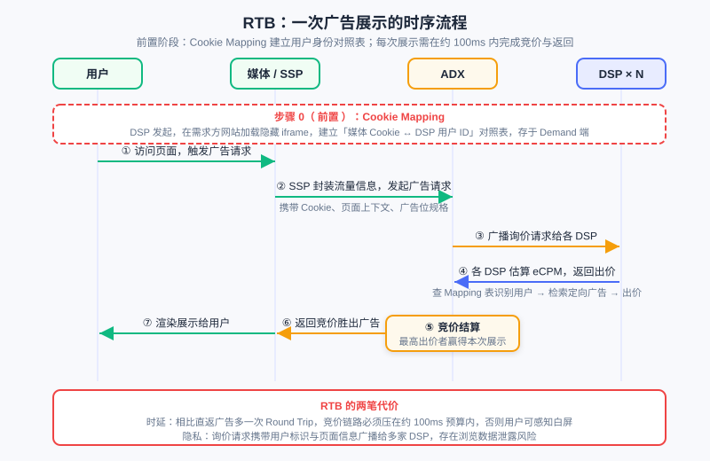
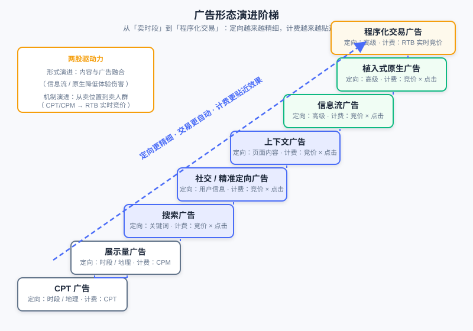

  📖
  ⏱️ ~45 min read
  🎯 Intermediate

# 计算广告全景与生态

> 📝 **Before You Continue:** 建议先读 [1.1](./../part1-introduction/recommender-system-basics.md)「推荐系统是什么」——本章将从推荐系统工程师的视角切入广告，你熟悉的召回、排序、CTR 模型在广告场景都有对应物，但多了一层推荐系统没有的经济学约束。

你已经知道推荐系统如何从海量物品中为用户挑选最合适的内容：召回缩小候选集、排序预估偏好、重排平衡体验。现在换一个问题——如果「被推荐的物品」不再是平台自己的商品，而是广告主付费投放的广告，系统会发生什么变化？

答案远不止「把物品换成广告」这么直接。广告引入了第三个利益方（广告主），带来了 **竞价** 这一推荐系统不存在的机制；广告的交易方式经历了从线下直签到毫秒级实时竞价的完整演进；广告的定向技术与推荐系统的召回技术同源却又不完全相同。本章带你俯瞰 **计算广告（Computational Advertising）** 的全景：它是什么、它的根本问题、它的生态如何运转、它的技术如何一步步走向程序化交易。这些内容是后续章节（CTR 预估、竞价机制、机制设计）的地图。

读完本章，你将能够：

- 说出广告定义的三要素与广告有效性模型的六个阶段，并区分品牌广告与效果广告
- 陈述计算广告的根本问题（$User \times Context \times Ad$ 三元匹配最大化 ROI），并解释它与推荐系统的三点本质差异
- 说出广告系统价值公式的四个因子，以及投放模式 1.0 → 3.0 演进中每一代解决了什么问题
- 描述程序化生态中 ADX / DSP / SSP / DMP / Trading Desk 各自的职责与 RTB 的两阶段流程
- 举例说明定向技术的三个阶段与广告形态演进的主线，并解释信息流广告为何是平衡效果与体验的正面典型
- 完成 5 道分层练习题，检验对广告生态全景的理解

---

## 12.1.0 广告是什么：定义、分类与有效性模型

我们从定义出发。广告是由 **已确定的出资人（Sponsor）** 通过各种 **媒介（媒体，Publisher）** ，面向 **受众（Audience）** 进行的、有关产品（商品、服务和观点）的，通常是有偿的、有组织的、综合的、劝服性的 **非人员** 信息传播活动。

这个略显绕口的定义里有三个要素值得你逐个咀嚼。**出资人** 意味着广告有明确的付费方，这与推荐系统里「平台自己决定推什么」截然不同——广告主是一个有独立利益的博弈方。**媒介** 是广告的载体，从传统媒体到互联网产品，媒介掌握着用户的注意力。**受众** 是信息触达的对象，也是推荐系统一直在建模的用户。而定义中「非人员」三个字藏着一个关键点：广告的 **本质是完成较低成本的用户接触**——不依赖面对面的人员推销，用可复制、可规模化的媒介把产品信息送达潜在消费者，这正是广告相对于人员销售的成本优势。

### 品牌广告 vs 效果广告

按投放诉求，广告分为两大类。**品牌广告（Brand Awareness）** 注重长期影响，目标是让受众记住品牌、建立认知，典型如汽车、快消品的大型投放； **效果广告（Direct Response）** 以短期转化行为为诉求，追求用户点击、注册、下单等可度量的即时效果。这两类的度量方式完全不同——品牌广告看曝光与认知度，效果广告看点击率与转化率。你会看到，后续章节讨论的竞价、CTR 预估等计算技术主要围绕效果广告展开，但品牌广告的「展示也是一种用户接触」的价值不应被低估。

### 广告有效性模型：从曝光到决策

一条广告要产生效果，需要穿越一条漏斗。**广告有效性模型** 把这一过程分为六个阶段，并归入三个大组：

- **选择阶段（被看见）** ： **曝光（Exposure）**——广告位所在的页面天然决定； **关注（Attention）**——广告要不干扰用户的正常行为、给出推荐原因、符合用户兴趣或需求，用户才会注意到它。
- **解释阶段（被理解）** ： **理解（Comprehension）**——广告内容要落在用户能理解的兴趣范围内，理解门槛不能太高； **接受（Acceptance）**——用户对广告和广告位的认可度，决定了信息是否被接纳为态度。
- **态度阶段（被记住并行动）** ： **保持（Retention）**——广告的艺术性带来记忆效果； **决策（Decision）**——最终购买行为落在价格敏感的可接受范围内。

这个漏斗对你应该很眼熟——它就是推荐系统里「曝光 → 点击 → 转化」漏斗的精细化版本。但注意一个差别：推荐系统漏斗里用户「点击」就基本完成了系统目标，而广告漏斗的最底层是「购买」，广告主真正付费购买的是贯穿整条漏斗的用户接触。

### 🧠 Mental Model: 广告是「花钱买的推荐位」

> 把信息流里的一条广告看作「平台花钱都买不来的推荐位被广告主买走了」。系统面临的任务仍是匹配（什么广告适合这个用户），但匹配的物品池是付费进入的，且每次展示都直接产生真金白银的收入。理解了这一点，你就能理解为什么广告系统的每个技术决策都比推荐系统多一层「钱」的约束。

> **Analysis:** 在线广告的渠道谱系——硬广、SEM（搜索引擎营销）、导航、直通车、返利网——转化率逐级升高，但位于谱系前端的硬广能吸引更多潜在客户、抬高后续渠道的转化率。不能因为硬广点击率低就放弃它：展示本身就是一种有价值的用户接触。这提醒我们，评估广告渠道不能只看单点转化率，要看整条转化链路的协同。

---

## 12.1.1 计算广告的根本问题：三元匹配与 ROI

推荐系统的核心是「用户 × 物品」的匹配；计算广告把这个匹配扩展成三元。**在线广告中的计算问题，是关于 $User$（用户）、$Context$（上下文）与 $Ad$（广告）三者的匹配，以最大化 ROI（Return on Investment，投资回报率）为目标的优化问题** ：

$$\max \; \text{ROI}(User, Context, Ad)$$

其中 $Context$ 是推荐系统里相对次要的一维（场景），在广告里却举足轻重——同一个用户在搜索页看到「跑鞋」广告和在新闻页看到的最佳广告完全不同，上下文本身就携带强烈的意图信号。而 ROI 的拆解方式直接决定了市场结构：把投入看做固定、优化回报，回报包括 **点击率** 与 **点击价值** （二者乘积即 **eCPM** ，千次展示期望收益）。于是按「谁来动态决定哪一项」，市场分成三类：

- **CPM 市场** （按展示付费）：eCPM 固定，点击率与点击价值的决策（与风险）全部交给广告主；
- **CPC 市场** （按点击付费）：点击价值由广告主判断（出价），点击率动态预估（平台更了解流量质量，如 Google）；
- **CPA/CPS 市场** （按行为/销售付费）：两者均动态，相当于平台做全部决策，风险归于平台——淘宝广告平台以此为基础，因为其广告主（卖家）的服务流程大致相同。

### 与推荐系统的三点本质差异

作为推荐系统背景的读者，你需要特别留意广告与推荐的三点差异：

1. **同质 vs 非同质匹配** ：推荐是同质匹配——候选物品都在同一个「内容池」里竞争，系统用统一的标准打分；广告可以非同质——不同广告主的投放目标（品牌曝光、点击、转化）与出价不同，匹配时要同时考虑「内容适配」与「商业回报」，不能用单一相关度分数一刀切。
2. **终点 vs 下游** ：推荐可以做 Downstream 优化——用户点击了物品，后续还有停留、加购、复购等持续优化的空间；广告是终点，一次转化完成后这次投放的使命即告结束，优化目标收敛在本次展示上。
3. **兴趣多样性 vs 回报率** ：推荐要满足用户多样的兴趣，探索与多样性本身就是价值；广告追求回报率，同时必须守住安全与质量的底线——一条高回报但低俗的广告对媒介是长期伤害。

> 💡 **Key Insight:** 推荐系统优化的是「用户满意度」这一相对单一的目标（体验即价值）；广告系统要在**用户、广告主、媒介（平台）三方利益**之间找平衡。你之后学到的所有广告机制设计（竞价、计费、分配），本质上都是在回答「三方利益如何均衡」这个问题。

### 广告系统价值公式

从系统视角，互联网广告系统发展的终极目标是价值最大化，可以把广告系统的价值分解为四个因子的乘积：

$$\text{广告系统价值} = \text{转化效率} \times \text{计价机制} \times \text{资源量} \times \text{投放效率}$$

这四个因子是理解整个广告技术演进的总纲： **转化效率** 靠广告形式与定向技术提升（12.1.4、12.1.5）； **计价机制** 靠竞价模式让价格市场化地逼近价值（12.2、12.3 展开）； **资源量** 取决于用户基数与使用时长，但盲目加广告位是饮鸩止渴——必须平衡用户价值与广告利益； **投放效率** 靠交易链路的程序化演进（12.1.2、12.1.3）。本章后续内容就是这个公式四个因子的逐个展开。

还有几个常见误区值得提前澄清：「越精准的广告给市场带来的价值越大」不一定成立；媒体利益与广告主利益是相关博弈的关系，并非零和也并非一致；「精准投放 + 大数据可以显著提高营收」同样不一定——覆盖率过低的数据来源并非不需要，人群覆盖与精准度之间存在权衡。

---

## 12.1.2 投放模式演进：从直签到程序化交易

有了价值公式做总纲，我们先看「投放效率」因子的演进。广告主与媒介如何达成交易？三代投放模式给出了答案。

### 1.0：广告主 ↔ 媒体直签

最原始的模式是广告主直接与媒体签订广告合约。对一个要在多个媒体投放的广告主，这意味着要与每家媒体分别谈判、签约、对账——效率非常低下。市场自发演化出广告分销商、广告代理等中间商来改善交易的低效，但整体上仍是低效的广告交易模式：交易粒度粗（按天、按位置卖）、信息不透明、议价成本高。

### 2.0：广告网络（Ad Network）

**广告网络（Ad Network）** 的出现开始整合供需双方的需求：它聚合多家媒体的剩余流量，为广告主提供更丰富的供应方资源，同时提供人群标签帮助广告主制定定向规则。广告网络有两个关键特征：一是 **卖人群不卖广告位**——它淡化广告位的概念，把不同媒体的流量按受众标签打包售卖；二是在计价上， **CPC（按点击付费）是最合适的计价方式**——网络层面的流量质量参差不齐，按点击计价把「曝光是否有效」的判断留给了系统，广告主只为点击买单。

但广告网络是一个 **封闭系统** ，其整合能力仍然有限：一方面，媒体为了避免劣质广告伤害网站用户体验，并不倾向于把优质资源接入广告网络；另一方面，供应方巨头会自建广告网络整合旗下分散的供应方资源（如腾讯的广点通）。广告主也需要向广告网络「清晰描述」自己的投放需求，定制化用户划分不被支持——这正是下一代模式要解决的问题。

### 3.0：程序化交易（DSP-ADX-SSP-DMP）

第三代模式把供需双方的整合推向全网。广告主通过 **DSP（Demand-Side Platform，需求方平台）** 接触全网供应方资源，交易经 **ADX（Ad Exchange，广告交易平台）** 以实时竞价方式完成，媒体端由 **SSP（Supply-Side Platform，供应方平台）** 管理流量。在这一模式下，DSP 甚至能够帮助广告主制定最合适的定向规则，并完成 **最低粒度（单次展示）** 的自动交易——投放从「买断一个位置一个月」精细化到「为这一次展示出一次价」。

图中展示了 3.0 模式的完整生态：需求侧（广告主 / Trading Desk / DSP）、交易中枢（ADX）、供给侧（SSP / 媒体）与数据侧（DMP）各就各位。值得注意的是 DMP 的角色——它把数据也变成了可交易的资产，为 DSP 的精准出价供给弹药。

> **Analysis:** 三代模式的演进逻辑一以贯之：交易粒度越来越细（月 → 天 → 展示）、参与方越来越专业（媒介 → 广告网络 → DSP/ADX/SSP 分工）、数据流动越来越开放（封闭网络 → 全网竞价）。但每一代都在解决上一代的问题时引入新的代价——3.0 的代价是时延与隐私（12.1.3 详述）。

---

## 12.1.3 程序化生态与 RTB：一次展示的旅程

现在我们深入 3.0 生态内部，看每个角色的职责，以及一次实时竞价如何在约 100 毫秒内完成。

### 生态角色分工

- **ADX（Ad Exchange，广告交易平台）** ：交易中枢，用 **实时竞价（Real-Time Bidding, RTB）** 方式连接广告与（上下文、用户），按照 **展示** 粒度上的竞价向广告主收取费用。代表：RightMedia、AdECN、Google AdX、OpenX。
- **DSP（Demand-Side Platform，需求方平台）** ：交易市场需求方技术，提供定制化用户划分、跨媒体流量采购、通过 ROI 估计支持 RTB 出价。DSP 还需解决两个核心算法问题： **竞价行情预估（Bid Landscape Prediction）**——预测流量以决定采买策略，因为 DSP 拿到的流量是其出价的函数； **点击价值估计**——训练数据稀疏且与广告主类型强相关，原则是用较大的偏差换较小的方差、充分利用广告商类型的层级结构。代表：InviteMedia（功能型）、MediaMath（优化型）。
- **SSP（Supply-Side Platform，供应方平台）** ：提供媒体端的用户划分和售卖能力，可灵活接入多种变现方式，核心功能是 **收益管理（Yield Optimizer）**——统一优化 Premium Sales、Network 和 RTB 流量，以优化媒体利益为目标，主要在广告位和时间维度上做 eCPM 估计与流量分配。代表：AdMeld、Rubicon、Pubmatic。
- **DMP（Data Management Platform，数据管理平台）** ：为网站提供数据加工和对外交易能力，加工跨媒体用户标签在交易市场售卖；其关键特征是 **定制化用户划分 + 统一的外部数据接口**。代表：BlueKai、AudienceScience。
- **Trading Desk（广告购买平台）** ：面向需求方的工具，允许广告商跨 Ad Network 购买广告，关键特征是连接不同媒体和广告网络（Universal Marketplace）与非 RTB Campaign 的 ROI 优化能力，经常由代理公司孵化。典型如 EfficientFrontier（组合优化，被 Adobe 收购）。

### RTB 的两阶段流程

RTB 的运转分两个阶段。第一阶段是 **Cookie Mapping（用户身份匹配）** ：由 DSP 发起，在需求方网站选择性加载 iframe，建立「媒体 Cookie ↔ DSP 用户 ID」的对照表，Mapping 表存在 Demand 端。这是竞价的前提——ADX 广播询价时携带的是媒体侧 Cookie，DSP 只有查 Mapping 表才能识别出「这是我的哪个用户」。第二阶段是 **Ad Call（广告请求与竞价）** ：用户访问媒体触发广告请求，ADX 向各 DSP 广播询价请求，DSP 估算后返回出价，最高者赢得这次展示。

如图，从用户访问页面到广告渲染，中间要经过 SSP 封装请求、ADX 广播询价、多家 DSP 并行出价、竞价结算、返回广告共七步。这条链路存在两笔不可忽视的代价： **时延**——相比直返广告多了一次 Round Trip，竞价链路必须压在约 100ms 预算内，否则用户可感知白屏； **隐私**——询价请求携带用户标识与页面信息广播给多家 DSP，存在浏览数据泄露风险。此外，DSP 数量较多时，ADX 侧的服务与带宽成本也是工程上必须优化的问题。

> **Analysis:** RTB 用「每次展示单独竞价」换取了极致的交易粒度，代价是每次展示都要付出一次全链路通信成本。这解释了为什么程序化生态后来演化出优选（Preferred Deal）等非完全竞价的交易方式——不是所有流量都值得付出 RTB 的通信成本。

### 交易方式谱系

程序化时代的流量交易并非只有 RTB 一种，而是一个从「最粗」到「最细」的谱系：

| 交易方式 | 交易形态 | 特点 |
|---------|---------|------|
| **Premium Sale（优先销售）** | 担保投送（Guaranteed Delivery，经 Ad Server） | 合约约定展示量，未完成需补偿；CPT 结算；量优先于质 |
| **Preferred Deal（优选）** | 一对一议价 | 广告主按约定价格优先挑选流量，无需公开竞价 |
| **网络优化（Network Optimization）** | 接入 Ad Network | 媒体把流量交给网络整体变现，组合优化 |
| **RTB（实时竞价）** | ADX 开放竞价 | 单次展示粒度，多家 DSP 同时出价，价高者得 |

从上到下，交易粒度越来越细、确定性越来越低、价格发现越来越充分。**担保式投送** 基于合约——约定展示量未完成需要补偿，采用 CPM 结算，投送由服务端决策，其算法基础是点击率预测和流量预测下的 **在线分配（Online Allocation）** 问题； **RTB** 则把定价完全交给市场。SSP 的收益管理器所做的，正是在这几种方式间为每次流量选择变现价值最高的通道。

---

## 12.1.4 定向技术三阶段：从规则到系统

回到价值公式的「转化效率」因子。**定向（Targeting）** 的专业叫法就是「受众与广告的匹配度」，核心目标是从广大受众中找到广告的目标受众。定向技术的发展大致分为三个阶段。

### 第一阶段：规则定向

广告主基于时间、地理位置、频道等产品属性设定规则进行「定向」（严格说这只是筛选）。这是 CPT 与展示量广告时代的标配：广告主圈定「早高峰 + 一线城市 + 体育频道」，系统按规则匹配流量。它的颗粒度取决于媒介的产品化程度，与用户个体几乎无关。

### 第二阶段：数据定向

广告主基于用户个人属性、行为记录等 **用户数据** 制定定向规则，包括： **人口属性定向** （年龄、性别）、**上下文定向** （根据页面内容判断场景，其工程实现是 Near-line 上下文系统——在线 Cache 存储 URL→特征表，未命中则触发爬虫与特征提取）、**行为定向** （基于用户行为日志）、搜索关键词定向。数据定向的颗粒度从「产品位」细化到了「用户个体」，是广告网络「卖人群」的技术前提。

行为定向背后有一张行为强度谱系：按信息强度排序的重要原始行为包括——成交（Transaction）、预成交（Pre-transaction，如浏览）、付费搜索点击、广告点击、搜索点击、分享、页面浏览、广告浏览。两个规律值得记住： **越靠近 demand（需求成交）的行为对转化越有贡献；越主动的行为越有效**。用户主动搜索远比被动浏览广告携带更强的意图信号。

### 第三阶段：系统定向

广告主不再定义明确规则，由 **系统** 分析广告主已有的目标受众，再从供应方的用户中找到合适的受众。这是定向从「人定规则」到「机器学习」的跃迁，也是与推荐系统技术交汇最深的地带：

- **重定向（Retargeting）** ：广告主提供受众信息（如通过在广告主网站植入 Cookie 收集到的访客），系统从供应方流量中找回这些「老顾客」。决定重定向效果的核心因素，是广告主提供的受众与供应方受众的 **重合度**——但随着开放式广告系统成熟，广告主通过 DSP 几乎可以从全网找回这些人。重定向还有两个重要延伸：
  - **个性化重定向（Personalized Retargeting）** ：重定向的纵向延伸——找回老用户后，针对这个用户推送 **商品粒度** 的个性化广告：推荐他购物车里的商品、去掉已购买的东西、或推荐相关新品。对广告主而言，这相当于一个 **站外推荐引擎（Offsite Recommendation）**——把站内推荐橱窗放到媒体的广告位里去。你会发现这就是推荐系统的排序技术在广告场景的直接复用。
  - **搜索重定向（Search Retargeting）** ：重定向的横向延伸——分析广告主从搜索引擎来源的流量数据，将搜索过特定关键词的用户定向到广告主网站。严格说它更接近新客推荐而非重定向。
- **新客推荐（Look-alike）** ：广告主提供 **种子用户** （seed audience），DSP 通过行为相似性在供应方受众中找到与种子相似的潜在新用户。它可视为扩展的重定向与广告商自定义标签。两个实践要点：在同样的触达（reach）水平下，Look-alike 的效果好于通用标签定向；应尽量利用非 Demand 端数据，避免在竞争对手之间「盗卖」用户。Look-alike 的固有问题在于「类似」是黑盒概念，难以清晰定义和量化。

### 有价值的数据来源

系统定向的效果取决于数据质量。五类有价值的数据来源，按用途分别是：

1. **用户标识** ：除上下文和地域外各种定向的基础，需要长期积累；可通过多家第三方 ID 绑定优化；
2. **用户行为** ：业界公认的有效行为数据，使用时需去除网络热点话题带来的偏差；
3. **广告商数据** ：广告主网站的 Cookie 植入可用于 Retargeting，对接广告商的种子人群可做 Look-alike；
4. **用户属性与精确地理位置** ：非媒体广告网络很难自行获取，需第三方数据对接；
5. **社交网络** ：朋友关系为用户兴趣和属性的平滑提供了机会——朋友的兴趣是预测用户兴趣的优质信号。

> **Analysis:** 定向三阶段的演进与推荐系统的技术演进高度同构：规则定向对应早期的运营规则推荐，数据定向对应标签体系与内容理解，系统定向（个性化重定向、Look-alike）则直接就是召回 + 排序的机器学习问题。差异在于：广告定向多了「广告商数据」这一外部信号源，且 Look-alike 面临的正样本稀疏问题比推荐系统更极端。

---

## 12.1.5 广告形态演进：从卖位置到卖注意力

「转化效率」因子的另一半是 **广告形式**。广告形态的演进同样是一条清晰的主线，下表整理了完整的演进谱系（依据源材料的对比表）：

| 形态 | 受众端形式 | 定向方式 | 收费方式 | 提升之处 |
|------|-----------|---------|---------|---------|
| CPT 广告 | 不限 | 简单定向：时段、地理 | CPT 按展示时间收费 | — |
| 展示量广告 | 不限 | 简单定向：时段、地理 | CPM 按曝光量收费 | 按曝光量收费，广告开始向「面向效果」方向进化 |
| 搜索广告 | 搜索结果页：结果列表 / 页面其他位置 | 中级定向：关键词 | 竞价单价 × 点击量 | 关键词提供更好的定向方式 |
| 社交网络广告 | 不限 | 简单定向：时段、地理 | 不限 | 用户在社交网络停留时间更久，适合持续曝光 |
| 精准定向广告 | 不限 | 高级定向：用户信息、频道定向 | 竞价单价 × 点击量 | 从「数量」到「质量」 |
| 上下文广告 | 不限 | 高级定向：页面内容、行为信息、用户信息 | 竞价单价 × 点击量 | 不再依赖单一关键词，分析页面内容提供更多定向信息 |
| 信息流广告 | 通常在阅读信息流中，和用户消费内容相似 | 高级定向 | 竞价单价 × 点击量 | 开始尝试将内容和广告融合：增强广告曝光，同时降低广告对用户体验的伤害 |
| 一般竞价广告 | 不限 | 高级定向 | 竞价单价 × 点击量 | 能使用多种信息进行复杂定向，整合多种媒体多种广告形式 |
| 植入式原生广告 | 融入产品内容 / 服务 | 高级定向 | 竞价单价 × 点击 | 广告和内容更加深度融合 |
| 程序化交易广告 | 不限 | 高级定向 | 实时竞价单价 × 点击 | 实时竞价，进一步提高广告效果转化效率 |

如图，这条阶梯由两股力量共同推动： **形式演进** （内容与广告融合，信息流与原生降低对体验的伤害）和 **机制演进** （从卖位置到卖人群，CPT/CPM 到 RTB 实时竞价）。两条线在顶端的「程序化交易 + 原生化」处汇合。

### 信息流广告：平衡效果与体验的正面典型

在这条演进线中， **信息流广告（Feed Ads / Native Ads）** 值得单独强调。好的广告形式能够平衡广告效果和用户体验，信息流广告是一个正面典型。它的形态与用户消费的内容高度相似、混排在阅读信息流中，得益于技术进步才成为可能。它「平衡」的逻辑体现在两端：对广告主，信息流原生形态提升了关注与接受（对应有效性模型的选择与解释阶段），曝光不被用户主动屏蔽；对用户，广告不打断阅读节奏、不造成突兀的体验损伤。这正呼应了价值公式中「资源量」因子的告诫——广告资源总量与用户使用情况成正比，只有保护用户体验，使用时长这个分母才能持续增长。

> 💡 **Key Insight:** 广告形态演进的本质是「广告离内容越来越近，交易离展示越来越近」。前者解决的是用户接受度问题（有效性漏斗的前半段），后者解决的是定价精度问题（价值公式中的计价机制因子）。信息流广告恰好站在两条线的交点上——它既是形式融合的产物，又是精准定向与程序化竞价的主要载体。

> **Analysis:** 广告形式相对成熟（条幅、视频、文字链），通常不是广告系统需要考虑的问题——决定广告效果的第一要素是广告创意的设计。但「科学化营销」的思路正在改变这一点：广告系统开始尝试辅助广告主优化营销策略。对算法工程师而言，更可靠的发力点仍是定向技术（受众与广告匹配）与计价机制，即本章 12.1.4 与后续 12.2/12.3 的内容。

---

## ⚠️ Common Mistakes in 12.1

| # | Mistake | Example | Why It's Wrong | Fix |
|---|---------|---------|---------------|-----|
| 1 | 把广告当作「带价格的推荐」 | 「广告排序就是 CTR 排序加个出价」 | 广告存在三方利益（用户/广告主/媒介）博弈，出价使匹配非同质 | 用 eCPM 视角统一点击率与点击价值，兼顾三方均衡 |
| 2 | 认为「越精准价值越大」「精准+大数据必然增收」 | 盲目追求人群覆盖极窄的定向 | 人群覆盖过低的数据来源同样有价值，覆盖与精准存在权衡 | 评估定向价值时同时看 reach 与质量 |
| 3 | 混淆广告网络与 ADX | 「Ad Network 就是小型 Ad Exchange」 | 广告网络是封闭系统、卖人群、CPC 计价；ADX 是开放实时竞价、按展示竞价 | 记住 2.0 封闭网络 vs 3.0 开放交易的边界 |
| 4 | 忽略 Cookie Mapping 的前置地位 | 「DSP 收到询价就能识别用户」 | ADX 询价携带媒体 Cookie，DSP 必须先查 Mapping 表映射到自己的用户 ID | 把 Cookie Mapping 理解为 RTB 的第 0 步 |
| 5 | 以为 RTB 只有多出价方竞价这一步 | 「RTB 就是 ADX 收出价取最高」 | RTB 含 Cookie Mapping 与 Ad Call 两个阶段，且有时延（约 100ms 预算）与隐私两笔代价 | 用七步时序图理解完整链路 |
| 6 | 把个性化重定向等同于「找回老客」 | 「重定向就是给访问过的人再推广告」 | 个性化重定向要推商品粒度广告、剔除已购、推荐相关新品，本质是站外推荐引擎 | 把它看作推荐系统排序技术在广告位上的复用 |

---

## 本章小结

### 📌 Key Takeaways

| Concept | Key Points | Why It Matters |
|---------|-----------|----------------|
| 广告定义 | 出资人 / 媒介 / 受众三要素，本质是低成本用户接触 | 「非人员」传播的成本优势是广告商业模式的根基 |
| 有效性模型 | 曝光→关注→理解→接受→保持→决策，三阶段分组 | 广告效果评估与形式设计的框架，对应推荐漏斗但更细 |
| 根本问题 | $User \times Context \times Ad$ 匹配最大化 ROI | 上下文是一等公民，且匹配因出价而非同质 |
| 与推荐的差异 | 同质 vs 非同质、终点 vs 下游、兴趣多样性 vs 回报率 | 推荐背景工程师迁移到广告的认知锚点 |
| 价值公式 | 转化效率 × 计价机制 × 资源量 × 投放效率 | 理解广告技术演进的总纲 |
| 投放模式 1.0–3.0 | 直签 → 广告网络（卖人群、CPC）→ 程序化交易（DSP-ADX-SSP-DMP） | 每代解决上代问题的同时引入新代价（封闭性/时延/隐私） |
| RTB | Cookie Mapping + Ad Call 两阶段，七步时序，约 100ms 预算 | 程序化交易的核心机制与工程约束 |
| 交易方式谱系 | Premium Sale（担保投送）→ 优选 → 网络优化 → RTB | 不同流量匹配不同交易粒度，SSP 收益管理做路由 |
| 定向三阶段 | 规则定向 → 数据定向 → 系统定向（重定向/Look-alike） | 个性化重定向 = 站外推荐引擎，与推荐技术直接同源 |
| 信息流广告 | 内容与广告融合，平衡效果与用户体验的正面典型 | 形式演进与机制演进的交汇点 |

### ❓ FAQ

**Q1: CPC 和 CPA 市场分别由谁承担点击率预估的风险？**
> A: CPC 市场中点击价值由广告主以出价形式申报，点击率由平台动态预估，风险主要在平台预估能力；CPA/CPS 市场中点击率与点击价值均动态、决策全在平台，转化风险完全归于平台——因此只有广告主转化流程高度一致的市场（如淘宝）才适合以 CPA/CPS 为基础。

**Q2: 为什么广告网络不易支持定制化用户划分，而 DSP 可以？**
> A: 广告网络是封闭系统，广告主只能使用网络预置的标签「清晰描述」需求；DSP 拥有定制化用户划分能力，可对接广告商数据（种子人群、Cookie 植入），在全网流量上按广告主自己的受众定义出价——这正是从 2.0 走向 3.0 的核心驱动力。

**Q3: 搜索重定向和个性化重定向、新客推荐分别是什么关系？**
> A: 个性化重定向是重定向的纵向延伸，面向已触达用户做商品粒度的个性化推送（站外推荐引擎）；搜索重定向是横向延伸，把搜索过相关关键词的用户引到广告主网站，严格说它面向的是未触达用户，性质更接近新客推荐。

### 🔗 前后关联

- **12.2** （点击率预估）将展开本章反复出现的「点击率动态预估」——广告排序需要准确的 CTR 绝对值而不仅是相对排序，这正是回归任务的价值。
- **12.3** （竞价与机制设计）承接交易方式谱系：GSP/VCG 定价、位置拍卖与 eCPM 排序的机制细节。
- **2.x** （召回）的 ItemCF / 向量召回与本章定向技术同构：重定向与 Look-alike 本质是「以人群为 query 的召回」。
- **3.x** （排序模型）的 CTR 模型（如 DeepFM、DIN）直接服务于广告的 eCPM 排序，工业实践可参考延伸阅读中的阿里妈妈 DIN / DIEN 与美团搜索广告排序。
- **8.3** （端到端生成式广告）展示了竞价机制与生成模型统一的前沿形态，可视为本章程序化生态在模型层的前瞻。

---

## Practice Problems

Work through all problems in order — they get progressively harder. Each has a complete solution you can reveal after trying it yourself.

---

**Problem 12.1.1 — 广告定义与分类** 🟢 Easy

判断下列 4 条陈述的对错，并各用一句话说明理由：(a) 广告定义中的「非人员」意味着广告不需要出资人；(b) 品牌广告的典型度量是短期转化率；(c) 有效性模型中「关注」属于选择阶段；(d) 硬广点击率低所以应该被放弃。

💡 Solution (click to reveal)

**Approach:** 逐条对照 12.1.0 的定义与模型。

- (a) **错**。广告三要素是出资人、媒介、受众；「非人员」强调不依赖面对面人员推销、完成低成本用户接触，出资人仍是必需要素。
- (b) **错**。品牌广告（Brand Awareness）注重长期影响与认知建立；短期转化行为诉求是效果广告（Direct Response）的特征。
- (c) **对**。选择阶段包含曝光与关注（被看见），解释阶段包含理解与接受，态度阶段包含保持与决策。
- (d) **错**。在线广告渠道中硬广一端虽转化率低，但能吸引更多潜在客户、抬高后续渠道（SEM、直通车等）的转化率——展示本身就是一种有价值的用户接触。

**Key points:**
- 三要素缺一不可，「非人员」是成本优势的来源。
- 漏斗评估要看整条链路协同，不能只看单点指标。

---

**Problem 12.1.2 — CPM/CPC/CPA 的风险分配** 🟢 Easy

某广告平台正决定采用哪种计价市场。广告主希望「只为最终销售付费」，平台对自己的 CTR 预估能力有信心、但对不同广告主的转化流程差异没有把握。请回答：(a) CPA/CPS 市场中点击率与点击价值的决策分别由谁承担？(b) 为什么淘宝广告平台可以采取 CPA/CPS 作为基础？(c) 本例中平台更应选择哪种市场？

💡 Solution (click to reveal)

**Approach:** 用「谁动态决定哪一项」分析风险归属。

- (a) CPA/CPS 市场中点击率与点击价值均动态，相当于平台做全部决策，风险归于平台。
- (b) 淘宝的广告主（卖家）服务流程大致相同，平台对不同广告主的转化链路有一致的把握，风险可控。
- (c) 平台对 CTR 预估有信心但对广告主转化差异没有把握，而 CPC 市场恰是「点击价值由广告主判断（出价）、点击率由平台动态预估」——各自动态决定自己最了解的一项，故选 CPC。

**Key points:**
- CPM：决策与风险全在广告主；CPC：各管一半；CPA/CPS：决策与风险全在平台。
- 计价机制的选择本质是风险与信息优势的匹配。

---

**Problem 12.1.3 — RTB 链路与时延代价** 🟡 Medium

请按发生顺序排列 RTB 一次展示的 7 个步骤（用编号 ①–⑦）：① DSP 估算 eCPM 并出价；② 用户访问媒体页面触发广告请求；③ ADX 向各 DSP 广播询价；④ SSP 封装流量信息发起广告请求；⑤ 竞价结算，最高出价者赢得展示；⑥ 返回竞价胜出的广告；⑦ 广告渲染展示给用户。并回答：为什么说 RTB 存在「两笔代价」？

💡 Solution (click to reveal)

**Approach:** 对照 RTB 时序图（Ad Call 阶段）。

正确顺序：② → ④ → ③ → ① → ⑤ → ⑥ → ⑦。

两笔代价：
- **时延** ：相比直返广告，RTB 多一次 Round Trip（ADX 与 DSP 间的询价/出价往返），整个链路必须压在约 100ms 预算内，否则用户可感知白屏。
- **隐私** ：询价请求携带用户标识与页面信息广播给多家 DSP，存在浏览数据泄露风险。

此外别忘了前置条件：这一切都建立在 Cookie Mapping（DSP 发起、在需求方网站加载 iframe、Mapping 表存于 Demand 端）之上，没有身份对照，DSP 收到询价也无法识别用户。

**Key points:**
- Cookie Mapping 是第 0 步，Ad Call 才是每次展示的竞价流程。
- 交易粒度（单次展示）与通信成本是 RTB 的内在权衡。

---

**Problem 12.1.4 — 定向方案选择** 🔴 Hard

某跨境电商找到你做投放顾问，它的三种诉求与可选定向技术如下，请为每个诉求选择最合适的技术并说明理由：(a) 「上个月加购物车但没下单的用户，我想分别推购物车里的商品和同类新品」；(b) 「我们有一批 5 万高价值老客的名单，想找更多像他们的人」；(c) 「预算有限，只想投给最近在搜索引擎搜过『海淘奶粉』的人」。

💡 Solution (click to reveal)

**Approach:** 按定向对象（已触达用户 / 种子扩展 / 搜索行为）匹配技术。

- (a) **个性化重定向** （重定向的纵向延伸）。对象是广告主站内已触达用户（通过 Cookie 植入识别），推送商品粒度广告：购物车商品催单、已购剔除、同类新品推荐——本质是把站内推荐橱窗放到媒体广告位中（站外推荐引擎）。
- (b) **新客推荐（Look-alike）**。以 5 万老客为种子用户，DSP 通过行为相似性在供应方受众中找潜在新用户；同样 reach 水平下效果好于通用标签。注意尽量利用非 Demand 端数据，避免在竞争对手间盗卖用户；同时「类似」是黑盒，效果需实验验证。
- (c) **搜索重定向**。分析广告主从搜索引擎来源的流量数据，把搜索过特定关键词的用户定向到广告主网站；严格说它面向未触达用户，性质更接近新客推荐，但以搜索词为信号，意图强度高、预算效率好。

**Key points:**
- 选择定向技术的第一问：目标受众是「已触达」还是「未触达」？
- 行为强度谱系：越靠近 demand、越主动的行为，对转化贡献越大——搜索点击强于广告点击强于页面浏览。

---

**🏆 Challenge: 为一个新广告产品规划交易方式组合**

你负责一款日活千万的资讯 App 的广告变现。产品有首页开屏、信息流混排、文章底部三种广告位，广告主构成是 60% 品牌广告主 + 40% 效果广告主。请写约 180 字，说明你会如何为三种广告位在「Premium Sale（担保投送）/ Preferred Deal / 网络优化 / RTB」谱系上分配交易方式，并说明信息流广告位在形式设计上应注意什么。

💡 Hint

参考分配思路：开屏曝光量大、独占性强，适合品牌广告主做 Premium Sale（担保投送，CPT/CPM 结算，量优先于质，需以流量预测与在线分配保合约量完成）；信息流流量最大但单次价值分散，适合接入 RTB 开放竞价以充分价格发现（同时保留 Preferred Deal 给议价能力强的头部广告主优先挑选优质流量）；文章底部长尾流量单价低，接入 Ad Network 做网络优化即可，省去 RTB 通信成本。信息流形式上应让广告与用户消费的内容形态相似（图文卡片混排）、不打断阅读节奏——信息流广告正是「平衡广告效果与用户体验的正面典型」，用户体验保护的是「使用时长→资源量」这个长期分母。核心逻辑：不同广告位流量特征不同，SSP 收益管理应在谱系上为每次流量选 eCPM 最高的变现通道。

