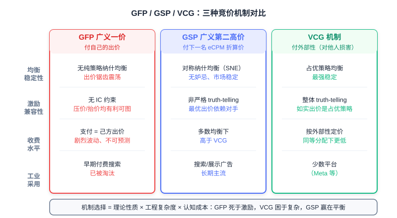

  📖
  ⏱️ ~50 min read
  🎯 Advanced

# 竞价机制：从一价到二价

> 📝 **Before You Continue:** 本章需先读 12.2（eCPM 与计费模式）——所有排序与支付公式都建立在 eCPM 口径之上。本章引入的 **IC/IR** 概念会在 [8.3](../part8-e2e/e2e-advertising.md)（端到端生成式广告 EGA）中被深度使用，建议两章对照阅读。

搜索结果页最顶上那几条广告位，每个值多少钱？这个问题没有「正确答案」——它取决于一次拍卖怎么设计。广告系统价值 = 广告转化效率 × 计价机制 × 广告资源量 × 投放效率，计价机制是四大支柱中最「制度性」的一个：它不优化任何模型，却决定了所有参与者的行为方式。经济学告诉我们「价格围绕价值上下波动」，而一个好的 **竞价机制（Auction Mechanism）** 应当让价格无限逼近其价值。

这条路走得并不平坦。1998 年 Overture 首创付费搜索时采用一价拍卖，结果广告主们陷入了永不停歇的出价追逐战；2002 年 Google 引入二价思想后市场才稳定下来；而到 2019 年前后，程序化交易的头部交易所又集体回到了一价。一价 → 二价 → 再回一价，这个循环的每一步都蕴含着机制设计的深层逻辑。

读完本章，你将能够：

- 用 **位置拍卖（Position Auction）** 模型描述多坑位广告的分配与计价，写出期望价值 $u_{is} = v_i \cdot x_s$ 与 eCPM 排序规则
- 解释 **广义第一高价（GFP）** 为何不存在稳定的纯策略纳什均衡，并逐步推演两人出价的震荡循环
- 证明单坑位 **二价拍卖（Vickrey Auction）** 下如实出价是占优策略，并给出 **激励兼容（IC）** 与 **个体理性（IR）** 的形式化定义
- 手算 **广义第二高价（GSP）** 与 **VCG** 在多坑位下的支付与效用，说清二者在 truth-telling 与收费水平上的差异
- 用交互式模拟器亲手验证「虚报会发生什么」，完成 5 道分层练习题

---

## 12.3.0 位置拍卖模型：把「卖广告」变成数学问题

我们先建立一个能统一描述所有竞价场景的框架。设页面上有 $S$ 个广告坑位、$N$ 个参与竞价的广告主；广告主 $i$ 对「一次点击」有 **真实估值（Valuation）** $v_i$（这是他的私人信息，平台看不到），并向平台提交 **出价（Bid）** $b_i$（CPC 口径，即声称每次点击愿意付多少钱）。坑位有天然的优劣：位置越靠前越容易被点击，我们用 **位置点击率** $x_1 > x_2 > \cdots > x_S$ 刻画，$x_s$ 是坑位 $s$ 的点击率。

于是广告主 $i$ 拿到坑位 $s$ 的期望价值为：

$$u_{is} = v_i \cdot x_s$$

一次点击值 $v_i$ 元，坑位 $s$ 以概率 $x_s$ 产生点击，二者相乘就是这次展示对广告主的期望价值。这个模型叫 **位置拍卖（Position Auction）** ：多个广告主竞争多个有次序的坑位，坑位之间的唯一差异是点击率。对展示广告（CPM 结算）只有一个坑位，$s=1$，模型退化为单坑位拍卖；搜索广告的信息流广告位、电商的推荐坑位，都是 $S>1$ 的情形。

平台怎么看？平台看不到 $v_i$，只能按申报的出价计算每个组合的期望收益，即 12.2 引入的统一口径：

$$\text{eCPM}_{is} = b_i \cdot x_s$$

把广告主按出价从高到低排、依次配到点击率从高到低的坑位，总 eCPM 最大（排序不等式的直接推论）。所以无论采用哪种定价机制， **分配规则** 几乎总是「按出价（乘以质量分）排序」——真正让各家机制分道扬镳的，是 **定价规则** ：赢家到底付多少钱。

### 🧠 Mental Model: 排座位收费

> 把广告位想成教室里有次序的座位：前排看得清（高 CTR），后排看不清（低 CTR）。每个学生（广告主）心里都有前排座位值多少钱的底价（$v_i$），但报名（出价 $b_i$）时可以撒谎。老师（平台）按报名高低排座位，然后收学费。关键在于学费怎么定：按「你自己报的价」收，学生就会疯狂试探底线；按「刚好压过你后面那个人」收，报真实底价才不吃亏。本章的全部内容，就是这一句直觉的严格化。

任何竞价机制都可以拆成两半： **分配规则（Allocation Rule）** 决定「谁赢哪个坑」， **定价规则（Pricing Rule）** 决定「付多少」。分配规则决定市场的效率（好广告是否拿到好位置），定价规则决定市场的诚实度（广告主是否愿意报出真实估值）。接下来的三节，我们将看到同一套分配规则配上三种不同定价规则——一价、二价、外部性定价——会导出截然不同的市场形态。

> **Analysis:** 位置拍卖模型有两个简化假设：坑位点击率只与位置有关（真实系统还要乘以广告自身的质量分，即 $b_i \cdot q_i \cdot x_s$ 排序）；广告主估值在一次拍卖内不变。尽管如此，它足以揭示机制设计的全部分歧点——分配与定价的分离、激励与稳定的权衡，后续所有工业复杂度都是围绕这个骨架做的加法。

---

## 12.3.1 一价拍卖 GFP 的失败：为什么「付自己出的价」行不通

最直觉的定价规则是 **一价拍卖（First-Price Auction）** ：谁出价高谁赢，赢家按自己的出价支付。推广到多个坑位就是 **广义第一高价（Generalized First Price, GFP）** ：按出价排序分配坑位，每个人按自己的出价付钱。1998 年 Overture 用这套机制开创了付费搜索，也在随后几年里让整个市场陷入了 chronic 的震荡。

问题出在哪？在一价下，你的支付与你的申报完全绑定——报高了自己多付，报低了自己省钱。假设单坑位、两个广告主 A 和 B，估值分别为 $v_A = 1.10$、$v_B = 1.05$（元/次点击）。每一轮拍卖的出价动态如下：

| 轮次 | A 的出价 | B 的出价 | 领先者 | 领先者该轮效用（元/点击） |
|---|---|---|---|---|
| 1 | 1.00 | **1.01** | B | 0.04 |
| 2 | 1.02 | **1.03** | B | 0.02 |
| 3 | 1.04 | **1.05** | B | 0.00（贴到估值，无利可图） |
| 4 | 1.04 | **0.90** （崩落回撤） | A | 0.06 |
| 5 | **0.91** （压价到刚好压制） | 0.90 | A | 0.19 |
| 6 | 0.91 | **0.92** | B | 0.13 |
| 7 | **0.93** | 0.92 | A | 0.17 |
| … | 缓慢爬升，逼近 1.05 后再次崩落 | | | |

注意每一轮的两个细节：落后者永远只比对手 **高一丁点** （0.01）就足以抢走坑位；而领先者一旦发现对手回撤，立刻把出价砍到刚好压过对手（1.04 → 0.91）。价格呈锯齿状循环：爬升—逼近估值—崩落—再爬升，永不收敛。

这个追逐没有终点，我们可以严格说明原因。**纯策略纳什均衡（Pure-Strategy Nash Equilibrium）** 要求存在一个出价组合，任何一方单独改变出价都无法获益。检验任意组合 $(b_A, b_B)$、$b_A > b_B$：只要两者差距大于最小加价单位，赢家 A 就可以降到 $b_B + \varepsilon$ 依然获胜并省下真金白银——偏离有利；而只要 B 的估值高于 A 的当前出价，B 加价 $\varepsilon$ 即可夺回坑位——偏离同样有利。两条修正规则互相追逐，永远不存在「双方都不想动」的组合。这正是刘鹏笔记中的结论：一价拍卖容易导致价格频繁波动的「**纳什不均衡**」。

图中蓝线是 A 的出价、黄线是 B 的出价，虚线是两人的估值上限。可以看到出价互相追逐着爬升，贴到估值后崩落，然后再爬升——市场永远在寻找一个不存在的平衡点。

市场层面的后果是系统性的。平台收入随出价锯齿剧烈波动，无法预测；广告主必须七乘二十四小时盯着对手调价，运营成本高企（当年甚至催生了专门的自动出价代理）；更糟的是，出价不再传达任何真实信息——你看到的 $b_i$ 只是对手上一轮试探的结果，与他的真实估值 $v_i$ 毫无关系。GFP 的失败告诉我们： **机制不是中性的容器，定价规则本身就在塑造参与者的行为**。

> **Analysis:** GFP 的教训在机制设计史上极为经典：分配效率没问题（出价高者得高位），坏的只是激励结构。它同时也解释了为什么「让广告主自己优化出价」在一价下行不通——出价是最优反应函数的迭代，而非一个可静态优化的参数。修复方向因此清晰：把「支付」与「申报」解耦，让谎报无利可图。

---

## 12.3.2 二价拍卖与激励兼容：让说真话成为最优策略

修复方案由经济学家 William Vickrey 于 1961 年提出（他因此获得 1996 年诺贝尔经济学奖）。**二价拍卖（Second-Price Auction）** ，也叫 **Vickrey 拍卖** ：出价最高者赢，但按 **第二高出价** 支付。单坑位下，赢家支付的是「别人的价」，而不是「自己报的价」。

为什么这一改动如此关键？我们证明：在二价下，如实出价 $b_i = v_i$ 是 **占优策略（Dominant Strategy）**——无论别人怎么出，说真话都不比任何谎报差。设你的估值为 $v$，其他广告主的最高出价为 $B$，考察两个偏离方向：

- **出低价** $b < v$：你的支付本来就跟自己的出价无关（赢了付 $B$），所以出低唯一改变的，是那些 $b < B < v$ 的局面——这些局你按真话本可以赢且效用 $v - B > 0$，现在却白丢了。赢面缩水，支付没变， **只会变差**。
- **出高价** $b > v$：多赢来的都是那些 $v < B < b$ 的局面——你赢了，但要付 $B > v$，效用 $v - B < 0$，比不赢（效用 0）更惨。原本能赢的局面支付照旧， **也只会变差**。

两个方向都堵死，恰好按估值出价同时避免了「白丢赢面」和「亏本赢」两种错误。支付与申报解耦，申报才敢暴露真话——这是二价拍卖全部魔力的来源。

### 🧠 Mental Model: 精明的举牌代理

> 二价拍卖等价于你委托一位绝对精明的代理去现场举牌：你告诉他你的底价 $v$，他永远只把价加到「刚好赢过在场最高出价」为止。你不用猜对手、不用留利润空间——报出真实底价，代理自动帮你省到极限。密封二价拍卖只是把这个代理做成了制度。

这个性质有正式名字，它们是贯穿本章与 8.3 的两个核心概念。**激励兼容（Incentive Compatibility, IC）** ：如实报告估值是占优策略，形式化地，对任意谎报 $b_i$：

$$u_i(v_i;\, v_i, \boldsymbol{b}_{-i}) \;\geq\; u_i(v_i;\, b_i, \boldsymbol{b}_{-i})$$

**个体理性（Individual Rationality, IR）** ：参与拍卖不会让理性的参与者吃亏，即支付不超过申报价值 $p_i \leq b_i$，效用非负。IC 保证「说真话不亏」，IR 保证「参与不亏」——二者合起来，市场才有稳定的诚实参与者。

> 💡 **Key Insight:** [8.3](../part8-e2e/e2e-advertising.md) 的 EGA 把 IC 量化为 **ex-post regret**（谎报最多能多赚多少，IC $\Leftrightarrow$ regret = 0）并写进损失函数，用 Sigmoid 支付率保证的正是 IR。本章的定义是那套端到端 machinery 的经济学原点——机制设计正从「后处理规则」变成「可微的模型约束」。

> **Analysis:** 二价的严格 IC 只在单坑位成立。坑位一多，「按第二高出价支付」无法直接推广——不同坑位点击率不同，支付必须跨位置折算，而这个推广（下一节的 GSP）恰好丢掉了占优策略性质。单坑位是机制设计的实验室，多坑位才是工业战场。

---

## 12.3.3 广义第二高价 GSP：多坑位的工程折中

多坑位下怎么把二价思想推广？ **广义第二高价（Generalized Second Price, GSP）** 给出工业界沿用二十年的答案：仍按出价（eCPM）排序分配坑位，但第 $i$ 名广告主 **按「下一名的 eCPM 折算到自己点击率」支付**。CPC 计费下，第 $i$ 位（坑位点击率 $x_i$，下一名出价 $b_{i+1}$、坑位点击率 $x_{i+1}$）的每点击支付为：

$$p_i = \frac{b_{i+1} \cdot x_{i+1}}{x_i}$$

末位没有「下一名的坑位」可参照，按 **最低保留价（Reserve Price）** $r$ 支付。直觉有三层。其一：你抢占坑位 $i$，把下一名挤到了坑位 $i+1$，你造成的「展示机会损失」以 eCPM 计就是 $b_{i+1} \cdot x_{i+1}$，除以 $x_i$ 折算成你的每次点击单价。其二：$p_i \cdot x_i = b_{i+1} \cdot x_{i+1}$——你付的 eCPM 恰好等于下一名在其位置上的 eCPM，即 **保住第 $i$ 名所需的最小 eCPM**。其三：你的支付只取决于下一名的出价，与你自己的申报解耦了一半——这正是二价思想的残留。

给一个完整数值例子。三个坑位 $x_1 = 0.40,\ x_2 = 0.20,\ x_3 = 0.10$，保留价 $r = 0.50$；三个广告主甲、乙、丙估值分别为 $4, 3, 2$（先假设如实出价以便对比机制，$b = v$）。按出价排序：甲 $\to$ 坑位 1、乙 $\to$ 坑位 2、丙 $\to$ 坑位 3。支付与效用逐一可算：

| 坑位 | CTR | 广告主 | 出价 | 支付 $p_i$（元/点击） | eCPM 支付 | 效用 $(v_i - p_i) \cdot x_s$ |
|---|---|---|---|---|---|---|
| 1 | 0.40 | 甲 | 4.0 | $3.0 \times 0.20 / 0.40 = \mathbf{1.50}$ | 0.60 | $(4-1.5)\times 0.40 = 1.00$ |
| 2 | 0.20 | 乙 | 3.0 | $2.0 \times 0.10 / 0.20 = \mathbf{1.00}$ | 0.20 | $(3-1.0)\times 0.20 = 0.40$ |
| 3 | 0.10 | 丙 | 2.0 | 保留价 $r = \mathbf{0.50}$ | 0.05 | $(2-0.5)\times 0.10 = 0.15$ |

甲出价 4 元却只付 1.5 元——省下的 2.5 元正是二价机制给「敢报真话」的奖励。

但 GSP 有一个必须诚实地面对的缺陷： **它不是严格 truth-telling 的**。刘鹏笔记的原话是：GSP「整体市场不是 Truth-telling 的，与 VCG 相比会收取广告主更多的费用」。用一个两坑位反例看清「说真话不必最优」。设 $x_1 = 0.40,\ x_2 = 0.30$，保留价 $r = 0.20$；甲 $v = 4$、乙 $v = 3$，均如实出价。甲占坑位 1，支付 $p = 3 \times 0.30 / 0.40 = 2.25$，效用 $(4 - 2.25) \times 0.40 = 0.70$。但若甲把出价降到 2.0（主动落到坑位 2），只需付保留价 0.20，效用变为 $(4 - 0.20) \times 0.30 = 1.14 > 0.70$——**说真话不是最优策略**。GSP 下最优出价依赖对手的出价，不存在占优策略；当坑位间点击率差距小、下一名出价又高时，主动降档反而更划算。

那 GSP 为什么没有像 GFP 一样崩掉？因为它在博弈层面仍有秩序。GSP 存在 **对称纳什均衡（Symmetric Nash Equilibrium, SNE）** ，且该均衡是 **无妒忌（Envy-free）** 的：均衡中每个广告主都不想与相邻位置的人互换——若你顶到上一位，就得支付上一位的价位，效用不会提高。无妒忌意味着没有人有动机去抢别人的位置，市场得以稳定。也正是在均衡意义上，GSP 与 VCG 的收费差异显现：GSP 的均衡出价系统性高于真实估值，VCG 结算位于均衡收费区间的下界，因此 GSP 在多数均衡下 **收取广告主更多费用**。

> **Analysis:** GSP 的胜利是工程折中的胜利。计算上，每次清算只需下一名的出价与两个坑位的 CTR，无需任何全局信息，毫秒级出价服务毫无压力；语义上，「你的价格由你后面的人决定」广告主一听就懂。理论性质（严格 IC）换工程性质（简单、稳健、可解释），这笔交易在二十年的工业实践中被证明是划算的——直到程序化时代多中介链路打破了这个平衡（见 12.3.5）。

---

## 12.3.4 VCG 机制：为「外部性」定价

如果说 GSP 是工程折中， **VCG 机制（Vickrey-Clarke-Groves Mechanism）** 就是理论最优解。它的定价哲学一句话可以说完： **每个广告主的收费，等于他给其他所有参与者造成的外部性损害**——「你不在场，其他人本可多赚多少」。你被分配到坑位 $s$，就把你身后所有人往下挤了一位（甚至挤出榜单），每个人因此损失的价值之和，就是你该付的总账：

$$P_i \;=\; \underbrace{\sum_{j \neq i} u_j^{\text{无 } i}}_{\text{其他人没有你时的总福利}} \;-\; \underbrace{\sum_{j \neq i} u_j^{\text{有 } i}}_{\text{其他人在场时的总福利}}$$

每点击支付再按坑位点击率折算：$p_i = P_i / x_{s(i)}$（实际系统再与保留价取大）。

### 🧠 Mental Model: 用地补偿

> 一块地多个申请人竞拍，VCG 的规则是：赢家不按自己出价付钱，而是**补偿所有落选者因此损失的价值合计**。你占用这块地的社会成本，就是别人失去它的机会成本——为机会成本付费，而不是为「赢」付费。

先验证一个关键退化：单坑位下 VCG 恰好等于二价。你在场时其他人福利为 0；你不在场时，第二名拿到唯一坑位，福利为 $v_2 \cdot x_1$。外部性 $P = v_2 \cdot x_1$，折算到每点击支付 $p = v_2 \cdot x_1 / x_1 = v_2$——正是第二高出价。**二价拍卖是 VCG 的单坑位特例**。

再算一个两坑位的完整例子。广告主甲、乙、丙估值 $v = 4, 3, 2$，如实出价；坑位 $x_1 = 0.40,\ x_2 = 0.20$（丙落榜）。分配仍是甲 $\to$ 坑位 1、乙 $\to$ 坑位 2。逐个计算外部性：

**甲（坑位 1）** ：没有甲时，乙升至坑位 1（$3 \times 0.40 = 1.2$）、丙升至坑位 2（$2 \times 0.20 = 0.4$），他人福利合计 $1.6$；有甲时，乙在坑位 2（$0.6$）、丙落榜（$0$），合计 $0.6$。外部性 $P_{\text{甲}} = 1.6 - 0.6 = 1.00$，每点击支付 $1.00 / 0.40 = 2.50$，效用 $(4 - 2.5) \times 0.40 = 0.60$。

**乙（坑位 2）** ：没有乙时，丙拿到坑位 2（$2 \times 0.20 = 0.4$），甲不动（$1.6$），合计 $2.0$；有乙时，丙落榜，合计 $1.6$。外部性 $P_{\text{乙}} = 2.0 - 1.6 = 0.40$，每点击支付 $0.40 / 0.20 = 2.00$，效用 $(3 - 2) \times 0.20 = 0.20$。

**丙（落榜）** ：没有丙时其他人不变，外部性为 0，支付 0，效用 0。

注意乙的账单为什么这么算：他损害的不是甲（甲反正拿坑位 1），而是被挤落榜的丙——VCG 精确到「每个人的位移」，而 GSP 只看下一名的出价折算，这就是两者的全部差距。

VCG 最诱人的性质是： **整体市场是 truth-telling 的** （刘鹏笔记原文）——如实出价是占优策略，且对任意坑位数成立。证明的关键是一个漂亮的改写。把效用展开：

$$u_i \;=\; v_i \cdot x_{s(i)} - P_i \;=\; \underbrace{\left[\, v_i \cdot x_{s(i)} + \sum_{j \neq i} u_j^{\text{有 } i} \right]}_{\text{真实社会总福利}} \;-\; \underbrace{\sum_{j \neq i} u_j^{\text{无 } i}}_{\text{与你申报无关的常数}}$$

第二项是个常数——「没有你时他人的福利」根本不取决于你怎么申报。于是最大化个人效用等价于最大化第一项，即 **真实的社会总福利**。而机制按你的申报选择「申报福利最大」的分配；当你如实申报时，机制恰好选到真实福利最大的分配——你的私心与社会的公心在数学上被对齐了。谎报只会诱导机制选一个「你以为好、实际不好」的分配。

> **Analysis:** VCG 的工业处境是「理论满分、落地困难」。计算上，每个赢家都要做一次「除他之外的全局重排」，每次广告请求的服务端开销是 $O(N \cdot S \log N)$ 量级，在毫秒级出价链路里代价不菲。信息上，外部性计算需要知道所有参与者的完整收益结构，多级中介的程序化市场根本拿不全。认知上，「你付的是你给别人造成的损失」对广告主太反直觉，账单难以解释、销售难以推销。因此工业界长期偏好 GSP，Meta（Facebook）是少数大规模坚持 VCG 的主流平台。

---

## 12.3.5 GSP vs VCG 对比与「回到一价」

三种机制摆在一起，差异一目了然：

| 维度 | GFP（广义一价） | GSP（广义二价） | VCG |
|------|----------------|----------------|-----|
| Truth-telling | 否，虚报有利可图 | 否，非严格 IC（但存在对称纳什均衡） | 是，占优策略 IC |
| 收费水平 | 支付 = 己方出价，剧烈波动 | 多数均衡下高于 VCG | 按外部性定价，同等分配下更低 |
| 实现复杂度 | 最低（排序即清算） | 低：只需下一名出价与两个坑位 CTR | 高：每赢家一次「除他重排」 |
| 均衡稳定性 | 无纯策略纳什均衡，震荡 | 对称 NE，无妒忌，稳定 | 占优策略均衡，最强稳定 |
| 工业采用 | 早期付费搜索，已被淘汰 | 搜索/展示广告长期主流 | 少数平台（Meta 等） |

静态对比之外，值得亲手做实验。下面的交互式模拟器里有三位广告主，你可以修改每个人的出价与估值，分别在 GFP、GSP、VCG 三种机制下观察分配、支付与效用 $(v_i - p_i) \cdot x_s$；还可以步进演练「压低出价」「抬高出价」之后会发生什么，验证二价/VCG 下说真话效用最大。

<iframe src="../viz/part12-auction.html?embed&vizId=part12-auction" style="width:100%; height:520px; border:none; display:block;" loading="lazy"></iframe>

建议按模拟器的默认剧本走一遍：B 压低出价（GFP 下反而有利，二价系下受损）、B 抬高出价（GSP 下效用不变——无妒忌的体现，VCG 下受损）、C 抬高出价（三种机制下都吃亏，且 GSP 下还连累无辜的 A 与 B）。走完你会对「定价规则塑造行为」有肌肉记忆。

> 📌 **行业动态**：2019 年前后，Google 等头部 ADX 全面从二价转向一价拍卖，以下是这一转变的前因后果（写作时点的公开行业信息，时间线以行业报道为准）。

故事到这里本该结束，但程序化交易改写了结局。随着 **头部竞价（Header Bidding）** 与程序化公开竞价普及，一次展示要经过 SSP → ADX → DSP 的多级链路转售，每一级都可能抽取佣金——二价拍卖的「第二高价」在多级转售后变得不透明：DSP 赢了竞价，却算不清自己最终按谁的「第二价」付了多少。于是 2019 年前后，Google 等头部 ADX 全面转向 **一价拍卖（First-Price Auction）** ：出价即支付，账单清清楚楚。

一价回归的代价是 truth-telling 不再由机制保证——出价直接等于支付，虚高就多付，机制的诚实性约束消失了。缺口由算法补上： **出价遮蔽（Bid Shading）** 成为 DSP 的核心竞争力——用历史竞价数据估计「以出价 $b$ 赢得流量的概率分布」，在出价与赢率之间做期望优化，把出价压到接近「能赢的最低价」。历史完成了讽刺的循环：一价因不稳定被二价取代，二价因不透明又被一价收回——只是这一次的「一价」，配上的是统计学习驱动的智能出价，而非 GFP 时代的裸博弈。

> **Analysis:** 机制选择的深层规律在此显形：机制的理论性质（IC、稳定、收费）从来不是唯一的决策维度，还需要考虑信息结构（谁能看见什么）、链路复杂度（几级中介）与参与者认知成本（账单能不能看懂）。GFP 死于激励，VCG 困于复杂，GSP 赢在平衡，一价回归靠算法接管激励——每一次轮换都是当时的约束条件下最不坏的选择。

---

## 12.3.6 与推荐系统的合流

回望本章，竞价正是广告与推荐的最大分水岭。推荐系统是单边优化：内容不会谎报自己的价值，系统只需对齐用户兴趣；广告是三方博弈——用户要体验、广告主要 ROI、平台要收入，且广告主的估值是私人信息。有私人信息才有谎报的可能，有谎报的可能才需要机制设计——推荐工程师转型广告的第一课，往往就是补上这一章的博弈论视角。

但两条技术路线正在合流。第一个方向是 **智能出价（Smart Bidding）** ：OCPC 等产品让广告主只报目标转化成本，平台代为出价，把出价换算进排序模型——bid 不再是排序分数的后处理乘子，而是作为特征与校准项进入模型，eCPM 约束被嵌入排序本身。第二个方向更彻底：[8.3](../part8-e2e/e2e-advertising.md) 的 **EGA** 把 Token 级竞价嵌入生成过程——分配用竞价引导生成概率，支付用独立网络学习满足 IC 的支付函数，ex-post regret 作为约束写进 Lagrangian 优化。二价拍卖「支付与申报解耦」的核心思想，在生成模型里以「分配与支付解耦」的形态重生。

机制设计的角色因此发生了根本迁移：从 **后处理规则** （排序完成后跑一遍拍卖清算）变为 **端到端约束** （把 IC/IR 写进损失函数、把支付函数变成可学习的网络）。这一趋势对推荐工程师是个好消息——你在 3.x 练就的排序建模能力依然是地基，而本章的机制设计语言（IC、IR、外部性、均衡）正在成为广告算法的准入门槛。读懂拍卖，才读得懂广告系统的经济学骨架。

---

## ⚠️ Common Mistakes in 12.3

| # | Mistake | Example | Why It's Wrong | Fix |
|---|---------|---------|---------------|-----|
| 1 | 以为 GSP 是严格激励兼容的 | 「GSP 是二价，大家都会说真话」 | 二价的占优策略性质只在单坑位成立；跨坑位折算后说真话不必最优 | 区分「单坑位二价（严格 IC）」与「GSP（非严格 IC，靠 SNE 稳定）」 |
| 2 | 把 VCG 的外部性算成自己的收益损失 | 「我不在场我少赚多少就付多少」 | VCG 收的是你 **对别人** 造成的损害，不是你自己的机会成本 | 永远用「其他人总福利之差」计算，与自己的估值无关 |
| 3 | 认为一价天然说真话 | 「付自己出的价，虚报没意义」 | 一价下出价与支付绑定，压价省钱、抬价抢位都有利可图 | 一价下 truth-telling 由 bid shading 策略补位，机制不保证 |
| 4 | GSP 跨坑位支付不做 CTR 折算 | 「第 1 名直接付第 2 名的出价 3 元」 | 不同坑位点击率不同，直接照搬会算错 eCPM 口径 | 回到 eCPM 口径：$p_i = b_{i+1} x_{i+1} / x_i$ |
| 5 | 混淆保留价与第二高价 | 「只有一人出价时付第二高价」 | 无人竞争时没有「第二价」，末位/唯一赢家按保留价支付 | 末位支付 $\max(\text{下一名折算价},\ r)$，无下一名时付 $r$ |

---

## 本章小结

### 📌 Key Takeaways

| Concept | Key Points | Why It Matters |
|---------|-----------|----------------|
| 位置拍卖 | $u_{is} = v_i \cdot x_s$，按 eCPM 排序分配 | 多坑位广告计价的统一框架 |
| 分配 + 定价二分 | 分配规则定效率，定价规则定诚实度 | 读懂一切竞价机制的钥匙 |
| GFP（一价） | 支付 = 己方出价 | 无纯策略 NE，市场震荡，被淘汰 |
| 二价 / Vickrey | 赢家付第二高价 | 单坑位严格 IC：说真话是占优策略 |
| GSP | $p_i = b_{i+1} x_{i+1} / x_i$，末位付保留价 | 工业主流；SNE 稳定、无妒忌，但非 truth-telling |
| VCG | 支付 = 对他人的外部性损害 | 整体 truth-telling；计算与认知成本高，落地少 |
| 一价回归 | Header Bidding 后 ADX 转一价，bid shading 补位 | 机制性质可被算法与市场结构重新分配 |

### ❓ FAQ

**Q1: GSP 与单坑位二价差在哪？**
> A: 单坑位下「下一名」没有位置折算问题，GSP 退化为二价。多坑位下支付必须跨位置按 CTR 折算（$p_i = b_{i+1} x_{i+1} / x_i$），而这个推广丢掉了严格 IC——二价的占优策略性质无法跨坑位延续，GSP 的稳定靠对称纳什均衡而非占优策略。

**Q2: 既然 VCG 理论性质更好，工业界为什么不买账？**
> A: 三个原因：计算复杂（每个赢家一次全局重排，出价链路扛不住）、需要全局信息（多级中介市场拿不全所有参与者的收益结构）、广告主难理解（为「别人的损失」付费，账单解释成本高）。机制落地不只看理论，还要看工程代价与认知成本——GSP 恰好卡在折中点。

**Q3: 一价回归后，DSP 怎么避免当冤大头？**
> A: 机制不再替你「只付第二价」，DSP 只能自己做 bid shading：用历史竞价数据估计「出价 $b$ 赢得流量的概率」，在赢率与支付之间做期望优化，把出价压到接近能赢的最低点。出价策略从「报真实估值」变成一个统计学习问题，这正是它成为 DSP 核心竞争力的原因。

### 🔗 前后关联

- **12.2** （eCPM 与计费模式）——本章所有支付公式都以 eCPM 为统一口径，GSP 的「按下一名 eCPM 折算」直接建立在 12.2 的 CPC/CPM 换算之上。
- **8.3** （端到端生成式广告 EGA）——本章的 IC/IR 定义在 EGA 中被量化为 ex-post regret 并写进损失函数；EGA 的「分配与支付解耦」正是二价思想「支付与申报解耦」的端到端重生。
- **3.x** （精准偏好预测）——pCTR 预估追求的是绝对精度而非相对排序，因为它直接进入 eCPM 排序与 GSP 折算定价，估偏一点价格就算错。
- **5.3** （生成式范式演进）——端到端生成式的整体脉络是理解 12.3.6「机制嵌入模型」趋势的背景板。

---

## Practice Problems

Work through all problems in order — they get progressively harder. Each has a complete solution you can reveal after trying it yourself.

---

**Problem 12.3.1 — 位置拍卖与 eCPM 排序** 🟢 Easy

广告主 A 估值 $v_A = 5$、出价 $b_A = 2.0$；广告主 B 估值 $v_B = 3$、出价 $b_B = 2.5$（均 CPC 口径）。坑位点击率 $x_1 = 0.40$、$x_2 = 0.10$。
(a) 按平台排序规则，各广告主拿到哪个坑位？
(b) 两人对所获坑位的期望价值 $u_{is}$ 各是多少？
(c) 若这是展示广告（单坑位），谁赢？用 eCPM 验证。

💡 Solution (click to reveal)

**Approach:** 按 eCPM 排序，高出价者配高点击率坑位。

- (a) $b_B = 2.5 > b_A = 2.0$，故 B $\to$ 坑位 1，A $\to$ 坑位 2。
- (b) $u_{B,1} = 3 \times 0.40 = 1.20$；$u_{A,2} = 5 \times 0.10 = 0.50$。
- (c) 单坑位时 B 赢。eCPM 验证：$\text{eCPM}_B = 2.5 \times 0.40 = 1.00 > \text{eCPM}_A = 2.0 \times 0.40 = 0.80$。

**Key points:**
- 分配按申报出价而非估值——估值是私人信息，平台不可见。
- 期望价值用估值算（广告主视角），排序用出价算（平台视角），二者不可混用。

---

**Problem 12.3.2 — GSP 三坑位完整支付计算** 🟢 Easy

三个广告主出价 $b_1 = 5.0,\ b_2 = 3.0,\ b_3 = 1.0$，估值 $v_1 = 6,\ v_2 = 4,\ v_3 = 2$；坑位 CTR $x = (0.40, 0.20, 0.10)$，保留价 $r = 0.30$。求每人的每点击支付、eCPM 支付与效用。

💡 Solution (click to reveal)

**Approach:** 逐位套用 $p_i = b_{i+1} x_{i+1} / x_i$，末位付保留价。

| 坑位 | 广告主 | 支付（元/点击） | eCPM 支付 | 效用 $(v_i - p_i) x_i$ |
|---|---|---|---|---|
| 1 | 1 | $3.0 \times 0.20 / 0.40 = 1.50$ | 0.60 | $(6 - 1.5) \times 0.40 = 1.80$ |
| 2 | 2 | $1.0 \times 0.10 / 0.20 = 0.50$ | 0.10 | $(4 - 0.5) \times 0.20 = 0.70$ |
| 3 | 3 | $r = 0.30$ | 0.03 | $(2 - 0.3) \times 0.10 = 0.17$ |

**Key points:**
- 第 1 名出价 5 元只付 1.5 元——支付与申报解耦是二价系的标志。
- 末位没有「下一名折算」，直接按保留价结算。

---

**Problem 12.3.3 — VCG 两坑位外部性计算** 🟡 Medium

广告主甲、乙、丙估值 $v = (5, 3, 1)$，如实出价；两个坑位 $x_1 = 0.40,\ x_2 = 0.20$。
(a) 计算甲、乙的 VCG 每点击支付与效用（丙落榜付 0）。
(b) 验证：若只有一个坑位，甲的每点击支付恰为第二高出价。

💡 Solution (click to reveal)

**Approach:** 对每个赢家计算「无他时他人福利 − 有他时他人福利」。

- (a) **甲（坑位 1）** ：无甲时乙 $\to$ 坑位 1（$3 \times 0.4 = 1.2$）、丙 $\to$ 坑位 2（$1 \times 0.2 = 0.2$），合计 $1.4$；有甲时乙 $\to$ 坑位 2（$0.6$）、丙落榜（$0$），合计 $0.6$。$P_{\text{甲}} = 0.8$，每点击支付 $0.8 / 0.4 = 2.0$，效用 $(5 - 2) \times 0.4 = 1.2$。
  **乙（坑位 2）** ：无乙时丙 $\to$ 坑位 2（$0.2$）、甲不动（$2.0$），合计 $2.2$；有乙时合计 $2.0$。$P_{\text{乙}} = 0.2$，每点击支付 $0.2 / 0.2 = 1.0$，效用 $(3 - 1) \times 0.2 = 0.4$。
- (b) 单坑位时甲的外部性 $= $ 乙本可获得的福利 $v_2 x_1 = 1.2$，每点击支付 $= 1.2 / 0.4 = 3.0 = v_2$，即第二高出价。VCG 在单坑位退化为二价。

**Key points:**
- 乙损害的是被挤落榜的丙，而非甲——外部性按「每个人的位移」精确计账。
- 效用改写 $u_i = \text{真实总福利} - \text{常数}$ 是 VCG truth-telling 的证明骨架。

---

**Problem 12.3.4 — GSP 非严格 IC 的构造性验证** 🔴 Hard

沿用 12.3.3 的反例设定：两坑位 $x_1 = 0.40,\ x_2 = 0.30$，保留价 $r = 0.20$；甲 $v = 4$、乙 $v = 3$。
(a) 双方如实出价时，甲的效用是多少？
(b) 甲改出 2.0 时的效用是多少？这说明什么？
(c) 若乙实际只出 1.0，甲出 2.0 与出 4.0 哪个更优？由此说明 GSP 为什么不存在占优策略。

💡 Solution (click to reveal)

**Approach:** 分情况计算效用，检验「同一策略在不同对手出价下的表现」。

- (a) 甲占坑位 1，$p = 3 \times 0.30 / 0.40 = 2.25$，效用 $(4 - 2.25) \times 0.40 = 0.70$。
- (b) 甲落到坑位 2，付保留价 $0.20$，效用 $(4 - 0.20) \times 0.30 = 1.14 > 0.70$。说真话不是最优——GSP 非严格 IC。
- (c) 乙出 1.0 时：甲出 2.0 占坑位 1（$p = 1.0 \times 0.3/0.4 = 0.75$），效用 $(4 - 0.75) \times 0.4 = 1.30$；甲若降到坑位 2 只得 $1.14 < 1.30$。同一策略「降到 2.0」在 (b) 中更优、在 (c) 中更差——最优出价依赖对手出价，不存在对所有对手出价都最优的策略，即无占优策略。

**Key points:**
- 非严格 IC 的可操作判据：能构造一组对手出价使真话非最优。
- GSP 的博弈本质：广告主在「抢高位多付」与「退低位省付」之间做对手依赖的权衡，均衡由 SNE 刻画。

---

**🏆 Problem 12.3.5 — 证明：单坑位二价下偏离估值出价不增效用**

设单坑位二价拍卖，你的估值 $v > 0$，其他广告主最高出价 $B \geq 0$，你的出价 $b \geq 0$。效用：赢则 $u = v - B$，输则 $u = 0$。证明对任意 $b$ 与任意 $B$：$u(v; b, B) \leq u(v; v, B)$，且结论是「不增效用」而非「严格更优」。

💡 Solution (click to reveal)

**Approach:** 按偏离方向分两种情形，比较胜负边界 $b$ 与 $v$ 相对 $B$ 的位置。

记按出价 $b$ 的效用为 $u(b)$，按真话 $v$ 的效用为 $u(v)$。注意支付始终是 $B$（与 $b$ 无关），效用差异只来自胜负变化。

**情形一 $b < v$** （出低）。$u(b)$ 与 $u(v)$ 只在 $b < B < v$ 区间不同：此区间内 $b < B$ 故出低者输，$u(b) = 0$；而 $v > B$，说真话者赢，$u(v) = v - B > 0$。其余区间（$B \leq b$ 或 $B \geq v$）二者胜负相同、支付相同，效用相等。故 $u(b) \leq u(v)$。

**情形二 $b > v$** （出高）。差异区间为 $v < B < b$：出高者赢但付 $B > v$，$u(b) = v - B < 0$；说真话者输，$u(v) = 0$。其余区间效用相等。故 $u(b) \leq u(v)$。

两情形合并：对一切 $b, B$ 有 $u(v; b, B) \leq u(v; v, B)$，即 $b = v$ 是弱占优策略。注意当 $B = v$ 时任何 $b > B$ 的效用与真话相同（都是 $v - B = 0$），当 $B > v$ 时任何 $b \leq B$ 也同样不输——所以真话是「不劣于一切谎报」，而非「严格优于一切谎报」。

**Key points:**
- 证明骨架：支付与申报解耦 $\Rightarrow$ 效用差异仅来自胜负边界 $\Rightarrow$ 两个偏离方向各输一段区间。
- 这正是 8.3 中 ex-post regret 为零的特例：$\max_b [u(v; b, B) - u(v; v, B)] = 0$ 对一切 $B$ 成立。

