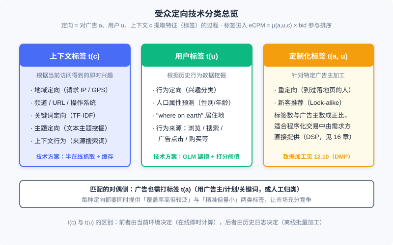
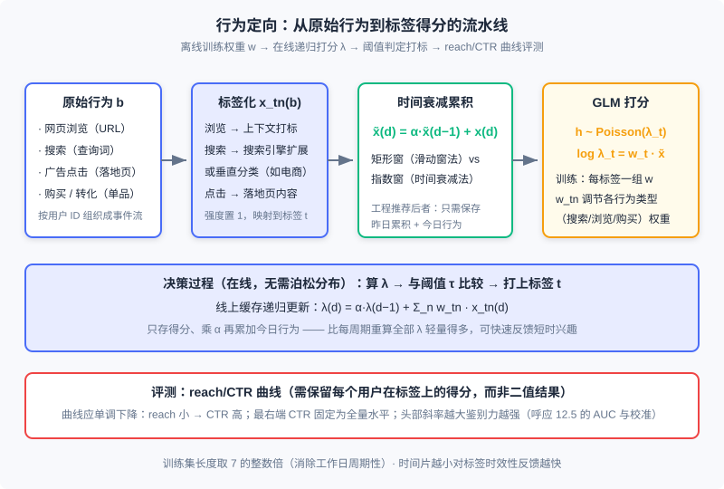

<div style="display: flex; gap: 12px; margin-bottom: 24px; flex-wrap: wrap; align-items: center;">
  <span style="background: #f0f4ff; color: #4A6CF7; padding: 4px 12px; border-radius: 20px; font-size: 0.85em; font-weight: 600; border: 1px solid rgba(74,108,247,0.2);">📖</span>
  <span style="background: #fdf2f8; color: #be185d; padding: 4px 12px; border-radius: 20px; font-size: 0.85em; border: 1px solid rgba(190,24,93,0.2);">⏱️ ~45 min read</span>
  <span style="background: #fef2f2; color: #dc2626; padding: 4px 12px; border-radius: 20px; font-size: 0.85em; font-weight: 600; border: 1px solid rgba(100,100,100,0.15);">🎯 Advanced</span>
</div>

# 受众定向技术

> 📝 **Before You Continue:** 本章需先读 12.1（全景图）——定向标签在 eCPM 排序体系中的位置；12.2（计费模式与核心指标）——eCPM 这把尺子如何消费 $u$ 与 $c$ 上的特征。12.5（偏差与校准）的 AUC 与校准概念将在 12.8.3 的评测环节再次登场；12.7.2 的「反向索引」思想会以对偶形式出现在上下文定向的工程方案里。

12.4 里我们让平台替广告主出价，12.7 里我们让系统按合约分配流量——但两个问题都默认了一件事：你已经知道「这次展示面前站着一个什么样的人」。回答这个问题的技术就是**受众定向（Audience Targeting）**：对广告 $a$、用户 $u$、上下文 $c$ 三个维度提取有意义的特征（业界统称**标签**）的过程。把上下文也视为「即时的用户兴趣」后，受众定向就是展示广告最核心的驱动力，也是计算广告成为大数据典型应用的关键——没有定向，广告只能按广告位粗放售卖；有了定向，同样的流量才能按「人」卖出不同的价钱。

本章沿「分类 → 上下文 → 主题模型 → 行为 → 人口属性」的路线展开：先建立 $t(c)$、$t(u)$、$t(a,u)$ 三类标签的技术分野，再看最轻量的上下文定向（半在线抓取是理解广告系统弱一致需求的绝佳样本），然后进入本章的核心——行为定向的建模、特征生成、决策与评测全链路，最后用一节收尾人口属性预测。主题模型（LSA/PLSI/LDA/word2vec）按「讲清直觉、标注演进」的原则处理。

读完本章，你将能够：

- 按计算框架把定向技术归入 $t(u)$、$t(c)$、$t(a,u)$ 三类，并解释「效果 × 规模」双指标为何是市场充分竞争的前提
- 设计上下文定向的半在线抓取系统，说明它为什么比搜索引擎爬虫轻量得多
- 用一句话讲清 LSA、PLSI、LDA 三代主题模型的演进逻辑与 word2vec 的工程设计
- 完整实现行为定向的特征生成（时间衰减累积）、打分决策（$\lambda$ 阈值）与 reach/CTR 评测
- 判断人口属性预测在什么数据条件下值得做，完成 5 道分层练习题

---

## 12.8.0 定向的分类：t(c)、t(u) 与 t(a,u)

回顾 12.2 的排序算术：$ \mathrm{eCPM} = \mu(a, u, c) \times \mathrm{bid}_a $，其中 $\mu$ 是点击率预估。定向技术回答的正是 $\mu$ 的输入从哪里来——它对 $(a, u, c)$ 三个维度提取特征的过程，产出就是标签。按计算框架的不同，这些标签分为三类：

- **用户标签 $t(u)$**：以用户历史行为数据为依据打上的标签。人口属性定向、行为定向（兴趣定向）属于这一类。
- **上下文标签 $t(c)$**：根据用户当前访问行为得到的即时标签。地域定向、频道定向、上下文定向属于这一类。
- **定制化标签 $t(a,u)$**：也是一种用户标签，不同之处在于它是针对某一特定广告主而言的，必须根据广告主的属性或数据来加工。重定向与新客推荐（Look-alike）属于这一类。定制化标签的数量不再是常数，而可能与广告主数目成正比，因此天然适合在程序化交易环境中由需求方直接提供——这条线在 12.10（数据管理平台）与 DSP 技术中展开。

还有一个容易忽略的对偶侧：每个广告 $a$ 自己也要打上标签 $t(a)$，才能与 $t(u)$、$t(c)$ 匹配。常用做法有二：直接把广告主、广告计划、广告组、关键词等投放层级信息用作标签，或人工归类。



图中三类标签的实现方案差异很大：$t(c)$ 在广告请求时即时计算（在线），$t(u)$ 离线批量加工历史日志（离线），$t(a,u)$ 则依赖广告主的数据供给——这也是本章只重点展开前两类的原因。

对某种定向技术，需要同时关注**效果**与**规模**两个指标：既要有覆盖率高但精准程度有限的标签，也要有非常精准但量相对较小的标签。这不是工程上的妥协，而是市场设计——只有标签谱系拉开了效果与规模的两端，不同预算与目标的广告主才能各取所需，竞价广告才有充分竞争的基础。

### 🧠 Mental Model: 图书馆的三张索引卡

> 把广告系统想成一座图书馆。$t(c)$ 是「这本书现在摊开在哪一页」——你进门时手里正翻着菜谱，管理员立刻递上一本烹饪杂志，即时但不深；$t(u)$ 是「这位读者过去一年的借阅记录」——离线整理出来的阅读画像，深但要等；$t(a,u)$ 是「出版社指名要找的那批读者」——需求方自带名单，图书馆只负责对接。三种索引各管一段信息，合起来才能在每一次请求的瞬间答出「该把哪本书递给谁」。

---

## 12.8.1 上下文定向：即时兴趣的轻量加工

$t(c)$ 类定向里，有一批根据广告请求参数简单运算即可得到：地域（IP/GPS）、频道、URL、操作系统等。真正需要讨论的是第二类——根据上下文页面的内容特征（关键词、主题、分类）打标签。打标签的方法归纳为五种思路：

1. **规则归类**：把页面按域名归入频道或主题分类（如 `auto.*.com` 下归入「汽车」），简单直接；
2. **关键词提取**：把搜索引擎的关键词匹配技术推广到媒体页面，是上下文定向的基本方法；
3. **入链锚文本关键词**：需要全网爬虫支持，已超出一般广告系统的范畴；
4. **流量来源搜索词**：分析访问该页面的用户从哪些搜索词跳转而来，需要页面访问日志支持，技术方案上更接近行为定向；
5. **主题模型映射**：把页面内容映射到语义空间的一组主题上，目的是泛化广告主需求、提高市场流动性——这是 12.8.2 的主题。

关键词提取是基础技术。信息检索的通用做法是选页面中 TF-IDF 较高的词；更有效的变体是**需求方驱动**：从广告主相关描述中得到商业价值高的关键词表和 IDF，再与页面词频一起计算 TF-IDF。当能拿到丰富广告信息时（如运营搜索文本广告、或拿到广告主 SEM 词表），后一种方法往往更准——因为它筛的是「商业价值高」的词，而非「统计显著」的词。

### 半在线抓取：广告系统弱一致需求的教科书案例

页面的标签不可能在广告请求发生的几毫秒内实时分析出来。那要不要像搜索引擎那样预先全网抓取？不需要——页面信息对搜索引擎是服务的主体，对广告系统只是锦上添花的补充。据此可以设计一个**半在线抓取系统**：不做任何离线抓取，在线服务时产生实际需求后才尽快抓取。

工作流程用缓存（如 Redis）保存每个 URL 对应的标签：

1. 广告请求到来，URL 命中缓存 → 直接返回标签；
2. 未命中 → 为不阻塞请求，**当时返回空标签集合**，同时把 URL 加入后台抓取队列；秒至分钟量级后该页面被抓取、打标、入缓存；
3. 设置缓存 TTL（time to live），页面内容更新后标签自动过期重抓。

这个方案的巧妙处在于两点：缓存命中率极高——只有最近真有广告请求的 URL 才会被抓取，爬虫资源不浪费在可能永远用不到的页面上；覆盖率也高——页面在第一次广告请求后很快就有标签。付出的代价是少量请求拿到空标签，而这恰恰是可接受的：某一次展示标签缺失并不致命，广告系统只要保证大多数决策最优，少量次优甚至随机决策都可以容忍。这种**弱一致**的业务需求是设计高效率、低成本广告系统的关键洞察，在 12.7 的频次缓存（哈希键 + 弱一致）里我们已经见过同款思路。

> **Analysis:** 半在线方案的复杂度不在算法而在系统：缓存读路径要求毫秒级响应，抓取队列要求秒级吞吐，两者解耦靠的是「允许暂时返回空」。对比搜索引擎爬虫：全网抓取、全量索引、强一致更新，成本高几个量级。定向标签的在线检索则与 12.7.2 的流量预测构成对偶——那里文档是 $(u,c)$ 标签组合、查询是广告定向条件；这里文档是 URL 标签、查询是广告请求，都靠倒排索引撑住查询延迟。

> 🔮 **2026 现状注解**：页面关键词与主题打标今天普遍由 embedding 与 LLM 完成——页面内容过一遍向量模型或大模型即可输出结构化标签，效果与维护成本都优于手工词表 + TF-IDF 的老方案。但「半在线缓存 + TTL + 允许空返回」的骨架完全没变：现代系统的推理结果同样写进这层缓存，按 URL 复用。变的打标手段，不变的系统形态。

---

## 12.8.2 文本主题挖掘：从 LSA 到 word2vec

上下文定向的粒度可以细到关键词，也可以粗到页面类型；介于两者之间，可以把页面映射到一组有概括意义的主题上（如把编程博客映射到「IT 技术」）。把页面视为文档，这就是**文本主题模型（topic model）**的研究问题。主题模型分两大类：监督式——预先定义主题集合，把文档映射上去；非监督式——不预定义集合，自动学出主题与映射。用途决定选择：只做广告效果优化的特征提取，两者皆可；若用于向广告主售卖的标签体系，应优先监督式——广告主需要的是预先定义好、可解释的标签，而不是一堆统计意义上的「簇」。

三代非监督模型的演进脉络值得用直觉串起来。设词表大小 $M$，文档集 $\{d_1, \dots, d_N\}$ 以词袋（BoW）表示为矩阵 $X$（$x_{nm}$ 为词 $w_m$ 在文档 $d_n$ 中的词频或 TF-IDF 值），目标是对每个文档得到 $T$ 个主题上的强度。

**LSA：几何视角。** 对 $X$ 做奇异值分解，保留最大的 $T$ 个奇异值、将其余置零：

$$X \approx (\alpha_1 \cdots \alpha_T)\, \mathrm{diag}(s_1, \dots, s_T)\, (\beta_1 \cdots \beta_T)^{\mathsf T}$$

它去掉了大多数非主要因素的影响，得到语义空间的平滑描述。缺陷在于两个变换矩阵不保证元素非负——直觉上意味着「一篇文档有某主题时，某些词频的期望为负」，这与直觉不符。

**PLSI：概率视角。** 把同一思想用文档生成过程重新表述：先按分布从文档 $d_n$ 选出主题 $z$，再按 $p(w_m \mid z)$ 从主题生成词。这就是**概率潜在语义索引（PLSI）**——概率化了的 LSA，两个条件分布对应 LSA 的两个变换矩阵，但所有元素为正，直觉上更合理。它还是指数族混合分布的特例，可以直接套 EM 算法与 MapReduce/MPI 迭代解法；而 SVD 的分布式化需要专门技巧。因此海量数据场景下 PLSI 比 LSA 有实用优势。

**LDA：贝叶斯视角。** 给 PLSI 的主题分布 $w$ 加上共轭先验 Dirichlet 分布，参数变随机变量——这就是**潜在狄利克雷分配（LDA）**。贝叶斯框架的价值在数据噪声大或文档较短时提供有效平滑；求解用变分法近似或更常用的吉布斯采样（Gibbs sampling），后者也更容易分布式实现。

**word2vec：表示学习的起点。** 主题模型之后，**词嵌入（word embedding）**把词级语义映射成稠密的实数向量：词表维度降到一个 $K$ 维特征空间，相近的词彼此靠近，词的表示因此具有泛化性。word2vec 常被误认为深度学习模型，其实它层次很浅、隐藏层都被省去了。以「CBOW + 哈夫曼树」为例：输入层用连续词袋（CBOW）——与 n-gram 相似，但基于上下文窗口词预测当前词，上下文词向量平均后直连输出层；输出层若对整个词表做 softmax，计算复杂度是难以承受的 $O(|V|)$，word2vec 的特殊设计是把词表编码成一棵哈夫曼树，目标词沿树路径逐层做二元 softmax（逻辑回归），复杂度降到 $O(\log |V|)$。这正是它单机训练高效、2013 年开源后迅速流行的工程原因。

词嵌入有语义可加性，短语、句子、文章的语义也可以嵌入表达；又因基于非线性变换、部分考虑了上下文结构，在短文本场景逐渐取代了 LDA。但它与无监督 LDA 有同样的问题：只基于词共现做无监督学习，不能针对具体任务学习语义，特定任务上效果与主题模型差距不大——真正带来跃升的是后面用有监督方式训练任务相关的词表示。

> 🔮 **2026 现状注解**：必须坦率地说，**主题模型打标在今天的工业界已经边缘化**。现代标签加工的主流路线是 embedding 打标：word2vec（无监督共现）→ 双塔/图 embedding（有监督任务对齐，见 Part 3 检索篇）→ LLM 打标（零样本输出结构化标签体系）。那为什么还要保留这一节？两条理由：其一，word2vec 是 embedding 思想的历史源头，「用无监督目标从共现数据里学稠密表示」的范式由此确立，理解它才理解后续所有表示学习；其二，LDA 的「文档—主题—词」三层生成假设至今是可解释标签体系的思维模板。学它们是为了继承直觉，不是为了在生产环境复刻。

> **Analysis:** 四种技术的工程画像：LSA 依赖 SVD，分布式化困难，适合小规模离线分析；PLSI 用 EM，天然可分布式，曾是海量文档打标主力；LDA 加了先验更稳健，Gibbs 采样易并行；word2vec 单机即可训练大词表，是四者中唯一在今天的系统里仍以「变体形态」活跃的技术——它的后代（item2vec、双塔、图 embedding）遍布广告与推荐。若你的场景是「给页面打可售卖标签」，2026 年的正确答案是监督分类或 LLM 打标，而非本节的任何非监督模型。

---

## 12.8.3 行为定向：从历史行为到标签得分

现在进入 $t(u)$ 的核心——**行为定向（Behavioral Targeting, BT）**：根据用户一段时期内的各种网络行为，把用户映射到某个定向标签上。它是在线广告中数据利用与变现最重要的计算问题之一，我们分建模、特征生成、决策、评测四步走完全程。

### 建模问题：用泊松分布描述点击

行为定向的目标是找出在某类广告上 eCPM 相对较高的人群。若假设该类广告上点击价值近似一致，问题就转化为找出**点击率较高的人群**——于是建模对象取「某用户在某类广告上的点击量」。点击是离散到达的随机变量，最自然的概率描述是泊松分布：

$$p(h) = \frac{\lambda_t^h \mathrm{e}^{-\lambda_t}}{h!}$$

其中 $h$ 是某用户在某定向类别广告上的点击量（单位有效展示对应的点击数，直接比较单位时间点击量没有意义），$t$ 是受众标签，$\lambda_t$ 是控制点击到达频繁性的参数。行为定向模型要做的，就是把用户行为与 $\lambda_t$ 联系起来。用线性模型联系（对数链接），得：

$$\log \lambda_t = \sum_{n=1}^{N} w_{tn}\, x_{tn}(b)$$

其中 $n$ 枚举行为类型（搜索、网页浏览、购买等），原始行为 $b$ 先经过**特征选择函数** $x_{tn}(b)$ 映射为特征，$w_t = (w_{t1}, \dots, w_{tN})^{\mathsf T}$ 是标签 $t$ 对应的待优化参数。代入泊松分布，就得到行为定向的整体模型。

这是工程上极典型的**广义线性模型（Generalized Linear Model, GLM）**建模思路：面对多自变量回归问题，先按目标值特性选一个指数族分布描述它，再用线性模型把自变量与分布参数联系起来——既利用线性模型更新简单、可解释性强的优点，又对目标变量类型有较强适应性（12.2 的 CTR 预估、12.4 的出价模型都是同一思路的变体）。

两点特别说明。其一，$w$ 可以与标签 $t$ 相关——对不同标签训练不同的线性函数：类别建模更准，但数据不足的类别估计偏差大；此时原始行为也可以经过与标签无关的选择函数，因为类的本质特征已反映在模型参数上。其二，这套方法适用于**有明确需求方意义的标签体系**——只有广告 $a$ 上也有这些标签，才能根据广告上的点击行为来建模。

### 特征生成：标签化与时间衰减

特征生成有两个环节：特征选择函数 $x_{tn}(b)$ 的确定，与训练集的组织方式。样本量大，处理的高效性是主要工程考量。

最常用的特征选择函数，是把一段时间内的原始行为映射到确定的标签体系上，同时计算各行为在对应标签上的累积强度：页面浏览行为用上下文定向的方法把 URL 转成标签、强度置 1；搜索行为按查询词映射标签、强度置 1。模型中的 $w_{tn}$ 实际作用就是调节不同行为类型（搜索、浏览、广告点击、购买）的重要程度。各类行为的标签化是整个计算链路中最关键的一环：

| 行为类型 | 标签化方法 |
|---------|-----------|
| 网页浏览、分享等内容相关行为 | 有监督文本主题模型映射到标签体系，或直接提取内容关键词 |
| 广告点击等广告活动相关行为 | 转化为对落地页内容的分析；文字链创意可直接用题目/描述作内容；图片创意需人工标注，工作量大且正确性难评估，只在必要时做 |
| 搜索、搜索点击等查询相关行为 | 查询信息量少，需借助搜索引擎：或把查询送入通用搜索引擎、用返回结果作内容扩展；或用垂直媒体的标签体系——如电商行业把查询送入淘宝搜索引擎，取返回商品分类作标签，分类分散则视为无标签 |
| 转化、预转化等需求方行为 | 往往对应一个单品，用单品分类信息映射标签；站内搜索按一般搜索行为处理 |

第二个环节是行为累积。过于久远的行为对当前兴趣贡献很小，工程上有两种把行为累积控制在一段时间内的方法。**滑动窗法**：设定窗长 $D$，累加窗口内所有属于 $t$ 的行为强度，窗型是矩形。**时间衰减法**：不设窗长，设衰减因子 $\alpha$，用上一时间片的累积特征与本时间片的行为强度递归得到今天的累积特征（窗型是指数形）：

$$\tilde{x}_{tn}(d) = \alpha\, \tilde{x}_{tn}(d-1) + x_{tn}(d)$$

两种方法没有本质区别（窗型都由唯一参数控制），但工程上推荐时间衰减法：只需保存上一个时间片的累积特征与当前时间片的行为强度，空间和时间复杂度都低。实际建模中一律用累积特征 $\tilde{x}$ 替代单时间片特征 $x$。

训练集组织上，为消除工作日的周期性，训练天数取 7 的整数倍；每个用户累积到前一时间片的特征 $\tilde{x}_t(d)$ 与本时间片的该标签广告点击次数 $h_t(d)$ 构成一个训练样本，时间片越小对标签时效性反馈越快，但样本数正比于训练集长度、反比于时间片长度，总量可能非常大。高效的样本生成算法复杂度约 $O(n)$：预处理时把每个用户各时间片的 $x_{tn}$ 与 $h_t$ 按时间排列成事件流，在事件流上向前滑动，依次得到各时间片的累积特征与训练样本。这正是计算广告架构里「用户行为以用户标识为键组织在一起」的原因——数据组织方式决定了训练能不能跑得动。

### 决策过程：一条递归公式打天下

训练的产出是各标签的权重 $w_{tn}$；决策时不需要泊松分布——只需算出线性函数值 $\lambda$，与预先确定的阈值比较，决定用户是否被打上某标签。当特征累积用时间衰减法时，得分也可以递归地得到：

$$\lambda(d) = \alpha\, \lambda(d-1) + \sum_{n} w_{tn}\, x_{tn}(d)$$

这条公式揭示了线上实现的关键点：存储各用户标签得分的缓存中，每个新周期只需把旧得分乘 $\alpha$ 衰减、再把本周期收集到的原始行为加权求和累加上去——比每个周期重新计算所有 $\lambda$、刷新整个缓存轻量得多。当需要对用户短时行为快速反馈时，这种递归式计算非常有效。



### 评测：reach/CTR 曲线

行为定向模型可以通过调整 $\lambda$ 的阈值控制标签人群的量：阈值调低、人群扩大，精准性一般随之下降——评测必须把「量」考虑进来。业界通行 **reach/CTR 曲线**做半定量评测：reach 是标签接触到的人群规模，reach 与该人群 CTR 构成的曲线是判断定向是否合理、效果如何的重要依据。

读曲线有三个要点。其一，曲线应大体单调下降——小人群更精准（CTR 高），随人群扩大 CTR 走低；若出现非下降趋势或头部偏低（调低规模反而 CTR 下降），说明数据质量或定向建模有问题，需检查流程或判断数据是否根本撑不起该标签。其二，曲线最右端（reach = 100%，全部用户）的 CTR 是固定的，无法靠改善数据和模型提高。其三，曲线斜率越大，定向模型鉴别力越强；实践中阈值往往设得较高以保效果，因此重点关注曲线头部即可。

这套语言与 12.5 完全同构：曲线头部的陡峭程度就是**判别力**（AUC 衡量的排序能力），而全量 CTR 是一个与模型无关的基准点。工程上生成曲线要求数据仅访问一遍——因此离线流程中必须保留每个用户在各标签上的**得分值**，而不是最终二值的打标结果；有了得分，按分数分桶、逐桶累计 reach 与点击即可一次扫完。

> **Analysis:** 行为定向的时间复杂度集中在两处：离线训练样本生成 $O(n)$（事件流一遍扫描），线上决策 $O(1)$（缓存递归更新）。空间上时间衰减法只需存上一时间片状态，是「在线学习」思想在标签系统里的最早实践之一。它的局限同样明显：每个标签独立训练导致长尾标签数据不足、估计偏差大——这正是现代方法（统一用户表示向量 + 序列模型）要解决的问题。

> 🔮 **2026 现状注解**：现代工业界的「行为定向」大多不再按标签独立训练 GLM，而是把用户行为序列编码成统一的用户表示向量（召回侧的 U2I 双塔、精排侧的 DIN/SIM 类序列模型，见 Part 3/Part 4），再由下游任务消费；标签体系退居为特征工程的一部分或 LLM 直接输出。但 GLM + 时间衰减 + 阈值打标这套框架仍是理解一切用户兴趣建模的原型，且在标签售卖型产品（DMP 人群包）里仍在服役。

---

## 12.8.4 人口属性预测：当行为泄露身份

年龄、性别、教育程度、收入水平等**人口属性**严格说不是兴趣，而是用户的确定特点。除实名社交网络外，规模化获得人口属性很困难，因此仍需数据驱动的模型、以行为为基础自动预测。直觉很好理解：经常访问军事或汽车网站的用户以男性居多，常浏览娱乐八卦的用户以女性居多。

以性别为例，这是典型的二分类问题：输入是用户原始行为 $b$（或提取后的特征），输出 $\{M, F\}$，可用最大后验概率框架或 SVM、AdaBoost 等模型求解。建模中有两个关键问题比选模型更重要：

- **拒识门槛**：对行为不够丰富或不够有代表性的用户，必须输出「未知」，而不是让模型硬算一个结果——错打的标签会污染整个定向体系；
- **训练集获取**：算法本身的提升往往不如「更准确、更大规模的训练集」明显。大规模标注通常依赖社交网络——例如把广告系统用户身份与微博用户对应，从微博公开属性获得标注。

性别之外的属性用简单分类模型并不准确。以年龄为例：把标签设为 5 个年龄段时，把第一个年龄段错分到第二段与错分到第三段的代价显然不同，简单多分类忽略了这种**有序错分代价**，教育程度、收入水平类似。总体上说，从行为预测非性别属性是较难的任务，除非有强相关的数据来源和充分多的准确训练样本，否则不建议硬做。

> 🔮 **2026 现状注解**：今天主流的人口属性标签早已不靠问卷或第三方数据包，而是「点击反馈 + 模型预估」：用户在广告上的点击、转化行为作为弱监督信号，配合实名场景（社交登录、支付实名）的合规数据训练预估模型，覆盖率与精度都远超旧方案。同时，隐私合规（个人信息保护相关法规）对人口属性这类「身份数据」的收集与交易提出了远比 2010 年代严格的约束——12.6 开环闭环里讨论的身份基础设施与合规边界，正是这条线今天的延伸。

最后补一句互链：把本章的数据收集与定向功能独立出来做成专门产品，就是**数据管理平台（DMP）**——它对接第一方、第二方、第三方数据，按受众标签做灵活的人群划分，再通过用户身份对应与数据传递把标签卖给购买方（如 DSP）。技术架构不过是本章功能的独立化，产品与技术细节见 12.10。

---

## ⚠️ Common Mistakes in 12.8

| # | Mistake | Example | Why It's Wrong | Fix |
|---|---------|---------|---------------|-----|
| 1 | 模仿搜索引擎做全量离线爬取 | 预先把全网页面抓下来打标签建索引 | 页面标签对广告只是补充信息，全量抓取成本高数个量级，且绝大多数页面永远等不到广告请求 | 半在线抓取：请求驱动 + 缓存 + TTL，允许暂时返回空标签 |
| 2 | 用无监督主题模型直接构建售卖标签体系 | 跑一个 LDA，把聚出的 50 个「簇」当标签卖给广告主 | 无监督簇不可解释、不可控，广告主无法理解也无法采买；售卖标签必须预先定义且可解释 | 售卖标签用监督分类；无监督结果只做效果优化的内部特征 |
| 3 | 用单时间片特征训练行为定向模型 | 只用「今天浏览过汽车页 = 1」作特征 | 单日行为噪声大、周期性强，丢失了兴趣的时间累积结构 | 用滑动窗或时间衰减累积特征 $\tilde{x}$ 替代单时间片 $x$，推荐时间衰减法 |
| 4 | 线上每周期重算所有用户的标签得分 | 定时任务全量刷新 λ 缓存 | 用户 × 标签的组合是天文数字，全量重算既慢又贵 | 用递归式 $\lambda(d) = \alpha\lambda(d-1) + \sum_n w_{tn} x_{tn}(d)$ 在缓存上原地更新 |
| 5 | 评测标签只看一个人群规模的 CTR | 「reach 5% 时 CTR 0.9%，标签很准」 | 单点无法区分鉴别力与人群规模的影响，也无法发现曲线非单调的建模问题 | 保留得分值生成完整 reach/CTR 曲线，检查单调性与头部斜率 |
| 6 | 人口属性预测无拒识、把低置信结果硬打上 | 行为只有 3 条的用户也被打了「女，25–30 岁」 | 错打的身份数据会污染下游所有定向与频控，且此类错误难以被点击类指标发现 | 设置拒识门槛，行为不足输出「未知」；优先扩充准确训练集而非换模型 |

---

## 本章小结

### 📌 Key Takeaways

| Concept | Key Points | Why It Matters |
|---------|-----------|----------------|
| 定向分类 | $t(u)$ 用户标签 / $t(c)$ 上下文标签 / $t(a,u)$ 定制化标签；广告侧还需 $t(a)$ 匹配；效果 × 规模双指标 | 三类的计算框架（离线挖掘 / 在线即时 / 需求方供给）完全不同，决定系统架构分工 |
| 上下文定向 | 关键词（TF-IDF，需求方驱动 IDF 更优）+ 主题；半在线抓取：请求驱动、缓存 + TTL、允许空返回 | 广告弱一致需求的教科书案例，与 12.7 频次缓存、流量预测反向索引同一思想族 |
| 主题模型演进 | LSA（SVD，允许负值）→ PLSI（概率化 + EM 可分布式）→ LDA（贝叶斯平滑）；word2vec 用哈夫曼树把 softmax 降到 $O(\log\|V\|)$，是 embedding 思想源头 | 主题模型打标已边缘化，但「生成式直觉」与 embedding 范式从这一节生长出来 |
| 行为定向 | 泊松 GLM：$h \sim \mathrm{Poisson}(\lambda_t)$，$\log\lambda_t = w_t \cdot \tilde{x}$；时间衰减累积 $\tilde{x}(d) = \alpha\tilde{x}(d-1) + x(d)$；线上递归更新 $\lambda$；reach/CTR 曲线评测 | 在线广告数据变现最重要的计算问题，所有用户兴趣建模的原型框架 |
| 人口属性预测 | 性别可作二分类；必须有拒识门槛；训练集质量比模型更重要；非性别属性需考虑有序错分代价，预测困难 | 现代做法是点击反馈 + 模型预估替代问卷，且受隐私合规强约束 |

### ❓ FAQ

**Q1: 行为定向为什么用泊松分布，而不是像 CTR 预估那样直接做二分类？**
> 二者针对的问题不同。CTR 预估回答「这次展示被点击的概率」，单次展示、伯努利事件；行为定向回答「这个用户对某类广告的单位有效展示点击量有多大」，点击在时间上是离散到达的计数，泊松分布是计数的自然描述。两者在 12.5 意义下是同一枚硬币的两面：GLM 框架换一个指数族分布，就从一个任务切换到另一个。

**Q2: 时间衰减法与滑动窗法效果有差别吗，为什么工程上总推荐前者？**
> 两者对原始行为的过滤窗形不同（矩形 vs 指数），建模效果没有本质区别。差别全在工程：滑动窗要保存窗长 $D$ 内的全部行为，时间衰减只需保存上一个时间片的累积值和当前行为，空间 $O(D) \to O(1)$，而且得分 $\lambda$ 能用同一条递归式在线原地更新——这是它压倒性胜出的原因。

**Q3: 主题模型已经被淘汰了，这一节为什么还要花篇幅讲 LSA/PLSI/LDA？**
> 三个理由。第一，word2vec 是 embedding 思想的源头，而 embedding 是今天一切表示学习（双塔、图 embedding、LLM 打标）的直系祖先，讲清源头才能讲清演进；第二，「文档—主题—词」的生成式假设是可解释标签体系的思维模板，监督打标方案的设计仍从中受益；第三，「无监督学不出可售卖标签」这个结论本身，就是从这三种模型的局限里得出的——知道为什么死，才知道该绕开什么。

### 🔗 前后关联

- **12.2**（计费模式与核心指标）：定向标签是 eCPM 算术 $\mu(a,u,c) \times \mathrm{bid}$ 中 $\mu$ 的输入来源；本章产出特征，12.2 定义消费方式
- **12.5**（偏差与校准）：行为定向的 reach/CTR 头部斜率对应判别力（AUC），得分阈值化后进入算术就必须过校准；泊松 GLM 与 CTR 模型同属指数族 GLM 家族
- **12.7**（在线分配与流量管理）：流量预测的反向索引与上下文标签检索互为对偶；频次缓存的弱一致设计与半在线抓取同构
- **12.10**（数据管理平台）：DMP 是本章数据收集与定向加工能力的独立产品化，受众标签经它进入程序化交易
- **12.3**（竞价机制）：定向标签谱系的效果 × 规模两端，是竞价市场充分竞争、价格发现有效的前提

---

## Practice Problems

Work through all problems in order — they get progressively harder. Each has a complete solution you can reveal after trying it yourself.

---

**Problem 12.8.1 — 计算时间衰减累积特征** 🟢 Easy

某用户「汽车」标签上的每日行为强度为：4 天前 $x(d-3) = 1$，3 天前 $x(d-2) = 0$，前天 $x(d-1) = 2$，今天 $x(d) = 1$。取衰减因子 $\alpha = 0.6$，从 4 天前开始逐步递推（初始累积为 0），计算今天的累积特征 $\tilde{x}(d)$。

**Sample Input:** 行为序列 $\{1, 0, 2, 1\}$（从旧到新）；$\alpha = 0.6$
**Sample Output:** $\tilde{x}(d) = 2.416 \approx 2.42$
<details>
<summary>💡 Solution (click to reveal)</summary>
**Approach:** 逐日套用 $\tilde{x}(d) = \alpha\, \tilde{x}(d-1) + x(d)$。

- $d-3$：$\tilde{x} = 0.6 \times 0 + 1 = 1$
- $d-2$：$\tilde{x} = 0.6 \times 1 + 0 = 0.6$
- $d-1$：$\tilde{x} = 0.6 \times 0.6 + 2 = 2.36$
- $d$：$\tilde{x} = 0.6 \times 2.36 + 1 = 2.416$

```python
def decay(events, alpha):
    f = 0.0
    for x in events:
        f = alpha * f + x          # ← KEY LINE: 递归累积
    return f

print(decay([1.0, 0.0, 2.0, 1.0], 0.6))  # 2.416
```
**Key points:**
- 注意中间值：3 天前只有 0.6，几乎被前天的 2「顶」上去——指数窗对近期行为的响应远快于矩形窗的均匀平均
- 整个过程只需保存一个标量，这正是时间衰减法空间 $O(1)$ 的含义
</details>

---

**Problem 12.8.2 — 需求方驱动的关键词选择** 🟡 Medium

某页面共 100 个词，其中「手机」出现 5 次、「凸轮轴」出现 3 次。文档集共 $N = 10^6$ 个文档，「手机」出现在 $10^5$ 个文档中，「凸轮轴」只出现在 100 个文档中。使用 $\mathrm{TF\text{-}IDF} = \mathrm{TF} \times \ln(N / \mathrm{df})$，判断上下文定向应选哪个词作为该页面的标签。

**Sample Input:** 页面词数 100；$\{$手机: 5 次, df $10^5\}$，$\{$凸轮轴: 3 次, df 100$\}$；$N = 10^6$
**Sample Output:** TF-IDF（手机）$\approx 0.115$，TF-IDF（凸轮轴）$\approx 0.276$；选「凸轮轴」
<details>
<summary>💡 Solution (click to reveal)</summary>
**Approach:** 分别计算两个词的 TF 与 IDF，再相乘比较。

- 「手机」：$\mathrm{TF} = 5/100 = 0.05$，$\mathrm{IDF} = \ln(10^6/10^5) = \ln 10 \approx 2.303$，TF-IDF $\approx 0.115$
- 「凸轮轴」：$\mathrm{TF} = 3/100 = 0.03$，$\mathrm{IDF} = \ln(10^6/100) = \ln 10^4 \approx 9.210$，TF-IDF $\approx 0.276$

「手机」词频更高但几乎处处出现，区分度低；「凸轮轴」词频略低却高度稀疏，是更能代表页面内容的标签。若再叠加需求方驱动的思路——广告主词表里「汽车零部件」类词商业价值高——「凸轮轴」的优势进一步放大。
**Key points:**
- IDF 是区分度的度量：常见词的 TF 再高也不该成为定向标签
- 需求方驱动变体的差别在 IDF 的来源：用广告主词表的 IDF 替换通用语料 IDF，筛出的词天然带商业价值
</details>

---

**Problem 12.8.3 — 生成 reach/CTR 曲线并诊断** 🟡 Medium

某「母婴」标签的测试数据按得分从高到低分 5 桶（每桶展示数, 点击数）：$(200, 6), (300, 6), (500, 7), (1000, 8), (3000, 9)$。计算从头部起逐桶累计的 reach 与 CTR，验证曲线单调性，并回答：reach = 100% 时的 CTR 由什么决定？该标签建模是否正常？

**Sample Input:** 5 桶 $(200,6), (300,6), (500,7), (1000,8), (3000,9)$
**Sample Output:** 累计 reach $\{4\%, 10\%, 20\%, 40\%, 100\%\}$，CTR $\{3.0\%, 2.4\%, 1.9\%, 1.35\%, 0.72\%\}$；单调下降，建模正常
<details>
<summary>💡 Solution (click to reveal)</summary>
**Approach:** 从高分桶向低分桶逐个累计展示与点击，计算累计 CTR。

- 总量：展示 $200+300+500+1000+3000 = 5000$，点击 $6+6+7+8+9 = 36$
- reach 4%：$6/200 = 3.0\%$；reach 10%：$12/500 = 2.4\%$；reach 20%：$19/1000 = 1.9\%$；reach 40%：$27/2000 = 1.35\%$；reach 100%：$36/5000 = 0.72\%$

```python
bins = [(200,6),(300,6),(500,7),(1000,8),(3000,9)]
total = sum(r for r,_ in bins)
acc_r = acc_c = 0
for r, c in bins:
    acc_r += r; acc_c += c
    print(acc_r/total, acc_c/acc_r)   # ← KEY LINE: 逐桶累计
```

reach = 100% 的 CTR（0.72%）是全体用户的 CTR，由数据本身决定，与模型好坏无关——它是曲线的固定锚点。曲线严格单调下降，说明得分高的用户点击率确实更高，定向建模正常；若某累计点 CTR 反弹上升，则要回头检查得分或数据质量。
**Key points:**
- 曲线头部斜率（3.0% → 2.4%）体现鉴别力：阈值设在头部即可用最小人群换最高 CTR
- 生成曲线只需按得分排序扫一遍数据——前提是离线流程保留了得分而非二值打标结果
</details>

---

**Problem 12.8.4 — 实现行为定向的特征生成与打分决策** 🔴 Hard

实现两个函数：`bt_features(events, alpha)` 按 $\tilde{x}(d) = \alpha \tilde{x}(d-1) + x(d)$ 生成逐日累积特征（events 为按天排列的行为强度矩阵，3 维特征 × 5 天）；`score(w, feat)` 计算 $\lambda = \sum_n w_n \tilde{x}_n$。用下表数据（$\alpha = 0.5$，$w = [0.8, 0.2, 0.5]$，阈值 $\tau = 1.5$）判断该用户最终是否被打上标签，并指出打分序列中的异常现象。

| 天 | $x_1$（浏览汽车） | $x_2$（搜索汽车） | $x_3$（浏览母婴） |
|----|----|----|----|
| 1 | 1 | 0 | 0 |
| 2 | 1 | 1 | 0 |
| 3 | 0 | 1 | 2 |
| 4 | 1 | 0 | 1 |
| 5 | 0 | 0 | 1 |

**Sample Input:** events 如上表；$\alpha = 0.5$；$w = [0.8, 0.2, 0.5]$；$\tau = 1.5$
**Sample Output:** 末日累积特征 $\tilde{x} = [0.6875,\ 0.375,\ 2.0]$；$\lambda = 1.625 \ge 1.5$，打上标签；$\lambda$ 序列 $\{0.8, 1.4, 1.9, 2.25, 1.625\}$ 在第 5 天回落
<details>
<summary>💡 Solution (click to reveal)</summary>
**Approach:** 先逐日递推三维累积特征，再对末日特征加权求和。

```python
def bt_features(events, alpha):
    cur = [0.0] * len(events[0])
    feats = []
    for e in events:
        cur = [alpha * cur[d] + e[d] for d in range(len(e))]  # ← KEY LINE: 递归累积
        feats.append(cur[:])
    return feats

def score(w, feat):
    return sum(w[d] * feat[d] for d in range(len(w)))

events = [[1,0,0],[1,1,0],[0,1,2],[1,0,1],[0,0,1]]
feats = bt_features(events, 0.5)
lams = [round(score([0.8, 0.2, 0.5], f), 4) for f in feats]
print(feats[-1])  # [0.6875, 0.375, 2.0]
print(lams)       # [0.8, 1.4, 1.9, 2.25, 1.625]
print(score([0.8, 0.2, 0.5], feats[-1]))  # 1.625
```

末日累积特征（以 $x_1$ 为例：$1 \to 1.5 \to 0.75 \to 1.375 \to 0.6875$）：$\tilde{x} = [0.6875,\ 0.375,\ 2.0]$；$\lambda = 0.8 \times 0.6875 + 0.2 \times 0.375 + 0.5 \times 2.0 = 1.625 \ge 1.5$，打标。异常现象：第 5 天 $\lambda$ 从 2.25 回落到 1.625——当天汽车行为为零，指数窗让旧兴趣迅速衰减，而新行为集中在权重较低的母婴维度上。这正体现了时间衰减对「兴趣漂移」的快速响应：若用户连续数日行为转向，标签得分会及时回落，无需等窗口滑出。
**Key points:**
- 累积特征必须递推生成，事件流一遍扫描即得全部训练样本，复杂度 $O(n)$
- 线上只需对末日特征算一次 $\lambda$（$O(1)$），或直接在缓存里做 $\lambda(d) = \alpha\lambda(d-1) + \sum_n w_n x_n(d)$ 的原地更新
</details>

---

**Problem 12.8.5 — 设计一个标签的上线评测与诊断方案** 🏆 Challenge

你是广告平台的标签负责人，「家居装修」行为定向标签即将上线。请设计完整方案：(a) 训练阶段如何组织数据（行为类型、时间片、训练集长度）；(b) 上线前如何用离线数据评测该标签是否值得上线（给出可量化的上线标准）；(c) 上线三个月后发现该标签人群 CTR 接近全量水平，列出至少 3 个可能根因与对应的验证方法。

**Sample Input:** 点击/展示日志、用户行为事件流、标签得分明细
**Sample Output:** 数据组织方案 + 量化上线标准 + 根因 × 验证方法对照表
<details>
<summary>💡 Solution (click to reveal)</summary>
**Approach:** 按「训练组织 → 离线评测 → 线上诊断」三段展开。

(a) 数据组织：行为类型上覆盖浏览（装修类 URL/频道打标）、搜索（查询词经搜索引擎或家居垂直分类扩展）、广告点击（落地页分析）、购买（家居单品分类）；训练集长度取 14 天（7 的整数倍，消除工作日周期性）；时间片按标签时效需求定，装修属于决策周期长的低频兴趣，可取天级时间片 + $\alpha$ 较大（衰减慢，如 0.9）的累积特征。

(b) 离线上线标准（示例，可按业务调整）：reach/CTR 曲线在 reach ≤ 20% 区间单调下降，且头部 CTR ≥ 全量 CTR 的 3 倍；AUC ≥ 0.65；标签人群规模 ≥ 售卖所需最小量（如 1000 万），否则只保留头部。三条同时满足才上线——效果、鉴别力、规模缺一不可。

(c) 人群 CTR ≈ 全量 CTR 意味着标签丧失鉴别力，可能根因：

| 根因 | 验证方法 | 修复动作 |
|------|---------|---------|
| 阈值设置过低（reach 被拉满） | 检查线上阈值对应的 reach；用保留的得分重画 reach/CTR 曲线看头部表现 | 上调阈值，缩小人群到曲线头部 |
| 特征失效（行为源枯竭或标签化错误） | 统计该标签的累积特征分布是否塌缩；抽查 URL/查询词标签化结果 | 修复标签化链路（如落地页改版后解析失效）；补充行为源 |
| 兴趣错位（装修行为多发生在低点击倾向场景） | 对比标签人群与非人群的曝光位置/时段分布 | 若属实，考虑该标签不适用 CTR 类效果售卖，转向品牌合约场景（呼应 12.2 的计费口径） |

**Key points:**
- 评测方案的前提是离线保留每个用户在各标签上的得分——只存二值打标结果，事后任何曲线都画不出来
- 「标签 CTR 接近全量」是 reach/CTR 框架给出的标准失败信号，诊断顺序：先查阈值（最便宜），再查特征，最后才怀疑建模本身
</details>
