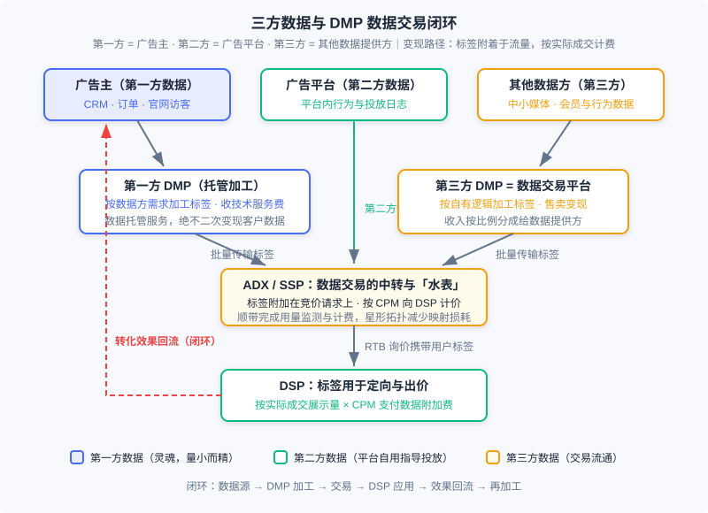
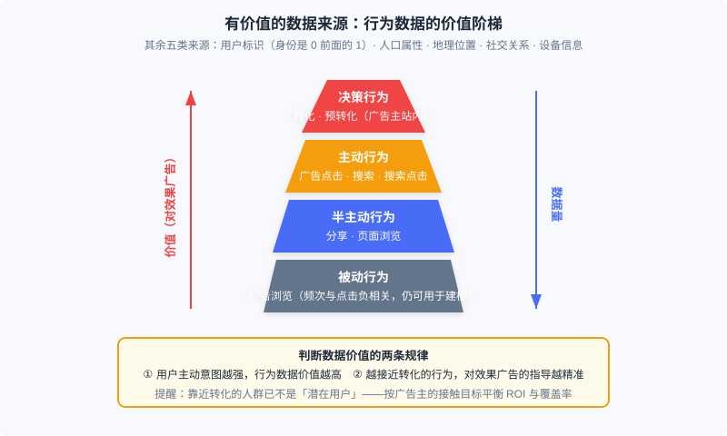

  📖
  ⏱️ ~45 min read
  🎯 Intermediate

# 数据加工与交易

> 📝 **Before You Continue:** 本章需先读 12.2（计费模式与核心指标）——数据附加费按 CPM 结算，eCPM 口径必须先建立；以及 12.3（竞价机制）——RTB 询价流程是数据交易得以「搭车」的载体。12.4（智能出价）会让你明白标签最终流向哪里：定向与出价特征。12.6（开环与闭环广告）已讲过身份信号侧的 ATT/SKAN/Privacy Sandbox，本章只处理数据合规与交易侧，两者互为表里。

定向要准、出价要狠，前提都是「你比别人更懂这个用户」。前几章里我们反复使用的 **用户标签**——兴趣、意图、人群属性——并不是凭空出现的：它们来自对行为数据的收集与加工，而在程序化交易市场中，它们本身还是一种可以定价、可以买卖的商品。这一章把镜头从「怎么投广告」拉回到「广告的燃料从哪来」：哪些数据真正有价值？谁来把原始日志加工成标签？标签如何定价与交割？以及——当你收集和买卖用户数据时，法律与安全的安全边界在哪里？

数据行业最初是为广告服务的，但今天它已经发展成一个相对独立的产业。理解这一章，不只是理解广告的一个配套环节，而是理解「个性化系统如何把行为变成资产」这门通用手艺。

读完本章，你将能够：

- 区分第一方、第二方、第三方数据，判断任意一条数据在广告交易中的归属与用途
- 按价值阶梯为各类用户行为数据排序，并说明两条价值规律背后的逻辑
- 对比第一方 DMP 与第三方 DMP 的职责、商业模式与产品案例
- 描述以 ADX 为中转的数据交易机制：CPM 计价、按实际成交交割，以及「数据价格向流量价格转移」的经济问题
- 掌握隐私保护的基本原则、准标识符与 K 匿名的思想，识别程序化交易中供需两侧的数据安全风险，完成 5 道分层练习题

---

## 12.10.0 三方数据：定向与出价的燃料

广告系统的每一个决策——检索哪些候选、预估多少点击率、出多少钱——本质上都是「用数据换判断」。12.3 的竞价机制让流量有了市场价格，而让同一个流量在不同 DSP 眼里价格不同的，正是各自掌握的数据。所以围绕数据的收集、加工与交易，与投放技术本身一样重要。

广告中用到的用户数据，按来源分为三类。**第一方数据** 来自广告主：自己的 CRM、订单记录、官网访客行为； **第二方数据** 来自广告平台：用户在媒体或平台上产生、由平台自己掌握的行为数据； **第三方数据** 则来自不直接参与广告交易的其他数据提供方——中小媒体、会员体系、各类数据公司。在广告网络模式下，主要用第二方数据指导投放；而到了实时竞价（12.3）时代，玩法变了：第一方数据可以被激活，第三方的加工与交易也随之发展起来。

三类数据的地位并不对等。第一方数据量一般不大，却是所有数据的 **灵魂**——它与你的生意直接相关，语义最明确、离转化最近。以第一方数据为基础，用好第二方和第三方数据，是实时竞价时代最重要的方法论。下面的生态图是本章的路线图：数据从三类来源出发，经 DMP 加工成标签，通过 ADX 交易附着到每一次竞价请求上，最终在 DSP 变成定向与出价的弹药，而投放效果又回流为新的数据——闭环至此合上。

### 🧠 Mental Model: 石油炼化厂

> 把数据生态想象成石油工业。原始行为日志是原油——埋在地下、不能直接驱动任何东西；DMP 是炼化厂——把原油分馏成汽油、柴油（标准化的用户标签）；ADX 是加油站与油表——把成品油按升卖出去（标签按 CPM 附着在流量上）；DSP 是发动机——烧油产生动力（定向与出价）；最后排出的尾气（转化数据）又被回收提炼——闭环的原料永不枯竭。记住一个反差：自家油田（第一方数据）产量不高，但品质与归属都最好；批发市场（第三方数据）量大管饱，但成色参差。

---

## 12.10.1 有价值的数据来源

数据是精准广告市场的核心，但不是所有数据都值得收集与加工。哪些数据对广告业务有直接贡献？我们逐类来看，并给出价值的判断框架。

**用户标识。** 如何确定哪些行为来自同一个用户，是最容易被低估的问题。稳定的用户身份就像一串 0 前面的那个 1：无论能拿到多少行为数据，如果无法把它们关联到投放系统里的那个人，这些数据就无法发挥作用。浏览器时代的基础方案是 cookie——虽然多浏览器、过期、用户主动清除都会破坏长期一致性，但广告起关键作用的本来就是近期行为，所以 cookie 仍是业界广泛采用的方案；若运营广告的域名同时提供电子邮件、SNS 等永久身份服务，可以用永久身份找回过期的 cookie。移动端则分化：iOS 用广告专用标识符 IDFA，性质与 cookie 类似；Android 没有专门广告 ID，一般用 Android ID 或 IMEI 等设备标识。高质量的用户标识本身就是有价值的资产，可以在市场上交换和售卖——这条线索我们在 12.10.2 的现代注解里会继续展开。

**用户行为。** 业界公认可广泛采集、对定向有明确作用的在线行为包括：转化、预转化、搜索广告点击、展示广告点击、搜索点击、搜索、分享、页面浏览、广告浏览等。按对效果广告的有效性，它们分成四级：

- **决策行为** ：转化与预转化——都发生在广告主的网站内。电商场景里，转化对应最后的下单，预转化对应下单前的搜索、浏览、比价、加购物车等准备工作。这类行为兴趣指向最明确，价值最高，但也最难被供给方或广告平台拿到；用它们做重定向或个性化重定向是最直接的利用方式。量不大，但不能忽视。
- **主动行为** ：广告点击、搜索、搜索点击——用户在明确意图支配下主动产生，信息量丰富。广告点击量太小，不足以作为定向的主要来源；而 **搜索是能大量获得的最主要主动行为** ，要特别挖掘利用。
- **半主动行为** ：分享、页面浏览——产生于目的较弱的内容消费过程，能把握兴趣领域，但内容精准度有限。指导意义有限，数据量却是各类行为中最大的。
- **被动行为** ：广告浏览——严格说不能算定向的行为依据，但它的频次与对应类别的广告点击负相关，所以在行为定向建模中仍然可用。

价值判断有两条基本规律：其一， **随着用户主动意图的提升，行为数据价值随之增大** ；其二， **越接近转化的行为，对效果广告的精准指导作用越强**。但这里有一个容易被忽视的提醒：广告的根本目的是「低成本地接触 **潜在** 用户」。靠近转化的行为之所以更精准，是因为这部分人群已经站在决策的最终阶段——换句话说，越发不是「潜在用户」了。只盯着转化 ROI 做定向，覆盖率会塌缩到漏斗最底部。正确的做法是根据广告主的人群接触目标，平衡效果与覆盖率。

**人口属性。** 常用的定向标签，但来源受限：一般只有能与实名身份绑定的服务才能直接得到。用行为数据预测人口属性是常见做法，但准确率有限，且仍需标定数据来训练。某些特殊信息反而容易给出准确判定——例如语音服务记录的声音信号可以相当准确地区分男女。

**地理位置。** 用途随精度剧变。IP 映射只能到城市级别，这对很多投放已有价值；移动环境下 GPS 或蜂窝定位可达几百米精度，就能捕捉用户的线下到店兴趣，让餐饮等区域广告主做精确位置定向成为可能。

**社交关系。** 社交关系隐含着「兴趣相似」的合理推测，可以用来做 **用户兴趣的平滑** ：当某个用户的行为数据不足、无法精准定向时，可以借鉴其社交网络朋友的行为与兴趣——一个微博好友大多爱足球的人，大概率也爱足球。这样的平滑只适用于长期稳定的兴趣，对短时购买兴趣不适用；因此强关系 SNS 比弱关系 SNS 更有优势。

**设备信息。** 移动设备能拿到的数据远比 PC 丰富：应用安装列表、机型、陀螺仪乃至电池电量等状态信息，对识别使用场景非常有帮助。移动广告对设备信息的深入加工有特别重要的意义。

> **Analysis:** 六类数据没有一个统一「排行榜」，因为价值取决于用途：效果类投放里决策行为价值碾压一切；品牌曝光类则恰恰要避开转化边缘人群，半主动行为的大数据量反而是覆盖率的朋友。真正普适的判断框架就是那两条规律（主动意图、离转化距离）加上一个反向提醒（离转化太近就不再是潜在用户）。收集与加工之前，先用这个框架过一遍：这条数据服务于谁的什么目标？

---

## 12.10.2 数据管理平台 DMP

有了原始数据，谁来把它炼成可用的人群标签？这类把数据整理加工成可直接利用的信息、并支持变现的产品，统称为 **数据管理平台（Data Management Platform, DMP）**。市场上 DMP 有立足第一方与第三方两种场景：技术环节基本一致，产品方向和商业模式却差别很大。

先明确 12.10.0 遗留的一个技术细节： **cookie 映射**。当广告业务域名与拥有永久身份的域名不同时，在后者同意的前提下，可以通过映射技术把两边的用户身份对应起来——这是数据对接与交易的基础设施，后面数据交易的星形拓扑正是围绕它优化的。

**第一方 DMP：数据托管与加工服务。** 对没有技术积累的广告主或媒体来说，专门设团队做数据加工并不划算，于是产生了专门管理这项业务的产品。它有两个核心功能：一是为网站（媒体或广告主网站）提供受众定向功能，既加工通用标签，也能灵活按网站自定义的标签体系加工人群；二是让广告主与广告采买渠道方便地对接数据。后者的价值可以这样理解：广告主要做外部重定向，需要把自己的用户集合通知广告平台——若每个平台都到网站上装跟踪代码，一是页面被压得越来越重，二是访客积累动辄数周、重定向效率低下。由 DMP 统一负责用户积累与划分、再通过数据接口传给广告平台，两个问题同时解决。

第一方 DMP 按数据方（Data Provider, DP）的需求收集、加工数据，向 DP 收取服务费。它是一种 **数据托管和加工服务，不以数据变现为目的** ：绝对不应该把客户数据当作自己的财产二次变现，也不能把不同 DP 的数据混合使用——这是这类产品商业模式的底线。客户多为大中型媒体和广告主；有实力的广告主也可以自建 DMP。

**第三方 DMP：数据交易平台。** 它的主要产品功能是聚合各种来源的在线用户行为数据，加工成有价值的用户标签，再通过售卖标签变现，收入按比例分成给数据提供方。它往往也兼具第一方 DMP 的加工能力，但关键差别在于：数据交易平台 **按自己的逻辑、而非媒体的需求** 来制定标签体系和加工数据——所以它站在第三方数据的角度提供产品，也称第三方 DMP。它的 DP 以中小型媒体和数据所有者为主，这些玩家数据不少，但单独变现并不划算。

> **Analysis:** 两种 DMP 的商业模式对照。第一方 DMP：卖「服务」——客户付托管与加工费，数据归属权在客户，产品讲求灵活对接与定制标签；第三方 DMP：卖「数据」——按自有标签体系加工后向 DSP 售卖，与 DP 分成，产品讲求标签覆盖与类目运营。前者是 to B 服务逻辑，利润稳定但天花板低；后者是商品流通逻辑，想象空间大但要承担数据质量与合规的全部责任。这个分野决定了后面所有产品案例的走向。

**产品案例。** 国际市场上曾有三个代表。**BlueKai** 是最典型的第三方 DMP：2008 年建立 Data Exchange 数据库，一边让中小网站提供流量与会员资料，一边加工后卖给广告主；它坚持不提供媒体竞价采购服务，以保持中立、与多家 DSP 对接——这套「独立 DMP」路线一度非常成功，活跃用户超 3 亿，前 20 大广告网络与门户中 80% 使用其数据；2014 年被 Oracle 以 4 亿美元收购。它的标签体系是开放式的：Intent（近期搜索词表现出需求，16 亿以上用户）、B2B（来自 Bizo）、Past Purchase（Addthis、Alliant）、Geo/Demo（融合 Bizo、Datalogix、Expedia 等多家数据源）、Interest/Lifestyle 等，按来源与市场需求不断拓展——像「对宝洁洗发水感兴趣的人」「想去日本旅游的人」这样的精细类目对效果广告主非常有意义，售价也高。**AudienceScience** 则代表另一条路：最早提出受众定向概念，主要提供第一方 DMP 服务（如帮《纽约时报》加工财经类、体育类用户标签），同时自营一个效果广告网络变现——它不直接卖标签，而是把标签创造的营收与提供数据的媒体分成，因为「数据加工扣除分成后利润空间太小，自营广告网络有更大套利空间」。2017 年 5 月它关闭了，这也反映出单纯数据服务的规模化和盈利能力都比较有限。**TalkingData** 是中国市场的代表：以应用统计分析工具切入，积累了海量独立设备数据后推出营销云 MarketingCloud，功能包括用户 ID 的映射与管理（打通 CRM、线下门店、线上浏览、公众号等不同 ID 体系的同一用户）、开放的第三方标签库（800 多个细分维度）、地理围栏目标受众、营销过程监测与管理——商业模式上更接近第一方 DMP，是「数据驱动的营销自动化」这一方向的先行者。

> 💡 **现代注解（2026）**：上面的案例像一部「前智能手机时代」的纪录片。三方 cookie 在 Safari（ITP）与 Firefox 已被封锁，Chrome 也转向用户选择模式——**cookie 映射作为行业基建事实上已经终结**，12.6 讲的身份信号退化正是它的终局。取代品是一套新的一一方数据基建：**CDP（Customer Data Platform，客户数据平台）** 把品牌自有触点（官网、App、小程序、CRM）的数据统一为持久客户档案，替代了旧第一方 DMP 的大多数场景；跨域身份则靠 **Unified ID 2.0（UID2）**——The Trade Desk 主导、以哈希后的邮箱/手机号为根的开放身份框架——以及 Amazon 等巨头基于自家账号体系的 **first-party ID**。曾经的独立 DMP 们（BlueKai、Liveramp 等）或被并购消化、或转型为身份与数据协作服务商。旧书里的商业模式教训没有过时：**数据能力正在向掌握登录态的一方集中，中立第三方数据的生存空间被合规与技术双重挤压。**

---

## 12.10.3 数据交易的基本过程

标签加工好了，怎么卖？ **数据交易一般通过 ADX 或 SSP 作为中转来完成** ：DMP 的各种用户标签以批量传输的方式提供给 ADX，作为 ADX 的辅助产品售卖给各 DSP。标签一般按 CPM 计价：DSP 若选择购买某种标签，广告询价时 ADX 就把本次请求的用户标签随请求传给 DSP，最终以 **DSP 实际成交的展示量 × CPM 价格** 作为购买数据的附加费用。

以广告交易为载体进行数据交易，比 DMP 与 DSP 之间直接交易合理得多，好处有四：

1. **传输成本**。数据量级可能很大，直连交易的传输成本不可忽略；而在广告请求上附加用户标签几乎不带来额外服务开销——整体传输成本只剩 DMP 到 ADX 的一次。
2. **星形拓扑**。所有 DSP、数据提供方都只需与 ADX 做 cookie 映射，而 ADX 触达的用户规模远高于单个 DSP 或 DMP——这最大限度地避免了映射造成的数据损失。
3. **部分交易**。DSP 很少用得上某个 DMP 的全部数据；在交易过程中传数据，DSP 可以自由限定所需范围——只投上海的 DSP 选了上海地区后，就只会收到上海的数据。
4. **天然计费**。ADX 恰好站在买卖双方之间，顺带完成了数据使用量监测与计费——它本来就是数钱的那一方。

### 🧠 Mental Model: 自来水与水表

> 数据交易像供水。DMP 与 DSP 直连交易，相当于每家用户自己挖井铺管——铺 N 条管线、每条都要结算，成本爆炸；通过 ADX 交易，则是自来水公司统一铺管网（批量传输 + 星形映射），水表装在 ADX 上（每次成交展示量 × CPM），按用量付费。更妙的是「部分交易」：你可以只订上海的水（限定标签范围），不必把整座水库买下来。但自来水与矿泉水有个本质区别：**同一份数据可以重复卖给很多家，而且大家喝的是同一片地下水**——这正是下面要说的麻烦所在。

数据作为信息商品的独特性在于两点：它可以 **重复售卖** （这点像软件）；但与软件不同，同一份数据的所有使用者面对的是 **同一批用户群** ，因此彼此之间存在博弈关系。由此产生两个深层问题。

其一， **数据的重复售卖会引起数据价格向流量价格的转移**。看一个例子：某 DMP 知道某用户是高尔夫爱好者，把这一信息卖给了一家 DSP——该 DSP 利用它获得高回报，自然承受得起较高的数据采购价。但如果 DMP 把它卖给了多家 DSP，这些 DSP 定向同一个用户时必然因竞价关系抬升流量成本，靠这条数据获得的回报就摊薄了，间接也压低了数据的变现价格。卖得越多，单份价值越被竞价稀释——利润从「数据红利」转移成了「流量价格」。其二，重复售卖下 **无法按竞价方式售卖数据**。在线广告市场正是靠竞价模式才带来客户数量和变现能力的大幅提升（12.3），我们自然期望数据也能竞价。方向是 **限量售卖** ：每条信息在一定时间内只提供给有限几家购买者，才可能发展出竞价模式并保证数据提供方的利益。但具体限几家、竞价机制如何设计，仍是开放问题。

> **Analysis:** 这个机制的设计精髓是「搭车」：把一种新商品（标签）的交易嵌进一个已成熟的市场（RTB），复用其传输通道、身份映射、计费与监测设施，边际成本近乎为零。对照 12.3 的询价流程，数据交易没有新增任何一次往返。局限也来自同一处：数据价值在成交前不可验证（A/B 才知道这标签值不值），定价只能一刀切按 CPM；加上重复售卖的稀释效应，市场最终走向了下一节要讲的合规化形态。

> 💡 **现代注解（2026）**：明文人群包交易在成熟市场已大幅萎缩，主流合规形态是**数据清洁室（Data Clean Room）**：广告主把第一方数据、平台把行为数据各自导入受控环境，在**互不可见明细**的前提下做匹配、重叠分析与效果度量——只输出聚合报表（常叠加差分隐私噪声），不出原始人群包。Google Ads Data Hub、Amazon Marketing Cloud、Meta 的先进分析工具以及 LiveRamp 等中立方案都属于这一形态。12.10.4 的差分隐私与 GDPR/PIPL 合规要求，正是 clean room 的技术底座；它与 UID2 一起，构成了 2020 年代数据协作的新范式——**数据可用不可见**。

---

## 12.10.4 隐私保护与数据安全

广告是典型的个性化系统：定向要靠用户行为数据，交易市场又在买卖这些数据。于是有两类安全问题必须一起考虑——**用户的隐私** （个人信息是否泄露），以及 **数据拥有方的商业数据安全** （广告主的关键数据是否被平台或对手利用）。

**隐私问题的真正难点，比「批量泄露」更隐蔽。** 除了成批的用户资料泄露，更大的挑战是 **针对熟人的隐私窥探** ：窥探者已掌握目标的一些背景信息，用这些信息进一步挖掘更多隐私。这类风险可能是人工与机器结合、对成本不敏感，因此危害最大——曾有人在社交媒体上通过分析发帖与照片准确定位到他人住址，就是典型案例。

在这个背景下，工业界形成了一些共识性的隐私保护原则：

1. **严格避免使用个人可辨识信息（PII）**——身份证号、电话号码、邮箱、家庭住址等能方便地定位到具体人的信息，必须无条件严格保护。当时的通行认知是：cookie、IMEI 这类用户标识不具有方便辨识人的作用，不属于 PII（这一认知在今天的法律环境下需要修正，见现代注解）。
2. **用户有权要求停止跟踪**。行为定向广告应给出明确提示（如创意右上角的 AdChoices 标识），用户可通过 **Opt-Out** 操作通知系统停止记录与使用自己的行为数据——把是否接受个性化广告的决定权交给用户。
3. **不应长期保留用户行为数据**。长期保留对定向价值有限，却放大泄露风险；过期且与业务无直接关系的数据不应再存储。
4. **权限严格分配与最小数据访问**。调试用采样、匿名化的数据子集；生产环境经特别密钥访问原始数据；连开发者乃至管理层都不应有数据访问权限。

**准标识符：去掉 PII 就安全了吗？** 看这条记录：「年龄 36；工作地点上海市某大厦；性别男；职位测试工程师；爱好羽毛球；月薪 15000 元」——姓名手机号都隐去了，但他的朋友靠「年龄 + 工作地点 + 职位 + 爱好」的组合仍能一眼认出是谁，从而读到「月薪」这个隐私。这类 **单独看无辨识力、组合起来却能定位个人** 的信息，叫 **准标识符（quasi-identifier）**。对策是 **泛化** ：把「36 岁」泛化为「30～40 岁」、「某大厦」泛化为「上海市」——若泛化后数据集中每组准标识符的实例都能找到 K 条与其相同的，就实现了 **K 匿名**。K 取得合理时，泄露风险显著下降。

**稀疏行为数据：K 匿名救不了个性化系统。** 个性化系统对用户的描述包含大量行为数据，而行为数据极为稀疏——任何两个用户的行为几乎不可能相同，K 匿名无从做起。风险有真实案例：著名的 Netflix 百万美元推荐大赛公布了去除 PII 并做过 K 匿名的数据集，但观影记录与打分未做处理——有研究者发现，把这些稀疏行为数据与 IMDb 等公开数据做简单匹配，就能以相当高的准确率重识别用户；此前已有用户从他人的观影记录中（包括一些同性恋题材影片）被认出。这类研究让工业界的隐私认知大大提升，也催生了 **差分隐私** 的研究：对数据集做一定程度的修改，在尽可能少损失查询准确率的情况下使泄露风险最低（苹果在 iOS 10 中宣称集成了该技术）。坦率地说，稀疏行为数据的风险至今没有成熟解法，它是大规模行为数据利用头上的达摩克利斯之剑——数据交易与披露时要对它保持敬畏。

**程序化交易中的数据安全。** RTB 让供需两侧的数据在一次交易中汇合，这把双刃剑的两面都伤人。

**供给方数据安全** ：ADX 向参与竞价的 DSP 广播每次展示的 URL 和 cookie，理论上存在 DSP 规模化监听媒体用户行为的可能——恶意 DSP 对所有请求都以极低价格参与竞价，目的不是赢流量，而是收集媒体上的用户行为。好在实际危害可控：由于带宽限制，ADX 会做询价优化（只向最可能赢的 DSP 发询价），以收集数据为目的的 DSP 在理想情况下会被挡在大部分询价之外。

**需求方数据安全** ：更严重的一面。RTB 中引入定制化标签后，广告主的第一方数据也暴露在交易过程中。设想两个英语教育类广告主都通过 DSP 做重定向：各自的访客集合本是广告主最具商业价值的私有数据，但 DSP、ADX、媒体都有可能在 RTB 过程中得到它们。若 DSP 想制造更激烈的竞价环境，可以把两个广告主的访客集合合并、打上「英语教育人群」这样模糊的标签，吸引双方来竞价——**实质是在竞争对手之间倒卖访客集合** ，操作还非常隐蔽。竞价越激烈，原本属于广告主的利润就向市场其他环节转移。这个问题决定着广告主是否敢放心用 RTB 采购，而当前市场的重视程度和解决方案都不充分——广告主面对强势广告平台使用第一方数据时，要特别留意数据安全（现代的对策正是 12.10.3 注解中的 clean room：访客匹配在互不可见的环境里完成）。

**GDPR：隐私保护的立法标杆。** 欧盟议会 2016 年 4 月通过《通用数据保护条例》（GDPR），2018 年 5 月生效，任何收集、传输、保留或处理欧盟成员国个人信息的机构均受约束。要点有三：其一，明确列出敏感数据——种族或民族出身、政治观点、宗教/哲学信仰、工会成员身份、健康/性生活/性取向、基因数据、生物识别数据（后两类是新时代的合理拓展）；其二，处理必须以 **明确同意** 为基础，同意条文中必须说清收集哪些信息、如何存储使用，模糊条文不再被允许；其三，赋予用户四项权利——**数据访问权** （了解企业如何使用自己的数据）、**被遗忘权** （要求删除已收集的数据）、**限制处理权** （禁止用于营销或透露给第三方）、**数据携带权** （离开平台时可带走个人数据）。

> 💡 **现代注解（2026）**：GDPR 罚则的准确上限是「2000 万欧元与全球年营业额 4% 中的较高者」——这才是「史上最严」的实际牙齿，远比「数千万欧元」的模糊表述更有威慑力。本书当年对 GDPR 的批评（执行标准语焉不详、企业自己都说不清深度学习时代数据如何被使用、改造成本有利寡头）至今仍有讨论价值，但历史已经给出了裁决：GDPR 之后全球立法跟进，中国的《个人信息保护法》（**PIPL**）于 2021 年 11 月施行，确立了知情同意、最小必要、可撤回同意等原则，并同样区分敏感个人信息；cookie 类标识符在多法域已被纳入个人信息范畴——8.4 时代「cookie 不算 PII」的认知已成历史。至于 ATT/SKAN/Privacy Sandbox 这些**信号侧**的隐私基建如何在投放中适配，12.6 已专门展开，本章不重复；一句话互链：**12.6 讲「信号变弱后怎么投」，本章讲「数据在交易与合规上怎么管」。**

---

## 12.10.5 收束：数据变现闭环

把本章的零件装回一张图（回顾 12.10.0 的生态图）：

**数据源 → DMP 加工 → 交易 → DSP 应用 → 效果回流。**

- **数据源** ：第一方（广告主，灵魂）、第二方（广告平台）、第三方（其他数据方），价值由「主动意图 × 距转化距离」排序；
- **DMP 加工** ：第一方 DMP 做托管与定制加工收服务费；第三方 DMP 按自有逻辑加工标签售卖变现、与数据源分成——现代形态演进为 CDP + UID2/first-party ID 的身份基建；
- **交易** ：标签批量接入 ADX，附着在竞价请求上按 CPM 计价，按 DSP 实际成交展示量交割——现代形态演进为 clean room 的「可用不可见」协作；
- **DSP 应用** ：标签进入定向与出价（12.3 的竞价、12.4 的智能出价），按需限定购买范围；
- **效果回流** ：转化数据回流到数据源侧，成为下一轮加工的原料——12.6 的闭环度量正是这条回流的现代化身。

几个工程与商业判断值得带走：数据的价值不在于多，而在于与业务目标的匹配——效果广告要决策行为，品牌触达要覆盖率；数据交易的市场设计远未完成——重复售卖的价格稀释与竞价机制的缺失是教科书级的开放问题；而隐私与数据安全不是合规成本，是这套燃料体系的承压壁—— Netflix 重识别、访客集合倒卖这些案例提醒我们，壁上任何一道裂缝都会让整个生态失去信任。

---

## ⚠️ Common Mistakes in 12.10

| # | Mistake | Example | Why It's Wrong | Fix |
|---|---------|---------|----------------|-----|
| 1 | 只用靠近转化的行为做定向 | 只拿下单/加购用户做扩量种子 | 这部分人群已在决策末段、不再是「潜在用户」，覆盖率塌缩，违背「低成本接触潜在用户」的根本目的 | 按广告主的接触目标平衡 ROI 与覆盖率：效果类重决策行为，品牌类向半主动行为的量要覆盖 |
| 2 | 把第一方 DMP 当数据变现方 | DMP 私自把客户人群包卖给其他买方、或混合多家客户数据加工新标签 | 第一方 DMP 是数据托管与加工服务，客户数据二次变现直接摧毁商业模式与信任 | 数据归属写进合同；变现只出现在第三方 DMP 的模式里，且须与数据提供方分成 |
| 3 | 认为去掉 PII 就没有隐私风险 | 脱敏后的行为明细直接对外披露 | 准标识符组合可定位个人；稀疏行为数据几乎无法 K 匿名（Netflix 重识别案例） | 输出前做准标识符泛化与聚合；明细数据走 clean room，只出聚合结果并叠加差分隐私 |
| 4 | 数据附加费按询价量而非成交量计费 | DSP 被按收到的所有带标签请求计费 | 数据交易的交割口径是「实际成交的展示量 × CPM」，按询价计费等于让 DSP 为没买到的流量付钱 | 对账时以 ADX 成交日志为口径；部分交易的范围限定（地域/类目）也要核进计费 |
| 5 | 忽视需求方数据安全 | 把重定向人群包直接开放给 DSP 定制化标签，无任何隔离条款 | DSP/ADX 可能合并访客集合转卖给竞争对手，制造竞价推高流量成本，利润向市场转移 | 签署数据使用限制条款；用 clean room 做访客匹配；监控 win rate 与流量成本的异常漂移 |
| 6 | 把 cookie 时代的方案照搬到 2026 | 设计依赖三方 cookie 映射的标签分发，或宣称 cookie 不属于个人信息 | 三方 cookie 在 Safari/Firefox 已死、Chrome 转向用户选择；多法域已把标识符纳入个人信息范畴 | 一方数据走 CDP + UID2/first-party ID；跨方协作走 clean room；合规按 GDPR/PIPL 口径 |

---

## 本章小结

### 📌 Key Takeaways

| Concept | Key Points | Why It Matters |
|---------|-----------|----------------|
| 三方数据 | 第一方=广告主（灵魂）、第二方=广告平台、第三方=其他数据方；RTB 时代方法论：以一方为基础用好二三方 | 所有定向与出价差异的源头，数据资产归属判断的基础 |
| 数据价值排序 | 决策 > 主动 > 半主动 > 被动；两条规律：主动意图越强价值越高、越接近转化指导越准；反向提醒：靠近转化即失去「潜在」属性 | 收集与加工数据前的投资判断框架 |
| DMP 两种模式 | 第一方 DMP：托管加工收服务费、绝不二次变现；第三方 DMP（数据交易平台）：按自有逻辑加工售卖、与 DP 分成；现代演进：CDP + UID2/first-party ID | 理解数据产品商业模式与 2026 一方数据基建的谱系 |
| 数据交易机制 | 经 ADX 中转：批量传标签、附加在询价请求、按实际成交展示量 × CPM 计附加费；四大好处：传输成本、星形映射、部分交易、天然计费；开放问题：重复售卖致价格向流量转移、竞价模式待探索 | 程序化市场中标签流通的标准形态与经济学局限 |
| 隐私保护 | 四原则（避 PII/Opt-Out/不长期保留/最小访问）；准标识符与 K 匿名；稀疏行为数据无成熟解（Netflix 案例）；差分隐私 | 个性化系统数据使用的安全底线，clean room 的技术根源 |
| 交易数据安全 | 供给方：恶意低价 DSP 监听，靠询价优化缓解；需求方：访客集合被合并倒卖、利润向市场转移，比供给方更关键 | 决定广告主是否敢把第一方数据接入程序化交易 |
| GDPR / PIPL | GDPR：敏感数据清单、明确同意、四项权利（访问/被遗忘/限制处理/携带），罚则 max(€20M, 全球营收 4%)；PIPL 2021 年施行 | 全球数据合规的两大地基，多法域业务绕不开 |

### ❓ FAQ

**Q1: 第三方 DMP 的时代是不是彻底结束了？**
> 明文人群包交易确实萎缩了，但「聚合多方数据、加工成可商用标签」的需求没有消失，而是换了形态：从独立 DMP 转向平台内建的数据市场（以平台自有身份体系为根）、clean room 数据协作，以及 UID2 这类开放身份上的受众解决方案。旧模式死于身份基建崩塌与合规挤压；学到的东西——标签体系设计、数据质量运营、分成机制——在新形态里全部用得上。

**Q2: 「数据价格向流量价格转移」对数据买方意味着什么？**
> 意味着「买数据」的红利会随竞争自动摊薄：当多家 DSP 持有同一标签去竞同一批流量，数据优势转化成了更高的成交价，利润从数据方转移到流量方。买方的应对是把数据用在「别人没有的交叉组合」上（独占性越强越好），并且持续用增量实验验证这条数据的边际贡献，而不是按「有没有」付钱。

**Q3: 广告主应该自建 DMP/CDP 还是用外部服务？**
> 看数据规模与团队。数据量大、有工程团队、数据是核心竞争力的（大型零售、金融），自建可控性最好；否则用外部第一方 DMP/CDP 服务，但要守住两条底线：合同明确数据归属与用途限制、绝不允许服务方把你的数据与其他客户混合或二次变现。无论哪种，访客类高价值人群对外协作一律走 clean room。

### 🔗 前后关联

- **12.1** （全景与生态）：本章的数据闭环嵌在广告生态全景中，是「定向与出价从哪来」的供给侧答案
- **12.2** （计费模式与核心指标）：数据附加费的 CPM 口径与 eCPM 定义完全建立在 12.2 之上
- **12.3 / 12.4** （竞价机制 / 智能出价）：标签经 ADX 交易后，最终作为定向条件与出价特征进入这两章的决策引擎
- **12.6** （开环与闭环广告）：信号侧的 ATT/SKAN/Privacy Sandbox 在彼处展开，本章负责数据合规与交易侧；效果回流闭环在 12.6 的闭环度量中现代化
- **12.7** （在线分配）：流量预测按标签组合聚合流量——标签体系的质量直接决定预测与分配的精度

---

## Practice Problems

Work through all problems in order — they get progressively harder. Each has a complete solution you can reveal after trying it yourself.

---

**Problem 12.10.1 — 行为数据价值分层** 🟢 Easy

把下列在线行为按「决策 / 主动 / 半主动 / 被动」四类归类，并指出哪一类是「能大量获得的最主要主动行为」：

`电商下单`、`加入购物车`、`广告点击`、`分享`、`页面浏览`、`搜索`、`搜索点击`、`广告浏览`、`下单前的比价`

**Sample Input:** 上述 9 种行为
**Sample Output:** 决策：{电商下单， 加入购物车， 下单前的比价}；主动：{广告点击， 搜索， 搜索点击}；半主动：{分享， 页面浏览}；被动：{广告浏览}；量最大的主动行为：搜索

💡 Solution (click to reveal)

**Approach:** 决策行为 = 转化 + 预转化，全部发生在广告主站内；主动行为 = 明确意图支配下的点击与搜索；半主动行为 = 弱目的内容消费；被动行为 = 广告曝光本身。

- 电商下单是转化；加入购物车与下单前的比价是典型的预转化——三者都是决策行为。
- 广告点击、搜索、搜索点击都是主动行为；其中广告点击量太小，只有搜索是「能大量获得的最主要主动行为」。
- 分享与页面浏览是半主动行为；广告浏览是被动行为，其频次与同类广告点击负相关，仍可用于建模。

**Key points:**
- 预转化（比价、加购）属于决策行为——它发生在广告主站内且兴趣指向明确
- 判断标准是「主动意图强度 × 离转化距离」，不是数据量大小

---

**Problem 12.10.2 — 计算数据交易附加费** 🟢 Easy

某 DSP 从 ADX 购买「母婴人群」标签，CPM 价格为 ¥2.50。本月它赢得的所有附带该标签的展示为 120,000 次（全部命中标签口径）。

(a) 本月数据附加费是多少？
(b) 若这些展示带来 480 次转化，摊到每转化的数据成本是多少？
(c) 下月该 DSP 只投放上海地区，按「部分交易」规则只收到命中标签的成交展示 90,000 次，附加费变为多少？这体现了数据交易四大好处中的哪一个？

**Sample Input:** 标签 CPM ¥2.50；成交展示 {120000, 90000}；转化 480
**Sample Output:** (a) ¥300　(b) ¥0.625/转化　(c) ¥225；部分交易

💡 Solution (click to reveal)

**Approach:** 交割口径 = 实际成交展示量 × CPM 价格。

- (a) $120000 / 1000 = 120$ mille，$120 \times 2.50 = 300$，附加费 ¥300。
- (b) $300 / 480 = 0.625$，每转化数据成本 ¥0.625。这个数可以直接进 ROI 核算：只有当标签带来的转化增量价值超过 ¥0.625/转化时，购买才划算。
- (c) $90000 / 1000 = 90$，$90 \times 2.50 = 225$，附加费 ¥225。DSP 只买了上海一个地域范围的数据，只按该范围的成交计费——这正是「部分交易」的好处：DSP 自由限定所需数据范围，不为用不上的数据付费。

**Key points:**
- 计费基数是「实际成交展示量」，不是询价请求量（对照 Common Mistakes #4）
- 部分交易 + 按成交计费，共同构成数据交易对买方的保护

---

**Problem 12.10.3 — 三方数据归属与 DMP 选型** 🟡 Medium

判断下列三个场景中数据的归属方（第一/第二/第三方），并为每个场景选一种最合适的数据产品路线（A：第一方 DMP/CDP 自建或托管；B：接入第三方 DMP/数据交易平台；C：两者结合），说明理由。

1. 《纽约时报》：拥有海量自有用户与在线数据，但核心业务不是广告也不是数据加工。
2. 某卖服装的小网店：有自己的用户搜索与购买行为，数据量不大，不值得单独分析变现。
3. 某大型电商平台：既握有海量平台内行为，又要做外部重定向与站外拉新。

**Sample Input:** 三个场景描述
**Sample Output:** 1 → 第二方数据 + 路线 A（AudienceScience 模式）；2 → 第三方数据 + 路线 B（BlueKai 模式）；3 → 第一/第二方数据 + 路线 C（TalkingData MarketingCloud 模式）

💡 Solution (click to reveal)

**Approach:** 先按「数据在谁手里、谁直接参与交易」定归属，再按「数据规模 × 是否值得自营加工」选路线。

1. 数据产生在媒体自己的站点上、由媒体直接掌握，对广告平台而言是第二方数据。NYT 不愿自营数据加工 → 托管给第一方 DMP（如 AudienceScience 帮它加工财经类、体育类用户标签），标签回流供自家 BI 与内容运营使用 → 路线 A。
2. 小网店的行为数据是它自己的一手数据，但在市场上它以「不直接参与广告交易的数据提供方」身份出现，属于第三方数据。数据量小、不值得自营 → 把数据交给数据交易平台聚合加工、售卖后分成（BlueKai 专门聚合这类中小网站数据）→ 路线 B。
3. 平台内行为是第二方数据，CRM/订单是第一方数据。规模大到值得自建，同时又需要外部数据补足站外场景 → 两者结合：自建第一方数据基建（现代形态即 CDP），需要时接入外部标签与身份方案 → 路线 C。

**Key points:**
- 第一/二/三方是「相对广告交易中的位置」而定的，同一条数据对不同主体归属不同
- 选型的核心变量是数据规模：量小→托管或出售，量大→自营

---

**Problem 12.10.4 — 准标识符泛化与 K 匿名** 🔴 Hard

某员工数据集含 5 条记录（准标识符 = 年龄、城市；敏感属性 = 月薪）：

| # | 年龄 | 城市 | 月薪 |
|---|------|------|------|
| 1 | 36 | 上海 | 15,000 |
| 2 | 38 | 上海 | 17,000 |
| 3 | 52 | 北京 | 25,000 |
| 4 | 54 | 北京 | 22,000 |
| 5 | 33 | 北京 | 14,000 |

目标是发布数据集且满足 K 匿名（K = 2）。(a) 只把年龄泛化为 10 岁区间（[30,40)、[50,60)），K 匿名满足吗？给出等价类。(b) 给出一个满足 K = 2 的最小额外泛化方案，并验证。(c) 若不想进一步泛化，还有什么替代操作？

**Sample Input:** 上表；K = 2
**Sample Output:** (a) 不满足，等价类 {[30,40)·上海]={1,2}，[50,60)·北京]={3,4}，[30,40)·北京]={5}}，后者大小 1 < 2；(b) 城市泛化为「一线城市」后等价类大小 {3, 2}，K = 2 ✓；(c) 抑制（删除）记录 5

💡 Solution (click to reveal)

**Approach:** K 匿名要求泛化后每个准标识符等价类至少含 K 条记录；逐层尝试泛化，找到满足约束的最小改动。

- (a) 年龄分箱后：记录 1、2 → ([30,40), 上海)；记录 3、4 → ([50,60), 北京)；记录 5 → ([30,40), 北京)。前两类大小 2，但 ([30,40), 北京) 只有 1 条——K 匿名不满足，记录 5 的月薪（14,000）对任何认识他的人仍可指认。
- (b) 把城市泛化为「一线城市」：等价类变为 ([30,40), 一线) = {1, 2, 5}（大小 3）与 ([50,60), 一线) = {3, 4}（大小 2）。两类都 ≥ 2，数据集满足 K = 2。✔
- (c) 替代方案是 **抑制** ：直接删除记录 5，剩下两个等价类各为 2 条，满足 K = 2——代价是损失一条记录的信息。泛化保留数据但降低精度，抑制保精度但丢数据，工程上按业务对哪段数据的敏感度取舍。

**Key points:**
- 准标识符的风险来自 **组合** ：单独看无辨识力的属性，交叉后可唯一指认
- K 匿名的等价类大小要在「最终泛化粒度」上验证，中途满足不算数
- 现实提醒（对照正文）：行为数据极稀疏，任何两个用户几乎不重——K 匿名在个性化系统的行为明细上根本做不起来，这正是 clean room + 差分隐私接棒的原因

---

**Problem 12.10.5 — 识别与防御访客集合倒卖** 🏆 Challenge

你是某教育品牌的效果投放负责人，通过 DSP 做重定向。近一个月你观察到：重定向流量的平均 CPC 上涨约 40%，win rate 下降，且你从未出价购买、也从未授权外流的「英语教育人群」标签出现在你竞得的流量上。请设计一套诊断 + 防御方案：列出至少 3 个需要排查的假设（区分市场因素与数据安全因素）、每个假设的验证方法，以及数据安全假设成立时的防御措施（至少 3 条）。

**Sample Input:** CPC 漂移 +40%、win rate 下降、陌生竞品标签出现
**Sample Output:** 假设 × 验证方法 × 防御措施的对照表

💡 Solution (click to reveal)

**Approach:** 先排除正常市场因素，再验证数据安全因素——不要一看到涨价就指控对手。

| 假设 | 验证方法 | 结论路径 |
|------|---------|---------|
| 行业大盘竞价升温（市场因素） | 拉同期行业 CPM/CPC 指数与你未打标签的普通流量成本对比：若大盘同步上涨，属市场因素 | 大盘同步涨 → 调预算与出价策略，与数据安全无关 |
| 竞品新增投放预算（市场因素） | 监测竞品创意在广告库工具中的投放密度与覆盖时段变化 | 竞品加大投放 → 属正常竞争，优化自身出价与频控 |
| 访客集合被 DSP/ADX 合并倒卖（数据安全） | 检查合同授权范围外是否出现与自家重定向人群高度重叠的人群标签（如「英语教育人群」）；对自家人群包与非自家流量做重合度抽样比对；观察涨价是否集中在这些标签命中的流量上 | 重合度高且涨价集中于该标签 → 高度怀疑倒卖 |

数据安全假设成立时的防御措施：

1. **合同层** ：与 DSP/ADX 签署数据使用限制条款，明确第一方人群包仅可用于本广告主投放、禁止二次加工与转售，并约定审计权。
2. **技术层** ：访客匹配改走 clean room——人群包以加密/哈希形式进入受控环境，只输出匹配结果，平台侧不可见明细，从根上切断「合并访客集合打新标签」的操作路径。
3. **监控层** ：建立第一方数据外泄的哨兵指标——win rate 与 CPC 的分标签漂移、自家重定向人群与市售标签的重合度周期抽样、陌生标签命中流量的溢价监控，异常即触发审查。
4. **战略层** ：重定向等高价值场景优先投给可审计、支持 clean room 的渠道；对强势平台的定制化标签功能，默认最小化开放。

**Key points:**
- 正文结论：需求方数据安全比供给方更关键——它决定广告主敢不敢把第一方数据接入程序化交易
- 诊断必须先二分「市场因素」与「数据安全因素」，证据是「涨价是否集中在重叠标签命中的流量上」
- 防御的主线与 12.10.3 的现代注解呼应：clean room 让数据「可用不可见」，是倒卖问题的结构性解法

