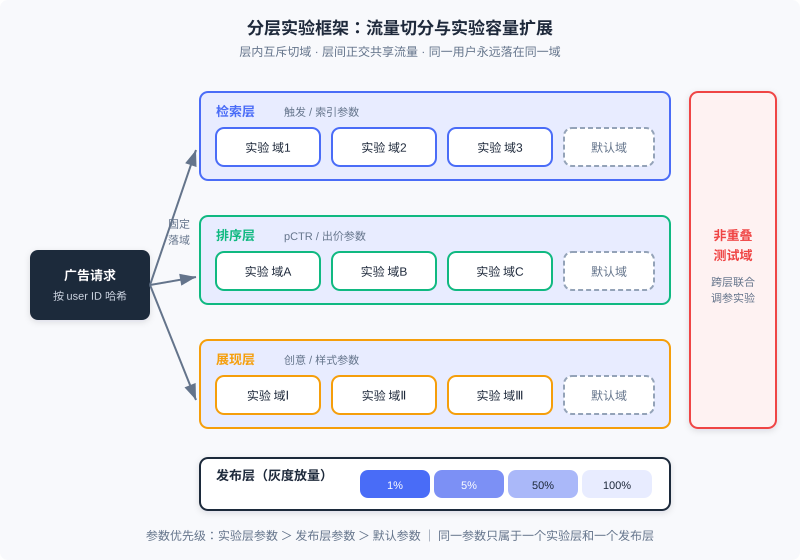
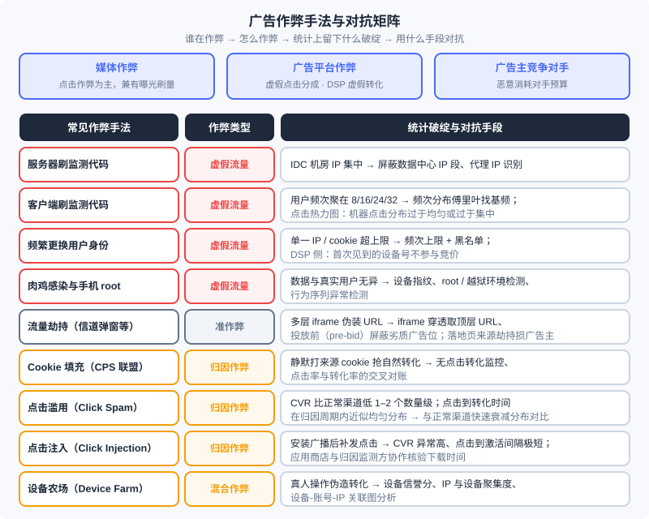

<div style="display: flex; gap: 12px; margin-bottom: 24px; flex-wrap: wrap; align-items: center;">
  <span style="background: #f0f4ff; color: #4A6CF7; padding: 4px 12px; border-radius: 20px; font-size: 0.85em; font-weight: 600; border: 1px solid rgba(74,108,247,0.2);">📖</span>
  <span style="background: #fdf2f8; color: #be185d; padding: 4px 12px; border-radius: 20px; font-size: 0.85em; border: 1px solid rgba(190,24,93,0.2);">⏱️ ~50 min read</span>
  <span style="background: #fef2f2; color: #dc2626; padding: 4px 12px; border-radius: 20px; font-size: 0.85em; font-weight: 600; border: 1px solid rgba(100,100,100,0.15);">🎯 Advanced</span>
</div>

# 实验框架与反作弊：广告系统的两条底线

> 📝 **Before You Continue:** 本章是 Part 12 的收官章，默认你已读过 12.1（全景与生态）——本章的选型实战会整体回扣那张生态图；12.5（偏差与校准）与 12.6（开环与闭环）——这两章的结论都建立在「实验可信」之上，本章解释为什么。12.2（计费模式）帮你看懂反作弊到底在保护什么：计费口径本身。

12.1 到 12.7 我们把广告系统的「发动机」装好了：竞价机制、智能出价、在线分配、校准与归因。但一台发动机要敢踩油门，还差两样东西。第一样是**度量可信**：你改了排序模型、调了出价策略，线下评测和模拟永远反映不了线上各模块之间的真实相互作用——你必须有一套实验框架，从真实流量里切一部分出来验证，而且要能同时容纳尽量多的实验，否则产品的进化速度会被流量本身卡死。第二样是**流量真实**：广告市场里媒体、平台、广告主对手三方都有制造虚假流量或劫持归因的动机，所有建立在曝光、点击、转化上的计费（12.2）与优化（12.4、12.6）都会被作弊流量污染——反作弊就是这台印钞机的防伪验钞模块。

本章也是《计算广告》第 17 章对应内容的收官：我们沿「创意优化 → 实验框架 → 广告监测与广告安全 → 作弊与反作弊 → 产品技术选型实战」的路线走完，最后以三方选型清单收束整个 Part 12。

读完本章，你将能够：

- 说明创意优化与受众定向的本质区别，描述程序化创意与点击热力图的工作方式
- 设计分层实验框架：解释层内互斥、层间正交、按用户切分与发布层灰度，并用 AA 实验校准框架本身
- 描述第三方广告监测的原理与广告安全（品牌安全、可见性、反劫持）的关键技术
- 按主体、原理、手段三个维度对广告作弊分类，并为每类作弊手法匹配统计破绽与对抗思路
- 站在媒体、广告主、数据方三个角色的视角完成广告产品的选型决策，完成 5 道分层练习题

---

## 12.11.0 机制跑起来之后：两条底线

先给本章定位。广告系统的所有优化技术——检索、排序、出价、分配——本质上都在回答一个问题：「怎么把广告效果做得更好」。但在真实生产环境中，还有两个问题先于「做得更好」：**「我知道我做得更好了吗」（度量）** 和 **「我度量的是真的吗」（真实）**。

第一个问题催生**实验框架（experimentation framework）**。策略、算法、架构的调整，通过线下评测和模拟都很难完全反映线上的变化——12.5 讲过的位置偏差、竞争偏差，12.3 讲过的机制与出价的耦合，都意味着「把新模块单独测好」不等于「放进系统整体更好」。唯一的裁决方式是从实际流量中分出一定比例跑实验。切流量本身不难，难的是同时测试的方案往往很多：如何在一个框架里容纳更多的测试，是提高广告系统进化效率的关键工程问题。

第二个问题催生**反作弊（anti-fraud）**。广告是广告主、媒体与平台三方交互的生意，每一方（甚至不在这三方里的对手）都有动机制造虚假流量，或者用技术手段骗过广告监测与归因。由于这是一个「道高一尺、魔高一丈」的动态博弈过程，反作弊并无确定不变的技术和算法，但有一些原则和基础方法可以遵循。与之配套的还有**广告监测**——需求方委托独立第三方对展示与转化做核实性度量——以及由此发展出的**广告安全**技术。

### 🧠 Mental Model: 印钞机、质检仪与验钞机

> 把广告系统想成一台印钞机：12.3–12.7 装好的竞价与分配机制是印钞的动力系统，12.2 定义的 eCPM 与计费口径是钞票的面值规格。实验框架是质检仪——任何零件升级（新模型、新策略）都要先在一小批「试验钞」上验证没印歪，才能全量投产；分层实验的意义在于同一张纸能同时过好几道质检，而不是每道质检都浪费一整批纸。反作弊是验钞机——市场上永远有人制造假币（刷量）和调包真钞（劫持、归因作弊），验钞机没有一劳永逸的型号，但统计特征（频次分布、点击热力图、转化率）就是假币永远藏不住的水印。

还有一个贯穿本章的视角：**监测、反作弊、实验框架共享同一套底层资产——日志与统计特征**。点击热力图在 12.11.1 里是创意优化工具，在 12.11.4 里就成了甄别机器点击的反作弊工具；频次统计在 12.7.2 里是频次控制的依据，在反作弊里就是识破客户端刷量的探针。学完本章你会发现，这两条底线用的不是什么神秘技术，而是把前三节的基础统计用出了「刑侦」的味道。

---

## 12.11.1 程序化创意与点击热力图

创意对广告效果的影响巨大，但有一个前提必须先立住：**创意优化不能混同于受众定向的效果**。随着创意改变，广告表达的诉求已经变了，点击行为就不再完全可比。书中的例子很直白：一个保险类广告主，把宣传公司品牌与实力的品牌型创意，换成让用户填车险申请的表单式创意——后者点击率会大幅上升，但前者服务的是长期的品牌渗透与利润空间，后者服务的是短期转化。两者诉求根本不同，直接比 CTR 没有意义。因此一般讨论的创意优化，指的是**在基本诉求保持稳定的前提下调整创意以提高效果**。

在这个前提下，程序化创意的核心原则来自第 2 章的广告有效性模型：**把向用户推送此广告的关键原因，在创意中明确表达出来**。推送原因众多，不可能预先制作全部素材，只能由程序在投放时自动组装——类比程序化交易，这被称为**程序化创意（programmatic creative）**。几个经典形态：

- **地域型创意**：同一汽车广告，对北京和上海的受众分别动态加上当地经销商的联系电话。对每个城市做一版独立素材不经济，地域信息应在投放时在线拼装。
- **搜索重定向创意**：把用户曾经的搜索词放进创意下方的搜索框中，明确标示「我就是为你搜的那个东西来的」，更容易唤起注意力。
- **个性化重定向创意**：展示的单品在线决定、创意在线合成，是程序化创意的完整形态。

创意迭代需要工具，**点击热力图（click heatmap）**就是最重要的一个：把创意各位置被点击的密度呈现成热力图，帮助优化者直观发现问题。书中案例：创意中人物的眼神方向变化，会让用户点击的热点发生明显移动——在热力图指导下，创意迭代可以半定量、有目的地进行，而不是靠设计师的感觉。程序化创意给热力图带来一个障碍：创意的部分内容在线修改后，叠加在一起的热力图无法反映细节问题；但对**固定元素**的优化和**动态模块整体**的效果评估，热力图依然很有帮助。

> **现代注解（2026）：** 创意的视频化与交互化（激励视频、试玩广告 HTML5 方案）已演化为行业标配，而程序化创意的主流水线进一步升级为「AI 生成创意 + 自动化实验优选」：大模型批量生成素材与文案的组合（素材 × 文案 × 落地页），投放系统用多臂老虎机式的自动实验在线淘汰差组合——书里 CrossInstall「用请求参数划分流量测试泡泡排数」的做法，就是这套闭环最朴素的雏形。创意优化与下一节的实验框架，在这里合流了。

---

## 12.11.2 实验框架：分层、正交与按用户切分

现在进入本章第一块核心。设计实验系统的关键，是利用系统模块之间的相对独立性，**用分层的结构来扩展实验容量**。

### 分层实验架构

典型架构把实验参数分置于不同的**实验层（layer）**：广告系统通常按**检索、排序、展现**三个模块划分实验层，每一层都可以把流量切成不同的测试子集（**域**）。关键性质有四条：

1. **层内互斥**：同一层内，一个用户（域）只属于一个实验，避免同模块参数相互干扰；
2. **层间正交**：不同层上的实验**共享同一份流量**——检索层的实验域和排序层的实验域独立切分，一次请求同时落在每层的一个域里。这使同时进行的实验数目从「流量能切几份」变成「各层切分数之和」，实验容量成倍扩展；
3. **非重叠测试域**：系统预留一小块不参与分层的流量，专门做需要联合调整各层参数的特殊实验（例如同时改检索触发逻辑与排序模型的联动效果）；
4. **发布层**：实验通过的参数并不直接全量，而是经由专门的发布层**灰度放量**（如 1% → 5% → 50% → 100%）。

参数的优先级关系是：**实验层参数 ＞ 发布层参数 ＞ 默认参数**；且同一个参数只能出现在一个实验层和一个发布层中。这样一个兼顾流量实验与灰度发布的框架，能覆盖绝大多数工程需求。



图中每个请求从左边的哈希入口进入，固定落进每层的一个域；三层的域彼此独立，于是同一份流量被「复印」了三次，同时支撑三组互不干扰的实验。

### 按用户切分，而不是按展示切分

一个容易踩的坑：**按每次展示做随机分配是不合适的**。多次广告展示之间存在相关性（同一用户连续请求），按展示随机会让实验组与对照组的「人」混在一起，策略的高阶与长期影响（比如新排序改变了用户行为习惯）无法真实表现。正确的做法是**按用户划分**：每个用户的广告展示请求被固定地送到同一个域中（用 user ID 哈希决定），保证一个用户的完整体验自洽地属于某一个实验组。

### AA 实验与离线/在线指标一致性

书里着墨不多、但工业上不可或缺的一环是 **AA 实验**：把两组流量按完全相同的配置运行，验证框架本身没有引入系统性偏差。AA 实验的核心指标是「两组差异应在统计噪声范围内」——如果 AA 都能跑出显著差异，说明切分不均匀、日志口径有问题或存在位置/时间相关的混杂因素，此后一切 A/B 结论都不可信。这一点与 12.5 的校准一脉相承：校准解决「模型输出的绝对值可信」，AA 实验解决「度量系统本身可信」，两者共同保证线上指标的绝对值有意义。配套地，实验指标要保持**离线与在线的一致性**：离线训练用的目标（如校准后的 pCTR）与线上实验观察的指标（实际 CTR、eCPM、转化）必须口径对齐，否则实验会出现「离线涨、线上跌」这种无法解读的结果。

> **Analysis:** 分层实验框架不是深奥技术，却是出了名的「容易被低估工程量」的模块：它与投放引擎、数据处理各个环节耦合紧密，又没有直接收益，启动产品时最容易被砍掉。但任何产品研发启动时最重要的两点，一是定义好可衡量的目标函数，二是建立灵活高效的实验框架——有了这两项，产品迭代会大大加速。回头看 Part 12：12.3 的机制设计、12.4 的出价策略、12.5 的校准方案，每一个上线决策都消耗实验容量；实验框架的容量，就是广告系统「进化带宽」的上限。

---

## 12.11.3 广告监测与广告安全

实验框架回答的是「改动有没有效」，这一节回答另一个度量问题：「**账对不对**」。在线广告区别于线下广告的重要特征是可监测性，但交易过程涉及媒体、广告平台、广告主多个环节——除 CPC 外的计费模式下，计费指标总有一方不可见。因此需要独立、公正的**第三方**对展示量或转化效果进行度量，这就是**广告监测**。监测的主要需求存在于 CPT/CPM 计费的合约广告中：竞价广告没有约定价格，广告主可以按后续效果调整出价，监测不是强需求。效果监测主要服务品牌广告主，一般占在线品牌广告投放约 1% 的预算。

### 第三方监测的原理

监测代码指具有客户端信息收集功能的代码：曝光发生时，它把客户端信息拼成参数化 URL，以 HTTP 请求发给第三方，告诉它「**谁，在什么时候，看到了来自哪个媒体展示的，哪个广告主的广告**」。行业里说的「监测代码」其实指这条监测 URL 本身；URL 参数包含广告、媒体、用户三方标识（如操作系统、设备 ID、IP、UA、时间戳）。第三方解析 URL、形成日志，即记录了一次曝光。宏观链路就是「曝光/点击打点 → 第三方日志 → 与媒体/平台数据对账」，协议细节（参数规范、SDK 采集项）随行业标准演进，理解链路即可。

真正的难点在于**按受众投放的验证**。某广告计划要求在男性用户流量上投放 1000 mille 展示，怎么确定结果达标？通行方案是「采样 + 付费」：收集小比例人群上的真实用户属性，验证这部分人群上的属性准确率，再反推整体投放数据。方法简单，但采样集与投放人群分布可能偏差较大，**纠偏**是关键；而且只有人口属性类投放可以这样验证——兴趣标签对同一用户不存在标准答案，监测意义不大。趋势是用人口属性数据更准、规模更大的平台作基准（如尼尔森与 Facebook 合作推出基于其人口属性的监测服务）。

### 广告安全：品牌安全、可见性与反劫持

在复杂的程序化交易中，广告主已经很难明确管理自己的投放媒体，但存在切实需求：**广告不要出现在特定内容的媒体上**（汽车广告主不希望出现在车祸新闻或低俗网站上）。保证这一诉求的服务称为**广告安全（ad safety）**，两项关键技术：

- **广告投放验证（advertising verification）**：重点不是计量，而是**阻止**不恰当展示的发生——发现页面内容不符合品牌安全诉求时，停投广告主创意、改投与品牌无关的创意。工程核心是**iframe 穿透**：交易中媒体可能用多层 iframe 伪装 URL、以次充好（把小网站的流量套上高溢价域名的壳），必须在投放时实时判断页面的顶层 URL。有历史经验积累后，可采用 **pre-bid（投放前）** 方案：对已确认不安全的 URL 或广告位直接不参与交易，节省服务成本。
- **可视性验证（viewability verification）**：品牌广告主关心曝光程度——第二屏广告位的曝光远差于第一屏。技术方案是判断浏览器是否对广告创意**发生了渲染**，未渲染的展示不算可视。书成稿时可对 95% 以上的浏览器内流量做可视性验证，移动应用内广告当时尚无良方。**现代注解（2026）：** 可见性已由 MRC 等标准统一（如面积与持续时长的双阈值「可见曝光」定义），并成为品牌采买的默认结算口径之一。
- **反劫持**：流量劫持（无权投放处强行投放、篡改创意甚至落地页）是广告安全要面对的灰色地带，我们把它放到 12.11.4 与作弊一起讨论。

**归因去重**：按 CPA/CPS/ROI 计费时，转化发生在媒体之外，需要第三方把转化与展示/点击对应起来——即**广告效果归因**。归因的模型谱系、归因窗口、ATT/SKAN 等隐私时代方案，12.6 已系统讲过，此处不重复；你只需记住一条与本章的连接：**归因规则（如「点击后 N 天内的下载归给点击渠道」）正是归因作弊的攻击面**——下一节马上展开。

---

## 12.11.4 作弊与反作弊

本章第二块核心。反作弊要做到知己知彼，必须先搞清三个问题：**谁在作弊、为什么作弊、怎么作弊**。

### 三类作弊主体

广告活动是广告主、媒体与用户三方交互的行为，作弊主要来自三种主体：

1. **媒体作弊**：广告网络与媒体多按点击计费，因此**点击作弊**最常见；为满足 CPM 订单量也存在刷展示的情形。
2. **广告平台作弊**：广告网络或交易市场有制造虚假点击以获取更多分成的动机；DSP 这类需求方产品则会混入劣质流量、制造虚假点击与**虚假转化**，以满足广告主的效果考核。
3. **广告主竞争对手作弊**：用技术手段大量消耗某广告主的预算，达成压低其广告效果的非正常竞争目的。

### 三个维度的分类

- **按原理**：**虚假流量作弊**（NHT, non-human traffic）——展示、点击或转化本身就是伪造的，是 CPM/CPC 广告作弊的主流；**归因作弊**——把其他渠道的流量或自然流量记在自己名下，CPA/CPS 广告因伪造转化成本高，多用此路。
- **按手段**：**机器作弊**易于规模化，但容易在统计上留下明显特征（AI 与深度学习也正让机器作弊更逼近真人，反作弊难度随之上升）；**人工作弊**在 CPA/CPS 类广告中流行——转化总量可控时，真人操作更接近真实效果。
- **按环节**：曝光作弊、点击作弊、转化作弊，对应 12.2 计费口径的三个计量点。

### 常见作弊手法与对抗矩阵



上图浓缩了书中 17.4 的手法清单，这里展开几个最有「刑侦味」的：

- **刷监测代码（服务器版 / 客户端版）**：直接向监测 URL 发请求就能伪造曝光。服务器版简单直接，但 IP 与 cookie 分布不自然——屏蔽 IDC 机房 IP 即可解决大部分，逼作弊者去搞大量代理 IP。客户端版（网页 JS 反复请求监测代码）从用户分布上难找漏洞，但会留下**频次指纹**：某网站用户频次大量聚在 8、16、24、32 这些数字上——每个用户的浏览都被多刷了 7 次；自动发现这类模式可以用**傅里叶变换**在用户频次分布曲线上找**基频**。此外，刷量在**点击热力图**上也会露馅：自然点击的分布与创意关键区域相关、形态自然，机器点击要么过于均匀、要么过于集中。
- **频繁更换用户身份**：单一 IP/cookie 的大量展示点击最容易去除（设合理频次上限、超限拉黑），所以作弊者必然频繁变换 IP 与 cookie。DSP 侧的对策简单粗暴而有效：**第一次见到的 cookie 或设备号，干脆不参与竞价**。
- **肉鸡与手机 root**：被木马感染可远程控制的机器（肉鸡）、拿到 root 权限的手机，都能在后台执行与真实数据无异的浏览、点击和下载，统计上难以分辨——对抗要靠设备环境与行为序列特征，而非流量统计。
- **流量劫持**：只有 DNS、CDN 等网络底层服务提供者有能力实施的「准作弊」，手段包括信道弹窗、创意替换、搜索结果重定向、落地页来源劫持。前三种损害媒体利益（流量本身是真的），第四种（在访问广告主落地页时直接加渠道参数）是彻底的作弊，损害广告主利益。这就是 12.11.3 里 iframe 穿透与顶层 URL 校验要防的对象。
- **Cookie 填充（cookie stuffing）**：CPS 联盟广告特有的归因作弊——通过隐藏 iframe 等方式在用户不点击的情况下静默打上来源 cookie，用户后续的自然购买就「变成」了该渠道的效果，与点击注入同属「把自然结果变成推广效果」。
- **点击滥用（click spam / click flooding）与点击注入（click injection）**：移动下载广告中最泛滥的两种**归因作弊**。点击滥用钻的是用户 ID 碰撞归因的空子（12.6 的归因窗口规则）：对大量用户伪造点击，这些用户后续的自然下载就归因到渠道头上——而且因为劫持的是自然下载，后续效果甚至优于普通渠道。它在统计上不难发现，有两个铁证：其一，把所有用户都标记点击，CVR 会比正常广告**低一到两个数量级**；其二，点击到转化的时间分布在归因周期内**近似均匀**，而正常转化随时间拉长**快速衰减**。点击注入则利用 Android 的安装广播：应用 A 一被安装，系统广播让作弊应用 B 的 SDK 立刻补发一条点击，把几秒后的激活抢归因到自己渠道——特征是 CVR 异常高、点击到激活间隔极短；若应用商店与归因监测方配合核验下载时间，此路几乎必被发现。**设备农场（device farm）**是归因作弊的现代人肉形态：真人持真机批量完成「浏览—点击—转化」，各维度数据都像真的，只能靠设备聚集度与关联网络识别。

> **现代注解（2026）：** 反作弊的主流已经从「规则黑名单」转向**机器学习大盘异常检测 + 设备信誉分体系**（如 MIPS 一类设备完整性/信誉分），MMAF、Adjust、AppsFlyer 等移动反作弊框架把点击滥用、点击注入、设备农场等模式的识别做成了成熟能力。但底层逻辑与书里完全一致：**作弊可以伪装单条记录，无法同时伪装所有统计分布**。

### 对抗思路的三层体系

把上面的手段归纳成方法论，反作弊体系有三层：

1. **异常检测**：在频次分布、点击位置分布（热力图）、CVR、点击-转化时间分布等统计特征上设阈值与模型，识别与自然流量的偏离。这是性价比最高的一层。
2. **设备指纹与身份图谱**：跨 IP、跨 cookie 追踪同一作弊源，对肉鸡、root、设备农场建立设备级黑名单与信誉分。
3. **图分析**：把设备、IP、账号、支付账户连成图，作弊团伙在图上呈现高聚集结构（同批设备共享 IP 段、同批账号共享收款路径），单条记录的伪装在关联网络面前失效。

工程形态上，反作弊判断模型需要**两个版本**：在线实时版本为计费与其他实时反馈模块做过滤；离线精细版本每天处理全量广告日志，产出最终确认的财务结算数据。反作弊特征与模型是广告系统高度保密的模块——保密本身就是对抗的一部分（对应作弊侧的对策 **IP 遮盖**：作弊者屏蔽监管人员的 IP 段，让违规场景难以被复现审查）。

---

## 12.11.5 收官：产品技术选型实战

全篇最后一节，回到 12.1 那张生态图。从广告与泛广告变现的角度看，互联网市场上有三种资产能变成钱：**数据、流量、品牌属性**——后两项是媒体的专属，第一项既可能来自媒体，也可能来自第三方数据拥有者。三类角色各自面对一个核心问题，选型清单如下。

### 媒体：如何用合适的广告产品更好地变现

媒体变现要兼顾**短期收益与长期品牌价值**：坚持高质量广告变现有利于品牌溢价，但中小媒体往往只能盯即时的单位流量变现能力（RPM）。决策清单（按优先级）：

1. **原生优先**：内容流、列表等适合原生的形态，优先考虑原生付费内容；流量充分可自营原生广告平台（尤其站内搜索流量够大时），否则与原生平台或行业搜索广告商合作。
2. **品牌合约**：具备品牌属性时，强曝光位走 CPT 广告位合约，通用横幅位走 CPM 展示量合约（售卖定向人群标签）——品牌溢价通常带来更高的 RPM。注意合约售卖率不会太高，且后续接竞价广告时要防止对品牌价格体系的冲击。
3. **剩余流量竞价**：垂直商业媒体（汽车、房产、电商）适合行业垂直广告网络；综合或非商业垂直媒体可用水平广告网络——质量高或流量大可自建，否则卖给大广告网络更便捷。
4. **程序化交易**：对广告主质量有要求走私有交易（PMP/PDB，控制 DSP 准入），无特殊要求走公开交易；SSP 正在与 ADX 同质化。
5. **数据支持**：有 CPM 定向合约、自营 ADN 或私有交易时，需要人群标签能力——数据充足且有团队可自建受众定向平台，否则直接采用第三方 DMP。

### 广告主：选择何种平台与数据完成高效营销

第一分叉是**品牌还是效果**：

- **直接效果**：无第一方数据时，搜索广告是高 ROI 的首选（选词出价复杂，中小广告主多交由 SEM 公司），垂直行业入口（应用市场、联运、团购等本行业主要流量来源）是首要选择之一，展示广告网络作为放大触达的辅助渠道；有第一方数据与技术能力时，加上**效果类 DSP**：老客再营销走重定向、新客拓展走新客推荐、大型在线服务商可与 DSP 深度对接做个性化重定向。
- **品牌推广**：阶段性主题活动（如「双十一」）选强曝光位的 CPT；一般性品牌推广结合人群策略选 CPM 定向合约；媒体标签表达不了的策略，用**品牌类 DSP**（CPM 计费 + 服务费）在交易平台按自己的人群划分投放。
- **自建门槛**：大中型广告主在 SEM 优化产品（大型电商的 SEM 往往是内部重要产品）与定制化标签投放量很大时（自建 DSP）值得投入，否则不必。

### 数据提供方：如何把数据变成钱

数据变现之前先做**价值评估**：`用户数 × 平均用户价值`，其中平均用户价值由 RPM（数据的价值密度）与单个用户被广告有效触及的展示次数（需要扩大媒体接触）决定。变现路径：

1. **委托加工（轻参与）**：数据量有限不值得自加工的，委托 DMP 加工，标签经数据交易平台在交易过程中售卖——中小服务商的简单易行方案。
2. **自营广告产品（深参与）**：成功运营广告产品绝不只是搭一套系统，需要技术、产品与商业模式的贯通。选择取决于数据覆盖面：**数据集中在覆盖率有限但价值高的垂直行业**（汽车、医疗）时，SSP/ADN/ADX 都不合适——正确方案是搭 **DSP**，只对数据能覆盖到的流量出价；**数据跨行业且覆盖人多**时，可运营**广告网络**变现。

这张三方清单，就是 12.1 生态图在每个角色手里的「操作手册」：媒体握着流量与品牌属性向上游要价，广告主带着预算与第一方数据向下游买效果，数据方在两者之间出售信息差。至此，Part 12 从全景出发，走完计费、机制、出价、校准、归因、分配，最后落回全景——广告系统这幅地图的每个格子，你都已经踩过了。

---

## ⚠️ Common Mistakes in 12.11

| # | Mistake | Example | Why It's Wrong | Fix |
|---|---------|---------|---------------|-----|
| 1 | 按展示随机切分实验流量 | 每次广告请求独立随机决定进实验组还是对照组 | 同一用户的多次展示高度相关，按展示随机会把「人」拆进两个组，策略的长期与高阶影响无法表现 | 按 user ID 哈希固定落域：一个用户的所有请求永远属于同一个域 |
| 2 | 指望一个实验框架无限容纳实验，或不做 AA 直接开 A/B | 所有实验挤在一层互斥切分，流量早早耗尽；上线新策略前从不验证框架本身 | 单层互斥切分的实验容量 = 流量份数，扩展不动；AA 有显著差异说明切分或口径有偏，之后一切 A/B 结论不可信 | 按模块分层（层间正交）+ 预留非重叠域 + 发布层灰度；定期跑 AA 实验校验框架 |
| 3 | 把创意优化的效果混同于受众定向的效果 | 品牌型创意换成表单型创意后 CTR 大涨，归功于「定向调好了」 | 创意改变意味着诉求改变，点击行为不再可比，CTR 上升可能只是诉求换了 | 评估创意优化时保持基本诉求稳定，或明确区分品牌与效果两类诉求的目标 |
| 4 | 只在离线做反作弊，或只靠单一规则黑名单 | 每天离线跑一次规则过滤 IP 黑名单，线上计费不做过滤 | 虚假流量实时进入计费与优化数据，等离线批次跑完损失已经发生；单一规则对频繁换身份、肉鸡等手法全部失效 | 在线实时模型（计费过滤）+ 离线精细模型（财务结算）双版本，叠加统计异常、设备指纹、图分析 |
| 5 | 监测计量不去除作弊流量，或忽视归因规则被反向利用 | 第三方监测直接按原始打点数与媒体对账；归因窗口设得越长越好 | 一切展示/点击计量必须建立在去作弊的基础上，否则对账本身就是错的；归因窗口宽松等于给点击滥用发奖金 | 计量前先过反作弊过滤；归因窗口按行业转化周期设定，并监控 CVR 与点击-转化时间分布的异常 |
| 6 | 把流量劫持当成普通刷量，或分不清它损害谁 | 把信道弹窗与落地页来源劫持归为同一类问题统一处置 | 信道弹窗、创意替换、搜索重定向损害的是媒体利益（流量本身真实），落地页来源劫持损害广告主利益，责任方与对策完全不同 | 先按「谁受损」分类：媒体侧靠 iframe 穿透与 pre-bid 屏蔽，广告主侧靠来源参数校验与渠道对账 |

---

## 本章小结

### 📌 Key Takeaways

| Concept | Key Points | Why It Matters |
|---------|-----------|----------------|
| 程序化创意 | 把推送的关键原因在线拼进创意（地域/搜索词/单品）；点击热力图指导半定量迭代 | 创意优化必须与受众定向的效果分开评估；2026 已演化为 AI 生成创意 + 自动化实验闭环 |
| 分层实验框架 | 层内互斥、层间正交共享流量、非重叠域做联合调参、发布层灰度；按用户切分；AA 实验校准框架 | 实验容量 = 系统进化带宽的上限，12.3–12.7 所有策略上线都消耗它 |
| 广告监测 | 第三方用监测 URL 计量「谁何时在哪个媒体看了哪个广告」；定向投放靠采样+纠偏验证 | CPM/CPT 合约结算的事实基础，服务品牌广告主（约 1% 预算） |
| 广告安全 | 投放验证（iframe 穿透、pre-bid）保品牌安全；可视性验证（渲染判断）保曝光质量 | 阻止负面效果的展示发生，而不只是事后计量 |
| 作弊与反作弊 | 三类主体 × 虚假流量/归因作弊两大原理；对抗 = 统计异常检测 + 设备指纹 + 图分析，在线/离线双模型 | 保护 12.2 的计费口径与 12.6 的归因口径不被污染；动态博弈无终极解 |
| 选型实战 | 三种资产（数据/流量/品牌属性）× 三类角色（媒体/广告主/数据方）的决策清单 | Part 12 全篇的落点：生态图在每个角色手里的操作手册 |

### ❓ FAQ

**Q1: 实验框架没有直接收益，中小团队值得投入吗？**
> 最小可用版本并不贵：单层随机域 + 按用户哈希切分 + 一条 AA 校验流程，一个工程师周级别的活。真正贵的工程量在多模块分层与参数冲突管理，可以随业务长大再补。反过来看成本：没有实验框架，12.4 出价策略调一个乘子、12.5 换一版校准方案，效果好坏全靠猜——错一个决策的代价往往就超过自建框架的成本。

**Q2: 隐私时代归因越来越受限（ATT/SKAN，见 12.6），归因作弊是不是消失了？**
> 攻击面变了，没有消失。点击注入这类依赖系统广播与精确 ID 碰撞的手法确实被收紧了，但作弊转向了更难识别的形态：设备农场批量真人操作、通过 MMM/增量类度量漏洞混入增量（SKAN 的聚合上报同样存在伪造安装后的后验转化问题）。反作弊的重心随之从「单条记录真伪」转向「大盘分布与群体关联」——这正是现代注解里 ML 异常检测与设备信誉分成为主流的原因。

**Q3: 点击热力图同时服务于创意优化和反作弊，同一个工具怎么两头用？**
> 本质是同一份数据（点击位置分布）的两种读法。创意优化看「点击集中在哪、是否落在关键信息区」，是**局部**诊断；反作弊看「分布形态像不像自然点击」，是**整体**统计检验——机器刷出的分布要么过于均匀、要么过于集中，与自然形态可区分。工程上反作弊用的是全量流量的分布检验，创意优化用的是单创意的聚合热力图，粒度不同、原理同源。

### 🔗 前后关联

本章是 Part 12 收官，「前后关联」改为对全篇的回扣：

- **12.1**（全景与生态）：12.11.5 的三方选型清单，就是生态图上每个角色（媒体/广告主/数据方）手里的操作手册——三种可变现资产（数据/流量/品牌属性）恰好对应三类角色的资源禀赋
- **12.2**（计费模式与核心指标）：反作弊守护的对象就是计费口径本身——CPM 的曝光数、CPC 的点击数、CPA 的转化数，每一个计量点都对应一类作弊（曝光/点击/转化作弊）
- **12.3 与 12.4**（竞价机制、智能出价）：机制与出价的每一次迭代都消耗实验容量，分层实验框架的容量就是这两个方向的进化带宽
- **12.5**（偏差与校准）：校准保证模型输出的绝对值可信，AA 实验保证度量系统本身可信——两者合起来线上指标才有意义
- **12.6**（开环与闭环广告）：归因规则是归因作弊（点击滥用/点击注入/cookie 填充）的攻击面；ATT/SKAN 收紧归因的同时也改变了作弊形态
- **12.7**（在线分配）：保量合约的完成率监控与流量预测偏差诊断，同样依赖本章的实验与监控闭环

---

## Practice Problems

Work through all problems in order — they get progressively harder. Each has a complete solution you can reveal after trying it yourself.

---

**Problem 12.11.1 — 从频次分布识破客户端刷量** 🟢 Easy

某网站接了一个展示广告，第三方监测数据显示：当日共有 10,000 个独立用户，监测曝光总量 80,000 次，且用户频次分布异常集中在 8、16、24、32 这几个数字上。假设该网站真实人均浏览就是 1 次/日，作弊代码在每次页面浏览时额外多请求 7 次监测 URL。请计算：真实曝光量、作弊曝光量、以及作弊流量占总曝光的比例；并说明用傅里叶变换如何自动发现这类模式。

**Sample Input:** 独立用户 $10{,}000$；监测曝光 $80{,}000$；人均真实浏览 1 次；每次浏览多刷 7 次
**Sample Output:** 真实曝光 $10{,}000$；作弊曝光 $70{,}000$；作弊占比 $87.5\%$
<details>
<summary>💡 Solution (click to reveal)</summary>
**Approach:** 每个真实浏览产生 $1 + 7 = 8$ 次监测请求，所以观测频次是 8 的整数倍——这正是频次聚在 8/16/24/32 的原因。

- 真实曝光 = 独立用户数 × 真实浏览次数 = $10{,}000 \times 1 = 10{,}000$。
- 自查：$10{,}000 \times 8 = 80{,}000$，与监测总量吻合。
- 作弊曝光 = $80{,}000 - 10{,}000 = 70{,}000$；占比 $70{,}000 / 80{,}000 = 87.5\%$。

傅里叶变换的用法：把「用户频次 → 用户数」的分布曲线看作信号，正常用户行为产生的频次分布是平滑衰减的，而「每次浏览固定多刷 7 次」会在频次 8、16、24、32 处产生等间隔的尖峰——对分布曲线做傅里叶变换，**基频对应 1/8 周期**（即刷量次数 7 + 1），尖峰间隔的倒数直接暴露作弊代码每次的重复请求次数。
**Key points:**
- 作弊代码的「规律性」必然在统计分布上留下周期性指纹，这是所有统计异常检测的出发点
- 真实流量是平滑的，作弊流量是有节奏的——分布形态检验比逐条记录审查便宜得多
</details>

---

**Problem 12.11.2 — 用 AA 实验校准实验框架** 🟡 Medium

某实验平台按 user ID 哈希把流量切成两个域做 AA 实验：域 1 与域 2 各 100,000 次展示，域 1 产生 200 次点击（CTR = 0.200%），域 2 产生 212 次点击（CTR = 0.212%）。用两比例 z 检验判断：在 $\alpha = 0.05$（双尾，临界值 $|z| > 1.96$）下，两组差异是否显著？这个结果说明实验框架可不可以放心用于 A/B 实验？

**Sample Input:** $n_1 = n_2 = 100{,}000$；$c_1 = 200$，$c_2 = 212$
**Sample Output:** $z \approx 0.59 < 1.96$，差异不显著，AA 通过
<details>
<summary>💡 Solution (click to reveal)</summary>
**Approach:** 两比例 z 检验，合并比例估计方差。

```python
import math
n, c1, c2 = 100000, 200, 212
p1, p2 = c1/n, c2/n
pp = (c1 + c2) / (2*n)                      # ← KEY LINE: 合并比例
se = math.sqrt(pp*(1-pp)*(1/n + 1/n))
z = (p2 - p1) / se
print(z)   # 0.592
```

- 合并点击率 $p = 412 / 200{,}000 = 0.00206$。
- 标准误 $SE = \sqrt{0.00206 \times 0.99794 \times (2/100{,}000)} \approx 0.000203$。
- $z = (0.00212 - 0.00200) / 0.000203 \approx 0.59$。

$|z| = 0.59 < 1.96$，两组差异落在统计噪声范围内，AA 实验通过——切分均匀、日志口径一致，框架可以放心用于 A/B 实验。注意反例的用法：若 AA 跑出显著差异，先查切分哈希是否偏斜、指标口径是否一致、是否存在时段混杂，**修框架之前不要上任何 A/B**。
**Key points:**
- AA 实验是实验框架的「自检」：它应该测不出任何东西，测出来就是框架的问题
- 样本量 100,000 时约 ±0.028 个百分点的 CTR 差异在噪声范围内，别把噪声当信号
</details>

---

**Problem 12.11.3 — 分层实验的容量扩展计算** 🟡 Medium

某广告系统计划搭建分层实验框架：检索、排序、展现三层，另预留 10% 流量作非重叠测试域。业务要求每个实验域的流量占比不低于 5%（保证检验功效）。计算：单层（不分层、所有实验互斥切分）最多能同时跑多少个实验？分层后呢？容量提升几倍？再说明：若有一个「同时修改检索触发逻辑与排序模型」的实验，应该放在哪里跑？

**Sample Input:** 三层；非重叠域预留 10%；每实验域 ≥ 5%
**Sample Output:** 单层 18 个；分层 54 个；提升 3 倍；联合调参实验放非重叠测试域
<details>
<summary>💡 Solution (click to reveal)</summary>
**Approach:** 可用流量预算 = $100\% - 10\% = 90\%$；每个实验最少占 5%。

- 单层方案（所有实验互斥切分同一份流量）：$\lfloor 90 / 5 \rfloor = 18$ 个实验。
- 分层方案：每层独立切分同一份流量，每层 $18$ 个，三层共 $18 \times 3 = 54$ 个实验同时进行。
- 容量提升 $54 / 18 = 3$ 倍——正好等于层数。层间正交的本质是**同一份流量被不同层重复使用**，实验容量随层数线性增长。

「同时修改检索触发逻辑与排序模型」的实验涉及两个层的参数联合调整：放实验层会导致该实验与两层各自的其他实验产生参数耦合，结论无法归因；正确位置是**非重叠测试域**——它不参与分层、独占流量，专门服务这类跨层实验。
**Key points:**
- 层内互斥保证同模块参数不打架，层间正交保证流量不被重复消耗
- 非重叠域是「花钱买特殊实验能力」，预留比例要小（10% 量级）但必须有
</details>

---

**Problem 12.11.4 — 识别移动渠道的点击滥用（click flooding）** 🔴 Hard

你是某 App 下载广告的广告主，第三方归因平台给出两个渠道上周的数据（归因窗口 7 天）：

| 渠道 | 点击数 | 转化（激活）数 | CVR | 点击→转化时间分布（day0 到 day6） |
|---|---|---|---|---|
| 渠道 X | 1,000,000 | 500 | ? | 10% / 15% / 12% / 11% / 11% / 11% / 10% |
| 渠道 Y | 200,000 | 6,000 | ? | 60% / 20% / 8% / 5% / 3% / 2% / 2% |

计算两渠道的点击→激活 CVR；结合「正常渠道 CVR 约 3%」的行业经验与两渠道的时间分布形态，判断哪个渠道存在点击滥用，并给出至少两条证据。

**Sample Input:** 见上表
**Sample Output:** 渠道 X CVR = 0.05%（比正常低约 60 倍），时间分布近似均匀 → 判定点击滥用
<details>
<summary>💡 Solution (click to reveal)</summary>
**Approach:** 点击滥用的手法是对大量用户伪造点击、坐等他们的自然下载归因到自己头上，所以它的统计特征必然是「点击极多、转化极稀、时间分布均匀」。

- 渠道 X：$\mathrm{CVR} = 500 / 1{,}000{,}000 = 0.05\%$，比正常渠道约 $3\% / 0.05\% = 60$ 倍（接近两个数量级）。
- 渠道 Y：$\mathrm{CVR} = 6{,}000 / 200{,}000 = 3\%$，与正常经验一致。

证据一（CVR）：渠道 X 低约 60 倍——把所有用户都标记了点击，分母被灌水。证据二（时间分布）：渠道 X 的转化在 7 天归因周期内近似**均匀分布**（10%~15%），这是「坐等自然下载」的形态；渠道 Y 则呈**快速衰减**（60% → 20% → …），符合「点击 → 下载决策」的真实行为链路。结论：渠道 X 存在点击滥用，应扣量或剔除，并通知归因平台加入监测。
**Key points:**
- 点击滥用的两个铁证：CVR 低 1–2 个数量级 + 点击-转化时间分布均匀（正常转化随时间快速衰减）
- 它劫持的是自然下载，所以「后续效果看着还不错」恰恰不能作为渠道 X 无辜的证据
</details>

---

**Problem 12.11.5 — 为一家垂直媒体设计变现与保障方案** 🏆 Challenge

你是一家汽车行业垂直媒体（日均 UV 80 万，用户为近期有购车意向的高价值人群）的技术负责人。请给出：(1) 按 12.11.5 的选型清单设计变现路径（产品形态、交易方式、数据支持），并说明每一步的理由；(2) 该媒体最需要警惕哪几类作弊手法（结合其行业与流量特点）；(3) 若要上线一个新的线索表单优化策略，如何用实验框架验证它——写出层的选择、切分方式与验证流程。

**Sample Input:** 媒体画像（垂直行业、高价值人群、日均 UV 80 万）
**Sample Output:** 变现路径清单 + 作弊防御重点 + 实验方案
<details>
<summary>💡 Solution (click to reveal)</summary>
**Approach:** 按三方选型清单的顺序走一遍媒体列，再按主体×手法矩阵筛作弊面，最后套分层实验模板。

**(1) 变现路径：**
- 汽车是典型的垂直商业行业，用户意图明确 → 行业垂直广告网络 + 汽车品牌主合约是主力；首页等强曝光位走 CPT 特型合约，通用位走定向 CPM 展示量合约（售卖「近期购车意向」人群标签——这需要行为数据建模购车意向，或接入第三方 DMP）。
- 高价值垂直流量不宜直接接无差别的公开交易 → 程序化部分走私有交易（PMP），控制 DSP 准入，避免与品牌售卖冲突。
- 理由：垂直媒体的核心资产是「意图明确的高价值流量 + 行业品牌属性」，RPM 最高的变现方式是把它们卖给愿意出溢价的行业广告主，而不是批发给水平网络。

**(2) 作弊防御重点：**
- 汽车行业线索（CPL/CPA 类考核）价值高 → 转化侧的**归因作弊**与人工作弊（设备农场式刷线索表单）是首要威胁；防御靠线索质量校验（留资电话回拨核验、行为序列完整性）与转化率对账。
- 高 RPM 流量也吸引**流量劫持**与**客户端刷量**：防御靠 iframe 穿透验证自有广告位、监测自身频次分布是否出现周期性指纹。
- 作为媒体还要防「被劫持」与「被冒名」：监控自家域名是否出现在异常广告交易日志中。

**(3) 实验方案：**
- 新策略是「线索表单优化」，作用于**展现环节** → 放**展现层**；按 user ID 哈希切 5% 流量进实验域，其余为对照。
- 流程：先跑 1–2 天 AA 验证框架无偏 → A/B 观察核心指标（线索提交率、表单完成率）与护栏指标（页面跳出率、后续到店率，防止表单变简单导致线索质量下降）→ 显著且护栏无损后经发布层灰度（1% → 5% → 50% → 100%）。
- 关键点：线索质量是这行的「效果口径」，实验指标必须包含质量护栏，否则会优化出一个「表单好填但全是水线索」的假赢。
**Key points:**
- 垂直媒体的选型主线：高价值流量 → 控量溢价售卖（合约 + 私有交易），而非走量
- 作弊防御按「自己最值钱的计量点」布防：垂直媒体最值钱的是线索，所以防人工作弊与归因作弊优先
- 上线任何策略前，AA 通过是 A/B 结论有效的前提
</details>
