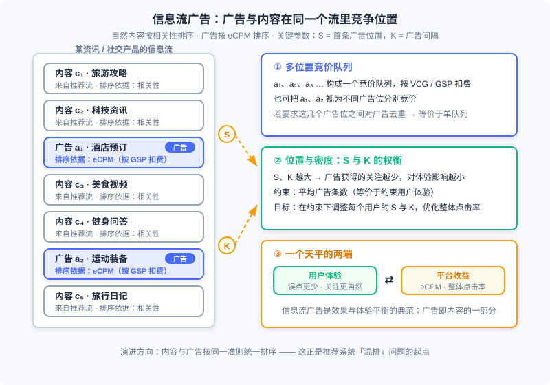
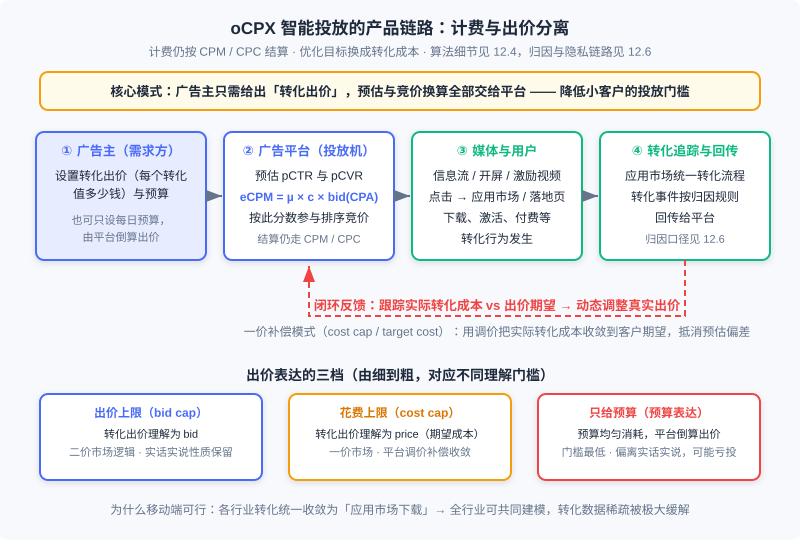

  📖
  ⏱️ ~50 min read
  🎯 Intermediate

# 信息流与原生广告

> 📝 **Before You Continue:** 先读 12.1（全景与生态）——本章会直接回扣那里的广告形态演进阶梯，12.1 中「信息流广告：平衡效果与体验的正面典型」一段，本章把它完整展开。再读 12.4（智能出价与预算控制）——oCPC/oCPM 的 eCPM 公式与预算控制在那一章已从算法视角讲透，本章只讲产品侧。12.6（开环与闭环）的转化归因链路是 12.13.4 的上游，12.3（竞价机制）的 GSP/VCG 会短暂出场。

程序化交易把广告做成了独立于内容的生意：流量进交易所、数据进 DMP、决策在 DSP——广告与媒体内容的关系被弱化了。这在 PC 的大屏幕上尚可容忍，到了移动设备上却撞了墙：屏幕小、触屏交互不精准、注意力高度碎片化，一条突兀的横幅足以毁掉整个阅读体验。业界的回应是把商业化内容与非商业化内容 **统一生产或混合排序**——这就是 **原生广告（Native Ads）** 的方向，也常被称为「内容即广告（content as ad）」。严格说，从软文、搜索广告到社交网络的信息流广告，都只反映了原生的一个侧面；但其中最典型、最早引发讨论的产品形态，是 **信息流广告（Feed Ads）**。

本章沿「挑战 → 核心形态 → 形态光谱 → 智能投放 → 程序化合流」的路线展开：先看移动环境为什么催生了原生（9.1 的故事），再拆解信息流广告的定义与混排机制（本章核心），然后遍历开屏、插屏、激励视频等原生家族成员，接着从产品视角讲 oCPX 智能投放如何让小广告主也能玩转竞价，最后讨论原生与程序化交易这两条看似相反的道路如何汇合。

读完本章，你将能够：

- 陈述原生广告兴起的移动时代动因，以及移动广告相对 PC 的两大新机会与核心挑战
- 用两个关键条件准确定义信息流广告，并据此判定一个产品形态是否「信息流」
- 描述信息流广告的混排机制：多位置竞价队列与 $S$/$K$ 参数的体验-收益权衡
- 区分表现原生与场景原生两种诉求，说清激励视频为什么是 eCPM 最高的原生形态
- 从产品侧描述 oCPX 转化追踪链路与三种出价表达模式，完成 5 道分层练习题

---

## 12.13.0 开篇：原生广告是广告与内容形态的融合

先给原生广告一个尽量诚实的定位。**原生广告** 没有公认的无懈可击的定义——所有将商业化内容与非商业化内容统一生产或混合排序的产品，都可以认为与原生广告有关系。软文是内容本身为委婉宣传而生产；搜索广告与自然结果出现在同一个流里；社交网络的信息流广告则把广告混进了动态列表。它们各反映了「原生」的一个侧面，而把这一方向推向极致的产品理念是：广告不应该是一种需要用户「忍耐」的东西，而应该是内容消费体验的一部分。

为什么这个方向在移动互联网时代才得到充分重视？因为把广告与内容独立地展示和运营，在小屏幕上遇到了巨大挑战。PC 时代的页面动辄上千米宽的画布，横幅、擎天柱各得其所；移动设备的屏幕只有几英寸，触屏交互又远不如鼠标精准——一条悬浮在页面顶部的横幅，用户滑动内容时它纹丝不动，误点与反感同时发生。业界由此开始探讨用原生广告部分代替一般展示广告，提高移动环境下的变现能力。真正由第三方提供的平台化原生广告产品，也正是在移动互联网时代才出现的。

> **Analysis:** 从产品演进的位置看，原生广告不是对程序化交易的否定，而是它的补全。12.1 的演进阶梯有两股力量：机制演进（从卖位置到卖人群、从 CPM 到 RTB）解决「卖得有效率」，形式演进（内容与广告融合）解决「用户愿意看」。程序化交易时代把前者推到了顶点，后者却成了短板——独立于内容的广告交易，必然会在效果和用户体验方面碰到天花板。原生广告正是在这个意义上被写进演进阶梯的顶端。

---

## 12.13.1 移动广告的机遇与挑战

移动广告的交易形态可以视为 PC 互联网广告的自然延伸：展示广告网络、搜索竞价排名都原样移植到了移动环境，前面各章的交易机制与产品形态在移动广告中依然适用。但移动广告有两个鲜明的新机会。其一， **场景广告的可能性** ：移动设备与用户形影不离，从地理位置、生活状态到需求意图都可能被深入理解——定向完全可以从场景与意图出发，而不只是根据兴趣推商品。比如通过地理位置判断用户正在上班，就不该向其推送游戏广告。其二， **大量潜在的本地化广告主** ：PC 时代即使在线广告也只能定位到城市级别，对一个小区的理发店来说粒度太粗；而移动环境的 GPS、蜂窝、Wi-Fi 多种精确定位手段，让本地化广告第一次变得可行。

但机遇背后的挑战同样具体，集中在两点。第一是 **数据割裂** ：移动互联网没有形成 PC 时代以 Web 为核心的生态，取而代之的是以应用为主的生态体系——各应用之间相对独立，没有超链接那样的组织体系，数据来源割裂、整合困难。理论上移动环境对用户的了解更深入，实际操作中数据的获取反而更困难；Web 生态下常用的数据交换手段在应用生态里大量失效。第二是 **隐私与身份的限制** ：移动设备标识、跨应用追踪等能力随着隐私监管（ATT、隐私沙盒）不断收缩，进一步加剧了数据侧的困难。这条线在 12.6 的身份基础设施与 12.10 的数据加工与交易中已经展开，本章不再重复。

挑战的直接后果是：传统横幅广告在移动端的表现出了问题。移动横幅的点击率远高于 PC 横幅，但其中有很大比例是误点击——触屏交互不精准，误点会严重打乱用户的任务，对体验伤害很大；而广告主观察到的转化率却很差，因为大量误点不会产生任何效果。**点击率虚高、转化相对较差** ，这个组合说明移动端需要一套新的创意与产品思路，这正是原生化的最大动力。

---

## 12.13.2 信息流广告：混排问题与体验-收益平衡

信息流广告最早见于社交网络，后来被各类移动广告产品广泛采用。它的效果之所以好，从形式上看有两点：交互的联动性，以及相对独立于周围内容。基于大量产品实践，可以给出这样一个描述性定义：

> **信息流广告**是这样一种广告形式：首先，广告以与内容联动的方式进行交互；其次，被广告区隔开的各部分内容之间没有直接的关联。

第一个条件「交互联动」说的是：用户上下滑动浏览内容时，嵌入其中的广告也按同样方式被操作——怎么操作内容，就怎么操作广告。这样做有两重好处：操作的便捷性大幅提高、误点概率下降；用户会觉得广告也是内容消费的一部分，从而提高关注程度和广告效果。反例很容易找：传统横幅在内容滚动时悬浮不动，不符合这条定义；插屏广告用角上按钮关闭，不是内容的典型交互方式，也不算——但如果通过滑动消除广告、进入其他内容，则可以归入信息流广告。第二个条件「内容相对独立」说的是：被广告隔开的各内容块各自独立表达一项内容，没有接续或因果关系。如果内容块之间有很强的联系，用户从感知上就会认为广告打断了他当前的阅读任务——这会同时损害广告的关注度与产品体验。所以在一篇文章中间开辟广告位的形式不算信息流广告；而社交网络、新闻客户端的内容块天然联系较弱，非常适合信息流变现。至于「展示样式与内容块一致」「按受众定向精准投放」，实践中虽普遍，但并非根本特征，不必放进定义。

### 🧠 Mental Model: 拼盘与连载

> 把信息流想成自助餐拼盘，把长文想成连载小说。在拼盘里，每一格食物之间本来就互不相干——混进几格「赞助菜品」几乎无感，你的取用动作对它们一视同仁。而在连载小说中间插一页广告，读者正读到情节关键处被打断，只会愤怒。信息流广告的两个定义条件说的就是这件事：广告必须用与拼盘同样的取用方式（交互联动），且拼盘的格子之间本就独立（内容无关联）。连载里插广告？那是另一种生意，得另想办法。

### 多位置竞价与 S/K：混排的产品机制

从产品本质上看，信息流广告与普通展示广告区别不大——可以看成是一个 **多位置且广告放置比较自由的竞价广告产品**。它的展示与交互形式属于另一个范畴：信息流广告生态里同样存在封闭的 ADN、供给方的 ADX 与 SSP、需求方的 DSP，主体决策流程与展示广告一致。真正特有的是两个产品问题。

图中信息流里插入的若干广告位 $a_1, a_2, a_3, \ldots$ 构成一个 **竞价队列** ，可以按 VCG 或 GSP 扣费；也可以把 $a_1, a_2$ 视为不同广告位分别竞价，但若要求这几个广告位之间对广告去重，就等价于只有一个竞价队列。第二个问题更微妙——**广告在哪里出现**。它由两个参数决定：$S$，即首条广告出现在第几条内容之后；$K$，即两条广告之间间隔几条内容。$S$ 与 $K$ 的取值越大，广告获得的用户关注就越少，对用户体验的影响也越小。这与搜索广告的放置问题同构：在 **平均广告条数** 的约束下，通过调整每个用户的 $S$ 与 $K$，优化总体广告的点击率——平均广告条数约束相当于对用户体验的约束，求解关键在于尽可能准确地预估每个用户相对整体用户的点击率水平。

### 与推荐系统的天然同构：混排

现在把视角拉高一层。信息流里，自然内容按相关性排序、广告按 eCPM 排序，两边来自不同的服务、用不同的准则，再按固定逻辑混合——今天的搜索与信息流大多如此。但「内容即广告」的终极方向是：内容与广告 **按同一准则统一排序** ，让每一次位置分配都由统一的分数竞争决定。这正是推荐工程里的 **混排（re-ranking / mixing）** 问题：广告与自然内容作为同一候选池的两种物品，用可比较的分数（自然内容的体验价值 vs 广告的 eCPM 与体验折损）竞争展示位置。对推荐系统工程师来说，这是广告与推荐在工程上最直接的结合点——你熟悉的多样性、体验建模、多目标融合分数，正是解决混排问题的工具箱。

> **Analysis:** 信息流广告之所以被称为效果与体验平衡的典范，是因为它把「广告离内容近」的形式收益与「竞价保效率」的机制收益同时拿到了手：形式上，交互联动与内容独立让用户自然地关注广告；机制上，多位置竞价队列又保留了 12.3 那套价格出清的效率。代价是两个新约束——素材要适配各种信息流位置（12.13.3 的「表现原生」问题），密度要靠 $S$/$K$ 精细权衡。一个值得注意的产品细节：任何一个平台在充分变现自有流量后都会向外拓展站外流量，而站外产品情况复杂，做不到原生展示就会带来填充率严重下降——所以连 Facebook 这类单一大流量平台也逃不开适配问题。

---

## 12.13.3 原生广告的形态光谱：从开屏到激励视频

信息流之外，移动广告还衍生出一批与内容深度结合的创意形态。按「原生程度」排开，可以拼出一条光谱。

**传统形式的补丁：横幅与插屏。** 横幅直接从 PC 传承而来，在移动端有点击率虚高、转化较差的问题（12.13.1 已分析）。**插屏广告（interstitial ad）** 类似视频中的暂停广告，出现在游戏或应用暂停时，同样点击率虚高、转化相对较差。但由于广告网络、广告交易平台等成熟交易体系的存在，这两种标准化程度高的形式最容易形成规模，至今仍是移动展示广告的主要形式，且以竞价售卖为主。

**顺水推舟的形态：开屏与锁屏。** **开屏广告** 在应用打开的加载页面展示全屏广告。它是移动广告形式中相当好的探索：用户在等待应用打开时还没有明确的任务，因此不会对广告很反感；全屏展示也让品牌价值更高，实际售卖往往以 **合约方式** 为主。**锁屏广告** 在设备锁定时展示，特性与开屏相似，对体验影响较小，但一般以激励型为主。

**激励型下载类：推荐墙与积分墙。** 以应用下载为目标的预算催生了专门形式。**推荐墙（offerwall）** 直接推送下载类广告，类比站外推荐； **积分墙** 则在用户下载并激活应用后给予可兑换虚拟物品的积分。它们与返利网同属激励广告，点击与激活数据好看，但后续活跃较差。不过在特殊场景有独特价值：应用上线冲榜需要短时间大量下载，游戏开服需要玩家快速聚齐社区——都曾依赖积分墙。但苹果明确打击用积分影响榜单的做法，其前景并不乐观。

### 激励视频：为什么它是效果最好的原生形态

**激励视频广告（Rewarded Video）** 是原生方向上最有代表性的产品，常见于游戏媒体，流程分四步：

1. 游戏场景自然带入——用户游戏受挫或想获取虚拟商品时，提示可观看一段视频换取奖励；
2. 用户打开视频，播放一段 15 到 30 秒的广告片，且不能跳过；
3. 播放结束，向用户展示下载或其他转化跳转页面；
4. 用户回到游戏，获得虚拟商品的奖励。

它的效果优势来自两点。首先，在激励场景下用户不能跳过视频、只能看完，接受了充足的信息后转化效果自然变好；其次，广告附赠的游戏内虚拟商品对非充值用户是稀缺资源，让用户愿意在实际价值较低的情况下认真观看。与积分墙那种激励有本质区别：激励视频 **只对观看行为给予奖励，并不刺激下载** ，所以不会出现获取用户质量偏低的问题。也正因此，激励视频广告网络服务的最成功的反而是效果广告主而非品牌——主流激励视频网络都以应用下载广告为主要收入来源。商业成绩也佐证了这一点：以激励视频为核心的公司 Applovin 成立于 2012 年，到 2016 年已实现超过 5 亿美元收入与 9000 万美元净利润。

> **Analysis:** 激励视频是原生逻辑的一个精妙平衡：它需要从游戏场景自然带入、与游戏积分体系无缝对接，媒体要付出设计成本；但其核心部分——视频素材的播放——是高度标准化的过程，非常容易程序化地交易。「深度定制的场景外壳 + 标准化可交易的内核」，这正是原生产品规模化的一道通用配方，也解释了为什么激励视频会成为移动广告的重要发展方向。

### 原生广告平台：表现原生与场景原生

把视野从创意形态拉回平台层。「原生」其实包含两种不同的诉求：一是把广告的展示风格和样式做得与内容一致，叫 **表现原生（expressive native）** ；二是把广告的投放决策逻辑与内容生产保持一致、按用户场景触发，叫 **场景原生（scene native）**。对照之前的例子：社交网络信息流侧重表现原生；搜索广告则在两个方面都是原生——它的投放决策完全按照内容结果的展示原则进行，等于以投放内容的方式匹配广告。由此可以总结出原生广告平台的两条产品原则：表现原生要求 **由媒体来控制广告展示形式** （连字体、颜色都要按媒体适配，这是传统「创意」无法承载的要求）；场景原生要求 **用媒体提供的场景与需求来筛选广告**。

理想的原生广告平台把两者结合，并以第三方平台的形式规模化运营。其机制被称为 **植入式原生广告** ：媒体判断用户场景与意图后，以结构化查询（如「类型=酒店；地点=拉萨」）向广告平台请求 **结构化的付费内容**——平台返回的不是成形创意，而是可拼装的字段素材，由媒体按自己的风格模板拼装渲染。这比传统上下文定向更进一步：上下文定向是广告平台用粗浅的自然语言处理猜页面主题，而媒体的主动参与让意图提取容易得多。挑战也真实存在：媒体参与让交易多了自由度、运营难度大增，中小媒体的接入需要长期市场培育；而分行业、结构化付费内容库的积累需要时间——即便是大平台，手里成规模的也只是创意而非内容库。

---

## 12.13.4 oCPX 智能投放：产品视角

移动广告相对 PC 时代还有一个重要的产品差异： **智能投放（oCPX）** 模式被广泛采用。本节只讲产品侧——广告主怎么用、链路怎么串；oCPC/oCPM 的 eCPM 公式、预算约束下的出价缩放等算法细节，12.4 已从算法视角讲透，此处互链不重复。

### 为什么需要 oCPX：帮小客户拆掉门槛

智能投放的基本问题很清楚：竞价过程中由平台承担更多计算任务，帮助那些数据和信息技术能力有限的中小客户，降低他们对竞价广告的理解门槛与运营优化成本。但这里有个陷阱：如果直接采用彻底的 CPA/CPS/ROI 计费，会有大量有问题的客户涌入蹭流量，形成劣币驱逐良币。主流产品的解法是 **计费与出价相分离的 oCPX 模式** ：计费仍然走 CPM/CPC 的老路，但广告主向平台表达的目标换成转化成本——平台用「我帮你按转化优化」换取「计费口径不变」。

图中链路从产品视角拆开是四步：广告主设置转化出价（每个转化值多少钱）与预算；平台预估点击率与转化率、按 $\mathrm{eCPM} = \mu(a,u,c) \cdot c(a,u) \cdot \mathrm{bid}_{\mathrm{CPA}}(a)$ 参与排序竞价（公式的推导与预算控制见 12.4.1 与 12.4.2）；用户在媒体上点击、下载、转化；转化事件按归因规则回传给平台（归因口径与 ATT/SKAN 带来的限制见 12.6，反作弊口径见 12.11）。闭环的最后一环是平台跟踪实际转化成本与出价期望的偏离，动态调整真实出价。

### 转化率预估：为什么移动端做成了

从平台的技术角度看，oCPX 引入的新问题主要是 **转化率预估**。它的困难远超点击率预估：不同行业的客户转化流程差异很大，无法用统一模型建模；转化数据的量比点击还少很多，数据稀疏更严重。在 PC 时代，这两座大山让转化率预估虽被寄予期望、实践中却难以落地。

转机来自移动端一个并不起眼的事实： **转化流程的一致性大大加强了**。移动广告中很多行业的转化都以 App 下载的形式体现——电商、游戏、工具、金融的营销目标往往都要先下载客户的 App。从技术而非商业的视角看，真实的转化出口只有一个：应用市场。所有下载类客户的数据流程一致，理论上可以共同建模，数据稀疏问题被极大缓解。受此启发，如今的平台还在 App 下载以外继续推动转化流程的统一——例如中国主流平台上，非平台电商自建站逐渐淡出，转而采用平台提供的统一建站模板，目的之一就是统一转化流程有利于转化率预估的建模。

### 出价的三种理解：bid、price 与预算

oCPX 有一个隐蔽而关键的产品问题：广告主给出的转化出价 $\mathrm{bid}_{\mathrm{CPA}}(a)$，平台应该把它理解成 **出价（bid）** 还是 **期望得到的实际转化成本（price）** ？两种理解对应完全不同的市场机制。

若理解为 bid，平台按二价机制处理：用 $\mathrm{eCPM} = \mu \cdot c \cdot \mathrm{bid}_{\mathrm{CPA}}$ 排序，胜出者按下一位的 eCPM 向下收费。此时虽然计费用 CPM，仍可折算客户的实际 CPA 成本——在预估可靠、预算充分的前提下，这一成本一定小于其出价，整个市场与 CPC 二价市场没有本质区别，实话实说与社会福利最优性质都保留。客户只要大致清楚自己每个转化的价值，忠实报价即可。若理解为 price，市场实质变成一价：由于点击率与转化率预估必有偏差，简单按一价处理并不能保证最终转化成本接近出价，所以平台还要 **跟踪实际转化成本，根据其与期望的偏离程度动态调整真实出价** ，通过补偿让转化成本收敛到出价。Facebook 的产品术语精确对应这两种理解：前者接近 **出价上限（bid cap）** 模式，后者接近 **花费上限（cost cap）** 或 **目标花费（target cost）** 模式。

对大多数客户而言，连转化出价都嫌复杂——还有什么概念人人能懂？只有预算。Facebook 首创了 **预算表达模式** ：客户只说一天想花多少钱，平台将预算尽量均匀地在各时段消耗；过程仍在竞价框架内完成——平台预测每个时段客户所选人群的市场价格水平，倒算出需要出多少价才能按计划消耗。这套「傻瓜式」竞价让客户做好素材、选定人群、定好预算、按下启动键即可，市场活跃客户数量大增。但分时倒算出价在某种意义上违背了二价市场的实话实说原则：当某时段倒算出的 CPA 出价高于客户真实转化价值时，便可能带来亏损——所以 Facebook 又为有能力的客户保留了出价上限模式，客户提供的上限低于系统倒算出价时以前者替代。

> **Analysis:** 三种出价表达构成一个「精细度 vs 理解门槛」的阶梯：bid cap 最精细、保留二价市场的机制性质，但要求客户理解「出价」概念；cost cap / target cost 把承诺变成「实际成本」，教育成本低了，但市场退化为一价、需要平台调价补偿；预算表达门槛最低，但倒算出价偏离客户真实价值时可能亏投。作者的观点值得体会：站在二价表达的基础上逐渐引导市场和客户，可能是比较合理的路径——机制的健康与门槛的降低，长期看需要兼得。

---

## 12.13.5 收束：原生广告与程序化交易的合流

最后回答一个看似矛盾的问题：程序化交易的趋势是受众购买、自动化竞价，原生广告却要求媒体深度参与、把广告融进内容——这两条道路是不是背道而驰？合流点在哪里？

先观察一个现象：搜索广告有没有程序化交易的可能？市场上从未见过这种产品场景。但 Facebook 的信息流广告里，却存在按广告主上传人群库投放的方式——这不是程序化交易，但目的类似，而且很容易改造成 RTB。同样作为原生广告的特殊形式，为什么对程序化交易的接受程度如此不同？关键在于： **原生广告的触发是否根据用户意图进行**。在明确提供用户意图的原生广告（如搜索）中，完全开放 RTB 很难控制付费结果的相关性——能做到良好相关性的只有少数技术强的大平台，引入大量 DSP 参与竞价就很难保证结果质量，因此由单个技术能力较强的原生广告网络（或自营）更可行。而在社交网络信息流这类用户意图并不明确、也不要求广告依意图触发的原生广告中，完全可以考虑用程序化交易的方式运营——这也是原生广告未来的发展趋势之一。

把这条结论放回 12.1 的演进阶梯，本章的位置就清楚了：阶梯由形式演进（内容与广告融合）与机制演进（交易自动化）两股力量推动，在顶端汇合。原生 RTB 正是这个汇合点——「内容的个性化」（原生让广告以用户愿意接受的方式出现）与「交易的程序化」（RTB 让每一次个性化决策在开放市场中定价）不再是一对矛盾，而是同一个决策系统的两个侧面。12.1 那张演进阶梯图中「信息流广告：开始尝试将内容和广告融合」的一行，到本章才算真正落了地。

---

## ⚠️ Common Mistakes in 12.13

| # | Mistake | Example | Why It's Wrong | Fix |
|---|---------|---------|---------------|-----|
| 1 | 把信息流广告理解为「长得像内容就行」 | 在文章段落中间开辟广告位，样式与正文一致，就自称信息流 | 定义的第二条件要求被广告区隔的内容相互独立；长文内容块是接续的，插入广告会打断阅读任务 | 用两个定义条件判定：交互联动 + 内容块无直接关联，缺一不可 |
| 2 | 混淆 oCPX 出价的三种表达模式 | 广告主按 cost cap 出价，却按 bid cap 的二价逻辑预期扣费并投诉平台多扣 | bid cap 下出价是 bid（二价市场），cost cap 下出价是期望成本（一价 + 平台调价补偿），预算模式则连出价都不需要 | 对接客户前先确认模式；解释预期成本口径与调价补偿机制 |
| 3 | 认为广告密度越高效益越好 | 把 $S$、$K$ 一路调小，追求单次会话广告收益 | 密度过高带来误点与反感，伤害的是长期流量价值；且信息流是竞价队列，劣质位置拉低整体点击率 | 在平均广告条数约束下按用户分群精细化调整 $S$/$K$，优化整体点击率 |
| 4 | 把激励视频等同于积分墙式激励 | 担心激励视频「奖励带来的用户质量低」 | 激励视频只奖励观看行为、不刺激下载，不存在积分墙那种用户质量偏低问题 | 区分「奖励观看」与「奖励下载」两类激励，评估口径随之不同 |
| 5 | 认为搜索类原生广告可以直接开放 RTB | 把搜索广告位接进公开竞价市场 | 明确用户意图触发的原生广告，开放竞价无法控制付费结果的相关性 | 意图明确的原生走强技术能力的单平台网络或自营；意图模糊的信息流类才适合程序化 |
| 6 | 转化预估模型不准时只怪模型 | pCVR 偏差大就反复调模型，忽视转化追踪链路 | 转化事件依赖回传与归因口径；链路丢数据、归因错配会让模型输入本身就是错的 | 先按 12.6 的归因链路核对回传完整性与口径，再诊断模型 |

---

## 本章小结

### 📌 Key Takeaways

| Concept | Key Points | Why It Matters |
|---------|-----------|----------------|
| 原生广告的由来 | 移动端屏幕小、交互不精准、横幅误点多转化差；统一生产或混合排序商业化与非商业化内容（内容即广告） | 解释为什么原生化在移动时代成为刚需，而非风格选择 |
| 信息流广告定义 | 两条件：广告与内容交互联动；被广告区隔的内容相互独立 | 判定产品形态归属的唯一标准，样式相似不充分 |
| 混排与放置 | 多广告位构成竞价队列（VCG/GSP）；$S$（首条位置）与 $K$（间隔）决定密度；约束平均广告条数、优化整体点击率 | 信息流的产品机制核心，也是推荐系统「混排」问题的工程起点 |
| 原生形态光谱 | 表现原生（媒体控制展示样式）vs 场景原生（按场景/意图触发）；激励视频 = 深度定制场景 + 标准化可交易内核，只奖励观看不刺激下载 | 原生不是单一形态，而是按原生程度排列的光谱 |
| oCPX 产品链路 | 计费与出价分离；移动端转化流程统一为应用市场下载，缓解数据稀疏；出价三表达：bid cap（二价）/ cost cap（一价补偿）/ 预算表达（倒算出价） | 让小客户也能参与竞价的产品基础设施，机制性质随表达模式变化 |
| 原生与程序化合流 | 触发是否依赖明确用户意图决定能否开放 RTB；意图模糊的信息流类原生可与程序化交易结合 | 回扣 12.1 演进阶梯：形式演进与机制演进在顶端汇合 |

### ❓ FAQ

**Q1: 信息流广告与普通展示广告到底差在哪？既然本质都是竞价？**
> 决策流程（检索、排序、竞价、计费）确实基本一致，信息流生态里同样有 ADN/ADX/DSP。差别集中在展示与交互层：交互要与内容联动、内容块之间要相互独立，由此派生出素材适配与 $S$/$K$ 密度控制两个特有产品问题。一句话：同一个竞价内核，换了一层「原生」的外壳与约束。

**Q2: 预算表达模式下平台倒算出价，会不会把我的钱花亏？**
> 可能。当某时段倒算出的 CPA 出价高于你真实的转化价值时，就会出现亏投——这正是预算表达模式违背实话实说原则的代价。有运营能力的客户应当使用出价上限（bid cap）模式：系统倒算出价高于你设定的上限时，按你的上限执行。

**Q3: 为什么说激励视频服务效果广告主是「与直觉不同」的？**
> 直觉上，全屏视频、深度植入游戏场景，像品牌广告的阵地。但激励场景的两个特性——必须看完、虚拟商品对非充值用户是稀缺资源——天然利好「看完即转化」的效果链路，所以主流激励视频网络都以应用下载广告为主要收入来源。品牌诉求反而更适合开屏这类合约售卖的全屏形态。

### 🔗 前后关联

- **12.1** （全景与生态）：本章是 12.1 演进阶梯中「信息流/植入式原生」两行的完整展开；原生 RTB 是阶梯顶端「形式演进与机制演进汇合」的具体形态
- **12.4** （智能出价与预算控制）：oCPC/oCPM 的 eCPM 公式、预算 pacing 与出价缩放的算法视角在 12.4；本章只讲产品侧的链路与出价表达模式
- **12.6** （开环与闭环广告）：oCPX 的转化追踪与回传依赖的归因体系，以及 ATT/SKAN 对移动转化的冲击，均在 12.6 展开
- **12.3** （竞价机制）：信息流多广告位竞价队列的 VCG/GSP 扣费、二价实话实说性质的理论基础
- **12.11** （实验框架与反作弊）：oCPX 转化数据被归因作弊污染的风险与识别手段在 12.11

---

## Practice Problems

Work through all problems in order — they get progressively harder. Each has a complete solution you can reveal after trying it yourself.

---

**Problem 12.13.1 — 用两个定义条件判定信息流广告** 🟢 Easy

依据 12.13.2 的定义（交互联动 + 被广告区隔的内容相互独立），判断以下四种形态是否属于信息流广告，并说明理由：

(a) 社交网络动态列表中插入的卡片广告，随内容一起滑动；
(b) 长篇文章段落之间的固定横幅，内容滚动时横幅悬浮不动；
(c) 游戏暂停时弹出的插屏广告，通过角上按钮关闭；
(d) 某应用内广告通过滑动消除，随后进入其他内容界面。

**Sample Input:** `[(a), (b), (c), (d)]`
**Sample Output:** `(a) 是；(b) 否；(c) 否；(d) 是`

💡 Solution (click to reveal)

**Approach:** 逐条对照两个定义条件：交互联动（怎么操作内容就怎么操作广告）与内容块相互独立（无接续、因果关系）。

- (a) 随内容一起滑动满足交互联动；动态列表的内容块天然相互独立。两个条件都满足，**是**。
- (b) 横幅悬浮不动，违反交互联动；且同一篇文章的内容块是接续的，违反内容独立。两个条件都不满足，**否**。
- (c) 角上按钮关闭不是内容的典型交互方式，违反交互联动，**否**。
- (d) 通过滑动消除广告属于与内容一致的交互方式，可归入信息流广告，**是**。

**Key points:**
- 「展示样式与内容一致」「精准定向」是常见特征但不是根本特征，不进入判定
- 判定只看交互与内容结构，不看广告是不是真的长得像内容

---

**Problem 12.13.2 — oCPX 二价市场的 eCPM 排序与实际 CPA** 🟢 Easy

某信息流竞价队列中有两个候选广告（移动端下载类）：

- 广告 A：$\mu = 2\%$（点击率），$c = 5\%$（转化率），转化出价 $\mathrm{bid}_{\mathrm{CPA}} = 40$ 元
- 广告 B：$\mu = 1.5\%$，$c = 4\%$，$\mathrm{bid}_{\mathrm{CPA}} = 50$ 元

按 eCPM 排序决定胜者；若采用二价逻辑（按下一位的 eCPM 收费），计算胜者的实际 CPA 成本，并与 A 的出价比较。

**Sample Input:** $\mu_A = 0.02,\ c_A = 0.05,\ \mathrm{bid}_A = 40$；$\mu_B = 0.015,\ c_B = 0.04,\ \mathrm{bid}_B = 50$
**Sample Output:** A 胜出；$\mathrm{eCPM}_A = 40$ 元，$\mathrm{eCPM}_B = 30$ 元；实际 CPA $= 30$ 元 $< 40$ 元

💡 Solution (click to reveal)

**Approach:** 用 12.4.1 的公式 $\mathrm{eCPM} = \mu \cdot c \cdot \mathrm{bid}_{\mathrm{CPA}} \times 1000$ 排序；二价收费后按「每千次展示收入 ÷ 每千次展示转化数」折算 CPA。

- $\mathrm{eCPM}_A = 1000 \times 0.02 \times 0.05 \times 40 = 40$ 元；$\mathrm{eCPM}_B = 1000 \times 0.015 \times 0.04 \times 50 = 30$ 元。A 胜出。
- 二价按次高价收费：每千次展示收入 30 元。每千次展示的转化数为 $1000 \times 0.02 \times 0.05 = 1$。
- 实际 $\mathrm{CPA} = 30 / 1 = 30$ 元 $< 40$ 元 = 出价。

这正是 12.13.4 说的二价性质：只要点击率与转化率预估可靠、预算充分，实际 CPA 一定低于出价，市场保留了实话实说性质——客户忠实报告每个转化的价值即可。
**Key points:**
- oCPX 计费口径仍是 CPM，CPA 是从二价扣费折算出来的实际成本
- 实际 CPA 小于出价不是巧合，而是二价机制的必然（本例 30 < 40）

---

**Problem 12.13.3 — 信息流密度的 S/K 放置** 🟡 Medium

某资讯 App 每次刷新加载 30 条内容，产品要求 **平均每次刷新不超过 3 条广告**。若首条广告固定出现在第 3 条内容之后（$S = 3$），且后续两条广告按相同间隔 $K$ 顺次插入（位于第 $S + K$、$S + 2K$ 条内容之后），求满足约束的最大整数间隔 $K$，并给出三条广告的具体位置；再验证 $K$ 再大 1 时是否越界。

**Sample Input:** 内容总数 30；广告上限 3；$S = 3$
**Sample Output:** $K = 13$；广告位于第 3、16、29 条内容之后

💡 Solution (click to reveal)

**Approach:** 第三条广告的位置是 $S + 2K$，必须不超过内容总数 30：$3 + 2K \le 30$。

- $2K \le 27 \Rightarrow K \le 13.5$，最大整数 $K = 13$。
- 三条广告位置：第 3、$3+13=16$、$16+13=29$ 条内容之后，均在 30 条以内。
- 验证 $K = 14$：$3 + 2 \times 14 = 31 > 30$，第三条广告越界，不可行。

顺带体会 $S$/$K$ 的权衡含义：在「最多 3 条」的总量约束下，$K$ 取到上限意味着广告被尽量稀释到尾部——广告获得关注更少、体验伤害更小；若想让前半程也参与变现，就要减小 $K$ 并接受体验折损，12.13.2 说的「按每个用户的点击率水平精细调整」正是在这条边界上做优化。
**Key points:**
- 约束式是 $S + (n-1)K \le$ 内容总数，$n$ 为广告条数
- 总量约束只限制「平均广告条数」，具体位置（$S$、$K$）才是体验-收益权衡的自由度

---

**Problem 12.13.4 — 横幅与激励视频的 eCPM 对比** 🔴 Hard

某游戏媒体有两个可选广告位方案，广告主按 CPA 出价 $\mathrm{bid}_{\mathrm{CPA}} = 20$ 元不变：

- 方案一（横幅）：点击率 $\mu = 0.5\%$，观看后到转化的比例 $c = 1\%$；
- 方案二（激励视频）：广告不可跳过、必须看完，点击率 $\mu = 15\%$，看完后到转化的比例 $c = 2\%$。

计算两方案的 eCPM 并求倍数关系；结合激励视频的两个效果来源（必须看完、虚拟商品激励认真观看），解释为什么主流激励视频网络以效果广告主为主要收入来源。

**Sample Input:** $\mathrm{bid} = 20$ 元；$(\mu_1, c_1) = (0.005, 0.01)$；$(\mu_2, c_2) = (0.15, 0.02)$
**Sample Output:** $\mathrm{eCPM}_1 = 1$ 元，$\mathrm{eCPM}_2 = 60$ 元，60 倍

💡 Solution (click to reveal)

**Approach:** 直接套 $\mathrm{eCPM} = \mu \cdot c \cdot \mathrm{bid}_{\mathrm{CPA}} \times 1000$，比较两方案的 $\mu \cdot c$（每千次展示转化数）。

- 方案一：$1000 \times 0.005 \times 0.01 \times 20 = 1$ 元。每千次展示转化数 $= 0.05$。
- 方案二：$1000 \times 0.15 \times 0.02 \times 20 = 60$ 元。每千次展示转化数 $= 3$。
- 倍数：$60 / 1 = 60$ 倍，全部来自 $\mu \cdot c$ 从 0.05 提升到 3（60 倍）。

分解来看：点击率提升 30 倍（0.5% → 15%，不可跳过 + 看完才给奖励，用户必然完成观看-点击引导），转化率提升 2 倍（1% → 2%，充足的信息传递提升后端转化）。12.13.3 的两个效果来源正对应这两项：必须看完撑起点击率，认真观看与虚拟商品激励撑起转化率。转化率的大幅确定性提升让效果广告主（应用下载为主）愿意为激励视频支付高 CPA，这就是激励视频网络收入以效果广告主为主的原因。
**Key points:**
- eCPM 差距可以完全分解到 $\mu$ 与 $c$ 两个因子上，出价不变时倍数关系不变
- 「不可跳过」是激励视频的核心产品杠杆：它同时改变了漏斗的曝光-点击与点击-转化两段

---

**Problem 12.13.5 — CPA 超出出价的诊断设计** 🏆 Challenge

你是某移动广告平台 oCPX 产品的负责人。运营反馈：一批采用「花费上限（cost cap）」模式的客户投诉实际转化成本比出价期望高出 30% 以上，且调价补偿迟迟不能收敛。请设计一套诊断流程：列出至少 4 个可能根因（分别来自转化追踪链路、归因口径、模型、机制），说明每个根因对应的可观测指标与验证方法，并给出修复动作。

**Sample Input:** 客户投诉清单 + 平台展示/点击/转化日志 + 回传数据 + 出价调整记录
**Sample Output:** 根因 × 指标 × 验证方法 × 修复动作的对照表

💡 Solution (click to reveal)

**Approach:** 沿 oCPX 链路（12.13.4 的 ①→④ 环节）从数据源头到机制末端排查：先确认「成本确实高」还是「数据口径不一致」，再区分「模型估不准」与「机制收敛不了」。

| 可能根因 | 可观测指标 | 验证方法 | 修复动作 |
|---------|-----------|---------|---------|
| 转化追踪链路丢单/迟到 | 回传转化数 vs 应用市场侧实际激活数的分日对账；回传延迟分布 | 抽样设备级比对展示-点击-回传全链路日志 | 修复回传接口重试机制；对迟到转化做延迟归因补偿 |
| 归因口径错配 | 平台归因口径 vs 客户/MMP 归因口径（点击后归因窗口、末次点击 vs 多触点）的差异统计 | 对同一批转化按两种口径分别重算 CPA | 与客户对齐归因窗口与口径（参见 12.6）；口径无法一致时在产品上明确展示口径 |
| pCVR 模型偏差 | 预估 CVR vs 实际 CVR 的分行业校准曲线（分桶对比，参见 12.5） | 按行业、人群分桶画校准曲线，观察系统性高估/低估 | 分行业单独建模或引入行业特征；预估偏差进入出价补偿的先验 |
| 机制收敛问题 | 调价补偿的响应速度 vs 成本波动速度；极端时段倒算出价记录 | 回放高波动时段（如大促）的出价调整轨迹，检查是否追不上或超调 | 增加调价步长的自适应；对成本波动大的时段设置出价保护带 |
| 客户侧误解（对照项） | 客户实际选择的模式与预期的差异；预算消耗曲线 | 核对客户配置：是否误用预算表达模式却按 cost cap 预期 | 客户教育：三种出价表达（bid cap / cost cap / 预算）的预期成本口径差异 |

**Key points:**
- 先二分「数据错了」还是「机制错了」：链路与归因问题会让模型输入本身就错，模型再准也没用
- cost cap 是一价 + 补偿机制，收敛依赖「跟踪实际成本 → 调整真实出价」回路的信噪比；数据侧污染直接拖垮收敛
- 别漏掉对照项：相当比例的「投诉」源于客户对出价表达模式的理解偏差，这本身就是 12.13.4 强调的产品问题

