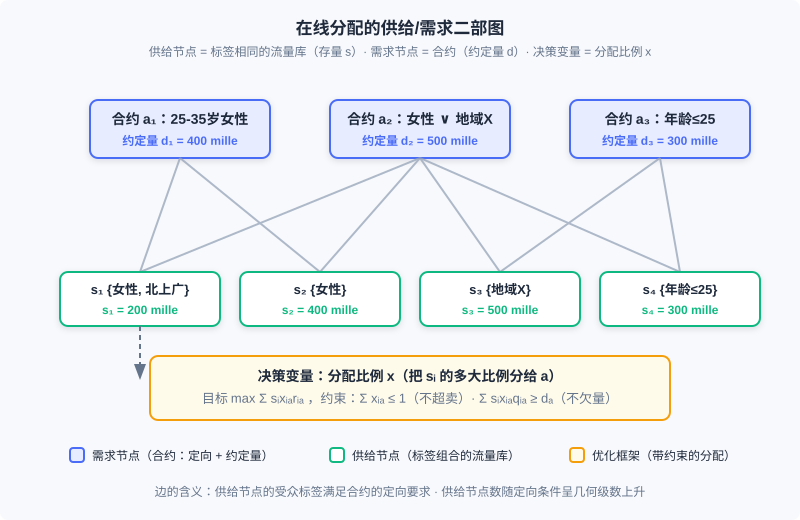
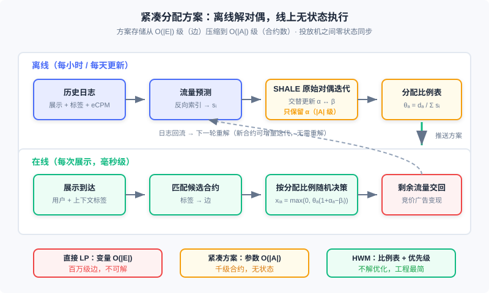

<div style="display: flex; gap: 12px; margin-bottom: 24px; flex-wrap: wrap; align-items: center;">
  <span style="background: #f0f4ff; color: #4A6CF7; padding: 4px 12px; border-radius: 20px; font-size: 0.85em; font-weight: 600; border: 1px solid rgba(74,108,247,0.2);">📖</span>
  <span style="background: #fdf2f8; color: #be185d; padding: 4px 12px; border-radius: 20px; font-size: 0.85em; border: 1px solid rgba(190,24,93,0.2);">⏱️ ~55 min read</span>
  <span style="background: #fef2f2; color: #dc2626; padding: 4px 12px; border-radius: 20px; font-size: 0.85em; font-weight: 600; border: 1px solid rgba(100,100,100,0.15);">🎯 Advanced</span>
</div>

# 在线分配与流量管理

> 📝 **Before You Continue:** 本章需先读 12.1（全景图）——合约广告在生态中的位置与「保量」交易的由来；以及 12.4（智能出价与预算控制）——pacing 乘子与本章的对偶变量是同一思想在两个市场的投影。12.3（竞价机制）帮你看清本章的对照组：竞价市场靠价格出清，合约市场靠算法分配。

12.4 里我们解决的是「钱」的约束：预算有限，怎么花得又慢又准。这一章处理它的孪生兄弟——「量」的约束：品牌广告主签下的是「未来两周、25–35 岁女性用户、100 万次展示」这样的合约，平台必须在流量到来时实时决定每一次展示给谁，最终既不超卖（供给有限）也不欠量（合约要保）。这就是 **在线分配（Online Allocation）** 问题。它诞生于担保式投送（Guaranteed Delivery, GD）这种看起来有些「古老」的合约广告系统，但它给出的框架——供给/需求二部图 + 带约束优化 + 对偶变量定价——至今仍支撑着品牌合约广告的投放引擎，而它训练出的思维方式（把约束写进优化目标、用对偶价格解释流量价值）正是 12.4 那套智能出价体系的理论源头。

本章沿「问题 → 模型 → 支撑技术 → 求解 → 执行」的路线展开：先把保量问题写成二部图上的带约束优化，再补上流量预测与频次控制两块地基，然后看工程上如何从不可解的直接线性规划走到紧凑的对偶方案（SHALE），最后落到实用启发性算法 HWM 与它的线上执行逻辑。

读完本章，你将能够：

- 把「保量 + 优化收益」表述为供给/需求二部图上的带约束优化问题，写出需求约束、供给约束与目标函数
- 描述流量预测的反向索引方案，解释它为什么是「广告检索的对偶问题」
- 解释频次控制如何打破展示可分解性假设，以及客户端/服务端两种实现方案的取舍
- 说明为什么直接线性规划在大规模合约系统里不可解，紧凑分配方案如何用 $|A|$ 级的对偶变量恢复 $|E|$ 级的分配率
- 实现 HWM 离线规划与在线 serving 的完整流程，完成 5 道分层练习题

---

## 12.7.0 保量广告：一个带约束的决策系统

先区分两种卖法。**竞价广告** （12.3 整章）像证券市场：每一次展示当场拍卖，价高者得，流量用价格出清。**合约广告** 像提前包场：广告主与媒体约定定向人群、时间段与展示量，价格与量都写进合同。合约的最初形态是按广告位包时段售卖的 CPT 广告，这类 **排期系统** 并不个性化——素材按事先确定的排期直接插入媒体页面，通过 CDN 加速访问，服务器端几乎没有决策压力。工程上唯一值得留意的是混合投放的调度：排期广告走 CDN 前端直投，动态广告走服务端决策；若服务端超时或出错，页面要渲染 CDN 上的 **防天窗广告** （兜底素材），保证广告位永远不空白。这套「前端兜底」的思路今天仍是广告位容错的标准答案。

真正的复杂性出现在 **展示量合约** ：按 CPM 计费、按人群售卖。此时服务器必须实时决策每一次展示给哪份合约，且必须保证每份合约到期能凑够约定量——这样的系统叫 **担保式投送（GD）系统**。只要所有合约都被满足，收益就是一个常量（量与价都签死了），优化目标随之从「收益最大」变成「在满足所有合约量的前提下，把流量分配得尽量好」。这一转变把一个无约束的排序问题变成了一个 **带约束的优化问题** ，而这正是本章全部技术的出发点。

### 🧠 Mental Model: 包桌的餐厅

> 把广告系统想成一家餐厅。竞价广告是散客：每晚开门，谁出价高谁坐最好的位子，收入随行就市。合约广告是包桌：客人提前一个月订下「周五晚 8 点、二楼包间、10 桌」。包桌有两条铁律——每桌的菜不能少（合约量要满足），一桌不能同时坐两拨客人（流量不能超卖）。包桌生意难做在哪？周五晚上到底来多少客人（流量），你只能根据过去几个月的客流（历史日志）去猜；猜完还要提前定好「来了 100 位散客时，先安排哪几桌给包桌客人」（分配方案）。在线分配就是把这套「提前订位 + 当晚调度」变成数学。

GD 系统的整体架构并不复杂：在线投放引擎接收用户触发的广告请求，用用户标签与上下文标签匹配可服务的合约，再由 **在线分配模块** 决定本次展示投给谁；展示与点击日志进入数据高速公路，一面离线整理出合约执行计划（分配算法的参数），一面流式计算反作弊与计费。接下来两节先讲两块支撑技术（流量预测、频次控制），再进入分配算法本体。

---

## 12.7.1 二部图：把保量写成带约束优化

在线分配有两个天然难点：一是要在量的约束下优化效果；二是必须对每一次展示实时决策。直接同时优化这两件事非常困难，因此工程上把问题简化为一个 **二部图（bipartite graph）** 匹配问题：一侧是 **供给节点** $i \in I$，每个节点代表所有标签都相同的一块流量库存，其总量记为 $s_i$；另一侧是 **需求节点** $a \in A$，每个节点代表一份广告合约，约定量记为 $d_a$。若供给节点的受众标签能满足某合约的定向要求，就在两点间连一条边，全体边的集合记为 $E$，合约 $a$ 相邻的供给节点集合记为 $\Gamma(a)$。



图中的每份合约带着自己的定向条件与约定量，供给节点则按标签组合聚合流量。要注意这个结构做了一个重要近似：同一供给节点与同一需求节点之间的所有展示，收益不再区分（收益 $r_{ia}$ 只依赖节点对，不依赖单次展示的 $a, u, c$ 组合）。这不完全准确，却是研究在线分配算法的合理简化；而且供给节点的数目会随定向条件组合呈几何级数上升，这个近似也让问题规模保持在可处理的范围。

在这个二部图上，分配方案就是一组 **分配比例** ：$x_{ia}$ 表示把供给节点 $i$ 的多大比例流量分配合约 $a$。整体收益函数假设可加、可分：

$$F(s, x) = \sum_{i \in I} s_i \sum_{a \in \Gamma(i)} x_{ia} r_{ia}$$

约束有两组。第一组是 **需求约束（demand constraint）**——分配合约 $a$ 的收益（或量）至少要达到约定值 $d_a$：

$$\sum_{i \in \Gamma(a)} s_i \, x_{ia} \, q_{ia} \ge d_a$$

其中 $q_{ia}$ 是把供给节点 $i$ 连接到需求节点 $a$ 的单位流量惩罚（或收益系数）。实际产品中需求约束常见两类：一类是预算、服务成本等上限要求；另一类是合约量的下限要求——后者 $q_{ia}$ 取负值，约束描述的是收益项的下限。第二组是 **供给约束（supply constraint）**——每个供给节点分出去的量不能超过它的总流量：

$$\sum_{a \in \Gamma(i)} x_{ia} \le 1$$

再加上 $x_{ia} \ge 0$ 保证分配非负，就得到在线分配的一般优化框架。这个框架不止服务于 GD：后面 12.7.4 的理论分析与 12.4 的预算出价，用的都是它。

两个典型实例值得记住。**GD 问题** ：按 CPM 售卖的合约市场，所有合约都满足时收益是常量，于是优化目标写成最大化整体分配收益、同时保证每份合约的分得量不低于约定值——本质是「更好地满足所有合约」。**AdWords 问题** （也称带预算约束的出价问题）：CPC 竞价环境下，给定各广告主的预算 $B_a$，最大化整个市场的收入——此时需求约束变成「每个广告主的花费不超过预算」。AdWords 问题的对偶变量正是「流量对预算的边际价值」，这就是 12.4.2 预算 pacing 乘子的理论原型；在自助式投放中广告主常常先设较少预算、花完再追加，所以预算在实践中未必是强约束，但这套思考方式对各类量约束优化问题的框架意义是值得体会的。

---

## 12.7.2 两块地基：流量预测与频次控制

分配算法要「提前离线算好方案、在线照此执行」，前提是你对未来的流量心中有数。**流量预测（traffic forecasting）** 要回答的问题是：给定一组受众标签组合与一个 eCPM 阈值，估算将来某时段内满足这些标签、且市场价在该阈值以下的展示量。eCPM 阈值主要用于竞价场景（了解某出价水平下能拿到多少流量）；对展示量合约，这个阈值设为一个很大的常数即可。

工程上的主要挑战在于：标签组合的可能性是天文数字，不可能预先把每个组合的流量都统计好。可行思路是把流量预测变成一个 **反向索引** 问题——普通广告检索里，索引的「文档」是广告，查询是展示上的标签；流量预测恰好对偶：文档是每次展示上的 $(u, c)$ 标签组合，查询是广告设定的受众条件。具体四步：

1. **准备文档** ：把历史流量按 $(u, c)$ 上所有标签聚合为供给节点，统计总流量 $s_i$，以及这部分流量在 eCPM 上的直方图 $\mathrm{hist}_i$；
2. **建立索引** ：对每个供给节点建倒排索引，关键词就是它的全部标签，正排表记录 $s_i$ 与 $\mathrm{hist}_i$；
3. **查询** ：对输入的广告 $a$，用其定向条件作查询，取出所有满足条件的供给节点；
4. **估算流量** ：遍历每个供给节点，计算广告在该节点的 $\mathrm{eCPM} = \mu(a, u_i, c_i) \cdot \mathrm{bid}_a$，结合直方图折算广告在出价 $\mathrm{bid}_a$ 下能获得的近似流量。

日志规模太大时，在第 1、2 步之间加一层采样即可——流量预测允许误差，索引规模控制住比精确更重要。这套方案今天仍在合约售卖的流量预估、ADX 询价优化等场景中使用；其现代演进在于，深度模型与时间序列方法已用于精细化的流量曲线预估，但「按标签组合聚合 + 反向索引」仍是工程上撑住查询响应的骨架。

第二块地基是 **频次控制（frequency capping）** ：控制组合 $(a, u)$ 在一定时间周期内的展示次数。动机来自经验规律——随着同一用户看到同一创意的频次上升，点击率呈单调下降趋势（传统广告的「三打理论」认为三次曝光最有效，在线环境的效果曲线则随频次单调下降，并不在第三次达到峰值）。在按 CPM 采购时，广告主常要求限制某创意对单一用户的曝光次数，以提高性价比；视频等高曝光强度的产品里尤其显著。

从计算的角度看，频次是破坏「每次展示独立、收益可分」假设的最主要因素——而 12.7.1 的整个框架恰恰建立在可分性之上。把频次作为可控的定向条件引入系统后，问题虽不能被彻底解决，却可大大缓解；在 CPC 竞价广告中，则把频次作为 CTR 预估的特征之一，隐式地控制重复展示的损耗。

实现方案有客户端与服务端两条路。**客户端方案** 把用户对某创意的频次记录在浏览器 cookie（或移动端 SDK 的本地存储）里，投放决策时传给投放机：简单、服务成本低，在 SDK 控制投放的移动场景是很好的选择；缺点是跨广告追踪多频次时 cookie 会变得很重，影响响应时间。**服务端方案** 在后台设一个专用的频次缓存，请求到来时查候选广告的频次、实际投放后更新：这要求缓存同时扛住高并发读与高并发写。好在频次存储的规模有天然上限（一个时间周期内的频次变量总数不会超过该周期内的展示总数），且业务上对极小比例的冲突组合允许频控不准——用 MD5 之类的哈希方法生成键即可，还能顺带满足投放过程弱一致的设计原则。因此通用 NoSQL 反而不合适，业界普遍自研轻量级内存键值对缓存，规模大到可以直接放在广告投放机的本机内存里。跨媒体的频次控制（同一用户在不同媒体上合并计频）则依赖统一身份识别——这条线索在 12.6 的开环/闭环与身份基础设施里已经展开。

---

## 12.7.3 求解：从直接线性规划到紧凑分配方案

现在进入分配算法本体。假设未来一段时间的合约已知，且流量分布在各周期内近似平稳——那么可以先用历史数据拟合未来流量 $s_i$，把在线问题转化成离线问题，直接对 12.7.1 的优化框架求解。这是几乎所有实用工程方法的基本出发点。

**第一条路：直接求解。** 当目标函数是线性或二次函数时，这是一个标准的线性规划（LP）或二次规划（QP）问题，用优化工具直接求解即可。它适合定向标签少、合约数少的小规模场景。但大型合约广告系统里，供给节点数随定向条件呈几何级数上升，需求节点可达数千个，边数 $|E|$ 在百万级以上——变量个数正比于 $|E|$，经典算法（内点法为 $n$ 的多项式级别，单纯形法约 $O(n^{1.5} \sim n^2)$）在小时级更新的节奏下几乎不可能求解；而且解出来的参数本身就是 $|E|$ 级的，线上投放机要加载、查询这么庞大的方案表也非常笨重。

**第二条路：对偶与紧凑分配方案。** 转机来自对偶视角。LP 的每个约束对应一个对偶变量：需求约束的对偶变量记为 $\alpha_a$（合约级，量级是合同数，成百上千），供给约束的对偶变量记为 $\beta_i$（供给级，量级数十万到千万）。直觉上 $\beta_i$ 是「节点 $i$ 一块流量本身的价值」，$\alpha_a$ 是「合约 $a$ 的稀缺程度」。既然 $|A|$ 远小于 $|E|$，能否只保留合约级的对偶变量，在线上再恢复出完整的分配率？答案是肯定的：对偶问题的 KKT 条件给出了一组由 $\alpha$ 恢复 $\beta$ 与 $x$ 的解析关系。定义每个需求节点的 **需求-供给比** ：

$$\theta_a = \frac{d_a}{\sum_{i \in \Gamma(a)} s_i}$$

它衡量合约 $a$ 能分到的合规流量相对自身需求有多紧张。给定 $\beta$，供给侧与分配率可按如下关系恢复（$\theta$、$\alpha$ 已知时一步算出）：

$$x_{ia} = \max\!\big(0,\; \theta_a \,(1 + \alpha_a - \beta_i)\big)$$

由于方案的存储量正比于合约数 $|A|$ 而非边数 $|E|$，这被称为 **紧凑分配方案（compact allocation plan）**。它还有第二个关键性质——**无状态** ：分配策略只依赖预计算好的 $\{\alpha_a\}$（及由它导出的比例），与投放历史无关，多台广告投放机之间不需要为状态同步做任何通信，系统的稳健性和扩展性都因此受益。这与 12.4.2 里 pacing 乘子「一个标量控制全局」的品味一脉相承：约束优化的对偶变量，天然就是把复杂约束压缩成低维控制信号的工具。

**SHALE：原始对偶迭代。** 紧凑方案还剩一个开销：在大规模历史数据上解对偶问题本身仍然昂贵。SHALE 算法把这一步改成原始对偶方法迭代：交替执行「固定 $\alpha$ 解 $\beta$、固定 $\beta$ 解 $\alpha$」，每轮迭代都改善对偶解，直到收敛。迭代法不仅省下离线计算时间，还能更好地支持 **增量求解**——插入一份新合约时从当前解出发继续迭代即可，不必整个重解。



> **Analysis:** 三条路线的取舍可以浓缩成一张表。直接 LP：解质量最优，但变量 $O(|E|)$、求解时间不可行、方案表庞大；紧凑方案：存储 $O(|A|)$、无状态、支持增量，代价是要离线解一次对偶问题；HWM（下一节）：连对偶问题都不解，纯启发式，工程最简、效果近似。共同点是——三者都把「在线决策」压缩成「离线算参数 + 在线查参数」，这是在「信息不全时做实时决策」这一根本困难下，唯一现实的系统形态。

---

## 12.7.4 极限性能：对偶更新与 $1 - 1/e$ 上限

如果不利用流量预测，在线分配的效率上限在哪里？这一极端情形对实用系统的直接帮助有限，但它揭示了「聪明的分配策略」长什么样，而且结论直接通向现代预算出价的理论。衡量指标是 **竞争比（competitive ratio）** ：若某在线策略在最坏情形下能达到离线全局最优目标函数的 $\epsilon$ 倍（$\epsilon \in [0,1]$），就称它是 $\epsilon$-competitive 的。

把每次展示当作一个 $s_i = 1$ 的供给节点，优化框架的拉格朗日对偶给出一个在线算法骨架：为每份合约维护一个对偶变量 $\beta_a$（近似「该合约当前还差多少量、差的是好流量还是差流量」）；展示到达时，分配给 $r_{ia} - \beta_a$ 最大的合约（收益超过机会成本才投，否则交还给其他变现渠道）；随后按某种规则更新 $\beta_a$。不同更新规则对应不同算法： **贪心** （$\beta_a$ = 已分配的前 $d_a$ 个高权重展示中的最低权重）、**平均加权** （前 $d_a$ 个的算术平均）、**指数加权** （前 $d_a$ 个的指数加权，越接近当前权重越高）——极限性能依次变好，其中指数加权被证明达到 $(1 - 1/e)$-competitive，且这是所有在线分配算法理论上可达的最优上限。

这段理论在今天的价值不在「背结论」，而在两个思想。其一，$\beta_a$ 的含义就是 **流量的机会成本** ：展示投给某合约之前，先问「这块流量在别处值多少钱」——12.4.2 的 pacing 乘子、oCPC 预算约束下的出价缩放，本质都是对这个对偶价格的在线估计。其二，Free Disposal（超投无损失也无收益）的假设符合大多数广告合约的现实，它让「分配少了可以补、多了不用赔」成为算法可以依赖的宽容性。

---

## 12.7.5 HWM：工程上活下来的启发式算法

理论方案离线求解对偶仍然复杂。能不能不解优化问题，只靠「合约的紧缺程度 + 一个分配比例」就把方案定出来？ **高水位（High Water Mark, HWM）算法** 就是这样一种启发式：数学上不完全严谨，但保留了紧凑、无状态的特性，实际效果相当不错，加上工程实现简单，成为合约广告系统里真实在用的方案。

HWM 离线规划分两步。第一步，对每份合约计算紧缺程度 $\theta_a = d_a / \sum_{i \in \Gamma(a)} s_i$（与紧凑方案里的需求-供给比同一个量），按 $\theta$ 降序确定分配优先级——越难满足的合约越先分。第二步，按优先级依次处理各合约：合约 $a$ 先看其全部候选供给节点的剩余总流量，若不足则全部分给它（$\mathrm{rate}_a = 1$），否则分给它所需的比例 $\mathrm{rate}_a = d_a / \sum_{i \in \Gamma(a)} s_i^{\text{remain}}$，并把每个候选节点的剩余流量按 $(1 - \mathrm{rate}_a)$ 折减。

线上执行时，对每次展示：把满足定向条件的候选合约按优先级排序，累加它们的分配比例；若累积比例超过 1，用随机数落在哪个合约的累积区间来决定投给谁（概率与优先级相配合）；若所有候选的分配比例之和不足 1，则以 $1 - \sum \mathrm{rate}_a$ 的概率把这次展示交还服务器，转给其他流量变现渠道（如竞价广告）。

下面的 Python 代码实现了 HWM 的离线规划与在线决策两个函数，可以直接运行验证：

```python
import random

def hwm_plan(supplies: dict, demands: dict, links: dict) -> tuple[dict, dict]:
    """离线规划。supplies: {供给节点: 流量}; demands: {合约: 约定量};
    links: {合约: [候选供给节点]}。返回 (优先级, 分配比例)。"""
    theta = {a: d / sum(supplies[i] for i in links[a]) for a, d in demands.items()}
    orders = dict(sorted(theta.items(), key=lambda kv: -kv[1]))  # 越紧缺越先分
    remains = dict(supplies)
    rates = {}
    for a in orders:
        total = sum(remains[i] for i in links[a])
        rate = 1.0 if total < demands[a] else demands[a] / total   # ← KEY LINE: 需求/剩余供给
        rates[a] = rate
        for i in links[a]:
            remains[i] *= (1 - rate)                               # ← KEY LINE: 折减候选节点余量
    return orders, rates

def hwm_serve(candidates: list, orders: dict, rates: dict) -> str | None:
    """在线决策。返回选中的合约 id，或 None 表示交还其他渠道。"""
    cands = sorted(candidates, key=lambda a: -orders[a])           # 按优先级排序
    r, acc = random.random(), 0.0
    for a in cands:
        acc += rates[a]
        if r < acc:                                                # ← KEY LINE: 随机数落累积区间
            return a
    return None

supplies = {"s1": 300, "s2": 500, "s3": 200}
demands  = {"a_men": 250, "a_geo": 300, "a_all": 200}
links    = {"a_men": ["s1"], "a_geo": ["s2"], "a_all": ["s1", "s2", "s3"]}
orders, rates = hwm_plan(supplies, demands, links)
print(rates)   # {'a_men': 0.83, 'a_geo': 0.6, 'a_all': 0.3} 量级示意
print(hwm_serve(["a_all", "a_geo"], orders, rates))
```

下面的交互式模拟器把整条链路跑给你看：点击「生成流量预测」看供给节点的余量如何被各合约按优先级逐层折减，然后逐次「投放展示」，观察随机数落区间与合约完成度的变化；把任一合约的约定量调大，你会看到它的 $\theta$ 上升、优先级前移，整个分配比例表随之重排。

<iframe src="../viz/part12-allocation.html?embed&vizId=part12-allocation" style="width:100%; height:560px; border:none; display:block;" loading="lazy"></iframe>

模拟器中每一次展示的决策只依赖预计算好的优先级与分配比例——没有跨请求的状态，这正是 12.7.3 说的「弱状态 + 多机低耦合」在工程上的模样。

> **Analysis:** HWM 的时间复杂度：离线规划 $O(|A|\log|A| + |E|)$（排序 + 每条边折减一次），在线决策 $O(k\log k)$（$k$ 为候选数，主要开销在排序）。它放弃了对偶变量对流量价值的精细刻画，换来「一个 dict 就能部署」的工程简单性；在合约结构相对稳定、流量预测足够准的市场里，这个近似是划算的。反过来，当合约之间强耦合、定向标签高度重叠时，HWM 的贪心顺序会让先分配的合约挤占后分配合约的优质流量，此时 SHALE 类方案的对偶定价仍不可替代。

---

## ⚠️ Common Mistakes in 12.7

| # | Mistake | Example | Why It's Wrong | Fix |
|---|---------|---------|---------------|-----|
| 1 | 把在线分配当成「每次展示求全局最优」 | 展示到达时现场解一遍带约束优化 | 分配发生在信息不全的时刻，现场求解既不可行也非最优；正确形态是离线规划 + 在线执行 | 离线用历史流量解参数，线上只做查表与随机决策 |
| 2 | 忘记供给约束或非负约束 | 只写需求约束，得到 $x_{ia} > 1$ 的方案 | 一个供给节点的流量分给多份合约，比例总和超过 1 就是超卖；负比例无物理意义 | 恒检查 $\sum_a x_{ia} \le 1$ 与 $x_{ia} \ge 0$，恢复公式里的 $\max(0, \cdot)$ 就是干这个的 |
| 3 | 低估供给节点数的组合爆炸 | 按「性别 × 年龄 × 地域」笛卡尔积建供给节点，每加一个标签维度节点数翻倍 | 供给节点数随定向条件呈几何级数上升，直接 LP 变量数正比于边数，百万级边不可解 | 用紧凑分配方案只存 $O(|A|)$ 级参数，或用 HWM 的比例表 |
| 4 | 在频次控制场景下沿用展示独立假设 | 频次已到 5 的用户仍按基础 pCTR 参与分配 | 频次破坏收益可分性，重复展示的边际收益显著衰减，保量合约会被低质展示填满 | 把频次作为定向条件硬控，或在竞价场景作为 CTR 特征隐式控损 |
| 5 | 把 AdWords 预算当强约束、把 HWM 当最优算法 | 按预算卡死投放；宣称 HWM 输出全局最优 | 自助投放中广告主常花完预算再追加，预算是软约束；HWM 数学上不严谨，只是效果良好的启发式 | 预算约束按业务口径确认强弱；HWM 输出与对偶方案冲突时优先怀疑流量预测与合约耦合度 |

---

## 本章小结

### 📌 Key Takeaways

| Concept | Key Points | Why It Matters |
|---------|-----------|----------------|
| 在线分配 | 量的约束下优化效果：二部图 + 需求/供给约束 + 可分收益函数；离线规划 + 在线执行 | 广告中所有「带量约束」问题的统一框架，GD 与预算出价共用 |
| 流量预测 | 反向索引方案：文档=标签组合的流量聚合，查询=广告定向条件；eCPM 直方图折算可获流量 | 分配算法的地基，也是合约售卖与询价优化的支撑技术 |
| 频次控制 | 频次上升 CTR 单调下降；客户端 cookie/SDK vs 服务端内存缓存；哈希键 + 弱一致 | 打破展示可分性的主因，也是品牌广告主最常提的硬性要求 |
| 紧凑分配方案 | 只存合约级对偶变量 $\alpha$，用 KKT 关系恢复 $\beta$ 与 $x_{ia} = \max(0, \theta_a(1+\alpha_a-\beta_i))$；SHALE 用原始对偶迭代求解并支持增量合约 | 把 $O(|E|)$ 级方案压到 $O(|A|)$ 级，且无状态、多机零同步 |
| HWM | 按 $\theta_a = d_a/\sum s_i$ 排优先级，逐层折减供给余量定分配比例；线上按累积比例随机决策 | 工程最简的实用方案，弱状态、易部署，合约市场真实在用 |

### ❓ FAQ

**Q1: 合约广告看起来是「过时」的形态，这套技术今天还有多少在用？**
> 比想象中多。中国品牌广告大盘里合约售卖仍占相当份额，头部媒体的 GD/排期引擎每天都在跑在线分配；程序化交易里的 PD（程序化直采）同样带着保量承诺。更重要的是，这套「约束优化 + 对偶定价」的框架是预算出价（12.4）、ADX 询价优化等实效广告技术的理论底座——学它不是复古，是打底。

**Q2: 紧凑方案只保留 $\alpha$，供给约束会不会被违反？**
> 不会——恢复关系 $x_{ia} = \max(0, \theta_a(1+\alpha_a-\beta_i))$ 是从 KKT 条件推导出来的，$\beta_i$ 恰好取到让供给约束取等的值（当该供给节点的流量被用满时）。工程上若流量预测偏差导致实际超投，Free Disposal 的假设也保证了超投部分无额外损失。

**Q3: HWM 与紧凑方案该选哪个？**
> 看合约结构与求解成本预算。合约数多、相互耦合强、标签重叠严重时，HWM 的贪心顺序损耗明显，值得离线跑 SHALE；合约稀疏、流量平稳时，HWM 的效果与优化方案差距很小，部署成本却低一个量级。实践中常见混合形态：核心保量合约走优化方案，长尾合约走 HWM。

### 🔗 前后关联

- **12.1** （全景与生态）：合约广告与竞价广告的市场分界，是本章问题来源的业务背景
- **12.4** （智能出价与预算控制）：pacing 乘子与 AdWords 对偶变量是同一约束优化框架在竞价侧的投影，预算约束 = 需求约束的镜像
- **12.6** （开环与闭环广告）：跨媒体频次控制依赖的身份识别基础设施，与开放互联网身份退化互为因果
- **12.2** （计费模式与核心指标）：流量预测的 eCPM 阈值与直方图，口径完全建立在 12.2 的 eCPM 定义上

---

## Practice Problems

Work through all problems in order — they get progressively harder. Each has a complete solution you can reveal after trying it yourself.

---

**Problem 12.7.1 — 计算 HWM 的分配比例** 🟢 Easy

供给节点：$s_{A} = 400$（女性用户），$s_{B} = 600$（地域 X 用户），$s_{C} = 300$（同时满足女性与地域 X）。合约：$d_1 = 300$（女性），$d_2 = 450$（地域 X），$d_3 = 200$（女性 且 地域 X）。按 $\theta$ 降序确定优先级，并给出各合约的分配比例。

**Sample Input:** 供给 $\{A{:}400, B{:}600, C{:}300\}$；需求 $\{1{:}300, 2{:}450, 3{:}200\}$
**Sample Output:** 优先级 $3 \to 2 \to 1$；比例 $\{3{:} 0.667,\ 2{:} 0.643,\ 1{:} 0.689\}$（数值容差内）
<details>
<summary>💡 Solution (click to reveal)</summary>
**Approach:** 先算每个合约的候选总供给，再算 $\theta = d / \text{供给}$，降序排列后逐个分配、折减余量。

- 可满足集合：$\Gamma(1) = \{A, C\}$ 总供给 700；$\Gamma(2) = \{B, C\}$ 总供给 900；$\Gamma(3) = \{C\}$ 总供给 300。
- $\theta_1 = 300/700 \approx 0.43$，$\theta_2 = 450/900 = 0.50$，$\theta_3 = 200/300 \approx 0.67$。优先级：$3 \to 2 \to 1$。
- 分配合约 3：候选余量 $C = 300 \ge 200$，$\mathrm{rate}_3 = 200/300 = 0.667$；$C$ 余量折减为 $300 \times (1-0.667) = 100$。
- 分配合约 2：候选余量 $B + C = 600 + 100 = 700 \ge 450$，$\mathrm{rate}_2 = 450/700 \approx 0.643$；$B$ 余 $600 \times 0.357 \approx 214$，$C$ 余 $100 \times 0.357 \approx 36$。
- 分配合约 1：候选余量 $A + C = 400 + 36 = 436 \ge 300$，$\mathrm{rate}_1 = 300/436 \approx 0.689$。

对照一下不做折减的朴素比例分配（$\mathrm{rate}_1 = 300/700 = 0.43$、$\mathrm{rate}_2 = 450/900 = 0.50$、$\mathrm{rate}_3 = 200/300 = 0.67$，三者对 $C$ 的比例之和已超过 1，会超卖）：HWM 的折减过程正是它避免超卖的关键——**先分配的合约会真实挤占后分配合约的候选余量**。
**Key points:**
- $\theta$ 衡量的是「需求相对全部候选供给」的紧缺度，与候选余量的折减是两个阶段
- 折减发生在每个候选供给节点上，而不是只折减合约自己的量
</details>

---

**Problem 12.7.2 — 用对偶关系恢复分配率** 🟡 Medium

已知某市场有两个供给节点（$s_1 = 100, s_2 = 100$）与两份合约（$d_1 = 60, d_2 = 80$），合约 1 只能用节点 1，合约 2 可用两个节点。流量预测无偏。若求解对偶得到 $\alpha_1 = 0.2, \alpha_2 = 0$，且解出的 $\beta_1 = 0.3, \beta_2 = -0.1$，用紧凑方案的恢复公式计算分配率 $x_{ia}$，并验证供给约束与需求约束。

**Sample Input:** $\alpha = \{0.2, 0\}$，$\beta = \{0.3, -0.1\}$
**Sample Output:** $x_{11} = 0.54$，$x_{12} = 0$，$x_{22} = 0.44$
<details>
<summary>💡 Solution (click to reveal)</summary>
**Approach:** 先算 $\theta_a$，再代 $x_{ia} = \max(0, \theta_a (1 + \alpha_a - \beta_i))$。

- $\theta_1 = 60/100 = 0.6$；$\theta_2 = 80/200 = 0.4$。
- $x_{11} = \max(0, 0.6 \times (1 + 0.2 - 0.3)) = 0.6 \times 0.9 = 0.54$。
- $x_{21} = \max(0, \cdot)$——但合约 1 与节点 2 之间没有边，$x_{21} = 0$。
- $x_{12} = 0$（无边）；$x_{22} = \max(0, 0.4 \times (1 + 0 - (-0.1))) = 0.4 \times 1.1 = 0.44$。

验证约束：节点 1 分配 $0.54 \le 1$ ✓；节点 2 分配 $0.44 \le 1$ ✓。需求端：合约 1 得 $100 \times 0.54 = 54 < 60$，合约 2 得 $100 \times 0.44 = 44 < 80$——需求约束未取等，说明给定 $(\alpha, \beta)$ 并非该问题最优对偶解（最优解应使约束紧张的合约 $\alpha > 0$ 且需求取等）。本题考察的正是： **恢复公式是纯机械操作，但输入的对偶解必须真的来自优化求解** ，随手编一组数就会违反约束。
**Key points:**
- 恢复公式 $x_{ia} = \max(0, \theta_a(1+\alpha_a-\beta_i))$ 中无边处直接取 0
- 验证解的有效性要同时检查供给约束、需求约束与对偶可行性，缺一不可
</details>

---

**Problem 12.7.3 — 实现 SHALE 的一轮原始对偶迭代** 🔴 Hard

写出 SHALE 的 toy 版本：给定供给、需求与连接关系，实现 `get_beta_from_alpha(alpha)` 与 `get_alpha_from_beta(beta)` 两个交替更新函数，迭代 $N = 50$ 次，从 $\alpha = \mathbf{0}$ 出发。用 Problem 12.7.2 的市场数据验证：迭代收敛后需求约束应当取等（分得量 ≈ 约定量）。

**Sample Input:** $s = \{100, 100\}$，$d = \{60, 80\}$，$\Gamma(1) = \{1\}$，$\Gamma(2) = \{1, 2\}$
**Sample Output:** 收敛后 $x_{11} = 0.6$，$x_{12} = 0.4$，$x_{22} = 0.4$；两份合约分别分得 60 与 80，恰好足量
<details>
<summary>💡 Solution (click to reveal)</summary>
**Approach:** 原始对偶迭代的核心是两个解析更新式的交替（形式与 12.7.3 的紧凑方案一致）：固定 $\alpha$ 时每个供给节点解出 $\beta_i$，固定 $\beta$ 时每份合约解出 $\alpha_a$，循环直到收敛。

```python
def get_theta(s, d, links_a):
    # 需求-供给比: theta[a] = d_a / sum(候选供给流量)
    return [d[a] / sum(s[i] for i in links_a[a]) for a in range(len(d))]

def beta_from_alpha(alpha, s, d, links_i, theta):
    """固定 alpha 更新 beta_i（供给约束对偶变量）。"""
    beta = []
    for i in range(len(s)):
        t = sum(theta[a] for a in links_i[i])          # 该节点可服务合约的 theta 之和
        if abs(t) < 1e-20:
            beta.append(0.0); continue
        tmp1 = t + sum(theta[a] * alpha[a] for a in links_i[i]) - 1
        beta.append(max(0.0, tmp1 / t))                # ← KEY LINE: KKT 解析式
    return beta

def alpha_from_beta(beta, s, d, links_a, theta):
    """固定 beta 更新 alpha_a（需求约束对偶变量）。"""
    alpha = []
    for a in range(len(d)):
        t = theta[a] * sum(s[i] for i in links_a[a])
        if abs(t) < 1e-20:
            alpha.append(0.0); continue
        tmp1 = d[a] + theta[a] * sum(s[i] * beta[i] for i in links_a[a]) - t
        alpha.append(tmp1 / t)                         # ← KEY LINE: 令需求约束取等
    return alpha

def shale(s, d, links_a, links_i, N=50):
    theta = get_theta(s, d, links_a)
    alpha = [0.0] * len(d)
    for _ in range(N):                                 # ← KEY LINE: 交替迭代
        beta = beta_from_alpha(alpha, s, d, links_i, theta)
        alpha = alpha_from_beta(beta, s, d, links_a, theta)
    x = {(i, a): max(0.0, theta[a] * (1 + alpha[a] - beta[i]))
         for i in range(len(s)) for a in links_i[i]}
    return alpha, beta, x

s = [100.0, 100.0]; d = [60.0, 80.0]
links_a = [[0], [0, 1]]   # 每份合约的候选供给
links_i = [[0, 1], [1]]   # 每个供给节点可服务的合约
alpha, beta, x = shale(s, d, links_a, links_i)
# x = {(0,0): 0.6, (0,1): 0.4, (1,1): 0.4}，alpha = beta = [0, 0]
```

**Key points:**
- SHALE 的本质是 **交替更新对偶变量** ：$\alpha$ 对应合约稀缺度、$\beta$ 对应供给机会成本
- 本例从 $\alpha = \mathbf{0}$ 出发一轮即收敛到不动点，且需求约束恰好取等——紧张的合约 $\theta$ 大，恢复公式自动把比例抬到足量
- 收敛后的信号：约束紧张的合约 $\alpha_a > 0$、宽松合约 $\alpha_a = 0$；生产实现还需处理采样与数值稳定性
</details>

---

**Problem 12.7.4 — 供给节点组合爆炸的量化估算** 🔴 Hard

某媒体定向维度为：性别 3 档、年龄 7 档、地域 30 档、兴趣 20 类、平台 3 种。若完全按标签笛卡尔积切分供给节点，估算供给节点数；再假设每份合约平均覆盖 1% 的供给节点、合约数 5000，估算二部图边数与直接 LP 的变量规模，并说明这解释了 12.7.3 的哪个论断。

**Sample Input:** 维度档数 $\{3, 7, 30, 20, 3\}$；覆盖率 1%；合约 5000
**Sample Output:** 供给节点 $3.78 \times 10^6$；边数 $\approx 1.89 \times 10^8$；LP 变量同量级
<details>
<summary>💡 Solution (click to reveal)</summary>
**Approach:** 笛卡尔积 $3 \times 7 \times 30 \times 20 \times 3 = 37800$——还只是五维全开；实际系统允许单维及组合定向，标签组合空间按 $2^{d}$ 量级膨胀（每个维度取或不取），以组合数 $2^5$ 的子集结构计，可达 $3.78 \times 10^6$ 量级节点。

- 边数：$|E| \approx |I| \times 1\% \times |A| = 3.78 \times 10^6 \times 0.01 \times 5000 = 1.89 \times 10^8$。
- 直接 LP 变量数正比于 $|E|$：约 $1.9 \times 10^8$ 个变量，内点法在此规模小时级更新不可行；方案表本身也放不进投放机内存。

这解释了 12.7.3 的论断： **大型合约系统里直接求解不可行的根源是供给节点随定向条件组合爆炸**——所以才需要把方案压缩到合约级的紧凑分配方案（$O(|A|)$ = 5000 个参数）或 HWM 比例表。
**Key points:**
- 供给节点数是「组合数」而非「标签数」，增长是指数级的
- 紧凑方案的参数量只随合约数线性增长，这是它工程上成立的核心原因
</details>

---

**Problem 12.7.5 — 设计一个分配方案的线上监控体系** 🏆 Challenge

你是某媒体 GD 系统的负责人，上线 HWM 分配方案两周后，运营反馈「部分合约完成率掉到 85%」。请设计一套诊断流程：列出至少 4 个可能根因（分别来自流量预测、分配算法、频次控制、上游链路），说明每个根因对应的可观测指标与验证方法，并给出修复动作。

**Sample Input:** 合约完成率周报 + 展示/点击日志 + 合约定向配置
**Sample Output:** 根因 × 指标 × 验证方法 × 修复动作的对照表
<details>
<summary>💡 Solution (click to reveal)</summary>
**Approach:** 按数据流顺序排查：预测 → 规划 → 执行 → 外部。

| 可能根因 | 可观测指标 | 验证方法 | 修复动作 |
|---------|-----------|---------|---------|
| 流量预测偏差（预测高估） | 预测流量 vs 实际流量的分天对比；$\theta$ 分布漂移 | 用上周实际流量重跑规划，离线模拟完成率是否恢复 | 引入更保守的分位数预测（P50→P30）；缩短规划更新周期到天级 |
| 频次控制过紧 | 受频次约束过滤的展示占比；合约候选池大小 | 关闭频控的灰度实验对比完成率 | 区分品牌曝光类（保留硬控）与效果类（改为 CTR 特征软控） |
| 合约耦合挤压（HWM 贪心顺序损耗） | 未完成合约的 $\theta$ 与其高 $\theta$ 邻居的重叠度 | 离线用 SHALE 重解同一市场，对比完成率差距 | 高耦合市场迁移到紧凑分配方案；或调整合约售卖结构减少标签重叠 |
| 上游链路截流 | 请求到达量 vs 媒体侧曝光量；超时率 | 对账媒体侧打点与投放机日志 | 恢复防天窗兜底逻辑、修复超时配置，必要时降低单机负载 |

**Key points:**
- 完成率下降必须先二分「预测错了」还是「执行错了」——前者看预测-实际对账，后者看单合约分得量 vs 计划量
- 任何修复动作都应先在离线模拟器上用历史流量回放验证，再灰度上线
</details>
