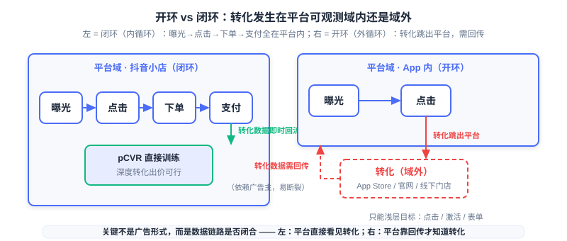

  📖
  ⏱️ ~45 min read
  🎯 Advanced

# 开环广告与闭环广告

> 📝 **Before You Continue:** 本章需先读 12.4（智能出价与预算控制）——oCPM 与深度转化出价的公式是本章「闭环能做什么」的地基；以及 12.5（预估偏差与校准）——归因与延迟反馈是本章「开环为什么难」的前置。本章从**数据可观测性**视角，为整个 Part 12 收束。

前五章讲完了一件事的四个侧面：怎么投放（12.1）、怎么计费（12.2）、怎么定价（12.3）、怎么出价（12.4）、怎么测量（12.5）。但所有这些精妙机制都踩着一个未被明说的假设——**平台能观察到多少转化数据**。设想同一个 oCPM 出价公式：$\text{eCPM} = 1000 \cdot \text{pCTR} \cdot \text{pCVR} \cdot \text{Bid}_{\text{CPA}}$，在抖音小店里，用户下单支付全在平台眼皮底下，pCVR 模型每天有海量转化标签可学；可一旦广告主投的是「App 下载」，用户跳出抖音、在 App Store 里点了下载按钮，抖音根本看不见那一下「转化」到底发生了没有。同一个公式，前一个场景里 pCVR 是实打实的观测，后一个场景里 pCVR 是半猜半等。

这一章讨论的，就是这条把广告世界一分为二的线： **转化行为是否发生在平台可观测的域内**。域内是 **闭环广告（Closed-loop Advertising）** ，域外是 **开环广告（Open-loop Advertising）**。你会看到这条线如何决定了一个平台能做多深的优化、能报多贵的价格、能兑现多大的承诺，也会看到隐私浪潮如何把这条线越推越偏向「平台自己闭环」。

读完本章，你将能够：

- 用「转化是否在平台可观测域内」这条标准，把任意一个广告场景归类为闭环或开环，并说清它影响的不是广告形式而是数据链路
- 解释闭环为何让平台能训练深度 pCVR 模型、做深度转化出价（付费/ROI/次留/7 日 ROI），以及「越投越准」的正向循环如何推高 eCPM
- 描述开环归因的完整流程（clickid 下发 → 回传 → ip+ua 兜底）与六种归因模型的分配规则，说清 MMP 为何能对抗重复计数
- 说明 ATT、SKAdNetwork、Android Privacy Sandbox 如何让确定性归因坍缩，以及开环场景下的混合归因策略
- 用一张对比表串联闭环 vs 开环在出价目标、数据可得性、延迟反馈、模型训练、归因确定性上的全面差异，完成 5 道分层练习题

---

## 12.6.0 广告的第二根轴：数据可观测性

12.1 的生态全景里，我们把广告按「投放模式的演进」切了三刀：直签、广告网络、程序化交易。那是一条关于 **交易结构** 的轴。现在引入第二条轴，与交易结构正交： **数据可观测性（Data Observability）**——广告主想要的转化，到底发生在平台的视线之内，还是视线之外。两根轴拼起来，才是一张完整的广告地图：你既要知道流量是怎么买来的（12.1），也要知道转化是怎么被看见的（本章）。

这条轴的两端有业界通用的名字。**闭环广告（Closed-loop Advertising）** ，也叫 **内循环** ：广告曝光、点击、下单、支付这一整条链路都在平台自己的生态里完成，数据一步也不离开平台。典型形态是抖音小店、快手小店的电商闭环，或 Facebook Shops 里的站内购买——用户在信息流里看到广告，点进去直接进商品页，下单支付都在 App 内。**开环广告（Open-loop Advertising）** ，也叫 **外循环** ：转化发生在平台之外，用户从广告点击出发，跳出平台去 App Store 下载、去品牌官网注册、去线下门店消费。平台的视线在这里断了——它能确认「用户点了广告」，却无法确认「用户到底下载了没有、买没买」。

这里有一个必须先钉死的认知： **开环 vs 闭环不是广告形式的区别，而是数据链路是否闭合的区别**。原生广告、信息流广告这些「形式」并不天然属于任何一端——同样是信息流里的一条广告，投「抖音小店商品」就是闭环，投「某款手游的 App 下载」就是开环。判断标准只有一个：用户完成转化时，平台能不能直接观测到。这条标准的威力在于它是个二分的开关：链路闭合，后链路的每一层转化（下单、支付、复购、次留）都是平台的训练数据；链路断开，平台手里就只剩「点击」这一个相对可靠的信号，再往后全靠广告主愿不愿意、能不能回传。

左图闭环链路里，四个环节都收在「平台域」的方框内，转化数据沿着实线箭头即时回流，模型与出价都能拿到完整标签。右图开环链路里，「曝光→点击」还在平台内，但「转化」这一步从方框跳了出去，指向 App Store、品牌官网、线下门店——平台与转化之间只剩一条需要广告主回传的虚线，且随时可能断裂。

### 🧠 Mental Model: 账本在谁手里

> 闭环广告像在自家店里收银：每一笔成交都记在自己的账本上，今天卖了什么、谁买的、买完又买了什么，翻账本就知道。开环广告像在别人的店里埋单：你只能看着顾客走进门（点击），至于他在里头买了没有、买了多少，得靠店主事后发微信告诉你（回传）。账本在谁手里，决定了你第二天能多聪明地进货。

这一节确立了本章的判据，接下来四节沿着这条轴的两端分别展开。12.6.1 讲闭环这条轴为什么是「更好的那一端」；12.6.2 与 12.6.3 讲开环那一端的两个老大难——归因与隐私；12.6.4 把两端的技术差异摆成一张全景表；12.6.5 回到 Part 12 的整体收束。

---

## 12.6.1 为什么闭环改变一切

闭环的价值不在「形式好看」，而在它补上了前五章所有机制最渴望的一样东西： **完整的转化标签**。回想 12.4 的结论——oCPM 的本质是平台用预测能力换定价权，平台敢接转化出价，前提是 pCVR 预估足够准。而 pCVR 要准，前提是有转化标签可学。闭环场景里，这个前提天然成立：曝光、点击、下单、支付每一步都发生在平台域内，平台能直接观测到「这个用户点了广告之后，到底有没有付费」。于是它才能训练真正的深度 pCVR 模型，才敢承诺 **深度转化出价**——付费单出价、付费 ROI 出价、激活-次留双出价、7 日 ROI 出价这些后链路目标。

这一层差别把出价目标劈成了两个世界。开环场景下，平台只能做 **浅层目标** ：点击、激活、表单提交、注册——因为再往后的转化它看不见。闭环场景下，平台能做 **深层目标** ：付费、ROI、次留、7 日 ROI——因为这些行为就发生在它的域内。12.4.1 的 oCPM 两阶段实践（先 CPC 冷启动积累转化、再切转化出价）在这里获得了一个新解读：冷启动要积累的「转化数据」，闭环平台靠自己的全链路观测就能拿到，开环平台却只能等广告主的稀疏回传慢慢攒。

更深一层，闭环触发了一个 **正向循环**。平台用付费用户的完整行为训练深度模型，模型越准，就越能把广告分发给「更可能付费」的人，投放效果越好，广告主越愿意加预算，平台又拿到更多转化数据，模型再进一步——「越投越准」的飞轮转起来了。这条飞轮的终点，是 12.2 风险谱系的最深端：平台甚至敢按「付费」这个最接近钱的目标来代管出价，把转化风险几乎全部揽到自己身上。源材料里头条/抖音的行业口径把这层价值说得很直白：以付费用户为训练数据的模型，稳定后通投效果优异、前端出价更高， **eCPM 普遍高出约 20%（行业口径）**——广告主买到更优质的流量，平台的千次展示收益也更高，这是一个双边都受益的结构。

这解释了超级 App（抖音、快手、淘宝）广告增长的底层逻辑。它们不满足于做「流量中转站」，而是拼命把交易搬到自己的生态里——建小店、开直播带货、做本地生活——因为每多圈住一段转化链路，就多一份别人拿不到的训练数据。当一家平台同时拥有「海量流量」和「完整转化观测」两样东西时，它的广告系统就能做别的平台做不了的深度优化，这构成了近乎不可逾越的护城河。12.1 的生态演进讲的是「谁能买到流量」，本章补上的是「谁能看见转化」——后者才是现代广告竞争里更稀缺的资源。

### 🧠 Mental Model: 越投越准的复利

> 闭环广告像一门有复利的生意：第一笔转化数据是本金，模型是利率，每轮投放都用「本金 + 利息」去赚下一轮更大的转化数据。开环广告则像按次结清、拿不到账本的生意——每次投放结束，你能确定的就是「点了多少下」，本金都攒不下来，谈何复利。数据可观测性，就是这个行业里真正的复利来源。

> **Analysis:** 闭环的「约 20% eCPM 溢价」要放在口径里读：它是第三方行业转述的头条/抖音口径，反映的是「深度模型 + 全链路数据」带来的整体收益提升，不同行业、不同类目会有波动。可把它当作趋势证据，而非放之四海皆准的常数。另需注意：闭环的深度转化出价并非没有门槛——深度后链路事件（如付费）转化稀疏、延迟更高，需要数据积累，这也是快手等平台对「付费 ROI 出价、7 日 ROI 出价」产品要求加白的原因（12.6.4 的对比表会再回到这一点）。

---

## 12.6.2 开环的归因难题

现在把镜头转向开环那一端。转化发生在域外，平台看不见，于是横亘在广告主和平台之间的问题是： **这一次转化，到底该算谁的功劳？** 这就是 **归因（Attribution）**——在广告行为链路里，识别「关键行为」究竟由哪个广告、哪个渠道带来。闭环场景下这个问题几乎不存在（转化就发生在平台内，链路唯一）；开环场景下它成了一个必须靠基础设施去解决的问题。

归因的前提是平台能拿到「转化确实发生了」这条消息，而这条消息要靠广告主 **回传**。完整流程分三步。第一步， **广告触点追踪** ：用户点击或看到广告时，媒体通过监测链接下发 **clickid**、广告 id、ip、ua 等参数，给这次曝光或点击盖一个独一无二的戳。第二步， **转化行为回传** ：用户完成激活、注册、下单等转化时，广告主的 App 或网站通过 SDK / API 把设备 ID、clickid、时间戳回传给媒体平台——「这个用户是我要的」。第三步， **兜底归因** ：拿不到设备 ID 时，退而用 ip + ua 做模糊匹配，精度随之下降。回传不仅是为了「算清账」，还是平台做相似人群探索（Look-alike）与放量判断的依据：媒体要知道哪些流量真的有效，才知道该把预算往哪加。

拿到「谁在哪一步转化」之后，还要决定「功劳怎么分」——这就是 **归因模型（Attribution Model）**。注意它的本质：归因不是客观事实的测量，而是一套 **分配规则** 的约定。同一条用户旅程，换一个模型，结论可能截然相反。常见的归因模型谱系如下表：

| 模型 | 功劳分配规则 | 适用场景 |
|------|-------------|---------|
| 最后点击（Last-click） | 100% 给转化前最后一次触点 | 简单直效，移动端默认 |
| 首次点击（First-click） | 100% 给第一次触点 | 度量漏斗顶部的发现/种草 |
| 线性（Linear） | 所有触点均分 | 认为每次互动价值相等 |
| 时间衰减（Time-decay） | 越接近转化的触点分得越多 | 短周期意图驱动 |
| 位置加权（Position-based） | 首尾触点多分、中间少分（U 型） | 兼顾发现与收口 |
| 数据驱动（Data-driven） | 算法基于观测到的贡献自动分配 | 高量级、多渠道 |

同一条「广告A曝光 → 广告B点击 → 广告C点击 → 转化下单」的旅程，五种模型给出五种答案：最后点击把功劳全给 C，首次点击全给 A，线性三人均分，时间衰减按「离转化远近」递减，位置加权把首尾（A、C）抬高、中间（B）压平。这不是谁对谁错，而是「你相信哪个环节更值钱」的立场选择——下面这个交互式模拟器让你亲手切换模型，步进看同一旅程的结论如何翻转。

<iframe src="../viz/part12-attribution.html?embed&vizId=part12-attribution" style="width:100%; height:520px; border:none; display:block;" loading="lazy"></iframe>

建议按剧本走：先在「设定」步看清这条三条触点的旅程，然后依次切到最后点击、首次点击、线性、时间衰减、位置加权，观察横向条形图里功劳的分配如何被同一段旅程「重新洗牌」。最后一步的总结会告诉你，为什么说「归因是一种分配规则，而非客观事实」。

归因还有一个「谁来算」的问题。**自归因（Self-attribution）** ：平台或媒体自己完成归因，宣称「这次安装是我带来的」——苹果搜索广告、部分头部平台采用此方式。**非自归因** ：广告主自行匹配用户与媒体信息，独立完成归因。问题在于，如果每家广告网络都「自己说自己赢」，同时跑多个网络时，各家报告的安装数加起来会远超真实安装量——**常达真实安装量的 200%～300%**。于是第三方中立仲裁者登场： **移动归因伙伴（Mobile Measurement Partner, MMP）** ，如 AppsFlyer、Adjust、Branch、Singular、Kochava。MMP 站在广告主与各广告网络之间，用统一的口径判定每一次转化该记给谁，把「老王卖瓜」的重复计数压下去。

### 🧠 Mental Model: 法官 vs 当事人

> 归因模型是「怎么判案」的规则（最后点击 = 只信最后一击；线性 = 人人有份），MMP 是「谁来当法官」的制度安排。让广告网络自己归因，等于让当事人自己写判决书——每一家都觉得自己才是促成转化的关键先生，加起来自然超过 100%。MMP 的存在价值，就是把判决权从当事人手里，转移到中立的第三方。

> **Analysis:** 归因模型的选择本质是一个业务假设，而不是一个可被「算出来」的最优解：最后点击适合决策链短、即点即买的场景；首次点击适合重品牌曝光、决策周期长的品类；数据驱动归因最「聪明」，但它需要大量可观测的转化数据才能学出可信的贡献——这恰恰在开环、尤其隐私受限的开环场景下最难满足。因此选归因模型，先问「我的转化链路多长、数据够不够」再问「哪个模型更准」。

---

## 12.6.3 隐私浪潮让开环更难

开环归因的地基是一样东西： **设备级的确定性标识**。平台靠 IDFA、GAID 这类广告标识符把「广告点击」和「后来的转化」绑到同一个用户身上。这条地基在 2021 年前后开始塌陷，第一块塌下来的是苹果的 **ATT（App Tracking Transparency，应用追踪透明度）** ：iOS 14.5 起，App 要访问 IDFA 必须弹窗获得用户授权。结果绝大多数用户拒绝——**opt-in 比例仅约 25%** ，设备级标识随之大面积坍缩。确定性归因赖以为生的「唯一用户 ID」没了，开环场景的测量精度应声下跌。

苹果随后给出的替代品是 **SKAdNetwork（SKAN）** ：一套由 Apple 自己校验安装、以聚合且延迟的方式回传转化数据的隐私保护归因框架。它的设计处处透着「反确定性」：数据是 **聚合** 的而非用户级；回传带有 **随机计时器延迟** ；粒度受限；还有 **群组匿名（Crowd Anonymity）**——安装量太小时回传更少信息，防止单个用户被反向定位。转化则通过 **conversion value** 上报，App 用 `updateConversionValue` 记录用户互动。**SKAN 4.0** 进一步把回传结构化：引入粗/细两种转化值，并设 **三次回传窗口（约 0–2 天、3–7 天、8–35 天）** ，允许随转化进程多次回传；层级 source identifier 用 4 位分层编码（前 2 位活动、第 3 位位置、第 4 位屏位等），随群组匿名级别升高返回更多位。注意：SKAN 不是 IDFA 的等价替代，它是「用确定性换隐私」的全新契约。

Android 侧也在走同一条路。**Android Privacy Sandbox** （2024+）是 Google 的无 cookie 归因方案： **Attribution Reporting API** 提供事件级与聚合两种归因报告，聚合报告自带 **差分隐私** 噪声；Topics API 则用于基于兴趣的广告。三家平台殊途同归：都把「你是谁」从归因信号里抹掉，只留下加了噪声的「有一群人做了某件事」。

这套隐私浪潮的实用后果是： **开环的确定性归因彻底坍缩，只能退而求其次地「混搭」**。iOS 上，广告主与 MMP 如今必须混合使用三层信号：SKAN 的聚合回传（隐私但模糊、延迟）+ 少数 opt-in 用户授权后的确定性数据（精确但样本小）+ 用这两者训练出的建模估计（把模糊补齐成可用的预测）。接受了更多的噪声，也就接受了「每一分钱花在哪」这件事从精确记账退化成带误差的估算。正是这种「看得越来越模糊」的处境，把整个行业推向两个方向：能闭环的，拼命把转化圈回自己的域内（闭环化）；不能闭环的，则转向第一方数据战略——不再依赖跨 App 追踪，而是经营自己与用户直接发生的、合法合规的数据关系。

### 🧠 Mental Model: 磨砂玻璃

> IDFA 时代的归因像透明玻璃：点广告的人、装 App 的人，看得一清二楚。ATT 之后换上了磨砂玻璃：你只能看见「有人进来了」，看不清是谁。SKAN 则是玻璃上再加一层百叶窗：每隔一阵子，Apple 掀开一条缝，给你看一个模糊的、加了噪声的、迟到的结果。广告主和 MMP 能做的，就是透过这三层遮挡，把「到底发生了什么」尽可能拼回来——拼得越像，越接近过去的确定性。

> **Analysis:** 隐私浪潮对开环的打击是结构性的，而非一次性的政策摩擦：ATT 砍掉的是「唯一标识」，SKAN 砍掉的是「及时性与颗粒度」，Privacy Sandbox 砍掉的是「无噪的事件级回传」。三者叠加意味着开环的测量精度有一个被制度锁死的上限——这不是靠更好的算法能完全补回来的。这也是为什么本章把「数据可观测性」拔高为与机制、出价、测量并列的第四根支柱：当测量信号本身被制度性削弱时，谁能用第一方数据重建观测，谁就掌握了下一个十年的主动权。

---

## 12.6.4 闭环 vs 开环技术差异全景

把前面三节的差异收拢成一张表，闭环与开环的分野就不再是抽象概念，而是一串可逐项核对的技术差异。

| 维度 | 闭环广告（内循环） | 开环广告（外循环） |
|------|------------------|------------------|
| 出价目标 | 深层：付费/ROI/次留/7 日 ROI | 浅层：点击/激活/表单/注册 |
| 数据可得性 | 全链路在平台域内，直接观测 | 转化在域外，依赖广告主回传 |
| 延迟反馈严重度 | 低：平台即时可见，标签窗口可控 | 高：回传延迟 + SKAN 随机延迟，标签晚到 |
| 模型训练 | 直接训练深度 pCVR / pDeepCVR | 靠稀疏回传标签，多为浅层模型 |
| 归因确定性 | 确定性：设备级、链路唯一 | 概率性/聚合：SKAN 群组匿名、ip+ua 兜底 |

这张表不是孤立的清单，它把前几章的伏笔逐条收了回来。**出价目标** 一栏，对应 12.4.1 的 oCPM 深度转化出价——闭环才有资格做「付费/ROI」这类后链路目标，开环只能停在「激活/表单」。**延迟反馈严重度** 一栏，对应 12.5.3 的延迟反馈与标签窗口：闭环里转化即时可见、标签窗口好定，开环里转化既要等广告主回传、又要等 SKAN 的随机延迟，标签成熟的时间被拉长且不可控——「未等标签成熟就校准」的风险在开环里被成倍放大。**模型训练** 与 **归因确定性** 两栏，则对应 12.5.2 的样本选择偏差与 12.5.3 的胜出偏差：开环模型能拿到的转化标签稀疏且有偏，训练空间与推理空间的裂缝比闭环宽得多。

阶梯左半是开环也能做的浅层目标——曝光、点击、激活、表单、注册，平台只需观察前链路行为即可出价；跨越那条「闭环才能做的深度目标」分界线后，是付费、ROI、次留、7 日 ROI 这些必须看见后链路转化的深层目标。阶梯逐级升高，对应平台对转化数据的观测要求也逐级加深，这正是「数据可观测性决定优化深度」的可视化表达。

这里要补一个容易被忽略的工程细节：深度目标的门槛不只是「能观测」，还有「观测够不够密」。付费、次留这类后链路事件天然稀疏、延迟高，oCPX 类产品通常要求累计转化数达到门槛才能开深度目标——这也是 12.4.1 两阶段冷启动思想在后链路目标上的复现。闭环只是把「攒够数据」这件事变得可行且快，并不能让稀疏事件变稠密。

---

## 12.6.5 Part 12 最终收束：闭环不是目的，可观测性才是

回到本章开头那句话，现在可以把它说完整了。闭环广告之所以「改变一切」，不是因为「闭环」这个词本身有什么魔力，而是因为它意味着 **可观测性（Observability）** ：谁能拿到更完整的转化数据，谁就能把优化做得更深。闭环只是实现可观测性的一种方式——把转化圈进自己的域内。开环场景里，广告主也可以用高质量的回传、MMP 的中立仲裁、第一方数据战略，部分地重建这种可观测性。所以别把「闭环」当目的去追逐，要追逐的是它背后的东西： **数据链路的完整度**。

于是可以给整个 Part 12 写下最终的一条乘法总结，在 12.5 的版本上补上最后一项：

$$\text{广告系统} = \text{机制设计（12.3）} \times \text{出价策略（12.4）} \times \text{测量系统（12.5）} \times \text{数据可观测性（本章）}$$

机制决定「规则怎么定」，出价决定「预测怎么花」，测量决定「预测准不准」，而数据可观测性决定「预测有没有料可学」。前三者的一切精妙，都建立在一个更底层的前提上——平台手上握着多少真实转化样本。12.1 的生态全景讲透了「流量怎么流动」，8.3 的 EGA 讲透了「机制怎么被学进模型」，而本章补上了它们共同依赖的底座：没有可观测的转化，EGM 也好、oCPM 也好、ESMM 也好，都只是在一份残缺的账本上做算术。

最后的趋势判断，落在三条并行的迁移上。其一， **超级 App 闭环化** ：抖音、快手、淘宝把交易、直播、本地生活圈进生态，把「流量 + 观测」的双重护城河越挖越深。其二， **半闭环** 的折中：广告主不全量回传，只回传部分事件（如只回传「激活」而不回传「付费」），平台拿一份不完整的标签做部分优化——这是开环与闭环之间的灰色地带，也是当前多数 App 下载广告的真实状态。其三， **隐私政策推动第一方数据战略** ：当跨 App 追踪被制度性收紧，企业与平台都转向经营自己与用户直接发生的数据关系。三条迁移指向同一个结论： **未来广告竞争的胜负手，正在从「谁能买到流量」转向「谁能看见转化」**——而看懂这条线，你就读懂了 Part 12 的最后一页。

---

## ⚠️ Common Mistakes in 12.6

| # | Mistake | Example | Why It's Wrong | Fix |
|---|---------|---------|---------------|-----|
| 1 | 以为开环/闭环是广告形式而非数据链路 | 「原生广告就是闭环广告」 | 同样是信息流原生广告，投站内小店是闭环、投 App 下载是开环；判断标准只有「转化是否在平台可观测域内」 | 用「转化发生的位置」这条开关来判断，不看广告形式 |
| 2 | 把归因当客观事实而非分配规则 | 「数据驱动归因算出了真实的功劳」 | 归因模型是「怎么分功劳」的约定；换一个模型，同一条旅程结论截然不同，不存在唯一「真相」 | 把归因模型当业务假设来选，先问链路长度与数据量，再选分配规则 |
| 3 | 忽视回传污染与归因作弊 | 「广告主回传什么就信什么」 | 自归因下各网络重复计数可达真实量 200%～300%；回传本身可能被刷、被污染 | 引入 MMP 中立仲裁，统一口径、校验回传真实性 |
| 4 | 以为 SKAN 是 IDFA 的等价替代 | 「SKAN 接上就能恢复原来的归因精度」 | SKAN 是聚合、随机延迟、群组匿名的隐私框架，用确定性换了隐私，粒度与及时性都回不去了 | 理解 SKAN 的三次回传窗口与群组匿名，按「混合 SKAN + 授权确定性 + 建模」三层重建 |
| 5 | 在开环场景直接套用闭环的深度出价 | 「App 下载广告直接开付费 ROI 出价」 | 付费在域外，平台看不到也收不到足够回传，pDeepCVR 无从训练 | 开环先用浅层目标（激活/表单），深度目标需广告主持续回传 + 数据积累门槛 |

---

## 本章小结

### 📌 Key Takeaways

| Concept | Key Points | Why It Matters |
|---------|-----------|----------------|
| 数据可观测性 | 开环 vs 闭环 = 转化是否发生在平台可观测域内；是数据链路差异，不是广告形式差异 | 广告世界的第二根轴，决定平台能做多深的优化 |
| 闭环的价值 | 直接观测转化 → 深度 pCVR 模型 → 深度转化出价（付费/ROI/次留/7 日 ROI）→「越投越准」飞轮 | 行业口径 eCPM 普遍高出约 20%，超级 App 护城河的底层逻辑 |
| 开环的归因 | clickid 下发 → 转化回传 → ip+ua 兜底；六种归因模型是分配规则而非客观事实 | 同一条旅程在不同模型下结论完全不同，选模型先问链路与数据 |
| MMP 的价值 | 中立第三方仲裁，对抗自归因重复计数 | 多网络并跑时各平台报告安装数常达真实量 200%～300% |
| 隐私浪潮 | ATT（opt-in 约 25%）→ SKAN（聚合/随机延迟/群组匿名，SKAN 4.0 三次回传 0-2/3-7/8-35 天）→ Privacy Sandbox | 确定性归因坍缩，只能混合 SKAN + 授权确定性 + 建模估计 |
| Part 12 收束 | 广告系统 = 机制（12.3）× 出价（12.4）× 测量（12.5）× 数据可观测性（本章） | 竞争胜负手从「谁能买到流量」转向「谁能看见转化」 |

### ❓ FAQ

**Q1: 闭环广告一定比开环广告好吗？**
> A: 对平台而言，闭环的数据完整度与优化深度通常更高，但它也有代价：广告主把转化圈进平台，等于把交易数据、客户关系也交给了平台，私域掌控力下降。对广告主而言，开环保留了自由度和第一方数据，代价是测量精度差、深度优化做不了。因此「闭环 vs 开环」不是绝对优劣，而是数据主权与优化深度之间的权衡——半闭环（回传部分事件）正是这条权衡线上的折中态。

**Q2: 归因模型选哪个最好？数据驱动归因是不是永远最优？**
> A: 数据驱动归因在「数据充足」时确实最能反映真实贡献，但它需要大量可观测的转化样本去学——开环且隐私受限的场景下往往喂不饱它。决策链短、即点即买选最后点击；重品牌曝光、周期长选首次点击或位置加权；意图短促选时间衰减。没有放之四海皆准的最优，只有匹配「链路长度 + 数据量」的最合适。

**Q3: SKAN 的三次回传窗口意味着什么？广告主该怎么用？**
> A: SKAN 4.0 把回传拆成约 0–2 天、3–7 天、8–35 天三个窗口，意味着转化数据不是一次性到达，而是随转化进程分波次、且带随机延迟地回流。广告主的正确姿势不是「等一份完整报告」，而是把 SKAN 的聚合回传、opt-in 用户的确定性数据、以及基于两者训练的建模估计三层信号组合使用，接受「模糊但合规」的测量，而不是追求恢复 IDFA 时代的精确。

### 🔗 前后关联

- **12.1** （计算广告全景与生态）——本章引入「数据可观测性」这根与「交易结构」正交的第二根轴；12.1 讲流量怎么流动，本章讲转化怎么被看见，二者拼成完整的广告地图。
- **12.4** （智能出价与预算控制）——闭环之所以能做出价栈最深的那层（oCPM/深度转化出价），正是因为它补上了 12.4.1 公式里 pCVR 的训练数据前提；两阶段冷启动在深度目标上再次复现。
- **12.5** （预估偏差与校准）——开环的延迟反馈（回传 + SKAN 随机延迟）放大 12.5.3 的标签晚到问题；开环的稀疏回传标签也加深 12.5.2 的训练/推理空间裂缝。
- **8.3** （端到端生成式广告 EGA）——EGA 把分配与支付端到端学进模型，但同样逃不开「有没有转化标签可学」这一底座；没有可观测转化，EGA 学到的只是一份残缺账本上的算术。
- **Part 3** （排序与预估模型）——pCVR/pDeepCVR 模型结构同源，但它们的「能不能训练」由本章的数据可观测性决定；推荐模型进广告场景，先问数据链路是否闭合。

---

## Practice Problems

Work through all problems in order — they get progressively harder. Each has a complete solution you can reveal after trying it yourself.

---

**Problem 12.6.1 — 判断开环还是闭环** 🟢 Easy

判断以下场景属于闭环广告、开环广告还是半闭环，并说明判断依据（看「转化是否发生在平台可观测域内」，而不是看广告形式）：
(a) 抖音信息流里的一条抖音小店商品广告，用户点击后站内下单支付。
(b) 同一条抖音信息流广告，但落地是引导用户去 App Store 下载某款手游。
(c) 该手游广告主只向平台回传「激活」事件，不回传「付费」事件。
(d) Facebook feed 里的品牌广告，点击后跳转到品牌官网完成注册。

💡 Solution (click to reveal)

**Approach:** 用「转化发生的位置 + 平台能看到多少」这条开关逐项判断。

- (a) **闭环** ：下单、支付都在抖音站内（抖音小店），平台直接观测全链路转化。
- (b) **开环** ：转化（下载）发生在 App Store，跳出平台域，抖音看不见下载事件。
- (c) **半闭环** ：转化仍在域外，但广告主回传了部分事件（激活），平台能拿到不完整的标签做部分优化——这是开环与闭环之间的灰色地带。
- (d) **开环** ：转化（注册）发生在品牌官网，Facebook 只能确认点击，注册事件需广告主回传或 MMP 归因。

**Key points:**
- 判断标准唯一：转化是否在平台可观测域内——与广告形式（信息流、原生）无关。
- 半闭环 = 域外转化 + 部分回传，是当前 App 下载广告的常态。

---

**Problem 12.6.2 — 手算归因模型分配** 🟡 Medium

一条用户旅程包含三个触点，按时间顺序：广告 A 曝光（第 0 天）→ 广告 B 点击（第 1 天）→ 广告 C 点击（第 3 天）→ 第 4 天转化下单。
(a) 分别用 **最后点击** 与 **首次点击** 模型，写出 A、B、C 各自的功劳分配。
(b) 用 **线性** 模型写出分配。
(c) 用 **位置加权** （U 型：首尾各 40%、中间均分）写出分配。

💡 Solution (click to reveal)

**Approach:** 按各模型的分配规则逐一映射到三个触点。

- (a) 最后点击：转化前最后一次触点是 **C**，故 A = 0%、B = 0%、**C = 100%**。首次点击：第一次触点是 **A**，故 **A = 100%**、B = 0%、C = 0%。
- (b) 线性：三人均分， **A = B = C = 33.3%**。
- (c) 位置加权（U 型）：首触点 A = 40%、尾触点 C = 40%、中间 B = 20%，合计 100%。

**Key points:**
- 同一旅程三种模型给出三种答案：C 是「收口者」、A 是「种草者」、B 是「路人」——归因立场决定答案。
- 最后点击与首次点击是「全有或全无」的极端规则，线性与位置加权是「平滑分配」规则。

---

**Problem 12.6.3 — 时间衰减归因的权重** 🟡 Medium

同 12.6.2 的旅程（A 曝光第 0 天 → B 点击第 1 天 → C 点击第 3 天 → 第 4 天转化）。时间衰减模型按「离转化越近权重越大」分配，设每次往回退一个触点，权重减半：C 的基础权重为 1，B 为 1/2，A 为 1/4。
(a) 计算归一化后 A、B、C 各自的功劳百分比。
(b) 对比线性模型，说明时间衰减在「短周期意图驱动」场景下为何更合理。
(c) 若 B 和 C 是同一天发生的两次点击（B 第 3 天、C 第 3 天），时间衰减权重该如何调整？这暴露了该模型什么局限？

💡 Solution (click to reveal)

**Approach:** 权重先按规则赋值，再归一化到百分比；再讨论时间信息与模型局限。

- (a) 权重总和 $= 1 + \frac12 + \frac14 = 1.75$。归一化：C $= 1/1.75 \approx \mathbf{57.1\%}$，B $= 0.5/1.75 \approx \mathbf{28.6\%}$，A $= 0.25/1.75 \approx \mathbf{14.3\%}$。
- (b) 线性模型无视时间，把「第 0 天的曝光」和「第 3 天、转化前一天的点击」一视同仁。短周期意图驱动（如「最近想买」）下，靠近转化的触点才是真正的临门一脚，时间衰减把功劳向 C 倾斜，更贴合「越近越关键」的直觉。
- (c) B、C 同一天，则它们「离转化等距」，权重应相等：C = B = 1，A = 1/2（若仍按「往回退一个触点减半」）。这暴露了时间衰减的局限：它本质是「按触点序号的衰减」，而非「按真实时间间隔的衰减」——它只用了顺序信息，没用量化的时间差。更精细的实现应直接按时间差（如指数衰减 $w = \lambda^{T-t}$）赋值。

**Key points:**
- 归因权重是归一化的：先赋相对权重，再除以总和。
- 时间衰减用「顺序」而非「时间差」，是它的简化所在；需要真实时间信息时应改用指数时间衰减。

---

**Problem 12.6.4 — SKAN 归因坍缩的量化分析** 🔴 Hard

某 iOS 手游广告主投放 10,000 次安装。ATT 落地前，确定性归因（IDFA）可覆盖全部安装；ATT 落地后，opt-in 仅约 25%，SKAN 聚合回传覆盖其余部分，但 SKAN 回传受群组匿名与随机延迟影响，仅约 60% 的安装能被 SKAN 及时、可靠地归因到具体广告系列。
(a) 计算确定性覆盖、SKAN 覆盖、以及「完全无法归因」三部分安装数。
(b) 说明这三部分各自对应的测量方式（授权确定性 / 聚合回传 / 建模估计），以及建模估计在其中扮演的角色。
(c) 为什么说「SKAN 不是 IDFA 的等价替代」？从及时性与颗粒度两个维度解释。

💡 Solution (click to reveal)

**Approach:** 按比例切分三部分，再把每部分映射到三层混合归因策略。

- (a) 确定性覆盖 = $10000 \times 25\% = \mathbf{2500}$ 次（opt-in 用户，有 IDFA）。SKAN 覆盖 = 其余 7500 次中的 60%，即 $7500 \times 60\% = \mathbf{4500}$ 次。无法归因 = $10000 - 2500 - 4500 = \mathbf{3000}$ 次（约 30% 的安装彻底丢失在噪声里）。
- (b) 2500 次用 **授权后的确定性数据** （最精确、样本小）；4500 次用 **SKAN 聚合回传** （模糊、延迟、带群组匿名）；3000 次无直接信号，只能靠 **建模估计**——用前两者的已知样本训练模型，去外推「那 3000 次大概是什么构成」。建模估计的价值正是把「完全看不见」的缺口，用可观测部分的规律补齐。
- (c) 及时性：SKAN 回传带随机计时器延迟、且按三次窗口（0–2/3–7/8–35 天）分批到达，转化信号要等几天到几周才回齐，远不如 IDFA 的准实时。颗粒度：SKAN 是聚合非用户级、群组匿名，安装量低时信息更少，永远无法定位到「具体是哪个用户、哪条广告」这一 IDFA 级别的确定性。所以它是「用确定性换隐私」的新契约，而非等价替代。

**Key points:**
- 隐私浪潮后，任何单一信号都不够用，三层混合（SKAN + 授权确定性 + 建模）是标准姿势。
- 建模估计填补的是「结构性缺口」，不是锦上添花——约 30% 的安装靠它才能「拼回」视野。

---

**🏆 Problem 12.6.5 — 设计一个闭环深度转化出价方案**

你是某超级 App 广告平台的算法工程师，平台已建成完整电商闭环（站内曝光→点击→下单→支付全链路可观测）。请为一个「站内小店商品推广」广告主设计一套深度转化出价方案，要求：
(a) 明确出价目标选型：在「付费单出价 / 付费 ROI 出价 / 激活-次留双出价 / 7 日 ROI 出价」中选一个，说明理由与适用广告主画像。
(b) 写出深度出价的核心公式（基于 12.4 的 oCPM 推广到深度目标），并说明 pDeepCVR 与普通 pCVR 的关系。
(c) 给出冷启动与数据积累的过渡方案，以及「累计转化数门槛」如何设定。
(d) 讨论该方案相对「开环 App 下载广告」在数据、出价深度、延迟反馈三个维度的优势。

💡 Solution (click to reveal)

**Approach:** 把 12.4 的 oCPM 出价栈推广到闭环的后链路目标，再用 12.5 的延迟反馈与冷启动纪律约束方案。

**(a) 选型** ：若广告主是「长线付费/LTV」导向的商家，选 **付费 ROI 出价** 或 **7 日 ROI 出价**——它直接把「每花一元广告费带来的付费额」当优化目标，对齐广告主的终极商业价值。若广告主既想要新客量又想要留存质量，选 **激活-次留双出价** （平台同时预估 pCTR、pCVR、pDeepCVR，兼顾浅度成本与深度留存）。本题以「付费 ROI 出价」为例展开。

**(b) 核心公式** ：深度出价是 12.4.1 oCPM 公式的后链路推广——把「点击→付费」这一整段深度转化概率代入：

$$\text{eCPM} = 1000 \cdot \text{pCTR} \cdot \text{pDeepCVR} \cdot \text{Value}_{\text{per-conversion}}$$

其中 $\text{pDeepCVR}$ 是「点击 → 付费」的深度转化概率，$\text{Value}_{\text{per-conversion}}$ 是广告主申报的每次付费的目标价值（付费 ROI 目标下即「目标 ROI × 付费额」折算出的价值锚）。它与普通 pCVR 的关系：普通 pCVR 是「点击 → 下单」，pDeepCVR 是「点击 → 付费」或「点击 → 次留」——后者在转化漏斗的更深处，样本更稀疏、延迟更高，但离「钱」更近。闭环的价值正在于平台能直接观测「付费」这个深度标签，pDeepCVR 得以直接训练。

**(c) 冷启动与门槛** ：付费事件稀疏且延迟高，新广告没有深度转化统计，pDeepCVR 对它毫无把握。过渡方案沿用 12.4.1 的两阶段：先用浅层目标（如下单出价或 CPC）投放，积累付费样本；待累计付费转化数跨过门槛（例如 30～50 次付费转化，具体由平台的置信度策略定）后，再切换到付费 ROI 出价。门槛的意义是保证 pDeepCVR 模型对这批广告有最小可用的统计置信——过早切换等于让平台闭眼押注后链路。

**(d) 相对开环的优势** ： **数据**——闭环直接观测付费，开环靠广告主回传、且隐私限制下回传稀疏； **出价深度**——闭环能做付费/ROI/次留/7 日 ROI 这些后链路目标，开环只能停在激活/表单； **延迟反馈**——闭环付费即时可见、标签窗口可控，开环要等回传 + SKAN 随机延迟，标签成熟时间被拉长且不可控。三者叠加，正是 12.6.1「越投越准」飞轮得以转起来的原因。

**Key points:**
- 深度出价 = oCPM 出价栈向后链路目标（付费/ROI/次留）的推广，核心是平台能否直接观测 pDeepCVR 的标签。
- 闭环不是「免费解锁深度目标」，它只让「攒够深度数据」变得可行；稀疏事件仍需冷启动与门槛约束。

