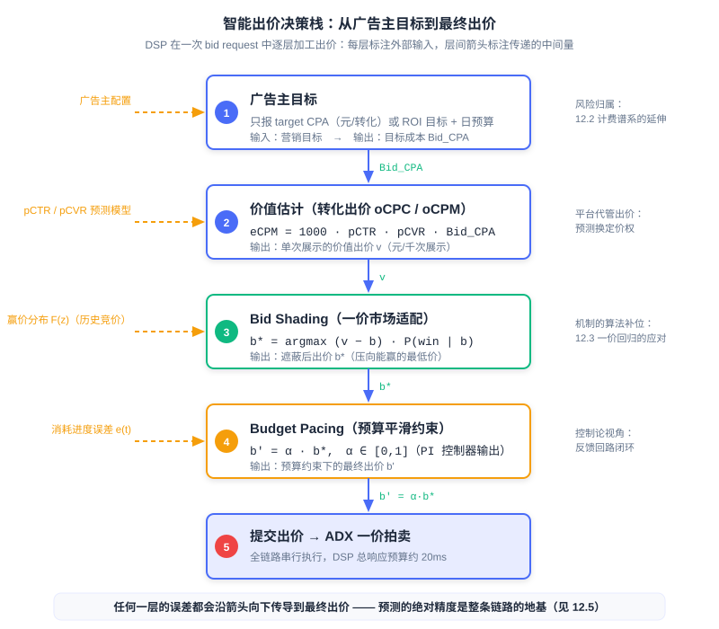
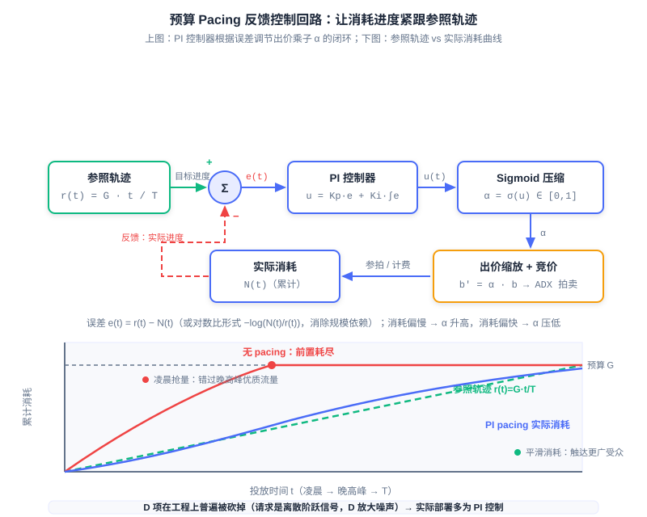

  📖
  ⏱️ ~50 min read
  🎯 Advanced

# 智能出价与预算控制

> 📝 **Before You Continue:** 本章需先读 12.2（eCPM 与计费模式）——出价公式的口径建立在 eCPM 之上；以及 12.3（竞价机制）——bid shading 的问题意识直接来自一价拍卖的回归。本章反复出现的「预测精度」伏笔，将在 12.5（预估偏差与校准）中正面展开。

12.3 的结尾留下了一个悬念：一价拍卖回归后，机制不再替广告主「只付第二价」，出价策略随之成为 DSP 的核心竞争力。但出价远不只是「在一价下压价」这一个动作——它是一条完整的决策流水线：广告主说想要什么（目标），模型估计流量值多少（价值），预算决定今天能花多少（约束），机制决定出价该怎么报（适配）。这条流水线上任何一环算错，最后递给交易所的数字就是错的。

本章把这条流水线逐层拆开。我们先看广告主的目标如何变成一次展示的出价（oCPC/oCPM 转化出价），再看预算如何在一天之内被平滑地花完（Budget Pacing），然后处理一价市场下「出价该压多低」的统计问题（Bid Shading），最后把所有环节串成一次 bid request 的完整决策链。你会看到：这一章的每一个模块，本质上都是「预测」与「控制」在钱上的应用。

读完本章，你将能够：

- 写出转化出价的核心公式 $\text{eCPM} = 1000 \cdot \text{pCTR} \cdot \text{pCVR} \cdot \text{Bid}_{\text{CPA}}$，并解释 oCPM 如何把转化风险从广告主转移到平台
- 说明预算平滑消耗的动机与参照轨迹 $r(t) = G \cdot t / T$，对比概率节流与出价缩放两种实现
- 用 PID/PI 反馈控制的视角解释 pacing 乘子 $\alpha$ 的整定逻辑，说明工程上为何普遍砍掉 D 项
- 推导一价拍卖下期望 surplus 最大化 $\mathbb{E}[S] = (v-b) \cdot P(\text{win} \mid b)$ 的逻辑，描述 Verizon DDN 如何用 log-normal 分布与黄金分割搜索毫秒级求出最优出价
- 画出一次 bid request 从定向到提交出价的完整决策链，指出误差如何在链路中传导，完成 5 道分层练习题

---

## 12.4.0 从手工出价到智能出价

我们先回顾出价这件工作的历史分工。在 GFP 时代，出价完全掌握在广告主（或其出价代理）手里：你在 12.3.1 见过那场永不收敛的追逐战——出价是最优反应函数的迭代，广告主七乘二十四小时盯盘也追不上市场。即便到了 GSP 时代，「报一个合适的 CPC 出价」仍然要求广告主回答一个他们其实答不好的问题：这次点击值多少钱？答案取决于点击率、转化率、客单价——这些数据大部分握在平台手里。信息不对称决定了出价权的归属： **谁更懂流量，谁就该出价**。

于是出价栈在平台侧逐层生长，最终形成现代 DSP 的标准形态。整条链路可以概括为四个环节的接力： **广告主目标** （target CPA / ROI）→ **价值估计** （pCTR × pCVR × targetCPA 折算成单次展示的价值）→ **预算约束** （pacing 控制消耗节奏）→ **市场机制适配** （bid shading 适配一价市场）。注意这四个环节回答的是四个不同的问题：想要什么、值多少、花多快、怎么报——它们彼此耦合，却由不同的模块、不同的算法各自负责。

图中每一层只消费上层的输出与自己的外部输入：价值估计层拿广告主的 targetCPA 与 pCTR/pCVR 预测相乘，bid shading 层拿价值出价与赢价分布相博弈，pacing 层拿遮蔽后的出价乘上一个预算乘子。分层的意义在于工程隔离——每个模块可以独立迭代、独立监控——但代价是误差也会沿箭头逐层向下传导，这一点我们在 12.4.4 再正面讨论。

### 🧠 Mental Model: 从「自己开车」到「导航代驾」

> 手工出价像自己开车：广告主手握方向盘（出价），凭经验（行业平均 CPC）猜路况（流量质量），堵车（竞争激烈）就猛踩油门（抬价）。智能出价是代驾加导航：广告主只报目的地（target CPA），平台的模型负责认路（pCTR/pCVR 预估）、控速（pacing）、选匝道（bid shading）。你不需要会开车，但你最好把目的地说清楚——报错 target CPA，代驾会忠实地把你送错地方。

本章接下来的四节就按这条栈逐层展开：12.4.1 讲目标如何变成价值（前两层），12.4.2 讲预算约束（第四层），12.4.3 讲机制适配（第三层），12.4.4 把它们重新拧成一个整体。

---

## 12.4.1 转化出价 oCPC/oCPM：平台用预测能力换定价权

出价栈的第一层飞跃，是把广告主的输入从「每次点击出多少钱」升级为「每个转化愿意花多少钱」。**转化出价（oCPC / oCPM，optimized CPC/CPM）** 的出价公式是 12.2 eCPM 口径的自然延伸：既然按转化出价，就把转化成本折算回千次展示收益——

$$\text{eCPM} = 1000 \cdot \text{pCTR} \cdot \text{pCVR} \cdot \text{Bid}_{\text{CPA}}$$

其中 $\text{Bid}_{\text{CPA}}$（实践中即 target CPA）是广告主申报的每次转化目标成本，pCTR 与 pCVR 由平台的预测模型给出。公式的读法很直白：一千次展示 × 每次展示的点击概率 × 每次点击的转化概率 × 每次转化的价值，等于这千次展示的期望收益。广告主只报一个数（target CPA）， **每一次展示的具体出价由平台代管**——这就是 12.3.6 预告的智能出价（Smart Bidding）的核心形态。

这一步棋要放在 12.2 的风险归属谱系里看才显出分量。12.2.1 的结论是：计费单位离转化越近，平台承担的风险越大——CPM 下风险全在广告主，CPC 下平台用 CTR 预测管理自己那份风险，CPA/CPS 下平台把决策与风险全部揽下。oCPM 正是这条链条的终点： **平台接管了转化风险，而接管的前提是 pCVR 预估足够准**。预测准，平台敢承诺「按转化成本达标」；预测不准，平台就会为高估的流量付真金白银。延续 12.2 的说法：这是平台用预测能力换定价权——预测越准，能代管的出价层越深，从广告主手里换来的控制权越大。

工业实践为此设计了两阶段投放流程。冷启动阶段沿用普通 CPC 出价：新广告没有转化统计，pCVR 模型对它毫无把握，此时贸然按转化出价等于闭眼押注；CPC 出价先帮广告积累转化数据。待转化样本足够、模型置信后，再切换到转化出价。你会发现这正是 12.2.4 冷启动 back-off 与 E&E 思想在出价层的落地——先用便宜的探索积累统计量，置信之后再交给最优策略。

> **Analysis:** 转化出价把预测的绝对精度推到了计费环节。在 oCPM 下，pCTR × pCVR 不仅决定排序，还直接决定平台向广告主收多少钱（按展示计费、按转化目标优化）：系统性高估 pCVR，平台收不到目标成本、广告主超支；系统性低估，广告主的流量被压缩、平台收入受损。Alibaba 的系统化描述（Gai et al., SIGIR 2022）明确指出：预估不准会同时伤害用户体验、广告主营销目标与平台收入三方——这不是排序优劣问题，而是「算错钱」的问题。

### 深度转化与 LTV 出价：把「转化」的定义再往后推

target CPA 优化的「转化」到哪儿为止,决定了出价栈能替广告主管理多深的漏斗。**深度转化出价（deep conversion bidding）** 把优化目标从「一次激活」推向「激活后的关键行为」:游戏行业的次日留存/7 日付费、电商的复购、金融的开户绑卡。机制上它没有新公式——仍是 $\text{eCPM} = 1000 \cdot \text{pCTR} \cdot \text{pCVR}_{\text{deep}} \cdot \text{Bid}_{\text{deep}}$,只是把 pCVR 换成了 **深度转化率预估**。真正的难点在数据侧:深度行为的发生滞后激活数天,样本的标签成熟要等延迟窗口走完,这就把 12.5 的 **延迟反馈（delayed feedback）** 问题从「校准」推到了「出价」——平台必须在不完整的标签流上实时出价,同时用延迟建模（如重要性采样、多任务存活式结构）修正有偏样本。

再往前一步是 **LTV 出价**:广告主申报的不是「每次转化值多少钱」而是「一个用户生命周期值多少钱」。对于长留存、高复购的行业(游戏、订阅制产品),激活当次的 CPA 口径严重低估用户价值——愿意为高 LTV 用户出高价的广告主,在 CPA 市场上反而抢不到量。LTV 出价把 $\text{Bid}_{\text{CPA}}$ 替换为 $\widehat{\text{LTV}}(u)$ 的预估,难点是 LTV 的分布重尾而样本稀少:头部用户贡献了大部分价值,均值回归的预估会系统性低估高价值人群、高估低价值人群。工业上的通用配方是把 LTV 拆成「留存概率 × 每期价值」两段分别建模,再相乘还原;预估的零膨胀与重尾,与 12.5 校准一章的问题是同一族。

> 💡 **Key Insight:** 从 CPC 到 CPA 到深度转化再到 LTV,出价栈的演进只有一条主线:**把广告主商业价值中「可被机器预估的部分」不断前移到竞价公式里**。每前移一步,平台就多接管一层广告主的决策——也多承担一层预估误差的风险。深度转化与 LTV 出价是这条主线的当前边界,再往后(如 ROI 出价、利润出价)受限于平台对广告主后端数据的可见性,即 12.6 开闭环二分法的约束。

---

## 12.4.2 预算控制（Budget Pacing）：让钱花得又慢又准

有了价值出价，还差一个约束：预算。广告主通常设日预算，而流量在一天内分布极不均匀——晚高峰的流量无论数量还是质量都远超凌晨。如果对预算放任不管会发生什么？出价高的广告会在凌晨到早盘就把预算烧光，因为那时它对每一次展示都出最高价；等晚高峰的高转化流量到来，广告已经「下班」了。**预算平滑消耗（Budget Pacing）** 要解决的就是这个问题：把预算在投放期内均匀花完——既避免前置消耗错过晚高峰优质流量，也让广告持续在线、触达更广受众（Xu et al., KDD 2015）。过慢同样有害：花不完预算等于放弃了本可获得的流量与转化。

平滑消耗需要一个「什么算均匀」的数学表达，即 **参照轨迹（Reference Trajectory）** ：

$$r(t) = G \cdot \frac{t}{T}$$

其中 $G$ 是目标总消耗（或展示量），$T$ 是投放期长。它就是一条从原点到 $(T, G)$ 的直线，含义是「消耗进度与时间进度同步」：上午十点过了全天的 40%，就应该花掉预算的 40%。实际消耗曲线 $N(t)$ 与 $r(t)$ 的偏离就是控制误差，pacing 系统的任务是让 $N(t)$ 紧紧咬住 $r(t)$。

实现平滑有两种工程路线。**概率节流（Probabilistic Throttling）** ：对每次竞价请求以概率 $\alpha$ 决定参与、以 $1-\alpha$ 直接放弃——LinkedIn 的预算 pacing 系统（Agarwal et al., KDD 2014）采用此路线；它实现简单，但「放弃」是 0/1 的硬门控，白白丢掉了「调低出价继续参与」的空间。**出价缩放（Bid Scaling）** ：用 **pacing 乘子** $\alpha \in [0,1]$ 缩放出价，$b' = \alpha \cdot b$——保留参与度、牺牲单次竞争力；预算紧张时压低 $\alpha$，同一笔预算能撑更久，还能自然避开「出价虚高白付钱」的展示。两种路线工业界都有部署，也可以只对「是否进入竞价」做门控；出价缩放与出价逻辑耦合更深，但也正是它让 pacing 成为出价栈的一层而非外挂的限速器。

两种路线殊途同归的地方是控制结构：这是一个标准的反馈控制回路。误差 $e(t)$（参照轨迹与实际消耗之差）喂给控制器，控制器输出操作量，操作量作用于出价（或参与概率），实际消耗再被观测回来与参照比较。工业界普遍采用 **PID 控制器（Proportional–Integral–Derivative Controller）** 的框架来整定，三项各有清晰的语义：

- **P（比例）** ：即时响应——误差一出现立刻按比例调整，但纯 P 控制会留下稳态偏差；
- **I（积分）** ：消除稳态偏差——误差累积多久就纠正多久，预算落后越多补得越狠；
- **D（微分）** ：超前抑制——误差的变化率提供「即将超支/超速」的预警。

工程上普遍砍掉 D 项、只用 **PI 控制** ：广告展示请求是离散的阶跃信号，D 项对阶跃与噪声极度敏感，会把放大后的噪声注入出价。PI 的输出再经 sigmoid 压缩到 $[0,1]$，恰好落在 pacing 乘子（或参与概率）的取值范围。更进一步，误差可取对数比形式 $e(t) = -\log(N(t)/r(t))$，使不同规模的投放计划可以共用同一套控制增益——一个日预算百元的小计划与日预算百万的大计划，用同样的参数都能稳定收敛。

### 🧠 Mental Model: 定速巡航

> 预算 pacing 就是广告投放的定速巡航：设定目标速度（参照轨迹），系统持续对比当前车速（实际消耗）与目标，脚下自动补油门（α 升高）或收油门（α 压低）。P 是「看到掉速就补一脚」，I 是「一直慢就一直补」，D 是「预感到要超速提前松油」——但在颠簸路面（离散的竞价请求）上，D 这只脚只会把颠簸踩成抽搐，所以工程师干脆把它卸了。

这条技术路线上有一串值得记住的工业坐标。Yahoo 的 Smart Pacing（Xu et al., KDD 2015）为每个投放计划学习投放节奏，离线（历史数据初始化）与在线（实时更新）结合，在真实 DSP 系统部署并实验验证了平滑性与效果目标的同步改善；更早的 Lee et al.（ADKDD 2013）研究了 RTB 下平滑预算交付的出价优化。Zhang et al.（WSDM 2016）率先把 PID 控制引入 RTB 出价；Verizon Media 的 DSP 采用积分控制加前馈补偿；Twitter/X 把 pacing 做成独立服务、内部跑 PID 控制；Roku 以五分钟为周期调节「挑剔度」；Adobe 与 Google 则以专利形式保护各自的 PID 出价引擎。控制论在这件事上完成了一次跨行业的静默胜利——大家语言不同（节奏、乘子、挑剔度），内核都是同一个反馈回路。

> **Analysis:** pacing 的控制周期通常在分钟级而非请求级：消耗统计有延迟，控制增益整定不当会振荡（预算忽紧忽松）。更微妙的是 pacing 与出价的耦合——乘子压低出价会改变竞得的流量分布（便宜流量占比上升），进而改变实际消耗速率，形成一条环内有环的通路。把 pacing 当成独立于出价的限速器，是这一层最常见的误读。

---

## 12.4.3 一价拍卖下的 Bid Shading：赢率与利润的倒 U 权衡

现在处理 12.3.5 埋下的最后一个问题：一价市场里出价到底该怎么报。一价拍卖下「出价即支付」，如果你的出价 $b$ 恰好等于估值 $v$，那么赢下拍卖的瞬间利润 $v - b = 0$——赢了等于白干。所以理性的出价必须 **向下遮蔽** ：把出价压到估值之下。但压得太低又会输掉本该赢的拍卖。这就是 **出价遮蔽（Bid Shading）** 的核心权衡：赢率与利润此消彼长，我们要找的是二者乘积的最大点。

形式化地，设一次展示机会对你的价值为 $v$（由出价栈上层给出的价值出价），你出价 $b$，则 **期望剩余（Expected Surplus）** 为：

$$\mathbb{E}[S] = (v - b) \cdot P(\text{win} \mid b)$$

$P(\text{win} \mid b)$ 是出价 $b$ 的赢率。问题在于：这个赢率函数怎么来的？这里有一个决定方法成败的洞察： **要估计赢率的分布，而不是赢率的点估计**。赢率由竞争对手的出价决定——具体说，由「最低赢价」（minimum winning price，即刚好能赢下此次拍卖的价格）的分布 $F(\cdot)$ 决定：$P(\text{win} \mid b) = F(b)$。用点估计（预测一个「市场价」再打折）在任何单次拍卖上都可能严重偏离；用分布建模（估计整个 CDF）则天然表达了竞争格局的不确定性，对拍卖间的波动更稳健。

![Bid Shading 期望 surplus 曲线：赢率递增、利润递减，乘积 E[S] 在 b* 处峰值](../images/part12-bid-shading.svg)

图中三条曲线把权衡讲透了：蓝线赢率 $F(b)$ 随出价单调上升，黄线单位利润 $(v-b)/v$ 随出价单调下降，绿线乘积 $\mathbb{E}[S]$ 呈倒 U 形——两端皆输（$b \to 0$ 赢率崩塌，$b = v$ 利润归零），最优出价 $b^*$ 藏在中间。下面的交互式模拟器允许你亲手拖动估值与出价，按四步剧本体验这条曲线。

<iframe src="../viz/part12-bid-shading.html?embed&vizId=part12-bid-shading" style="width:100%; height:520px; border:none; display:block;" loading="lazy"></iframe>

建议按剧本顺序走：情形一先验证「按估值出价利润为零」，情形二看遮蔽过度如何让赢率崩塌，情形三落在 surplus 峰值，情形四引入估值噪声、观察峰值附近的平坦区为何意味着鲁棒性。走完之后拖动滑块自由探索，注意 $b^*$ 总是落在 $(0, v)$ 的内部而非边界。

工业实现的最完整范本是 Verizon Media 的 **DDN（Deep Distribution Network）** （Zhou et al., KDD 2021）。它用网络直接输出最低赢价的分布参数，其中 **log-normal 分布** 对赢价的长尾拟合最好；训练用极大似然处理公开拍卖的完整观测，用 **生存分析（Survival Analysis）** 处理封闭拍卖的 **删失数据（Censored Data）**——你只观察到「是否赢了」与「赢时的最低赢价」，输掉的拍卖里真实赢价永远不可见，这正是删失结构。基于分布的数学性质，DDN 证明了 surplus 函数存在唯一全局最优，因此可以用 **黄金分割搜索（Golden Section Search）** 这种无需梯度的极值搜索在毫秒级求出 $b^*$——每次拍卖都要做一遍这个优化，速度就是一切。

> 💡 **Key Insight:** DDN 在 Verizon DSP 生产系统日服务数千亿次请求。线上 A/B 结果：surplus 提升 14.3%，广告主 ROI 同步改善——CPM 与 CPC 口径提升 2.4%、CPA 口径提升 8.6%。注意这两个方向的改善同时发生：bid shading 不是「平台让利」，压低出价既降低了赢家的支付（广告主侧），又提高了每次赢拍的利润（DSP 侧），前提是压得准。

系统工程约束决定了这套方法的形态。DSP 对一次 bid request 的总响应预算约 20ms，定向、pCTR/pCVR 预估、内部竞价、bid shading、pacing 各模块串行执行，每个模块分到的延迟被严格压缩；DDN 因此采用每天离线训练一次、模型文件加载到线上 bidder 的架构，把在线开销压缩到一次分布参数查询加一次黄金分割搜索。最后，当估值与竞争分布的估计噪声都很大时，点估计式的最优化会失稳——Stanford 与 Yahoo 的后续工作（Qu et al., 2024）用 **KL 散度不确定性集** 构造 max-min 分布鲁棒优化，让出价对估计误差免疫；这条路线我们一句话带过，思路与 12.4.4 的噪声传导一脉相承。

> **Analysis:** bid shading 的方法论迁移值得留意：它把「定价问题」变成了「分布估计 + 一维优化」问题。分布估计（log-normal + 删失处理）离线完成，一维优化（黄金分割搜索）在线完成——这种「重的离线、轻的在线」的切分，是所有毫秒级决策系统的通用架构模式，你在 12.2.4 动态特征与在线学习的权衡里见过同一逻辑。

---

## 12.4.4 出价栈整合：一次 bid request 的完整决策链

四层模块各就各位，现在让一次真实的 bid request 走完全程。请求从 ADX 到达 DSP 后，决策链依次是： **定向过滤** （广告主的受众、地域、时段条件先筛掉不相干的投放计划）→ **pCTR/pCVR 预估** （对每个候选估计点击与转化概率）→ **价值出价** （$\text{eCPM} = 1000 \cdot \text{pCTR} \cdot \text{pCVR} \cdot \text{Bid}_{\text{CPA}}$ 折算出这次展示对这个广告主值多少）→ **bid shading** （拿价值出价与赢价分布博弈，压到最优 $b^*$）→ **pacing 乘子** （预算约束再乘上 $\alpha$）→ **提交出价**。从请求到出价的全部工作必须在约 20ms 内串行完成。

模块化带来了迭代效率，也带来了一条必须正视的误差传导链。pCTR 高估 10%，价值出价就虚高 10%，bid shading 拿着被污染的 $v$ 去优化 surplus，最优点整体偏移，pacing 的消耗速率随之失真——**任何一环的误差都会无损地传导到最终出价**。更麻烦的是双向耦合：pacing 乘子改变了竞得的流量分布，这个分布恰是 bid shading 赢价估计的训练数据来源。因此 DDN 论文特别强调，shading 算法必须对上游模块的噪声与变化有韧性——这也是 12.4.3 末尾分布鲁棒思路的另一个动机。

### 🧠 Mental Model: 传话游戏

> 出价栈像一列传话的队伍：目标层把「每次转化值 40 元」传给价值层，价值层换算成「这次展示值 0.04 元」传给 shading 层，shading 层压成「出 0.028 元」传给 pacing 层，pacing 层再乘个折扣递出去。队伍里任何一个人听岔了 10%，后面所有人都忠实地放大或缩小这 10%——最后递出的数看起来精确到小数点后三位，其实从第一棒就歪了。整条链路没有「局部正确」这回事，只有「整体校准」。

到这里，本章与 12.2、12.3 的拼图可以合上了。12.2 给了系统度量衡（eCPM）与风险归属的宪法，12.3 给了市场机制（拍卖怎么分怎么收），本章给出了黏合二者的出价栈——目标变成价值，价值适配机制，机制受制于预算。而贯穿三章的同一条主线此刻显形： **这条链路的每一层都在消费预测的输出，预测的「绝对精度」而非「相对排序」是整条链路的地基**。pCTR/pCVR 的系统性偏差会让平台算错钱、让 shading 压错价、让 pacing 追错轨迹。预测为什么会偏、偏差如何度量与修正——这正是 12.5（预估偏差与校准）的主题，也是本 Part 的收官一环。

---

## ⚠️ Common Mistakes in 12.4

| # | Mistake | Example | Why It's Wrong | Fix |
|---|---------|---------|---------------|-----|
| 1 | 把 oCPM 当成一种计费方式而非风险转移 | 「oCPM 不就是按展示计费吗」 | 计费口径仍是 CPM，真正的变化是平台接管转化风险并代管出价——这是 12.2 风险谱系从 CPC 到 CPA 的实质跨越 | 理解为「平台用 pCVR 预测能力换取出价定价权」，预测不准平台自己亏 |
| 2 | 以为 pacing 只是限速器 | 「预算花太快就随机丢弃请求」 | pacing 乘子直接改变出价，进而改变竞得流量分布，与出价逻辑双向耦合 | 用反馈控制视角建模：参照轨迹 + 误差 + PI 控制器闭环 |
| 3 | 认为 bid shading 是纯粹的损失 | 「压低出价就是少赚钱」 | 压价同时提高每次赢拍的利润并降低支付，DDN 线上 surplus +14.3%、广告主 ROI 同步提升 | 记住优化目标是 $(v-b) \cdot P(\text{win}\mid b)$ 的乘积最大，不是赢率最大 |
| 4 | bid shading 用赢率的点估计 | 「预测市场均价再打八折」 | 单次拍卖的赢价波动极大，点估计在个体层面系统性偏离 | 估计最低赢价的分布（CDF），log-normal + 删失数据处理 |
| 5 | 新广告上线直接切转化出价 | 「oCPC 效果好，冷启动就用」 | pCVR 对零转化样本的广告毫无把握，贸然代管出价等于盲赌 | 遵循两阶段：CPC 出价积累转化数据，模型置信后再切换 |
| 6 | 认为砍掉 D 项是工程偷懒 | 「完整 PID 才专业」 | 展示请求是离散阶跃信号，D 项放大噪声会把抖动注入出价 | 工业标准就是 PI：P 即时响应 + I 消稳态偏差，输出 sigmoid 压缩 |

---

## 本章小结

### 📌 Key Takeaways

| Concept | Key Points | Why It Matters |
|---------|-----------|----------------|
| 出价栈全景 | 目标（CPA/ROI）→ 价值估计 → 预算约束（pacing）→ 机制适配（shading）四层接力 | 现代智能出价的统一心智模型，各层可独立迭代但误差逐层传导 |
| oCPC/oCPM | $\text{eCPM} = 1000 \cdot \text{pCTR} \cdot \text{pCVR} \cdot \text{Bid}_{\text{CPA}}$；平台代管出价，两阶段冷启动 | 平台用预测能力换定价权，把转化风险从广告主转移到自己身上 |
| Budget Pacing | 参照轨迹 $r(t)=G \cdot t/T$；概率节流 vs 出价缩放 $\alpha \in [0,1]$；PI 控制 + sigmoid | 避免前置消耗错过优质流量，是反馈控制在广告系统的标准落地 |
| Bid Shading | $\mathbb{E}[S]=(v-b) \cdot P(\text{win}\mid b)$ 倒 U 峰值；估计赢价分布而非点估计 | 一价时代的 DSP 核心竞争力，同时改善利润与广告主 ROI |
| DDN（KDD'21） | log-normal 赢价分布、生存分析处理删失、黄金分割搜索毫秒级求 $b^*$；surplus +14.3% | 「重的离线、轻的在线」架构范式，日服务数千亿次请求 |
| 误差传导链 | 定向→预估→价值→shading→pacing 串行，任何一环偏差直达最终出价 | 引出 12.5：预测的绝对精度是整条链路的地基 |

### ❓ FAQ

**Q1: oCPC 与 oCPM 有什么区别？**
> A: 优化目标相同（按 target CPA 代管出价），区别在计费口径与风险细节：oCPC 按点击计费、oCPM 按展示计费。oCPM 下平台对「展示→转化」的全链路负责，风险接管更彻底——这要求 pCVR 预估足够准，否则平台为高估的流量买单。二者共享同一套出价公式，只是计费点不同。

**Q2: 概率节流与出价缩放，该选哪个？**
> A: 概率节流（LinkedIn 路线）实现简单、控制直接，但 0/1 门控丢掉了「降价继续参与」的空间；出价缩放（$b'=\alpha b$）保留参与度、能在预算紧张时自然避开虚高展示，但与出价逻辑耦合更深。工业界两者都有部署，混合方案（门控 + 缩放）也常见；预算越紧张、流量异质性越强，出价缩放的优势越明显。

**Q3: 为什么 bid shading 一定要用分布而不是点估计？**
> A: 单次拍卖的最低赢价波动极大，点估计只给出「平均市场价」，在个体层面系统性偏离——按均价打折会在便宜流量上出价过高（白付钱）、在贵流量上出价过低（错失）。分布（CDF）完整刻画了竞争格局的不确定性，$\mathbb{E}[S]=(v-b)F(b)$ 的优化天然对拍卖间波动稳健；DDN 的线上提升（surplus +14.3%）也正是在把点估计基线换成分布后取得的。

### 🔗 前后关联

- **12.2** （eCPM 与计费模式）——本章出价公式完全建立在 eCPM 口径之上；oCPM 的风险转移是 12.2 风险归属谱系（CPM→CPC→CPA）的终点，两阶段冷启动则是 12.2.4 E&E 与 back-off 思想的出价层落地。
- **12.3** （竞价机制）——一价回归（12.3.5）催生了 bid shading 的全部问题意识；「按估值出价利润为零」直接来自一价「出价即支付」的定价规则。
- **12.5** （预估偏差与校准）——本章反复埋下的伏笔在此正面展开：pCTR/pCVR 的系统性偏差沿出价栈传导，算错排序只是小事，算错钱才是大事。
- **8.3** （端到端生成式广告 EGA）——本章的出价栈是「机制作为后处理规则」形态的巅峰；EGA 把分配与支付端到端地学进模型，可视为这条栈的范式级压缩。
- **3.x** （精准偏好预测）——pCTR/pCVR 模型结构源于排序模型，但进入出价栈后绝对精度（校准）成为硬约束，这是广告场景对推荐模型的独特改造。

---

## Practice Problems

Work through all problems in order — they get progressively harder. Each has a complete solution you can reveal after trying it yourself.

---

**Problem 12.4.1 — oCPM 出价计算** 🟢 Easy

某电商投放计划设置 target CPA = 40 元。平台对某次展示预估 pCTR = 2%、pCVR = 5%。
(a) 计算该次展示的 eCPM 出价。
(b) 若广告主把 target CPA 提高到 50 元，出价如何变化？这说明 target CPA 扮演什么角色？
(c) 平台 pCVR 被系统性高估一倍（真实 2.5%、预估 5%），这会带来什么后果？

💡 Solution (click to reveal)

**Approach:** 套用 $\text{eCPM} = 1000 \cdot \text{pCTR} \cdot \text{pCVR} \cdot \text{Bid}_{\text{CPA}}$。

- (a) $\text{eCPM} = 1000 \times 0.02 \times 0.05 \times 40 = 40$ 元（千次展示）。
- (b) 出价线性升至 $1000 \times 0.02 \times 0.05 \times 50 = 50$ 元。target CPA 是出价栈唯一由广告主输入的「价值锚」：它乘在所有预测概率之前，直接缩放整条出价——广告主报的不是出价，是价值标尺。
- (c) 真实期望 eCPM 只有 $1000 \times 0.02 \times 0.025 \times 40 = 20$ 元，平台却按 40 元出价并（oCPM 下）向广告主按高估口径计费：广告主实际转化成本飙升到 target 的两倍，平台短期多收但广告主流失。这正是「预测精度直接决定计费合理性」的含义。

**Key points:**
- 出价公式的每个因子错一倍，出价就错一倍——线性结构没有误差对冲。
- oCPM 下高估 pCVR 的账单由广告主先垫付、由平台的留存率偿还。

---

**Problem 12.4.2 — 参照轨迹与 pacing 误差** 🟢 Easy

某投放计划日预算 $G = 6000$ 元，投放期 $T = 24$ 小时。中午 12 点时实际累计消耗 $N(12) = 3600$ 元。
(a) 此刻的参照消耗 $r(12)$ 是多少？绝对误差与相对误差各是多少？
(b) pacing 系统此刻应把乘子 $\alpha$ 调高还是调低？哪个控制项（P 还是 I）在主导这个纠正？
(c) 若对数比误差定义为 $e(t) = -\log(N(t)/r(t))$，计算此刻的 $e$ 值。

💡 Solution (click to reveal)

**Approach:** 参照轨迹 $r(t) = G \cdot t/T$，与实际消耗逐点比较。

- (a) $r(12) = 6000 \times 12/24 = 3000$ 元。绝对误差 $N - r = +600$ 元（超支），相对误差 $600/3000 = +20\%$。
- (b) 消耗偏快，应 **调低** $\alpha$（压低出价、减缓竞得）。瞬时看是 P 项在纠正（当前误差为正 → 按比例负向调节）；若超支持续了一上午，I 项累积了正的误差积分、也在持续压 $\alpha$——PI 协作：P 管当下的 20%，I 管历史欠账。
- (c) $e = -\log(3600/3000) = -\log(1.2) \approx -0.182$。符号约定为「超支为负、落后为正」时不影响控制方向；对数形式的要点在 12.4.2——它让日预算 60 元与 600 万元的计划可以用同一套增益。

**Key points:**
- 参照轨迹是「进度与时间同步」的直线，一切 pacing 控制都围绕咬住它展开。
- P 响应当下、I 消除稳态偏差——本例中两项同向发力。

---

**Problem 12.4.3 — 手算期望 surplus 与最优出价** 🟡 Medium

估值 $v = 6$ 元。竞价的最低赢价分布为离散三点：以概率 0.5 落在 2 元、概率 0.3 落在 4 元、概率 0.2 落在 6 元（出价恰好等于赢价时算赢）。
(a) 写出赢率函数 $P(\text{win} \mid b)$ 在 $b = 1, 2, 4, 6$ 处的取值。
(b) 计算这四个出价点的期望 surplus $\mathbb{E}[S] = (v-b) \cdot P(\text{win} \mid b)$，哪个最优？
(c) 讨论 $b \in (2, 4)$ 区间内 $\mathbb{E}[S]$ 的行为：它恒定吗？由此说明离散分布的最优出价落在哪里，以及为什么连续分布（如 log-normal）的峰值附近才有「平坦区」。

💡 Solution (click to reveal)

**Approach:** 赢率 = 赢价分布的 CDF；surplus = 单位利润 × 赢率，逐点计算。

- (a) $P(\text{win}\mid 1) = 0$；$P(\text{win}\mid 2) = 0.5$；$P(\text{win}\mid 4) = 0.5+0.3 = 0.8$；$P(\text{win}\mid 6) = 1.0$。
- (b) 逐点：$b=1$: $5 \times 0 = 0$；$b=2$: $4 \times 0.5 = 2.0$；$b=4$: $2 \times 0.8 = 1.6$；$b=6$: $0 \times 1 = 0$。**最优是 $b=2$，$\mathbb{E}[S]=2$**——比按估值出价（surplus 为 0）与遮蔽不足（$b=4$）都好。
- (c) $b \in (2,4)$ 时赢率保持 0.5（没跨过下一个赢价台阶 4），但利润 $6-b$ 随 $b$ 递减，故 $\mathbb{E}[S] = (6-b) \times 0.5$ 从 $b \to 2^+$ 处的 $2$ 单调降到 $b \to 4^-$ 处的 $1$——**并不平坦**。离散分布的最优出价落在赢率跳变的台阶沿（$b=2$）：刚买到新赢率就停手。连续分布（如 log-normal）没有台阶，$\mathbb{E}[S]$ 是光滑倒 U，峰值附近才是真正的平坦区——峰值处 $b^*$ 的小偏差几乎不损失 surplus，这为噪声环境下的鲁棒出价留出安全边际（对应模拟器情形四）。

**Key points:**
- 赢率即最低赢价的 CDF——分布估计是 surplus 优化的输入，不是可选项。
- 离散分布在台阶处出现「出价刚过门槛」的最优点；连续分布则给出光滑倒 U 与平坦峰值。

---

**Problem 12.4.4 — PI 控制器行为分析** 🔴 Hard

某 pacing 系统采用 PI 控制：$\alpha_t = \sigma\!\big(K_p e_t + K_i \sum_{\tau \le t} e_\tau\big)$，误差 $e_t = r(t) - N(t)$（正 = 消耗落后）。投放首日流量突发（一次大批量展示涌入），单步误差 $e$ 从 0 跳到很大的正值后又回落。
(a) 纯 P 控制（$K_i = 0$）下，系统最终停在什么状态？为什么？
(b) 加入 I 项后，突发期累积的误差积分会在事后造成什么现象？如何缓解？
(c) 从控制论角度解释：为什么把误差改为对数比 $e_t = -\log(N_t/r_t)$ 后，同一组 $(K_p, K_i)$ 能同时服务日预算悬殊的不同计划？

💡 Solution (click to reveal)

**Approach:** 逐项分析 P/I 的动态特性，再考察误差度量选择的影响。

- (a) 纯 P 控制存在 **稳态偏差** ：$\alpha$ 与误差成正比，误差为零则纠正力为零——消耗追上参照之前，纠正力会随误差缩小而衰减，系统停在「略落后于轨迹、$\alpha$ 略高于中性值」的平衡点，永远差一口气。这正是必须引入 I 项的原因。
- (b) 突发期的误差积分在事后持续推高 $\alpha$，造成 **超调** （overshoot）：流量已恢复，系统却仍在加价，消耗冲过参照轨迹，误差变负、积分回落——典型的积分饱和（integral windup）振荡。缓解手段：积分限幅（clamp）、误差只在偏离方向上累积、或用泄漏积分。
- (c) 线性误差 $r - N$ 的量纲是钱：日预算 6000 元的计划偏差 600 元与日预算 60 元的计划偏差 600 元，是两个完全不同严重度的事件，却需要同一组增益做出同样强度的反应——不可能。对数比把误差归一到「相对偏离」：$-\log(N/r)$ 只看消耗与参照的 **比例** ，$+20\%$ 的偏离无论计划大小都产生同样的 $e \approx -0.18$，增益于是可以跨计划复用，一套参数服务全部投放。

**Key points:**
- P 留稳态偏差、I 消偏差但会 windup——PI 的工程是一门「配平」的艺术。
- 误差度量的归一化（对数比）是多规模系统共用控制器的关键，比调参技巧更本质。

---

**🏆 Problem 12.4.5 — 推导 E[S] 的最优性条件**

设最低赢价分布 $F$ 有密度 $f$（$F(0)=0$，在 $(0,\infty)$ 上严格递增）。证明：
(a) $\mathbb{E}[S](0) = 0$ 且 $\mathbb{E}[S](v) = 0$，从而最优出价若存在必在 $(0, v)$ 内部取到；
(b) 内部最优 $b^*$ 满足一阶条件 $(v - b^*)\, f(b^*) = F(b^*)$，即 $v = b^* + F(b^*)/f(b^*)$；
(c) 解释 $F(b)/f(b)$ 的经济含义，并说明它为何把 $b^*$ 推向估值 $v$ 之下。

💡 Solution (click to reveal)

**Approach:** 边界值直接代入；内部极值对 $\mathbb{E}[S](b) = (v-b)F(b)$ 求导并令其为零。

- (a) $\mathbb{E}[S](0) = (v-0)F(0) = 0$（赢率为零）；$\mathbb{E}[S](v) = (v-v)F(v) = 0$（利润为零）。两端为零、函数非负且在 $(0,v)$ 内取正值（例如取 $b$ 使 $0 < F(b) < 1$ 且 $b < v$，则 $\mathbb{E}[S] > 0$），故最大值在内部某点 $b^*$ 达到——「最优出价严格低于估值」由此得证。
- (b) 求导：$\frac{d}{db}\big[(v-b)F(b)\big] = -F(b) + (v-b)f(b)$。令其为零得 $(v-b^*)f(b^*) = F(b^*)$，整理即 $v = b^* + \dfrac{F(b^*)}{f(b^*)}$。
- (c) $F(b)/f(b)$ 是 **逆风险率** （Mills 比率的倒数关系项）：衡量「再多出一块钱能买到的边际赢率」的倒数。一阶条件读作：最优时，估值 = 出价 + 「竞争压力补偿」——市场越难赢（$F/f$ 大，说明赢率已高、边际赢率 $f$ 递减），补偿越大，但你 **永远不需要出到 $v$** ，因为 $F(b^*)/f(b^*) > 0$（$F$ 严格递增保证），所以 $b^* = v - F(b^*)/f(b^*) < v$。这与 DDN 的结论一致：在 log-normal 等常见分布族上，surplus 函数有唯一全局最优，黄金分割搜索恰好能找到它。

**Key points:**
- 证明骨架：边界为零 + 内部为正 ⇒ 内部最优；这是「遮蔽必然发生」的最简形式化论证。
- 一阶条件 $v = b + F(b)/f(b)$ 是 12.3 二价思想在一价的回声：二价机制自动替你支付的「第二价」，在一价下要靠分布估计自己算出来。

