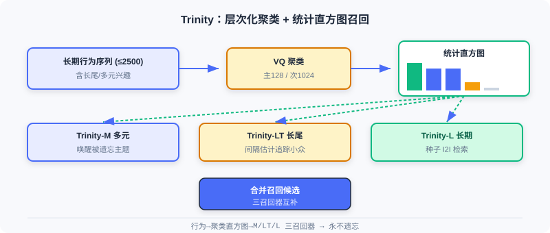

  📖
  ⏱️ ~30 min read
  🎯 Intermediate

# 流式索引召回

> 📝 **Before You Continue:** 建议先读完 [2.3](./two-tower.md) 的双塔与 [2.4](./sequence-recall.md) 的多兴趣。本章跳出「模型内部把历史压成向量」的思路，改用**索引结构**本身保留全量兴趣并实时更新。

前面四节都在回答「如何把用户/物品编码成更好的向量」。但有个被忽视的问题： **模型在线学习时倾向于拟合最近样本，长期、长尾兴趣会被逐渐遗忘** ；而传统向量索引需定期重建，无法跟上热点快速更迭的内容平台。

本章的 Trinity 与 Streaming VQ 从 **索引层面** 破局：前者用聚类统计把全量历史兴趣「显式保留」在直方图里，永不遗忘；后者让向量量化索引 **流式实时更新** ，无需中断重建。它们代表了召回工程从「模型内压缩」到「索引外组织」的进阶。

读完本章，你将能够：

- 解释 **Trinity 的兴趣遗忘** 问题与层次化聚类（VQ）解决方案
- 描述基于 **统计直方图** 的三种召回器（多元 / 长尾 / 长期）如何互补
- 说明 **Streaming VQ** 如何用 $L_{aux}$ 替代 $L_{sim}$ 实现可修复、自适应的索引
- 分析索引平衡性与归并排序服务策略的工程价值
- 完成 5 道分层练习题，巩固流式索引

---

## 2.5.0 从模型压缩到索引组织

前几章的召回器都把用户历史 **压缩** 进固定容量的向量（单向量、多向量、长短期融合）。一旦容量固定，久远或罕见兴趣就可能在训练中「被挤出」。Trinity 提出相反思路： **不在模型里压缩，而在索引里显式保留**——把历史行为按聚类统计成直方图，每个聚类都是一条不会被遗忘的兴趣线索。

---

## 2.5.1 Trinity：聚类统计的全量兴趣召回

Trinity 把「搜索式兴趣建模」迁移到召回阶段，用基于聚类的统计框架处理数十亿候选。

### 兴趣遗忘问题

在线学习框架倾向拟合最近样本。当某兴趣主题的训练样本变稀疏，模型对该主题记忆渐退——Trinity 称此为 **兴趣遗忘（Interest Amnesia）**。长期行为能揭示多元兴趣全貌（短期被热门主导）；真正该关注的多元兴趣是尚未被充分推送的 **长尾主题** ；而判断是否真对长尾感兴趣，又需回溯长期行为确认。三者相互依存。

### 聚类系统的构建

训练阶段用 **向量量化（VQ）** 学物品聚类归属。维护两级可学习聚类中心：粗粒度主聚类 $\{\boldsymbol{e}_j^1\}_{j=1}^J$（$J=128$）与细粒度次级聚类 $\{\boldsymbol{e}_k^2\}_{k=1}^K$（$K=1024$）。每物品经最近邻分配：

$$\hat{j} = \arg\min_j \lVert \boldsymbol{e}^1_j - \boldsymbol{x}\rVert^2,\quad \hat{k} = \arg\min_k \lVert \boldsymbol{e}^2_k - \boldsymbol{x}\rVert^2$$

训练损失同时优化用户-物品与用户-聚类匹配：

$$L = \sum_p \sum_{\boldsymbol{A}\in\{\boldsymbol{x},\boldsymbol{e}^1_{\hat{j}},\boldsymbol{e}^2_{\hat{k}}\}} y_p\log\sigma(\boldsymbol{b}_p^T\boldsymbol{A}_p) + (1-y_p)\log(1-\sigma(\boldsymbol{b}_p^T\boldsymbol{A}_p))$$

聚类中心用 **指数移动平均（EMA）** 更新（用所属物品 Embedding 加权平均），平滑适应分布变化。由于同时用长期行为序列，近期与早期物品被同等对待——**时间无偏** ，不会过度偏向近期样本。

### 🧠 Mental Model: 给兴趣做「投票箱」

> 把每个聚类想成一个投票箱，用户的历史行为就是往对应箱子投的票。只要用户曾经对这类内容有过行为，箱子里的票数就非零——永远不会被「遗忘」。Trinity 只是数每个箱子的票数，按票数高低决定唤醒哪些兴趣。模型压成单向量则像把所有票揉成一团，稀有票被淹没。

### 基于直方图的兴趣召回

任意长度行为序列（可达 2500）被转成固定维度统计直方图：读每个物品的聚类 ID，统计每聚类行为计数，得主聚类直方图 $\boldsymbol{h}^1$ 与次级 $\boldsymbol{h}^2$。按计数降序排列后兴趣分布一目了然。例如排序后 $[50,20,20,4,2,0,0,0]$ 对应聚类 $[10,33,100,91,62,21,5,83]$：聚类 10 是主要兴趣，33/100 是多元兴趣，91/62 是探索性兴趣。

Trinity 据此设计三个互补召回器：

1. **多元兴趣召回（Trinity-M）** ：选计数显著但可能被主流忽略的聚类，每主聚类下至多选一个次级聚类以分散化，唤醒「被遗忘」的主题。
2. **长尾兴趣召回（Trinity-LT）** ：用流式频率估计追踪聚类出现间隔 $B[\mathcal{H}(c_k)]\leftarrow(1-\alpha)B[\mathcal{H}(c_k)]+\alpha(t-A[\mathcal{H}(c_k)])$，间隔大=长尾主题；用户在这些长尾聚类上有显著计数时增强推送。
3. **长期兴趣召回（Trinity-L）** ：用轻量双塔从长期行为选种子物品，再基于 Trinity Embedding 相似度做 I2I 检索。

### 与多向量方法的对比

MIND 等多向量法也捕捉多元兴趣，但有缺陷：不同头可能重复检索热门内容（效率随头数降）、语义不明难调控、难扩展长尾/长期。Trinity 把物品 **排他性** 分配到聚类，增加兴趣主题只带来线性开销；每个聚类语义明确（教育/旅游/科技），且直方图 **天然不忘**——只要历史有相关行为，对应计数非零。

> **Analysis:** Trinity 用统计直方图显式保留全量兴趣，根治兴趣遗忘、语义可解释、易调控；代价是需维护两级聚类中心与 EMA 更新，索引构建比单向量双塔更复杂。它是「索引外组织」路线的代表。

---

## 2.5.2 Streaming VQ：实时更新的流式索引

Trinity 解决了兴趣遗忘，但 **索引结构的时效性** 仍在：传统向量索引需定期重建，期间映射固定。快节奏平台上新内容涌入、热点更迭，固定索引跟不上。Streaming VQ 提出 **流式更新的向量量化索引**——物品实时分配聚类，中心持续适应分布。

### 流式索引的核心机制

训练框架含两步： **索引步** 与 **排序步**。索引步用双塔生成用户/物品 Embedding，先用辅助任务（in-batch 对比学习）优化，使物品向量不依赖聚类也能独立学语义：

$$L_{aux} = \sum_o -\log \frac{\exp(\boldsymbol{u}_o^T \boldsymbol{v}_o)}{\sum_r \exp(\boldsymbol{u}_o^T \boldsymbol{v}_r)}$$

物品 Embedding 经最近邻量化到聚类：

$$k^*_o = \arg\min_k \lVert \boldsymbol{e}^k - \boldsymbol{v}_o\rVert^2,\quad \boldsymbol{e}_o = Q(\boldsymbol{v}_o)$$

量化中心也参与用户-聚类匹配优化：

$$L_{ind} = \sum_o -\log \frac{\exp(\boldsymbol{u}_o^T \boldsymbol{e}_o)}{\sum_r \exp(\boldsymbol{u}_o^T \boldsymbol{e}_r)}$$

物品到聚类的映射实时写入参数服务器，中心经 EMA 更新，整个索引随训练实时更新，无需中断重建。

### 索引的可修复性

流式更新带来退化风险（无定期重建「重置」）。原始 VQ-VAE 用 $L_{sim}=\sum_o\lVert\boldsymbol{v}_o-\boldsymbol{e}_o\rVert^2$ 约束距离，但推荐中数据漂移使聚类归属本应动态变化，$L_{sim}$ 反碍事。Streaming VQ 用 **$L_{aux}$ 替代 $L_{sim}$** ：物品 Embedding 先独立更新，再由 $L_{ind}$ 据新分布调中心——「物品优先」原则让聚类持续适应，而非把物品锁在过时聚类中。

### 索引平衡性

召回希望热门物品均匀分布在不同聚类，便于选少数聚类快速缩小候选。Streaming VQ 多机制促平衡：

- $L_{ind}$ 的 softmax 中热门占多数样本，若全挤在少数头部聚类，中心需代表大量语义各异物品、表示模糊、损失高；分散到更多聚类则每中心更一致、损失更低——**优化本身倾向均衡**。
- EMA 引入流行度调节：$\boldsymbol{w}_k^{t+1}=\alpha\boldsymbol{w}_k^t+(1-\alpha)(\delta^t)^\beta\boldsymbol{v}_j^t$，冷门物品间隔 $\delta^t$ 更大，$\beta>0$ 时获更大权重，中心不被热门主导。
- 量化引入扰动 $k^*_o=\arg\min_k \lVert\boldsymbol{e}^k-\boldsymbol{v}_o\rVert^2\cdot r,\; r=\min(\frac{c_k}{\sum c_{k'}/K}\cdot s,1)$，样本量低于均值 $1/s$ 的聚类 $r<1$ 更「近」，易吸物品加入。

### 归并排序的服务策略

服务阶段把物品 Embedding 分解为个性化部分与流行度部分：

$$\text{score} = \boldsymbol{u}^T\cdot Q(\boldsymbol{v}_{emb}) + v_{bias}$$

$v_{bias}$ 是全局受欢迎度偏置，$Q(\boldsymbol{v}_{emb})$ 承担个性化匹配。聚类保持「按语义分组」不被热门拉偏，聚类内用 $v_{bias}$ 初排。用 **最大堆 K 路归并排序** ：先由 $\boldsymbol{u}^T Q(\boldsymbol{v}_{emb})$ 做聚类级排序，再由 $v_{bias}$ 做聚类内排序，保证每聚类都有机会贡献候选。

> **Analysis:** Streaming VQ 让索引实时适应分布、可修复、均衡，且服务用归并排序保证候选多样性；代价是需参数服务器实时写映射 + EMA 维护，工程链路比静态索引重。它与 Trinity 互补：Trinity 管「兴趣不遗忘」，Streaming VQ 管「索引不过时」。

---

## ⚠️ Common Mistakes in 2.5

| # | Mistake | Example | Why It's Wrong | Fix |
|---|---------|---------|---------------|-----|
| 1 | 以为双塔能记住长尾 | 「双塔单向量覆盖所有兴趣」 | 固定容量压缩，长尾被挤出 | 用直方图(Trinity)显式保留 |
| 2 | 用 L_sim 约束 VQ | Streaming VQ 仍加相似损失 | 阻碍聚类归属动态变化 | 用 L_aux 替代 L_sim |
| 3 | 忽略时间无偏 | Trinity 只用近期行为训练 | 重现兴趣遗忘 | 训练同时用长期序列 |
| 4 | 热门物品堆头部聚类 | 不干预索引平衡 | 中心表示模糊、匹配差 | 靠 L_ind + 流行度调节 |
| 5 | 混淆 Trinity 与 MIND | 「都是多兴趣所以一样」 | 前者索引统计、后者模型多向量 | 区分索引路线与模型路线 |

---

## 本章小结

### 📌 Key Takeaways

| Concept | Key Points | Why It Matters |
|---------|-----------|----------------|
| 兴趣遗忘 | 在线学习遗忘稀疏长尾兴趣 | 引出索引外组织的动机 |
| Trinity 直方图 | 行为→聚类计数直方图→三召回器 | 显式保留全量兴趣，永不遗忘 |
| Streaming VQ | L_aux 替代 L_sim + EMA 实时更新 | 索引实时适应、可修复 |
| 归并排序 | score=uᵀQ(v)+v_bias，K 路归并 | 保证候选多样性与均衡 |

### ❓ FAQ

**Q1: Trinity 和 MIND 都在解决「多元兴趣」，根本区别？**
> A: MIND 是**模型内**用多个兴趣向量（在线学习易遗忘稀疏兴趣）；Trinity 是**索引外**用统计直方图显式保留每聚类计数，天然不忘且语义可解释、易调控。

**Q2: 为什么 Streaming VQ 要用 L_aux 而不是 L_sim？**
> A: L_sim 把物品锁在「离当前中心近」的旧归属里，阻碍聚类随数据漂移而动态变化；L_aux 让物品向量先独立更新，再由 L_ind 调中心，实现「物品优先」的自适应。

**Q3: 归并排序在服务阶段有什么用？**
> A: 它把 score 拆成「聚类级个性化 + 聚类内流行度」，用 K 路归并让每个聚类都有机会贡献候选，避免热门聚类垄断，保证召回多样性。

### 前后关联

- **2.4（序列召回）** 是「模型内多向量」路线，与本章「索引外统计」互补，可组合使用。
- **2.3（双塔）** Streaming VQ 的索引步正是双塔 + 量化，承接其向量产出。
- **Part 3（排序）** 本章召回的候选将进入排序阶段精排。

---

## Practice Problems

Work through all problems in order — they get progressively harder. Each has a complete solution you can reveal after trying it yourself.

---

**Problem 2.5.1 — 直方图读图** 🟢 Easy

Trinity 把用户行为序列转为主聚类直方图，降序排列为 $[50,20,20,4,2,0,0,0]$，对应聚类索引 $[10,33,100,91,62,21,5,83]$。请指出主要兴趣、多元兴趣、探索性兴趣分别对应哪些聚类。

💡 Solution (click to reveal)

**Approach:** 按计数分层。

- 主要兴趣：计数最高（50）→ 聚类 **10**。
- 多元兴趣：次高且需被唤醒（20,20）→ 聚类 **33、100**。
- 探索性兴趣：较低计数（4,2）→ 聚类 **91、62**。
- 其余（21,5,83）计数为 0，可忽略。

**Key points:**
- 直方图降序后，高计数=主干，中计数=多元，低计数=探索。
- 计数非零即代表该兴趣未被遗忘。

---

**Problem 2.5.2 — 量化分配** 🟢 Easy

Streaming VQ 量化公式 $k^*_o=\arg\min_k\lVert\boldsymbol{e}^k-\boldsymbol{v}_o\rVert^2$。若物品 $o$ 的向量 $\boldsymbol{v}_o=[1,0]$，三个聚类中心为 $\boldsymbol{e}^1=[0,0]$、$\boldsymbol{e}^2=[1,1]$、$\boldsymbol{e}^3=[1,0]$。求 $k^*_o$。

💡 Solution (click to reveal)

**Approach:** 算各中心距离平方。

- $\lVert e^1-v_o\rVert^2 = \lVert[-1,0]\rVert^2 = 1$
- $\lVert e^2-v_o\rVert^2 = \lVert[0,1]\rVert^2 = 1$
- $\lVert e^3-v_o\rVert^2 = \lVert[0,0]\rVert^2 = 0$

最小为 0 → $k^*_o = 3$。

**Key points:**
- 量化 = 最近邻分配，物品归入最近聚类中心。
- 流式更新中该映射实时写入参数服务器。

---

**Problem 2.5.3 — 兴趣遗忘直觉** 🟡 Medium

某用户的长期行为含大量「古典音乐」，但近 3 个月只交互热门「流行综艺」。在线学习模型逐渐遗忘古典音乐兴趣。请说明：(a) 双塔单向量为何会遗忘；(b) Trinity 直方图为何不会。

💡 Solution (click to reveal)

**Approach:** 对比两种表示的信息保留方式。

**(a) 双塔单向量：** 模型在线拟合近期样本，古典音乐相关梯度稀疏，其隐向量分量被近期热门样本的持续梯度逐步覆盖/平均，容量固定导致稀有兴趣被挤出——即兴趣遗忘。

**(b) Trinity 直方图：** 古典音乐对应聚类的历史行为计数早已写入直方图，且训练同时用长期序列（时间无偏）。只要历史有该行为，计数非零，召回时仍会被唤醒，不依赖模型「记住」它。

**Key points:**
- 单向量=信息被压缩进容量，稀有者被覆盖。
- 直方图=信息外置为计数，永久保留。

---

**Problem 2.5.4 — 归并排序分解** 🔴 Hard

Streaming VQ 服务分数 $\text{score}=\boldsymbol{u}^T Q(\boldsymbol{v}_{emb})+v_{bias}$。设用户向量与某物品量化向量内积为 0.6，该物品流行度偏置 $v_{bias}=0.3$。求总分。并说明：若两物品内积分别为 0.6 与 0.4，但 $v_{bias}$ 为 0.1 与 0.5，归并排序如何在「聚类级」与「聚类内」分别利用这两项。

💡 Solution (click to reveal)

**Approach:** 代入并解释两级排序。

总分 $=0.6+0.3=0.9$。

两物品：A(内积 0.6, bias 0.1) → 0.7；B(内积 0.4, bias 0.5) → 0.9。

**答：** 归并排序先按个性化项 $\boldsymbol{u}^T Q(v)$ 做 **聚类级** 排序（选出与用户个性化最匹配的聚类），再在聚类内按 $v_{bias}$ 做 **聚类内** 排序。这样聚类保持「按语义分组」（不被热门 bias 拉偏），而聚类内用全局流行度初排。B 虽个性化弱但流行度高，会在其所属聚类内靠前；A 个性化强，在另一聚类级排序中胜出——每聚类都有机会贡献，保证多样性。

**Key points:**
- 分解让「语义分组」与「流行度」解耦。
- K 路归并保证候选均衡覆盖多聚类。

---

**🏆 Challenge: 组合流式索引召回**

某短视频平台热点每分钟更迭，长尾内容极多且用户兴趣易漂移。请写约 150 字，说明如何 **组合** Trinity（直方图多召回器）与 Streaming VQ（实时量化索引）搭建召回：二者各补什么、索引如何实时维护、为何比纯双塔更适合该场景。

💡 Hint

Trinity 用直方图三召回器显式保留多元/长尾/长期兴趣，根治双塔遗忘；Streaming VQ 用 L_aux+EMA 让聚类索引实时适应热点更迭、可修复、均衡。物品映射实时写参数服务器，双塔产向量经量化入索引。比纯双塔更适合：长尾不被淹没、热点不过时、索引无需定期重建即可跟随分布漂移。

