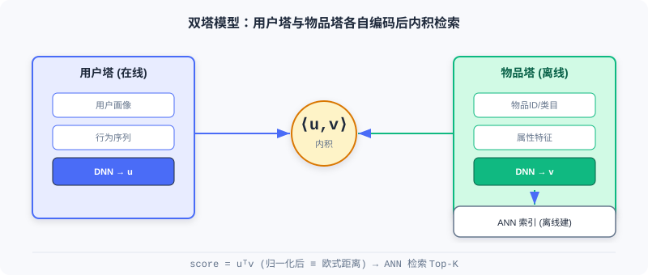
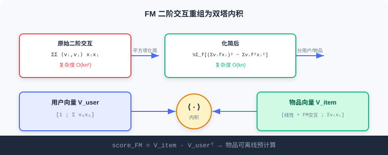

  📖
  ⏱️ ~35 min read
  🎯 Advanced

# 双塔模型 (U2I)

> 📝 **Before You Continue:** 请先读完 [2.1](./collaborative-filtering.md) 的矩阵分解与 [2.2](./vector-recall-i2i.md) 的 Item2Vec。本章把「内积」思想从物品-物品升级为**用户-物品**，并用深度网络编码两侧表示，是工业 U2I 召回的主干。

前两节你学到的物品向量（Item2Vec / EGES）做的是 **I2I** 召回——先有种子物品，再找相似物。但线上召回的起点往往不是「物品」而是「用户」：给定一位用户，直接从亿级物品库里捞出他可能感兴趣的。这就需要 **用户表示** 与 **物品表示** 在同一空间里各自编码，再用内积检索——这就是 **双塔模型（Two-Tower）**。

它的工程魅力在于「分而治之」：物品侧塔可以 **离线预计算** 并存入近邻索引（ANN），用户侧塔 **实时计算** ，线上只需一次向量检索。从 FM 的数学雏形，到 DSSM 的深度编码，再到 YouTubeDNN 的「预测下一个观看」，本章带你走完双塔的演进，并用交互演示直观感受检索过程。

读完本章，你将能够：

- 推导 **FM 二阶交互项** 从 $O(kn^2)$ 到 $O(kn)$ 的化简，并说明它如何重组为双塔内积
- 解释 **DSSM** 的极端多分类训练、向量归一化与温度系数的作用
- 描述 **YouTubeDNN** 的「非对称双塔」与「时序分割」等工程技巧
- 用交互演示理解双塔召回的「离线建库 / 实时查用户」流程
- 完成 5 道分层练习题，巩固双塔的表示与检索

---

## 2.3.0 为什么需要双塔：从 I2I 到 U2I

I2I 召回依赖「用户已交互过某物品」作种子。但很多场景下，用户刚注册、或我们要在他 **还没动作时** 就推内容。U2I 直接以用户自身（画像 + 行为）为查询，从全库检索候选：

双塔的核心约定是： **两侧塔在训练时几乎不交互，只在最后一步算内积**。这换来了宝贵的工程性质——物品向量可离线一次性算好入库，用户向量在线现算，检索成本极低。

---

## 2.3.1 FM（因子分解机）：双塔模型的雏形

FM 诞生于深度学习之前，却在思想上预示了双塔。它把用户-物品复杂交互优雅分解为两个低维向量的内积。完整表达式：

$$\hat{y}(\boldsymbol{x}) = w_0 + \sum_{i=1}^{n} w_i x_i + \sum_{i=1}^{n}\sum_{j=i+1}^{n}\langle\boldsymbol{v}_i, \boldsymbol{v}_j\rangle x_i x_j$$

每个特征 $i$ 对应 $k$ 维隐向量 $\boldsymbol{v}_i$，交互通过内积 $\langle\boldsymbol{v}_i,\boldsymbol{v}_j\rangle=\sum_{f=1}^k v_{i,f}v_{j,f}$ 建模。

### 计算复杂度化简

原本 $O(n^2)$ 的二阶项可重写为：

$$\sum_{i=1}^{n}\sum_{j=i+1}^{n}\langle\boldsymbol{v}_i, \boldsymbol{v}_j\rangle x_i x_j = \frac{1}{2}\sum_{f=1}^{k}\left(\left(\sum_{i=1}^{n}v_{i,f}x_i\right)^2 - \sum_{i=1}^{n}v_{i,f}^2 x_i^2\right)$$

复杂度从 $O(kn^2)$ 降到 $O(kn)$，使 FM 能处理大规模稀疏数据。

### 🧠 Mental Model: 拼积木的隐向量

> 把每个特征想成一块积木，每块积木藏着一根小指针（隐向量）。两个特征是否「合得来」，不看积木本身，只看两根指针指的方向是否一致（内积大=合得来）。FM 的妙处是：不用真的两两试遍，靠「指针平方和减平方平方和」一次算完所有配对。

### 分解为双塔结构

召回场景下，特征分两类：用户侧 $U$ 与物品侧 $I$。为同一用户推荐不同物品时， **用户特征内部的交互得分对所有候选相同，排序时可忽略**。只保留：物品内部交互 + 用户-物品交互。重排后：

$$\text{score}_{FM} = \sum_{t\in I} w_t x_t + \frac{1}{2}\sum_{f=1}^{k}\left(\left(\sum_{t\in I}v_{t,f}x_t\right)^2 - \sum_{t\in I}v_{t,f}^2x_t^2\right) + \sum_{f=1}^{k}\left(\sum_{u\in U}v_{u,f}x_u\sum_{t\in I}v_{t,f}x_t\right)$$

观察最后一项——它恰是两个向量的内积 $\sum_{u\in U}v_u x_u$ 与 $\sum_{t\in I}v_t x_t$。于是：

$$\text{score}_{FM} = V_{item}\cdot V_{user}^T$$

- 用户向量：$V_{user} = [1; \sum_{u\in U} v_u x_u]$
- 物品向量：$V_{item} = [\sum_t w_t x_t + \frac{1}{2}\sum_f((\sum_t v_{t,f}x_t)^2 - \sum_t v_{t,f}^2x_t^2); \sum_t v_t x_t]$

> **Analysis:** FM 用线性代数把特征交叉转为双塔内积，物品向量可离线预计算，是双塔思想的理论雏形；但它是**线性**模型，对复杂非线性用户-物品关系表达力有限——这正是 DSSM 用深度网络接棒的原因。

---

## 2.3.2 DSSM：深度结构化语义模型

DSSM 用 **深度神经网络** 替代 FM 的线性变换，把用户与物品映射到共同语义空间，相似度由向量间距离衡量。

### 推荐中的双塔架构

DSSM 含独立的两个 DNN 塔：用户塔处理用户特征（行为、人口统计），输出用户 Embedding；物品塔处理物品特征（ID、类目、属性），输出物品 Embedding。两塔 Embedding 维度必须一致。相比 FM 的线性组合，DSSM 让两侧特征各自在塔内做复杂非线性变换， **两塔交互仅发生在最终内积**。物品向量离线预计算、用户向量实时计算，经 ANN 完成召回。

### 多分类训练范式

DSSM 把召回视为极端多分类：物料库所有物品都是类别，目标是最大化用户对正样本的预测概率：

$$P(y|x,\theta) = \frac{e^{s(x,y)}}{\sum_{j\in M}e^{s(x,y_j)}}$$

$M$ 是整个物料库。因库过大，实际用负采样近似。

### 双塔的关键细节

**向量归一化** ：对两侧 Embedding 做 L2 归一化 $u\leftarrow u/\|u\|_2,\; v\leftarrow v/\|v\|_2$。原始点积不满足三角不等式，会致「距离」不一致。归一化后点积等价于欧式距离：

$$\|u-v\| = \sqrt{2-2\langle u,v\rangle}$$

关键是 **训练与检索的一致性**——训练用的（归一化点积）与线上 ANN 用的（欧式距离）本质等价，避免训练-服务不一致。

**温度系数调节** ：归一化内积再除以 $\tau$：

$$s(u,v) = \frac{\langle u,v\rangle}{\tau}$$

$\tau<1$ 放大相似度差异（更「确定」），$\tau>1$ 使分布更平滑（更保守）。它本质是缩放 logits、改变 Softmax 输出形状。

> **Analysis:** DSSM 的表达力来自深度非线性，工程优势来自「离线物品塔 + 在线用户塔」。归一化与温度是上线必调的两个旋钮——前者保证检索一致性，后者控制召回的「集中度」。代价是双塔「晚期交互」损失了部分细粒度特征交叉信号。

---

## 2.3.3 YouTubeDNN：从匹配到预测用户下一行为

YouTubeDNN 是双塔演进的里程碑。它延续双塔，但引入关键转变：把召回定义为「**预测用户下一个会观看的视频**」，类似 NLP 的 next-token 预测。

### 非对称双塔架构

用户塔集成观看历史、搜索历史、人口统计等多模态信息，视频 ID 经嵌入后平均池化聚合，并引入 **Example Age** 特征建模内容新鲜度；物品塔则相对简化——本质是一个巨大嵌入矩阵，每视频一个可学向量，避免复杂物品特征工程。目标为极端多分类：

$$P(w_t=i|U,C) = \frac{e^{v_i\cdot u}}{\sum_{j\in V}e^{v_j\cdot u}}$$

因视频库庞大，用 Sampled Softmax 高效训练。

### 关键的工程技巧

- **非对称的时序分割** ：不用随机验证，而用「回滚」——预测目标只看其 **之前** 的历史，避免未来信息泄露（符合真实推荐场景，剧集按顺序看）。
- **负采样策略** ：重要性采样，每次只对数千负样本计算，提速 100 多倍。
- **用户样本均衡** ：每用户生成固定数量训练样本，避免高活跃用户主导学习，对长尾用户效果关键。

> **Analysis:** YouTubeDNN 建立了「可扩展、可工程化」的双塔范式：训练用复杂多分类目标 + 丰富用户特征，服务时预计算物品向量、实时算用户向量、配 ANN 检索。非对称设计让物品塔保持简洁（易离线建库），用户塔可灵活扩展——这一平衡至今被广泛借鉴。

---

## 2.3.4 交互演示：双塔召回的检索过程

下面用交互演示感受双塔召回的核心流程：物品塔 **离线** 把所有物品编码进向量索引；线上来了一位用户，用户塔 **实时** 编码其向量，再用近邻检索从索引里捞出最相似的 Top-K 候选。点击「下一步」观察每一步。

<iframe src="../viz/part2-two-tower.html?embed&vizId=part2-two-tower" style="width:100%; height:640px; border:none; border-radius:12px; display:block;" loading="lazy"></iframe>

注意第三步「检索」：它不遍历全库逐一算分，而是用 ANN 在近邻空间直接定位——这正是双塔能在毫秒级服务亿级物品的根本原因。归一化让内积等价于欧式距离，温度系数则控制检索的集中程度。

> 📊 **Data Point:** 在 funrec 评测集上，FM 召回 hit_rate@10≈0.047、DSSM≈0.016、YouTubeDNN≈0.013。数值差异主要来自数据集与特征配置，不代表模型优劣——DSSM/YouTubeDNN 在更丰富特征与更大规模上通常更优。

---

## ⚠️ Common Mistakes in 2.3

| # | Mistake | Example | Why It's Wrong | Fix |
|---|---------|---------|---------------|-----|
| 1 | 双塔塔间过早交互 | 用户/物品特征早期 concat | 破坏「物品可离线预计算」性质 | 交互只发生在最终内积 |
| 2 | 忘做向量归一化 | 直接点积做 ANN 检索 | 点积非度量，训练-检索不一致 | 两侧 L2 归一化 |
| 3 | 温度系数乱设 | 默认 τ=1 不调 | 召回集中度失控，头部过聚 | 按业务调 τ 控制分布 |
| 4 | 把 FM 当深度模型 | 「FM 能拟合任意非线性」 | FM 是线性模型，交叉阶数固定 | 需非线性用 DSSM |
| 5 | YouTubeDNN 随机分割 | 验证集混入未来行为 | 未来信息泄露，离线指标虚高 | 用时序回滚分割 |

---

## 本章小结

### 📌 Key Takeaways

| Concept | Key Points | Why It Matters |
|---------|-----------|----------------|
| FM 双塔雏形 | 二阶交互重排为 $V_{item}\cdot V_{user}^T$ | 理论起点，物品可离线预计算 |
| DSSM | 深度双塔 + 极端多分类 + 归一化/温度 | 工业 U2I 主干，强表达+高效检索 |
| YouTubeDNN | 预测下一观看 + 非对称塔 + 时序分割 | 可扩展可工程化的范式 |
| 训练-检索一致 | 归一化点积 ≡ 欧式距离 | 避免线上线下不一致 |

### ❓ FAQ

**Q1: 为什么双塔「晚期交互」反而是优点？**
> A: 因为物品向量可完全离线算好、建索引，线上只算用户向量 + 一次 ANN 检索。若塔间早期交互（如特征交叉），物品向量就依赖具体用户，无法预计算，失去规模化能力。

**Q2: 温度系数 τ 调大调小分别有什么效果？**
> A: τ<1 放大相似度差异，模型更「自信」、召回更集中（易扎堆头部）；τ>1 平滑分布、更保守、候选更分散。是平衡精准与多样的旋钮。

**Q3: FM 和 DSSM 都用内积，区别在哪？**
> A: FM 的向量由线性组合 + 固定隐向量得到（线性模型）；DSSM 的向量由深度网络非线性变换得到（表达力更强），且显式处理归一化与采样训练。

### 前后关联

- **2.4（序列召回）** 把用户表示从「单一向量」升级为「多向量 / 长短期融合」，弥补双塔单向量丢时序的不足。
- **2.5（流式索引）** 承接双塔产出的物品向量，组织成可实时更新的流式索引。
- **3.x（排序）** 排序侧可用更复杂的「早期交互」模型（如特征交叉），与双塔晚期交互互补。

---

## Practice Problems

Work through all problems in order — they get progressively harder. Each has a complete solution you can reveal after trying it yourself.

---

**Problem 2.3.1 — FM 复杂度化简** 🟢 Easy

FM 二阶交互项原始形式需对 $n$ 个特征两两组合，复杂度为 $O(kn^2)$。请写出化简后形式，并说明为何它只需 $O(kn)$。

💡 Solution (click to reveal)

**Approach:** 回忆平方项展开。

$$\sum_{i<j}\langle v_i,v_j\rangle x_i x_j = \frac{1}{2}\sum_{f=1}^{k}\left(\left(\sum_i v_{i,f}x_i\right)^2 - \sum_i v_{i,f}^2 x_i^2\right)$$

**答：** 右边对每个隐维度 $f$ 只需遍历一次特征 $i$ 求和与平方和，再相减，共 $k$ 个维度、$n$ 个特征 → $O(kn)$，而非 $O(kn^2)$。

**Key points:**
- 关键技巧是把「两两乘积和」转为「和的平方减平方的和」。
- 这正是 FM 能上大规模稀疏数据的原因。

---

**Problem 2.3.2 — 双塔内积重组** 🟢 Easy

FM 召回中，用户特征内部交互对所有候选相同故可忽略。最终分数写成 $\text{score}_{FM}=V_{item}\cdot V_{user}^T$。若用户向量 $V_{user}=[1, 0.6, 0.2]^T$，物品向量 $V_{item}=[0.4, 0.5, 0.3]^T$，求内积分（即匹配分）。

💡 Solution (click to reveal)

**Approach:** 对应分量相乘再求和。

$$\text{score} = 1\times0.4 + 0.6\times0.5 + 0.2\times0.3 = 0.4 + 0.3 + 0.06 = 0.76$$

**Key points:**
- 第一项常数 1 乘物品向量的偏置/线性部分，后两项是隐向量交互。
- 物品向量离线算好，线上只对用户现算并做一次内积。

---

**Problem 2.3.3 — 归一化与距离** 🟡 Medium

设未归一化向量 $A=(10,0)$、$B=(0,10)$、$C=(11,0)$。用原始点积作为「相似度」判断谁离 A 更近（dist=点积越大越近）。再对三者 L2 归一化后用欧式距离 $\|u-v\|$ 判断。说明为何归一化更合理。

💡 Solution (click to reveal)

**Approach:** 分别算。

原始点积：$A\cdot B=0$，$A\cdot C=110$。按点积「越大越近」会判 C 更近。这个例子恰好与几何一致（$|B-A|=\sqrt{200}\approx14.1$，$|C-A|=1$），但点积的排序并不可靠：它受模长干扰，若把 C 换成 $(11,1)$ 这类与 A 夹角不小的长向量，点积依然很大，排序就会失真。非归一化点积不是真正的距离度量。

归一化：$A'=(1,0), B'=(0,1), C'=(1,0)$。欧式距离 $\|A'-B'\|=\sqrt{2}\approx1.41$，$\|A'-C'\|=0$。此时 C 更近（二者同向），B 最远——符合直觉（$A,C$ 同向，$B$ 正交）。

**Key points:**
- 点积受向量模长干扰，非真正度量。
- 归一化后点积 ⇔ 欧式距离，训练（点积）与 ANN 检索（欧式）一致。

---

**Problem 2.3.4 — 温度系数效应** 🔴 Hard

DSSM 用 Sampled Softmax 近似 $P(y|x)\propto e^{\langle u,v\rangle/\tau}$。设某用户与三个物品的内积为 $s_1=2.0, s_2=1.0, s_3=0.0$。分别计算 $\tau=0.5$ 与 $\tau=2.0$ 时三者的 Softmax 概率（公式 $p_i=e^{s_i/\tau}/\sum e^{s_j/\tau}$），并说明 τ 如何影响召回集中度。

💡 Solution (click to reveal)

**Approach:** 分别代入。

τ=0.5：$s/\tau = [4, 2, 0]$，$e^{s/\tau}=[54.6, 7.39, 1]$，和=63.0 → $p=[0.866, 0.117, 0.016]$。

τ=2.0：$s/\tau = [1, 0.5, 0]$，$e=[2.718, 1.649, 1]$，和=5.367 → $p=[0.506, 0.307, 0.186]$。

**答：** τ=0.5 时概率高度集中在物品1（0.866），召回很集中；τ=2.0 时分布平缓（0.506/0.307/0.186），候选更分散。τ 越小越「自信/集中」，越大越「保守/分散」。

**Key points:**
- τ 缩放 logits，改变 Softmax 形状。
- 工业上用 τ 平衡「精准命中」与「多样性覆盖」。

---

**🏆 Challenge: 设计双塔召回链路**

某电商要做 U2I 召回，物品库 5 亿、QPS 峰值 10 万。请写约 150 字说明：为何选双塔而非 ItemCF；物品塔离线建库的频率与用户塔实时计算的分工；并指出哪一环必须用 ANN、为什么。

💡 Hint

双塔因「用户无种子物品也能召回」且可离线建物品索引、在线仅算用户向量 + ANN 检索，天然适配高 QPS 大库；离线建库可按天/小时批量重算物品向量入 ANN 索引，用户塔请求时现算。ANN 必不可少——5 亿物品逐一内积不可行，需近邻检索在毫秒级返回 Top-K。温度系数与归一化需配套以保证检索一致。

