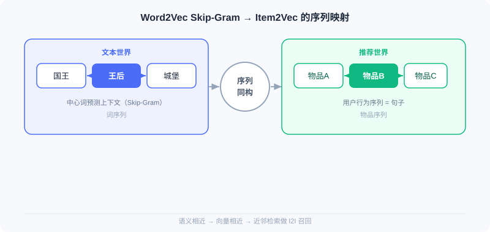
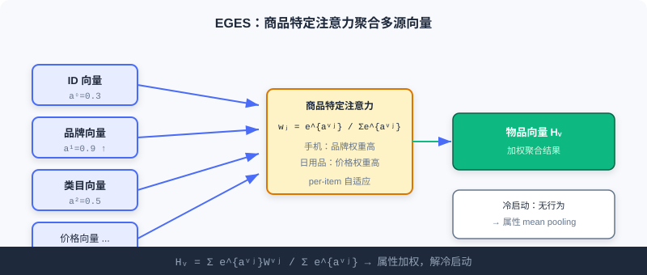
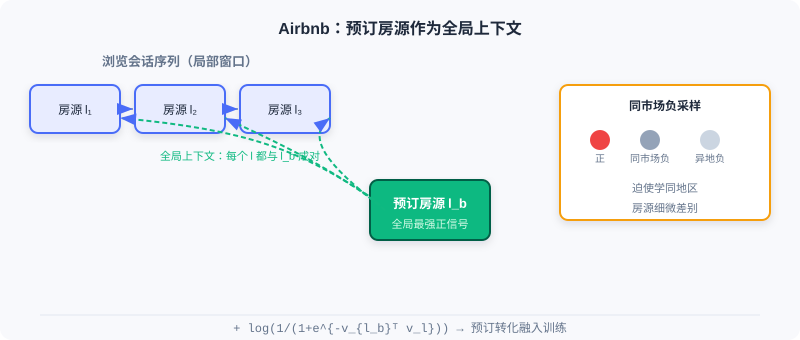

  📖
  ⏱️ ~30 min read
  🎯 Intermediate

# 向量召回 (I2I)

> 📝 **Before You Continue:** 建议先读完 [2.1](./collaborative-filtering.md) 的 ItemCF 与矩阵分解。本章是「把物品当作向量」思路的自然延伸——区别在于，相似度不再由共现统计得出，而由**序列建模**学到的稠密向量决定。

[2.1](./collaborative-filtering.md) 的协同过滤靠「谁和谁一起被交互」来定义相似。但如果一个物品几乎没被交互过（新品冷启动），共现统计就失效了。更根本地：共现只告诉你「相关」，却没把物品编码成语义向量，难以进一步融合属性、做近邻检索。

本章的主角是 **Word2Vec 的序列建模思想**。它有一个简单而深刻的假设： **在相似语境中出现的词，含义也相似**。当我们把「句子」替换为「用户的行为序列」，把「词」替换为「物品」，同一套方法就能学到「语义相近、向量相近」的物品表示，用于 I2I 召回。从最直接的 Item2Vec 迁移，到融合属性的 EGES，再到把业务目标写进序列的 Airbnb——你会看到这条线如何一步步贴近工业真实。

读完本章，你将能够：

- 解释 **Word2Vec Skip-Gram** 的核心公式，以及 **负采样** 为何不可或缺
- 描述 **Item2Vec** 如何把「用户行为序列 = 句子」的映射用于 I2I 向量召回
- 说明 **EGES** 的商品特定注意力如何解决冷启动与稀疏性
- 分析 **Airbnb** 的全局上下文与同市场负采样如何把「预订转化」融入训练
- 完成 5 道分层练习题，巩固序列建模召回

---

## 2.2.0 从词语到物品：一个结构性的类比

Word2Vec 的成功建立在「共现反映语义」之上。在自然语言里，一个句子由词组成，词间共现反映语义；在推荐里，一个用户的交互历史可看作「句子」，其中的物品就是「词」。这就是 Item2Vec 的全部出发点——**结构同构，迁移即用**。

| 文本世界 | 推荐世界 |
|----------|----------|
| 词语 | 物品 |
| 句子 | 用户交互序列 |
| 词语共现 | 物品被同一用户交互 |

下面四节我们会看到，这个看似简单的映射，如何支撑起一整个 I2I 向量召回家族。

---

## 2.2.1 Word2Vec：序列建模的理论基础

> 📎 本节只讲 Skip-Gram 的直觉与它在推荐里的迁移。要补 **CBOW 架构、中心词/上下文双向量表 $\mathbf{W}$/$\mathbf{W}^c$ 的结构细节、负采样精确形式与词向量类比性质**，见 **[附录 · Word2Vec 专题](../appendix/word2vec.md)**。

Word2Vec 包含两种架构： **Skip-Gram** （用中心词预测上下文）与 **CBOW** （用上下文预测中心词）。推荐中 Skip-Gram 表现更好，采用更广。

### Skip-Gram 模型

给定序列中位置 $t$ 的中心词 $w_t$，模型最大化其窗口内（大小 $m$）所有上下文词的出现概率：

$$P(w_{t+j} | w_t) = \frac{e^{v_{w_{t+j}}^T v_{w_t}}}{\sum_{k=1}^{|V|} e^{v_{w_k}^T v_{w_t}}}$$

$v_{w_i}$ 是词 $w_i$ 的向量，$|V|$ 是词表。Softmax 保证概率和为 1，分子内积衡量中心词与上下文词的相似度。

### 🧠 Mental Model: 猜邻居的游戏

> 想象你在玩「我说一个词，你猜它旁边可能是什么词」。听到「国王」，你大概率猜「王后」「城堡」。Skip-Gram 就是让模型玩这个游戏：它不问「这两个词是否共现」，而是问「给定中心词，周围最可能是哪些词」——通过反复猜，模型被迫把语义相近的词放到向量空间里相近的位置。

### 负采样优化

直接算 Softmax 分母需遍历整个词表，代价过高。负采样把多分类转为多个二分类：

$$\log \sigma(v_{w_{t+j}}^T v_{w_t}) + \sum_{i=1}^{n_{\mathrm{neg}}} \mathbb{E}_{w_i \sim P_n(w)} \log \sigma(-v_{w_i}^T v_{w_t})$$

其中 $\sigma(x)=1/(1+e^{-x})$，$n_{\mathrm{neg}}$ 是负样本数。直觉是：对真实词对 **抬高** 相似度，对随机采样的负样本词对 **压低** 相似度。这一范式正是后续推荐模型训练的技术基石。

> **Analysis:** Skip-Gram + 负采样高效、可扩展，是直接迁移到推荐的理论原型；但它本身处理的是「词」，需要把「用户行为序列」正确映射为训练语料才能用于推荐。

---

## 2.2.2 Item2Vec：最直接的迁移

Item2Vec 的核心洞察，就是上一节的「结构同构」：把用户交互历史视作「句子」，物品视作「词」。

### 模型实现

Item2Vec 直接采用 Word2Vec 的 Skip-Gram，但序列构建更简化——将每个用户的交互历史视为一个 **集合** 而非序列， **忽略时序权重** （窗口仍依赖按时间排序后的位置 $i+j$，只是不再给不同位置不同的权重）。目标函数保持一致：

$$\mathcal{L} = \sum_{s \in \mathcal{S}} \sum_{l_{i} \in s} \sum_{-m \leq j \leq m, j \neq 0} \log P(l_{i+j} | l_{i})$$

其中 $l_i$ 是物品，$m$ 是窗口大小，$P(l_{i+j}|l_i)$ 用与 Word2Vec 相同的 Softmax 形式。训练后每个物品得到稠密向量，可做近邻检索实现 I2I 召回。

> **Analysis:** Item2Vec 实现极简（几行 gensim 调用即可），验证了序列建模在推荐的可行性；但它把历史当无序集合、丢失时序，且对**新物品冷启动**无能为力——没有交互就没有向量。这两点正是 EGES 的改进动机。

---

## 2.2.3 EGES：用属性信息增强序列

Item2Vec 把交互史当无序集合、且对冷启动无力。EGES（Enhanced Graph Embedding with Side information）用两个创新解决： **会话级图** 更好地反映行为模式， **融合辅助信息** 解决稀疏与冷启动。

### 构建商品关系图

EGES 用「一小时时间窗」切分会话，只在窗口内的连续行为间建 **有向边** ，边权为转移频率。相比把整段历史当一条序列，这更准地捕捉特定时段的连续兴趣转移。在图上用 **带权随机游走** 生成训练序列，转移概率由边权决定：

$$P(v_j|v_i) = \begin{cases} \frac{M_{ij}}{\sum_{j=1}^{|N_+(v_i)|}M_{ij}} & \text{if } v_j \in N_+(v_i) \\ 0 & \text{if } e_{ij} \notin E \end{cases}$$

### 融合辅助信息

纯行为序列对稀疏物品学不好。GES 先用简单平均聚合物品 ID 向量与各属性向量：

$$H_v=\frac{1}{n+1} \sum_{s=0}^n{W_v^s}$$

$W_v^s$ 是第 $s$ 种属性的向量，$W_v^0$ 是物品 ID 向量。但平均假设所有属性同等重要，显然不成立（手机看品牌、日用品看价格）。

**EGES 的核心创新** 是商品特定注意力——为每个物品学一组权重，强调更重要的属性：

$$H_v = \frac{\sum_{j=0}^n e^{a_v^j} W_v^j}{\sum_{j=0}^n e^{a_v^j}}$$

$a_v^j$ 是可学习权重。对 **冷启动新物品** ，没有行为序列与训练好的 $a_v^j$，EGES 退化为对属性向量做 mean pooling，直接获得有意义表示，从而能被纳入 I2I 召回。

训练用类似 Word2Vec 的负采样，损失：

$$L(v,u,y) = -[y\log(\sigma(H_v^TZ_u)) + (1-y)\log(1-\sigma(H_v^TZ_u))]$$

> **Analysis:** EGES 用 side info 显著缓解稀疏与冷启动，在十亿级数据上效果优于传统方法；代价是需维护 $|V|\times(n+1)$ 的注意力参数矩阵，工程与存储成本上升。它是工业 I2I 召回中「兼顾行为与内容」的代表。

---

## 2.2.4 Airbnb：将业务目标融入序列

Airbnb 作为短租平台，房源非标品、预订比点击稀疏、地理位置关键，且更需促进 **最终预订转化** 而非单纯相似。它重新定义了「序列」。

### 面向业务的序列构建

- **会话切分** ：用户点击间隔超 30 分钟即开新会话，更准捕捉特定搜索场景的连贯意图。
- **行为权重差异化** ：最终预订比简单点击含更强的偏好信号，训练中应给更高权重。

### 全局上下文机制

传统 Skip-Gram 只看滑动窗口内的局部上下文。Airbnb 让 **用户最终预订的房源 $l_b$** 与序列中每个浏览房源形成正样本对，无论距离多远：

$$\underset{\theta}{\arg\max} \sum_{(l,c) \in \mathcal{D}_p} \log \frac{1}{1 + e^{-v_c^T v_l}} + \sum_{(l,c) \in \mathcal{D}_n} \log \frac{1}{1 + e^{v_c^T v_l}} + \log \frac{1}{1 + e^{-v_{l_b}^T v_l}}$$

前两项是标准 Skip-Gram（正/负样本），第三项 $\log\frac{1}{1+e^{-v_{l_b}^T v_l}}$ 是创新——预订房源为序列中每个房源提供额外学习信号，让模型捕捉「怎样的房源组合最终会导致预订」。

### 市场感知的负采样

用户通常只在同市场（城市/地区）预订。若负样本来自异地，模型易学「地理位置」这种简单特征而忽略房源本身差异。Airbnb 让部分负样本来自 **相同市场** ：

$$\sum_{(l, l_m^-) \in \mathcal{D_m}} \log \frac{1}{1 + e^{v_{l_m^-}^T v_l}}$$

这迫使模型学同地区内房源的细微差别，提升精细度。

> **Analysis:** Airbnb 把「业务转化」与「地理约束」直接写进训练目标，是「业务目标驱动序列构建」的典范；但它高度领域定制（会话阈值、市场划分需按业务调参），通用性弱于 EGES。

---

## ⚠️ Common Mistakes in 2.2

| # | Mistake | Example | Why It's Wrong | Fix |
|---|---------|---------|---------------|-----|
| 1 | 把 Item2Vec 当有序序列 | 用时间戳严格排序训练 | Item2Vec 原文把历史当无序集合，丢时序 | 需时序用 EGES/Airbnb/序列召回(2.4) |
| 2 | 冷启动物品直接进 Item2Vec | 新品无向量无法召回 | 无行为则无共现、学不出向量 | 用 EGES 的 side info mean pooling |
| 3 | 忽略负采样 | 直接算全词表 Softmax | 词表/物品库过大，计算不可行 | 必用负采样近似 |
| 4 | Airbnb 套到非地理场景 | 通用电商硬加市场负采样 | 无地理约束反而引入噪声 | 业务定制需对应领域信号 |
| 5 | 平均聚合属性 | EGES 用简单平均 | 假设所有属性同等重要，不符事实 | 用商品特定注意力加权 |

---

## 本章小结

### 📌 Key Takeaways

| Concept | Key Points | Why It Matters |
|---------|-----------|----------------|
| Word2Vec Skip-Gram | $P(w_{t+j}\|w_t)$ + 负采样 | 序列建模理论基石，直接迁移推荐 |
| Item2Vec | 用户序列=句子，物品=词 | 验证 I2I 向量召回可行性 |
| EGES | 商品特定注意力 $H_v=\sum e^{a^j}W^j/\sum e^{a^j}$ | 融 side info 解冷启动/稀疏 |
| Airbnb | 全局上下文 + 市场负采样 | 把预订转化/地理写进目标 |

### ❓ FAQ

**Q1: Item2Vec 和 Word2Vec 本质区别是什么？**
> A: 架构与目标函数完全一样，区别仅在外语料——Item2Vec 把用户交互历史当「句子」、物品 ID 当「词」，且默认把历史当无序集合（丢时序）。Word2Vec 处理的是真实文本序列。

**Q2: EGES 的注意力权重和 Transformer 注意力是一回事吗？**
> A: 不完全是。EGES 的注意力是「同一物品多种属性源之间的加权聚合」（静态、 per-item），用于得到单个物品向量；Transformer 注意力是序列内 token 间的动态交互。二者都叫 attention，但作用层面不同。

**Q3: 为什么 Airbnb 要加全局上下文，而不只靠滑动窗口？**
> A: 滑动窗口只看局部邻居，会漏掉「最终预订」这一最强正信号（它可能离浏览房源很远）。全局上下文让预订房源与每个浏览房源都成对，强化「什么组合导致转化」的学习。

### 🔗 前后关联

- **2.3（双塔模型）** 用深度网络编码用户/物品向量，把 I2I 的「物品向量」升级为「用户-物品联合向量」做 U2I 检索。
- **2.4（序列召回）** 显式建模时序（LSTM/胶囊），弥补 Item2Vec 丢时序的缺陷。
- **2.5（流式索引）** 用聚类与流式 VQ 组织海量向量索引，承接本章学到的物品向量。

---

## Practice Problems

Work through all problems in order — they get progressively harder. Each has a complete solution you can reveal after trying it yourself.

---

**Problem 2.2.1 — 负采样直觉** 🟢 Easy

Skip-Gram 的 Softmax 分母需遍历整个词表 $|V|$。在推荐里物品库可能有上亿。请用一句话说明负采样解决了什么，并写出它把原目标改成了什么形式的任务。

💡 Solution (click to reveal)

**Approach:** 回忆负采样把「多分类」转为「多个二分类」。

**答：** 负采样把「对全物品库做归一化 Softmax」转化为「对真实词对做二分类正样本 + 对少量随机采样负样本做二分类」，避免遍历全库。即把多分类变成 $k$ 个二分类（抬高正对、压低负对）。

**Key points:**
- 原目标含 $\sum_{k=1}^{|V|}e^{v_k^T v_{w_t}}$，不可算。
- 负采样只采样 $k$ 个负样本近似，复杂度从 $O(|V|)$ 降到 $O(k)$。

---

**Problem 2.2.2 — Item2Vec 映射** 🟢 Easy

请把下列文本世界概念映射到推荐世界：(a) 词语 (b) 句子 (c) 词语共现。并说明 Item2Vec 训练后如何用于 I2I 召回。

💡 Solution (click to reveal)

**Approach:** 用本章映射表直接对应。

- (a) 词语 → **物品**
- (b) 句子 → **用户交互序列**
- (c) 词语共现 → **物品被同一用户交互**

**召回用法：** 训练后每个物品有稠密向量，对目标物品取向量最近邻（如 ANN）即得相似物品集合，作为 I2I 候选。

**Key points:**
- 结构同构是 Item2Vec 的全部前提。
- 召回 = 近邻检索，无需显式共现矩阵。

---

**Problem 2.2.3 — EGES 注意力** 🟡 Medium

EGES 对物品 $v$ 有 $n$ 种属性加 ID 共 $n+1$ 个向量，注意力权重为 $a_v^j$。给出最终向量 $H_v$ 的公式，并解释：若某手机的「品牌」权重远高于「价格」，mean pooling（GES）会损失什么？

💡 Solution (click to reveal)

**Approach:** 写出加权聚合公式并对比平均。

$$H_v = \frac{\sum_{j=0}^n e^{a_v^j} W_v^j}{\sum_{j=0}^n e^{a_v^j}}$$

**答：** mean pooling（GES）对所有属性等权平均：$H_v=\frac{1}{n+1}\sum_{s=0}^n W_v^s$。若手机「品牌」其实远比「价格」重要，等权平均会把关键品牌信号稀释进一堆弱相关属性里，得到的向量更「平庸」、区分度下降。EGES 通过 $e^{a^j}$ 加权让重要属性主导，表示更精准。

**Key points:**
- 注意力是 per-item 的，不同物品权重分布不同。
- 等权平均假设「属性同等重要」，通常不成立。

---

**Problem 2.2.4 — Airbnb 全局上下文** 🔴 Hard

Airbnb 目标函数第三项 $\log\frac{1}{1+e^{-v_{l_b}^T v_l}}$ 中，$l_b$ 是预订房源、$l$ 是序列中某浏览房源。请说明：当 $v_{l_b}^T v_l$ 很大（语义相近）时该项对损失的贡献如何变化？这如何帮助模型学到「导致预订的组合」？

💡 Solution (click to reveal)

**Approach:** 分析 sigmoid 与对数项行为。

$\sigma(x)=1/(1+e^{-x})$，当 $x=v_{l_b}^Tv_l$ 很大时 $\sigma(x)\to1$，$\log\sigma(x)\to0$（损失趋于 0，已学对）；当 $x$ 很小/负时 $\sigma(x)\to0$，$\log\sigma(x)\to-\infty$（强惩罚）。所以第三项 **最大化** $v_{l_b}^T v_l$，即拉近「预订房源」与「浏览房源」的向量。

**答：** 该项把所有浏览房源的向量朝其预订房源拉近。训练后，凡是与某预订房源常共现的浏览房源，向量都会被推近——模型于是学到「这类浏览房源组合最终导向该类预订」的模式，召回时更可能推出真正促转化的房源。

**Key points:**
- 全局上下文打破滑动窗口的局部限制。
- 本质是给「预订」这个最强正信号全局加权。

---

**🏆 Challenge: 设计冷启动 I2I 方案**

某平台每天上新 10 万件商品，其中 80% 上架首周交互不足 5 次。请写约 150 字，说明你会如何用本章方法（Item2Vec / EGES / Airbnb 任选组合）搭建一套 I2I 召回，使新品也能在被交互极少时就被召回，并指出必须与哪类数据配合。

💡 Hint

新品无行为 → Item2Vec 不可用；应走 EGES 路线，用商品属性（类目/品牌/价格/标题向量）做 mean pooling 得到冷启动向量，配合「少量早期交互」经随机游走逐步修正；需平台维护商品 side info 库与实时行为流。可参考 2.5 流式索引让向量实时更新。

