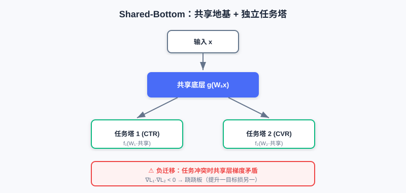
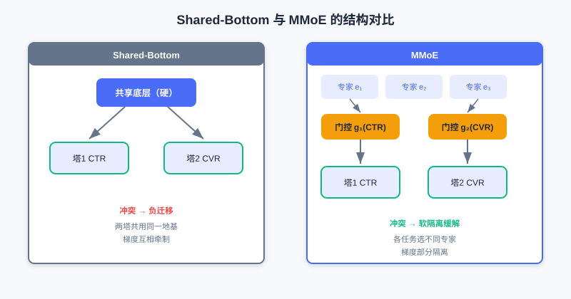
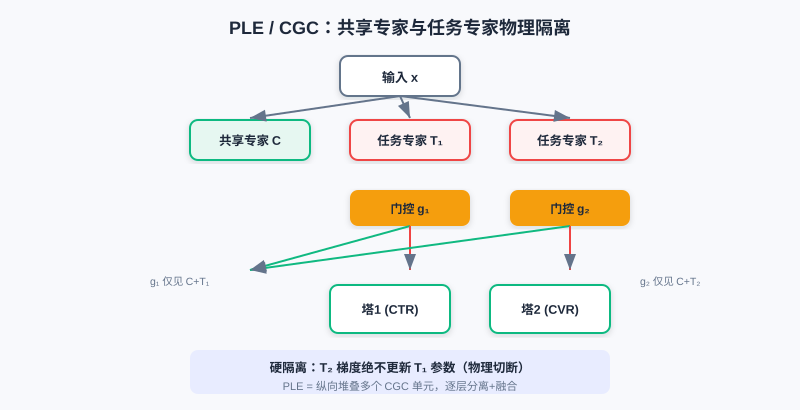
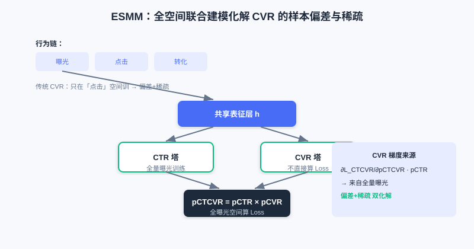

  📖
  ⏱️ ~50 min read
  🎯 Intermediate

# 多目标优化

> 📝 **Before You Continue:** 建议先读完 [3.1 Wide & Deep](./wide-and-deep.md)。多目标模型的"共享底座 + 任务塔"结构，正是 Wide&Deep 思想的延伸与多任务化。

前面的章节都在优化 **单一目标** （通常是点击率）。但真实推荐系统几乎总是"既要又要"：电商要同时优化点击率（CTR）和转化率（CVR），内容平台要兼顾消费深度与广告曝光。当多个目标放到一个模型里，麻烦就来了——目标之间可能冲突，硬共享会导致"跷跷板"：提升一个就牺牲另一个。

本章我们沿着"如何缓解多任务冲突"的主线，从最朴素的 **Shared-Bottom** ，到 **MMoE** （多门控）、**PLE** （显式专家分离），再扩展到存在 **依赖关系** 的 **ESMM / ESM2** ，最后讨论多损失如何 **融合优化**。核心始终是那句话：每个结构改进，都是为了解决前一个方法的什么不足。

读完本章，你将能够：

- 解释 **Shared-Bottom** 的"负迁移 / 跷跷板"问题，及其数学来源（梯度冲突）
- 说明 **MMoE** 如何用"每任务专属门控"实现梯度隔离，缓解冲突
- 描述 **PLE（CGC）** 如何显式分离共享专家与任务专家，进一步根除负迁移
- 用 **ESMM** 的"全空间建模"解释它如何化解 CVR 的样本选择偏差与数据稀疏
- 完成 4 道分层练习题，比较多目标结构与损失融合策略

---

## 3.4.0 动机：当目标不止一个

多目标建模与单目标最大的不同，是目标之间会 **打架**。比如在电商同时优化"点击率"和"客单价"：低价商品拉高点击却压低客单价；内容平台平衡"消费深度"与"广告曝光"时，深度阅读往往与广告点击负相关。

> 💡 **Key Insight:** 当任务 $i,j$ 的梯度方向相反（$\nabla L_i \cdot \nabla L_j < 0$），共享层参数更新就会陷入方向性矛盾——这叫**负迁移**，也常被称作**跷跷板问题**：提升一目标常以牺牲另一目标为代价。多目标模型的设计，本质就是"如何减少这种冲突"。

### 🧠 Mental Model: 一栋楼里的几家租户

> 把 **Shared-Bottom** 想成一栋**共享地基的楼**，每家租户（任务）在地基上盖自己的塔。地基便宜高效，但一家要改结构，整栋都可能裂——这就是负迁移。MMoE 给每家配了**独立的电梯调度**（门控），各家按需用不同专家；PLE 更彻底，给每家**专属房间**（任务专家）+ 公共客厅（共享专家），物理隔离、互不干扰。

---

## 3.4.1 基础结构：Shared-Bottom 与 MMoE

**Shared-Bottom** 是多目标奠基架构："共享地基 + 独立塔楼"。所有任务共用特征转换层 $g(\cdot)$，各自有任务塔 $f_t$：

$$\hat{y}_t = f_t(W_t \cdot g(W_s \boldsymbol{x}))$$

它参数高效（共享层占大部分参数）、有正则化效应（防单任务过拟合）、能在相关任务间迁移知识。但致命缺陷是 **负迁移** ：当任务本质冲突，硬共享的共享层梯度由所有任务共同决定，方向矛盾时优化陷入零和博弈。

Shared-Bottom 所有任务硬共享底层 $g(\cdot)$，各自盖独立任务塔 $f_t$；任务冲突时共享层梯度方向矛盾，陷入零和博弈（负迁移）。

**MMoE（Multi-gate Mixture-of-Experts）** 针对负迁移，把"全局共享的一个门控"升级为"每任务专属门控"。每个专家 $e_k=f_k(x)$ 被所有任务共享，但任务 $t$ 有自己的门控 $g_t(x)=\text{softmax}(W_t x)$ 来加权融合专家：

$$\boldsymbol{h}_t = \sum_{k=1}^K g_{t,k}\cdot \boldsymbol{e}_k,\quad \hat{y}_t = f_t(\boldsymbol{h}_t)$$

当任务 $i,j$ 冲突时，门控让两者学 **不同的专家权重分布**——某专家 $e_m$ 在任务 $i$ 门控里权重高、在任务 $j$ 里权重低，于是 $e_m$ 的参数更新主要由任务 $i$ 的梯度决定，任务 $j$ 影响很小，实现 **梯度隔离**。

左：Shared-Bottom 所有任务硬共享底层，冲突时负迁移。右：MMoE 每任务有专属门控，按需选专家，缓解冲突。

> **Analysis:** MMoE 以"多门控"低成本缓解低相关任务冲突，参数效率仍高。局限：所有专家对所有任务门控**可见**——即便某专家被任务 $j$ 门控忽略，其梯度在反传时仍可能流经它（潜在通路），强冲突下共享表征仍可能被污染；且门控需在所有专家上分配权重，专家变多时决策负担重。

---

## 3.4.2 PLE：显式专家分离

MMoE 的"软隔离"没根除负迁移： **干扰路径未切断** （专家仍对所有门控可见）、**专家角色模糊** （一个专家可能既承载共享又承载多任务特定信息）。PLE（Progressive Layered Extraction）用 **CGC（Customized Gate Control）** 结构，通过 **硬性结构约束** 显式分离共享知识与任务特定知识。

CGC 把专家分成两类：

- **共享专家（C-Experts）** ：只学所有任务共性，输出 $\{c_1,\ldots,c_M\}$。
- **任务专家（T-Experts）** ：任务 $t$ 专属，只学该任务特定模式，输出 $\{t_t^1,\ldots,t_t^{N_t}\}$。

关键约束：任务 $t$ 的门控 $g_t$ **输入被限制为**"共享专家 + 本任务专属专家"， **完全无法访问** 其他任务的专属专家。于是任务 $s$ 的梯度绝不会更新任务 $t$ 的专属专家参数——**物理切断干扰路径**。融合为：

$$\boldsymbol{h}_t = \sum_{k=1}^M g_{t,k}\cdot \boldsymbol{c}_k + \sum_{j=1}^{N_t} g_{t,M+j}\cdot \boldsymbol{t}_t^j$$

PLE 把多个 CGC 单元 **纵向堆叠** ，形成深层架构，逐层做"显式知识分离 + 融合"，实现渐进式提取。

CGC 中每任务只有"共享专家 + 自己专属专家"可见，其他任务的专属专家被物理隔离；PLE 纵向堆叠多个 CGC 单元，逐层深化。

> 💡 **Key Insight:** Shared-Bottom（硬共享）→ MMoE（软隔离，多门控）→ PLE（硬隔离，专家分离），是一条"冲突缓解逐步加强"的清晰主线。代价是 PLE 参数更多、结构更复杂，但换来更稳的多任务学习。

---

## 3.4.3 任务依赖建模：ESMM 与 ESM2

前面方法解决任务间"相关性冲突"，但现实任务常有明确 **依赖关系**。用户行为有天然时序链：曝光 → 点击 → 转化。传统 CVR 模型只在点击样本上训练，线上却要在全量曝光上预测，带来两大问题：

1. **样本选择偏差（Sample Selection Bias）** ：训练/预估样本分布不同，泛化差。
2. **数据稀疏性（Data Sparsity）** ：转化样本 = 曝光 × CTR × CVR（如 CTR≈2%、CVR≈0.5%，转化仅曝光万分之一），极稀疏。

**ESMM（Entire Space Multi-task Model）** 用概率图约束重建任务关系。它同时训 CTR 塔和 CVR 塔，但 **不直接拿 CVR 算 Loss** ，而是用 $pCTCVR = pCTR \times pCVR$ 在全曝光空间算 Loss：

$$\mathcal{L} = \mathcal{L}_{CTR} + \mathcal{L}_{CTCVR}$$

其中 $\mathcal{L}_{CTR}$ 用全量曝光样本（标准二分类交叉熵），$\mathcal{L}_{CTCVR}$ 用 $pCTCVR=pCTR\cdot pCVR$ 在全空间算。这样 **CVR 塔的梯度也在曝光空间进行** ，彻底化解样本选择偏差与稀疏性——CVR 塔借 CTR 塔的全量样本"间接"学好。

**ESM2** 把思想扩展到更长链路（曝光→点击→加购DAction→购买）。它设四个塔预测 $y_1$（点击|曝光）、$y_2$（决定行为|点击）、$y_3$（购买|决定行为）、$y_4$（购买|其他行为），但只算三个全空间 Loss（$\mathcal{L}_{ctr}$、$\mathcal{L}_{ctavr}$、$\mathcal{L}_{ctcvr}$），同样都在曝光空间优化。最终 $pCTCVR = y_1(y_2\cdot y_3 + (1-y_2)\cdot y_4)$ 合并两条购买路径。

ESMM 同时训 CTR 与 CVR 塔，用 $pCTCVR=pCTR\times pCVR$ 在全曝光空间算 Loss，使 CVR 梯度也来自全量样本，化解偏差与稀疏。

> **Analysis:** ESMM/ESM2 的"全空间建模"思路巧妙地用**乘积关系**把依赖目标拉回同一训练空间，是处理任务依赖的标准解法。局限：它假设 CTR、CVR 建模共享底层（可用 MMoE/PLE 替换底座增强），且依赖"链路可分解为概率乘积"的业务假设。

---

## 3.4.4 多目标损失融合

当结构确定，多个损失的联合优化本身就是学问。朴素加权 $\mathcal{L}_{total}=\sum_i w_i \mathcal{L}_i$ 有三个本质缺陷：量级失衡（CTR 损失 0.1–0.5，CVR 可达 2.0+，大损失主导）、收敛异步（稀疏任务慢）、梯度冲突（任务梯度夹角 >90° 时抵消）。主流自适应方法有三类：

- **Uncertainty Weight（UWL）** ：按任务不确定性 $\sigma$（可学习）动态调权，$\mathcal{L}=\frac{1}{2\sigma_1^2}\mathcal{L}_1+\frac{1}{\sigma_2^2}\mathcal{L}_2+\log\sigma_1+\log\sigma_2$。损失大且不确定小则权重被压低，防被单任务带偏。
- **GradNorm** ：引入梯度损失，按"梯度量级 $G_W^{(i)}$"与"相对训练速率 $r_i(t)$"动态调权，让各任务梯度量级与速率趋向均衡，避免快任务主导、慢任务欠拟合。
- **Pareto Optimization** ：当梯度方向根本冲突（优化 A 必损 B），用 KKT 条件把权重写成可学习变量，交替更新参数 $\theta$ 与权重 $w_i$（满足 $\sum w_i=1, w_i\ge c_i$），把优化引向 **帕累托前沿** （不存在不损一任务而改进另一任务的解）。

> 💡 **Key Insight:** 损失融合策略与网络结构**正交**——无论用 Shared-Bottom、MMoE 还是 PLE，都可在最外层套一层 UWL / GradNorm / Pareto 来平衡多损失。结构解决"表征冲突"，损失融合解决"优化冲突"。

---

## ⚠️ Common Mistakes in 3.4

| # | Mistake | Example | Why It's Wrong | Fix |
|---|---------|---------|---------------|-----|
| 1 | 以为共享底座总有益 | "多任务一律用 Shared-Bottom 最省" | 任务冲突时硬共享导致负迁移（跷跷板） | 冲突任务改用 MMoE / PLE |
| 2 | 混淆 MMoE 与 PLE 隔离程度 | "MMoE 已经彻底分开了专家" | MMoE 是软隔离，专家仍对所有门控可见 | PLE 用 CGC 物理隔离任务专家 |
| 3 | 直接拿 CVR 塔算 Loss | "ESMM 和 MMoE 一样训 CVR" | 这会带来样本选择偏差与稀疏 | ESMM 用 $pCTR\times pCVR$ 全空间算 |
| 4 | 手工固定损失权重 | "w_ctr=1, w_cvr=1 就行" | 量级/收敛速度不同，大损失主导 | 用 UWL / GradNorm / Pareto 自适应 |

---

## 本章小结

### 📌 Key Takeaways

| Concept | Key Points | Why It Matters |
|---------|-----------|----------------|
| 负迁移/跷跷板 | $\nabla L_i\cdot\nabla L_j<0$ 梯度冲突 | 多任务硬共享的根本风险 |
| Shared-Bottom | 共享层 + 任务塔，参数高效 | 任务相关时好；冲突时负迁移 |
| MMoE 多门控 | 每任务专属门控选专家，梯度隔离 | 软隔离缓解冲突 |
| PLE/CGC | 共享专家 + 任务专家物理隔离 | 硬隔离，根除干扰路径 |
| ESMM 全空间 | $pCTCVR=pCTR\cdot pCVR$ | 化解 CVR 偏差+稀疏 |
| 损失融合 | UWL / GradNorm / Pareto | 解决优化层冲突 |

### ❓ FAQ

**Q1: 我该用 Shared-Bottom、MMoE 还是 PLE？**
> A: 任务高度相关 → Shared-Bottom 够用且省；任务弱相关、有冲突 → MMoE；任务强冲突或需稳定 → PLE。本质是"冲突越强，隔离越硬"。

**Q2: ESMM 一定要和 MMoE 一起用吗？**
> A: 不必。ESMM 是"全空间概率建模"思想，原论文底座可用简单 Shared-Bottom，也可替换为 MMoE/PLE 增强底层表征，二者正交。

**Q3: 损失融合和选结构哪个更重要？**
> A: 都重要且互补。结构决定"表征能否分离冲突"，损失融合决定"多损失能否平衡优化"。工程中常先定结构，再调损失融合策略。

### 前后关联

- **3.5（多场景）** 把"多任务差异"换成"多场景分布差异"，多塔/动态权重与 MMoE 思想同宗。
- **3.3（序列建模）** 的 DIN 等常作为多目标模型的底层 backbone。
- **Part 4 重排** 在排序（多目标打分）之上优化列表级体验，多目标分数是重排输入。

---

## Practice Problems

Work through all problems in order — they get progressively harder. Each has a complete solution you can reveal after trying it yourself.

---

**Problem 3.4.1 — 识别负迁移** 🟢 Easy

某内容 App 同时优化"消费深度（阅读时长）"与"广告曝光量"。工程师发现：提升广告曝光后，阅读时长明显下降。请判断这是否为负迁移，并说明数学上的成因。

💡 Solution (click to reveal)

**Approach:** 判断是否符合"提升一目标损害另一目标"的跷跷板特征，并用梯度冲突解释。

是负迁移。两目标呈负相关，共享层梯度方向相反：$\nabla L_{深度}\cdot\nabla L_{广告}<0$。Shared-Bottom 硬共享使参数更新方向矛盾，优化一个必损另一个，陷入零和。

**Key points:**
- 跷跷板 = 负相关目标的硬共享冲突。
- 解法：改用 MMoE/PLE 隔离冲突路径。

---

**Problem 3.4.2 — MMoE vs PLE** 🟢 Easy

判断下列说法正误并改正：

- (a) MMoE 中每个任务有专属门控，因此任务间已无梯度干扰。
- (b) PLE 的 CGC 让任务 $t$ 的门控也能看到任务 $s$ 的专属专家。

💡 Solution (click to reveal)

**Approach:** 抓"软隔离 vs 硬隔离"的区别。

- (a) **错误** ：MMoE 是软隔离——专家仍对所有门控可见，即便被忽略，反传时梯度仍可能流经它（潜在通路）。PLE 才物理隔离。
- (b) **错误** ：CGC 硬性约束任务 $t$ 门控 **输入仅为**"共享专家 + 本任务专属专家"， **完全看不到** 其他任务专属专家；任务 $s$ 梯度不会更新任务 $t$ 专属专家。

**Key points:**
- MMoE=软隔离；PLE/CGC=硬隔离。
- 隔离程度递进：Shared-Bottom < MMoE < PLE。

---

**Problem 3.4.3 — ESMM 动机** 🟡 Medium

为什么传统 CVR 模型在"点击样本上训练、全量曝光上预测"会出问题？ESMM 如何用 $pCTCVR=pCTR\times pCVR$ 解决？

💡 Solution (click to reveal)

**Approach:** 从样本空间不一致 + 稀疏两个角度切入。

传统 CVR 只在点击样本（CTR 正样本）训练，但线上要对全量曝光预估，训练/预估分布不同 → **样本选择偏差** ，泛化差；且转化样本极稀疏（曝光×CTR×CVR），难学。

ESMM 同时训 CTR 与 CVR 塔，但 CVR 不直接算 Loss，而是用 $pCTCVR=pCTR\times pCVR$ 在全曝光空间算 $\mathcal{L}_{CTCVR}$。于是 CVR 塔梯度经 $pCTR$ 来自 **全量曝光样本** ，偏差与稀疏都被化解——CVR 间接借 CTR 的全量数据学好。

**Key points:**
- 偏差根因：训练空间（点击）≠ 预估空间（曝光）。
- 解法：乘积关系把 CVR 拉回全空间。

---

**Problem 3.4.4 — 证明负迁移的梯度冲突** 🔴 Hard

设共享参数 $\theta$ 同时服务任务 1、2，损失变化近似 $\Delta L_t \approx \nabla L_t \cdot \Delta\theta$。若采用统一梯度下降 $\Delta\theta = -\eta(\nabla L_1 + \nabla L_2)$，且已知 $\nabla L_1 \cdot \nabla L_2 < 0$（夹角 >90°），请证明：至少其中一个任务的损失会上升。

💡 Solution (click to reveal)

**Approach:** 代入 $\Delta\theta$ 看各任务损失变化。

$\Delta L_1 \approx -\eta\nabla L_1\cdot(\nabla L_1+\nabla L_2) = -\eta(\|\nabla L_1\|^2 + \nabla L_1\cdot\nabla L_2)$。因 $\nabla L_1\cdot\nabla L_2<0$，第二项为正，会 **抵消** 第一项的下降；若 $|\nabla L_1\cdot\nabla L_2| > \|\nabla L_1\|^2$，则 $\Delta L_1>0$，任务1损失上升。同理对任务2对称成立。既然两梯度反向，统一更新方向不可能同时让两者下降——必有一方受损，这正是跷跷板/负迁移的数学本质。

**Key points:**
- 梯度反向 → 共享参数更新方向"两难"。
- 这解释了为何需 MMoE/PLE 隔离、或 Pareto 优化找不损解。

---

**🏆 Challenge: 设计多目标方案**

某电商要同时优化 CTR、CVR、客单价三目标，其中 CTR 与 CVR 有依赖（ESMM 式），CVR 与客单价常冲突（跷跷板）。请组合合适结构并说明理由（150 字内），并指出损失融合策略。

💡 Hint

底层用 **PLE/CGC** 隔离 CVR 与客单价冲突（硬隔离）；CTR-CVR 依赖用 **ESMM 式乘积** 在全空间联合（可把 CTR/CVR 塔放进共享底座）。损失层用 **GradNorm 或 UWL** 自适应平衡三损失量级与收敛速度。

