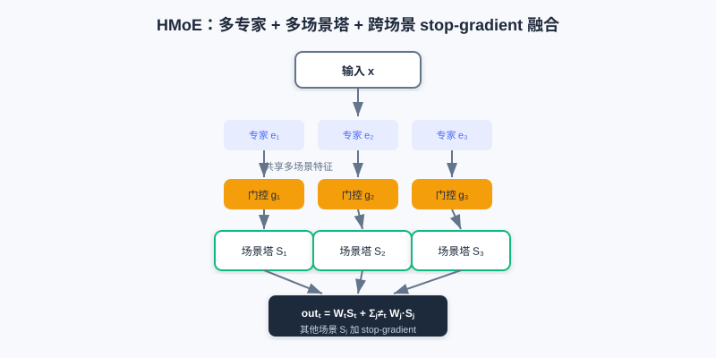
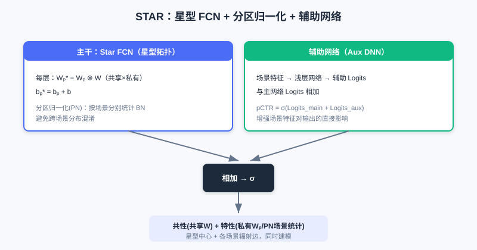
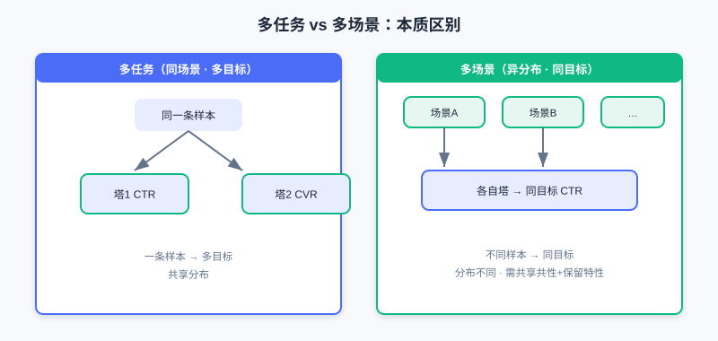
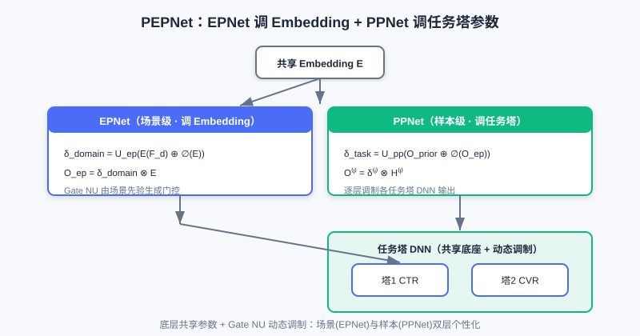

  📖
  ⏱️ ~50 min read
  🎯 Intermediate

# 多场景建模

> 📝 **Before You Continue:** 建议先读完 [3.4 多目标优化](./multi-objective.md)。多场景与多任务"形似神异"——多任务处理同场景多目标，多场景处理不同场景同目标，二者都建立在"共享 + 差异化"的设计哲学上。

[3.4](./multi-objective.md) 解决了"同一条样本预估多个目标"的多任务问题。但工业推荐常面对 **多个场景** ：同一 App 可能有首页推荐、搜索结果页、购物车下方的"猜你喜欢"——这些场景数据分布不同，却要预估 **同一个目标** （如 CTR）。这就是 **多场景建模**。

若为每个场景训独立模型，会忽视场景共性、小场景数据少效果差、资源剧增；若混合样本训单一模型，又忽视场景差异、精度下降。本章我们从"多塔结构"（HMoE、STAR）讲到"动态权重建模"（PEPNet、APG、M2M），看如何兼顾 **场景共性** 与 **场景特性**。

读完本章，你将能够：

- **区分** 多任务（同场景多目标）与多场景（不同场景同目标）的本质差异
- 解释 **HMoE** 如何用多专家 + 多场景塔 + 跨场景融合（含 stop-gradient）建模共性
- 说明 **STAR** 如何用"星型 FCN + 分区归一化 + 辅助网络"同时建模共享与私有参数
- 描述 **PEPNet** 的 EPNet/PPNet 如何用动态门控（Gate NU）调制共享参数
- 完成 4 道分层练习题，比较多场景结构的"物理隔离"与"动态调制"两条路线

---

## 3.5.0 动机：多任务 ≠ 多场景

先厘清一个常见混淆：

- **多任务学习** ：同一样本、同一场景，预估 **多个不同目标** （如一条样本同时给 CTR、CVR）。
- **多场景建模** ：不同场景、不同分布，预估 **同一个目标** （如不同场景各预估 CTR）。

前者是"一条样本多目标"，后者是"不同样本同目标"。多场景若用独立模型忽视共性（小场景差、资源炸），若混训单一模型忽视差异（精度降）。

> 💡 **Key Insight:** 多场景建模的核心张力是——**如何在共享底层参数（抓共性）的同时，让模型感知场景差异（抓特性）**。本章两条路线：①**多塔结构**（物理隔离部分参数）；②**动态权重**（共享参数 + 场景/样本调制）。

### 🧠 Mental Model: 连锁店 vs 中央厨房

> 把多场景想成一家公司的**多个门店**（场景）。① 多塔结构像"每个门店有自己的后厨（场景塔），但共享中央厨房的半成品（共享专家）"。② 动态权重像"所有门店用同一套中央厨房，但每个门店有一台'口味调节器'（Gate NU），按本地顾客偏好微调同一份菜"。前者分厨房，后者调味道。

---

## 3.5.1 多塔结构：HMoE 与 STAR

**HMoE（Hierarchical Mixture-of-Experts）** 借鉴 MMoE：底层多专家提多场景共享特征，顶层是 **多个场景塔** （而非多任务塔）。对场景 $t$，底层经门控融合专家得 $M_t(x)=\sum_i G_i^t(x)E_i(x)$，最终打分融合多场景输出：

$$out_t(x) = W_t(x)S_t(x) + \sum_{j\neq t} W_j(x)\underbrace{S_j(x)}_{\text{stop gradient}}$$

关键是：融合其他场景打分时，用 **stop-gradient** 阻断其梯度回传——避免场景 $a$ 的样本直接改场景 $b$ 的参数，保住场景感知。这使某场景 $t$ 既用自己的塔，也借其他场景打分作参考，又不互相污染。

HMoE 底层多专家提取跨场景共享特征，顶层每个场景一个专属场景塔；融合他场景打分时用 stop-gradient 阻断梯度，既借共性又互不污染。

**STAR（Star Topology Adaptive Recommender）** 用星型拓扑同时建模共享与私有参数。其 **STAR FCN** 对每个场景的层参数做"共享 + 私有"的元素积融合：

$$W_p^\star = W_p \otimes W,\quad b_p^\star = b_p + b$$

其中 $W_p,W$ 分别是场景私有与全局共享参数。STAR 还有两项创新： **分区归一化（PN）**——按场景分别统计 Batch Norm 的均值/方差（避免跨场景统计混淆）； **辅助网络**——把场景特征经浅层网络得辅助 Logits，与主干相加：$pCTR=\sigma(\text{Logits}_{main}+\text{Logits}_{aux})$。

STAR 用星型 FCN 把"共享中心 × 场景私有"做元素积融合，再配分区归一化（按场景分别统计）与辅助网络，在参数与归一化两层都区分场景。

左：多任务——同一样本、多目标塔。右：多场景——不同场景样本、同目标塔；挑战是共享共性与保留差异。

> **Analysis:** 多塔结构（HMoE/STAR）用"物理隔离的部分参数"保场景特性，直观、可解释。HMoE 的 stop-gradient 防场景污染；STAR 的星型 FCN + PN 在参数与归一化两层都分场景。代价是参数量随场景数增长（每场景一份塔/私有参数）。

---

## 3.5.2 动态权重建模：PEPNet

多塔靠"分厨房"保特性，但参数不够共享。PEPNet（Parameter and Embedding Personalized Network）换思路：核心网络参数 **跨场景共享** ，但通过动态生成的、与场景/样本高度相关的 **权重** 来"调制"（Modulate）共享参数的行为——相当于给共享网络注入上下文。

PEPNet 的核心是轻量门控单元 **Gate NU** （受语音识别 LHUC 启发），用两层网络生成动态缩放权重：

$$\boldsymbol{x}'=\text{ReLU}(\boldsymbol{x}W_1+b_1),\quad \delta=\gamma\cdot\text{Sigmoid}(\boldsymbol{x}'W_2+b_2)\in[0,\gamma]$$

输出 $\delta$ 与目标参数维度对齐，通过逐元素相乘 $\otimes$ 实现调制。PEPNet 用两大模块做分层个性化：

- **EPNet（场景感知 Embedding 个性化）** ：把场景先验信息经 Gate NU 生成门控 $\delta_{domain}=U_{ep}(E(\mathcal{F}_d)\oplus \oslash(E))$，与共享 Embedding 元素乘得场景个性化 Embedding $O_{ep}=\delta_{domain}\otimes E$。注意对共享 Embedding 用 stop-gradient，不影响底层学习。
- **PPNet（用户感知参数个性化）** ：把用户/内容/作者 ID 先验 + EPNet 的场景 Embedding 作输入，生成逐层、逐任务塔的门控 $\delta_{task}$，对任务塔 DNN 每层输出做调制 $O_{pp}^{(l)}=\delta_{task}^{(l)}\otimes H^{(l)}$。这是样本粒度（而非任务粒度）的个性化，缓解多任务跷跷板。

Gate NU 由场景/用户先验生成动态缩放权重；EPNet 调制共享 Embedding（场景个性化），PPNet 调制各任务塔 DNN（样本个性化），底层仍共享。

---

## 3.5.3 动态参数生成：APG 与 M2M

**APG（Adaptive Parameter Generation）** 走得更远：根据样本 **直接动态生成** 该样本对应的参数。把样本感知输入 $z_i$ 经 MLP reshape 成参数矩阵 $W_i=\text{reshape}(\text{MLP}(z_i))$，预测 $y_i=\sigma(W_i x_i)$。为控开销，APG 做 **低秩分解** ：$W_i=U_i S_i V_i$，其中私有因子 $S_i$ 从样本生成、共享因子 $U,V$ 固定；前向用分解计算 $y_i=\sigma(U_i(S_i(V_i x_i)))$ 降低复杂度。共享 $U/V$ 刻画共性、私有 $S_i$ 刻画特性，兼顾容量与效率。

**M2M（元学习多场景多任务）** 用元学习器（MLP）根据场景/输入特征 **动态生成** 任务模型的参数 $(W,b)$。主干网络含专家表征 $E_i$、任务表征 $T_t$、场景表征 $\tilde{S}$；元学习单元把场景表征 $\tilde{S}$ 转成每层动态参数，作用于特征（类似注入了场景信息的 MLP）。它还在专家融合（Attention 元网络，融合时引入场景）与多任务塔（Tower 元网络，残差方式）都用了元学习单元，实现细粒度场景自适应。

> 💡 **Key Insight:** 多场景建模的两条路线殊途同归——**多塔结构**用"物理隔离的参数空间"保特性（分而治之）；**动态权重/参数生成**用"共享底座 + 动态调制"保特性（注入上下文）。后者参数更高效、更灵活，但对调制/生成机制设计要求更高。

---

## ⚠️ Common Mistakes in 3.5

| # | Mistake | Example | Why It's Wrong | Fix |
|---|---------|---------|---------------|-----|
| 1 | 把多场景当多任务 | "多场景就是多任务，换名字而已" | 多场景=不同分布同目标；多任务=同分布多目标 | 先判"样本分布是否不同" |
| 2 | HMoE 融合不打 stop-gradient | "跨场景打分直接相加梯度也回传" | 场景 a 样本会改场景 b 参数，污染感知 | 其他场景打分加 stop-gradient |
| 3 | STAR 忽略 PN 的动机 | "BN 全局统计就行" | 多场景混合样本不独立同分布 | 用分区归一化按场景分别统计 |
| 4 | 混淆 EPNet 与 PPNet | "两者都调任务塔" | EPNet 调 Embedding（场景），PPNet 调塔（样本） | EPNet=场景级，PPNet=样本级 |

---

## 本章小结

### 📌 Key Takeaways

| Concept | Key Points | Why It Matters |
|---------|-----------|----------------|
| 多场景 vs 多任务 | 异分布同目标 vs 同分布多目标 | 建模前先分清问题类型 |
| HMoE 多塔 | 多专家+场景塔+跨场景 stop-gradient 融合 | 共享共性、保场景感知 |
| STAR 星型 | 共享⊗私有参数 + 分区归一化 + 辅助网络 | 参数与归一化都分场景 |
| PEPNet | Gate NU 动态调制：EPNet(Embedding)+PPNet(塔) | 共享底座+动态个性化 |
| APG/M2M | 样本/场景动态生成参数（元学习） | 最灵活，参数高效 |

### ❓ FAQ

**Q1: 什么时候用多塔、什么时候用动态权重？**
> A: 场景数不多、差异大、要强可解释 → 多塔（HMoE/STAR）；场景多、参数效率敏感、要细粒度样本个性化 → 动态权重（PEPNet/APG/M2M）。二者也可组合。

**Q2: STAR 的星型 FCN 为什么要元素积？**
> A: $W_p^\star=W_p\otimes W$ 让每个场景的最终参数是"共享中心 × 场景增量"——既继承共性，又带场景特性；乘法（而非仅相加）让私有参数对共享做"增强/抑制"式调制。

**Q3: PEPNet 的 EPNet 为什么要对共享 Embedding stop-gradient？**
> A: 防止场景个性化门控支路的反向梯度破坏底层共享 Embedding 的通用学习，让"共性"与"场景差异"解耦。

### 前后关联

- **3.4（多目标）** MMoE/PLE 思想在多场景中演化为 HMoE 的多专家+多塔；PEPNet 的 PPNet 同时缓解多任务跷跷板。
- **Part 4 重排** 在精排（多场景多目标打分）之上优化列表体验。
- **生成式推荐（下篇）** 的端到端架构，可视为对"多场景/多任务分塔"的进一步统一。

---

## Practice Problems

Work through all problems in order — they get progressively harder. Each has a complete solution you can reveal after yourself.

---

**Problem 3.5.1 — 区分多任务与多场景** 🟢 Easy

判断下列情形属于"多任务"还是"多场景"，并说明理由：

- (a) 同一首页推荐流，一条样本同时预估点击率与转化率。
- (b) 同一 App 的"首页推荐"与"搜索结果页"两个分布不同的流量，各自预估点击率。

💡 Solution (click to reveal)

**Approach:** 看"样本分布是否相同、目标是否相同"。

- (a) **多任务** ：同场景（首页）、同分布，预估 **多个不同目标** （CTR、CVR）。
- (b) **多场景** ：不同分布（首页 vs 搜索）、不同样本，预估 **同一目标** （CTR）。

**Key points:**
- 多任务=同分布多目标；多场景=异分布同目标。
- 二者都靠"共享+差异化"，但差异化针对的是"目标"还是"分布"。

---

**Problem 3.5.2 — HMoE 的 stop-gradient** 🟢 Easy

HMoE 在融合其他场景打分时用了 stop-gradient。请简述：若 **不用** stop-gradient，会发生什么问题？

💡 Solution (click to reveal)

**Approach:** 从"场景参数污染"角度想。

HMoE 融合公式里其他场景的 $S_j(x)$ 加 stop-gradient，是为阻断其梯度回传。若不用：场景 $a$ 的样本在前向参与了场景 $b$ 打分的融合，反向时梯度会顺着融合路径改到场景 $b$ 的塔参数，使场景 $b$ 的表示被场景 $a$ 的样本干扰，模型对场景的感知下降，多场景效果变差。

**Key points:**
- stop-gradient 隔离跨场景梯度，保住"每场景只影响自身参数"。
- 这是 HMoE 既能借他场景信息、又不互相污染的关键。

---

**Problem 3.5.3 — STAR 的创新点** 🟡 Medium

STAR 相比"给每个场景独立训一个模型"，做了哪些共享设计来兼顾共性与特性？请列出至少两点并说明作用。

💡 Solution (click to reveal)

**Approach:** 回忆 STAR 的三大创新。

1. **星型 FCN** ：$W_p^\star=W_p\otimes W$——每个场景参数 = 共享中心 × 场景私有，既继承共性又带特性，避免完全独立模型。
2. **分区归一化（PN）** ：按场景分别统计 BN 的均值/方差，避免多场景混合样本不独立同分布导致的统计混淆。
3. **辅助网络** ：场景特征经浅层网络得辅助 Logits，与主干相加，增强场景特征对输出的直接影响。

**Key points:**
- 共性靠共享 $W$ / PN 共享参数；特性靠 $W_p$ / PN 场景私有统计。
- 比独立模型省参数、小场景也能借共性。

---

**Problem 3.5.4 — 小场景与星型共享** 🔴 Hard

STAR 用 $W_p^\star = W_p \otimes W$：每场景私有参数 $W_p$ 与全局共享 $W$ 元素积融合。若某场景数据极少，其私有参数 $W_p$ 易过拟合。请结合星型结构说明：为何共享中心 $W$ 能缓解该问题？并指出现 PN（分区归一化）在此场景的额外作用。

💡 Solution (click to reveal)

**Approach:** 从"私有参数量小、受共享约束"与"归一化稳定性"两个角度看。

1. 最终参数是 $W_p\otimes W$：私有 $W_p$ 虽小样本易过拟合，但它只做"对共享中心 $W$ 的增强/抑制"式调制，主体能力仍来自数据充足的共享 $W$。私有参数维度相对小、且乘性受共享约束，过拟合影响被稀释——相当于用共享做正则。
2. PN 按场景分别统计 BN 的均值/方差。小场景若混入全局混合批，统计量被大场景主导、归一化不稳；PN 让小场景用 **自己的** 统计，训练更稳，进一步缓解小样本下的表示偏移。

**Key points:**
- 星型 = 共享兜底 + 私有微调，天然抗小场景过拟合。
- PN 补充分布层面的场景隔离。

---

**🏆 Challenge: 选路线论证**

某平台有 6 个不同场景（首页/搜索/购物车/频道页/推送/信息流），都预估 CTR，其中 3 个场景数据极少。团队资源有限，希望参数高效且小场景不崩。请选择"多塔结构"或"动态权重"路线并说明理由（150 字内），并指出若选动态权重可用哪个具体模型打底。

💡 Hint

6 场景、参数敏感、小场景弱 → 选 **动态权重** 路线：共享底座+动态调制，参数高效、小场景借共享共性不崩。可用 **PEPNet** （Gate NU 调 Embedding 与塔）或 **APG** （样本动态生成参数）打底；多塔在 6 场景下参数随场景线性增长、小场景独立塔易欠拟合。

