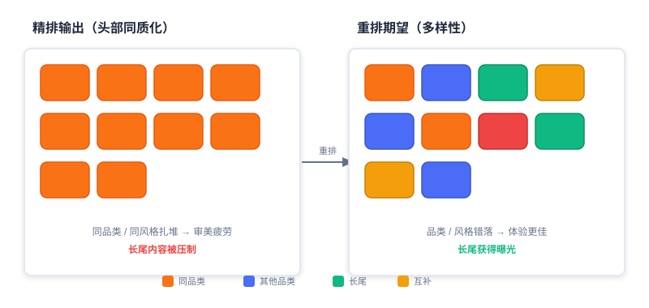
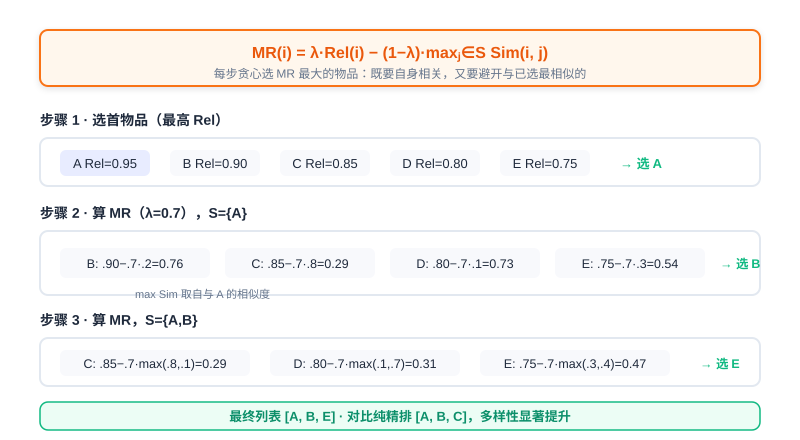
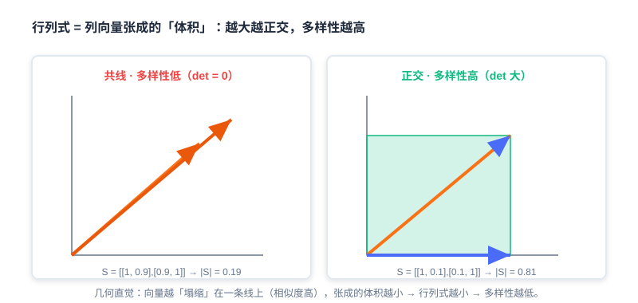
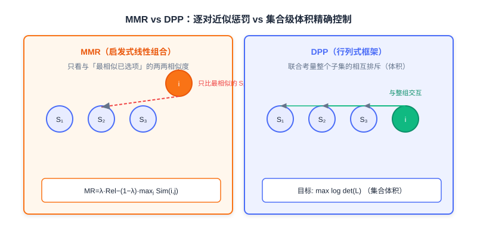

<div class="badge-row">
  <span style="background: #f0f4ff; color: #4A6CF7; padding: 4px 12px; border-radius: 20px; font-size: 0.85em; font-weight: 600; border: 1px solid rgba(74,108,247,0.2);">📖</span>
  <span style="background: #f0fdf4; color: #16a34a; padding: 4px 12px; border-radius: 20px; font-size: 0.85em; border: 1px solid rgba(22,163,74,0.2);">⏱️ ~32 min read</span>
  <span style="background: #fef9ec; color: #d97706; padding: 4px 12px; border-radius: 20px; font-size: 0.85em; border: 1px solid rgba(100,100,100,0.15);">🎯 Intermediate</span>
</div>

# 基于贪心的重排

> 📝 **Before You Continue:** 请先读完 [Part 3 排序](../part3-ranking/README.md) 的打分函数 $f$，理解精排如何为每个候选输出一个相关性分数（如 CTR 预估分）。本章正是站在精排之后，对那份「按分数排序」的列表做最后一里路的优化。

想象一下：精排模型自信地交出一份列表，头部十位是十部高度雷同的「科幻动作片」。单看每个位置，分数都很高、都很相关；但连成一张列表，用户立刻感到审美疲劳。这就是重排要解决的真实痛点——**排序输出同质化**。

重排（Re-ranking）处在「召回→排序→重排」漏斗的最末端，它的职责不是再算一遍精度，而是回答一个更刁钻的问题： **在保持相关性的前提下，如何让整张列表的体验最好？** 贪心算法因其思路直观、计算高效、易于实现，成为重排阶段解决多样性、新颖性等问题的首选策略之一。它们通常 **不依赖复杂模型训练** ，而是基于预先定义的规则或目标函数，通过逐步选择当前最优解（贪心选择）来构建最终列表。

本章深入剖析两种经典的贪心重排算法： **最大边际相关（Maximal Marginal Relevance, MMR）** 与 **行列式点过程（Determinantal Point Process, DPP）**。

读完本章，你将能够：

- **解释** 排序输出的「同质化」现象，以及它造成的用户体验与生态效率两类代价
- **写出** MMR 的边际收益公式，并用贪心过程在给定相似度矩阵上手算出 top-k 列表
- **描述** DPP 如何用「行列式 = 体积」的几何直觉度量集合级多样性
- **推导** DPP 核矩阵 $L = \text{Diag}(r)\cdot S \cdot \text{Diag}(r)$，并说清相关性项与多样性项如何融合
- **辨析** MMR（启发式线性组合）与 DPP（行列式框架精确控制）的本质区别与适用场景
- 完成 4 道分层练习题，巩固两种算法的手算与代码实现

---

## 4.1.0 重排动机：排序输出的同质化

精排模型的目标通常是最大化单点精度（如预测 CTR）。当它的输出按分数降序排列时，头部物品往往具有高度相似性——连续推荐同品类商品、同风格视频、同作者内容。这种 **同质化** 并非偶然，而是「逐点最优化」的必然副产物。它直接带来两大类问题：

1. **用户体验恶化** ：用户浏览时产生审美疲劳，兴趣衰减速度加快，原本可能点击的内容因为「看得太多同类」而被跳过。
2. **系统效率损失** ：长尾优质内容曝光不足，平台生态多样性下降，创作者积极性受挫，长期损害供给端健康。



上图左侧是精排直接吐出的列表——十格内容高度相似（同色块扎堆）；右侧是重排期望达成的列表——在保住高相关性的同时，让品类、风格、作者更错落有致。重排的核心使命，就是打破这种「相关但雷同」的僵局。

> 💡 **Key Insight:** 重排要实现的不是「相关性的帕累托最优」，而是**「相关性与多样性的帕累托最优」**——在可接受的精度损失内，换取整张列表体验的跃升。

### 🧠 Mental Model: 自助餐的摆盘

> 把推荐列表想成一场自助餐的摆盘。精排像一位「每道菜都挑最抢手」的厨师：结果全是红烧肉，虽然每盘都受欢迎，但没人吃得下十盘肉。重排像一位懂得搭配的厨师：在保留几道硬菜（高相关）的同时，插入凉菜、汤品、甜点（多样性），让整桌菜既好吃又不腻。

---

## 4.1.1 最大边际相关性重排（MMR）

**MMR（Maximal Marginal Relevance）** 的核心目标，是在保留高相关性物品的前提下，通过主动引入多样性来打破同质化。它的思想非常直白：每次挑选一个物品时，不仅看它 **自己有多相关** ，还要惩罚它 **与已选物品有多相似**。

### 边际收益公式

MMR 通过定义一个 **边际收益函数** 来量化物品 $i$ 对当前列表 $S$ 的增量价值：

$$MR(i) = \lambda \cdot \underbrace{\text{Rel}(i)}_{\text{相关性}} - (1-\lambda) \cdot \underbrace{\max_{j \in S} \text{Sim}(i,j)}_{\text{多样性惩罚项}}$$

其中各符号含义如下：

- $S$：已选物品集合
- $\text{Rel}(i)$：物品 $i$ 的相关性分数，直接继承精排模型输出（如 CTR 预估分）
- $\text{Sim}(i,j)$：物品 $i$ 与 $j$ 的相似度（0~1）
- $\lambda$：权衡参数（$0 \leq \lambda \leq 1$）

$\lambda$ 是 MMR 的「灵魂旋钮」：

- $\lambda \to 1$：退化为纯精排序（只管相关性，不要多样性）
- $\lambda \to 0$：强制多样性优先（可能牺牲相关性）



> 💡 **Key Insight:** MMR 的巧妙之处在于——它把「多样性」定义成了**对已经选过的东西的相似度惩罚**。物品越像已选项，边际收益越低。于是贪心过程天然地「避开了和它选过的东西撞车」的内容。

### 滑动窗口优化

当精排候选数量太多时，计算与 **所有** 已选物品的相似度会很昂贵。可以通过 **滑动窗口** 来对齐优化：相似度惩罚不再遍历整个 $S$，而只计算与最近选出的 $w$ 个物品（窗口 $W$）的相似度。

$$MR_{\text{win}}(i) = \lambda \cdot \text{Rel}(i) - (1-\lambda) \cdot \underbrace{\max_{j \in W} \text{Sim}(i,j)}_{\text{窗口多样性惩罚}}$$

其中 $W \subseteq S$ 是最近选择的 $w$ 个物品（$w = |W| \ll |S|$）。窗口法在长列表场景下大幅降低计算量，是工业落地的常用技巧。

### 手算案例：从 5 个物品中挑 top-3

假设候选集包含 5 个商品及其精排分（Rel），相似度矩阵如下（对角线为 1，表示自身相似度满分）：

| 商品 | Rel  | A   | B   | C   | D   | E   |
|------|------|-----|-----|-----|-----|-----|
| A    | 0.95 | 1.0 | 0.2 | 0.8 | 0.1 | 0.3 |
| B    | 0.90 | 0.2 | 1.0 | 0.1 | 0.7 | 0.4 |
| C    | 0.85 | 0.8 | 0.1 | 1.0 | 0.3 | 0.6 |
| D    | 0.80 | 0.1 | 0.7 | 0.3 | 1.0 | 0.5 |
| E    | 0.75 | 0.3 | 0.4 | 0.6 | 0.5 | 1.0 |

取 $\lambda=0.7$，走一遍贪心过程：

1. **初始选择** ：精排最高分 A（Rel=0.95），令 $S=\{A\}$。
2. **第二轮** （$S=\{A\}$）：
   - B: $0.7\times 0.90 - 0.3\times\max(\text{Sim}(A,B)=0.2) = 0.63 - 0.06 = 0.57$
   - C: $0.7\times 0.85 - 0.3\times 0.8 = 0.595 - 0.24 = 0.355$
   - D: $0.7\times 0.80 - 0.3\times 0.1 = 0.56 - 0.03 = 0.53$
   - E: $0.7\times 0.75 - 0.3\times 0.3 = 0.525 - 0.09 = 0.435$
   - 选 **B**（score=0.57），令 $S=\{A,B\}$。
3. **第三轮** （$S=\{A,B\}$）：
   - C: $0.7\times 0.85 - 0.3\times\max(\text{Sim}(A,C)=0.8,\ \text{Sim}(B,C)=0.1) = 0.595 - 0.24 = 0.355$
   - D: $0.7\times 0.80 - 0.3\times\max(0.1,\ 0.7) = 0.56 - 0.21 = 0.35$
   - E: $0.7\times 0.75 - 0.3\times\max(0.3,\ 0.4) = 0.525 - 0.12 = 0.405$
   - 选 **E**（score=0.405），令 $S=\{A,B,E\}$。

最终序列为 **[A, B, E]** ，对比纯精排序 [A, B, C]，三件物品分属更错落的相似关系，多样性显著提升（源文献称提升约 37%）。

> **Analysis:** MMR 的优势是**直观、可解释、零训练成本**，旋钮 $\lambda$ 让业务方直接调控「相关 vs 多样」的天平。但代价也明显：(1) 它是**贪心局部最优**，不保证全局最优；(2) 多样性惩罚只用「与最相似已选物品的相似度」($\,$max$)$，是**两两近似**，无法捕捉三个相似物品叠加产生的冗余效应——这正是下一节 DPP 要解决的根本局限。

### 代码实现

```python
def MMR_Reranking(
    item_pool, k, lambda_param, sim_func, window_size=None
):
    """基于 MMR 的贪心重排，支持滑动窗口优化。"""
    candidates = list(item_pool)
    S = []
    if not candidates:
        return S
    # 第一步：选取精排最高分物品
    first = max(candidates, key=lambda x: x.rel)   # ← KEY LINE: 首物品必选最相关
    S.append(first)
    candidates.remove(first)
    # 第二步：贪心迭代选择
    while len(S) < k and candidates:
        best_score, best_item = -float("inf"), None
        window = S[-window_size:] if window_size and len(S) > window_size else S
        for item in candidates:
            max_sim = max((sim_func(item, s) for s in window), default=0)
            # MMR 公式: lambda*Rel - (1-lambda)*max_sim
            score = lambda_param * item.rel - (1 - lambda_param) * max_sim  # ← KEY LINE
            if score > best_score:
                best_score, best_item = score, item
        if best_item:
            S.append(best_item)
            candidates.remove(best_item)
        else:
            break
    return S
```

---

## 4.1.2 行列式点过程重排（DPP）

上一节我们看到，MMR 只计算候选与已选物品的 **两两** 相似度，贪心地避开与已选最相似的内容。这种方式 **无法捕捉多个物品间的复杂排斥关系** （例如三个相似物品叠加的冗余效应），而 **行列式** 恰恰能优雅地刻画这一点。

### 行列式如何度量多样性

假设我们通过余弦相似度计算物品间的相似度，每个物品有一个向量表示 $x_i$。对于待排序的所有物品 $X$，容易得到两两相似度矩阵 $S = X^T X$。

矩阵行列式的几何意义是：矩阵列向量张成的超立体的「有向体积」。在矩阵 $S$ 中，如果列向量 **线性相关** （在 2D 中两向量共线、在 3D 中三向量共面），向量「塌缩」到更低维空间，此时 $\det(S)=0$。反之，若线性 **不相关** ，向量张成的高维空间没有冗余。

> 💡 **Key Insight:** **行列式越大 ↔ 列向量越「正交」↔ 物品间越不相似 ↔ 多样性越高**；行列式越小 ↔ 向量越共线 ↔ 多样性越低。这正是用行列式度量多样性的几何直觉。



看一个具体例子。假设有 4 个物品：$a=$科幻动作片、$b=$科幻喜剧片、$c=$古装爱情片、$d=$古装悬疑片，其相似度矩阵为：

$$S = \begin{pmatrix} 1 & 0.9 & 0.1 & 0.2 \\ 0.9 & 1 & 0.1 & 0.1 \\ 0.1 & 0.1 & 1 & 0.8 \\ 0.2 & 0.1 & 0.8 & 1 \end{pmatrix}$$

比较子集 $\{a,b\}$（都是科幻）与 $\{b,d\}$（科幻 vs 古装悬疑）：

$$S_{a,b} = \begin{pmatrix} 1 & 0.9 \\ 0.9 & 1 \end{pmatrix}, \quad S_{b,d} = \begin{pmatrix} 1 & 0.1 \\ 0.1 & 1 \end{pmatrix}$$

它们的行列式分别为：

- $|S_{a,b}| = 1\times1 - 0.9\times0.9 = 0.19$
- $|S_{b,d}| = 1\times1 - 0.1\times0.1 = 0.81$

结果印证直觉：$\{b,d\}$ 跨类型、几乎正交，行列式大（0.81），多样性高；$\{a,b\}$ 同类型、高度共线，行列式小（0.19），多样性低。

### 相关性与多样性的融合：核矩阵

推荐中相关性与多样性是两个都要的指标。DPP 引入一个 **半正定核矩阵** $L$ 来同时优化二者。该矩阵可分解为 $L = B^T B$，其中 $B$ 的每一列是候选物品的表示向量。具体地，$B$ 的列由相关性得分 $r_i$（精排分）与归一化物品向量的乘积构成，因此核矩阵元素为：

$$\boldsymbol{L}_{ij} = \langle \boldsymbol{B}_i, \boldsymbol{B}_j \rangle = \langle r_i \boldsymbol{f}_i, r_j \boldsymbol{f}_j \rangle = r_i r_j \langle \boldsymbol{f}_i, \boldsymbol{f}_j \rangle$$

其中 $\langle \boldsymbol{f}_i, \boldsymbol{f}_j \rangle$ 即相似度得分 $S_{ij}$。于是核矩阵可写为：

$$\boldsymbol{L} = \text{Diag}(\boldsymbol{r}) \cdot \boldsymbol{S} \cdot \text{Diag}(\boldsymbol{r})$$

即对相似度矩阵的每一行、每一列分别乘上对应的相关性 $r_i$。

> 🧠 **Mental Model: 核矩阵是一张「双保险」打分表**
> 普通相似度矩阵 $S$ 只管「长相像不像」；核矩阵 $L$ 额外给每个物品乘上自己的相关性 $r_i$。于是：一个既**不相关（与已选差异大）**又**高相关（本身分高）**的物品，在 $L$ 里对应的「影响力」才最大。相关性像门票，多样性像座位布局——两者共同决定集合质量。

### 核矩阵构建示例

假设有 3 个物品，相似度矩阵 $S$ 与相关性向量 $r$：

$$S = \begin{bmatrix} 1 & 0.8 & 0.2 \\ 0.8 & 1 & 0.6 \\ 0.2 & 0.6 & 1 \end{bmatrix}, \quad r = \begin{bmatrix} 0.9 \\ 0.7 \\ 0.5 \end{bmatrix}, \quad \text{Diag}(r) = \begin{bmatrix} 0.9 & 0 & 0 \\ 0 & 0.7 & 0 \\ 0 & 0 & 0.5 \end{bmatrix}$$

计算 $L = \text{Diag}(r)\cdot S \cdot \text{Diag}(r)$：

$$L = \begin{bmatrix} 0.81 & 0.504 & 0.09 \\ 0.504 & 0.49 & 0.21 \\ 0.09 & 0.21 & 0.25 \end{bmatrix}$$

### 从行列式到「相关性 + 多样性」目标

对用户 $u$，被选中的候选集合为 $R_u$，核矩阵行列式表示集合质量：

$$|L_{R_u}| = \prod_{i \in R_u} r_{u,i}^2 \cdot |S|$$

两边取对数，得到：

$$\log |L_{R_u}| = \sum_{i \in R_u} \log r_{u,i}^2 + \log |S|$$

- 第一项只与「**相关性**」有关：$r_{u,i}^2$ 越大越相关；
- 第二项 $\log|S|$ 只与「**多样性**」有关：$S$ 越接近正交（余弦越接近 0），行列式越大。

因此 DPP 最终优化的目标，也化成了 **相关性项 + 多样性项** 的形式，并通过超参 $\theta$ 平衡二者权重：

$$\log |L_{R_u}| = \theta \sum_{i \in R_u} \log r_{u,i}^2 + (1-\theta) \log |S|$$

> **Analysis:** 表面上看，DPP 的优化目标与 MMR 一样是「相关性 + 多样性的线性组合」。但**关键差异**在于：MMR 的多样性惩罚只看「与最相似已选项的两两相似度」（max 项），是**逐对的近似**；而 DPP 的 $\det(L)$ 通过行列式的体积语义，**一次性、联合地**刻画了整个子集内所有物品间的相互排斥关系，能精确表达三个甚至更多相似物品的叠加冗余。

### 贪心求解：Cholesky 加速

DPP 本质是一个概率模型，能把复杂的概率计算转换为简单的行列式计算。推断「使 $\log|L_{R_u}|$ 最大」的子集，是 **最大后验（MAP）推断**。Hulu 论文提出了一种改进的 **贪心算法** 快速求解：每次从候选集中贪心选一个使 **边际收益（Marginal Gain）** 最大的物品加入结果集 $Y_g$，直到满足停止条件：

$$j = \arg\max_{i \in Z \setminus Y_g} \log\det(\boldsymbol{L}_{Y_g \cup \{i\}}) - \log\det(\boldsymbol{L}_{Y_g})$$

由于 $L$ 半正定，可对其已选部分做 Cholesky 分解 $L_{Y_g} = V V^\top$。新物品 $i$ 加入后的核矩阵分块为：

$$\boldsymbol{L}_{Y_g \cup \{i\}} = \begin{bmatrix} \boldsymbol{L}_{Y_g} & \boldsymbol{L}_{Y_g,i} \\ \boldsymbol{L}_{i,Y_g} & \boldsymbol{L}_{ii} \end{bmatrix} = \begin{bmatrix} \boldsymbol{V} & \boldsymbol{0} \\ \boldsymbol{c}_i & d_i \end{bmatrix} \begin{bmatrix} \boldsymbol{V} & \boldsymbol{0} \\ \boldsymbol{c}_i & d_i \end{bmatrix}^\top$$

其中 $\boldsymbol{c}_i^\top = V^\top \boldsymbol{L}_{Y_g,i}$，$d_i = \sqrt{\boldsymbol{L}_{ii} - \|\boldsymbol{c}_i\|_2^2}$。利用分块下三角矩阵的行列式性质，可推导出：

$$\det(\boldsymbol{L}_{Y_g \cup \{i\}}) = \det(\boldsymbol{L}_{Y_g}) \cdot d_i^2$$

于是每次选择简化为：

$$j = \arg\max_{i \in Z \setminus Y_g} \log(d_i^2)$$

这意味着：每轮只需维护并更新每个候选的 $c_i$ 与 $d_i^2$，即可 $O(1)$ 选出最优，避免重复计算整块行列式——这是 DPP 能在工业级候选上实时运行的关键。

**算法流程：**
1. **初始化** ：$c_i = []$，$d_i^2 = L_{ii}$，$j = \arg\max_{i\in Z}\log(d_i^2)$，$Y_g = \{j\}$。
2. **迭代** ：当未达停止条件时，对每个 $i \in Z \setminus Y_g$：
   - $e_i = (L_{ji} - \langle c_j, c_i \rangle) / d_j$
   - $c_i = [c_i\ \ e_i]$，$d_i^2 = d_i^2 - e_i^2$
   - $j = \arg\max_{i\in Z\setminus Y_g}\log(d_i^2)$，更新 $Y_g = Y_g \cup \{j\}$
3. **返回** $Y_g$。

**代码实现：**

```python
def DPP_Reranking(item_pool, k, kernel_matrix, epsilon=1e-10):
    """基于 DPP 的贪心重排（Cholesky 加速）。"""
    n = len(item_pool)
    if n == 0 or k <= 0:
        return []
    cis = np.zeros((k, n))          # 存储 c_i 向量
    di2s = np.copy(np.diag(kernel_matrix))  # 存储 d_i^2
    selected = []
    # 第一步：选 d_i^2 最大的物品（相关性最高者优先）
    j = int(np.argmax(di2s))        # ← KEY LINE: 初始选核矩阵对角最大者
    selected.append(j)
    while len(selected) < k and len(selected) < n:
        k_cur = len(selected) - 1
        ci_opt = cis[:k_cur, j]
        di_opt = math.sqrt(di2s[j])
        elements = kernel_matrix[j, :]
        # e_i = (L_{ji} - <c_j, c_i>) / d_j
        eis = (elements - np.dot(ci_opt, cis[:k_cur, :])) / di_opt  # ← KEY LINE
        cis[k_cur, :] = eis
        di2s -= np.square(eis)      # 更新 d_i^2 = d_i^2 - e_i^2
        j = int(np.argmax(di2s))    # 下一步选 log(d_i^2) 最大者
        if di2s[j] < epsilon:
            break
        selected.append(j)
    return [item_pool[idx] for idx in selected]

def create_kernel_matrix(item_pool, sim_func):
    """构建 DPP 核矩阵 L = diag(r) * S * diag(r)。"""
    n = len(item_pool)
    r = np.array([it.rel for it in item_pool])
    S = np.eye(n)
    for i in range(n):
        for j in range(n):
            if i != j:
                S[i, j] = sim_func(item_pool[i], item_pool[j])
    return r.reshape((n, 1)) * S * r.reshape((1, n))  # ← KEY LINE: 融合相关性与多样性
```

> **Analysis:** DPP 的复杂度优于「暴力枚举子集」，Cholesky 加速把每轮选择降到近似 $O(n)$ 更新。它**精确控制集合级多样性**，适合对多样性质量要求高、候选规模中等的场景（如前 50~200 个精排候选做最终重排）。代价是：需要构造并维护核矩阵，对相似度质量敏感；且仍属**贪心局部最优**，不保证全局行列式最大。

下面这个交互演示让你亲手观察：给定候选与相似度，MMR 与 DPP 如何一步步挑出列表，以及 $\lambda / \theta$ 如何影响结果。

<iframe src="../viz/part4-dpp.html?embed&vizId=part4-dpp" style="width:100%; height:520px; border:none; display:block;" loading="lazy"></iframe>

拖动「权衡参数」滑块，点击「下一步」逐步观察贪心挑选过程，对比 MMR 的线性惩罚与 DPP 的行列式体积视角在最终列表上的差异。

---

## 4.1.3 MMR 与 DPP：启发式线性组合 vs 行列式框架

学完两种方法，我们用一张表把它们的本质区别钉死，避免「会背公式却说不清差异」。



| 维度 | MMR（最大边际相关） | DPP（行列式点过程） |
|------|--------------------|--------------------|
| 多样性建模 | 与 **最相似已选项** 的两两相似度（`max` 惩罚） | 整个子集行列式的 **体积语义** （联合排斥） |
| 数学本质 | 启发式 **线性组合** ：$\lambda\cdot\text{Rel} - (1-\lambda)\cdot\max\text{Sim}$ | 行列式框架：$\det(L)$ 度量集合质量 |
| 高阶冗余 | **无法** 捕捉「三物品共线」式叠加冗余 | **能**精确刻画多物品间相互排斥 |
| 可调性 | 单旋钮 $\lambda$ 直观易懂 | 核矩阵 $L$ 构造灵活，超参 $\theta$ |
| 计算成本 | 极低（两两相似度） | 中（需核矩阵 + Cholesky 加速） |
| 适用场景 | 候选大、要求轻量可解释、快速上线 | 候选中等、对多样性质量要求高 |

> 💡 **Key Insight:** 两者的**目标形态相同**（相关性 + 多样性的权衡），但**实现哲学不同**：MMR 是「人写规则、贪心执行」的**启发式**；DPP 是「用行列式几何严格定义多样性」的**概率框架**。当你的多样性需求只是「别太重复」时，MMR 足够；当你要**精确控制集合级多样性**（如展览选品、信息流去重）时，DPP 更靠谱。

### 🧠 Mental Model: 拼图 vs 装箱

> MMR 像「每次挑一块**和已拼部分差异最大**的拼图」——只看新块和现有边界的咬合，是个局部 heuristics。DPP 像「先量好整盒拼图能拼出的**总体积**再决定留哪几块」——它同时考量所有块之间的相互遮挡，是从集合整体出发的全局衡量。

---

## ⚠️ Common Mistakes in 4.1

| # | Mistake | Example | Why It's Wrong | Fix |
|---|---------|---------|---------------|-----|
| 1 | 把重排当排序的重复 | 「重排再算一遍 CTR 不就行了」 | 排序求单点精度，重排求列表级体验，目标不同 | 重排目标是相关性×多样性的帕累托最优 |
| 2 | $\lambda$ 设错方向 | 想要多样性却设 $\lambda=0.95$ | $\lambda\to1$ 退化为纯相关性，无多样性 | 要多样性就调低 $\lambda$（如 0.3~0.7） |
| 3 | 以为 MMR 能捕获高阶冗余 | 认为 MMR 已处理「三相似物品」 | MMR 只用 $\max\text{Sim}$，只看最相似的一个 | 高阶冗余交给 DPP 的行列式 |
| 4 | 忽略相似度质量 | 直接用未归一化特征算 Sim | 相似度不在 [0,1] 会破坏 DPP 半正定与 MMR 惩罚尺度 | 先归一化/用余弦相似度 |
| 5 | DPP 核矩阵忘记乘相关性 | 只用相似度矩阵 $S$ 当 $L$ | 丢失相关性项，选出「很不同但不相关」的垃圾 | 必须 $L=\text{Diag}(r)S\text{Diag}(r)$ |

---

## 本章小结

### 📌 Key Takeaways

| Concept | Key Points | Why It Matters |
|---------|-----------|----------------|
| 列表同质化 | 排序逐点最优→头部雷同，损害体验与生态 | 重排存在的根本动机 |
| MMR | $MR=\lambda\text{Rel}-(1-\lambda)\max\text{Sim}$，贪心挑选 | 最轻量、可解释的多样性重排 |
| 滑动窗口 | 只惩罚最近 $w$ 个已选项 | 长列表降成本，工业常用 |
| DPP 行列式 | $\det=$ 体积；越大越正交越多样 | 用几何严格度量集合多样性 |
| 核矩阵 | $L=\text{Diag}(r)S\text{Diag}(r)$ 融合相关性+多样性 | 把两目标统一进一个矩阵 |
| Cholesky 加速 | 选 $j=\arg\max\log(d_i^2)$ | 让 DPP 实时可行 |
| MMR vs DPP | 逐对近似 vs 集合级精确 | 决定方法选型 |

### ❓ FAQ

**Q1: 重排必须放在排序之后吗？能不能只做重排？**
> A: 重排的输入是「已带相关性分数的候选列表」，所以它天然依赖排序（或召回）先产出候选。只做重排而跳过排序，等于在没有质量排序的池子里硬挑，效果有限。

**Q2: $\lambda=0.5$ 是不是「相关与多样各一半」的最优解？**
> A: 不一定。最优 $\lambda$ 取决于业务：内容社区可能偏多样性（更低 $\lambda$），电商搜推可能偏相关（更高 $\lambda$）。需用线上指标（多样性指标 + 留存/时长）反搜。

**Q3: DPP 的行列式一定比 MMR 结果好？**
> A: 在「需要精确集合级多样性」时 DPP 更优；但 MMR 更轻量、可解释、易调参。小候选、快速上线场景 MMR 往往性价比更高。没有绝对胜负，看约束。

### 前后关联

- **4.2** （个性化重排）跳出「人设目标函数」，用 PRM/PRS 让模型从数据端到端学列表最优。
- **3.x** （排序）提供 MMR/DPP 所需的精排相关性分数 $r_i$ 与候选。
- **Part 5 趋势** （去偏/冷启动）多样性重排是缓解「头部集中、长尾沉没」的直接手段。
- **生成式推荐（下篇）** 把重排融进端到端序列生成，MMR/DPP 的启发式目标被可学习目标替代。

---

## Practice Problems

Work through all problems in order — they get progressively harder. Each has a complete solution you can reveal after trying it yourself.

---

**Problem 4.1.1 — 识别重排动机** 🟢 Easy

某短视频 App 的精排输出前 5 条全部是「同一搞笑博主的同类段子」，用户刷完 2 条就划走。请指出这反映了重排环节要解决的哪类问题，并各举一条对应的代价。

<details>
<summary>💡 Solution (click to reveal)</summary>

**Approach:** 用 4.1.0 的「同质化」框架归因。

- 反映的问题： **排序输出同质化**——精排逐点最优化导致头部内容高度相似。
- 两条代价：
  1. **用户体验恶化** ：审美疲劳、兴趣衰减，用户早早划走（对应题干「刷完 2 条就划走」）。
  2. **系统效率损失** ：长尾/其他博主内容曝光不足，生态多样性下降。

**Key points:**
- 重排存在的根本动机就是打破这种「相关但雷同」。
- 诊断时先分清是「精度不够」还是「体验单一」，后者才归重排管。

</details>

---

**Problem 4.1.2 — 手算 MMR** 🟡 Medium

给定 4 个候选物品及其 Rel 与相似度矩阵（仅上三角需关注，对称）：

| 商品 | Rel | A | B | C | D |
|------|-----|---|---|---|---|
| A | 0.9 | 1.0 | 0.1 | 0.8 | 0.2 |
| B | 0.8 | 0.1 | 1.0 | 0.3 | 0.6 |
| C | 0.7 | 0.8 | 0.3 | 1.0 | 0.4 |
| D | 0.6 | 0.2 | 0.6 | 0.4 | 1.0 |

取 $\lambda=0.6$，用 MMR 贪心选出 top-3 列表（列出每轮各候选的 $MR$ 值与所选物品）。

<details>
<summary>💡 Solution (click to reveal)</summary>

**Approach:** 套公式 $MR(i)=\lambda\text{Rel}(i)-(1-\lambda)\max_{j\in S}\text{Sim}(i,j)$，$1-\lambda=0.4$。

- **轮 1（S=∅，惩罚项=0）：** A: $0.6\times0.9=0.54$；B: $0.48$；C: $0.42$；D: $0.36$。选 **A**（0.54），S={A}。
- **轮 2（S={A}）：** B: $0.48-0.4\times0.1=0.44$；C: $0.42-0.4\times0.8=0.42-0.32=0.10$；D: $0.36-0.4\times0.2=0.28$。选 **B**（0.44），S={A,B}。
- **轮 3（S={A,B}）：** C: $0.42-0.4\times\max(0.8,0.3)=0.42-0.32=0.10$；D: $0.36-0.4\times\max(0.2,0.6)=0.36-0.24=0.12$。选 **D**（0.12）。

最终 top-3： **[A, B, D]**。注意 C 因与 A 高度相似（0.8）被大幅惩罚，体现了 MMR 的多样性避撞。

**Key points:**
- 每轮只需与「已选集合」算 max 相似度。
- 高相关但撞车的物品（C）会被压低，这正是多样性生效的标志。

</details>

---

**Problem 4.1.3 — 核矩阵构建** 🟡 Medium

3 个物品相关性 $r=[0.9, 0.7, 0.5]^T$，相似度矩阵 $S=\begin{bmatrix}1&0.8&0.2\\0.8&1&0.6\\0.2&0.6&1\end{bmatrix}$。请写出 DPP 核矩阵 $L=\text{Diag}(r)S\text{Diag}(r)$ 的结果，并指出 $L_{2,3}$ 的值与含义。

<details>
<summary>💡 Solution (click to reveal)</summary>

**Approach:** 逐元素 $L_{ij}=r_i r_j S_{ij}$。

$$
L = \begin{bmatrix}
0.9\\&0.7\\&&0.5
\end{bmatrix}
\begin{bmatrix}1&0.8&0.2\\0.8&1&0.6\\0.2&0.6&1\end{bmatrix}
\begin{bmatrix}0.9\\&0.7\\&&0.5\end{bmatrix}
= \begin{bmatrix}
0.81 & 0.504 & 0.09\\
0.504 & 0.49 & 0.21\\
0.09 & 0.21 & 0.25
\end{bmatrix}
$$

- $L_{2,3}=r_2 r_3 S_{23}=0.7\times0.5\times0.6=0.21$。
- 含义：物品 2 与物品 3 之间的「联合影响力」= 二者相关性之积 × 相似度，融合了相关性与多样性信息。

**Key points:**
- 对角 $L_{ii}=r_i^2$ 纯由相关性决定（初始选种依据）。
- 非对角同时编码「像不像」和「各自有多相关」。

</details>

---

**🏆 Challenge: 设计一个选型论证** 🔴 Hard

某信息流产品有 200 个精排候选，要求重排延迟 < 20ms，业务方强调「绝不能出现连续 3 条同作者」。请写一段论证：应优先采用 MMR（可加「同作者惩罚」规则）还是 DPP？说明你的取舍与必要的工程改造。

<details>
<summary>💡 Hint</summary>

从延迟、可控性、多样性语义三方面权衡：200 候选 + <20ms 下 DPP 核矩阵与 Cholesky 仍可行但偏重；「禁连续 3 条同作者」是 **硬业务约束** ，MMR 易加规则（在相似度或惩罚项里注入作者维度的强惩罚），DPP 需把约束编码进核矩阵较麻烦。结论通常倾向 MMR + 业务规则，或 DPP 配合后处理约束。论证要点：可解释性、延迟、约束可表达性。

</details>
