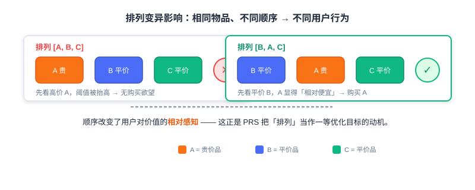
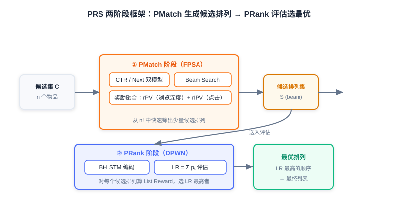

<div class="badge-row">
  <span style="background: #f0f4ff; color: #4A6CF7; padding: 4px 12px; border-radius: 20px; font-size: 0.85em; font-weight: 600; border: 1px solid rgba(74,108,247,0.2);">📖</span>
  <span style="background: #f0fdf4; color: #16a34a; padding: 4px 12px; border-radius: 20px; font-size: 0.85em; border: 1px solid rgba(22,163,74,0.2);">⏱️ ~36 min read</span>
  <span style="background: #fef2f2; color: #dc2626; padding: 4px 12px; border-radius: 20px; font-size: 0.85em; border: 1px solid rgba(100,100,100,0.15);">🎯 Advanced</span>
</div>

# 个性化重排

> 📝 **Before You Continue:** 请先读完 [4.1](./greedy-rerank.md) 的贪心重排。本章建立在「重排要兼顾相关性与多样性」的共识上，但把手段从「人设目标函数」升级为「模型从数据端到端学习」。

上一节我们探讨了基于贪心策略的重排序方法。它们通过显式定义多样性、相关性或覆盖度的优化目标，在初始排序列表上做局部调整——计算效率高、可解释性强。但它们在处理 **复杂的物品间相互影响** 和 **深度个性化** 时存在局限：

- 目标函数往往需要 **手工设计** ，难以捕捉高阶、非线性的交互模式；
- 把 **用户个性化信息** 深度融入列表级优化也颇具挑战。

本章介绍两个经典的个性化重排模型： **PRM（Personalized Re-Ranking Model）** 与 **PRS（Permutation Retrieve System）** ，看模型如何替我们「学会」最优列表。

读完本章，你将能够：

- **解释** PRM 为何标志着重排从规则/启发式走向数据驱动、端到端学习
- **描述** PRM 的输入层、编码层（Transformer）、输出层与 **个性化向量 PV** 的生成方式
- **写出** 自注意力公式，并说明 Softmax 在 PRM 输出层如何隐式建模物品间相对关系
- **理解** 排列变异影响（Permutation-Variant Influence），以及 PRS 为何要直接优化排列
- **描述** PRS 的两阶段解法：PMatch（FPSA 候选生成）与 PRank（DPWN 排列评估）
- 完成 4 道分层练习题，巩固 PRM/PRS 的核心机制

---

## 4.2.0 从规则到学习：为何需要个性化重排

贪心重排（MMR/DPP）的多样性目标是「通用」的——它对所有用户用同一套相似度与权重。但真实推荐里， **同一个列表对不同用户的最优排列是不同的** ：有人爱先看深度长文、有人偏爱短视频；有人对价格敏感、有人不在乎。

这就是「个性化重排」的立身之本： **把用户独有的偏好信号，深度融入整张列表的优化过程**。它不再依赖预设的多样性公式，而是让模型直接从海量行为数据中学习「哪些物品组合、以何种顺序，对这个用户最好」。


> 💡 **Key Insight:** 规则法问「怎样的一份列表**总体**更优」；个性化重排问「对**这个用户**，怎样的一份列表更优」。前者是人群平均，后者是千人千面。

### 🧠 Mental Model:  playlist DJ

> 把贪心重排想成「通用歌单生成器」——它只保证曲风不重复。把 PRM 想成「懂你的 DJ」——他知道你今晚想先听慢歌再听嗨歌，于是把顺序也排好了。模型学的不是「歌单该长什么样」，而是「**你**的歌单该长什么样」。

---

## 4.2.1 Transformer 个性化重排模型（PRM）

**PRM（Personalized Re-Ranking Model）** 的提出，标志着重排序技术从基于规则/启发式，向数据驱动、端到端学习的重要转变。其核心思想是： **利用 Transformer 强大的序列建模能力，自动学习列表中物品间复杂的相互影响，并把细粒度的用户个性化信息深度融入整个重排序过程** ，通过最大化列表级效用目标（如点击率）进行全局优化。

PRM 的整体架构可分为三层：输入层、编码层、输出层。

### 输入层：融合个性化与位置

输入层的核心任务，是为初始列表 $S = [i_1, i_2, ..., i_n]$ 中每个物品 $i_j$ 准备一个信息丰富的初始表示，需包含两个关键方面：

1. **物品自身特征（$X$）** ：物品 ID 嵌入、类别、标签、统计特征等基础信息。
2. **用户对该物品的个性化偏好（$PV$）** ：编码用户 $u$ 与物品 $i_j$ 的互动关系与偏好程度，是 PRM 实现个性化的关键，后面详述。

PRM 将物品原始特征向量 $x_j$ 与个性化向量 $pv_j$ **拼接（Concatenate）** ，形成更全面的基础表示 $[x_j; pv_j]$。此外，初始列表本身包含潜在序列信息（排名靠前的物品可能更相关），因此引入可学习的 **位置嵌入（PE）** ，为每个位置赋予向量。最终输入表示为：

$$E = [\text{物品自身特征}(x_j) ; \text{个性化向量}(pv_j)] + \text{位置嵌入}(pe_j)$$

这一组合通常再经一个简单前馈网络做维度调整，以适配 Transformer 编码器输入。

### 编码层：Transformer 建模物品相互影响

输入层提供了带个性化与位置信息的物品序列。编码层的核心目标，是利用 **Transformer 的序列建模能力** ，使列表中的所有物品相互关联，捕捉它们之间复杂的、高阶的相互影响。这一点对重排至关重要，因为：

- 用户是否点击第 $j$ 个物品，很可能受第 $k$ 个（甚至更远）物品的显著影响（替代品、互补品、或提供多样性）；
- 这种影响往往是 **长距离** 的，不受物品初始物理位置限制。

Transformer 的核心机制是 **自注意力（Self-Attention）** ：序列中每个物品可关注所有其他物品（含自己），通过计算查询向量 $Q$ 与其他物品键向量 $K$ 的相似度得到注意力权重，决定聚合多少来自其他物品的 $V$ 信息：

$$Attention(Q, K, V) = \text{softmax}\left(\frac{QK^T}{\sqrt{d}}\right) V$$

PRM 采用 **多头注意力** ，组织在标准 Transformer 编码器块（含多头自注意力 + 前馈网络）中，并堆叠多层，逐层提炼更高阶的物品间依赖。最终输出每个物品的高级表示 $F^{N_x}$，融合了物品特征、用户个性化偏好与整列表上下文交互信息。

> **Analysis:** 相对 MMR/DPP 的「两两相似度」，PRM 的自注意力能建模**任意高阶、非线性的物品间依赖**，且天然融入用户信号。代价是需要训练数据、推理成本高于规则法，且注意力权重不如 MMR 公式直观——可解释性下降。适合数据充足、对个性化收益敏感的核心场景。

### 输出层：Softmax 列表级打分

PRM 对每个物品的高级表示 $F^{N_x}$ 施加线性变换（$W^f \cdot F^{N_x} + b^f$），映射为标量分数（logit），再输入 **Softmax** ：

$$P(y_i | X, PV; \hat{\theta})$$

Softmax 在此扮演两个关键角色：

1. **归一化** ：将所有分数转为概率分布，所有物品概率之和为 1；
2. **隐含相对关系建模** ：每个物品的最终概率不仅取决于自身分数，也取决于它与列表中所有其他物品分数的相对比较——这天然契合重排序需评估物品间相对重要性的需求。

### 个性化向量（PV）的生成

回顾整个流程， **PV 是 PRM 区别于普通重排、实现真正「个性化」的关键**。PV 从何而来？PRM 采用了一个巧妙且实用的策略： **利用预训练的点击率预估模型来生成 PV**。

1. **预训练模型的作用** ：在海量用户历史行为数据上训练，学习预测给定用户 $u$ 及其行为历史 $H_u$，用户点击候选物品 $i$ 的概率 $P(y_i | H_u, u; \theta')$。
2. **提取个性化向量** ：PRM **不直接使用** 预训练模型预测的点击概率本身，而是提取该模型在输出最终点击概率（通常经 Sigmoid） **之前的那个隐藏层激活值**。该向量蕴含了「用户 $u$ 对物品 $i$ 偏好程度」的丰富抽象信息，作为物品 $i$ 相对用户 $u$ 的个性化向量 $pv_i$。
3. **输入 PRM** ：对初始列表每个物品 $i_j$ 都通过上述预训练模型算出 $pv_j$，作为关键输入送入 PRM 输入层。

**核心代码（节选）：**

```python
# 用户侧 Embedding -> [B, max_len, D]，使每个位置都携带同一用户上下文
user_part_embedding = tf.tile(tf.expand_dims(user_part_embedding, axis=1),
                              [1, max_seq_len, 1])
# 页面级序列表示：用户 + 物品特征 + PV + Item Embedding 拼接
page_embedding = concat_func(
    [user_part_embedding, item_part_embedding, pv_embeddings, item_embeddings],
    axis=-1)                                                # ← KEY LINE: 融合四类信号
# 位置编码相加，形成 Transformer 最终输入
enc_inputs = add_func([page_embedding, position_embedding])  # ← KEY LINE: 注入位置信息
# Transformer 编码层堆叠
for _ in range(transformer_blocks):
    enc_inputs = TransformerEncoder(
        intermediate_dim, nums_head, dropout_rate,
        activation="relu", normalize_first=True, is_residual=True)(enc_inputs)
# 打分头：每个位置映射成一个概率
enc_output = tf.keras.layers.Dense(intermediate_dim, activation='tanh')(enc_inputs)
enc_output = tf.keras.layers.Dense(1)(enc_output)
score_output = tf.keras.layers.Activation(activation='softmax')(
    tf.keras.layers.Flatten()(enc_output))                  # ← KEY LINE: 列表级相对打分
```

源码实验显示，PRM 相比基线在 map@5 等指标上带来稳定提升，验证了端到端个性化重排的有效性。

下面用交互演示直观感受 PRM 如何以 Transformer 逐步「读」完整列表、再为每个位置输出重排后的相对概率：

<iframe src="../viz/part4-prm.html?embed&vizId=part4-prm" style="width:100%; height:520px; border:none; display:block;" loading="lazy"></iframe>

点击「下一步」观察：初始列表如何带上 PV 与位置嵌入进入编码器，自注意力如何在各层逐步聚合跨物品信息，最后 Softmax 如何把分数转为重排后的相对概率。

---

## 4.2.2 基于排列组合的重排模型（PRS）

虽然 PRM 通过 Transformer 实现了端到端个性化重排，但它仍有一个根本性局限： **缺乏对排列组合影响的深度理解**。

想象一个场景：用户面对列表 [A, B, C] 时毫无购买欲望，但看到 [B, A, C] 这个排列时却买了 A。这种现象被称为 **排列变异影响（Permutation-Variant Influence）**——一种可能的解释是：把价格较高的 B 放在前面，会让用户觉得 A 相对便宜，从而激发购买欲。



传统重排（含 PRM）主要关注 **单个物品的分数优化** ，却忽略了 **物品排列顺序本身** 对用户行为的影响 **。PRS 的设计思路是：评估所有可能的物品排列组合，选择用户体验最佳的那一个。但 $n$ 个物品的排列有 $n!$ 种，计算上不可行，因此 PRS 提出** 两阶段**解法：

1. **PMatch 阶段** ：通过搜索算法快速筛选少数候选排列；
2. **PRank 阶段** ：用神经网络模型评估这些候选排列的质量，选出最优解。

### PRS 整体框架



### PMatch 阶段：候选排列生成（FPSA）

PMatch（Permutation-Matching）的目标，是从指数级排列空间中高效识别候选排列。它采用 **FPSA（Fast Permutation Searching Algorithm）** ，结合 **beam search** 与两个用户行为预测模型。

**离线训练：双模型预测体系**

1. **CTR 模型** ：预测用户点击某物品的概率 $P_{CTR}(i|u)$
2. **Next 模型** ：预测用户浏览完当前物品后继续浏览下一个的概率 $P_{Next}(i|u)$

两者均用标准 point-wise 建模（Sigmoid 激活 + 交叉熵损失）：

$$f_{CTR}(x_u, x_i) = \sigma(W_{CTR} \cdot [x_u; x_i] + b_{CTR})$$
$$f_{Next}(x_u, x_i) = \sigma(W_{Next} \cdot [x_u; x_i] + b_{Next})$$

Next 模型反映了用户浏览的 **连续性** ：物品不仅要能吸引点击，还要能引导用户继续浏览后续内容。

**在线服务：FPSA 算法**

FPSA 把用户浏览行为建模为 **序列决策过程**——物品在序列中的价值不仅取决于自身特征，更取决于它在整个浏览路径中的作用。其核心是一个 beam search 逐步构建候选排列，每步基于奖励函数剪枝。奖励融合两个指标：

- **rPV（Page View Reward）** ：衡量排列能带来的总浏览深度，鼓励能引导深度浏览的组合；
- **rIPV（Item Page View Reward）** ：衡量排列中物品被点击的总概率，确保商业价值。

**FPSA 核心代码（节选）：**

```python
def fpsa_algorithm(items, ctr_scores, next_scores, beam_size=5, max_length=10,
                   alpha=0.5, beta=0.5):
    """Fast Permutation Searching Algorithm（Beam Search 生成候选排列）。"""
    S = [()]                       # 候选排列集合，初始为「空序列」
    for i in range(1, max_length + 1):
        St = S.copy()
        S, R = [], {}
        for O in St:
            for ci in items:
                if ci not in O:
                    Ot = O + (ci,)   # 把未出现物品 ci 追加到尾部
                    r = calculate_estimated_reward(Ot, ctr_scores, next_scores, alpha, beta)
                    R[Ot], S.append(Ot) = r, Ot
        # Beam Search 截断：按奖励保留前 beam_size 个
        S = sorted(S, key=lambda x: R[x], reverse=True)[:beam_size]  # ← KEY LINE
    return S

def calculate_estimated_reward(O, ctr_scores, next_scores, alpha, beta):
    r_pv, r_ipv, p_expose = 1.0, 0.0, 1.0
    for ci in O:
        p_ctr, p_next = ctr_scores[ci], next_scores[ci]
        r_ipv += p_expose * p_ctr                 # 累加期望点击
        p_expose *= p_next                        # 曝光链概率随位置递减
    r_pv = p_expose                              # 浏览到末尾的概率
    return alpha * r_pv + beta * r_ipv           # 线性融合 PV 与 IPV
```

> **Analysis:** FPSA 用 beam search 把 $n!$ 降到可控的候选集，是工程上「组合爆炸」的务实解法。但它依赖 CTR/Next 两个 point-wise 模型的精度，且奖励为线性融合，可能漏掉非线性的排列收益。

### PRank 阶段：排列评估（DPWN）

PRank（Permutation-Ranking）接收 PMatch 生成的候选排列，用神经网络 **DPWN（Deep Permutation-Wise Network）** 评估每个排列质量。

DPWN 的设计理念：排列中每个物品的价值不仅取决于自身特征，更取决于它在 **整个序列上下文中的位置和作用**。为此采用 **Bi-LSTM** 架构：

1. **序列编码层** ：双向 LSTM 计算第 $t$ 个物品的上下文表示：
   $$\overrightarrow{h_t} = LSTM_{forward}(x_{v_t}, \overrightarrow{h_{t-1}}), \quad \overleftarrow{h_t} = LSTM_{backward}(x_{v_t}, \overleftarrow{h_{t+1}}), \quad h_t = [\overrightarrow{h_t}; \overleftarrow{h_t}]$$
2. **特征融合层** ：$z_t = [h_t; x_u; x_{v_t}]$，融合序列表示与用户/物品特征。
3. **预测层** ：通过 MLP 预测每个位置点击概率 $p_t = \sigma(MLP(z_t))$。

**List Reward（LR）** 是 PRank 的核心评估指标，定义为排列中所有物品预测点击概率之和：

$$LR(O) = \sum_{t=1}^{|O|} p_t$$

在线服务时，PRank 计算每个候选排列的 LR，选择 LR 最高的排列作为最终输出。

> 💡 **Key Insight:** PRS 与 PRM 的根本分野在于——PRM 优化「**每个物品的相对分数**」，默认位置由分数决定；PRS 直接优化「**排列顺序本身**带来的体验收益**（LR）」，把顺序当作一等公民。前者重「选哪些」，后者重「怎么排」。

### 🧠 Mental Model: 货架陈列 vs 单品定价

> PRM 像一位给每件商品定价的经理——他尽量让每件都标得准，但货架顺序只是按价格排。PRS 像一位讲究陈列的店长——他清楚「把贵的最终季款放前面，能让中间的平价款显得划算」，于是为整组商品的**摆放顺序**单独做优化。

---

## ⚠️ Common Mistakes in 4.2

| # | Mistake | Example | Why It's Wrong | Fix |
|---|---------|---------|---------------|-----|
| 1 | 以为 PRM 自带个性化 | 「PRM 输入只有物品特征也能个性化」 | 个性化来自 PV，PV 缺失则退化为普通重排 | 必须接入预训练 CTR 模型的隐藏层作 PV |
| 2 | 混淆 PRM 与排序模型 | 「PRM 就是个 CTR 预估」 | PRM 优化列表级相对关系，排序是逐点 | 记住 PRM 输出是 Softmax 相对概率 |
| 3 | 忽视排列变异影响 | 「[A,B,C] 和 [B,A,C] 效果一样」 | 顺序会改变用户相对价格/偏好感知 | PRS 类方法才把顺序当优化目标 |
| 4 | 低估 $n!$ 组合爆炸 | 「直接枚举所有排列选最优」 | 10! ≈ 360万，20! 不可算 | 用 PMatch 的 beam search 截候选 |
| 5 | 把 PRS 当单阶段 | 「PRank 直接搜排列」 | 无 PMatch 候选生成，PRank 无从评估 | 两阶段缺一不可 |

---

## 本章小结

### 📌 Key Takeaways

| Concept | Key Points | Why It Matters |
|---------|-----------|----------------|
| 个性化重排动机 | 规则法对所有人同目标，缺乏千人千面 | 把用户偏好深度融入列表优化 |
| PRM 输入层 | $[x_j;pv_j]+pe_j$，融合四类信号 | PV 是个性化核心 |
| PRM 编码层 | Transformer 多头自注意力建模高阶相互影响 | 捕捉跨物品、长距离依赖 |
| PRM 输出层 | Softmax → 列表级相对概率 | 隐式建模物品间相对重要性 |
| PV 生成 | 取预训练 CTR 模型隐藏层激活 | 复用已有排序知识做个性化 |
| 排列变异影响 | 同物品不同序→不同行为 | PRS 存在的动机 |
| PRS 两阶段 | PMatch(FPSA+beam)→PRank(DPWN+LR) | 化解 $n!$ 组合爆炸 |

### ❓ FAQ

**Q1: PRM 和 4.1 的 DPP 能一起用吗？**
> A: 可以且常见。DPP/MMR 常作为 PRM 的**基线或后处理**：先用 PRM 学列表级偏好，再用 DPP 做多样性约束兜底。二者互补——一个管个性化、一个管集合多样性。

**Q2: PV 为什么取隐藏层而不是最终点击概率？**
> A: 最终点击概率是被 Sigmoid 压扁的标量，信息高度压缩；隐藏层激活是**高维抽象向量**，保留了「用户为何偏好该物品」的丰富语义，更适合作为 PRM 的个性化输入。

**Q3: PRS 的 beam search 会不会漏掉真正最优排列？**
> A: 会。beam 只保留奖励前 $k$ 的局部候选，是近似。但相比 $n!$ 全枚举，这是工程上必要的trade-off；实践中配合好的奖励函数，top 候选已足够优质。

### 前后关联

- **4.1** （贪心重排）是 PRM/PRS 的对照基线——规则法轻量，个性化法表达力强。
- **Part 3 排序** 提供 PRM 所需的预训练 CTR 模型与精排分数，是 PV 的来源。
- **Part 5 趋势** （生成式范式）将「列表生成」进一步端到端化，PRS 的排列优化思想在生成式架构中以自回归方式自然涌现。
- **下篇生成式推荐** 用单一序列模型替代「召回→排序→重排」级联，重排的目标被直接编进生成目标。

---

## Practice Problems

Work through all problems in order — they get progressively harder. Each has a complete solution you can reveal after trying it yourself.

---

**Problem 4.2.1 — 区分两类重排** 🟢 Easy

判断下列描述更接近 **(a) 贪心重排（MMR/DPP）** 还是 **(b) 个性化重排（PRM/PRS）** ，并说明理由：

- (i) 系统对每个用户都用同一套相似度矩阵与固定 $\lambda$ 做重排。
- (ii) 系统为每位用户提取预训练 CTR 模型的隐藏层向量，作为重排输入。

<details>
<summary>💡 Solution (click to reveal)</summary>

**Approach:** 抓住「是否融入用户个性化、是否数据驱动」。

- (i) **贪心重排** ：固定相似度与 $\lambda$ 对所有用户一致，不带个性化，属规则/启发式。
- (ii) **个性化重排（PRM）** ：从预训练 CTR 模型取隐藏层作 PV，是 PRM 的标志性做法，深度融入用户偏好。

**Key points:**
- 有无「按用户定制的个性化信号」是两类方法的本质分水岭。
- PV 的存在 ≈ PRM；固定目标函数 ≈ 贪心法。

</details>

---

**Problem 4.2.2 — PRM 输入表示** 🟢 Easy

PRM 中某物品 $i_j$ 的最终输入表示 $E$ 由哪些部分相加/拼接而成？写出公式并说明每一项解决什么问题。

<details>
<summary>💡 Solution (click to reveal)</summary>

**Approach:** 回忆 4.2.1 输入层。

公式：
$$E = [\text{物品自身特征}(x_j) ; \text{个性化向量}(pv_j)] + \text{位置嵌入}(pe_j)$$

- $[x_j; pv_j]$ **拼接** ：融合「物品是什么」与「用户多偏好它」（个性化），解决「千人千面」问题；
- $+ pe_j$ **位置嵌入** ：注入列表中的位置信息，解决「Transformer 本身不含顺序」的问题。

**Key points:**
- 拼接（concat）用于融合不同来源特征，相加用于注入位置。
- 三者缺一不可：无 PV 则无个性化，无 PE 则无序感。

</details>

---

**Problem 4.2.3 — 排列变异影响分析** 🟡 Medium

某电商列表有物品 [A(贵), B(平价), C(平价)]。产品经理发现把 [A, B, C] 改成 [B, A, C] 后，A 的点击率明显上升。请用「排列变异影响」解释这一现象，并指出该现象对重排方法选型的启示。

<details>
<summary>💡 Solution (click to reveal)</summary>

**Approach:** 用 4.2.2 的排列变异影响框架。

- **解释** ：A 是贵价品。当 A 排在第一（[A,B,C]）时，用户先看到高价，阈值被抬高；改成 [B,A,C] 后，用户先看平价 B，再看到 A 时产生「相对便宜」的错觉，购买欲被激发——即 **顺序改变了用户对价值的相对感知** ，这就是排列变异影响。
- **启示** ：传统逐点打分（含 PRM 的分数优化）默认「顺序不影响单品价值」，会漏掉这种收益。需要像 **PRS** 那样把「排列顺序」本身作为优化目标（用 LR 评估整列收益），才能捕捉顺序带来的体验增益。

**Key points:**
- 排列变异影响 = 同物品、不同序 → 不同行为。
- 它指向「顺序是一等优化目标」的方法（PRS），而非仅优化单品分数的方法。

</details>

---

**🏆 Challenge: 设计一个混合重排方案** 🔴 Hard

某信息流产品希望同时获得「个性化」（PRM 所长）与「强集合多样性」（DPP 所长），并控制推理延迟。请写一段方案论证：如何将 PRM 与 DPP 结合（顺序/并联/级联），并指出每种子方案的一个风险点与缓解手段（150 字内）。

<details>
<summary>💡 Hint</summary>

常见三种结合：(1) **级联**——PRM 出分后 DPP 做多样性后处理，风险是 DPP 可能破坏 PRM 学到的个性化顺序，缓解用软约束；(2) **并联**——两路打分加权融合，风险是权重难调，缓解用离线网格搜索；(3) **DPP 核矩阵注入 PV**——把 PRM 的 PV 编码进 $L$，风险是核矩阵需重算，缓解用增量更新。论证聚焦一种即可。

</details>
