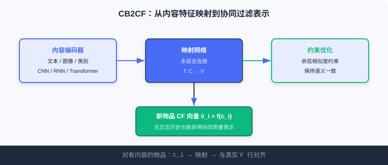
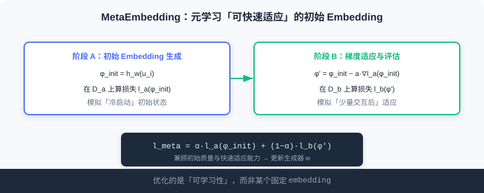
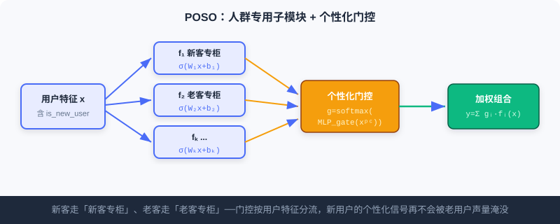

  📖
  ⏱️ ~30 min read
  🎯 Intermediate

# 冷启动

> 📝 **Before You Continue:** 请先读完 [Part 2 召回](./../part2-retrieval/) 的协同过滤与双塔，以及 [5.1](./debiasing.md) 的偏差视角。冷启动本质上是一个「没有历史却被要求精准」的偏差困境。

推荐系统最尴尬的时刻，莫过于一个新物品上架、或一个新用户注册的那一刻。协同过滤依赖用户-物品交互来学偏好，可此时交互是**零**；基于内容的方法虽能处理新物品，却往往只捕捉到表面相似。

这就是 **冷启动问题**——系统的核心引擎（行为数据）还没点火，却要立刻输出靠谱的推荐。本章把冷启动拆成两面： **内容冷启动** （新物品缺交互）与 **用户冷启动** （新用户缺历史），并各给出两种代表解法。它们的共同智慧是 **「借力」** ：新物品借内容，新用户借元知识或人群结构。

读完本章，你将能够：

- **区分** 内容冷启动与用户冷启动的根本差异
- **说明**CB2CF 如何把内容特征映射到协同过滤表示，让新物品直接获得 CF 质量
- **写出**MetaEmbedding 的双阶段元损失，理解它优化的是「可学习性」而非固定向量
- **解释**MeLU 的参数分离与 POSO 的「个性化淹没」洞察，并对比二者思路
- 完成 4 道分层练习题，巩固冷启动的工程与数学直觉

---

## 5.2.0 冷启动的两张面孔

冷启动不是单一问题，而是两个对象各自「没有历史」：

| 类型 | 缺什么 | 典型失败 | 解法直觉 |
|------|---------|----------|-----------|
| 🎬 内容冷启动 | 新物品缺用户交互 | 协同过滤无法为其计算相似度 | **借内容** ：用属性映射到已有表示 |
| 👤 用户冷启动 | 新用户缺行为历史 | 只能推热门，无个性化 | **借元知识/人群** ：快速适应或分群 |

接下来分别展开。

---

## 5.2.1 内容冷启动：让新物品「借」到协同质量

协同过滤能发现复杂的隐式关联，但面对新物品束手无策；基于内容的方法能处理新物品，却常只捕捉表面相似。理想状态是： **新物品也能拿到协同过滤级别的表示**——这正是 CB2CF 与 MetaEmbedding 的目标。

### CB2CF：从内容特征到协同过滤表示

**CB2CF（Content-Based to Collaborative Filtering）** 的核心思想是学一个 **映射函数** $f: \mathcal{C} \rightarrow \mathcal{V}$，把物品的内容特征 $c_i$ 直接映射到协同过滤嵌入空间，得到 $\hat{v}_i = f(c_i)$。

对于既有内容描述、又有丰富交互的物品，我们同时拥有它的内容向量与 CF 嵌入。CB2CF 用深度网络学这两种表示间的非线性映射，新物品便 **仅基于内容** 就获得语义一致的 CF 表示。其多视图架构含三模块：

- **内容编码器（Content Encoder）** ：把多模态内容（文本、图像、类别）编码为统一内容向量。图像用 CNN、文本用 RNN/Transformer。
- **映射网络（Mapping Network）** ：核心，多层全连接，学从内容空间到 CF 嵌入空间的非线性映射，捕捉内容与用户偏好的复杂关联。
- **约束优化模块（Constraint Optimization）** ：用 **余弦相似度约束** 确保映射后的表示与真实 CF 嵌入语义一致，保证映射有效。

**协同过滤向量从哪来？** 对有交互的物品，可用多种方式生成 CF 向量：矩阵分解 $R \approx UV^T$，物品 $i$ 的向量即 $V$ 的第 $i$ 行 $v_i$；或双塔召回的物品塔输出；或 NCF、自编码器等深度方法。CB2CF 学完 $f$ 后，新物品的内容 $c_i$ 经 $f$ 即得到 $\hat{v}_i$。

### 🧠 Mental Model: 翻译官

> 把 CB2CF 想成一位**翻译官**。CF 嵌入是系统内部通用「语言」，老物品都讲这门语言；新物品只会说「内容语」（文本/图像）。翻译官 $f$ 学会了把内容语翻成 CF 语，于是新物品虽没交过朋友（无交互），一开口就被系统听懂、纳入协同网络。

> **Analysis:** CB2CF 的优势是**简单直接**——一次映射，新物品立即获得 CF 级表示，可无缝接入现有召回/排序。局限在于：映射质量上限受「内容→CF」可迁移性约束，若内容与协同信号弱相关，翻译会失真；且它假设已有物品的 CF 向量可信（需先有良好 CF 模型）。

### MetaEmbedding：用元学习生成「聪明」的初始 Embedding

CB2CF 解决「新物品拿不到 CF 表示」，但还有另一难题：即使有初始向量，传统 **随机初始化** 让新物品初期表现差，需大量交互才收敛。

**MetaEmbedding** 用 **元学习** 思想，为新物品生成「既初始质量好、又易快速适应」的 embedding。它模拟物品「从冷启动到预热」的完整过程来优化生成器。

算法输入：预训练基础模型 $f_\theta$、物品集合 $\mathcal{I}$、元损失权重 $\alpha$、步长 $a, b$。对每个采样物品 $i$：

**初始 Embedding 生成阶段** ：生成器产出初始向量

$$\phi_{[i]}^{\text{init}} = h_w(\boldsymbol{u}_{[i]})$$

其中 $\boldsymbol{u}_{[i]}$ 是物品 $i$ 的特征，$\boldsymbol{u}$ 是参数 $w$ 的生成器。再采样两批各 $K$ 个样本：$\mathcal{D}_{[i]}^a$ 与 $\mathcal{D}_{[i]}^b$。

**梯度适应与评估阶段** ：在第一批上算损失后做一步梯度适应，模拟「少量交互后」：

$$\phi_{[i]}' = \phi_{[i]}^{\text{init}} - a \cdot \frac{\partial l_a(\phi_{[i]}^{\text{init}})}{\partial \phi_{[i]}^{\text{init}}}$$

再在第二批上评估适应后的损失 $l_b(\phi_{[i]}')$。

其关键在 **元损失** 平衡两目标：

$$l_{\text{meta},i} = \alpha l_a(\phi_{[i]}^{\text{init}}) + (1-\alpha) l_b(\phi_{[i]}')$$

最后用所有采样物品的元损失更新生成器：

$$w \leftarrow w - b \sum_{i} \frac{\partial l_{\text{meta},i}}{\partial w}$$

> 💡 **Key Insight:** MetaEmbedding 优化的是 embedding 的**「可学习性」而非 embedding 本身**。它反复在老物品上演练「初始化→适应→评估」，学会给新物品一个「聪明起点」——少量真实交互后就能快速收敛到高质量表示。

### 🧠 Mental Model: 教人「如何学」而非「背答案」

> MetaEmbedding 像一位教练，不直接给新球员比赛答案，而是训练他**「上场前怎么热身、前几球怎么调」**。于是真上场时，他只需少量实战就进入状态。$\alpha$ 就是在权衡「开局姿势好不好」与「微调后强不强」。

---

## 5.2.2 用户冷启动：为新用户快速个性化

新用户刚注册时缺历史交互，协同过滤只能给基于流行度的通用推荐。用户冷启动聚焦：如何基于 **少量** 行为快速捕捉个性化偏好。MeLU 与 POSO 给出两种思路——**元学习** 与 **分群架构**。

### MeLU：把每个用户当独立任务来学

**MeLU（Meta-Learned User preference estimator）** 把每个用户的偏好学习视为独立任务，用 **MAML（Model-Agnostic Meta-Learning）** 训练一个能快速适应新用户的模型。MAML 的精髓是「学会如何学习」——不追求在某任务最优，而是学一个 **好初始化** ，使少量样本即可适应新任务。

MeLU 采用双层参数：

- $\theta_1$ 控制用户与物品的 **embedding 参数** （所有用户共享）
- $\theta_2$ 负责模型核心 **决策网络** 参数（快速适应个体）

训练严格遵循 MAML 双循环：

1. **内循环适应** ：对每个用户 $i$，以其交互历史算梯度并本地更新 $\theta_2^i \leftarrow \theta_2^i - \alpha \nabla_{\theta_2^i} \mathcal{L}_i'(f_{\theta_1,\theta_2^i})$。
2. **外循环元更新** ：用所有用户的适应后参数，同时更新两组全局参数：

$$\theta_1 \leftarrow \theta_1 - \beta \sum_{i \in B} \nabla_{\theta_1} \mathcal{L}_i'(f_{\theta_1,\theta_2^i}), \quad \theta_2 \leftarrow \theta_2 - \beta \sum_{i \in B} \nabla_{\theta_2} \mathcal{L}_i'(f_{\theta_1,\theta_2^i})$$

MeLU 的创新在 **参数分离** ：$\theta_1$ 学共享通用表示，$\theta_2$ 专司快速适应个体。既保表示能力，又能在新用户上快速个性化。此外 MeLU 还提出 **证据候选选择** 策略，挑选最能区分用户偏好的物品集合用于冷启动评估。

> **Analysis:** MeLU 的优势是理论上优雅——新用户只需几步梯度即个性化，无需从头训练。代价是 MAML 的**二阶梯度**计算较重，且依赖「用户间任务同分布」假设；当新老用户行为分布差异巨大时，仅靠快速适应可能不够。

### POSO：用分群子模块对抗「个性化淹没」

**POSO（Personalized cOld Start Modules）** 从架构角度切入，提出更直接的洞察：用户冷启动的根因 **不只是数据稀缺** ，更是新用户与老用户 **行为分布的巨大差异** ，以及模型处理不平衡分布时的 **「个性化淹没」（Submergence）**——当新用户远少于老用户时，即便有「是否新用户」特征，训练也被多数老用户主导，模型学会 **忽略** 这个严重不平衡的特征，新用户的个性化信号被淹没。

POSO 可嵌入多种模块，以 MLP 为例：原 MLP 所有用户共享权重 $y=\sigma(Wx+b)$；POSO 引入 $K$ 个并行子模块 $f_i(x)=\sigma(W_i x+b_i)$，再用 **个性化门控** 网络（接收 `is_new_user`、活跃度等 $x^{pc}$）输出权重 $g_i=\text{softmax}(\text{MLP}_{gate}(x^{pc}))_i$，最终输出为加权组合：

$$\hat{y} = \sum_{i=1}^K g_i(x^{pc}) \cdot f_i(x)$$

这让新用户主要依赖「为TA优化的子模块」，老用户用另一组，有效避开特征淹没。该思路可推广到：

- **POSO-MHA** ：扩展为 $K$ 组注意力头，每组专用 $Q/K/V$ 变换，组内拼接聚合，门控按用户特征选组权重。
- **POSO-MMoE** ：底层 $E$ 个共享专家 + 顶层 $K$ 个专家组（每组 $M$ 个专家），叠加 **任务门控** 与 **个性化门控** 双重门控，实现任务级与用户群体级的双重个性化。

### 🧠 Mental Model: 双语柜台 vs 单人柜台

> 普通模型像**一个柜员**同时招呼所有顾客，被常客（老用户）的惯常需求带偏，新客（新用户）的特殊要求被淹没。POSO 像开了 $K$ 个**专用柜台**：新客去「新客专柜」，老客去「老客专柜」，门口有个引导员（门控）按顾客类型分流——新客的需求再也不会被常客的声量盖过。

> **Analysis:** POSO 与 MeLU 思路互补：MeLU 假设「所有用户同分布、靠快速适应」，适合行为模式相近的场景；POSO 直击「分布不平衡导致特征淹没」，用结构强制分流，工程上更易集成到现成深度模块（MLP/MHA/MMoE），且无需元学习的重梯度。实践中可组合——用 POSO 结构保冷启动不淹没，用元学习进一步加速收敛。

---

## ⚠️ Common Mistakes in 5.2

| # | Mistake | Example | Why It's Wrong | Fix |
|---|---------|---------|---------------|-----|
| 1 | 随机初始化新物品 embedding | 新物品直接随机向量进模型 | 初期表现差，需大量交互才收敛 | 用 MetaEmbedding 生成聪明起点 |
| 2 | 把内容相似当协同相似 | CB2CF 只靠文本相似度 | 表面相似 ≠ 行为协同，映射会失真 | 用约束优化保证语义一致 |
| 3 | 以为 MAML 一定优于结构设计 | 用户冷启动无脑上 MeLU | 行为分布差异大时适应不足，且二阶梯度重 | 分布不平衡时优先 POSO 分流 |
| 4 | 给新用户加特征就以为够 | 仅加 `is_new_user` 标志位 | 老用户主导训练，该特征被淹没 | 用 POSO 子模块 + 门控强制分流 |

---

## 本章小结

### 📌 Key Takeaways

| Concept | Key Points | Why It Matters |
|---------|-----------|----------------|
| 内容冷启动 | 新物品缺交互，CF 失效 | 借内容映射获得 CF 表示 |
| CB2CF | $f: \mathcal{C}\rightarrow\mathcal{V}$ 内容→CF | 新物品立即获协同质量 |
| MetaEmbedding | 双阶段元损失优化「可学习性」 | 生成易快速适应的初始向量 |
| 用户冷启动 | 新用户缺历史，仅能推热门 | 借元知识/人群结构快速个性化 |
| MeLU / POSO | 元学习适应 / 分群子模块防淹没 | 两种互补的用户冷启动思路 |

### ❓ FAQ

**Q1: CB2CF 和 MetaEmbedding 解决的是同一个问题吗？**
> A: 不完全。CB2CF 解决「新物品拿不到 CF 表示」；MetaEmbedding 解决「即使有初始向量，随机初始化也收敛慢」。二者可串联：先用 MetaEmbedding 生成好起点，再借 CB2CF 式的映射获得 CF 质量。

**Q2: 为什么 POSO 比单纯加 `is_new_user` 特征有效？**
> A: 因为训练被老用户主导，单一特征会被「淹没」——模型学会忽略它。POSO 用 $K$ 个专用子模块 + 门控，从结构上强制新用户走专属通路，无法被忽略。

**Q3: MeLU 和 POSO 怎么选？**
> A: 用户行为模式相近、靠少量样本能适应 → MeLU；新老用户分布差异大、特征易淹没 → POSO。也可组合使用。

### 前后关联

- **5.1** （去偏）长尾新物品曝光少，易被流行度偏差淹没，冷启动与去偏需协同。
- **5.3** （生成式）语义 ID 让新物品无需行为即被推荐，从表示层面缓解内容冷启动。
- **Part 2 召回** （Ch2.x）CB2CF 产出的 CF 表示可直接接入双塔/向量召回。

---

## Practice Problems

Work through all problems in order — they get progressively harder. Each has a complete solution you can reveal after trying it yourself.

---

**Problem 5.2.1 — 区分冷启动类型** 🟢 Easy

下列情形属于内容冷启动还是用户冷启动？
- (a) 新上架的纪录片，无任何播放记录，需被召回。
- (b) 刚注册的用户，只点了 3 个视频，系统却一直推热门。
- (c) 新歌发布，想直接进个性化歌单而非仅进「最新」列表。

💡 Solution (click to reveal)

**Approach:** 看「缺的是物品历史还是用户历史」。

- (a) **内容冷启动** ：物品无交互，协同过滤失效。
- (b) **用户冷启动** ：用户缺历史，只能推热门。
- (c) **内容冷启动** ：新歌（物品）缺行为，想借内容进入个性化。

**Key points:**
- 内容冷启动的「主语」是新物品；用户冷启动的「主语」是新用户。
- 二者解法不同：内容借内容映射，用户借元学习/分群。

---

**Problem 5.2.2 — CB2CF 映射填空** 🟢 Easy

CB2CF 学习映射函数 $f$，把新物品的内容特征 $c_i$ 映射到协同过滤空间。请补全输出表达式，并说明约束优化模块的作用。

💡 Solution (click to reveal)

**Approach:** 回忆 CB2CF 三模块与映射定义。

映射输出为：

$$\hat{v}_i = f(c_i)$$

其中 $f: \mathcal{C} \rightarrow \mathcal{V}$ 由映射网络（多层全连接）实现。**约束优化模块** 用余弦相似度约束，确保 $\hat{v}_i$ 与真实 CF 嵌入 $v_i$ 在语义上保持一致——否则映射可能「看起来收敛」却偏离协同空间，导致新物品被错误推荐。

**Key points:**
- 新物品无交互，但凭内容 $c_i$ 经 $f$ 即得 CF 表示。
- 约束优化是映射有效的保障，不能省。

---

**Problem 5.2.3 — MetaEmbedding 元损失解读** 🟡 Medium

MetaEmbedding 的元损失为 $l_{\text{meta},i} = \alpha l_a(\phi_{[i]}^{\text{init}}) + (1-\alpha) l_b(\phi_{[i]}')$。请解释：① 两项分别衡量什么？② 若 $\alpha=1$ 会有什么后果？③ 为什么说它优化「可学习性」而非 embedding 本身？

💡 Solution (click to reveal)

**Approach:** 对照双阶段过程拆解元损失。

① **$l_a(\phi_{[i]}^{\text{init}})$** 衡量初始 embedding 在首批数据上的直接质量（冷启动开局表现）； **$l_b(\phi_{[i]}')$** 衡量经过一步梯度适应后的质量（少量交互后的适应表现）。

② 若 $\alpha=1$，元损失只剩 $l_a$，生成器 **只优化初始质量** ，不再关心「能否快速适应」——新物品拿到好起点却难微调，违背冷启动需快速收敛的初衷。

③ 它不在某个具体物品上定死一个向量，而是在大量老物品上反复演练「初始化→适应→评估」，学会 **生成具备良好初始性能且强适应潜力** 的起点。面对真新物品时，该起点经少量真实数据即快速收敛——优化的是「易学程度」。

**Key points:**
- $\alpha$ 平衡「开局」与「适应」。
- 元学习 = 学如何学，不是学一个固定答案。

---

**Problem 5.2.4 — POSO 改造设计** 🔴 Hard

你有一个共享权重的 MLP 排序模型，线上发现新用户推荐效果远差于老用户，即便已加 `is_new_user` 特征。请用 POSO-MLP 思路给出改造方案：写出子模块与门控的数学形式，并说明为何这能解决「特征淹没」。

💡 Solution (click to reveal)

**Approach:** 按 POSO-MLP 的三段式改造。

**子模块：** 引入 $K$ 个并行 MLP 子模块，每个有独立权重：

$$f_i(x) = \sigma(W_i x + b_i), \quad i=1,\ldots,K$$

**门控：** 个性化门控接收 $x^{pc}$（含 `is_new_user`、活跃度等），输出各子模块权重：

$$g_i(x^{pc}) = \text{softmax}(\text{MLP}_{gate}(x^{pc}))_i$$

**最终输出：** 所有子模块加权组合：

$$\hat{y} = \sum_{i=1}^K g_i(x^{pc}) \cdot f_i(x)$$

**为何解决淹没：** 原模型所有用户共享 $W,b$，训练被老用户主导，单一 `is_new_user` 特征易被学「忽略」。POSO 让新用户主要走「新用户专用子模块」、老用户走另一组，从 **结构上** 保证新用户的个性化信号有专属通路，无法被老用户声量盖过。

**Key points:**
- 关键是「结构分流」而非「加特征」。
- 门控按用户特征动态分配子模块权重，可平滑过渡新老用户。

---

**🏆 Challenge: 冷启动组合拳**

某短视频 App 同时面临：新创作者内容（内容冷启动）和新注册用户（用户冷启动）。请写一段 200 字内的方案，说明你会如何 **组合** CB2CF / MetaEmbedding / POSO 三类技术分别应对，并指出哪一步最依赖「已有物品的 CF 向量质量」。

💡 Hint

- 新创作者内容：用 MetaEmbedding 生成聪明初始 embedding，再借 CB2CF 式内容→CF 映射获得协同表示接入召回。
- 新注册用户：用 POSO 子模块+门控做结构分流，避免 `is_new_user` 被淹没；若有少量行为，可叠加 MeLU 式快速适应。
- 最依赖「已有物品 CF 向量质量」的是 **CB2CF**——它的约束优化需要可信的真实 CF 嵌入作对齐目标，若基础 CF 模型差，映射也会失真。

