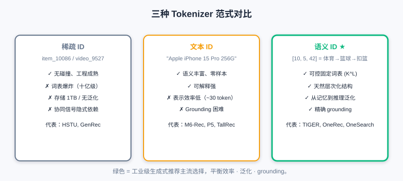
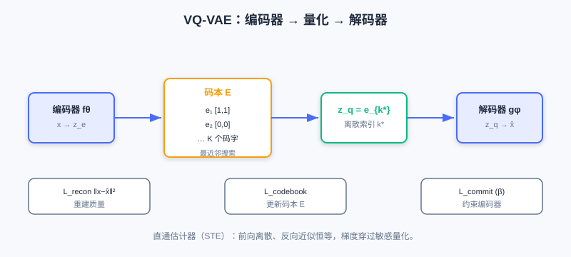
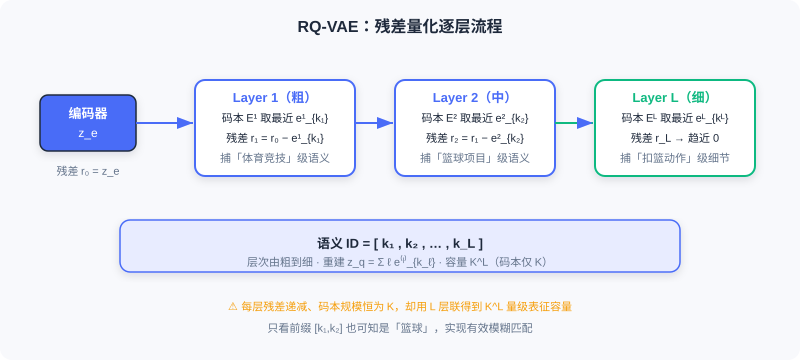
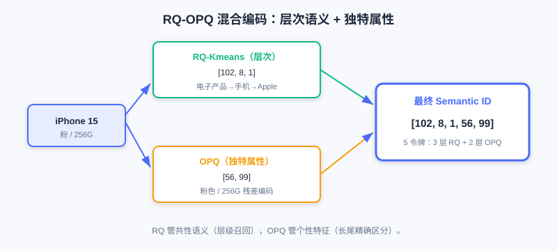

<div class="badge-row">
  <span style="background: #f0f4ff; color: #4A6CF7; padding: 4px 12px; border-radius: 20px; font-size: 0.85em; font-weight: 600; border: 1px solid rgba(74,108,247,0.2);">📖</span>
  <span style="background: #fef2f2; color: #dc2626; padding: 4px 12px; border-radius: 20px; font-size: 0.85em; border: 1px solid rgba(100,100,100,0.15);">⏱️ ~50 min read</span>
  <span style="background: #fef2f2; color: #dc2626; padding: 4px 12px; border-radius: 20px; font-size: 0.85em; border: 1px solid rgba(100,100,100,0.15);">🎯 Advanced</span>
</div>

# 推荐中的 Tokenizer 技术：Codebook 量化与语义 ID

> 📝 **Before You Continue:** 请先读完 [6.3](./llm-foundation.md) 反复提及的「物品 Token 化」问题，以及 [6.2](./gr-architecture.md) 的 Decoder-Only 自回归生成——语义 ID 正是喂给它的「词表」。

在 [6.3] 我们指出， **物品 Token 化（Item Tokenization）** 是连接传统推荐数据与生成式模型的关键桥梁。本章直面这个核心问题： **如何把推荐系统中的物品，转化为生成式模型能理解、能生成的 Token 序列？**

读完本章，你将能够：

- 对比 **稀疏 ID / 文本 ID / 语义 ID** 三种范式的优劣
- 说明语义 ID 的「可控词表、层次结构、从记忆到推理」三大价值
- 推导 **VQ-VAE** 的量化与三损失，理解 **直通估计器（STE）**
- 解释 **RQ-VAE** 的残差量化如何生成层次化语义 ID
- 了解 **RQ-Kmeans / RQ-OPQ** 等工业级解耦与混合方案
- 完成 5 道分层练习题，并用交互演示感受量化过程

---

## 6.4.0 三种 Tokenizer 范式演进

理解物品表示的三种主流范式，是技术选型，更是建模哲学的转变。

### 稀疏 ID 范式（Sparse ID-Based）

传统做法：为每个物品分配唯一原子 ID（如 `item_10086`）。判别式模型中，ID 经 Embedding 层映射到连续向量，再经深度网络学交互。代表：HSTU（把行为组织为 `[item, action, timestamp, ...]` 结构化序列）、GenRec（生成式架构中直接用稀疏 ID）。

**优势** ：无碰撞保证、特征交互自由、工程成熟。

但迁移到生成式时面临 **三大根本困境** ：

1. **词表爆炸** ：生成式在词表上做下一 token 预测，Softmax 复杂度 $O(V\cdot d)$。GPT-3 词表约 5 万、LLaMA 约 3.2 万尚可承受；但抖音数十亿视频、淘宝数亿商品的词表达十亿级，Softmax 难以承受。
2. **存储与泛化的双重困境** ：十亿 ID 各维护 256 维 Embedding 约需 1TB 参数；更致命的是 **原子 ID 正交** ，新物品对模型是陌生符号，须从零积累数据才被「认识」。
3. **协同信号隐式依赖** ：ID 相似度只能靠海量行为统计「看过 A 也看 B」才学习，数据稀疏时急剧恶化。

### 文本 ID 范式（Text-Based）

既然 LLM 擅长自然语言，为何不用文本表示物品？把属性/描述序列化为自然语言，用 LLM 预训练词表（3–5 万）编码生成。代表：M6-Rec（模板填充属性为文本）、LLMTreeRec（树状层次文本）、TallRec/P5（键值对复用 T5）。

**优势** ：语义丰富、零样本泛化、可解释强。

**两大致命缺陷** ：

1. **表示效率低** ：一个商品需数十到上百 token（iPhone 例约 30 token），自注意力 $O(n^2)$ 计算量随长度平方增长，信息密度稀疏。
2. **Grounding 困难** ：生成文本如何精确映射回候选集？存在歧义（「Apple 手机」匹配数百机型）、不完整、候选集外问题。BIGRec 用两阶段+L2 重排弥补，却违背端到端初衷。

### 语义 ID 范式（Semantic ID-Based）

**语义 ID（Semantic ID, SID）** 是对前两者的革命性超越：把物品表示为 **固定长度的离散 token 序列** ，每个 token 来自可控大小的语义码本（数千到数万）。以 TIGER 为例，一段「NBA 球星扣篮集锦」视频编码为：

```
SID = [10, 5, 42]   # 体育竞技 → 篮球 → 扣篮集锦
```



**三大核心优势** ：

1. **可控的固定词表** ：无论物品库多大，基础语义单元有限。词表 $K=8000$、序列长 $L=4$ 时，理论可表示 $K^L=8000^4\approx4\times10^{15}$ 个物品，远超任何实际库。OneRec 用约 8000、OneSearch 用 4000–6000 词表，使端到端自回归训练开销可控。
2. **天然层次化结构** ：SID 是层次化序列，前缀粗粒度（「体育」）、后缀细粒度（「篮球扣篮」）。天然支持 **前缀匹配**——先定大类再细化，与人类认知一致；相似物品共享前缀，提供结构化归纳偏置。
3. **从记忆到推理的跨越** ：原子 ID 只能「死记」关联；语义 ID 把相似关系 **编码在 token 结构里**——所有篮球视频共享 `[10,5,...]` 前缀。一旦模型学会用户喜欢「篮球」这一语义，便能泛化到所有含该 token 的新物品，即使从未出现于训练数据。

> 💡 **Key Insight:** 语义 ID 巧妙平衡了**表征能力、计算效率、精确 grounding** 三者的矛盾，是当前工业级生成式推荐的主流选择——既能被 LLM 高效处理，又保留推荐赖以工作的协同信息。

---

## 6.4.1 从原子 ID 到语义 ID 的设计哲学

传统原子 ID（`ID:10086`）在判别式架构运作良好——Embedding 层把 ID 映射连续向量，海量行为让两部成龙动作片 ID 的向量彼此接近。但重构为生成式问题时，它与生成式架构 **根本性不兼容** ：生成式需在离散 token 空间概率建模，而原子 ID 的超大规模词表使建模在数学与工程上都不可行。

语义 ID 的核心思想是把物品从「身份标识」转为「语义描述」——不用随机数字标记，而用一串承载语义的 token 序列表征内容属性。类比：你不会说「推荐 ID:89757」，而会说「推荐一部科幻悬疑片，讲 AI 觉醒，视效震撼」——这段描述通过 **层次化概念组合** （科幻→悬疑→AI→视效）唯一确定影片，并天然编码相似性（所有科幻片共享「科幻」前缀）。

工程实现中，语义 ID 综合两类信号：

- **内容信号** ：多模态特征（画面/标题/图片）经预训练编码器（CLIP、BERT）提取语义向量。
- **协同信号** ：用户-物品交互矩阵蕴含的群体行为模式。

两类信号联合编码为连续语义向量，再经 **离散化编码** （向量量化）转为 token 序列，如「NBA 扣篮集锦」→ `[体育竞技, 篮球, 扣篮, 集锦]` → 数字 `[10, 5, 42, 89]`。

### 三个层面的根本性改进

- **可控固定词表** ：来自序列的组合性质——有限基础单元组合表达海量物品。
- **层次化结构** ：纵向（粗→细粒度递进）+ 横向（同层相似物品聚近）。模型学到用户喜欢 token 5（篮球）后，自然迁移到所有 `[10,5,...]` 物品，实现 **基于前缀的泛化**。
- **从记忆到推理** ：一阶推理（同前缀物品 B 似 A）、二阶推理（跨类「篮球→足球」迁移）、组合推理（「教学+篮球」→ 篮球教学视频）。冷启动/长尾下仍强，是语义 ID 成主流的根本原因。

---

## 6.4.2 VQ-VAE：离散化的奠基

**VQ-VAE（Vector Quantised-VAE）** 是语义 ID 离散化的奠基技术，解决「将连续高维语义转为离散符号序列、同时保持表征力」的关键问题。它引入 **可学习码本（Codebook）** ，建立连续语义空间到离散符号空间的有效映射——既大幅降维（十亿原子 ID → 万级码本），又赋予 ID 间语义关联。

### 三阶段架构



**① 编码器映射** ：编码器 $f_\theta$ 把输入 $x\in\mathbb{R}^D$ 映射为连续潜在向量 $z_e=f_\theta(x)\in\mathbb{R}^d$（$d\ll D$ 实现降维）。

**② 向量量化** ：维护可学习码本 $E=[e_1,\dots,e_K]\in\mathbb{R}^{d\times K}$（$K$ 数千到数万），量化即最近邻搜索：

$$k^*=\arg\min_{j\in\{1,\dots,K\}}\|z_e-e_j\|_2,\qquad z_q=e_{k^*}$$

将连续 $z_e$ 离散化为码本索引 $k^*$。**数值推演** ：若 $z_e=[0.6,0.8]$，码本 $e_1=[1,1]$、$e_2=[0,0]$，则距 $e_1$ 为 $\sqrt{0.16+0.04}\approx0.45$、距 $e_2$ 为 $1.0$，选 $e_1$ 即 $z_q=[1,1]$——把连续空间「坍缩」到最近离散点。

**③ 解码器重建** ：$\hat{x}=g_\phi(z_q)\in\mathbb{R}^D$。整体：$x\xrightarrow{f_\theta}z_e\xrightarrow{\text{quantize}}z_q\xrightarrow{g_\phi}\hat{x}$。

### 损失函数（三部分协同）

$$\mathcal{L}_{\text{VQ}}=\underbrace{\|x-\hat{x}\|_2^2}_{\mathcal{L}_{\text{recon}}}+\underbrace{\|\text{sg}[z_e]-z_q\|_2^2}_{\mathcal{L}_{\text{codebook}}}+\underbrace{\beta\|z_e-\text{sg}[z_q]\|_2^2}_{\mathcal{L}_{\text{commit}}}$$

- **重建损失** $\mathcal{L}_{\text{recon}}$：度量重建质量（图像用 $L_2$，文本用余弦）。
- **码本损失** $\mathcal{L}_{\text{codebook}}$：用 $\text{sg}[z_e]$（停止梯度）推动码本向量 $e_k$ 靠近编码器输出，梯度只更新码本 $E$、不影响编码器。
- **承诺损失** $\mathcal{L}_{\text{commit}}$（$\beta$ 建议 0.25）：约束编码器输出不远离量化码字，防训练不稳定。

### 梯度传播：直通估计器（STE）

量化 $\arg\min$ 几乎处处不可导，标准反向传播失效。VQ-VAE 用 **STE** ：前向严格执行离散化，反向把量化视为恒等映射 $\frac{\partial\mathcal{L}}{\partial z_e}\approx\frac{\partial\mathcal{L}}{\partial z_q}$，把解码器梯度直接传回编码器。梯度流：编码器收重建（经 STE）+承诺梯度；解码器仅收重建梯度；码本仅收码本损失梯度。

> **Analysis:** 注意 VQ-VAE 名含「VAE」却与变分自编码器本质不同——它直接优化重建损失、用离散码本做表示学习，更接近普通自编码器，不引入 KL 约束 ELBO。

---

## 6.4.3 RQ-VAE：层次化残差量化

VQ-VAE 把每个物品映射为 **单一** 离散 token，面临「表征精度—码本规模」权衡：增大 $K$ 提精度但训练不稳、减小 $K$ 则单 token 难捕复杂多维语义。

**RQ-VAE（Residual Quantised-VAE）** 用 **残差量化** 根本打破限制：把单次量化扩展为 $L$ 层级联，每层捕获上一层遗漏的残差，生成长度为 $L$ 的 token 序列。码本规模仍控为 $K$，理论表征容量升至 $K^L$。



### 残差量化迭代机制

给定编码器输出 $z_e\in\mathbb{R}^d$，第 $\ell$ 层（$\ell=1,\dots,L$）：

$$r_\ell=r_{\ell-1}-e^{(\ell)}_{k_\ell},\qquad k_\ell=\arg\min_{j}\|r_{\ell-1}-e^{(\ell)}_j\|_2$$

其中 $r_0=z_e$，最终量化表示 $z_q=\sum_{\ell=1}^{L}e^{(\ell)}_{k_\ell}$，语义 ID 即令牌序列 $\text{ID}=[k_1,k_2,\dots,k_L]$。

**数值推演（残差逼近）** ：目标 $z=[5.5]$（1 维），两层码本。Layer1 码本 $\{0,5,10\}$，最近 $[5]$，残差 $r_1=0.5$；Layer2 码本 $\{0.0,0.4,0.8\}$，最近 $[0.4]$，残差 $r_2=0.1$。重建 $\hat{z}=5+0.4=5.4$，误差从 0.5 降到 0.1。

**层次化语义涌现** ：逐层逼近天然形成层次——前期层捕粗粒度（「体育」），后续层捕细粒度（「篮球教学」）。以「NBA 球星扣篮集锦」为例：

1. **Layer 1（粗）** ：最接近 $z$ 的是「体育竞技」$e_{10}$，ID=`[10]`，残差含「什么体育？」
2. **Layer 2（中）** ：残差中最接近「篮球项目」$e_5$，ID=`[10,5]`，残差聚焦「比赛还是教学？扣篮还是投篮？」
3. **Layer 3（细）** ：用「扣篮动作」$e_{42}$ 捕获细节，最终 `SID=[10,5,42]`。

这种「不断对焦」机制使模型只看前缀 `[10,5]` 也知是篮球视频，实现有效模糊匹配。

### 损失与梯度

RQ-VAE 损失在 VQ-VAE 上扩展为多层累积：

$$\mathcal{L}_{\text{RQ}}=\|x-\hat{x}\|_2^2+\sum_{\ell=1}^{L}\left[\|\text{sg}[r_{\ell-1}]-e^{(\ell)}_{k_\ell}\|_2^2+\beta\|r_{\ell-1}-\text{sg}[e^{(\ell)}_{k_\ell}]\|_2^2\right]$$

每层独立优化其码本 $E^{(\ell)}$，承诺损失级联防残差偏移。梯度仍依赖 STE，每层量化处独立应用。

下面用交互演示直观感受 RQ-VAE 如何逐层量化一个物品向量、生成层次化语义 ID：

<iframe src="../viz/part6-rqvae.html?embed&vizId=part6-rqvae" style="width:100%; height:520px; border:none; display:block;" loading="lazy"></iframe>

点击「下一步」观察：编码器输出 → 第 1 层量化捕获粗粒度语义 → 残差传递给下一层 → 逐层细化直到生成完整 SID 序列。注意每层的残差如何越来越小。

---

## 6.4.4 工业级方案：解耦与混合

RQ-VAE 端到端训练在工业大规模部署有维护难题：每次模型更新都需为所有物品重算 SID。因此基于 **解耦** 的两阶段方案应运而生。

### RQ-Kmeans：聚类解耦

**RQ-Kmeans** 提出：码本本质是对表示空间的聚类划分，为何不直接用 K-means 构建？它将离散化解耦为两步：① 任意表示模型（BERT/CLIP）得物品连续向量；② 在向量上直接 K-means 聚类建码本。表示模型与码本可独立迭代，新物品量化只需向量检索无需重训。

残差量化框架保留，但把梯度学习换成 K-means：第 $\ell$ 层在残差集 $\mathcal{R}^{(\ell)}$ 上聚类得码本 $\mathcal{C}^{(\ell)}=\text{K-means}(\mathcal{R}^{(\ell)},K)$，为每个物品分配最近中心索引 $s^{(\ell)}_i$，残差 $\mathcal{R}^{(\ell+1)}_i=\mathcal{R}^{(\ell)}_i-\boldsymbol{c}^{(\ell)}_{s^{(\ell)}_i}$ 传下层。最终 $\text{ID}_i=[s^{(1)}_i,\dots,s^{(L)}_i]$，量化表示 $\sum_\ell\boldsymbol{c}^{(\ell)}_{s^{(\ell)}_i}$。

与 RQ-VAE 的核心区别是 **表示学习与码本构建解耦**——新物品可经 Faiss 向量检索快速分配 SID，K-means 的均匀聚类还天然缓解「码本坍塌」。

### RQ-OPQ：混合编码

RQ-VAE/RQ-Kmeans 有个关键问题： **最后一层残差被直接丢弃** ，而它含独特属性（特定品牌型号、价格区间）——电商搜索中恰是区分相似物品的关键。

**RQ-OPQ** 提出混合方案： **RQ 处理层次化语义，OPQ（Optimized Product Quantization）处理横向独特特征**。OPQ 先学旋转矩阵 $R$ 把残差投影到更易量化子空间，再分 $M$ 个子向量独立标量量化，各子空间索引拼接为 OPQ 令牌（隐式码本 $K_{\text{sub}}^M$）。以 OneSearch 配置 $M=2,K_{\text{sub}}=256$ 得 $256^2=65536$ 表征空间。

**完整编码** ：RQ-Kmeans 得层次令牌 $[s^{(1)},\dots,s^{(L)}]$ 与最终残差 $r_L$；OPQ 把 $r_L$ 编码为补充令牌 $[q_1,\dots,q_M]$。最终

$$\text{ID}_i=[\underbrace{s^{(1)}_i,\dots,s^{(L)}_i}_{\text{层次语义}},\underbrace{q_1,\dots,q_M}_{\text{独特属性}}]$$

OneSearch 实际用 `(4096,1024,512 | 256,256)`：3 层 RQ-Kmeans + 2 层 OPQ，每物品 5 令牌。以 **iPhone 15（粉色，256G）** 为例：RQ 部分 `[102,8,1]`（电子产品→手机通讯→Apple）确立层级身份；OPQ 把残差中的「粉色」「256G」编码为 `[56,99]`。最终 `[102,8,1,56,99]` 既含手机层级事实，又保留特定 SKU 独特属性，完美解决长尾商品区分与召回。



### 核心挑战与应对

| 挑战 | 根因 | 应对策略 |
|------|------|----------|
| **SID 冲突** | 量化聚类「码本利用不均」，多物品映射同 SID | 训练时优化（均匀分配、限容）+ 推理时补救（混合编码消歧） |
| **目标不一致** | 表示提取/SID 量化/生成训练三阶段独立优化、缺端到端对齐 | 联合优化（梯度端到端）+ 自监督对齐（循环一致性、迭代适应） |
| **多模态融合** | 内容/协同/场景模态分布不一致，简单拼接无效 | 表示层融合（门控/对比学习）+ 量化层融合（模态特定码本、MoE） |

---

## ⚠️ Common Mistakes in 6.4

| # | Mistake | Example | Why It's Wrong | Fix |
|---|---------|---------|---------------|-----|
| 1 | 直接把物品 ID 当生成式词表 | 「十亿商品直接做 Softmax」 | 词表爆炸，Softmax 不可承受 | 用语义 ID 压缩到 $K^L$ 可控词表 |
| 2 | 以为文本 ID 万能 | 「用自然语言描述物品即可」 | 表示效率低+Grounding 困难 | 语义 ID 兼顾效率与精确映射 |
| 3 | 混淆 VQ-VAE 与 VAE | 「VQ-VAE 用 KL 约束 ELBO」 | VQ-VAE 无变分推断，是直接重建 | 记住它是带码本的自编码器 |
| 4 | 忽视直通估计器 | 「量化可直接反向传播」 | $\arg\min$ 几乎处处不可导 | 用 STE 把量化当恒等传梯度 |
| 5 | 丢弃 RQ 最后一层残差 | 「残差没用可扔」 | 残差含独特属性，长尾区分关键 | RQ-OPQ 用 OPQ 编码残差 |

---

## 本章小结

### 📌 Key Takeaways

| Concept | Key Points | Why It Matters |
|---------|-----------|----------------|
| 三范式 | 稀疏ID/文本ID/语义ID | 语义ID平衡效率·泛化·grounding |
| 语义ID价值 | 可控词表/层次结构/从记忆到推理 | 工业主流选择 |
| VQ-VAE | 编码器-量化器-解码器+三损失+STE | 离散化奠基 |
| RQ-VAE | 残差量化→层次化SID，容量 $K^L$ | 突破单token表征瓶颈 |
| RQ-Kmeans | K-means替代梯度学码本，解耦 | 新物品免重训 |
| RQ-OPQ | RQ层次+OPQ独特属性混合 | 长尾商品精确区分 |

### ❓ FAQ

**Q1: 为什么语义 ID 能缓解冷启动？**
> A: 相似物品共享语义前缀（如 `[10,5,...]`），模型学到「篮球」偏好即可泛化到所有含该 token 的新物品，无需靠行为数据死记。

**Q2: RQ-VAE 相比 VQ-VAE 多了什么？**
> A: 残差量化把单 token 升级为 $L$ 层令牌序列，码本规模不变但容量升至 $K^L$，并自然涌现层次化语义。

**Q3: 工业界为何偏好 RQ-Kmeans 而非端到端 RQ-VAE？**
> A: 端到端每次更新要重算全库 SID；RQ-Kmeans 解耦表示与码本，新物品经向量检索即分配 SID，且 K-means 均匀聚类缓解码本坍塌。

### 🔗 前后关联

- **6.2** （架构基础）的 Decoder-Only 自回归，正是消费语义 ID 序列的「生成器」。
- **6.3** （LLM 基础）把「物品 Token 化」列为迁移核心挑战，本章给出解法。
- **8.x** （端到端生成）将 SID 作为 TIGER/OneRec 等模型的输入输出接口。
- **10.x** （扩散推荐）的潜在空间扩散与本节码本量化在空间压缩思想上相通。

---

## Practice Problems

Work through all problems in order — they get progressively harder. Each has a complete solution you can reveal after trying it yourself.

---

**Problem 6.4.1 — 词表容量计算** 🟢 Easy

设语义 ID 码本大小 $K=8000$，序列长度 $L=4$。理论最多可表示多少个不同物品？对比稀疏 ID 范式下需为同等数量物品维护的 Embedding 规模（每物品 256 维、float32）。

<details>
<summary>💡 Solution (click to reveal)</summary>

**Approach:** 组合性质。

$K^L=8000^4=4.096\times10^{15}$ 个物品。

稀疏 ID 需 $4.096\times10^{15}\times256\times4$ 字节 $\approx 4.2\times10^{18}$ 字节 $\approx 4.2$ 艾字节（EB）——完全不可行；而语义 ID 只需 $K\times L=8000\times4=32000$ 个码本向量（每个码字 256 维 float32 约 1KB，全部码本合计约 32MB）。

**Key points:**
- 语义 ID 用「短序列组合」表达海量物品，词表可控。
- 这正是解决词表爆炸的关键。

</details>

---

**Problem 6.4.2 — VQ-VAE 量化** 🟢 Easy

编码器输出 $z_e=[0.6,0.8]$，码本 $e_1=[1,1],e_2=[0,0]$。求量化索引与 $z_q$，并说明 STE 在反向时如何近似。

<details>
<summary>💡 Solution (click to reveal)</summary>

**Approach:** 最近邻。

距 $e_1$: $\sqrt{(0.6-1)^2+(0.8-1)^2}=\sqrt{0.16+0.04}=\sqrt{0.2}\approx0.447$；距 $e_2$: $\sqrt{0.36+0.64}=1.0$。选 $e_1$，$k^*=1$，$z_q=[1,1]$。

反向时 STE 把量化视为恒等：$\frac{\partial\mathcal{L}}{\partial z_e}\approx\frac{\partial\mathcal{L}}{\partial z_q}$，梯度直接穿过离散跳跃传回编码器。

**Key points:**
- 前向严格离散，反向近似恒等。
- STE 是训练 VQ 类模型的标配。

</details>

---

**Problem 6.4.3 — RQ-VAE 残差** 🟡 Medium

目标 $z=[5.5]$，Layer1 码本 $\{0,5,10\}$ 选 $[5]$，Layer2 码本 $\{0.0,0.4,0.8\}$ 选 $[0.4]$。写出每层残差 $r_1,r_2$ 与最终重建 $\hat{z}$，并说明层次语义如何涌现。

<details>
<summary>💡 Solution (click to reveal)</summary>

**答：**
- Layer1: $k_1=5$（代表「整数量级」），$r_1=5.5-5=0.5$。
- Layer2: $k_2=0.4$（代表「小数部分」），$r_2=0.5-0.4=0.1$。
- 重建 $\hat{z}=5+0.4=5.4$，误差 $0.1$（从 $0.5$ 降到 $0.1$）。

层次语义：第 1 层捕获粗粒度（整体量级/大类），第 2 层捕获细粒度（残差细节），逐层细化即「不断对焦」，序列 `[5, 0.4]` 本身携带由粗到细的结构。

**Key points:**
- 残差 = 上一层未捕到的信息，传下层。
- 多层叠加容量 $K^L$，且天然层次化。

</details>

---

**Problem 6.4.4 — RQ-OPQ 必要性** 🔴 Hard

说明为何 RQ 最后一层残差不应丢弃，并写出 RQ-OPQ 最终 ID 的结构。以 iPhone 15（粉色，256G）为例解释 RQ 与 OPQ 的分工。

<details>
<summary>💡 Solution (click to reveal)</summary>

**答：** RQ 残差含物品独特属性（品牌型号、价格、颜色）——电商搜索中恰是区分相似物品的关键，丢弃会令长尾商品无法精确区分。

RQ-OPQ 最终 ID：
$$\text{ID}=[\underbrace{s^{(1)},\dots,s^{(L)}}_{\text{层次语义}},\underbrace{q_1,\dots,q_M}_{\text{独特属性}}]$$

iPhone15（粉,256G）：RQ 部分 `[102,8,1]`=电子产品→手机通讯→Apple，确立层级身份（与华为/小米同归「手机」类）；OPQ 把残差中「粉色」「256G」编码为 `[56,99]`，专用于精确匹配用户具体属性约束。最终 `[102,8,1,56,99]` 既含层级事实又保留 SKU 独特性。

**Key points:**
- RQ 管共性语义，OPQ 管个性特征。
- 混合编码兼顾召回（层次）与精确（独特）。

</details>

---

**🏆 Challenge: 设计 SID 方案**

某电商有 5 亿商品、每日新增 50 万。请写约 150 字说明：应选 RQ-VAE 端到端还是 RQ-Kmeans 解耦？给出词表与层数配置思路，并指出如何应对「SID 冲突」与「新物品上线无需重训全库」。

<details>
<summary>💡 Hint</summary>

选 **RQ-Kmeans 解耦** ：每日新增 50 万若用端到端 RQ-VAE 需重算全 5 亿 SID，成本爆炸；解耦后新物品经向量检索（Faiss）即分配 SID、无需重训。配置如 3 层 RQ + 2 层 OPQ（参考 OneSearch），码本约 4096–8000。SID 冲突用均匀分配/限容算法缓解、长尾靠 OPQ 独特属性消歧；新物品上线只向量检索不入训练。

</details>
