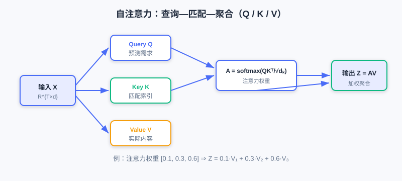
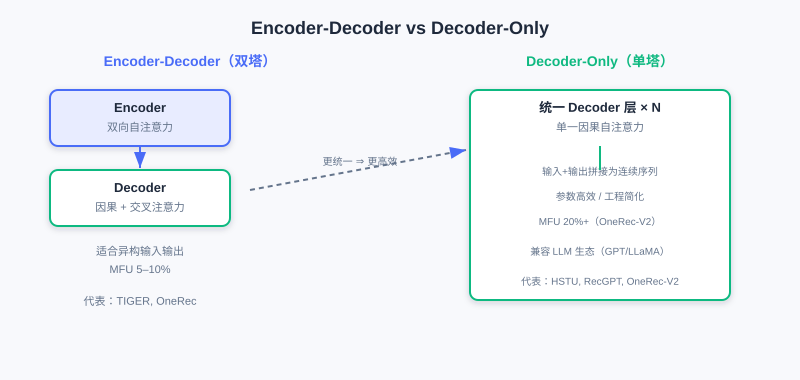
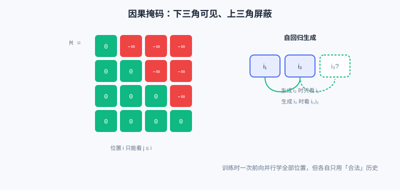
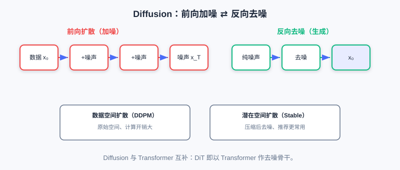

<div class="badge-row">
  <span style="background: #f0f4ff; color: #4A6CF7; padding: 4px 12px; border-radius: 20px; font-size: 0.85em; font-weight: 600; border: 1px solid rgba(74,108,247,0.2);">📖</span>
  <span style="background: #fef2f2; color: #dc2626; padding: 4px 12px; border-radius: 20px; font-size: 0.85em; border: 1px solid rgba(100,100,100,0.15);">⏱️ ~45 min read</span>
  <span style="background: #fef2f2; color: #dc2626; padding: 4px 12px; border-radius: 20px; font-size: 0.85em; border: 1px solid rgba(100,100,100,0.15);">🎯 Advanced</span>
</div>

# 生成式架构的基石

> 📝 **Before You Continue:** 建议先读完 [6.1](./gr-paradigm.md) 的「统一 Transformer」论断，以及 [2.3](./../part2-retrieval/two-tower.md) 中对内积与向量空间的直觉。本章不再深究数学推导，而是强调架构的**直观理解**与**推荐场景适配**。

理解了生成式推荐的核心思想后，我们来搭建支撑它的技术地基——**生成式架构（Generative Architecture）**。生成式推荐把推荐建模为序列生成任务，而要产出高质量的序列生成，需要强大的模型架构做后盾。

当前生成式推荐主要依赖两大类架构范式： **Transformer** 与 **Diffusion 模型（扩散模型）**。二者生成机制本质不同，却都为生成式推荐提供坚实支撑——Transformer 通过自回归逐 token 生成、擅长捕捉因果依赖；Diffusion 通过迭代去噪从噪声恢复数据、提供全新生成视角。更重要的是，它们 **并非互斥** ，而是互补协同。

读完本章，你将能够：

- 用「查询—匹配—聚合」解释 **自注意力** 的 Q/K/V 计算与多头机制
- 说明 **位置编码** （绝对/相对、时间感知）为何对推荐序列不可或缺
- 对比 **Encoder-Decoder** 与 **Decoder-Only** 两类架构的优劣与适用场景
- 解释 **因果掩码** 如何实现自回归生成并支持训练并行
- 概述 **Diffusion** 的前向扩散/反向去噪及其在推荐中的应用
- 完成 5 道分层练习题，巩固生成式架构的关键机制

---

## 6.2.0 为什么是 Transformer 与 Diffusion

自 2017 年《Attention is All You Need》问世，Transformer 已成为 NLP 主流，并扩展到视觉、语音等领域。它成功不只因表达力强，更因其 **高度规整的计算模式**——海量矩阵乘法能充分利用 GPU 并行，训练/推理效率远超 RNN、LSTM。

对生成式推荐而言，Transformer 的优势尤为明显：

1. **长程依赖** ：自注意力天然适合捕捉用户行为序列中任意位置间的依赖，无论历史多长都能灵活关注任意时刻信号。
2. **并行高效** ：可高效处理长序列，这对建模用户完整行为历史至关重要。
3. **可扩展** ：堆叠更多层、增宽隐层即可提升容量，为推荐模型的 **规模化（Scaling）** 提供坚实基础。

而 Diffusion 提供了另一种角度：它不从序列起点逐 token 构建，而是从 **纯噪声** 出发、通过 **迭代去噪** 逐步恢复目标，类似「从模糊石料雕出清晰形象」。这种全局并行去噪，在某些场景能突破自回归的速度瓶颈。

---

## 6.2.1 自注意力机制：查询—匹配—聚合

自注意力的核心创新，是让模型 **动态、选择性** 地聚焦于序列中的任意位置。它的本质用一句话概括： **给定当前查询（Query），序列中哪些部分（Key）最相关，它们的内容（Value）以多大权重被聚合？**

### QKV 的三步计算

给定输入序列表示矩阵 $\boldsymbol{X}\in\mathbb{R}^{T\times d}$（$T$ 序列长、$d$ 特征维），先经三个线性变换得到 Query、Key、Value：

$$\boldsymbol{Q}=\boldsymbol{X}\boldsymbol{W}^Q,\quad \boldsymbol{K}=\boldsymbol{X}\boldsymbol{W}^K,\quad \boldsymbol{V}=\boldsymbol{X}\boldsymbol{W}^V$$

- **Query** $\boldsymbol{Q}$：当前位置「想查询什么信息」，可理解为「当前时刻的预测需求」。
- **Key** $\boldsymbol{K}$：序列每个位置「提供什么信息」，是用来与 Query 匹配的索引。
- **Value** $\boldsymbol{V}$：序列每个位置「实际包含什么内容」，确定重要性后聚合的就是它。



**第二步** 计算注意力权重——Query 与每个 Key 的内积（相似度），缩放后 softmax：

$$\boldsymbol{A}=\text{softmax}\left(\frac{\boldsymbol{Q}\boldsymbol{K}^\top}{\sqrt{d_k}}\right)$$

缩放因子 $\sqrt{d_k}$ 防止维度过大时内积方差过大、softmax 过于尖锐（接近 one-hot）、梯度趋零。注意力矩阵第 $i$ 行即「预测第 $i$ 个物品时，历史各位置应被赋予的关注度」。

**第三步** 按权重聚合 Value：

$$\boldsymbol{Z}=\boldsymbol{A}\boldsymbol{V}$$

举个具体例子：用户历史 `[item1, item2, item3]`，预测 `item4` 时，Query 与三个物品 Key 匹配，若注意力权重为 `[0.1, 0.3, 0.6]`，则输出为 `0.1·V1 + 0.3·V2 + 0.6·V3`——模型自适应地从历史提取信息，而非对所有历史一视同仁。

### 🧠 Mental Model: 多头注意力是「专家组」

> 单个注意力头只能学一种「关注模式」。但用户行为受多因素驱动——有时看价格、有时看品牌、有时看功能。**多头注意力（Multi-Head Attention）** 把 $h$ 组独立 Q/K/V 并行计算，每个头像个「专家」：第 1 个头可能专盯「同品牌」（买了 iPhone 推 AirPods），第 2 个头专盯「同类别」（买了手机壳推贴膜），第 3 个头专盯「最近行为」。并行多专家让模型从多角度理解序列。

> **Analysis:** 为何不用一个大单头？$h=8$ 个维度 64 的头，总参数量与单个维度 512 的单头相同，但多头让每个头学独立子空间、避免信息混杂，表达力更强。代价是算力随 $h$ 线性增长。

---

## 6.2.2 位置编码与时间感知

自注意力有个天然缺陷： **它对序列顺序不敏感**。`[item1,item2,item3]` 与 `[item3,item1,item2]` 只要内容相同，计算结果完全一样。但推荐里顺序含关键时间信息——「先买手机再买壳」与「先买壳再买手机」语义不同。**位置编码（Positional Encoding）** 就是为序列每个位置注入位置信息。

**绝对位置编码** ：为每个位置 $t$ 分配固定编码 $\boldsymbol{p}_t$ 加到输入上：$\boldsymbol{X}'_t=\boldsymbol{X}_t+\boldsymbol{p}_t$。经典的正弦编码

$$PE_{(t,2i)}=\sin\left(\frac{t}{10000^{2i/d}}\right),\quad PE_{(t,2i+1)}=\cos\left(\frac{t}{10000^{2i/d}}\right)$$

确定性、可外推；也可改为 **可学习位置编码** （更灵活但不可外推）。

**相对位置编码** ：不在绝对位置上加编码，而是在注意力计算中引入相对位置偏置 $b_{i-j}$：

$$A_{ij}=\frac{\boldsymbol{q}_i^\top\boldsymbol{k}_j}{\sqrt{d_k}}+b_{i-j}$$

泛化更强、更自然处理变长序列（BERT/GPT 用绝对，T5/DeBERTa 用相对）。

### 推荐特有的时间编码

用户行为序列不仅有顺序，还有 **真实时间间隔**。例如：

```
用户A: [item1(1/1)] → [item2(1/2)] → [item3(1/3)]   # 密集短期兴趣
用户B: [item1(1/1)] → [item2(3/1)] → [item3(6/1)]   # 跨月长期兴趣
```

顺序相同，时间尺度却迥异。常见做法是将时间戳离散为小时/天/周多粒度嵌入再求和；更前沿如 **HSTU** 用 **相对时间位置编码** ：

$$\text{rab}_{p,t}=\boldsymbol{W}_{\text{rel}}\cdot\log(\Delta t_{p,t}+1)$$

对数变换压缩时间尺度，让模型对长/短期行为都建模良好。短视频场景间隔仅秒级，电商可跨数周——时间粒度选择对性能至关重要。

---

## 6.2.3 两类架构范式：Encoder-Decoder vs Decoder-Only

理解了自注意力与位置编码，我们进入 Transformer 的整体架构设计。生成式推荐主要采用两类范式。

### 结构差异

**Encoder-Decoder（编码器—解码器）** 采用双塔：Encoder 用 **双向自注意力** 处理输入（如用户历史 $i_{1:T}$，每个位置可看全部前后位置），获得全局理解；Decoder 同时用两种注意力——**因果自注意力** （预测第 $t$ 个 token 只能依赖前 $t-1$ 个，保证自回归）与 **交叉注意力** （以 Decoder 隐状态为 Query，Encoder 输出为 Key/Value，动态查询输入信息）。代表：原始 Transformer、T5、BART，推荐里 **TIGER** 最早引入 T5 架构。

**Decoder-Only（仅解码器）** 采用统一单塔：输入与输出视为连续序列，统一因果自注意力从左到右自回归生成，生成位置可关注所有输入位置与已生成位置。代表：GPT 系列，推荐里 **HSTU、RecGPT、OneRec-V2** 采用。



| 维度 | Encoder-Decoder | Decoder-Only |
|------|-----------------|--------------|
| 注意力类型 | Encoder 双向 + Decoder 因果 + 交叉注意力 | 统一的因果自注意力 |
| 参数分配 | 分散在 Encoder/Decoder/交叉注意力 | 集中在 Decoder 层 |
| 计算模式 | Encoder 并行编码 + Decoder 自回归解码 | 完全自回归处理 |
| 序列组织 | 输入输出分离 | 输入输出拼接 |

### 优劣权衡

**Encoder-Decoder 优势** 在 **结构化信息处理** ：解耦「理解用户」与「生成推荐」，Encoder 双向建模完整行为序列，交叉注意力提供显式「查询—检索」模式。特别适合 **输入输出异构** 场景——如输入是多模态特征（行为序列+画像+上下文）、输出是物品 Semantic ID 序列。OneRec 更把 Encoder 细分为短期/长期/正反馈多个 pathway，处理不同行为信号。

**缺点** 是 **效率与扩展性** ：三套注意力机制参数与计算都多；交叉注意力开销随输入长度线性增长；参数分散降低单模块容量，限制 Scaling 潜力。

**Decoder-Only 优势** 在 **简洁与统一** ：① **参数效率高**——所有参数集中在 Decoder，扩展时新增参数直接增强核心建模；② **工程简化**——只有一种注意力，更易算子融合/内存优化，工业部署 MFU 更高（OneRec-V2 达 20%+，Encoder-Decoder 仅 5–10%）；③ **LLM 生态兼容**——主流 LLM（GPT/LLaMA/Qwen）皆 Decoder-Only，可复用其架构配置、训练框架（如 HuggingFace Transformers），只需重初始化物品词表的 Embedding。

**缺点** 是 **单向约束** （因果注意力看不到未来，离线训练损失部分建模力）与 **上下文长度压力** （无独立 Encoder 压缩，长行为序列全作上下文输入）。近期工作探索 **混合架构** （如 OneRec 的 Lazy Decoder 共享 Encoder KV、Decoder-Only 加双向预训练目标）取长补短。

> **Analysis:** 架构选择无绝对优劣。任务维度：显式区分「理解/生成」或模态异构 → Encoder-Decoder；可表述为「序列续写」→ Decoder-Only。规模维度：充足数据支撑大规模预训练 → Decoder-Only 扩展性更优；小数据小模型（<1B）→ Encoder-Decoder 更易稳定训练。部署维度：极致延迟下，Decoder-Only 因 KV Cache/推测解码等端到端优化可能反而更高效。

---

## 6.2.4 因果掩码与 Diffusion 模型

### 因果掩码：自回归的关键

无论选哪类架构， **因果注意力掩码（Causal Masking）** 都是实现自回归的关键。它在 softmax 前对未来位置施加 $-\infty$：

$$\text{Attention}(Q,K,V)=\text{softmax}\left(\frac{QK^\top}{\sqrt{d_k}}+M\right)V,\quad M_{ij}=\begin{cases}0 & j\le i\\ -\infty & j>i\end{cases}$$

保证预测第 $i$ 个 token 时只能依赖前 $i-1$ 个，信息不泄漏。



因果掩码还带来 **训练效率提升** ：生成虽自回归，训练时却可并行计算所有位置损失。给定序列 $[i_1,\dots,i_T]$，模型可 **一次前向** 同时学习「基于 $[i_1]$ 预测 $i_2$」「基于 $[i_1,i_2]$ 预测 $i_3$」……每个预测只用了「合法」历史。这是 Transformer 相对 RNN 的重要优势。

推荐场景还发展了 **定制化掩码** ：Session-level Masking（跨会话边界屏蔽，建模多场景行为）、Task-specific Masking（CTR 看完整序列、CVR 只看已点击子序列）、Bidirectional Prefix Masking（静态特征作 prefix 双向可见，行为序列仍因果，HSTU 采用）。

### Diffusion 模型：迭代去噪的生成视角

与 Transformer 逐 token 序列化生成不同， **Diffusion 模型** 提供全新范式：从 **纯噪声** 出发，通过 **迭代去噪** 逐步恢复目标数据。核心是两个互逆的马尔可夫过程：

- **前向扩散** ：从真实数据逐步加高斯噪声，经 $T$ 步得近似纯噪声。
- **反向去噪** ：从随机噪声出发，经学习到的去噪网络逐步去噪，恢复真实数据。



按操作空间分两类： **数据空间扩散** （DDPM，直接在原始空间，计算大）与 **潜在空间扩散** （Stable Diffusion，先压缩到低维潜在空间再扩散，效率高——推荐场景更常用，因能降成本又提供紧凑语义表示）。还可发展 **条件扩散** ，通过拼接/交叉注意力/分类器引导注入用户历史等条件。

Diffusion 在推荐中的应用包括： **特征增强与表示学习** （潜在空间去噪生成鲁棒 embedding，缓解稀疏）、**序列生成** （并行去噪整条序列，不受严格顺序约束）、**多模态融合**、**协同过滤与图结构建模** （在交互图潜在表示上扩散）。其挑战在于 **多步迭代采样带来推理延迟** ，工业部署需采样加速、模型蒸馏来平衡质量与实时性。

> 💡 **Key Insight:** Diffusion 与 Transformer **互补非对立**——许多先进 Diffusion（如 DiT）直接以 Transformer 作去噪骨干。生成式推荐可据场景灵活组合两种机制：Transformer 抓因果依赖与并行 Scaling，Diffusion 提供多样性内在支持与全局并行生成。

---

## ⚠️ Common Mistakes in 6.2

| # | Mistake | Example | Why It's Wrong | Fix |
|---|---------|---------|---------------|-----|
| 1 | 认为自注意力天然感知顺序 | 「注意力已含位置信息」 | 自注意力顺序无关，需显式位置编码 | 必须加位置/时间编码 |
| 2 | 忽略缩放因子 $\sqrt{d_k}$ | 直接 softmax(QKᵀ) | 大 $d_k$ 内积方差大、softmax 过尖、梯度消失 | 务必除以 $\sqrt{d_k}$ |
| 3 | 以为 Encoder-Decoder 总优于 Decoder-Only | 「双塔信息更全」 | 参数分散限制 Scaling，MFU 低 | 据任务/规模/部署权衡 |
| 4 | 因果关系泄漏 | 训练时未加因果掩码 | 未来信息泄露，离线指标虚高 | 加下三角因果掩码 |
| 5 | 把 Diffusion 当 Transformer 的替代 | 「二选一即可」 | 二者互补，可结合（如 DiT） | 按场景组合两种机制 |

---

## 本章小结

### 📌 Key Takeaways

| Concept | Key Points | Why It Matters |
|---------|-----------|----------------|
| 自注意力 | Q/K/V 查询-匹配-聚合，多头并行 | 捕捉长程依赖、自适应聚焦 |
| 位置编码 | 绝对/相对 + 时间感知（HSTU） | 让顺序/时间间隔进入建模 |
| Encoder-Decoder | 双向编码+因果解码+交叉注意力 | 适合异构输入输出、结构化建模 |
| Decoder-Only | 统一因果自注意力 | 参数高效、MFU 高、LLM 生态兼容 |
| 因果掩码 | 下三角 $-\infty$，训练可并行 | 保证自回归一致性与效率 |
| Diffusion | 前向加噪/反向去噪、潜在空间主流 | 并行生成、多样性、与 Transformer 互补 |

### ❓ FAQ

**Q1: 为什么推荐里时间编码比 NLP 更重要？**
> A: NLP 的「位置」主要是语法顺序；推荐行为还带真实时间间隔（秒级到数月），同一顺序可能对应密集或长期兴趣，需将时间戳/间隔显式编码。

**Q2: Decoder-Only 的 MFU 为什么更高？**
> A: 只有一种注意力机制，计算模式高度统一，更容易算子融合与内存优化，硬件利用率显著高于三套注意力并存的 Encoder-Decoder。

**Q3: 因果掩码怎么做到「训练并行、生成串行」？**
> A: 训练时一次前向对所有位置算损失，但掩码让每个位置只看合法历史；生成时则严格按 $t=1,2,\dots$ 逐步解码。

### 🔗 前后关联

- **6.1** （范式基础）提出「统一 Transformer」论断，本章给出其机制细节。
- **6.3** （LLM 基础）深入 Decoder-Only 的预训练/微调/对齐，呼应本节架构选择。
- **6.4** （Codebook 量化）的语义 ID 是 Decoder-Only 自回归生成的「词表」。
- **7.x** （Scaling）承接本节「堆叠即规模化」，展开生成式模型的参数扩展。

---

## Practice Problems

Work through all problems in order — they get progressively harder. Each has a complete solution you can reveal after trying it yourself.

---

**Problem 6.2.1 — 注意力权重计算** 🟢 Easy

用户历史 `[item1, item2, item3]`，预测 `item4` 时 Query 与各 Key 内积经缩放 softmax 后得到权重 `[0.2, 0.3, 0.5]`，对应 Value 为 `V1=[1,0]`、`V2=[0,1]`、`V3=[1,1]`。求聚合输出 $\boldsymbol{Z}$。

<details>
<summary>💡 Solution (click to reveal)</summary>

**Approach:** 加权求和各 Value。

$$\boldsymbol{Z}=0.2[1,0]+0.3[0,1]+0.5[1,1]=[0.2,0]+[0,0.3]+[0.5,0.5]=[0.7,0.8]$$

**Key points:**
- 权重和为 1（softmax 保证）。
- item3 权重最大，输出最接近 V3。

</details>

---

**Problem 6.2.2 — 缩放因子作用** 🟢 Easy

设 $d_k=64$，某 Query 与 Key 内积为 16。若不做缩放直接 softmax 与除以 $\sqrt{64}=8$ 后 softmax，哪个更「尖锐」？说明后果。

<details>
<summary>💡 Solution (click to reveal)</summary>

**答：** 不缩放时输入为 16，缩放后为 $16/8=2$。softmax 输入越大分布越尖锐（趋近 one-hot）。不缩放会让注意力几乎只盯一个位置，梯度趋零、训练困难。缩放后分布更平滑，利于学习。

**Key points:**
- $\sqrt{d_k}$ 控制内积方差，防止大维度下数值爆炸。
- 这是 Transformer 训练稳定的关键小技巧。

</details>

---

**Problem 6.2.3 — 架构选型** 🟡 Medium

某团队要构建一个「输入=用户多模态特征（行为序列+画像+上下文），输出=物品 Semantic ID 序列」的检索式生成推荐。请说明理由更倾向 Encoder-Decoder 还是 Decoder-Only，并指出一条改用 Decoder-Only 的可能前提。

<details>
<summary>💡 Solution (click to reveal)</summary>

**答：** 更倾向 **Encoder-Decoder** ：输入（多模态）与输出（ID 序列） **模态异构** ，双塔可自然解耦「理解用户」与「生成推荐」；交叉注意力让 Decoder 动态查询用户历史。改用 Decoder-Only 的前提：若任务可重述为「序列续写」（把多模态特征与历史拼接成统一序列、预测后续物品），且追求更高 MFU 与 LLM 生态复用、数据量足以支撑大规模预训练，则可转 Decoder-Only。

**Key points:**
- 异构输入输出 → Encoder-Decoder 占优。
- 序列续写 + 大数据 → Decoder-Only 占优。

</details>

---

**Problem 6.2.4 — 因果掩码矩阵** 🔴 Hard

对长度为 4 的序列，写出因果掩码矩阵 $M$（下三角 0、上三角 $-\infty$）。并说明训练时模型如何「一次前向」同时学习预测 $i_2,i_3,i_4$。

<details>
<summary>💡 Solution (click to reveal)</summary>

**答：**

$$
M=\begin{bmatrix}
0 & -\infty & -\infty & -\infty\\
0 & 0 & -\infty & -\infty\\
0 & 0 & 0 & -\infty\\
0 & 0 & 0 & 0
\end{bmatrix}
$$

训练时，输入完整序列 $[i_1,i_2,i_3,i_4]$，因果掩码使第 1 位只看 $i_1$（学预测 $i_2$），第 2 位看 $i_1,i_2$（学预测 $i_3$），第 3 位看前三者（学预测 $i_4$），第 4 位看全部但不预测。所有位置损失在 **一次前向** 中并行计算，但各自只用合法历史——既保证自回归一致性，又获并行效率。

**Key points:**
- 掩码形状 = 下三角。
- 并行训练是自回归模型相对 RNN 的核心效率优势。

</details>

---

**🏆 Challenge: 设计混合推理链路**

一款短视频 App 要求「毫秒级」生成 10 条推荐，且希望兼顾生成质量与多样性。请写约 150 字说明：是否应采用纯 Diffusion 或纯 Transformer？能否组合？并指出压缩 Diffusion 推理延迟的两种工程手段。

<details>
<summary>💡 Hint</summary>

不宜纯 Diffusion（多步迭代采样延迟高）也不宜纯 Transformer 若需强多样性。可组合：用 Decoder-Only Transformer 主生成、Diffusion 做候选增强/多样性补全；或 DiT 式以 Transformer 为去噪骨干。压缩延迟手段：采样加速（少步采样/蒸馏）、模型蒸馏把多步去噪压成单步、KV Cache 与推测解码加速自回归。

</details>
