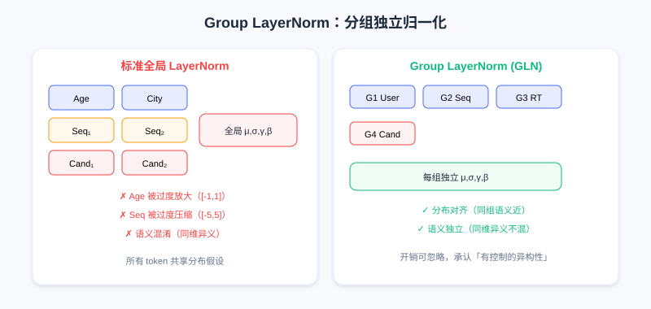
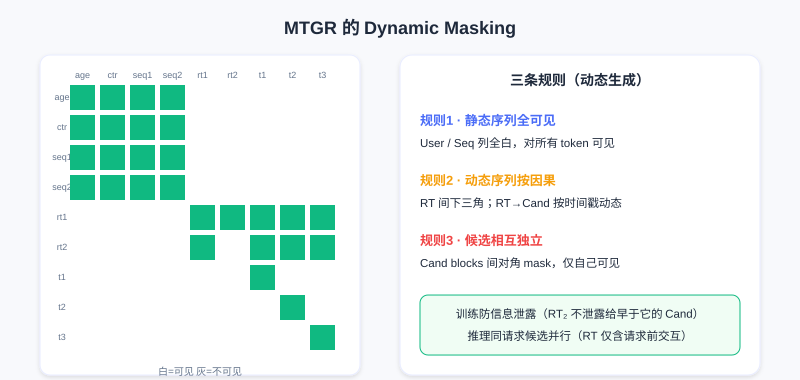

  📖
  ⏱️ ~50 min read
  🎯 Advanced

# MTGR：混合范式建模

> 📝 **Before You Continue:** 已读 [7.2 生成式排序](./generative-ranking.md)。本章承接其末尾的灵魂一问——用户粒度建模的效率优势，是否必然绑定完整生成式 formulation？MTGR 用「混合范式」给出否定答案。

HSTU 证明推荐可遵循 Scaling Law，GenRank 揭示生成式本质是自回归而非训练范式。两者都朝「纯粹性」演进：用统一序列建模替代碎片化特征工程，用端到端 Transformer 替代异构模块。

但这种纯粹性有代价。

在 HSTU/GenRank 中，为实现完整行为序列建模，预测用户对候选的行为时 **不能使用任何候选相关的交叉特征（cross features）**。这些是工业界多年迭代的宝贵经验——「用户对该类目历史点击率」「用户在该时段对此类内容的偏好」「物品与用户画像匹配度」等，精确捕捉用户与候选的细粒度交互。

美团团队发现一个严峻事实： **去除交叉特征会导致性能显著下降，且即使大幅增加模型规模也无法弥补**。这引出根本问题：生成式推荐的用户粒度建模范式，能否与传统 DLRM 的特征工程经验结合？

**MTGR（Meituan Generative Recommendation，美团生成式推荐）** 给出肯定答案。它的核心贡献不是更快训练或更低延迟，而是提出一种 **混合范式** ：在保持用户粒度聚合效率的同时，支持 target-aware 的判别式建模。

---

## 7.3.0 范式的再思考：生成 vs 判别

### HSTU/GenRank 的根本假设

两者都采用交织式建模 $[\Phi_0, a_0, \Phi_1, a_1, \ldots]$，联合分布分解为 $p(\Phi_0)\cdot p(a_0|\Phi_0)\cdot p(\Phi_1|\Phi_0,a_0)\cdots$。排序任务对应 $p(a_i | \Phi_0, a_0, \ldots, \Phi_i)$——看起来 target-aware，因为模型看到了候选 $\Phi_i$。

但问题在于： **候选 $\Phi_i$ 是序列的一部分，与历史行为 $a_{i-1}$ 地位平等**。自回归训练时，位置 $i$ 的预测只能依赖 $0$ 到 $i-1$。而交叉特征往往需要「跨越」这种顺序依赖——它们需同时看用户某历史统计（如「科技内容平均停留时长」）和当前候选属性（「这是科技类视频」）再算交互。纯生成式下这种跨越被禁止：若允许 $\Phi_i$ 的表示依赖「用户对该候选所属类目的历史偏好」，就破坏了因果性——因为这特征实际已「看到未来」（它针对当前候选 $\Phi_i$ 计算）。

GenRank 的 action-oriented 虽压缩序列长度，但没改变根本限制，仍保持严格时序依赖。

美团消融实验给出明确答案： **去除交叉特征后，即使最大规模生成式模型，性能也退化到甚至不如中等规模传统 DLRM**。这不是 scaling 能补的 gap，而是信息本身的缺失。

### 判别式排序的本质

为什么交叉特征如此关键？看排序任务本质：输入是用户历史 + 一组候选，任务是对每个候选预测行为倾向（点击、停留、转化）。这是典型 **判别式任务** ：给定输入 $x$（历史+候选），预测标签 $y$（行为）。

传统 DLRM 表述为 $p(a | u, i)$，$u$ 是用户表示，$i$ 是物品表示。关键在于： **用户表示 $u$ 可以依赖于候选物品 $i$**。例如「用户对科技类内容平均点击率」只在候选是科技类时才有意义——这是 $u\times i$ 的交互，二阶甚至更高阶交叉。很多重要信号来自「条件统计」（用户在该时段对此类内容的历史行为、该创作者内容对这类用户的吸引力），它们需同时观察用户子集历史与候选属性再算统计量，在生成式方式中难自然表达。

从概率看，判别式关心条件分布 $p(a | 历史, 候选)$，不需建模完整联合分布 $p(历史, 候选, a)$。生成式通过分解联合分布得条件分布，却带来额外负担：必须建模 $p(候选 | 历史)$——即使这不是真正关心的。

### MTGR 的核心洞察

**用户粒度建模带来的效率提升，本质上来自样本聚合和计算复用，而不一定要求完整生成式建模。**

---

## 7.3.1 MTGR 的混合范式

MTGR 提出看似矛盾实则巧妙的方案： **用生成式模型的架构（Transformer + 用户粒度聚合），但保持判别式建模目标**。

具体数据组织：把同一用户的多个候选聚合到一个样本：

$$[\text{User}, \text{Seq}, \text{RealTime}, [\text{Cross}_1, \text{Item}_1], [\text{Cross}_2, \text{Item}_2], \ldots]$$

关键差异：

- **历史部分** （User, Seq, RealTime）与 HSTU/GenRank 一致，是用户完整行为序列
- **候选部分** （Cross, Item）不再是历史延续，而是待预测目标，每个候选表示直接包含交叉特征

这打破了「内容—行为交替」的严格时序结构，承认：排序阶段候选是给定输入，不是需生成的中间状态。因此可为每个候选构造针对性特征（含依赖历史统计与候选属性的交叉特征）。

用户/序列/实时 token 编码历史，多个候选 token 各自融合物品特征与交叉特征（如 ctr、pv），并行处理。候选部分包含交叉特征是 MTGR 相对纯生成式的关键优势。

各 token 含义：User tokens（年龄、性别、城市等静态属性）；Sequence tokens（长期行为序列）；RealTime tokens（近期交互）；Candidate tokens（每个候选一个，融合物品+交叉特征）。

这种组织仍保留用户粒度聚合优势：对 $m$ 个候选，历史部分（User+Seq+RealTime）只编码一次，$m$ 个候选 token 并行。复杂度 $O((n+m)^2)$ 而非 $O(m\cdot n^2)$，当 $m\ll n$ 时显著提速。但 MTGR 不再建模完整行为序列，只在候选位置算 loss、预测行为——判别式目标允许候选表示含任意用户—物品交叉信息。

> 💡 **Key Insight:** MTGR 的哲学是**区分手段和目的**。生成式架构（Transformer+序列建模）是强大的表征手段，但不必服务于生成式目标；用户粒度聚合是高效计算组织，但不必要求完整因果序列。混合范式在保持效率的同时，恢复了判别式建模的灵活性。

---

## 7.3.2 架构创新一：特征到 Token 的映射

统一框架引入交叉特征时，问题出现。考虑 3 个候选：

- 候选1：科技视频，用户科技类历史点击率 0.8
- 候选2：美食视频，用户美食类历史点击率 0.3
- 候选3：科技视频，用户科技类历史点击率 0.8

候选1、3 交叉特征相同，但是不同候选，应独立评分。MTGR 对每个候选构造独立 token，融合：

1. 物品固有特征（ID、类目、标签、时长）
2. 交叉特征（用户对该类目历史点击率、该时段偏好）
3. 位置与时序信息（列表位置、曝光时间）

形式化，候选 $i$：

$$\text{CandidateToken}_i = \text{MLP}(\text{Concat}(\text{Emb}(\text{Item}_i), \text{Emb}(\text{Cross}_i)))$$

关键决策： **交叉特征视为候选表示的一部分，而非历史序列一部分**。即使候选1、3 交叉特征相同，仍生成两个独立 token（因其他维度如物品 ID、标题不同）。

用户历史部分 token 生成简单：User tokens（每属性一 token）、Sequence tokens（每历史物品一 token）、RealTime tokens（每近期交互一 token）——都是「纯粹」的，不依赖任何候选，只编码历史。

这种非对称 token 组织带来问题： **不同类型 token 处于不同语义空间**。User token 编码人口统计，Sequence token 编码行为模式，Candidate token 编码物品+交叉。直接用统一 Transformer 处理，不同语义空间 token 会相互干扰。

---

## 7.3.3 架构创新二：Group Layer Normalization

标准 LayerNorm 在 token 特征维度归一化：$\text{LayerNorm}(x) = (x-\mu)/\sigma \cdot \gamma + \beta$，假设所有 token 共享相同特征分布，用全局参数 $\gamma,\beta$。

但 MTGR 下这假设被打破。考虑一个 batch 的 token 序列：

$$[\text{Age}, \text{Gender}, \text{City}, \text{Seq}_1, \ldots, \text{Seq}_{100}, \text{RT}_1, \ldots, \text{RT}_{10}, \text{Cand}_1, \text{Cand}_2, \text{Cand}_3]$$

Age token 激活值可能在 $[-1,1]$（离散人口统计），Sequence token 可能 $[-5,5]$（经更多层累积）。全局 LayerNorm 会算所有 token 均值方差再归一化，导致 Age 被「过度放大」、Sequence 被「过度压缩」。更严重的是 **语义混淆** ：维度 100 在 User token 可能编码「用户活跃度」，在 Candidate token 可能编码「候选热度」，全局归一化把它们混在一起，削弱表达。

MTGR 提出 **Group Layer Normalization（GLN，分组层归一化）** ：按 token 类型分组归一化。

- Group 1: User tokens
- Group 2: Sequence tokens
- Group 3: RealTime tokens
- Group 4: Candidate tokens

每组内独立算均值方差与归一化参数：

$$\text{GLN}(x_i) = \frac{x_i - \mu_{g(i)}}{\sigma_{g(i)}} \cdot \gamma_{g(i)} + \beta_{g(i)}$$

其中 $g(i)$ 是 token $i$ 所属组。

左：标准全局 LayerNorm 把所有 token 混在一起，分布与语义相互干扰；右：GLN 按 User/Seq/RT/Cand 四组独立归一化，分布对齐、语义独立。

好处：(1) **分布对齐**——同组 token 语义相近、分布相似，独立归一化稳定训练；(2) **语义独立**——不同组同维度可编码不同信息，参数独立性保证语义独立。GLN 仅在 LayerNorm 上加 group 信息，计算开销可忽略，却承认重要事实： **混合范式中，不同类型信息应在表示空间保持相对独立，而非强行统一**。这原则也体现在 MTGR 其他处（不同组可用不同维度 embedding、不同层处理）——这是统一架构与特征灵活性间的平衡点。

---

## 7.3.4 架构创新三：Dynamic Masking

Transformer 自注意力允许任意 token 交互，但序列建模通常需限制以满足因果性。HSTU/GenRank 用 causal mask（下三角）。但 MTGR 混合范式下 causal mask 不再适用——token 序列不严格按时间组织。

回顾 MTGR 组织：$[\text{User}, \text{Seq}, \text{RealTime}, \text{Cand}_1, \ldots, \text{Cand}_m]$。User 静态、Seq 已按时间排序、RealTime 近期（可能与候选曝光时间重叠）、Candidate 并行（不应互见，因真实曝光用户一次只看一个）。简单 causal mask 会有问题：Cand$_2$ 能看到 Cand$_1$，但训练时候选在不同时刻曝光、推理时需同时评分，候选间可见性不合理。

更复杂的是 RealTime 处理。RealTime 记录近期窗口（如最近 1 小时）交互。若把一天多次曝光聚合，RealTime 可能含某候选曝光后的交互，导致 **信息泄露**。例如：12:00 看候选 A（点击）、12:30 看候选 B（未点）、13:00 看候选 C（点击）。聚合训练时 RealTime 含 13:00 点击，但预测 12:30 的候选 B 时模型不该看到它。

MTGR 的 **Dynamic Masking（动态掩码）** 用细粒度可见性控制解决，定义三条规则：

**规则1：静态序列对所有 token 可见**——User 和 Seq 来自聚合窗口前历史，任何候选都可 attend（长期历史对所有候选有意义）。mask 矩阵中 User/Seq 列全为 1。

**规则2：动态序列遵循因果性**——RealTime token 时间戳可能在聚合窗内，与候选曝光有先后。RT$_i$ 对 RT$_j$ 可见性取决于时间戳（$t_i<t_j$ 则可）；RT$_i$ 对 Cand$_k$ 可见性也按时间戳（$t_i <$ Cand$_k$ 曝光时间则可）。mask 中 RealTime 间是 causal（下三角），对 Candidate 按实际时间戳动态决定。

**规则3：候选之间相互独立**——Cand$_i$ 对 Cand$_j$（$j\neq i$）不可见，保证评分独立。mask 中 Candidate blocks 间是对角 mask（仅对角线为 1）。

白色可见、灰色不可见：用户特征与历史序列列全白（全局可见）；实时序列按时间戳呈部分三角（因果）；候选间仅对角线可见（独立）。

这 mask 不是预固定，而是按每样本 token 实际时间戳 **动态生成**——这就是「Dynamic Masking」名字由来。它避免信息泄露：训练时防模型学虚假因果，推理时允许同请求所有候选并行处理（RealTime 仅含请求前交互、候选相互独立），保持计算效率。Dynamic Masking 是混合范式最后一块拼图，让统一 Transformer 同时处理因果序列（历史）与非因果目标（候选评分），在灵活性与正确性间找到平衡。

> **Analysis:** MTGR 不追求最快训练，而追求**兼容性**——用生成式架构的计算复用（user-level 聚合、$O((n+m)^2)$）换回判别式的交叉特征灵活性。GLN 与 Dynamic Masking 是让异构 token 在同一 Transformer 共存的两个关键技术：前者解决语义空间冲突，后者解决时序/独立性冲突。

---

## ⚠️ Common Mistakes in 7.3

| # | Mistake | Example | Why It's Wrong | Fix |
|---|---------|---------|---------------|-----|
| 1 | 以为交叉特征可 scale 弥补 | 「去了交叉特征加大模型就补回」 | 美团实验：最大生成式模型仍不如中等 DLRM | 交叉特征是信息缺失，非容量问题 |
| 2 | 以为 MTGR 仍是纯生成式 | 「MTGR 只是 HSTU 加特征」 | MTGR 只在候选位置算 loss，是判别式目标 | 它是混合范式：生成架构+判别目标 |
| 3 | 把交叉特征塞进历史序列 | 「把 ctr 当 sequence token」 | 破坏因果性（特征已「看未来」） | 交叉特征属候选 token，非历史 |
| 4 | 对混合 token 用全局 LayerNorm | 「统一 Transformer 就用标准 LN」 | 不同组分布/语义冲突，互相干扰 | 用 Group LayerNorm 分组归一化 |
| 5 | 混合范式沿用 causal mask | 「候选按顺序排，causal 就行」 | 候选间泄露、RealTime 跨曝光泄露 | 用 Dynamic Masking 按时间戳动态生成 |

---

## 本章小结

### 📌 Key Takeaways

| Concept | Key Points | Why It Matters |
|---------|-----------|----------------|
| 生成式代价 | 纯生成式禁用候选交叉特征，性能难补 | 引出混合范式必要性 |
| 判别式本质 | $p(a\|u,i)$，$u$ 可依赖 $i$ | 交叉特征是条件统计，生成式难表达 |
| 混合范式 | 生成架构 + 判别目标，候选含交叉特征 | 效率与灵活性兼得 |
| Group LayerNorm | 按 User/Seq/RT/Cand 分组归一化 | 解决异构 token 语义冲突 |
| Dynamic Masking | 静态全可见/动态按时间戳因果/候选对角 | 解决信息泄露与独立性 |

### ❓ FAQ

**Q1: MTGR 和 HSTU 最核心的区别是什么？**
> A: HSTU 是纯生成式（建模完整行为序列联合分布、自回归）；MTGR 是混合范式——用生成式架构做判别式排序，只在候选位置算 loss，候选 token 可含交叉特征。一句话：HSTU 生成行为序列，MTGR 判别候选行为。

**Q2: 为什么交叉特征不能放进历史序列？**
> A: 交叉特征（如「用户对该候选类目的历史偏好」）是针对当前候选计算的，放进序列就等于让历史「看到未来」候选，破坏因果性。MTGR 把它作为候选 token 的一部分，与历史解耦。

**Q3: GLN 相比标准 LayerNorm 多花多少算力？**
> A: 几乎可忽略——只是在 LayerNorm 上增加 group 索引，按组独立算均值方差。代价极小，却避免了异构 token 的分布/语义相互干扰，训练稳定性显著提升。

### 🔗 前后关联

- **7.2（生成式排序）** 末尾的灵魂一问由本章直接回答：效率优势不必绑定完整生成式 formulation。
- **7.4（RankMixer）** 同样处理异构特征，但走 hardware-aware 路线（Token Mixing + Per-Token FFN），可对照 GLN 的思路。
- **3.2（特征交叉）** 中 FM/DCN 的交叉特征正是 MTGR 想保留的「判别式经验」，本章是其在生成式时代的回归。

---

## Practice Problems

Work through all problems in order — they get progressively harder. Each has a complete solution you can reveal after trying it yourself.

---

**Problem 7.3.1 — 范式辨析** 🟢 Easy

判断以下陈述更贴近 HSTU/GenRank（纯生成式）还是 MTGR（混合范式）：
- (a) 在候选位置算 loss，候选 token 包含「用户对该类目历史点击率」
- (b) 建模完整行为序列 $[\Phi_0,a_0,\ldots]$ 的联合分布，自回归预测

💡 Solution (click to reveal)

**Approach:** 抓住「是否在候选位置用判别式目标 + 是否含交叉特征」。

- (a) **MTGR** ：候选含交叉特征、只在候选算 loss，是判别式目标。
- (b) **HSTU/GenRank** ：纯生成式联合分布建模 + 自回归。

**Key points:**
- 混合范式 = 生成架构 + 判别目标。
- 交叉特征的存在是 MTGR 的标志。

---

**Problem 7.3.2 — 复杂度对比** 🟢 Easy

对 $n=1000$ 历史 token、$m=200$ 候选，HSTU 式逐候选独立评分复杂度约 $O(m\cdot n^2)$，MTGR 聚合后约 $O((n+m)^2)$。两者数量级相差约多少倍？

💡 Solution (click to reveal)

**Approach:** 代入估算。

- HSTU 式：$m\cdot n^2 = 200 \times 10^6 = 2\times10^8$。
- MTGR：$(n+m)^2 = 1200^2 = 1.44\times10^6$。
- 相差 $\approx 2\times10^8 / 1.44\times10^6 \approx 139$ 倍。

**Key points:**
- 用户粒度聚合让历史只编码一次，候选并行。
- 这是 MTGR 保留效率的来源。

---

**Problem 7.3.3 — GLN 动机** 🟡 Medium

为什么对 MTGR 的 token 序列用标准全局 LayerNorm 会有问题？举一个「语义混淆」的具体例子。

💡 Solution (click to reveal)

**Approach:** 从分布差异 + 同维度异语义两个角度。

全局 LayerNorm 算所有 token 的均值方差归一化。User token（如 Age）激活范围小（如 $[-1,1]$），Sequence token 经多层累积范围大（如 $[-5,5]$），全局方差被 Sequence 拉高 → Age 被过度放大、Sequence 被过度压缩。更糟的是语义混淆：维度 100 在 User token 编码「用户活跃度」，在 Candidate token 编码「候选热度」，全局归一化把两语义混在一起。

**Key points:**
- 异构 token 需分组归一化（GLN）。
- GLN 让每组分布对齐、语义独立。

---

**Problem 7.3.4 — Dynamic Masking 规则** 🔴 Hard

设计一条 Dynamic Masking 规则，处理以下场景：用户 12:00 点候选 A（点击）、12:30 看候选 B（未点）、13:00 点候选 C（点击），三者聚合成一个训练样本，RealTime 含 13:00 点击。预测候选 B（12:30 曝光）时，RT（13:00）应可见吗？为什么？

💡 Solution (click to reveal)

**Approach:** 套用规则2（动态序列按时间戳因果）。

不应可见。RT（13:00）时间戳晚于候选 B 曝光时间（12:30），按规则2「RT$_i$ 对 Cand$_k$ 可见当且仅当 $t_i <$ Cand$_k$ 曝光时间」，13:00 > 12:30，故屏蔽。否则模型偷看 B 之后的行为，造成 **信息泄露** ，学到虚假因果。

**Key points:**
- Dynamic Masking 按实际时间戳动态生成，防泄露。
- 候选间（A/B/C）相互独立（规则3），互不可见。

---

**🏆 Challenge: 混合范式设计**

某业务有强交叉特征（如「用户×时段×类目」三维统计），但想借用生成式架构的 user-level 聚合提速。请写 150 字内，说明你如何用 MTGR 思路设计 token 组织与 mask，并指出必须保留哪两个架构创新。

💡 Hint

token 组织：历史（User/Seq/RT）+ 多候选（每候选融合三维交叉特征）聚合。mask：静态序列全可见、RealTime 按时间戳因果、候选间对角屏蔽（Dynamic Masking）。必保留：Group LayerNorm（异构 token 不冲突）+ Dynamic Masking（防泄露/保独立）。这正对应 MTGR 的两个核心架构创新。

