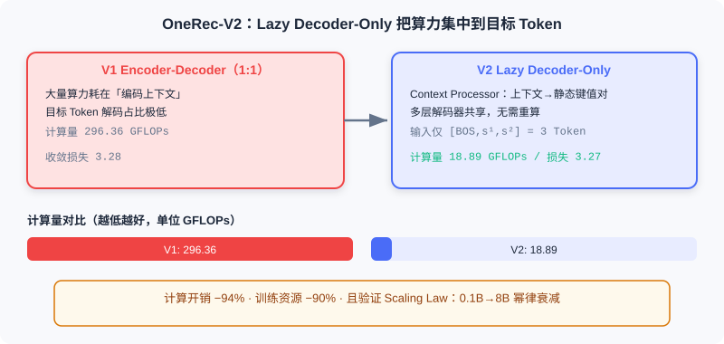

  📖
  ⏱️ ~40 min read
  🎯 Advanced

# 端到端生成式推荐

> 📝 **Before You Continue:** 本章假设你已理解 [1.1](./../part1-introduction/recommender-system-basics.md) 的两种范式与端到端生成动机，并熟悉 [2.3](./../part2-retrieval/two-tower.md) 中**语义 ID** 的初步概念。本章把它推向工业级落地。

传统多阶段级联架构（MCA）在推荐场景中暴露出最尖锐的矛盾：海量算力消耗在 **通信与存储** 而非模型计算，GPU 利用率远低于大语言模型；各阶段目标分散，模型结构差异导致建模不一致；级联结构更阻碍了 **Scaling Law**、强化学习对齐等先进技术的应用。

快手提出的 **OneRec** 框架，把推荐重新定义为 **端到端的生成式任务** ：模型根据用户上下文直接「生成」推荐序列，而不是从候选集里「挑选」。本节先看级联架构的深层瓶颈，再从 OneRec-V1 的体系，走到 V2 如何突破瓶颈。

读完本章，你将能够：

- 说明 **语义 ID（Semantic ID）** 如何解决「直接生成原子 ID 导致 Softmax 爆炸」的难题
- 描述 **OneRec-V1** 的四通路编码器与奖励系统设计，及其面对的两个瓶颈
- 解释 **Lazy Decoder-Only** 为何能把解码计算量降低 94%
- 复述 **Scaling Law** 在 OneRec-V2 上的验证与 **GBPO** 相比 ECPO 的改进
- 完成 5 道分层练习题，巩固语义 ID、架构与对齐算法

---

## 8.1.0 为什么需要端到端生成式推荐

推荐系统长期运行在「召回—预排序—排序—重排」的漏斗上。但正如 [1.1](./../part1-introduction/recommender-system-basics.md) 所述，级联架构有三个挥之不去的痛点，在推荐场景下尤为突出：

- **计算碎片化**——各阶段独立部署、独立通信，大量资源花在数据传输而非有效计算，GPU 利用率远低于 LLM 训练。
- **优化目标冲突**——召回优化相关性、排序优化点击率、重排优化多样性，各自为战，全局次优且误差逐层累积。
- **与 AI 前沿脱节**——阶段割裂使 Scaling Law、RLHF 等在大模型领域验证有效的技术难以直接引入。

> 💡 **Key Insight:** 端到端生成式架构的本质，不是「换一个更大的模型」，而是**把分散的子目标重新收束为一个统一的序列生成损失**，从而让全局最优成为可能。

### 🧠 Mental Model: 从「海选评委」到「私人裁缝」

> 把级联推荐想成一场海选：先让成千上万选手过初筛（召回），再让评委逐一打分（排序），最后导演统筹出场顺序（重排）。每一步都在「缩小候选」。端到端生成式则像一位了解你品味的裁缝——他不听你报一堆候选，而是直接根据你的身形（上下文）**裁出一件衣服**（生成序列）。少了中间环节，也少了走样。

---

## 8.1.1 语义 ID：让模型「说出」一个物品

生成式推荐面临的第一个硬骨头是： **模型怎么「说出」一个物品？** 传统系统用原子 ID（如视频 ID ``vid_12345678``）标识物品，但快手有数十亿物品，直接生成原子 ID 会让 Softmax 层计算量爆炸。

**OneRec-V1** 采用 **语义 ID（Semantic ID）** ：把物品映射到一个有限且可控的词表空间。每个视频被编码为 $L_t=3$ 个语义 Token，词表大小为 $N_t$。总编码空间为 $N_t^{L_t}$——远大于实际物品数，既保证覆盖，又用更大词表引入更多参数提升性能。

语义 ID 的生成分两个阶段：

**阶段一：协同感知的多模态表示学习。** 视频的标题、标签、ASR、OCR、封面、采样帧等经视觉语言模型（如 miniCPM-V-8B）压成 1280 个 Token，再用 **QFormer** 压缩为 4 个可学习查询向量。但仅依赖内容特征捕捉不到协同信号，于是引入 **物品对对比学习** ，拉近高协同相似度的物品对：

$$\mathcal{L}_{I2I} = -\frac{1}{|\mathcal{B}|} \sum_{(i,j) \in \mathcal{B}} \log \frac{\exp(\text{sim}(\tilde{\boldsymbol{M}}_i, \tilde{\boldsymbol{M}}_j) / \tau)}{\sum_{(i',j') \in \mathcal{B}} \exp(\text{sim}(\tilde{\boldsymbol{M}}_i, \tilde{\boldsymbol{M}}_{j'}) / \tau)}$$

同时用标题生成辅助任务防止表示退化，保留内容理解能力。

**阶段二：RQ-Kmeans 层次化量化。** 获得协同感知表示后，用 **残差量化 K-means（RQ-Kmeans）** 把连续表示离散化为语义 ID。与端到端训练的 RQ-VAE 不同，RQ-Kmeans 直接在残差上做 K-means 构建码本：

$$\mathcal{R}^{(1)} = \{\tilde{\boldsymbol{M}}_i\}, \quad \mathcal{C}^{(l)} = \text{K-means}(\mathcal{R}^{(l)}, N_t)$$

$$s_i^l = \arg\min_k \|\mathcal{R}_i^{(l)} - \boldsymbol{c}_k^{(l)}\|, \quad \mathcal{R}_i^{(l+1)} = \mathcal{R}_i^{(l)} - \boldsymbol{c}_{s_i^l}^{(l)}$$

经过 3 层量化，每个视频 $m$ 获得由粗到细的语义标识符序列 $\{s_m^1, s_m^2, s_m^3\}$，这成为生成模型的输出目标。

> **Analysis:** 语义 ID 是连接「生成模型」与「离散物品」的桥梁。它把 $O(|\mathcal{V}|)$ 的超大词表压缩到可控规模，同时让语义相近的物品共享前缀 Token——这既利于生成，也利于后续「先粗后细」的层次化解码。代价是量化有损，需要精心设计码本。

---

## 8.1.2 OneRec-V1：Encoder-Decoder 与偏好对齐

有了语义 ID，OneRec-V1 用经典 **Encoder-Decoder 架构** 实现端到端生成：编码器处理用户的多尺度特征，解码器基于上下文以自回归方式生成目标物品的语义 ID 序列。

### 编码器：四通路理解用户

编码器体现了对用户兴趣 **多时间尺度** 的深刻理解，含四个通路：

1. **用户静态特征通路**——ID、年龄、性别等基础画像，经两层密集层得 $\boldsymbol{h}_u \in \mathbb{R}^{1 \times d_{model}}$。
2. **短期行为通路**——最近 $L_s=20$ 次交互，含物品/作者 ID、标签、时间戳、时长、交互标签，得 $\boldsymbol{h}_s \in \mathbb{R}^{L_s \times d_{model}}$。
3. **正反馈行为通路**——最近 $L_p=256$ 次高参与交互，得 $\boldsymbol{h}_p \in \mathbb{R}^{L_p \times d_{model}}$。
4. **超长期历史通路**——OneRec-V1 一大创新。用户可达 10 万条历史，直接处理会算力爆炸。先用分层 K-means 压缩（聚类数 $\lfloor\sqrt[3]{|D|}\rfloor$ 选代表物品），再用 QFormer 以 128 个可学习查询对压缩后的 2000 长度序列做交叉注意力，得 $\boldsymbol{h}_l \in \mathbb{R}^{128 \times d_{model}}$。

四路输出拼接后经 $L_{enc}$ 层 Transformer 编码器：

$$\boldsymbol{z}^{(i+1)} = \boldsymbol{z}^{(i)} + \text{SelfAttn}(\text{RMSNorm}(\boldsymbol{z}^{(i)})), \quad \boldsymbol{z}^{(i+1)} = \boldsymbol{z}^{(i+1)} + \text{FFN}(\text{RMSNorm}(\boldsymbol{z}^{(i+1)}))$$

最终输出 $\boldsymbol{z}_{enc} \in \mathbb{R}^{(1+L_s+L_p+128) \times d_{model}}$ 提供全面上下文。

### 解码器：自回归生成语义 ID

解码器输入为 ``[BOS]`` 与目标物品的语义 ID 序列，每层含因果自注意力（捕获已生成 Token 依赖）、交叉注意力（关注编码器上下文）、MoE 前馈（top-k 路由增容量保效率）。训练用下一 Token 预测的交叉熵：

$$\mathcal{L}_{NTP} = -\sum_{j=0}^{L_t-1} \log P(s_m^{j+1} | [s_{[BOS]}, s_m^1, \ldots, s_m^j])$$

### 奖励系统：突破「模仿天花板」

预训练只拟合历史曝光分布，而曝光数据来自传统系统——模型本质上在「模仿」过去，性能上限被旧系统束缚。OneRec-V1 引入基于奖励系统的 RL 后训练，含三层奖励：

**① 用户偏好对齐（P-Score）。** 用神经网络学习个性化偏好分数，基于 SIM 架构为每个目标（CTR、LTR、VTR 等）建独立塔，各塔用对应标签算二元交叉熵作为辅助任务，再输入最终 MLP 输出 P-Score：

$$\mathcal{L}_{\text{P-Score}} = \sum_{xtr \in S_o} w^{xtr} \mathcal{L}_{\text{P-Score}}^{xtr}, \quad S_o = \{\text{ctr, lvtr, ltr, vtr}, \ldots\}$$

**② 生成格式规范化（格式奖励）。** 语义 ID 编码空间远大于物品数，推理可能生成无法映射真实物品的 **非法序列**。RL 引入后会急剧恶化——源于 **挤压效应（Squeezing Effect）** ：模型把概率质量压到当前最优输出，使部分合法 Token 概率被压到与非法 Token 相近。OneRec-V1 对合法样本设优势为 1、直接丢弃非法样本以避免挤压。

**③ 工业场景对齐（SIR）。** 端到端特性让「只需把优化目标融入奖励系统」。如病毒内容占比超阈值 $f$ 时对 P-Score 降权：

$$r_i' = \begin{cases} r_i & \text{if } o_i \notin I_{\text{viral}} \\ \alpha r_i & \text{if } o_i \in I_{\text{viral}} \end{cases}, \quad \alpha \in (0, 1)$$

实验表明 SIR 降低病毒内容曝光 9.59%，核心指标稳定。

### ECPO：偏好对齐算法

OneRec-V1 用 **ECPO（Early Clipped GRPO）** 对齐偏好。对用户 $u$ 用旧策略生成 $G$ 个物品，各经 P-Score 得奖励 $r_i$：

$$\mathcal{J}_{ECPO}(\theta) = \mathbb{E}\left[\frac{1}{G}\sum_{i=1}^G \min\left(\frac{\pi_{\theta}(o_i|u)}{\pi_{\theta_{old}}'(o_i|u)}A_i, \text{clip}\left(\frac{\pi_{\theta}(o_i|u)}{\pi_{\theta_{old}}'(o_i|u)}, 1-\epsilon, 1+\epsilon\right)A_i\right)\right]$$

优势 $A_i = (r_i - \text{mean}) / \text{std}$，旧策略经早期裁剪：

$$\pi_{\theta_{old}}'(o_i|u) = \max\left(\frac{\text{sg}(\pi_\theta(o_i|u))}{1+\epsilon+\delta}, \pi_{\theta_{old}}(o_i|u)\right), \quad \delta > 0$$

ECPO 的关键改进是 **对负优势样本的策略比率预先裁剪** ，避免 GRPO 中负优势比率任意大导致梯度爆炸。

> **Analysis:** V1 在快手线上验证了端到端生成式推荐的可行性。但扩展模型规模时暴露两个瓶颈：一是 Encoder-Decoder **计算资源分配失衡**——绝大部分算力消耗在上下文编码，真正产生梯度的目标 Token 解码占比极低；二是基于奖励模型的 RL 面临采样效率低与 reward hacking 风险。这催生了 V2。

---

## 8.1.3 OneRec-V2：Lazy Decoder-Only 与 Scaling Law

OneRec-V2 从架构与算法双维度突破：架构上提出 **Lazy Decoder-Only** 解决计算效率，算法上引入基于真实用户反馈的 RL 突破奖励模型局限。

### Lazy Decoder-Only 架构

设计哲学是： **把计算资源集中到真正对损失贡献梯度的目标物品 Token 上**。它含两个核心组件：

**Context Processor。** 把所有用户特征拼成统一上下文序列，每个 Token 映射到维度：

$$d_{context} = S_{kv} \cdot L_{kv} \cdot G_{kv} \cdot d_{head}$$

其中 $S_{kv}$ 是键值分离系数（$S_{kv}=1$ 共享、$S_{kv}=2$ 分离），$L_{kv}$ 键值层数。Context Processor 沿特征维切成 $L_{kv}$ 组，每组经 RMSNorm 生成键值对。巧妙之处在于： **这些键值对对同上下文全程不变，可被多层解码器共享** ，无需每层重算。即使极致共享（$L_{kv}=1, S_{kv}=1$）性能也不明显受损。

**Lazy Decoder Block。** 与传统 Decoder-Only 把所有输入拼成长序列做自注意力不同，它 **不把上下文作为序列一部分** ，而是视为 **静态条件信息** ，仅通过交叉注意力访问。「Lazy」指：只在目标 Token 位置算损失，不对整序列每位置算 NTP 损失。

训练时，目标物品的前两个语义 ID 加 ``[BOS]`` 组成仅 3 个 Token 的输入序列：

$$\boldsymbol{h}^{(0)} = \text{Embed}([\text{BOS}, s^1, s^2]) \in \mathbb{R}^{3 \times d_{model}}$$

每层含三步骤：Lazy Cross-Attention（无键值投影、用 GQA 分组查询降内存）、Causal Self-Attention（语义 ID 间自回归）、FFN（深层可换 MoE）。

### 效率提升量化

通过这种设计，Lazy Decoder-Only 实现 **接近 100% 计算集中在目标 Token** ：

| 架构 | 参数量 | 计算量 (GFLOPs) | 收敛损失 |
|-------|--------|------------------|----------|
| Encoder-Decoder (1:1) | 1B | 296.36 | 3.28 |
| Lazy Decoder-Only | 1B | 18.89 | 3.27 |

换言之，在相近性能下，计算开销降低 **94%** ，训练资源节约 **90%**。

### Scaling Law 验证

Lazy Decoder-Only 展现出优秀可扩展性。OneRec-V2 将规模从 0.1B 扩到 8B，损失 $L$ 随参数量 $N$ 幂律衰减：

$$\hat{L}(N) = E + \frac{A}{N^\alpha}, \quad E=3.13,\; A=3660,\; \alpha=0.489$$

| 模型规模 | 参数量 | 收敛损失 |
|----------|--------|----------|
| Dense | 0.1B | 3.57 |
| Dense | 0.5B | 3.33 |
| Dense | 1B | 3.27 |
| Dense | 2B | 3.23 |
| Dense | 4B | 3.20 |
| Dense | 8B | 3.19 |
| MoE | 4B (0.5B 激活) | 3.22 |

引入 MoE 后，总参 4B、每次仅激活 0.5B 的稀疏模型收敛损失 3.22，优于 2B 密集模型（3.23），计算开销却与 0.5B 密集相当。

### 用户反馈强化学习：GBPO

OneRec-V2 用大规模部署后的真实反馈（播放时长最密集）做 RL。原始时长有偏差：长视频天然累积更长。于是提出 **时长感知奖励塑形（Duration-Aware Reward Shaping）** ：对数分桶 $\mathcal{F}(d) = \lfloor \log_{\beta}(d+\epsilon) \rfloor$；算目标视频在对应时长桶内的百分位 $q_i$；选前 25% 为正（$A_i=+1$）、明确负反馈为负（$A_i=-1$）、其余过滤（$A_i=0$）。

针对传统裁剪（PPO/GRPO/ECPO）对策略比率=1 的样本仍可能梯度爆炸的问题，OneRec-V2 提出 **GBPO（Gradient-Bounded Policy Optimization）** ，用 BCE 损失的稳定梯度界定 RL 梯度：

$$\mathcal{J}_{GBPO}(\theta) = -\mathbb{E}\left[\frac{1}{G}\sum_{i=1}^G \frac{\pi_\theta(o_i|u)}{\pi_{\theta_{old}}'(o_i|u)} \cdot A_i\right]$$

$$\pi_{\theta_{old}}'(o_i|u) = \begin{cases} \max(\pi_{\theta_{old}}, \text{sg}(\pi_\theta)), & A_i \ge 0 \\ \max(\pi_{\theta_{old}}, 1 - \text{sg}(\pi_\theta)), & A_i < 0 \end{cases}$$

GBPO 相比传统裁剪有两个优势：(1) **完整样本利用**——保留所有样本梯度，鼓励更多样探索；(2) **有界梯度稳定化**——用 BCE 梯度界定 RL 梯度，增强稳定性。

下面用交互演示直观感受 OneRec 的端到端生成式 pipeline：从用户上下文编码，到语义 ID 自回归生成，再到偏好对齐与最终列表输出。点击「下一步」观察每一步。

<iframe src="../viz/part8-pipeline.html?embed&vizId=part8-pipeline" style="width:100%; height:520px; border:none; display:block;" loading="lazy"></iframe>

注意「Lazy 解码」这一步：输入只有 3 个 Token（``[BOS]`` + 前两个语义 ID），上下文作为静态条件通过交叉注意力访问——这正是 V2 把算力集中到目标 Token、将成本砍掉 94% 的关键。

---

## ⚠️ Common Mistakes in 8.1

| # | Mistake | Example | Why It's Wrong | Fix |
|---|---------|---------|---------------|-----|
| 1 | 以为可直接生成原子 ID | 「让模型直接输出视频 vid」 | 数十亿词表使 Softmax 计算爆炸 | 用语义 ID 压缩到可控词表 |
| 2 | 混淆 RQ-Kmeans 与 RQ-VAE | 「两者一样都是端到端量化」 | RQ-Kmeans 在残差上直接 K-means 建码本，非端到端训练 | 记住 V1 用 RQ-Kmeans、EGA 用 RQ-VAE |
| 3 | 忽视挤压效应 | RL 后非法序列变多 | 概率质量被压到最优输出，合法/非法难分 | 用格式奖励丢弃非法样本 |
| 4 | 以为 V1 架构已高效 | 「Encoder-Decoder 直接上规模」 | 编码占绝大多数算力，目标 Token 解码占比极低 | V2 改 Lazy Decoder-Only 集中算力 |
| 5 | 把 GBPO 当普通裁剪 | 「ECPO 已足够」 | 策略比率=1 的负样本仍可能梯度爆炸 | GBPO 用 BCE 梯度界定 RL 梯度 |

---

## 本章小结

### 📌 Key Takeaways

| Concept | Key Points | Why It Matters |
|---------|-----------|----------------|
| 语义 ID | $L_t=3$ 个 Token，$N_t^{L_t}$ 编码空间，RQ-Kmeans 量化 | 让生成式推荐在数学上可行、且语义相近物品共享前缀 |
| OneRec-V1 | 四通路编码 + Enc-Dec + P-Score/ECPO/SIR | 首个工业级端到端生成式推荐验证 |
| Lazy Decoder-Only | 上下文作静态条件 + 仅目标 Token 算损失 | 计算降 94%，释放 Scaling Law 潜力 |
| Scaling Law | $\hat L(N)=E+A/N^\alpha$ | 推荐模型首次呈现可预测的规模收益 |
| GBPO | BCE 梯度界定 RL 梯度 | 突破奖励模型上界，稳定利用真实反馈 |

### ❓ FAQ

**Q1: 语义 ID 和 [2.3](./../part2-retrieval/two-tower.md) 里的语义 ID 有什么不同？**
> A: 思想一致（把物品离散成层次 Token），但本章用 **RQ-Kmeans** 在残差上直接聚类建码本，而非端到端训练的 RQ-VAE；并且显式融合了协同对比学习，使语义 ID 同时编码内容语义与行为模式。

**Q2: 为什么 V2 不干脆去掉编码器？**
> A: 不是去掉，而是把编码结果预处理成「静态键值对」（Context Processor），让多层解码器共享。这避免了 V1 里每层重复编码同一上下文的浪费，同时保留上下文的全部信息。

**Q3: 真实用户反馈比奖励模型好在哪？**
> A: 奖励模型在旧 MCA 数据上训练，性能上界被旧系统束缚；真实曝光/时长/负反馈是「地面真值」，GBPO 借此突破天花板，且无需维护独立奖励模型。

### 🔗 前后关联

- **8.2** （端到端生成式搜索）把同一套语义 ID + Enc-Dec 思路迁移到「文本查询 → 商品」的跨模态匹配。
- **8.3** （端到端生成式广告）在生成式中额外内嵌竞价机制与经济学约束。
- **6.1–6.4** （生成式推荐范式基础）回顾语义 ID、RQ-VAE 等更底层的原理，本节是其工业落地。
- **9.1–9.3** （生成式思考/推理）进一步讨论模型如何显式推理用户意图，与 OneRec 的偏好对齐技术互补。

---

## Practice Problems

Work through all problems in order — they get progressively harder. Each has a complete solution you can reveal after trying it yourself.

---

**Problem 8.1.1 — 语义 ID 编码空间** 🟢 Easy

某系统词表大小 $N_t=4096$，每个物品编码为 $L_t=3$ 个语义 Token。问：(a) 总编码空间有多大？(b) 若实际物品数为 1 亿，编码空间是物品数的多少倍？(c) 为何「编码空间远大于物品数」是好事？

💡 Solution (click to reveal)

**Approach:** 编码空间是每层词表大小的 $L_t$ 次方。

- (a) $N_t^{L_t} = 4096^3 = (2^{12})^3 = 2^{36} \approx 6.87 \times 10^{10}$（约 687 亿）。
- (b) $6.87\times 10^{10} / 10^8 \approx 687$ 倍。
- (c) 远大于物品数，保证所有物品都能被唯一覆盖（不会因码本不够而冲突），同时更大的词表引入更多可学参数，提升模型容量。

**Key points:**
- 语义 ID 用「小词表 + 多层」换「大覆盖、可控计算」。
- 编码空间 > 物品数 是刻意设计，不是浪费。

---

**Problem 8.1.2 — RQ-Kmeans 残差量化** 🟢 Easy

一维表示 $\tilde{M}=7.0$，第 1 层码本中心 $\{0, 4, 8\}$，第 2 层码本中心 $\{-2, 0, 2\}$（在残差上）。求两层语义 ID $(s^1, s^2)$ 与最终重构值。

💡 Solution (click to reveal)

**Approach:** 每层选最近中心，残差传给下一层。

- 第 1 层：$|7-0|=7,\;|7-4|=3,\;|7-8|=1$ → 最近是 8，故 $s^1=8$，残差 $\mathcal{R}^{(2)}=7-8=-1$。
- 第 2 层（在残差 $-1$ 上）：$|-1-(-2)|=1,\;|-1-0|=1,\;|-1-2|=3$ → 最近 $-2$ 或 $0$（并列）。取 $s^2=-2$。
- 重构值 $= 8 + (-2) = 6$（相比原值 7 有 1 的量化误差）。

**Key points:**
- 每层量化的是「上一层没表达的残差」，逐步细化。
- 层数越多、码本越大，重构越精确。

---

**Problem 8.1.3 — Lazy 架构的算力账** 🟡 Medium

Encoder-Decoder (1:1) 计算量 296.36 GFLOPs、收敛损失 3.28；Lazy Decoder-Only 计算量 18.89 GFLOPs、损失 3.27。若训练预算固定为 $B$ GFLOPs，且每单位算力带来的「有效梯度」与目标 Token 占比成正比，估算 Lazy 架构相比旧架构在相同预算下能多训练多少倍的样本？

💡 Solution (click to reveal)

**Approach:** 假设两者单位计算产生的有效梯度相近（损失几乎相同，说明每 FLOP 的学习效率相当），则相同预算下可处理的样本量与单样本计算量成反比。

$$\frac{\text{样本量}_{\text{Lazy}}}{\text{样本量}_{\text{Enc-Dec}}} = \frac{296.36}{18.89} \approx 15.7$$

即在相同算力预算下，Lazy 架构约能多训练 **15.7 倍** 的样本（与文中「训练资源节约 90%」一致：$1 - 18.89/296.36 \approx 93.6\%$）。

**Key points:**
- 关键洞察：旧架构大量算力花在「编码上下文」而非「解码目标」，这些算力不产生针对推荐目标的梯度。
- Lazy 把算力挪到刀刃上，预算利用率近线性提升。

---

**Problem 8.1.4 — 挤压效应与格式奖励** 🔴 Hard

假设某物品语义 ID 第 3 层有合法 Token $\{A, B\}$（对应真实物品）与非法 Token $\{X\}$（不映射任何物品）。预训练后 $P(A)=0.45, P(B)=0.45, P(X)=0.10$。对负优势物品应用 RL 后，模型把概率质量压到当前最优输出 $o^*=A$，使 $P(A)=0.80, P(B)=0.15, P(X)=0.05$。此时若不用格式奖励，会发生什么？格式奖励（合法优势=1、非法丢弃）如何缓解？

💡 Solution (click to reveal)

**Approach:** 分析合法/非法概率的相对关系变化。

- 不用格式奖励时：$P(B)$ 从 0.45 跌到 0.15，已接近非法 $P(X)=0.05$ 的量级。模型越来越难区分「合法但当前次优的 B」与「非法 X」——这正是挤压效应：合法 Token 概率被压到与非法相近，解码时可能输出非法序列。
- 格式奖励做法：对合法样本设优势 1、非法样本直接丢弃（不进入梯度）。这相当于给模型一个强先验——「只许在合法 Token 内优化」，把 $A$ 与 $B$ 之间的选择留给偏好对齐，同时把 $X$ 这类非法项彻底排除在优化路径外，避免其概率被「挤」到与合法项难分。

**Key points:**
- 挤压效应的危害是「合法空间被压缩到与非法难分」，而不仅仅是次优。
- 格式奖励 = 合法性硬约束 + 把合法内部排序交给偏好奖励。

---

**🏆 Challenge: 设计端到端生成式推荐的落地论证**

某短视频平台日活 1 亿，当前是典型「召回→排序→重排」级联系统。请写约 180 字论证：在引入 OneRec 类端到端生成式架构时，应先在哪一环节试点？需要优先解决哪些工程问题（参考 V1 的两个瓶颈与 V2 的解法）？

💡 Hint

优先在「候选生成/召回」或「重排多样性」环节做生成式试点，风险可控；工程上需先解决：(1) 语义 ID 的构建与码本维护（RQ-Kmeans 定期重算）；(2) 算力分配——直接上 Enc-Dec 会算力失衡，应借鉴 V2 的 Lazy Decoder-Only 把计算集中到目标 Token；(3) 对齐线上多目标须引入偏好奖励（P-Score/SIR）与格式奖励防非法序列；(4) 用真实用户反馈（GBPO）突破奖励模型上界。

