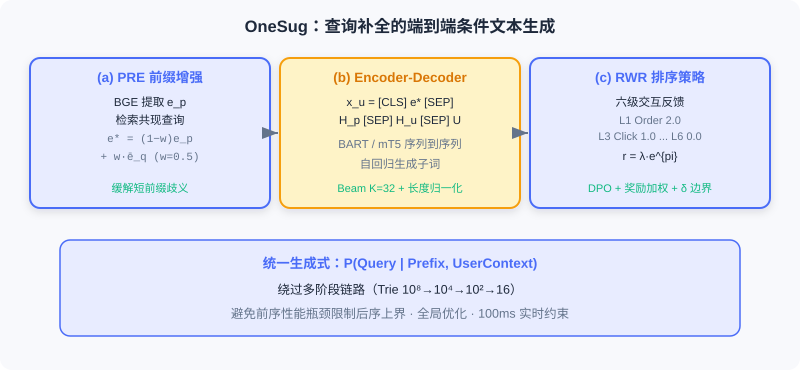
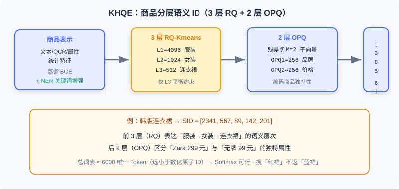

<div class="badge-row">
  <span style="background: #f0f4ff; color: #4A6CF7; padding: 4px 12px; border-radius: 20px; font-size: 0.85em; font-weight: 600; border: 1px solid rgba(74,108,247,0.2);">📖</span>
  <span style="background: #fef9ec; color: #d97706; padding: 4px 12px; border-radius: 20px; font-size: 0.85em; border: 1px solid rgba(100,100,100,0.15);">⏱️ ~45 min read</span>
  <span style="background: #fef9ec; color: #d97706; padding: 4px 12px; border-radius: 20px; font-size: 0.85em; border: 1px solid rgba(100,100,100,0.15);">🎯 Intermediate-Advanced</span>
</div>

# 端到端生成式搜索

> 📝 **Before You Continue:** 建议先读 [8.1](./e2e-recommendation.md) 的语义 ID 与 Encoder-Decoder 思路——本节把同一套生成式哲学迁移到「文本查询 → 商品结果」的跨模态匹配，但业务约束更尖锐。

[8.1](./e2e-recommendation.md) 的 OneRec 输入与输出都是 **封闭词表** 的物品 ID。电商搜索则截然不同：用户用 **明确的文本查询** 表达意图，系统需在强相关性约束下从海量商品库返回精准匹配。这种「文本查询 → 商品结果」涉及 **开放词表** （任意查询）与 **封闭词表** （有限商品库）的混合，以及查询理解、语义匹配、个性化排序等多层次任务。

传统电商搜索同样是 MCA：查询理解（纠错/改写/意图）→ 召回（倒排+向量）→ 预排序 → 精排，存在查询与商品检索解耦、冷启动长尾、标题关键词堆砌噪声三大问题。**OneSug** 与 **OneSearch** 分别针对搜索链路的前半段（查询补全）与后半段（商品检索）提出端到端生成式方案，共享统一架构哲学，但在输入输出空间、ID 设计上有不同权衡。

读完本章，你将能够：

- 说明 **OneSug** 如何把查询补全重定义为条件文本生成，并用 PRE 模块增强短前缀
- 描述 **RWR 策略** 如何用六级交互反馈把业务价值注入排序
- 解释 **OneSearch** 的 KHQE 如何用「3 层语义 + 2 层 OPQ」平衡语义层次与商品独特性
- 复述 **Mu-Seq** 的三视角用户建模与 **PARS** 的偏好感知奖励
- 完成 5 道分层练习题，巩固前缀增强、语义 ID 编码与约束解码

---

## 8.2.0 电商搜索的三大独特挑战

与视频推荐相比，电商商品检索约束更复杂：

1. **强相关性是第一优先级。** 推荐可基于历史推风格相似但类目不同的商品；搜索则不可妥协——用户搜「红色连衣裙」，即便他常买蓝色商品，返回「蓝色连衣裙」也是严重相关性违反。系统必须 **先满足相关性，再优化个性化**。
2. **商品信息充斥噪声与冗余。** 商家在标题堆砌大量关键词（「2024新款韩版修身显瘦长袖连衣裙女学生小个子甜美气质裙子百搭」），传统文本编码器被冗余淹没，难识别核心属性。
3. **语义层次与商品独特性的平衡。** 既要理解类目层次（服装→女装→连衣裙→韩版连衣裙）做粗粒度匹配，又要保留每件商品的独特属性（款式/品牌/价格），否则所有「韩版连衣裙」会被映射到相同表示。

> 💡 **Key Insight:** 搜索的端到端难点，本质是在「生成」与「强约束」之间走钢丝——生成的自由度高，但相关性是不可逾越的底线。这正是 OneSearch 在奖励系统中把相关性权重放大 10 倍的原因。

---

## 8.2.1 OneSug：查询补全生成

查询补全是搜索第一道关口：用户输入前缀「红色连」，系统需实时生成完整查询候选（「红色连衣裙」「红色连帽衫」）。传统 MCA 用前缀树（Trie）从 $10^8$ 候选粗召回到 $10^4$，再预排序到 $10^2$、精排展示 16 个，存在前序性能瓶颈限制后续上界、各阶段目标冲突两大问题。

OneSug 把查询补全重定义为 **端到端的条件文本生成任务** ：

$$P(\text{Query} | \text{Prefix}, \text{UserContext})$$

绕过传统多阶段链路。其核心挑战：短前缀语义歧义（「苹」可能指水果或手机）、个性化与流行度平衡、多级反馈精细化建模、100ms 实时性约束。

### 编码器：前缀增强与多源特征

**前缀-查询语义对齐。** 对纯文本前缀 $p$ 用预训练 Text Encoder（BGE）提取 $\boldsymbol{e}_p \in \mathbb{R}^{768}$。但通用 NLP 模型在电商语义空间有偏差，OneSug 对 BGE 做领域对齐微调：从日志挖高质量 prefix-query 与 query-query 共现对，对比学习拉近协同相关查询：

$$\mathcal{L}_{\text{align}} = -\log \frac{\exp(\text{sim}(\boldsymbol{e}_{q_i}, \boldsymbol{e}_{q_j}) / \tau)}{\sum_{q_k \in \mathcal{B}} \exp(\text{sim}(\boldsymbol{e}_{q_i}, \boldsymbol{e}_{q_k}) / \tau)}$$

对齐后 BGE 在查询检索任务上的语义相关性从 0.67 升至 0.81。

**前缀表示增强（PRE 模块）。** 短前缀表示不足，PRE 从历史日志检索与此外共现的高质量查询集合 $\{\bar{q}_1^c, \ldots, q_k^c\}$，平均嵌入加权融合：

$$\bar{\boldsymbol{e}_q^c} = \frac{1}{k} \sum_{i=1}^{k} \boldsymbol{e}_{q_i}^c, \quad \boldsymbol{e}_p^* = (1 - w) \cdot \boldsymbol{e}_p + w \cdot \bar{\boldsymbol{e}_q^c}, \quad w = 0.5$$

消融显示 $w=0.5$ 时 MRR 比无增强提升 2.3%，但 $w>0.7$ 引入噪声致性能下降。为高效检索，OneSug 用 **RQ-VAE** 把查询编码为分层离散码（4 层，每层码本 512），推理时从粗到细层级匹配，复杂度从向量检索的 $O(N\cdot d)$（$N$ 为全部候选物品数）降为逐层码本查找的 $O(C\cdot W)$——与候选规模 $N$ 无关，只随层数 $C$ 和码本大小 $W$ 线性增长。

**用户特征。** 整合短期历史查询 $\mathcal{H}_u$（最近 $n=10$ 条，超过会引噪声使 MRR 降 1.2%）与静态画像 $\mathcal{U}$。注意 OneSug **不引入商品交互特征**——查询补全发生在用户输入阶段，尚无商品曝光。编码器输入构造为：

$$x_u = \{t_{\text{[CLS]}}, \boldsymbol{e}_p^*, t_{\text{[SEP]}}, \mathcal{H}_p, t_{\text{[SEP]}}, \mathcal{H}_u, t_{\text{[SEP]}}, \mathcal{U}\}$$



### 解码器与 RWR 排序策略

解码器用标准 Causal Transformer 自回归生成子词，训练最小化 NTP 损失。推理用 **Beam Search** （束宽 $K=32$），并引入长度归一化避免偏好短查询：

$$\text{Score}(q) = \frac{1}{|q|^\alpha} \sum_{t=1}^{|q|} \log P(q_t | q_{<t}, \boldsymbol{Z}_{enc}), \quad \alpha \in [0.6, 0.8]$$

仅靠 NTP 的生成模型无法区分候选的业务价值。**RWR（Reward-Weighted Ranking）** 把六级交互反馈转为精细化偏好信号：

| 层级 | 反馈类型 | 业务含义 | 基础权重 $\lambda$ |
|------|----------|----------|------------------|
| Level 1 | Order | 通过该查询完成购买 | 2.0 |
| Level 2 | Item Click | 点击查询返回的商品 | 1.5 |
| Level 3 | Click | 点击该查询 | 1.0 |
| Level 4 | Show | 展示未点击 | 0.5 |
| Level 5 | Not Show | 召回池未展示 | 0.2 |
| Level 6 | Rand | 随机负样本 | 0.0 |

对每个 <前缀, 查询> 对，奖励 $r(x_u, q) = \lambda \cdot e^{pi}$（$pi$ 是该查询在对应层级的归一化频率），使高频交互查询获更高奖励。从 6 层构造 9 类偏好对，偏好差异 $rw_{\Delta} = 1.0 / (r(x_u, q_w) - r(x_u, q_l))$。最终在 DPO 损失上引入奖励加权与边界 $\delta$：

$$\mathcal{L}_{\text{pair-wise}} = -\mathbb{E} \left[ \log \sigma \left( rw_{\Delta} \cdot \max(0, \hat{r}_\theta(x_u, q_w) - \hat{r}_\theta(x_u, q_l) - \delta) \right) + \alpha \log \pi_\theta(q_w | x_u) \right]$$

> **Analysis:** OneSug 把查询补全从 MCA 变为端到端生成式。PRE 解决短前缀歧义，六级反馈构建的奖励系统精准建模偏好差异。统一框架不仅简化架构，更能全局优化、避免前序瓶颈。代价是 Beam Search 与 RWR 对齐需额外推理开销，须控制在 100ms 内。

---

## 8.2.2 OneSearch：商品检索生成

用户敲下「红色连衣裙」后，系统需一秒内从数亿商品中找最相关结果。OneSearch 把「查询 → 召回 → 预排序 → 精排」统一为端到端序列生成：

$$P(\text{商品序列} | \text{查询}, \text{用户上下文})$$

即直接输入查询文本与用户行为特征，输出有序商品列表。它设计四个核心模块： **KHQE** （关键词增强分层量化编码）、**Mu-Seq** （多视角行为序列注入）、**统一 Encoder-Decoder 生成架构**、**PARS** （偏好感知奖励系统）。

### KHQE：关键词增强的分层量化编码

**核心问题：在生成式框架中，如何表示数亿个商品？** 原子 ID 有两大致命问题：词表 $O(|\mathcal{V}|)$ 使 Softmax 不可行；原子 ID 是随机数字，不含语义。

OneSearch 用 **分层语义 ID** ：商品映射为多层离散码序列 $[L1, L2, L3, OPQ1, OPQ2]$。例如某韩版连衣裙编码为 $[3856, 724, 385, 142, 201]$，词表约 6000 个唯一 Token，远小于数亿。前 3 层保语义层次，后 2 层保商品独特性。

**商品表示学习。** 文本、结构化属性、统计特征经蒸馏 BGE 得初始嵌入 $\boldsymbol{e}_i$，再用多类对齐任务同时捕获语义与协同：query-query / item-item 对比、query-item 对比、分层反馈对齐（曝光/点击/下单赋不同 Margin）、难样本相关性校正（用 LLM 评边界样本）。

**核心关键词增强。** 标题的营销词（「爆款」「包邮」）稀释核心属性。OneSearch 用 NER 构建 18 类属性词表，以 **Aho-Corasick 自动机** （$O(n)$ 多模式匹配）在标题快速匹配核心词，50%-50% 加权增强：

$$\boldsymbol{e}^o_i = \frac{1}{2} \left( \boldsymbol{e}_i + \frac{1}{n} \sum_{j=1}^{n} \boldsymbol{e}_{k_j} \right)$$



**RQ-Kmeans 语义层次编码。** 逐层提取语义、残差传下层：L1（码本 4096）捕最粗类目（服装/数码/食品），L2（1024）细分层（女装/男装），L3（512）捕细粒度（连衣裙/ T 恤）。关键优化： **仅在 L3 应用平衡 K-means**——早期层强制平衡会导致层次聚类崩溃、丧失语义区分度。

**OPQ 商品独特性编码。** 3 层 RQ 后残差仍含独特属性（款式/品牌/价格）。若只用前 3 层，两件「韩版连衣裙」（一件 Zara 299 元、一件无牌 99 元）会被视为完全相同。于是引入 **OPQ（Optimized Product Quantization）** 把残差切分 $M=2$ 子向量分别 K-means（码本 256）：

$$\text{SID}_i = [\text{L1}, \text{L2}, \text{L3}, \text{OPQ1}, \text{OPQ2}]$$

> 为何不对所有层用 OPQ？实验发现会破坏层次语义性、性能大幅下降——失去「粗到细」的渐进生成模式。

### Mu-Seq：多视角行为序列注入

**行为序列驱动的用户 ID。** 不用随机哈希 ID，而用行为序列构造 User ID：短期点击 $\{s_1,\ldots,s_m\}$ 与长期点击 $\{l_1,\ldots,l_n\}$ 各自加权求和（权重 $\lambda_i \propto \exp(\sqrt{i})$，越近权重越高但不激进），向上取整后拼接（总长 10）。好处：兴趣相似用户得相近 ID；冷启动可用平台「查询→Top 点击」作默认序列。

**显式短期序列注入。** 最近历史查询与点击商品显式放入输入：查询用原始文本（短，直接 Tokenize），商品用语义 ID（标题冗长，更紧凑）；长度限制（查询 $n\le 10$、点击 $m\le 20$）。

**滑动窗口数据增强。** 完整序列 $[i1..i5]$ 传统只生成 1 样本，OneSearch 用最大窗口 $m=5$ 生成多个，让模型学习兴趣演化、自然处理冷启动。

**Q-Former 长期序列压缩。** 活跃用户可能有数千至上万长期行为。按行为类型（点击/下单/RSU）分层聚合为 $3\times 3=9$ 个向量，再用 $N_q=128$ 个可学习查询向量经交叉注意力提取固定长度表示 $\boldsymbol{Q}_{\text{long}} \in \mathbb{R}^{128\times 768}$，无论历史多长都不显著增加计算。

### 统一 Encoder-Decoder 生成架构

OneSearch 选 **BART** （Encoder-Decoder，编码器双向建模、解码器自回归，且有良好预训练权重与工业加速优化）。编码器输入异构序列（离散 Token + 连续向量），输出 $\boldsymbol{Z}_{enc} \in \mathbb{R}^{L\times d}$。

解码器逐 Token 生成目标商品 5 层语义 ID，以 $[3856,724,385,142,201]$ 为例：

```
步骤 0：输入 [BOS]           → 预测 L1 = 3856
步骤 1：输入 [BOS, 3856]    → 预测 L2 = 724
步骤 2：输入 [BOS, 3856, 724] → 预测 L3 = 385
步骤 3：输入 [BOS, ..., 385] → 预测 OPQ1 = 142
步骤 4：输入 [BOS, ..., 142] → 预测 OPQ2 = 201
```

每步经 Causal Self-Attention 与 Cross-Attention，Softmax 预测下一 Token：

$$P(\text{Token}_t | \text{Token}_{<t}, \boldsymbol{Z}_{enc}) = \text{Softmax}(\boldsymbol{W}_{\text{vocab}} \boldsymbol{h}_t^{\text{dec}})$$

训练目标为最大化真实 SID 对数似然 $\mathcal{L}_{\text{NTP}} = -\sum_{t=1}^5 \log P(\text{Token}_t^{\text{true}} | \cdot)$。推理用 **Beam Search** ，可选约束搜索（强制每层 Token 来自有效 SID 池，确保对应真实商品）或非约束搜索。


### PARS：偏好感知奖励系统

仅靠 NTP 的模型只学到「哪些商品与查询共现」，没学到「用户更偏好哪些」。PARS 含 **多阶段监督微调** 与 **自适应奖励系统**。

**多阶段 SFT。** 阶段一语义内容对齐（文本↔SID、文本→类目），阶段二共现关系同步（query↔item 文本与 SID 层面的协同），阶段三用户个性化建模（引入完整用户上下文）。

**自适应奖励信号。** 用户交互分 6 层（搜索下单 2.0 / 推荐同类目下单 1.5 / 点击 1.0 / 曝光未点 0.5 / 同类目未展示 0.2 / 随机 0.0）。为避免新商品曝光少致偏差，用对数平滑算 CTR、CVR，奖励为调和平均：

$$r(q, i) = 2\lambda \cdot \frac{Ctr \cdot Cvr}{Ctr + Cvr}, \quad rw_\Delta = \frac{1.0}{r(q, i_{\text{pos}}) - r(q, i_{\text{neg}})}$$

**奖励模型（三塔 SIM）。** CTR 塔 / CVR 塔 / CTCVR 塔分别预测，综合分数 $RScore = \lambda_1\cdot CTR + \lambda_2\cdot CVR + \lambda_3\cdot CTCVR + 10\cdot\lambda_4\cdot S_{Rel}$——**离线相关性分数 $S_{Rel}$ 权重放大 10 倍** ，确保先满足相关性再优化个性化。

**混合排序框架。** 基于奖励模型做 **List-wise DPO** ：采样 512 候选，对排序发生变化的样本训练，损失结合 DPO 与 SFT 目标，既学偏好排序又保持生成能力。上线后持续用真实交互（Level 1-3 正、Level 4-6 负）做近实时在线学习。

> **Analysis:** OneSearch 用 KHQE 的「3+2」语义 ID 优雅平衡了语义层次与商品独特性；Mu-Seq 三视角建模兼顾相关性与个性化；PARS 把相关性作为硬约束（×10）嵌入奖励。整条链路从 MCA 的多阶段变为单一生成模型，但代价是训练数据工程（对齐、滑动窗口、多阶段 SFT）与推理时 Beam Search 的延迟控制。

---

## ⚠️ Common Mistakes in 8.2

| # | Mistake | Example | Why It's Wrong | Fix |
|---|---------|---------|---------------|-----|
| 1 | 把搜索当推荐优化 | 「搜红色连衣裙也推蓝色款」 | 搜索强相关性不可妥协 | 先满足相关性再个性化（奖励×10） |
| 2 | 忽视前缀语义歧义 | OneSug 直接编码 1 字前缀 | 短前缀无明确意图信号 | 用 PRE 模块检索共现查询增强 |
| 3 | KHQE 全用 OPQ | 「5 层都 OPQ 更细」 | 破坏粗→细层次语义 | 前 3 层 RQ 保层次，后 2 层 OPQ 保独特 |
| 4 | L1/L2 强制平衡 K-means | 「每层都平衡更均匀」 | 早期层平衡致层次聚类崩溃 | 仅在 L3 应用平衡约束 |
| 5 | 混淆 SID 与原子 ID | 「直接用 item_123 当词表」 | 数亿词表使 Softmax 爆炸 | 分层语义 ID 压缩到约 6000 词表 |

---

## 本章小结

### 📌 Key Takeaways

| Concept | Key Points | Why It Matters |
|---------|-----------|----------------|
| OneSug | 条件文本生成 + PRE 前缀增强 + RWR 六级反馈 | 查询补全从 MCA 变端到端生成 |
| KHQE | 3 层 RQ-Kmeans（语义）+ 2 层 OPQ（独特） | 数亿商品压缩到可控语义 ID |
| Mu-Seq | 行为序列 UserID + 短期显式 + Q-Former 长期压缩 | 相关性优先下的个性化建模 |
| PARS | 多阶段 SFT + 自适应奖励 + 相关性×10 | 先保相关性，再优化偏好 |
| Beam Search | 约束/非约束两种，SID 池过滤非法 | 生成真实商品、控延迟 |

### ❓ FAQ

**Q1: OneSug 为何不引入商品交互特征？**
> A: 查询补全发生在用户输入阶段，此时还没有商品曝光行为。引入商品特征既无数据支撑，也会让前缀表示被无关信号污染。它只用前缀、历史查询与静态画像。

**Q2: 为什么 KHQE 前 3 层用 RQ-Kmeans、后 2 层用 OPQ，而不是全部 RQ？**
> A: 前 3 层要表达「服装→女装→连衣裙」的渐进类目层次，RQ 的残差传递天然契合；后 2 层要编码残差中的独特属性，OPQ 的子向量独立量化更适配。全 OPQ 会丢失层次语义性。

**Q3: PARS 把相关性权重放大 10 倍，会不会伤害个性化？**
> A: 恰恰是保护个性化——它先保证「不返回不相关商品」，再在相关集合内用 CTR/CVR 等优化个性化。这避免了推荐系统常见的「相关性漂移」。

### 🔗 前后关联

- **8.1** （端到端生成式推荐）的语义 ID 与 Enc-Dec 是本节的方法基础，OneSug/OneSearch 是其跨模态延伸。
- **8.3** （端到端生成式广告）在生成式中再叠加竞价机制与经济学约束。
- **2.3** （双塔）的向量检索思路，被 OneSearch 用语义 ID + Beam Search 的「生成式检索」替代。
- **6.x** （生成式基础）的 RQ-VAE 量化，在本节以 RQ-Kmeans（OneSearch）/ RQ-VAE（OneSug）两种形态出现。

---

## Practice Problems

Work through all problems in order — they get progressively harder. Each has a complete solution you can reveal after trying it yourself.

---

**Problem 8.2.1 — PRE 增强计算** 🟢 Easy

前缀嵌入 $\boldsymbol{e}_p=(0.2, 0.6)$，相关查询平均嵌入 $\bar{\boldsymbol{e}}_q^c=(0.4, 0.2)$。PRE 模块权重 $w=0.5$，求增强后 $\boldsymbol{e}_p^*$。若 $w=0.9$ 会有什么趋势？

<details>
<summary>💡 Solution (click to reveal)</summary>

**Approach:** 加权平均。

$$\boldsymbol{e}_p^* = (1-0.5)\cdot(0.2,0.6) + 0.5\cdot(0.4,0.2) = 0.5\cdot(0.2,0.6)+0.5\cdot(0.4,0.2)$$
$$= (0.1, 0.3) + (0.2, 0.1) = (0.3, 0.4)$$

若 $w=0.9$：$\boldsymbol{e}_p^* = 0.1\cdot(0.2,0.6)+0.9\cdot(0.4,0.2)=(0.02,0.06)+(0.36,0.18)=(0.38,0.24)$，前缀自身信号被大幅稀释，过度依赖共现查询——正是文中 $w>0.7$ 引入噪声、性能下降的原因。

**Key points:**
- $w=0.5$ 是经验最优平衡点。
- 过大 $w$ 让前缀「变成别人」，丢失用户真实输入信号。

</details>

---

**Problem 8.2.2 — KHQE 编码空间** 🟢 Easy

某商品经 KHQE 得 SID $[L1=2341, L2=567, L3=89, OPQ1=142, OPQ2=201]$，各层码本大小分别为 4096 / 1024 / 512 / 256 / 256。问：(a) 总词表唯一 Token 数约多少？(b) 该编码如何同时体现「语义层次」与「商品独特性」？

<details>
<summary>💡 Solution (click to reveal)</summary>

**Approach:** 词表唯一 Token 数为各层码本之和（不同层码字独立编号）。

- (a) $4096+1024+512+256+256 = 6144 \approx 6000$ 个唯一 Token。
- (b) 前 3 层 RQ-Kmeans：L1=2341（服装）、L2=567（女装-裙装）、L3=89（连衣裙-韩版）体现由粗到细的类目层次；后 2 层 OPQ 编码残差中的独特属性（款式/品牌/价格），使两件同「韩版连衣裙」也能被区分。

**Key points:**
- 总词表远小于数亿原子 ID，Softmax 可行。
- 「层次 + 独特」是 KHQE 设计的核心张力平衡。

</details>

---

**Problem 8.2.3 — 行为序列 User ID 构造** 🟡 Medium

用户短期点击商品的语义 ID 为 $sid_1=100, sid_2=200, sid_3=300$（按时间从早到晚），权重 $\lambda_i \propto \exp(\sqrt{i})$。求归一化权重 $\lambda_1,\lambda_2,\lambda_3$（保留 3 位小数），并说明为何用 $\sqrt{i}$ 而非线性 $i$。

<details>
<summary>💡 Solution (click to reveal)</summary>

**Approach:** 计算 $\exp(\sqrt{i})$ 再归一化。

$\sqrt{1}=1,\; \sqrt{2}\approx1.414,\; \sqrt{3}\approx1.732$
$e^1=2.718,\; e^{1.414}\approx4.113,\; e^{1.732}\approx5.652$
和 $= 2.718+4.113+5.652 = 12.483$
$\lambda_1=2.718/12.483\approx0.218,\; \lambda_2=4.113/12.483\approx0.329,\; \lambda_3=5.652/12.483\approx0.453$

越近行为权重越高（0.218 < 0.329 < 0.453）。用 $\sqrt{i}$ 而非线性 $i$：线性衰减（如 $\propto i$）会让最近行为权重爆炸式主导、早期行为几乎归零；$\sqrt{i}$ 是「温和递增」，既体现时序远近，又保留较早行为的贡献，避免过激遗忘长期兴趣。

**Key points:**
- 权重反映时间远近但不激进。
- 这是用「软衰减」平衡短期意图与长期偏好。

</details>

---

**Problem 8.2.4 — 约束 Beam Search 的非法过滤** 🔴 Hard

OneSearch 解码生成 5 层 SID，约束搜索要求每层 Token 必须来自有效 SID 池（真实商品集合）。假设第 1 层候选 Token 共 4096 个，其中有效 SID 池在第 1 层只覆盖 2000 个；Beam 宽度 $K=32$。对比「约束搜索」与「非约束搜索」在 (a) 生成合法性、(b) 单步候选数上的差异，并说明为何约束搜索能降延迟。

<details>
<summary>💡 Solution (click to reveal)</summary>

**Approach:** 分析搜索空间与后处理。

- (a) 约束搜索：每层只在有效池（第 1 层 2000 个、逐层收窄）内解码，生成序列必对应真实商品，无「幻觉 SID」；非约束搜索：允许任意 Token 组合，可能生成不映射真实商品的非法 SID，需在后处理过滤。
- (b) 单步候选：约束搜索第 1 步最多 2000 候选（且后续层随树收窄更小）；非约束搜索每步固定 4096 候选。约束搜索实际搜索空间 $\le |\mathcal{X}_{\text{valid}}|$，远小于 $W^5$。
- 延迟：约束搜索在解码早期就剔除非法分支，避免非约束生成大量无效候选后再过滤；结合 Trie 前缀树（见 8.3 的 GPR），可将搜索空间从 $W^C$ 缩到有效商品数，显著降低每步计算。

**Key points:**
- 约束搜索 = 把「合法性」做成解码时的硬 mask。
- 这是生成式检索落地的关键工程技巧。

</details>

---

**🏆 Challenge: 设计搜索端到端落地论证**

某电商搜索当前 MCA 在「红色连衣裙」查询下常返回蓝色款（相关性漂移）。请写约 160 字，说明引入 OneSearch 类端到端生成式架构时：(1) 应优先改哪一环节；(2) KHQE 与 PARS 中哪两个设计能直接缓解该问题；(3) 需警惕什么新风险？

<details>
<summary>💡 Hint</summary>

(1) 优先替换「查询理解 + 召回 + 精排」为统一 Enc-Dec 生成，消除意图在阶段间损失。(2) KHQE 的分层语义 ID 让「红色连衣裙」与「蓝色连衣裙」在 L3 层即区分；PARS 把离线相关性分数 $S_{Rel}$ 权重放大 10 倍，强制先满足相关性。(3) 新风险：Beam Search 延迟、训练数据工程复杂（多阶段 SFT、滑动窗口）、以及生成式检索的不可解释性带来的bad case 定位困难。

</details>
